# 基础数学：知识依赖图 (BasicMath: Knowledge Dependency Graph)

## 1. 概述 (Overview)

数学知识并非线性序列，而是形成一张**有向无环图 (Directed Acyclic Graph, DAG)**。每个节点代表一个知识模块，箭头表示先修关系：**A → B** 表示「A 是 B 的先修知识」，即学习 B 之前应掌握 A。

理解这一依赖结构有助于：

- **合理规划学习顺序**：避免因前置知识不足而困惑
- **识别可并行学习的模块**：提高学习效率
- **把握跨领域联系**：同一概念在不同章节中的深化与应用

---

## 2. 推荐学习路径 (Recommended Learning Path)

### 主路径 (Main Path)

建议的线性阅读顺序：

| 阶段 | 内容 | 说明 |
|------|------|------|
| **Part 1** | 逻辑 → 集合 → 证明 | 建立数学思维的底层语言 |
| **Part 2** | 数系 → 实数深入 → 数论 | 数系建构与初等数论 |
| **Part 3** | 方程 → 不等式 → 多项式 → 复数代数 → 抽象代数 | 代数工具链 |
| **Part 4** | 函数概念 → 指数对数 → 三角 → 反三角 → 参数极坐标 | 函数深化 |
| **Part 5** | 欧氏几何 → 解析几何 → 圆锥曲线 → 变换 → 向量 | 几何与空间直觉 |
| **Part 6** | 数列 → 极限 → 连续 → 级数 → 微积分直觉 | 分析预备 |

### 并行分支 (Parallel Branches)

**Part 7（组合）→ Part 8（概率）**：可与 Part 4–6 并行学习，仅依赖 Part 3 的代数基础。

**Part 9（线性代数）**：需在 **Part 3 完成** 且 **Part 5 Ch05（向量几何）** 完成后开始。

### 提前起步 (Early Start)

**Part 5 Ch01（欧氏几何）** 可在 Part 1 完成后就开始学习，因其主要依赖逻辑与证明，不依赖代数。

---

## 3. 主依赖图 (Main Dependency Graph)

以下为 Mermaid 语法的依赖图，按 Part 分组展示，节点编号格式为 `PxCySz`（Part x - Chapter y - Section z）。

```mermaid
graph TD
    subgraph P1["Part 1: 基础 Foundations"]
        P1C1S1[P1C1S1 命题逻辑]
        P1C1S2[P1C1S2 谓词逻辑]
        P1C2S1[P1C2S1 集合运算]
        P1C2S2[P1C2S2 关系]
        P1C2S3[P1C2S3 函数集合论]
        P1C2S4[P1C2S4 基数]
        P1C3S1[P1C3S1 直接证明]
        P1C3S2[P1C3S2 反证法]
        P1C3S3[P1C3S3 数学归纳法]
        P1C3S4[P1C3S4 构造与反例]
    end

    subgraph P2["Part 2: 数系与数论 Number Systems"]
        P2C1S1[P2C1S1 自然数整数]
        P2C1S2[P2C1S2 有理数]
        P2C1S3[P2C1S3 实数]
        P2C1S4[P2C1S4 复数引入]
        P2C2S1[P2C2S1 实数性质]
        P2C2S2[P2C2S2 完备性]
        P2C3S1[P2C3S1 整除质数]
        P2C3S2[P2C3S2 同余模运算]
        P2C3S3[P2C3S3 丢番图方程]
    end

    subgraph P3["Part 3: 代数 Algebra"]
        P3C1S1[P3C1S1 一二元方程]
        P3C1S2[P3C1S2 方程组]
        P3C1S3[P3C1S3 高次方程]
        P3C2S1[P3C2S1 基本不等式]
        P3C2S2[P3C2S2 经典不等式]
        P3C3S1[P3C3S1 多项式基础]
        P3C3S2[P3C3S2 多项式根]
        P3C4S1[P3C4S1 复数运算]
        P3C4S2[P3C4S2 复数极坐标]
        P3C5S1[P3C5S1 群的概念]
    end

    subgraph P4["Part 4: 函数 Functions"]
        P4C1S1[P4C1S1 函数深化]
        P4C1S2[P4C1S2 复合与反函数]
        P4C2S1[P4C2S1 指数函数]
        P4C2S2[P4C2S2 对数函数]
        P4C3S1[P4C3S1 三角几何]
        P4C3S2[P4C3S2 三角性质]
        P4C3S3[P4C3S3 三角恒等式]
        P4C4S1[P4C4S1 反三角函数]
        P4C5S1[P4C5S1 参数方程]
        P4C5S2[P4C5S2 极坐标]
    end

    subgraph P5["Part 5: 几何 Geometry"]
        P5C1S1[P5C1S1 公理化]
        P5C1S2[P5C1S2 三角形]
        P5C1S3[P5C1S3 圆]
        P5C1S4[P5C1S4 面积体积]
        P5C2S1[P5C2S1 坐标系直线]
        P5C2S2[P5C2S2 圆的方程]
        P5C3S1[P5C3S1 椭圆]
        P5C3S2[P5C3S2 双曲线]
        P5C3S3[P5C3S3 抛物线]
        P5C3S4[P5C3S4 圆锥曲线统一]
        P5C4S1[P5C4S1 几何变换]
        P5C5S1[P5C5S1 向量基础]
        P5C5S2[P5C5S2 内积]
        P5C5S3[P5C5S3 向量积]
    end

    subgraph P6["Part 6: 分析预备 Analysis Prep"]
        P6C1S1[P6C1S1 数列概念]
        P6C1S2[P6C1S2 数列极限]
        P6C2S1[P6C2S1 函数极限]
        P6C2S2[P6C2S2 无穷大无穷小]
        P6C3S1[P6C3S1 连续函数]
        P6C3S2[P6C3S2 连续性质]
        P6C4S1[P6C4S1 无穷级数]
        P6C4S2[P6C4S2 收敛判别]
        P6C4S3[P6C4S3 幂级数]
        P6C5S1[P6C5S1 导数直觉]
        P6C5S2[P6C5S2 积分直觉]
        P6C5S3[P6C5S3 Euler公式]
    end

    subgraph P7["Part 7: 组合 Combinatorics"]
        P7C1S1[P7C1S1 加减法原理]
        P7C1S2[P7C1S2 容斥原理]
        P7C2S1[P7C2S1 排列]
        P7C2S2[P7C2S2 组合]
        P7C2S3[P7C2S3 组合恒等式]
        P7C3S1[P7C3S1 二项式定理]
        P7C3S2[P7C3S2 多项式定理]
        P7C4S1[P7C4S1 图基本概念]
        P7C4S2[P7C4S2 欧拉哈密顿]
    end

    subgraph P8["Part 8: 概率 Probability"]
        P8C1S1[P8C1S1 概率概念]
        P8C1S2[P8C1S2 概率性质]
        P8C2S1[P8C2S1 条件概率]
        P8C2S2[P8C2S2 贝叶斯定理]
        P8C2S3[P8C2S3 独立性]
        P8C3S1[P8C3S1 离散随机变量]
        P8C3S2[P8C3S2 常见分布]
        P8C4S1[P8C4S1 期望]
        P8C4S2[P8C4S2 方差]
        P8C5S1[P8C5S1 大数定律]
    end

    subgraph P9["Part 9: 线性代数 Linear Algebra"]
        P9C1S1[P9C1S1 向量空间直觉]
        P9C1S2[P9C1S2 线性相关与基]
        P9C2S1[P9C2S1 矩阵运算]
        P9C2S2[P9C2S2 特殊矩阵]
        P9C3S1[P9C3S1 高斯消元]
        P9C3S2[P9C3S2 解的结构]
        P9C4S1[P9C4S1 行列式]
        P9C4S2[P9C4S2 行列式应用]
    end

    %% Part 1 内部
    P1C1S1 --> P1C1S2
    P1C1S1 --> P1C2S1
    P1C2S1 --> P1C2S2 --> P1C2S3 --> P1C2S4
    P1C1S1 --> P1C3S1
    P1C2S1 --> P1C3S1
    P1C1S2 --> P1C3S2
    P1C1S2 --> P1C3S3
    P1C3S1 --> P1C3S2 --> P1C3S3 --> P1C3S4

    %% Part 1 → Part 2
    P1C2S1 --> P2C1S1
    P1C2S1 --> P2C1S2
    P1C3S1 --> P2C1S1
    P1C3S1 --> P2C2S1
    P1C3S1 --> P2C3S1
    P1C3S1 --> P5C1S1

    %% Part 2 内部
    P2C1S1 --> P2C1S2 --> P2C1S3 --> P2C1S4
    P2C1S3 --> P2C2S1 --> P2C2S2
    P2C1S1 --> P2C3S1 --> P2C3S2 --> P2C3S3
    P2C2S2 --> P2C3S2

    %% Part 2 → Part 3
    P2C1S1 --> P3C1S1
    P2C1S2 --> P3C1S1
    P2C1S4 --> P3C4S1

    %% Part 3 内部
    P3C1S1 --> P3C1S2 --> P3C1S3
    P3C1S1 --> P3C2S1 --> P3C2S2
    P3C1S1 --> P3C3S1 --> P3C3S2
    P3C3S1 --> P3C4S1 --> P3C4S2
    P3C4S2 --> P3C5S1

    %% Part 3 → Part 4
    P3C1S1 --> P4C1S1
    P3C2S1 --> P4C1S1
    P4C1S1 --> P4C1S2
    P3C1S1 --> P4C2S1 --> P4C2S2
    P4C1S1 --> P4C3S1 --> P4C3S2 --> P4C3S3
    P4C3S3 --> P4C4S1
    P4C4S1 --> P4C5S1 --> P4C5S2

    %% Part 3 → Part 5
    P3C1S1 --> P5C2S1
    P3C1S2 --> P5C2S1

    %% Part 5 内部
    P5C1S1 --> P5C1S2 --> P5C1S3 --> P5C1S4
    P5C1S1 --> P5C2S1 --> P5C2S2
    P5C2S2 --> P5C3S1 --> P5C3S2 --> P5C3S3 --> P5C3S4
    P5C1S1 --> P5C4S1
    P5C1S1 --> P5C5S1
    P3C1S1 --> P5C5S1
    P5C5S1 --> P5C5S2 --> P5C5S3

    %% Part 4,5 → Part 6
    P4C1S1 --> P6C1S1
    P4C2S1 --> P6C1S1
    P6C1S1 --> P6C1S2
    P6C1S2 --> P6C2S1 --> P6C2S2
    P6C2S1 --> P6C3S1 --> P6C3S2
    P6C2S1 --> P6C4S1 --> P6C4S2 --> P6C4S3
    P6C3S1 --> P6C5S1
    P6C4S1 --> P6C5S2
    P3C4S2 --> P6C5S3
    P4C3S3 --> P6C5S3

    %% Part 3 → Part 7
    P3C1S1 --> P7C1S1
    P7C1S1 --> P7C1S2
    P7C1S1 --> P7C2S1 --> P7C2S2 --> P7C2S3
    P7C2S2 --> P7C3S1 --> P7C3S2
    P7C1S1 --> P7C4S1 --> P7C4S2

    %% Part 7 → Part 8
    P7C2S1 --> P8C1S1
    P7C2S2 --> P8C1S1
    P8C1S1 --> P8C1S2
    P8C1S2 --> P8C2S1 --> P8C2S2 --> P8C2S3
    P8C2S1 --> P8C3S1 --> P8C3S2
    P8C3S1 --> P8C4S1 --> P8C4S2
    P8C4S1 --> P8C5S1

    %% Part 3,5 → Part 9
    P5C5S1 --> P9C1S1
    P5C5S2 --> P9C1S1
    P9C1S1 --> P9C1S2
    P9C1S1 --> P9C2S1 --> P9C2S2
    P3C1S2 --> P9C3S1
    P9C2S1 --> P9C3S1 --> P9C3S2
    P9C1S1 --> P9C4S1 --> P9C4S2
    P9C3S1 --> P9C4S1
```

### 3.1 依赖关系文字描述 (Text-Based Dependency Description)

**Part 1（基础）**：命题逻辑是谓词逻辑、集合运算和所有证明方法的先修；集合运算依次通向关系、函数（集合论视角）、基数；逻辑与集合共同支撑直接证明，进而支撑反证法、归纳法与构造性证明。

**Part 1 → Part 2**：集合论为自然数、整数等的定义提供语言；证明方法贯穿数系建构与数论的严格讨论。欧氏几何仅需逻辑与证明，可与数系并行。

**Part 2（数系）**：自然数→整数→有理数→实数→复数构成数系链；实数深入讨论依赖实数引入；数论从自然数出发，同余依赖等价关系（P2C2 完备性相关）。复数引入是 Part 3 复数代数的基础。

**Part 2 → Part 3**：数系为方程、不等式提供运算对象；复数引入为复数代数奠基。

**Part 3（代数）**：方程支撑不等式与多项式；多项式支撑复数代数与抽象代数。方程组连接解析几何与线性代数。

**Part 3 → Part 4, 5**：方程与不等式支撑函数概念；方程支撑指数对数；函数概念贯穿三角、反三角、参数极坐标。方程支撑解析几何；欧氏几何与代数共同支撑向量几何。

**Part 4 → Part 6**：函数概念与指数函数支撑数列；数列→极限→连续→级数→微积分直觉形成分析主线。Euler 公式依赖复数代数与三角函数。

**Part 3 → Part 7 → Part 8**：代数支撑计数；计数→排列组合→二项式；计数支撑图论。排列组合是概率公理与随机变量的组合基础，概率章节内部为公理→条件概率→随机变量→期望方差→大数定律。

**Part 3 + Part 5 → Part 9**：向量几何是向量空间的几何直觉来源；方程组是线性代数方程组的特例。向量空间→矩阵→线性方程组→行列式形成线性代数学习链。

---

## 4. 跨领域联系表 (Cross-Domain Concept Links)

以下概念在教材中多次出现，下表列出其归属章节与关联章节：

| 概念 (Concept) | 归属章节 (Primary Section) | 关联章节 (Related Sections) |
|---------------|---------------------------|-----------------------------|
| **复数 (Complex Numbers)** | P2C1S4 复数引入；P3C4 复数代数 | P3C3 多项式根；P3C5 抽象代数；P4C5 极坐标；P6C5S3 Euler 公式 |
| **向量 (Vectors)** | P5C5 向量几何 | P9C1 向量空间；P9C2 矩阵；解析几何中的方向与长度 |
| **函数 (Functions)** | P1C2S3 函数集合论；P4C1 函数概念 | P4C2–C5 各类函数；P6 分析（极限、连续、级数）；贯穿全教材 |
| **概率 (Probability)** | P8 概率论（全部分） | P7 组合（计数）；P6C4 级数（期望中的无穷和）；统计应用 |
| **三角函数 (Trigonometric Functions)** | P4C3 三角函数 | P5C1 欧氏几何（三角学起源）；P3C3 多项式（Chebyshev）；P6C5S3 Euler 公式；P4C5 极坐标 |
| **圆锥曲线 (Conic Sections)** | P5C3 圆锥曲线 | P3C1 二次方程；P5C2 解析几何；P4C5 参数方程与极坐标 |
| **不等式 (Inequalities)** | P3C2 不等式 | P4C2 对数不等式；P6 分析（收敛判别中的估计）；P7C2 组合不等式 |

---

## 5. 分支路径说明 (Branch Path Notes)

### 严格顺序 (Strictly Sequential)

以下模块必须按箭头顺序学习，前后依赖强：

- **Part 1 内部**：逻辑 → 集合 → 证明
- **Part 2 数系**：自然数 → 有理数 → 实数 → 复数
- **Part 3 代数链**：方程 → 不等式；方程 → 多项式 → 复数代数 → 抽象代数
- **Part 4 函数链**：函数概念 → 指数对数 → 三角 → 反三角 → 参数极坐标
- **Part 5 几何链**：欧氏几何 → 解析几何 → 圆锥曲线；欧氏几何 → 向量
- **Part 6 分析链**：数列 → 极限 → 连续；数列 → 级数 → 微积分直觉
- **Part 7 → Part 8**：组合 → 概率（计数是概率的基石）
- **Part 9 内部**：向量空间 → 矩阵 → 线性方程组 → 行列式

### 可并行学习 (Parallel Tracks)

| 并行组 | 说明 |
|--------|------|
| **Part 4、5、6 与 Part 7、8** | Part 4–6 为分析主线，Part 7–8 为组合概率主线，两者仅共同依赖 Part 3，可交替或并行学习 |
| **Part 5 Ch01（欧氏几何）** | 可在 Part 1 完成后即开始，与 Part 2 并行 |
| **Part 5 Ch04（变换几何）** | 仅依赖欧氏几何，可与解析几何、圆锥曲线并行 |
| **Part 6C5S3（Euler 公式）** | 需复数代数 + 三角函数，可在完成 P3C4、P4C3 后单独学习 |

### 可选深度路径 (Optional Depth Paths)

- **抽象代数方向**：Part 3C5 → Part 9（群与向量空间的联系）
- **分析方向**：Part 6 全系列 → 微积分课程
- **应用方向**：Part 7–8 → 统计与机器学习基础

---

*返回 [README.md](README.md) | 建议从 [STUDY_GUIDE.md](STUDY_GUIDE.md) 开始学习*
