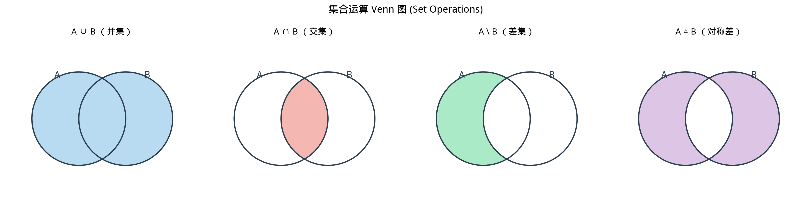

# §1 集合与集合运算（Sets and Set Operations）

**前置知识**：[第 1 章 §1 命题逻辑](../ch01-logic/01-propositions.md)、[第 1 章 §2 谓词逻辑](../ch01-logic/02-predicates.md)

**全景图**：集合是数学中最基本的概念之一——几乎所有的数学对象都可以用集合来定义。本节建立集合的基本语言：什么是集合、如何表示集合、集合之间的关系（子集、相等）、以及如何通过运算（并、交、补、差）构造新集合。这些概念和运算将贯穿本教材的每一章。你会发现，集合运算与第 1 章学习的逻辑联结词之间存在深刻的对应关系。

**预估学习时间**：约 2 小时

---

## 动机

数学的第一步是确定讨论的对象。当我们说"考虑所有的偶数"或"取满足 $x^2 < 10$ 的正整数"时，我们需要一种精确的方式来描述这些"对象的汇集"。这就是集合（set）的概念。

集合的思想非常自然——日常生活中我们也在不断地"分类"和"归类"。但日常的分类往往是模糊的（"高个子的人"——多高算高？），而数学要求精确性。集合论提供了这种精确性。

更深层地，集合论为整个数学提供了统一的语言。数（自然数、整数、实数）可以用集合来构造；函数是一种特殊的集合；几何图形是点的集合；概率空间是事件集合上的度量。掌握了集合论的语言，就掌握了阅读和书写现代数学的通行证。

---

## 1. 集合（Set）的概念

### 1.1 朴素定义

> **定义 1**（集合，set）
>
> 集合是由明确的、不同的对象组成的汇集。组成集合的对象称为该集合的**元素**（element）或**成员**（member）。

这是 Georg Cantor 在 19 世纪给出的朴素定义。"明确的"意味着对于任何对象，要么它属于这个集合，要么它不属于——没有模糊地带。"不同的"意味着集合中不存在重复的元素。

### 1.2 属于关系

如果 $x$ 是集合 $A$ 的元素，记作 $x \in A$，读作"$x$ 属于 $A$"（$x$ is an element of $A$）。如果 $x$ 不是 $A$ 的元素，记作 $x \notin A$。

用谓词逻辑的语言来说，$x \in A$ 是一个关于 $x$ 和 $A$ 的命题——它要么为真，要么为假。

**例子**：

- $3 \in \{1, 2, 3, 4, 5\}$（真）
- $7 \notin \{1, 2, 3, 4, 5\}$（真）
- $\pi \in \mathbb{R}$（真，$\pi$ 是实数）

### 1.3 集合的两个基本性质

1. **无序性**：集合中元素的列写顺序不影响集合本身。$\{1, 2, 3\} = \{3, 1, 2\} = \{2, 3, 1\}$。
2. **互异性**：集合中不允许重复元素。$\{1, 1, 2\}$ 就是 $\{1, 2\}$——重复列写不产生新元素。

---

## 2. 集合的表示

### 2.1 列举法（Roster Method）

直接列出所有元素，用花括号括起来：

$$A = \{1, 2, 3, 4, 5\}$$

$$B = \{a, e, i, o, u\}$$

对于有规律的集合，可以用省略号：

$$\mathbb{N}^+ = \{1, 2, 3, \ldots\}$$

$$E = \{2, 4, 6, 8, \ldots\} \quad \text{（正偶数集）}$$

### 2.2 描述法（Set-Builder Notation）

用一个性质（谓词）来描述元素：

$$A = \{x \mid P(x)\} \quad \text{或} \quad A = \{x : P(x)\}$$

读作"$A$ 是所有满足性质 $P(x)$ 的 $x$ 的集合"。竖线 $\mid$ 或冒号 $:$ 读作"使得"（such that）。

**例子**：

- $\{x \in \mathbb{Z} \mid x > 0\}$ = 所有正整数的集合 = $\mathbb{N}^+$（或 $\mathbb{Z}^+$）
- $\{x \in \mathbb{R} \mid x^2 - 1 = 0\} = \{-1, 1\}$
- $\{x \in \mathbb{N} \mid x \text{ 是偶数}\} = \{0, 2, 4, 6, \ldots\}$

描述法的优势在于它可以描述无穷集合和用列举法难以表达的集合。

> ⚠️ **警告**
>
> 描述法中的性质 $P(x)$ 必须是明确的——对每个 $x$，$P(x)$ 必须能判断真假。"所有有趣的数的集合"不是一个合法的集合描述，因为"有趣"不是一个明确的性质。
>
> 更深层地，不加限制地使用描述法会导致悖论（参见 [思考者角落：罗素悖论](thinkers-corner.md#1-罗素悖论russells-paradox)）。但在我们的讨论范围内，只要性质 $P(x)$ 是明确的数学命题，描述法就是安全的。

### 2.3 常见数集

数学中有一些标准的数集，使用特殊符号表示：

| 符号 | 名称 | 元素 |
|------|------|------|
| $\mathbb{N}$ | 自然数集（natural numbers） | $\{0, 1, 2, 3, \ldots\}$ |
| $\mathbb{Z}$ | 整数集（integers） | $\{\ldots, -2, -1, 0, 1, 2, \ldots\}$ |
| $\mathbb{Q}$ | 有理数集（rational numbers） | $\left\{\dfrac{p}{q} \;\middle|\; p, q \in \mathbb{Z},\, q \neq 0\right\}$ |
| $\mathbb{R}$ | 实数集（real numbers） | 所有实数（含有理数和无理数） |
| $\mathbb{C}$ | 复数集（complex numbers） | $\{a + bi \mid a, b \in \mathbb{R}\}$ |

它们之间的包含关系为：

$$\mathbb{N} \subseteq \mathbb{Z} \subseteq \mathbb{Q} \subseteq \mathbb{R} \subseteq \mathbb{C}$$

> **注意**：关于 $0$ 是否属于 $\mathbb{N}$，不同教材有不同约定。本教材约定 $0 \in \mathbb{N}$，即 $\mathbb{N} = \{0, 1, 2, 3, \ldots\}$。若需要不含 $0$ 的正整数集，记作 $\mathbb{N}^+$ 或 $\mathbb{Z}^+$。

### 2.4 空集（Empty Set）

> **定义 2**（空集，empty set）
>
> 不含任何元素的集合称为空集，记作 $\emptyset$ 或 $\{\}$。

$$\emptyset = \{x \mid x \neq x\}$$

由于没有对象满足 $x \neq x$，所以这个集合没有元素。

空集是唯一的——虽然有无穷多种方式描述它（如 $\{x \in \mathbb{R} \mid x^2 < 0\}$），但结果都是同一个集合。

> ⚠️ **警告**
>
> $\emptyset$ 和 $\{\emptyset\}$ 是不同的！$\emptyset$ 没有任何元素，而 $\{\emptyset\}$ 有一个元素——那个元素就是空集本身。类比：一个空盒子和一个装着空盒子的盒子是不同的。

---

## 3. 子集（Subset）

> **定义 3**（子集，subset）
>
> 设 $A$ 和 $B$ 是集合。如果 $A$ 的每个元素都是 $B$ 的元素，则称 $A$ 是 $B$ 的子集，记作 $A \subseteq B$。用谓词逻辑表示：
>
> $$A \subseteq B \iff \forall x\, (x \in A \to x \in B)$$

**例子**：

- $\{1, 2\} \subseteq \{1, 2, 3\}$（真：$1, 2$ 都在 $\{1, 2, 3\}$ 中）
- $\{1, 4\} \subseteq \{1, 2, 3\}$（假：$4 \notin \{1, 2, 3\}$）
- $\mathbb{N} \subseteq \mathbb{Z}$（真：每个自然数都是整数）

### 3.1 空集是任何集合的子集

> **定理 1**
>
> 对任意集合 $A$，$\emptyset \subseteq A$。

> **证明**
>
> 需要证明 $\forall x\, (x \in \emptyset \to x \in A)$。
>
> 由于 $\emptyset$ 没有元素，命题 $x \in \emptyset$ 对所有 $x$ 都为假。而蕴含式"假 $\to$ 任何"为真（空真，vacuous truth，参见 [§1.1 蕴含](../ch01-logic/01-propositions.md)）。因此全称量化的蕴含命题为真。
>
> 所以 $\emptyset \subseteq A$。$\blacksquare$

这是空真（vacuous truth）在集合论中的第一个应用：空集满足一切全称命题，因为没有反例可以违反它。

### 3.2 真子集（Proper Subset）

> **定义 4**（真子集，proper subset）
>
> 如果 $A \subseteq B$ 且 $A \neq B$，则称 $A$ 是 $B$ 的真子集，记作 $A \subsetneq B$（或 $A \subset B$）。

换言之，$A$ 是 $B$ 的真子集意味着 $B$ 中有某些元素不在 $A$ 中：

$$A \subsetneq B \iff A \subseteq B \wedge \exists x\, (x \in B \wedge x \notin A)$$

### 3.3 集合相等

> **定义 5**（集合相等，set equality）
>
> 两个集合 $A$ 和 $B$ 相等，记作 $A = B$，当且仅当它们包含完全相同的元素：
>
> $$A = B \iff A \subseteq B \wedge B \subseteq A$$
>
> 即 $A = B \iff \forall x\, (x \in A \leftrightarrow x \in B)$。

这给出了证明两个集合相等的标准方法——**双重包含法**（double containment）：分别证明 $A \subseteq B$ 和 $B \subseteq A$。

---

## 4. 幂集（Power Set）

> **定义 6**（幂集，power set）
>
> 集合 $A$ 的幂集 $\mathcal{P}(A)$ 是 $A$ 的所有子集组成的集合：
>
> $$\mathcal{P}(A) = \{S \mid S \subseteq A\}$$

**例子**：

- $\mathcal{P}(\emptyset) = \{\emptyset\}$（空集有一个子集：它自己）
- $\mathcal{P}(\{1\}) = \{\emptyset, \{1\}\}$
- $\mathcal{P}(\{1, 2\}) = \{\emptyset, \{1\}, \{2\}, \{1, 2\}\}$
- $\mathcal{P}(\{1, 2, 3\}) = \{\emptyset, \{1\}, \{2\}, \{3\}, \{1,2\}, \{1,3\}, \{2,3\}, \{1,2,3\}\}$

观察上面的例子，子集的数量依次为 $1, 2, 4, 8$，即 $2^0, 2^1, 2^2, 2^3$。

> **定理 2**
>
> 如果 $|A| = n$（$A$ 有 $n$ 个元素），则 $|\mathcal{P}(A)| = 2^n$。

> **证明思路**
>
> 构造 $A$ 的一个子集等价于对 $A$ 的每个元素做一次"选或不选"的决定。$A$ 有 $n$ 个元素，每个元素有 2 种选择（属于子集或不属于子集），所以共有 $2 \times 2 \times \cdots \times 2 = 2^n$ 种不同的子集。
>
> 更精确地说，设 $A = \{a_1, a_2, \ldots, a_n\}$。定义映射 $\varphi: \mathcal{P}(A) \to \{0, 1\}^n$，将每个子集 $S \subseteq A$ 映射为一个长度为 $n$ 的 $0$-$1$ 串 $(b_1, b_2, \ldots, b_n)$，其中 $b_i = 1$ 当且仅当 $a_i \in S$。这个映射是一个双射（一一对应），而 $\{0, 1\}^n$ 恰好有 $2^n$ 个元素。$\blacksquare$

> ⚠️ **警告**
>
> 注意区分"元素"和"子集"！$1 \in \{1, 2, 3\}$，但 $1 \notin \mathcal{P}(\{1, 2, 3\})$（因为 $1$ 不是一个集合）。$\{1\} \in \mathcal{P}(\{1, 2, 3\})$（因为 $\{1\}$ 是 $\{1, 2, 3\}$ 的子集）。
>
> 类似地，$\{1, 2\} \neq \{1, \{2\}\}$。前者有两个元素（数字 $1$ 和数字 $2$），后者也有两个元素（数字 $1$ 和集合 $\{2\}$），但它们的元素不同。

---

## 5. 集合运算

接下来我们介绍构造新集合的五种基本运算。在所有运算中，我们假定存在一个**全集（universal set）**$U$，所有讨论的集合都是 $U$ 的子集。

### 5.1 并集（Union）

> **定义 7**（并集，union）
>
> 集合 $A$ 和 $B$ 的并集 $A \cup B$ 是属于 $A$ 或属于 $B$（或同时属于两者）的所有元素组成的集合：
>
> $$A \cup B = \{x \mid x \in A \vee x \in B\}$$

注意这里的"或"是逻辑学中的相容或（inclusive or），对应命题逻辑中的 $\vee$。

**例子**：

- $\{1, 2, 3\} \cup \{3, 4, 5\} = \{1, 2, 3, 4, 5\}$
- $\{a, b\} \cup \emptyset = \{a, b\}$

### 5.2 交集（Intersection）

> **定义 8**（交集，intersection）
>
> 集合 $A$ 和 $B$ 的交集 $A \cap B$ 是同时属于 $A$ 和 $B$ 的所有元素组成的集合：
>
> $$A \cap B = \{x \mid x \in A \wedge x \in B\}$$

**例子**：

- $\{1, 2, 3\} \cap \{3, 4, 5\} = \{3\}$
- $\{1, 2\} \cap \{3, 4\} = \emptyset$（没有公共元素）

当 $A \cap B = \emptyset$ 时，称 $A$ 和 $B$ **不相交（disjoint）**。

### 5.3 补集（Complement）

> **定义 9**（补集，complement）
>
> 集合 $A$ 相对于全集 $U$ 的补集 $A^c$（或记作 $\overline{A}$, $A'$, $U \setminus A$）是属于 $U$ 但不属于 $A$ 的所有元素组成的集合：
>
> $$A^c = \{x \in U \mid x \notin A\}$$

**例子**：

若 $U = \{1, 2, 3, 4, 5\}$，$A = \{1, 3, 5\}$，则 $A^c = \{2, 4\}$。

### 5.4 差集（Set Difference）

> **定义 10**（差集，set difference）
>
> 集合 $A$ 和 $B$ 的差集 $A \setminus B$（读作"$A$ 减 $B$"或"$A$ 差 $B$"）是属于 $A$ 但不属于 $B$ 的所有元素组成的集合：
>
> $$A \setminus B = \{x \mid x \in A \wedge x \notin B\}$$

**例子**：

- $\{1, 2, 3, 4\} \setminus \{2, 4, 6\} = \{1, 3\}$
- $A \setminus \emptyset = A$
- $A \setminus A = \emptyset$

注意差集与补集的关系：$A^c = U \setminus A$。补集是差集的特殊情况，其中被减的是全集。

### 5.5 对称差（Symmetric Difference）

> **定义 11**（对称差，symmetric difference）
>
> 集合 $A$ 和 $B$ 的对称差 $A \triangle B$ 是恰好属于 $A$ 和 $B$ 中的一个（但不同时属于两者）的所有元素组成的集合：
>
> $$A \triangle B = (A \setminus B) \cup (B \setminus A) = (A \cup B) \setminus (A \cap B)$$
>
> 等价地：$A \triangle B = \{x \mid (x \in A \wedge x \notin B) \vee (x \notin A \wedge x \in B)\}$

**例子**：

- $\{1, 2, 3\} \triangle \{2, 3, 4\} = \{1, 4\}$
- $A \triangle \emptyset = A$
- $A \triangle A = \emptyset$

对称差对应逻辑中的**异或（exclusive or）**$\oplus$，正如并集对应析取 $\vee$、交集对应合取 $\wedge$。

### 5.6 集合运算与逻辑联结词的对应

集合运算的定义直接建立在逻辑联结词之上。下表总结了这一深刻的对应关系：

| 集合运算 | 定义 | 对应的逻辑联结词 |
|----------|------|------------------|
| $A \cup B$ | $x \in A \vee x \in B$ | 析取（or）$\vee$ |
| $A \cap B$ | $x \in A \wedge x \in B$ | 合取（and）$\wedge$ |
| $A^c$ | $\neg(x \in A)$ | 否定（not）$\neg$ |
| $A \setminus B$ | $x \in A \wedge \neg(x \in B)$ | 合取 + 否定 |
| $A \triangle B$ | $(x \in A) \oplus (x \in B)$ | 异或（xor）$\oplus$ |

这个对应意味着：**集合论中的恒等式可以从逻辑等价式直接推导**。我们马上就会看到这一点。

---

## 6. 集合恒等式

集合运算满足一系列重要的恒等式。这些恒等式与第 1 章中的逻辑等价律是一一对应的。

### 6.1 基本恒等式一览

设 $A, B, C$ 是全集 $U$ 的子集。

**幂等律（Idempotent Laws）：**

$$A \cup A = A, \qquad A \cap A = A$$

**交换律（Commutative Laws）：**

$$A \cup B = B \cup A, \qquad A \cap B = B \cap A$$

**结合律（Associative Laws）：**

$$A \cup (B \cup C) = (A \cup B) \cup C, \qquad A \cap (B \cap C) = (A \cap B) \cap C$$

**分配律（Distributive Laws）：**

$$A \cap (B \cup C) = (A \cap B) \cup (A \cap C)$$

$$A \cup (B \cap C) = (A \cup B) \cap (A \cup C)$$

**De Morgan 律（De Morgan's Laws）：**

$$(A \cup B)^c = A^c \cap B^c$$

$$(A \cap B)^c = A^c \cup B^c$$

**吸收律（Absorption Laws）：**

$$A \cup (A \cap B) = A, \qquad A \cap (A \cup B) = A$$

**恒等律（Identity Laws）：**

$$A \cup \emptyset = A, \qquad A \cap U = A$$

**零律（Domination Laws）：**

$$A \cup U = U, \qquad A \cap \emptyset = \emptyset$$

**补律（Complement Laws）：**

$$A \cup A^c = U, \qquad A \cap A^c = \emptyset$$

**对合律（Involution Law）：**

$$(A^c)^c = A$$

### 6.2 证明方法：元素法（双重包含）

证明集合恒等式 $X = Y$ 的标准方法是**元素法**（element-chasing）：

1. **证明 $X \subseteq Y$**：取任意 $x \in X$，推导出 $x \in Y$。
2. **证明 $Y \subseteq X$**：取任意 $x \in Y$，推导出 $x \in X$。

> **定理 3**（De Morgan 律之一）
>
> 对任意集合 $A, B \subseteq U$，$(A \cup B)^c = A^c \cap B^c$。

> **证明**
>
> **($\subseteq$)** 设 $x \in (A \cup B)^c$。则 $x \notin A \cup B$，即 $\neg(x \in A \vee x \in B)$。
>
> 由命题逻辑的 De Morgan 律，$\neg(x \in A \vee x \in B) \equiv \neg(x \in A) \wedge \neg(x \in B)$。
>
> 因此 $x \notin A$ 且 $x \notin B$，即 $x \in A^c$ 且 $x \in B^c$，即 $x \in A^c \cap B^c$。
>
> **($\supseteq$)** 设 $x \in A^c \cap B^c$。则 $x \in A^c$ 且 $x \in B^c$，即 $x \notin A$ 且 $x \notin B$。
>
> 因此 $\neg(x \in A) \wedge \neg(x \in B)$，由 De Morgan 律等价于 $\neg(x \in A \vee x \in B)$，即 $x \notin A \cup B$，即 $x \in (A \cup B)^c$。
>
> 由 $\subseteq$ 和 $\supseteq$ 两个方向，$(A \cup B)^c = A^c \cap B^c$。$\blacksquare$

注意这个证明的核心：集合论的 De Morgan 律直接由命题逻辑的 De Morgan 律推出。这不是巧合——每一条集合恒等式都可以用这种方式回溯到对应的逻辑等价律。

> **定理 4**（分配律之一）
>
> 对任意集合 $A, B, C$，$A \cap (B \cup C) = (A \cap B) \cup (A \cap C)$。

> **证明**
>
> **($\subseteq$)** 设 $x \in A \cap (B \cup C)$。则 $x \in A$ 且 $x \in B \cup C$。
>
> 由 $x \in B \cup C$，得 $x \in B$ 或 $x \in C$（或两者皆可）。
>
> - 若 $x \in B$：由 $x \in A$ 且 $x \in B$，得 $x \in A \cap B$，从而 $x \in (A \cap B) \cup (A \cap C)$。
> - 若 $x \in C$：由 $x \in A$ 且 $x \in C$，得 $x \in A \cap C$，从而 $x \in (A \cap B) \cup (A \cap C)$。
>
> 两种情况下都有 $x \in (A \cap B) \cup (A \cap C)$。
>
> **($\supseteq$)** 设 $x \in (A \cap B) \cup (A \cap C)$。则 $x \in A \cap B$ 或 $x \in A \cap C$。
>
> - 若 $x \in A \cap B$：则 $x \in A$ 且 $x \in B$。由 $x \in B$ 得 $x \in B \cup C$。因此 $x \in A \cap (B \cup C)$。
> - 若 $x \in A \cap C$：则 $x \in A$ 且 $x \in C$。由 $x \in C$ 得 $x \in B \cup C$。因此 $x \in A \cap (B \cup C)$。
>
> 两种情况下都有 $x \in A \cap (B \cup C)$。
>
> 由双重包含，$A \cap (B \cup C) = (A \cap B) \cup (A \cap C)$。$\blacksquare$

### 6.3 证明方法：对应到逻辑等价

上面的证明虽然严谨，但对于每条恒等式都写一遍双重包含会很繁琐。实际上，我们可以用一种更系统化的方法：

设 $p = (x \in A)$, $q = (x \in B)$, $r = (x \in C)$。

$$x \in A \cap (B \cup C) \iff p \wedge (q \vee r)$$

$$x \in (A \cap B) \cup (A \cap C) \iff (p \wedge q) \vee (p \wedge r)$$

而 $p \wedge (q \vee r) \equiv (p \wedge q) \vee (p \wedge r)$ 是命题逻辑的分配律（已在第 1 章证明）。因此集合恒等式成立。

这种方法本质上是一种"编译"：将集合语言翻译为逻辑语言，利用逻辑等价律，再翻译回来。

### 6.4 用真值表验证集合恒等式

由于集合运算与逻辑联结词的对应，我们也可以用真值表来验证集合恒等式。每一行对应元素 $x$ 的一种"成员身份"组合。

以 $(A \cup B)^c = A^c \cap B^c$ 为例：

| $x \in A$ | $x \in B$ | $x \in A \cup B$ | $x \in (A \cup B)^c$ | $x \in A^c$ | $x \in B^c$ | $x \in A^c \cap B^c$ |
|:---:|:---:|:---:|:---:|:---:|:---:|:---:|
| T | T | T | F | F | F | F |
| T | F | T | F | F | T | F |
| F | T | T | F | T | F | F |
| F | F | F | T | T | T | T |

第 4 列和第 7 列完全相同，验证了 De Morgan 律。

---

## 7. Venn 图

Venn 图是用平面上的闭合曲线（通常是圆或椭圆）来表示集合的直觉工具。每条曲线围成的区域代表一个集合，区域的重叠表示集合的交集。

**使用 Venn 图：**

- 两个集合 $A, B$：画两个部分重叠的圆。重叠部分是 $A \cap B$；$A$ 的圆去掉重叠部分是 $A \setminus B$；两圆合起来是 $A \cup B$；两圆之外是 $(A \cup B)^c$。
- 三个集合 $A, B, C$：画三个两两部分重叠的圆，将平面分成 $2^3 = 8$ 个区域，每个区域对应 $A, B, C$ 三个"属于/不属于"的一种组合。

> ⚠️ **警告**
>
> Venn 图是强大的直觉工具和启发式方法，但它**不是严格的数学证明**。Venn 图依赖于图形的正确绘制和解读，对于超过三个集合的情况会变得复杂和不可靠。严格的证明应使用元素法或逻辑等价法。
>
> 不过在日常数学实践中，Venn 图非常有用：它帮助你"看到"一个恒等式为什么成立，然后再用严格方法证明。

---

## 8. 例题

> **例题 1**
>
> 设 $A = \{1, 2, 3, 4, 5\}$, $B = \{3, 4, 5, 6, 7\}$, $U = \{1, 2, 3, 4, 5, 6, 7, 8, 9, 10\}$。求 $A \cup B$, $A \cap B$, $A \setminus B$, $A \triangle B$, $A^c$。
>
> **解**：
>
> - $A \cup B = \{1, 2, 3, 4, 5, 6, 7\}$（合并两个集合的所有元素）
> - $A \cap B = \{3, 4, 5\}$（两个集合的公共元素）
> - $A \setminus B = \{1, 2\}$（在 $A$ 中但不在 $B$ 中的元素）
> - $B \setminus A = \{6, 7\}$（在 $B$ 中但不在 $A$ 中的元素）
> - $A \triangle B = (A \setminus B) \cup (B \setminus A) = \{1, 2, 6, 7\}$
> - $A^c = U \setminus A = \{6, 7, 8, 9, 10\}$
>
> **验证 De Morgan 律**：$(A \cup B)^c = \{8, 9, 10\}$，而 $A^c \cap B^c = \{6, 7, 8, 9, 10\} \cap \{1, 2, 8, 9, 10\} = \{8, 9, 10\}$。两者相等。✓

> **例题 2**
>
> 证明：对任意集合 $A$ 和 $B$，$A \setminus B = A \cap B^c$。
>
> **解**：
>
> 设 $x \in A \setminus B$。则 $x \in A$ 且 $x \notin B$。由 $x \notin B$ 得 $x \in B^c$。因此 $x \in A$ 且 $x \in B^c$，即 $x \in A \cap B^c$。这证明了 $A \setminus B \subseteq A \cap B^c$。
>
> 反过来，设 $x \in A \cap B^c$。则 $x \in A$ 且 $x \in B^c$，即 $x \in A$ 且 $x \notin B$，即 $x \in A \setminus B$。这证明了 $A \cap B^c \subseteq A \setminus B$。
>
> 由双重包含，$A \setminus B = A \cap B^c$。$\blacksquare$
>
> 这个等式说明差集可以用交集和补集来表示，因此差集不是"独立的"运算——它可以从交集和补集推导出来。

> **例题 3**
>
> 列出 $\mathcal{P}(\{a, b, c\})$ 的所有元素，并验证 $|\mathcal{P}(\{a, b, c\})| = 2^3 = 8$。
>
> **解**：
>
> $\{a, b, c\}$ 的所有子集为：
>
> - 0 个元素的子集：$\emptyset$
> - 1 个元素的子集：$\{a\}$, $\{b\}$, $\{c\}$
> - 2 个元素的子集：$\{a, b\}$, $\{a, c\}$, $\{b, c\}$
> - 3 个元素的子集：$\{a, b, c\}$
>
> 所以 $\mathcal{P}(\{a, b, c\}) = \{\emptyset, \{a\}, \{b\}, \{c\}, \{a,b\}, \{a,c\}, \{b,c\}, \{a,b,c\}\}$。
>
> 共 $1 + 3 + 3 + 1 = 8 = 2^3$ 个元素。✓
>
> 子集数量的分布 $1, 3, 3, 1$ 恰好是二项式系数 $\binom{3}{0}, \binom{3}{1}, \binom{3}{2}, \binom{3}{3}$。一般地，$n$ 元集合的 $k$ 元子集数为 $\binom{n}{k}$，而 $\sum_{k=0}^{n}\binom{n}{k} = 2^n$。

---

## 9. 联系

> **联系** → [第 1 章 命题逻辑](../ch01-logic/01-propositions.md)
>
> 集合运算与逻辑联结词的对应关系：
>
> | 集合运算 | 逻辑联结词 |
> |----------|------------|
> | $A \cup B$（并集） | $\vee$（析取） |
> | $A \cap B$（交集） | $\wedge$（合取） |
> | $A^c$（补集） | $\neg$（否定） |
> | $A \triangle B$（对称差） | $\oplus$（异或） |
>
> 集合恒等式（如 De Morgan 律）直接从逻辑等价律推出。掌握了命题逻辑，集合恒等式就是"翻译"。

> **联系** → [§2 关系](02-relations.md)
>
> 集合运算为关系的定义奠定基础。关系将被定义为笛卡尔积的子集，而函数（§3）又是特殊的关系。集合论的层次结构是：集合 → 运算 → 笛卡尔积 → 关系 → 函数。

---

## 要点回顾

1. **集合**是由明确的、不同的对象组成的汇集。元素与集合之间的关系用 $\in$ 和 $\notin$ 表示。
2. 集合的**表示方法**：列举法 $\{1, 2, 3\}$ 和描述法 $\{x \mid P(x)\}$。
3. **子集** $A \subseteq B$ 等价于 $\forall x\,(x \in A \to x \in B)$。**集合相等**等价于双重包含。
4. **幂集** $\mathcal{P}(A)$ 是 $A$ 的所有子集的集合，$|\mathcal{P}(A)| = 2^{|A|}$。
5. **五种基本运算**：并集 $\cup$、交集 $\cap$、补集 ${}^c$、差集 $\setminus$、对称差 $\triangle$。
6. **集合恒等式**（De Morgan 律、分配律等）与逻辑等价律一一对应。证明方法：元素法或逻辑对应法。
7. **Venn 图**是直觉工具但不是严格证明。

---

## 进度检查点

- ☐ 我能用列举法和描述法表示集合
- ☐ 我能判断子集关系，并用双重包含法证明集合相等
- ☐ 我能列出给定集合的幂集
- ☐ 我能计算并集、交集、补集、差集、对称差
- ☐ 我能用元素法证明集合恒等式（如 De Morgan 律）
- ☐ 我理解集合运算与逻辑联结词之间的对应关系

---

### 自测题

1. 用描述法表示集合 $\{2, 4, 6, 8, 10\}$。

2. 设 $A = \{1, 2, 3\}$, $B = \{2, 3, 4\}$, $U = \{1, 2, 3, 4, 5\}$。计算 $(A \cup B)^c$ 和 $A^c \cap B^c$，验证 De Morgan 律。

3. 判断真假并解释：$\emptyset \in \{\emptyset\}$。

4. $\mathcal{P}(\{1, 2\})$ 有多少个元素？列出所有元素。

5. 用元素法证明：$A \cap (A \cup B) = A$（吸收律）。

查看答案

1. $\{x \in \mathbb{N}^+ \mid x \text{ 是偶数} \wedge x \leq 10\}$，或等价地 $\{2k \mid k \in \mathbb{N}^+, k \leq 5\}$。

2. $A \cup B = \{1, 2, 3, 4\}$，$(A \cup B)^c = \{5\}$。$A^c = \{4, 5\}$，$B^c = \{1, 5\}$，$A^c \cap B^c = \{5\}$。两者相等，De Morgan 律成立。

3. **真。** $\{\emptyset\}$ 是一个集合，它有一个元素，那个元素就是 $\emptyset$。所以 $\emptyset \in \{\emptyset\}$ 为真。注意区分 $\in$（属于）和 $\subseteq$（子集）：$\emptyset \subseteq \{\emptyset\}$ 也为真（空集是任何集合的子集），但原因不同。

4. $|\mathcal{P}(\{1, 2\})| = 2^2 = 4$。所有元素为：$\emptyset$, $\{1\}$, $\{2\}$, $\{1, 2\}$。

5. **证明**：

   **($\subseteq$)** 设 $x \in A \cap (A \cup B)$。则 $x \in A$ 且 $x \in A \cup B$。由 $x \in A$（第一个条件），直接得到 $x \in A$。所以 $A \cap (A \cup B) \subseteq A$。

   **($\supseteq$)** 设 $x \in A$。由 $x \in A$ 得 $x \in A \cup B$（并集的定义：$A$ 的元素一定在 $A \cup B$ 中）。因此 $x \in A$ 且 $x \in A \cup B$，即 $x \in A \cap (A \cup B)$。所以 $A \subseteq A \cap (A \cup B)$。

   由双重包含，$A \cap (A \cup B) = A$。$\blacksquare$

---

**习题引用**：→ 本节习题见 [exercises/exercises.md](exercises/exercises.md#§1-集合与集合运算)
