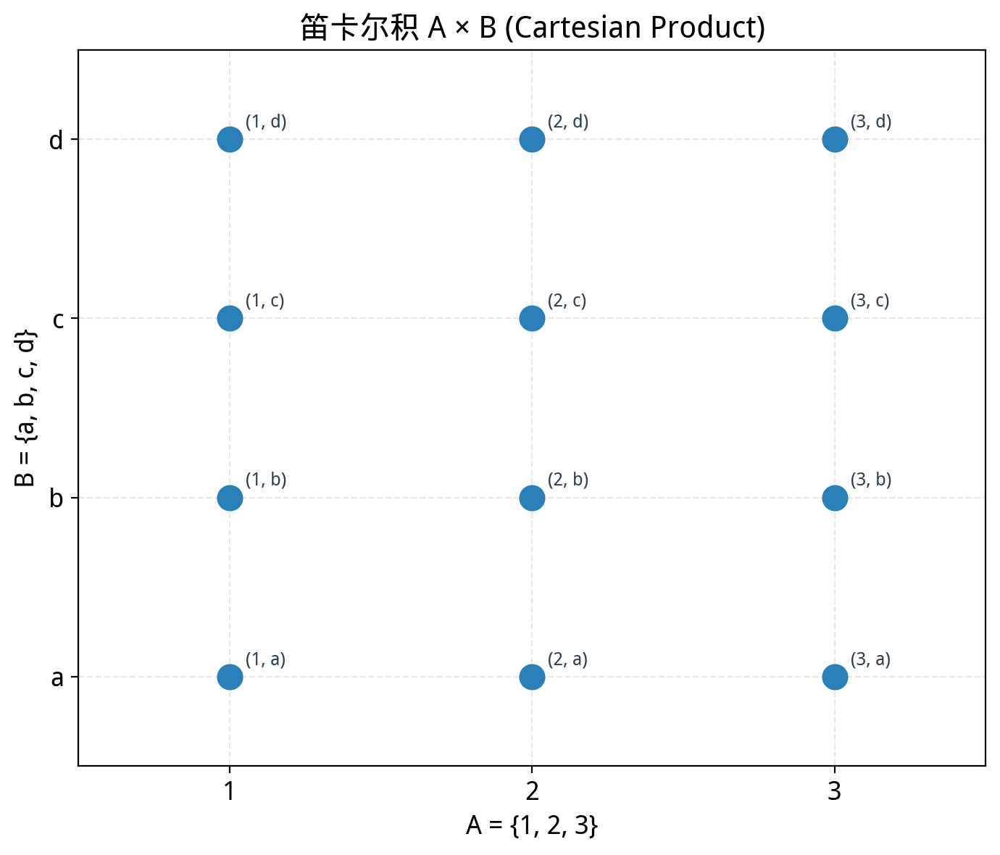
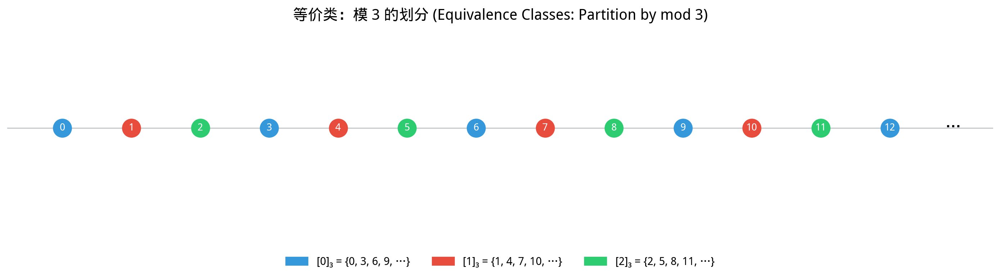
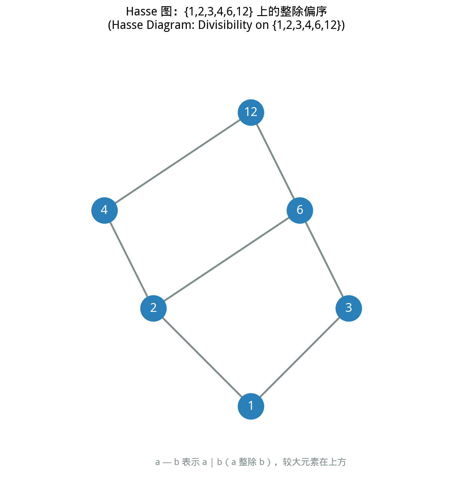

# §2 关系（Relations）

**前置知识**：[§1 集合与集合运算](01-sets-operations.md)、[第 1 章 §2 谓词逻辑](../ch01-logic/02-predicates.md)

**全景图**：在数学中，我们不仅关心对象本身，更关心对象之间的关系——"大于"、"等于"、"整除"、"平行"、"同余"。本节将"关系"这一直觉概念精确化：关系就是笛卡尔积的子集。在此基础上，我们研究关系的各种性质（自反性、对称性、传递性等），并深入讨论两类最重要的关系——等价关系（将对象分类）和偏序关系（将对象排序）。这些概念在代数、分析、组合等各个数学分支中都扮演核心角色。

**预估学习时间**：约 2–3 小时

---

## 动机

数学中充满了"关系"：

- $3 < 5$（小于关系）
- $12 \mid 36$（整除关系）
- 三角形 $T_1$ 与三角形 $T_2$ 相似（相似关系）
- 整数 $a$ 与整数 $b$ 模 $n$ 同余（同余关系）

这些关系有什么共同结构？哪些关系具有特别好的性质？我们能否用一个统一的数学框架来讨论所有这些关系？

答案是肯定的，而这个框架的关键工具是**笛卡尔积（Cartesian product）**和**有序对（ordered pair）**。

---

## 1. 有序对（Ordered Pair）

### 1.1 动机

集合 $\{a, b\}$ 不关心顺序：$\{a, b\} = \{b, a\}$。但在许多情境下，顺序是重要的——坐标 $(3, 5)$ 和 $(5, 3)$ 代表不同的点，"$3 < 5$"和"$5 < 3$"意义完全不同。我们需要一种保持顺序信息的数学对象。

### 1.2 定义

> **定义 1**（有序对，ordered pair）
>
> 有序对 $(a, b)$ 是一个数学对象，其关键性质是：
>
> $$(a, b) = (c, d) \iff a = c \wedge b = d$$
>
> 即两个有序对相等当且仅当对应分量相等。

有序对中，$a$ 称为**第一分量**（first component），$b$ 称为**第二分量**（second component）。与集合不同，$(a, b) \neq (b, a)$（除非 $a = b$），且允许 $a = b$（如 $(3, 3)$）。

### 1.3 Kuratowski 定义

有序对可以用纯集合论的语言定义吗？Kazimierz Kuratowski（1921）给出了一个巧妙的构造：

$$(a, b) := \{\{a\}, \{a, b\}\}$$

可以验证，这个定义确实满足有序对的关键性质 $(a, b) = (c, d) \iff a = c \wedge b = d$。虽然在实践中我们几乎不用这个定义来计算，但它的存在说明了一个重要的事实：**有序对可以从集合论的基本概念中构造出来**，不需要额外的公理。

### 1.4 有序 $n$ 元组

有序对可以推广到 $n$ 元组：

$$(a_1, a_2, \ldots, a_n)$$

它满足 $(a_1, \ldots, a_n) = (b_1, \ldots, b_n) \iff a_i = b_i$ 对所有 $i = 1, \ldots, n$。

有序三元组可以用有序对递归定义：$(a, b, c) := ((a, b), c)$，依此类推。

---

## 2. 笛卡尔积（Cartesian Product）

> **定义 2**（笛卡尔积，Cartesian product）
>
> 集合 $A$ 和 $B$ 的笛卡尔积 $A \times B$ 是所有以 $A$ 的元素为第一分量、$B$ 的元素为第二分量的有序对组成的集合：
>
> $$A \times B = \{(a, b) \mid a \in A \wedge b \in B\}$$

这个概念以法国数学家和哲学家 René Descartes（笛卡尔，1596–1650）的名字命名，因为他将几何点用坐标对来表示——实数平面 $\mathbb{R}^2$ 就是 $\mathbb{R} \times \mathbb{R}$。

**例子**：

- 设 $A = \{1, 2\}$, $B = \{a, b, c\}$。则：
  $$A \times B = \{(1, a), (1, b), (1, c), (2, a), (2, b), (2, c)\}$$
  有 $|A| \times |B| = 2 \times 3 = 6$ 个元素。

- $\mathbb{R} \times \mathbb{R} = \mathbb{R}^2$，即平面上所有点的集合。

- $A \times \emptyset = \emptyset$（没有元素可以做第二分量）。

**基本性质**：

- $|A \times B| = |A| \cdot |B|$（对有限集成立）。
- 一般而言，$A \times B \neq B \times A$（除非 $A = B$ 或其中一个为空集）。例如 $(1, a) \in A \times B$ 但 $(1, a) \notin B \times A$（因为 $1 \notin B$）。



---

## 3. 二元关系（Binary Relation）

### 3.1 定义

> **定义 3**（二元关系，binary relation）
>
> 从集合 $A$ 到集合 $B$ 的二元关系 $R$ 是笛卡尔积 $A \times B$ 的一个子集：
>
> $$R \subseteq A \times B$$
>
> 如果 $(a, b) \in R$，记作 $a\,R\,b$，读作"$a$ 与 $b$ 有关系 $R$"。如果 $(a, b) \notin R$，记作 $a \not R\, b$。
>
> 当 $A = B$ 时，称 $R$ 是 $A$ 上的（二元）关系。

**关键思想**：关系不是一个模糊的概念——它是一个精确的数学对象，即一个由有序对组成的集合。

**例子**：

- **小于关系**：在 $\mathbb{Z}$ 上定义 $R = \{(a, b) \in \mathbb{Z} \times \mathbb{Z} \mid a < b\}$。则 $(2, 5) \in R$（即 $2\,R\,5$，即 $2 < 5$），但 $(5, 2) \notin R$。

- **整除关系**：在 $\mathbb{Z}^+$ 上定义 $D = \{(a, b) \in \mathbb{Z}^+ \times \mathbb{Z}^+ \mid a \text{ 整除 } b\}$。则 $3\,D\,12$（$3 \mid 12$），但 $5 \not D\, 12$。

- **有限集上的关系**：在 $A = \{1, 2, 3\}$ 上，$R = \{(1,1), (1,2), (2,3), (3,3)\}$ 是 $A$ 上的一个关系。$1\,R\,2$ 为真，$2\,R\,1$ 为假。

### 3.2 关系的表示

对于有限集上的关系，可以用以下方式表示：

1. **集合表示**：直接列出关系中的有序对。
2. **矩阵表示**：用一个 $|A| \times |B|$ 的 $0$-$1$ 矩阵 $M$，其中 $M_{ij} = 1$ 当且仅当 $a_i\,R\,b_j$。
3. **有向图表示**：将 $A$ 的元素作为顶点，如果 $a\,R\,b$，则画一条从 $a$ 到 $b$ 的有向边。

---

## 4. 关系的性质

对于集合 $A$ 上的关系 $R$（即 $R \subseteq A \times A$），我们考虑以下四个重要性质。

### 4.1 自反性（Reflexivity）

> **定义 4**（自反性，reflexivity）
>
> 关系 $R$ 在 $A$ 上是自反的，当且仅当每个元素都与自身有关系：
>
> $$\forall a \in A,\, a\,R\,a$$

**直觉**：每个人都是自己的朋友（如果"朋友"关系是自反的）。

**例子**：
- $\leq$ 在 $\mathbb{R}$ 上是自反的：$\forall x \in \mathbb{R},\, x \leq x$。✓
- $=$ 在任何集合上是自反的：$\forall x,\, x = x$。✓
- $<$ 在 $\mathbb{R}$ 上**不是**自反的：$3 < 3$ 为假。✗

**反例判定**：要证明 $R$ 不是自反的，只需找到一个 $a \in A$ 使得 $(a, a) \notin R$。

### 4.2 对称性（Symmetry）

> **定义 5**（对称性，symmetry）
>
> 关系 $R$ 在 $A$ 上是对称的，当且仅当：
>
> $$\forall a, b \in A,\, (a\,R\,b \to b\,R\,a)$$

**直觉**：如果 $a$ 是 $b$ 的朋友，那么 $b$ 也是 $a$ 的朋友。

**例子**：
- $=$ 是对称的：$a = b \implies b = a$。✓
- "同班同学"关系是对称的。✓
- $\leq$ **不是**对称的：$2 \leq 3$ 但 $3 \leq 2$ 为假。✗
- $<$ **不是**对称的。✗

### 4.3 反对称性（Antisymmetry）

> **定义 6**（反对称性，antisymmetry）
>
> 关系 $R$ 在 $A$ 上是反对称的，当且仅当：
>
> $$\forall a, b \in A,\, (a\,R\,b \wedge b\,R\,a \to a = b)$$

**直觉**：如果 $a$ 与 $b$ 互相有关系，那么 $a$ 和 $b$ 必须是同一个元素。

**例子**：
- $\leq$ 是反对称的：$a \leq b$ 且 $b \leq a$ 蕴含 $a = b$。✓
- 整除关系 $\mid$ 在 $\mathbb{Z}^+$ 上是反对称的：$a \mid b$ 且 $b \mid a$ 蕴含 $a = b$。✓
- $=$ 是反对称的（空真地成立——$a = b$ 且 $b = a$ 当然蕴含 $a = b$）。✓

> ⚠️ **警告**
>
> 对称性和反对称性**不是**互斥的！一个关系可以同时是对称的和反对称的。例如，$=$ 关系就是这样。一个关系也可以既不对称也不反对称。
>
> 直觉上：对称性说"如果 $a\,R\,b$ 则 $b\,R\,a$"；反对称性说"如果 $a\,R\,b$ 且 $b\,R\,a$，则 $a = b$"。这两个条件并不矛盾——当 $a = b$ 时，$a\,R\,b$ 和 $b\,R\,a$ 可以同时成立而不违反反对称性。

### 4.4 传递性（Transitivity）

> **定义 7**（传递性，transitivity）
>
> 关系 $R$ 在 $A$ 上是传递的，当且仅当：
>
> $$\forall a, b, c \in A,\, (a\,R\,b \wedge b\,R\,c \to a\,R\,c)$$

**直觉**：关系可以"传递"——如果 $a$ 与 $b$ 有关系、$b$ 与 $c$ 有关系，那么 $a$ 与 $c$ 也有关系。

**例子**：
- $<$ 是传递的：$a < b$ 且 $b < c$ 蕴含 $a < c$。✓
- $=$ 是传递的：$a = b$ 且 $b = c$ 蕴含 $a = c$。✓
- $\leq$ 是传递的。✓
- 整除关系 $\mid$ 是传递的：$a \mid b$ 且 $b \mid c$ 蕴含 $a \mid c$（因为 $b = ka, c = lb$，所以 $c = lka$）。✓
- "是...的朋友"在现实中通常**不是**传递的：你的朋友的朋友不一定是你的朋友。✗

### 4.5 性质总结

| 性质 | 形式化定义 | 直觉 |
|------|-----------|------|
| 自反性 | $\forall a,\, a\,R\,a$ | 每个元素与自身有关系 |
| 对称性 | $a\,R\,b \implies b\,R\,a$ | 关系是"双向的" |
| 反对称性 | $a\,R\,b \wedge b\,R\,a \implies a = b$ | 双向关系只在相等时出现 |
| 传递性 | $a\,R\,b \wedge b\,R\,c \implies a\,R\,c$ | 关系可以"链式传递" |

---

## 5. 等价关系（Equivalence Relation）

### 5.1 定义

> **定义 8**（等价关系，equivalence relation）
>
> 集合 $A$ 上的关系 $R$ 是等价关系，当且仅当 $R$ 同时满足：
>
> 1. **自反性**：$\forall a \in A,\, a\,R\,a$
> 2. **对称性**：$\forall a, b \in A,\, (a\,R\,b \to b\,R\,a)$
> 3. **传递性**：$\forall a, b, c \in A,\, (a\,R\,b \wedge b\,R\,c \to a\,R\,c)$

等价关系通常记作 $\sim$ 或 $\equiv$，而不是 $R$。

**直觉**：等价关系刻画了"本质上相同"的概念。两个对象如果在某种意义上"等价"，就被视为"同类"。

**例子**：

1. **相等关系** $=$：在任何集合上，$=$ 是最基本的等价关系。自反性（$a = a$）、对称性（$a = b \implies b = a$）、传递性（$a = b, b = c \implies a = c$）都成立。

2. **模 $n$ 同余**：在 $\mathbb{Z}$ 上定义 $a \equiv b \pmod{n}$ 当且仅当 $n \mid (a - b)$。
   - 自反性：$n \mid (a - a) = 0$。✓
   - 对称性：$n \mid (a - b) \implies n \mid (b - a)$。✓
   - 传递性：$n \mid (a - b)$ 且 $n \mid (b - c)$ 蕴含 $n \mid ((a - b) + (b - c)) = n \mid (a - c)$。✓

3. **三角形相似**：在所有三角形的集合上，"相似"是等价关系。每个三角形与自身相似；如果 $T_1 \sim T_2$，则 $T_2 \sim T_1$；如果 $T_1 \sim T_2$ 且 $T_2 \sim T_3$，则 $T_1 \sim T_3$。

4. **集合等势**：在所有集合的类上，"存在双射"是等价关系（将在 §4 中讨论）。

### 5.2 等价类（Equivalence Class）

> **定义 9**（等价类，equivalence class）
>
> 设 $\sim$ 是集合 $A$ 上的等价关系，$a \in A$。$a$ 的等价类 $[a]$ 是所有与 $a$ 等价的元素的集合：
>
> $$[a] = \{x \in A \mid x \sim a\}$$
>
> 元素 $a$ 称为等价类 $[a]$ 的一个**代表元（representative）**。

**例子**：

- 在 $\mathbb{Z}$ 上，模 $3$ 同余的等价类有三个：
  - $[0] = \{\ldots, -6, -3, 0, 3, 6, 9, \ldots\}$（被 $3$ 整除的整数）
  - $[1] = \{\ldots, -5, -2, 1, 4, 7, 10, \ldots\}$（除以 $3$ 余 $1$ 的整数）
  - $[2] = \{\ldots, -4, -1, 2, 5, 8, 11, \ldots\}$（除以 $3$ 余 $2$ 的整数）

  注意 $[0] = [3] = [6] = \ldots$，$[1] = [4] = [7] = \ldots$。同一个等价类可以有多个代表元。

**等价类的基本性质**：

> **引理 1**
>
> 设 $\sim$ 是 $A$ 上的等价关系，$a, b \in A$。则：
>
> (i) $a \in [a]$（由自反性）。
>
> (ii) $a \sim b \iff [a] = [b]$。
>
> (iii) $[a] \neq [b] \implies [a] \cap [b] = \emptyset$。

> **证明**
>
> (i) 由自反性，$a \sim a$，所以 $a \in [a]$。
>
> (ii) ($\Rightarrow$) 设 $a \sim b$。要证 $[a] = [b]$，即 $[a] \subseteq [b]$ 且 $[b] \subseteq [a]$。
>
> 设 $x \in [a]$，则 $x \sim a$。由 $a \sim b$（已知）和传递性，$x \sim b$，即 $x \in [b]$。所以 $[a] \subseteq [b]$。
>
> 设 $x \in [b]$，则 $x \sim b$。由 $a \sim b$ 和对称性，$b \sim a$。由传递性，$x \sim a$，即 $x \in [a]$。所以 $[b] \subseteq [a]$。
>
> ($\Leftarrow$) 设 $[a] = [b]$。由 (i)，$a \in [a] = [b]$，所以 $a \sim b$。
>
> (iii) 我们证明对偶命题：$[a] \cap [b] \neq \emptyset \implies [a] = [b]$。
>
> 设 $c \in [a] \cap [b]$。则 $c \sim a$ 且 $c \sim b$。由对称性，$a \sim c$。由传递性，$a \sim b$。由 (ii)，$[a] = [b]$。$\blacksquare$

### 5.3 划分（Partition）

> **定义 10**（划分，partition）
>
> 集合 $A$ 的一个划分是 $A$ 的一族非空子集 $\{A_i\}_{i \in I}$，满足：
>
> 1. **覆盖**：$\bigcup_{i \in I} A_i = A$（每个元素至少属于某个 $A_i$）
> 2. **互不相交**：对任意 $i \neq j$，$A_i \cap A_j = \emptyset$（不同的块没有公共元素）

划分将集合分成若干"块"，每个元素恰好属于一个块。

**例子**：$\{\{1, 3, 5\}, \{2, 4\}\}$ 是 $\{1, 2, 3, 4, 5\}$ 的一个划分。

### 5.4 等价关系与划分的对应

等价关系和划分是同一个硬币的两面：

> **定理 5**（等价关系与划分的基本定理）
>
> (1) 设 $\sim$ 是集合 $A$ 上的等价关系。则 $A$ 的所有等价类 $\{[a] \mid a \in A\}$ 构成 $A$ 的一个划分。这个划分称为 $A$ 关于 $\sim$ 的**商集（quotient set）**，记作 $A / {\sim}$。
>
> (2) 反过来，设 $\{A_i\}_{i \in I}$ 是集合 $A$ 的一个划分。定义关系 $\sim$ 为：$a \sim b$ 当且仅当 $a$ 和 $b$ 属于同一个块 $A_i$。则 $\sim$ 是 $A$ 上的等价关系。

> **证明（第 (1) 部分）**
>
> 需要验证等价类构成划分的两个条件。
>
> **覆盖**：对任意 $a \in A$，由自反性 $a \sim a$，所以 $a \in [a]$。因此 $a$ 至少属于一个等价类，$\bigcup_{a \in A}[a] = A$。
>
> **互不相交**：由引理 1(iii)，不同的等价类没有公共元素。
>
> 因此等价类构成 $A$ 的划分。$\blacksquare$

> **证明（第 (2) 部分）**
>
> 设 $\{A_i\}_{i \in I}$ 是 $A$ 的划分，定义 $a \sim b \iff \exists i \in I,\, a \in A_i \wedge b \in A_i$。
>
> **自反性**：$a$ 必属于某个 $A_i$（因为划分覆盖 $A$），所以 $a \sim a$。
>
> **对称性**：若 $a \sim b$，即 $a, b \in A_i$ 对某个 $i$，则 $b, a \in A_i$，即 $b \sim a$。
>
> **传递性**：若 $a \sim b$ 且 $b \sim c$，即 $a, b \in A_i$ 且 $b, c \in A_j$。由 $b \in A_i \cap A_j$ 且划分的互不相交性，$i = j$。因此 $a, c \in A_i$，即 $a \sim c$。$\blacksquare$

**例子**：模 $3$ 同余关系将 $\mathbb{Z}$ 划分为三个等价类 $[0], [1], [2]$。商集 $\mathbb{Z}/{\equiv_3} = \{[0], [1], [2]\}$ 就是我们熟悉的 $\mathbb{Z}_3$（模 $3$ 的整数）。



---

## 6. 偏序关系（Partial Order）

### 6.1 定义

> **定义 11**（偏序关系，partial order）
>
> 集合 $A$ 上的关系 $\preceq$ 是偏序关系，当且仅当 $\preceq$ 同时满足：
>
> 1. **自反性**：$\forall a \in A,\, a \preceq a$
> 2. **反对称性**：$\forall a, b \in A,\, (a \preceq b \wedge b \preceq a \to a = b)$
> 3. **传递性**：$\forall a, b, c \in A,\, (a \preceq b \wedge b \preceq c \to a \preceq c)$
>
> 集合 $A$ 连同其上的偏序关系 $\preceq$ 构成一个**偏序集（partially ordered set, poset）**，记作 $(A, \preceq)$。

注意偏序和等价的区别：偏序要求**反对称性**，等价要求**对称性**。等价关系刻画"相同"，偏序关系刻画"排序"。

### 6.2 例子

1. **小于等于** $\leq$：$(\mathbb{R}, \leq)$ 是偏序集。
   - 自反：$a \leq a$。✓
   - 反对称：$a \leq b$ 且 $b \leq a$ 蕴含 $a = b$。✓
   - 传递：$a \leq b$ 且 $b \leq c$ 蕴含 $a \leq c$。✓

2. **整除关系** $\mid$：$(\mathbb{Z}^+, \mid)$ 是偏序集。
   - 自反：$a \mid a$（$a = 1 \cdot a$）。✓
   - 反对称：在正整数中，$a \mid b$ 且 $b \mid a$ 蕴含 $a = b$。✓
   - 传递：$a \mid b$ 且 $b \mid c$ 蕴含 $a \mid c$。✓

3. **子集关系** $\subseteq$：$(\mathcal{P}(S), \subseteq)$ 是偏序集（对任意集合 $S$）。
   - 自反：$A \subseteq A$。✓
   - 反对称：$A \subseteq B$ 且 $B \subseteq A$ 蕴含 $A = B$。✓
   - 传递：$A \subseteq B$ 且 $B \subseteq C$ 蕴含 $A \subseteq C$。✓

### 6.3 全序与偏序

> **定义 12**（可比性与全序，comparability and total order）
>
> 在偏序集 $(A, \preceq)$ 中，元素 $a$ 和 $b$ 是**可比的（comparable）**，如果 $a \preceq b$ 或 $b \preceq a$。否则称它们**不可比（incomparable）**。
>
> 如果 $A$ 中任意两个元素都是可比的，则 $\preceq$ 称为**全序（total order）**或**线序（linear order）**，$(A, \preceq)$ 称为**全序集**。

**例子**：

- $(\mathbb{R}, \leq)$ 是全序集：对任意两个实数 $a, b$，必有 $a \leq b$ 或 $b \leq a$。
- $(\mathcal{P}(\{1, 2\}), \subseteq)$ **不是**全序集：$\{1\}$ 和 $\{2\}$ 不可比（$\{1\} \not\subseteq \{2\}$ 且 $\{2\} \not\subseteq \{1\}$）。这就是"偏序"中"偏"的含义——并非所有元素都能比较大小。
- $(\mathbb{Z}^+, \mid)$ 不是全序集：$3$ 和 $5$ 不可比（$3 \nmid 5$ 且 $5 \nmid 3$）。

### 6.4 Hasse 图

**Hasse 图（Hasse diagram）** 是可视化有限偏序集的工具。它的绘制规则如下：

1. 将元素画为点，"较小"的元素画在下方。
2. 如果 $a \preceq b$ 且 $a \neq b$ 且不存在 $c$ 使得 $a \preceq c \preceq b$（$c \neq a, c \neq b$），则从 $a$ 到 $b$ 画一条线段。这种关系称为 $a$ **被 $b$ 覆盖（$a$ is covered by $b$）**。
3. 不画自环（自反性已知），不画可传递推出的边（传递性已知），不画箭头（方向由位置的高低表示）。

**例子**：$\{1, 2, 3, 6\}$ 上的整除关系的 Hasse 图：

```
    6
   / \
  2   3
   \ /
    1
```

$1 \mid 2$, $1 \mid 3$, $1 \mid 6$, $2 \mid 6$, $3 \mid 6$。但图中只画直接覆盖关系（$1$-$2$, $1$-$3$, $2$-$6$, $3$-$6$），$1$-$6$ 的线不画（因为可以由 $1$-$2$-$6$ 或 $1$-$3$-$6$ 传递得到）。

### 6.5 偏序集中的特殊元素

> **定义 13**（最大/最小元素、极大/极小元素、上界/下界）
>
> 在偏序集 $(A, \preceq)$ 中：
>
> - **最大元素（greatest/maximum element）**：$a \in A$ 满足 $\forall x \in A,\, x \preceq a$。
> - **最小元素（least/minimum element）**：$a \in A$ 满足 $\forall x \in A,\, a \preceq x$。
> - **极大元素（maximal element）**：$a \in A$ 满足不存在 $x \in A$ 使得 $a \preceq x$ 且 $a \neq x$。
> - **极小元素（minimal element）**：$a \in A$ 满足不存在 $x \in A$ 使得 $x \preceq a$ 且 $x \neq a$。

注意区别：最大元素与所有元素可比且最大；极大元素只需要没有更大的元素（可能存在不可比的元素）。在全序集中，极大元素就是最大元素。在偏序集中，最大元素如果存在则唯一，但可能有多个极大元素。



---

## 7. 例题

> **例题 1**
>
> 设 $A = \{1, 2, 3, 4\}$，关系 $R = \{(1,1), (1,2), (2,1), (2,2), (3,3), (4,4), (3,4), (4,3)\}$。判断 $R$ 是否为等价关系。如果是，求所有等价类。
>
> **解**：
>
> **自反性**：$(1,1), (2,2), (3,3), (4,4) \in R$。$A$ 的每个元素都与自身有关系。✓
>
> **对称性**：检查所有有序对：$(1,2) \in R$ 且 $(2,1) \in R$；$(3,4) \in R$ 且 $(4,3) \in R$；其余对称对都是 $(a,a)$ 的形式。✓
>
> **传递性**：
> - $(1,2) \in R, (2,1) \in R \implies (1,1) \in R$。✓
> - $(1,2) \in R, (2,2) \in R \implies (1,2) \in R$。✓
> - $(2,1) \in R, (1,2) \in R \implies (2,2) \in R$。✓
> - $(2,1) \in R, (1,1) \in R \implies (2,1) \in R$。✓
> - $(3,4) \in R, (4,3) \in R \implies (3,3) \in R$。✓
> - $(3,4) \in R, (4,4) \in R \implies (3,4) \in R$。✓
> - $(4,3) \in R, (3,4) \in R \implies (4,4) \in R$。✓
> - $(4,3) \in R, (3,3) \in R \implies (4,3) \in R$。✓
> - 无其他需要检验的情况。✓
>
> 所以 $R$ 是 $A$ 上的等价关系。
>
> 等价类：$[1] = \{1, 2\}$, $[3] = \{3, 4\}$。注意 $[1] = [2]$, $[3] = [4]$。
>
> 划分为 $\{\{1, 2\}, \{3, 4\}\}$。

> **例题 2**
>
> 证明：在 $\mathbb{Z}$ 上，定义关系 $a \sim b \iff 2 \mid (a - b)$（即 $a$ 和 $b$ 的奇偶性相同）是等价关系，并求等价类。
>
> **解**：
>
> **自反性**：$a - a = 0$，$2 \mid 0$。所以 $a \sim a$。✓
>
> **对称性**：若 $a \sim b$，则 $2 \mid (a - b)$，即 $a - b = 2k$ 对某个整数 $k$。则 $b - a = -2k = 2(-k)$，所以 $2 \mid (b - a)$，即 $b \sim a$。✓
>
> **传递性**：若 $a \sim b$ 且 $b \sim c$，则 $a - b = 2k$ 且 $b - c = 2l$。于是 $a - c = (a - b) + (b - c) = 2k + 2l = 2(k + l)$，所以 $2 \mid (a - c)$，即 $a \sim c$。✓
>
> 等价类有两个：
> - $[0] = \{\ldots, -4, -2, 0, 2, 4, \ldots\}$（偶数集）
> - $[1] = \{\ldots, -3, -1, 1, 3, 5, \ldots\}$（奇数集）
>
> 这个等价关系精确地刻画了"奇偶性相同"的概念。$\blacksquare$

> **例题 3**
>
> 在集合 $A = \{1, 2, 3, 6, 12, 24\}$ 上考虑整除关系 $\mid$。验证它是偏序关系，找出所有极大元素和极小元素，画出 Hasse 图。
>
> **解**：
>
> $\mid$ 在 $\mathbb{Z}^+$ 上是偏序关系（前面已验证自反性、反对称性、传递性），限制到子集 $A$ 上仍是偏序关系。
>
> 整除关系：$1 \mid 2, 1 \mid 3, 1 \mid 6, 1 \mid 12, 1 \mid 24, 2 \mid 6, 2 \mid 12, 2 \mid 24, 3 \mid 6, 3 \mid 12, 3 \mid 24, 6 \mid 12, 6 \mid 24, 12 \mid 24$。
>
> **极小元素**：$1$（没有比 $1$ 更小的元素）。这也是最小元素（$1$ 整除所有元素）。
>
> **极大元素**：$24$（没有比 $24$ 更大的元素）。这也是最大元素（所有元素都整除 $24$）。
>
> Hasse 图（只画覆盖关系）：
>
> ```
>      24
>      |
>      12
>     / \
>    6   (无——4 不在 A 中)
>   / \
>  2   3
>   \ /
>    1
> ```
>
> 更精确地，覆盖关系为：$1 \lessdot 2$, $1 \lessdot 3$, $2 \lessdot 6$, $3 \lessdot 6$, $6 \lessdot 12$, $12 \lessdot 24$。
> 注意 $2$ 不覆盖 $12$（因为中间有 $6$），$3$ 不覆盖 $12$（因为中间有 $6$）。

---

## 联系

> **联系** → [§1 集合与集合运算](01-sets-operations.md)
>
> 关系是笛卡尔积的子集，因此集合运算可以应用于关系。例如，两个关系的并 $R_1 \cup R_2$ 和交 $R_1 \cap R_2$ 也是关系。关系的补 $\overline{R} = (A \times A) \setminus R$ 表示"取反"。

> **联系** → [§3 函数（集合论视角）](03-functions-as-sets.md)
>
> 函数是满足特殊条件的二元关系——每个定义域中的元素恰好对应一个值域中的元素。等价关系和偏序关系组织数学对象的"分类"和"排序"；函数则描述对象之间的"映射"。

> **联系** → 抽象代数
>
> 等价关系在抽象代数中无处不在。群的正规子群确定的陪集是等价类；环的理想确定的陪集也是等价类。商群、商环等概念都建立在等价关系之上。

---

## 要点回顾

1. **有序对** $(a, b)$ 保持分量的顺序：$(a, b) = (c, d) \iff a = c \wedge b = d$。
2. **笛卡尔积** $A \times B$ 是所有有序对 $(a, b)$ 的集合（$a \in A, b \in B$）。
3. **二元关系** $R$ 是 $A \times B$ 的子集。关系不是模糊概念，而是一个具体的有序对集合。
4. 关系的四个基本性质：**自反性**、**对称性**、**反对称性**、**传递性**。
5. **等价关系**（自反 + 对称 + 传递）将集合划分为不重叠的**等价类**。等价关系与划分一一对应。
6. **偏序关系**（自反 + 反对称 + 传递）给出了元素之间的"排序"。**全序**是每对元素都可比的偏序。
7. **Hasse 图**通过只画覆盖关系来简洁地可视化偏序集。

---

## 进度检查点

- ☐ 我理解有序对的定义及其与集合（无序对）的区别
- ☐ 我能计算两个集合的笛卡尔积
- ☐ 我能将一个具体的关系表示为有序对的集合
- ☐ 我能判断一个关系是否满足自反性、对称性、反对称性、传递性
- ☐ 我能判断一个关系是否为等价关系，并求出等价类
- ☐ 我能判断一个关系是否为偏序关系，并画出 Hasse 图
- ☐ 我理解等价关系与划分之间的对应

---

### 自测题

1. 设 $A = \{1, 2\}$, $B = \{x, y, z\}$。列出 $A \times B$ 的所有元素。$|A \times B| = ?$

2. 在 $\{1, 2, 3\}$ 上定义关系 $R = \{(1,1), (2,2), (3,3), (1,2), (2,1)\}$。判断 $R$ 是否满足自反性、对称性、传递性。$R$ 是等价关系吗？

3. 给出 $\mathbb{R}$ 上的一个关系，它是传递的但不是自反的。

4. 在 $\mathbb{Z}$ 上，模 $4$ 同余关系有多少个等价类？分别是什么？

5. 画出集合 $\{1, 2, 4, 8\}$ 上整除关系的 Hasse 图。

<details>
<summary>查看答案</summary>

1. $A \times B = \{(1, x), (1, y), (1, z), (2, x), (2, y), (2, z)\}$。$|A \times B| = 2 \times 3 = 6$。

2. **自反性**：$(1,1), (2,2), (3,3) \in R$。✓

   **对称性**：$(1,2) \in R$ 且 $(2,1) \in R$；其余都是 $(a,a)$ 形式。✓

   **传递性**：$(1,2) \in R$ 且 $(2,1) \in R \implies (1,1) \in R$。✓ $(2,1) \in R$ 且 $(1,2) \in R \implies (2,2) \in R$。✓ 其他情况类似检查均成立。✓

   $R$ 是等价关系。等价类：$[1] = [2] = \{1, 2\}$, $[3] = \{3\}$。划分为 $\{\{1,2\}, \{3\}\}$。

3. 严格小于关系 $<$：传递性成立（$a < b \wedge b < c \implies a < c$），但不自反（$a < a$ 为假）。

4. 有 $4$ 个等价类：
   - $[0] = \{\ldots, -8, -4, 0, 4, 8, \ldots\}$
   - $[1] = \{\ldots, -7, -3, 1, 5, 9, \ldots\}$
   - $[2] = \{\ldots, -6, -2, 2, 6, 10, \ldots\}$
   - $[3] = \{\ldots, -5, -1, 3, 7, 11, \ldots\}$

5. Hasse 图：$1 - 2 - 4 - 8$（一条链）。因为 $1 \mid 2$, $2 \mid 4$, $4 \mid 8$，且每对之间是直接覆盖关系（$1 \lessdot 2 \lessdot 4 \lessdot 8$）。这是一个全序集。

</details>

---

**习题引用**：→ 本节习题见 [exercises/exercises.md](exercises/exercises.md#§2-关系)
