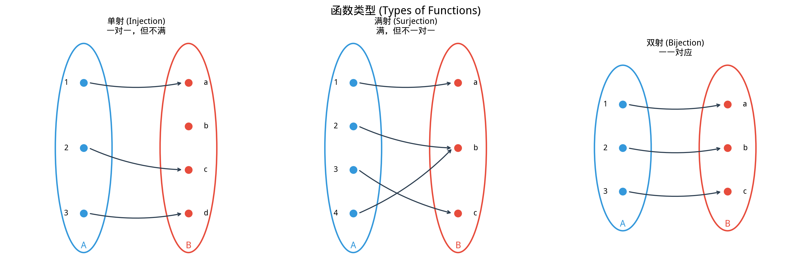

# §3 函数（集合论视角）（Functions as Sets）

**前置知识**：[§2 关系](02-relations.md)

**全景图**：函数是数学中最核心的概念之一。在中学阶段，我们把函数理解为"一个公式"或"一个对应规则"。本节从集合论的角度给出函数的精确定义：函数是一种特殊的关系——对定义域中的每个元素，恰好对应到达域中的一个元素。这个看似抽象的定义实际上澄清了许多重要问题，并为我们讨论单射、满射、双射、复合、逆函数提供了坚实的基础。本节建立的概念将在 Part 4（函数）中得到具体的应用。

**预估学习时间**：约 2 小时

---

## 动机

在日常数学中，我们不断地使用函数：$f(x) = x^2$、$\sin x$、$\log x$。但什么是函数？

- 它是一个公式吗？但有些函数无法用简洁的公式表达（比如 Dirichlet 函数）。
- 它是一条曲线吗？但高维函数没有简单的图形。
- 它是一种"规则"吗？但"规则"这个词太含糊了。

集合论给出了一个干净利落的回答：**函数就是一个满足特定条件的有序对集合**。这个定义的优势在于它完全精确，不依赖于"规则"、"公式"等模糊概念。

更深层地，将函数视为集合使我们能够讨论"函数的集合"（如所有从 $A$ 到 $B$ 的函数构成的集合 $B^A$）、"函数上的运算"（如复合）等高阶概念，这在分析学和代数中是必不可少的。

---

## 1. 函数的集合论定义

### 1.1 定义

> **定义 1**（函数，function）
>
> 设 $A$ 和 $B$ 是集合。从 $A$ 到 $B$ 的**函数**（function）$f$ 是一个关系 $f \subseteq A \times B$，满足以下条件：
>
> 对每个 $a \in A$，**恰好存在一个** $b \in B$ 使得 $(a, b) \in f$。
>
> 用谓词逻辑表示：
>
> $$\forall a \in A,\, \exists!\, b \in B,\, (a, b) \in f$$
>
> 其中 $\exists!$ 表示"存在唯一"（there exists exactly one）。

当 $(a, b) \in f$ 时，我们写 $f(a) = b$，称 $b$ 是 $a$ 在 $f$ 下的**像（image）**。

函数 $f$ 从 $A$ 到 $B$ 记作 $f: A \to B$。

### 1.2 关键条件解读

"恰好存在一个"包含两层含义：

1. **存在性（全域性）**：每个 $a \in A$ 都有对应的 $b$。函数在 $A$ 的每个点都有定义——不存在"空缺"。
2. **唯一性（单值性）**：每个 $a \in A$ 最多对应一个 $b$。函数不存在"一对多"——同一个输入不能有两个不同的输出。

不满足存在性的关系称为**部分函数（partial function）**。不满足唯一性的关系只是一般的关系而非函数。

### 1.3 例子

1. $f: \mathbb{R} \to \mathbb{R}$，$f(x) = x^2$。作为有序对的集合：$f = \{(x, x^2) \mid x \in \mathbb{R}\}$。对每个 $x \in \mathbb{R}$，$x^2$ 是唯一确定的，所以这是一个函数。

2. $g: \{1, 2, 3\} \to \{a, b\}$，$g = \{(1, a), (2, b), (3, a)\}$。每个定义域元素恰好出现一次作为第一分量。✓

3. 关系 $R = \{(1, a), (1, b), (2, a)\} \subseteq \{1, 2\} \times \{a, b\}$ **不是**函数：$1$ 对应了两个值 $a$ 和 $b$，违反了唯一性。

4. 关系 $S = \{(1, a)\} \subseteq \{1, 2\} \times \{a, b\}$ **不是**从 $\{1, 2\}$ 到 $\{a, b\}$ 的函数：$2$ 没有对应的值，违反了存在性。（但 $S$ 是一个部分函数。）

### 1.4 函数的相等

两个函数何时相等？由于函数是有序对的集合，两个函数相等当且仅当它们作为集合相等：

> **定义 2**（函数相等）
>
> $f: A \to B$ 和 $g: A \to B$ 相等（$f = g$），当且仅当对所有 $a \in A$，$f(a) = g(a)$。

注意：函数的相等不仅要求对应规则相同，还要求定义域和到达域相同。

---

## 2. 定义域、值域与到达域

> **定义 3**
>
> 设 $f: A \to B$ 是函数。
>
> - **定义域（domain）**：$\text{dom}(f) = A$，函数的输入集合。
> - **到达域（codomain）**：$\text{cod}(f) = B$，函数被声明的输出集合。
> - **值域（range / image）**：$\text{ran}(f) = \text{im}(f) = \{f(a) \mid a \in A\} = \{b \in B \mid \exists a \in A,\, f(a) = b\}$，函数实际取到的输出值的集合。

值域是到达域的子集：$\text{ran}(f) \subseteq B$，但不一定等于 $B$。

**例子**：

$f: \mathbb{R} \to \mathbb{R}$，$f(x) = x^2$。
- 定义域：$\text{dom}(f) = \mathbb{R}$
- 到达域：$\text{cod}(f) = \mathbb{R}$
- 值域：$\text{ran}(f) = [0, +\infty)$（$x^2$ 不会取到负值）

注意值域 $[0, +\infty) \subsetneq \mathbb{R} = \text{cod}(f)$。这说明到达域和值域可以不同。

### 子集的像和原像

> **定义 4**（像和原像）
>
> 设 $f: A \to B$，$S \subseteq A$，$T \subseteq B$。
>
> - $S$ 在 $f$ 下的**像（image）**：$f(S) = \{f(a) \mid a \in S\}$
> - $T$ 在 $f$ 下的**原像（preimage / inverse image）**：$f^{-1}(T) = \{a \in A \mid f(a) \in T\}$

注意：$f^{-1}(T)$ 中的 $f^{-1}$ 不要求 $f$ 有逆函数——原像对任何函数都有定义。

---

## 3. 单射（Injection）

> **定义 5**（单射，injection / one-to-one function）
>
> 函数 $f: A \to B$ 是**单射的（injective）**，当且仅当不同的输入产生不同的输出：
>
> $$\forall a_1, a_2 \in A,\, (f(a_1) = f(a_2) \to a_1 = a_2)$$
>
> 等价地（逆否命题）：
>
> $$\forall a_1, a_2 \in A,\, (a_1 \neq a_2 \to f(a_1) \neq f(a_2))$$

**直觉**：单射"不折叠"——不同的输入不会映射到同一个输出。也可以说，$B$ 中的每个元素最多被一个 $A$ 中的元素映射到。

**例子**：

1. $f: \mathbb{R} \to \mathbb{R}$，$f(x) = 2x + 1$。若 $f(a_1) = f(a_2)$，则 $2a_1 + 1 = 2a_2 + 1$，即 $a_1 = a_2$。所以 $f$ 是单射。✓

2. $g: \mathbb{R} \to \mathbb{R}$，$g(x) = x^2$。$g(1) = g(-1) = 1$，但 $1 \neq -1$。所以 $g$ **不是**单射。✗

3. $h: \mathbb{R}^+ \to \mathbb{R}$，$h(x) = x^2$（限制定义域为正实数）。若 $h(a_1) = h(a_2)$，则 $a_1^2 = a_2^2$。由于 $a_1, a_2 > 0$，$a_1 = a_2$。所以 $h$ 是单射。✓

例子 2 和 3 说明：同一个"公式"，定义域不同，单射性可以不同。这体现了函数的集合论定义（包含定义域信息）的优势。

---

## 4. 满射（Surjection）

> **定义 6**（满射，surjection / onto function）
>
> 函数 $f: A \to B$ 是**满射的（surjective）**，当且仅当到达域中的每个元素都被映射到：
>
> $$\forall b \in B,\, \exists a \in A,\, f(a) = b$$
>
> 等价地，$\text{ran}(f) = B$（值域等于到达域）。

**直觉**：满射"覆盖"了整个到达域——$B$ 中没有元素被"遗漏"。$B$ 中的每个元素至少被一个 $A$ 中的元素映射到。

**例子**：

1. $f: \mathbb{R} \to \mathbb{R}$，$f(x) = 2x + 1$。对任意 $b \in \mathbb{R}$，取 $a = (b-1)/2$，则 $f(a) = b$。所以 $f$ 是满射。✓

2. $g: \mathbb{R} \to \mathbb{R}$，$g(x) = x^2$。$\text{ran}(g) = [0, +\infty) \neq \mathbb{R}$（例如 $-1 \notin \text{ran}(g)$）。所以 $g$ **不是**满射。✗

3. $h: \mathbb{R} \to [0, +\infty)$，$h(x) = x^2$（改变到达域）。对任意 $b \geq 0$，取 $a = \sqrt{b}$，则 $h(a) = b$。所以 $h$ 是满射。✓

例子 2 和 3 说明：同一个"公式"，到达域不同，满射性可以不同。

---

## 5. 双射（Bijection）

> **定义 7**（双射，bijection / one-to-one correspondence）
>
> 函数 $f: A \to B$ 是**双射的（bijective）**，当且仅当 $f$ 既是单射又是满射。
>
> 等价地，对每个 $b \in B$，**恰好存在一个** $a \in A$ 使得 $f(a) = b$：
>
> $$\forall b \in B,\, \exists!\, a \in A,\, f(a) = b$$

**直觉**：双射是 $A$ 和 $B$ 之间的"完美配对"——每个 $A$ 中的元素恰好对应一个 $B$ 中的元素，反过来也是。双射也称为**一一对应（one-to-one correspondence）**。

**例子**：

1. $f: \mathbb{R} \to \mathbb{R}$，$f(x) = 2x + 1$。已证明它既是单射又是满射，所以是双射。✓

2. $f: \mathbb{Z} \to \mathbb{Z}$，$f(n) = n + 1$。单射（$n_1 + 1 = n_2 + 1 \implies n_1 = n_2$）且满射（对任意 $m$，取 $n = m - 1$）。双射。✓

3. $g: \{1, 2, 3\} \to \{a, b, c\}$，$g = \{(1, a), (2, b), (3, c)\}$。每个元素恰好配对一次。双射。✓

当两个集合之间存在双射时，我们直觉上认为它们"大小相同"。这个想法将在 [§4 基数](04-cardinality.md)中被精确化。

### 5.1 单射/满射/双射总结

| 类型 | 条件 | $A$ 与 $B$ 的关系（有限集） |
|------|------|-----------------------------|
| 单射（injection） | $f(a_1) = f(a_2) \implies a_1 = a_2$ | $\|A\| \leq \|B\|$ |
| 满射（surjection） | $\text{ran}(f) = B$ | $\|A\| \geq \|B\|$ |
| 双射（bijection） | 单射 + 满射 | $\|A\| = \|B\|$ |

---

## 6. 函数的复合（Composition）

> **定义 8**（复合，composition）
>
> 设 $f: A \to B$ 和 $g: B \to C$ 是函数。$g$ 和 $f$ 的**复合**（composition）$g \circ f: A \to C$ 定义为：
>
> $$(g \circ f)(a) = g(f(a)), \quad \forall a \in A$$

注意符号的顺序：$g \circ f$ 先应用 $f$，再应用 $g$。这看起来"反了"，但与 $g(f(a))$ 的书写一致——内层函数先执行。

**例子**：

设 $f: \mathbb{R} \to \mathbb{R}$，$f(x) = x + 1$；$g: \mathbb{R} \to \mathbb{R}$，$g(x) = x^2$。

- $(g \circ f)(x) = g(f(x)) = g(x + 1) = (x + 1)^2$
- $(f \circ g)(x) = f(g(x)) = f(x^2) = x^2 + 1$

注意 $g \circ f \neq f \circ g$：$(g \circ f)(2) = 9$，但 $(f \circ g)(2) = 5$。

### 6.1 结合律

> **定理 1**（复合的结合律）
>
> 设 $f: A \to B$, $g: B \to C$, $h: C \to D$。则：
>
> $$h \circ (g \circ f) = (h \circ g) \circ f$$

> **证明**
>
> 对任意 $a \in A$：
>
> $$(h \circ (g \circ f))(a) = h((g \circ f)(a)) = h(g(f(a)))$$
>
> $$((h \circ g) \circ f)(a) = (h \circ g)(f(a)) = h(g(f(a)))$$
>
> 两者相等，所以 $h \circ (g \circ f) = (h \circ g) \circ f$。$\blacksquare$

结合律允许我们省略括号，直接写 $h \circ g \circ f$。

### 6.2 交换律不成立

如上面的例子所示，一般情况下 $g \circ f \neq f \circ g$。函数复合不满足交换律。

### 6.3 复合保持单射/满射/双射

> **定理 2**
>
> 设 $f: A \to B$, $g: B \to C$。
>
> (a) 若 $f$ 和 $g$ 都是单射，则 $g \circ f$ 是单射。
>
> (b) 若 $f$ 和 $g$ 都是满射，则 $g \circ f$ 是满射。
>
> (c) 若 $f$ 和 $g$ 都是双射，则 $g \circ f$ 是双射。

> **证明**
>
> **(a)** 设 $(g \circ f)(a_1) = (g \circ f)(a_2)$，即 $g(f(a_1)) = g(f(a_2))$。由 $g$ 的单射性，$f(a_1) = f(a_2)$。由 $f$ 的单射性，$a_1 = a_2$。所以 $g \circ f$ 是单射。
>
> **(b)** 设 $c \in C$。由 $g$ 的满射性，存在 $b \in B$ 使得 $g(b) = c$。由 $f$ 的满射性，存在 $a \in A$ 使得 $f(a) = b$。于是 $(g \circ f)(a) = g(f(a)) = g(b) = c$。所以 $g \circ f$ 是满射。
>
> **(c)** 由 (a) 和 (b) 直接得出。$\blacksquare$

---

## 7. 恒等函数与逆函数

### 7.1 恒等函数

> **定义 9**（恒等函数，identity function）
>
> 集合 $A$ 上的恒等函数 $\text{id}_A: A \to A$ 定义为 $\text{id}_A(a) = a$，对所有 $a \in A$。

恒等函数是复合的"单位元"：对任何 $f: A \to B$，

$$f \circ \text{id}_A = f, \qquad \text{id}_B \circ f = f$$

### 7.2 逆函数

> **定义 10**（逆函数，inverse function）
>
> 设 $f: A \to B$。如果存在函数 $g: B \to A$ 使得：
>
> $$g \circ f = \text{id}_A \quad \text{且} \quad f \circ g = \text{id}_B$$
>
> 则称 $g$ 是 $f$ 的**逆函数**，记作 $g = f^{-1}$。

**关键定理**：

> **定理 3**
>
> 函数 $f: A \to B$ 有逆函数当且仅当 $f$ 是双射。

> **证明**
>
> **($\Rightarrow$)** 设 $f$ 有逆函数 $g: B \to A$，即 $g \circ f = \text{id}_A$ 且 $f \circ g = \text{id}_B$。
>
> *单射*：设 $f(a_1) = f(a_2)$。则 $a_1 = g(f(a_1)) = g(f(a_2)) = a_2$。
>
> *满射*：对任意 $b \in B$，取 $a = g(b)$。则 $f(a) = f(g(b)) = b$。
>
> 所以 $f$ 是双射。
>
> **($\Leftarrow$)** 设 $f$ 是双射。对每个 $b \in B$，由满射性存在 $a \in A$ 使得 $f(a) = b$，由单射性这样的 $a$ 是唯一的。定义 $g(b) = a$（即 $f(a) = b$ 的那个唯一的 $a$）。
>
> 则 $(g \circ f)(a) = g(f(a)) = a = \text{id}_A(a)$，$(f \circ g)(b) = f(g(b)) = b = \text{id}_B(b)$。
>
> 所以 $g = f^{-1}$ 是 $f$ 的逆函数。$\blacksquare$

### 7.3 逆函数的唯一性

> **定理 4**
>
> 如果逆函数存在，则它是唯一的。

> **证明**
>
> 设 $g_1$ 和 $g_2$ 都是 $f$ 的逆函数。则：
>
> $$g_1 = g_1 \circ \text{id}_B = g_1 \circ (f \circ g_2) = (g_1 \circ f) \circ g_2 = \text{id}_A \circ g_2 = g_2$$
>
> 所以 $g_1 = g_2$。$\blacksquare$

### 7.4 例子

$f: \mathbb{R} \to \mathbb{R}$，$f(x) = 2x + 1$。$f$ 是双射（前面已证明）。

逆函数 $f^{-1}: \mathbb{R} \to \mathbb{R}$：解方程 $y = 2x + 1$，得 $x = (y - 1)/2$。所以 $f^{-1}(y) = (y - 1)/2$。

验证：$(f^{-1} \circ f)(x) = f^{-1}(2x + 1) = (2x + 1 - 1)/2 = x = \text{id}(x)$。✓

$(f \circ f^{-1})(y) = f((y-1)/2) = 2 \cdot (y-1)/2 + 1 = y = \text{id}(y)$。✓

---

## 8. 例题

> **例题 1**
>
> 设 $f: \mathbb{Z} \to \mathbb{Z}$，$f(n) = 2n$。判断 $f$ 是否为单射、满射、双射。
>
> **解**：
>
> **单射**：设 $f(n_1) = f(n_2)$，即 $2n_1 = 2n_2$。则 $n_1 = n_2$。所以 $f$ 是单射。✓
>
> **满射**：是否对每个 $m \in \mathbb{Z}$，都存在 $n \in \mathbb{Z}$ 使得 $2n = m$？取 $m = 3$：$2n = 3$ 没有整数解。所以 $f$ 不是满射。✗（$3$ 不在值域中。）
>
> **结论**：$f$ 是单射但不是满射，因此不是双射。值域 $\text{ran}(f) = \{0, \pm 2, \pm 4, \ldots\}$ 是偶数集，是 $\mathbb{Z}$ 的真子集。

> **例题 2**
>
> 设 $f: \mathbb{R} \to \mathbb{R}$，$f(x) = x^3$。证明 $f$ 是双射，并求 $f^{-1}$。
>
> **解**：
>
> **单射**：设 $f(a) = f(b)$，即 $a^3 = b^3$。则 $a^3 - b^3 = 0$，即 $(a - b)(a^2 + ab + b^2) = 0$。
>
> 当 $a, b \in \mathbb{R}$ 时，如果 $a = b$ 自然成立。如果 $a \neq b$，则需要 $a^2 + ab + b^2 = 0$。但 $a^2 + ab + b^2 = (a + b/2)^2 + 3b^2/4 \geq 0$，等号仅在 $a = b = 0$ 时成立。所以若 $a \neq b$，$a^2 + ab + b^2 > 0$，矛盾。因此 $a = b$，$f$ 是单射。✓
>
> **满射**：对任意 $y \in \mathbb{R}$，取 $x = \sqrt[3]{y}$（每个实数都有唯一的实数立方根）。则 $f(x) = (\sqrt[3]{y})^3 = y$。所以 $f$ 是满射。✓
>
> **逆函数**：$f^{-1}(y) = \sqrt[3]{y} = y^{1/3}$。$\blacksquare$

> **例题 3**
>
> 设 $f: A \to B$, $g: B \to C$。证明：若 $g \circ f$ 是单射，则 $f$ 是单射。
>
> **解**：
>
> 设 $f(a_1) = f(a_2)$。则 $g(f(a_1)) = g(f(a_2))$，即 $(g \circ f)(a_1) = (g \circ f)(a_2)$。由 $g \circ f$ 的单射性，$a_1 = a_2$。
>
> 所以 $f$ 是单射。$\blacksquare$
>
> **注意**：在这个条件下，$g$ 不一定是单射。例如 $A = \{1\}$, $B = \{a, b\}$, $C = \{x\}$，$f(1) = a$, $g(a) = g(b) = x$。$g \circ f$ 是单射（只有一个元素），$f$ 是单射，但 $g$ 不是单射。

---

## 联系

> **联系** → [§2 关系](02-relations.md)
>
> 函数是满足"每个输入恰好一个输出"的特殊关系。关系的概念更一般：一个输入可以对应零个、一个或多个输出。函数的这个限制使其成为数学中最有用的概念之一。

> **联系** → [§4 基数](04-cardinality.md)
>
> 双射在基数理论中扮演核心角色：两个集合"大小相同"（等势）的精确定义就是它们之间存在双射。单射的存在意味着 $|A| \leq |B|$，满射的存在意味着 $|A| \geq |B|$。

> **联系** → Part 4 函数
>
> 本节建立的集合论视角是函数的"骨架"。Part 4 将为这个骨架注入"血肉"：研究具体的函数族（多项式、指数、对数、三角函数等），讨论函数的图形、性质（单调性、连续性、可微性等）。集合论告诉我们函数"是什么"，Part 4 告诉我们具体的函数"怎么样"。

---

## 要点回顾

1. **函数的集合论定义**：$f: A \to B$ 是关系 $f \subseteq A \times B$，满足每个 $a \in A$ 恰好对应一个 $b \in B$。
2. 区分**定义域（domain）**、**到达域（codomain）**和**值域（range/image）**。值域 $\subseteq$ 到达域。
3. **单射**：不同输入产生不同输出。**满射**：覆盖整个到达域。**双射**：单射 + 满射。
4. **函数复合** $(g \circ f)(x) = g(f(x))$：满足结合律，不满足交换律。
5. **逆函数**存在当且仅当函数是双射。若存在则唯一。$f^{-1} \circ f = \text{id}_A$, $f \circ f^{-1} = \text{id}_B$。

---

## 进度检查点

- ☐ 我能用有序对的集合来描述一个函数
- ☐ 我能区分定义域、到达域和值域
- ☐ 我能判断一个函数是否为单射/满射/双射
- ☐ 我能计算函数的复合，并知道复合不满足交换律
- ☐ 我能求双射函数的逆函数并验证

---

### 自测题

1. 设 $f: \{1, 2, 3\} \to \{a, b, c, d\}$，$f = \{(1, b), (2, d), (3, b)\}$。$f$ 是函数吗？是单射吗？是满射吗？

2. 设 $f: \mathbb{R} \to \mathbb{R}$，$f(x) = e^x$。判断 $f$ 的单射性和满射性。

3. 写出 $f(x) = 3x - 2$（$f: \mathbb{R} \to \mathbb{R}$）的逆函数。

4. 设 $f(x) = x + 1$, $g(x) = x^2$。求 $g \circ f$ 和 $f \circ g$。它们相等吗？

5. 证明或反驳：若 $g \circ f$ 是满射，则 $g$ 是满射。

查看答案

1. **是函数**：每个定义域元素 $1, 2, 3$ 都恰好出现一次作为有序对的第一分量。✓

   **不是单射**：$f(1) = f(3) = b$，但 $1 \neq 3$。✗

   **不是满射**：$a, c \notin \text{ran}(f) = \{b, d\}$。✗

2. **单射**：若 $e^{a_1} = e^{a_2}$，取对数得 $a_1 = a_2$。所以 $f$ 是单射。✓

   **不是满射**（从 $\mathbb{R}$ 到 $\mathbb{R}$）：$e^x > 0$ 对所有 $x$，所以负数不在值域中。例如 $-1 \notin \text{ran}(f)$。✗

   （如果到达域改为 $(0, +\infty)$，则 $f$ 是满射，因此是双射。）

3. 解方程 $y = 3x - 2$，得 $x = (y + 2)/3$。所以 $f^{-1}(y) = (y + 2)/3$。

   验证：$f(f^{-1}(y)) = 3 \cdot \frac{y+2}{3} - 2 = y$。✓

4. $(g \circ f)(x) = g(f(x)) = g(x + 1) = (x + 1)^2 = x^2 + 2x + 1$。

   $(f \circ g)(x) = f(g(x)) = f(x^2) = x^2 + 1$。

   它们不相等：例如 $(g \circ f)(1) = 4$，$(f \circ g)(1) = 2$。

5. **成立。** 设 $c \in C$（$g: B \to C$）。由 $g \circ f$ 的满射性，存在 $a \in A$ 使得 $(g \circ f)(a) = c$，即 $g(f(a)) = c$。取 $b = f(a) \in B$，则 $g(b) = c$。所以 $g$ 是满射。$\blacksquare$

---

**习题引用**：→ 本节习题见 [exercises/exercises.md](exercises/exercises.md#§3-函数集合论视角)
