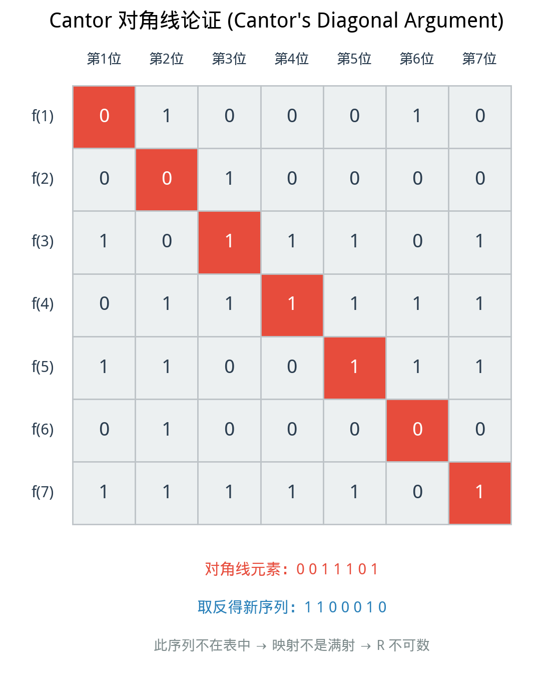

# §4 基数初步 [Bridge]（Cardinality）

**前置知识**：[§3 函数（集合论视角）](03-functions-as-sets.md)

**全景图**：有限集合的"大小"是显然的——数一数元素的个数即可。但无穷集合呢？"$\mathbb{N}$ 有多少个元素"这个问题有意义吗？Georg Cantor 在 19 世纪做出了数学史上最惊人的发现之一：无穷有不同的"大小"——自然数集和实数集虽然都是无穷集合，但实数集严格"更大"。本节介绍基数的基本概念和 Cantor 的核心定理。这些内容是理解现代数学（特别是分析学和集合论）的必要准备。

> **[Bridge]** 标记说明：本节内容略超出纯基础层面，属于基础与进阶之间的桥梁。它为后续课程（实分析、集合论、拓扑学等）做好准备。初学者可以在第一遍阅读时关注核心思想和直觉，留待第二遍深入细节。

**预估学习时间**：约 2 小时

---

## 动机

考虑以下问题：

- 自然数集 $\mathbb{N} = \{0, 1, 2, 3, \ldots\}$ 有多少个元素？
- 偶数集 $E = \{0, 2, 4, 6, \ldots\}$ 有多少个元素？
- $\mathbb{N}$ 和 $E$ 哪个"更大"？

直觉上，$E$ 是 $\mathbb{N}$ 的真子集（$E \subsetneq \mathbb{N}$），所以 $\mathbb{N}$ 应该"更大"。但另一方面，我们可以建立一一对应 $n \leftrightarrow 2n$，将 $\mathbb{N}$ 的每个元素恰好配对到 $E$ 的一个元素。在这个意义上，它们"一样多"。

这不是悖论——它揭示了**无穷集合的本质特征**：无穷集合可以与自己的真子集一一对应。Cantor 的天才在于他接受了这个事实，并在此基础上建立了严格的"无穷大小"理论。

---

## 1. 等势（Equinumerosity）

> **定义 1**（等势，equinumerosity / equicardinality）
>
> 两个集合 $A$ 和 $B$ 是**等势的（equinumerous）**，记作 $A \approx B$ 或 $|A| = |B|$，当且仅当存在从 $A$ 到 $B$ 的双射。

**直觉**：两个集合"大小相同"等价于它们之间可以建立完美的一一配对。这对有限集合显然成立：两个有限集合大小相同当且仅当元素可以一一配对。Cantor 的洞察是将这个直觉推广到无穷集合。

**例子**：

- $\{1, 2, 3\} \approx \{a, b, c\}$：双射 $1 \mapsto a, 2 \mapsto b, 3 \mapsto c$。
- $\mathbb{N} \approx E$（偶数集）：双射 $f(n) = 2n$。
- $\mathbb{N} \approx \mathbb{Z}$：见下文。

### 1.1 等势是等价关系

> **定理 1**
>
> 等势关系 $\approx$ 是所有集合上的等价关系。

> **证明**
>
> **自反性**：$A \approx A$，因为恒等函数 $\text{id}_A$ 是双射。
>
> **对称性**：若 $A \approx B$，即存在双射 $f: A \to B$，则 $f^{-1}: B \to A$ 也是双射，所以 $B \approx A$。
>
> **传递性**：若 $A \approx B$ 且 $B \approx C$，即存在双射 $f: A \to B$ 和 $g: B \to C$。则 $g \circ f: A \to C$ 是双射（§3 定理 2），所以 $A \approx C$。$\blacksquare$

---

## 2. 有限集与无限集

> **定义 2**（有限集与无限集）
>
> 集合 $A$ 是**有限的（finite）**，如果 $A = \emptyset$ 或存在正整数 $n$ 和双射 $f: \{1, 2, \ldots, n\} \to A$。此时称 $|A| = n$。
>
> 集合 $A$ 是**无限的（infinite）**，如果 $A$ 不是有限的。

**例子**：$\{a, b, c\}$ 是有限集，$|{\{a, b, c\}}| = 3$。$\mathbb{N}$, $\mathbb{Z}$, $\mathbb{Q}$, $\mathbb{R}$ 都是无限集。

### 2.1 Dedekind 无限

> **定义 3**（Dedekind 无限，Dedekind infinite）
>
> 集合 $A$ 是 **Dedekind 无限的**，如果 $A$ 与自己的某个真子集等势，即存在真子集 $B \subsetneq A$ 和双射 $f: A \to B$。

我们在动机部分已经看到，$\mathbb{N}$ 与其真子集 $E$（偶数集）等势（双射 $n \mapsto 2n$），所以 $\mathbb{N}$ 是 Dedekind 无限的。

> **[Bridge] 说明**：在 ZFC 公理系统中（假设选择公理），可以证明 Dedekind 无限与我们定义的无限是等价的。即：集合 $A$ 是无限的当且仅当 $A$ 是 Dedekind 无限的。这是一个不平凡的定理。

---

## 3. 可数集（Countable Set）

### 3.1 定义

> **定义 4**（可数集，countable set）
>
> 集合 $A$ 是**可数无限的（countably infinite）**，如果 $A \approx \mathbb{N}$，即存在双射 $f: \mathbb{N} \to A$。
>
> 集合 $A$ 是**可数的（countable）**，如果 $A$ 是有限的或可数无限的。
>
> 集合 $A$ 是**不可数的（uncountable）**，如果 $A$ 不是可数的。

可数无限集是"最小的无穷"。自然数集 $\mathbb{N}$ 的大小用 $\aleph_0$（读作 "aleph-null" 或 "aleph-zero"）表示。

### 3.2 $\mathbb{Z}$ 是可数的

> **定理 2**
>
> 整数集 $\mathbb{Z}$ 是可数无限的：$|\mathbb{Z}| = \aleph_0$。

> **证明**
>
> 构造双射 $f: \mathbb{N} \to \mathbb{Z}$ 如下：
>
> $$f(n) = \begin{cases} n/2, & \text{若 } n \text{ 是偶数} \\ -(n+1)/2, & \text{若 } n \text{ 是奇数} \end{cases}$$
>
> 即 $f$ 将自然数按以下顺序列举整数：
>
> $$0, -1, 1, -2, 2, -3, 3, -4, 4, \ldots$$
>
> | $n$ | 0 | 1 | 2 | 3 | 4 | 5 | 6 | 7 | 8 | $\ldots$ |
> |:---:|:---:|:---:|:---:|:---:|:---:|:---:|:---:|:---:|:---:|:---:|
> | $f(n)$ | 0 | $-1$ | 1 | $-2$ | 2 | $-3$ | 3 | $-4$ | 4 | $\ldots$ |
>
> **单射**：不同的 $n$ 值给出不同的 $f(n)$（可分偶数和奇数两组分别验证）。
>
> **满射**：每个整数 $k$ 都被映射到。若 $k \geq 0$，则 $f(2k) = k$；若 $k < 0$，则 $f(-2k - 1) = k$。
>
> 所以 $f$ 是双射，$\mathbb{Z} \approx \mathbb{N}$。$\blacksquare$

**直觉**：虽然整数"两头延伸"到无穷，但我们可以把它们"缠绕"成一条线：$0, -1, 1, -2, 2, \ldots$，从而与自然数一一配对。

### 3.3 $\mathbb{Q}$ 是可数的

> **定理 3**
>
> 有理数集 $\mathbb{Q}$ 是可数无限的：$|\mathbb{Q}| = \aleph_0$。

这个结果更加令人惊讶——有理数在实数轴上"稠密"（任何两个不同的实数之间都有有理数），但有理数集仍然只有 $\aleph_0$ 个元素。

> **证明（对角线排列法 / Cantor 配对）**
>
> 我们先证明正有理数集 $\mathbb{Q}^+$ 是可数的，然后推广到 $\mathbb{Q}$。
>
> **步骤 1**：将所有正有理数排成一个无穷矩阵。第 $p$ 行第 $q$ 列放 $p/q$（其中 $p, q \in \mathbb{Z}^+$）。
>
> $$\begin{array}{ccccc}
> 1/1 & 1/2 & 1/3 & 1/4 & \cdots \\
> 2/1 & 2/2 & 2/3 & 2/4 & \cdots \\
> 3/1 & 3/2 & 3/3 & 3/4 & \cdots \\
> 4/1 & 4/2 & 4/3 & 4/4 & \cdots \\
> \vdots & \vdots & \vdots & \vdots & \ddots
> \end{array}$$
>
> 这个矩阵包含了所有正有理数（可能有重复，如 $1/1 = 2/2 = 3/3$）。
>
> **步骤 2**：按**对角线**遍历矩阵。将所有位于同一条"反对角线"（$p + q = \text{常数}$）的元素归为一组，组内按 $p$ 从小到大排列：
>
> $$1/1; \quad 1/2, 2/1; \quad 1/3, 2/2, 3/1; \quad 1/4, 2/3, 3/2, 4/1; \quad \ldots$$
>
> **步骤 3**：去掉重复的分数（即跳过不是最简分数的项），得到 $\mathbb{Q}^+$ 的一个列举。
>
> 这给出了从 $\mathbb{N}^+$ 到 $\mathbb{Q}^+$ 的满射，跳过重复后得到双射。
>
> **步骤 4**：类似于 $\mathbb{Z}$ 的证明，交替列出正有理数和负有理数并加上 $0$：
>
> $$0, 1/1, -1/1, 1/2, -1/2, 2/1, -2/1, 1/3, -1/3, \ldots$$
>
> 这给出了 $\mathbb{N}$ 到 $\mathbb{Q}$ 的双射。所以 $\mathbb{Q}$ 是可数的。$\blacksquare$

### 3.4 可数集的性质

> **定理 4**（可数集的基本性质）
>
> (a) 可数集的子集是可数的（有限或可数无限）。
>
> (b) 两个可数集的并集是可数的。
>
> (c) 可数个可数集的并集是可数的。
>
> (d) 两个可数集的笛卡尔积是可数的。

这些性质的证明思路都类似：通过巧妙的列举方式构造双射或单射。定理 3 的证明实际上就是 (d) 的一个应用：$\mathbb{Q}^+ \approx \mathbb{Z}^+ \times \mathbb{Z}^+$（通过 $p/q \leftrightarrow (p, q)$），而 $\mathbb{Z}^+ \times \mathbb{Z}^+$ 可以通过对角线列举与 $\mathbb{Z}^+$ 一一对应。

---

## 4. 不可数集

### 4.1 $\mathbb{R}$ 是不可数的

> **定理 5**（Cantor，1891）
>
> 实数集 $\mathbb{R}$ 是不可数的。

这是数学中最著名的定理之一。Cantor 使用了他创造的**对角线论证（diagonal argument）**来证明它。

为了简化，我们证明开区间 $(0, 1)$ 是不可数的。由于存在 $(0, 1)$ 到 $\mathbb{R}$ 的双射（例如 $f(x) = \tan(\pi x - \pi/2)$），这就意味着 $\mathbb{R}$ 也是不可数的。

> **定理 6**
>
> 开区间 $(0, 1)$ 是不可数的。

> **证明（Cantor 对角线论证）**
>
> 用反证法。假设 $(0, 1)$ 是可数的，即存在双射 $f: \mathbb{N}^+ \to (0, 1)$。则 $(0, 1)$ 中的所有实数可以排成一个列表：
>
> $$f(1) = 0.d_{11}\,d_{12}\,d_{13}\,d_{14}\,\ldots$$
> $$f(2) = 0.d_{21}\,d_{22}\,d_{23}\,d_{24}\,\ldots$$
> $$f(3) = 0.d_{31}\,d_{32}\,d_{33}\,d_{34}\,\ldots$$
> $$f(4) = 0.d_{41}\,d_{42}\,d_{43}\,d_{44}\,\ldots$$
> $$\vdots$$
>
> 其中 $d_{ij}$ 是第 $i$ 个实数的小数展开的第 $j$ 位数字（$0$–$9$）。
>
> 现在，构造一个新的实数 $x = 0.c_1\,c_2\,c_3\,c_4\,\ldots$，其中第 $n$ 位数字 $c_n$ 由以下规则确定：
>
> $$c_n = \begin{cases} 5, & \text{若 } d_{nn} \neq 5 \\ 6, & \text{若 } d_{nn} = 5 \end{cases}$$
>
> （选择 $5$ 和 $6$ 而不是 $0$ 和 $9$ 是为了避免 $0.999\ldots = 1.000\ldots$ 这类小数表示不唯一的问题。）
>
> 则 $x \in (0, 1)$（$x$ 是一个合法的小数），但 $x$ 与列表中的每一个实数都不同：
>
> - $x \neq f(1)$，因为 $x$ 的第 $1$ 位 $c_1 \neq d_{11}$。
> - $x \neq f(2)$，因为 $x$ 的第 $2$ 位 $c_2 \neq d_{22}$。
> - 一般地，$x \neq f(n)$，因为 $x$ 的第 $n$ 位 $c_n \neq d_{nn}$。
>
> 所以 $x \notin \{f(1), f(2), f(3), \ldots\}$，即 $x$ 不在列表中。但我们假设列表包含了 $(0, 1)$ 中的所有实数——矛盾。
>
> 因此假设不成立，$(0, 1)$ 不是可数的。$\blacksquare$

**对角线论证的核心思想**：无论你怎么列出实数，我都能构造一个不在列表中的实数——通过在第 $n$ 个位置"故意"与列表中的第 $n$ 个数不同（在第 $n$ 位上改动）。这就是"对角线"的含义——我们沿着列表-小数矩阵的主对角线操作。

### 4.2 意义

Cantor 的对角线论证不仅证明了 $\mathbb{R}$ 的不可数性，更深刻地揭示了：

- **无穷有不同的"层次"**：$\mathbb{N}$ 是"较小的无穷"（$\aleph_0$），$\mathbb{R}$ 是"较大的无穷"（记为 $\mathfrak{c}$，称为**连续统的基数**）。
- 对角线论证是一种极其强大的证明技术，在计算理论（停机问题）、逻辑（哥德尔不完备定理）等领域都有类似的应用。

---

## 5. 基数的比较

### 5.1 基数的大小

> **定义 5**（基数的大小）
>
> - $|A| \leq |B|$ 当且仅当存在从 $A$ 到 $B$ 的单射。
> - $|A| < |B|$ 当且仅当 $|A| \leq |B|$ 且 $|A| \neq |B|$（即存在单射但不存在双射）。

### 5.2 Cantor 定理

> **定理 7**（Cantor 定理）
>
> 对任意集合 $A$，$|A| < |\mathcal{P}(A)|$。即，任何集合都严格小于自己的幂集。

这是集合论中最重要的定理之一。它意味着不存在"最大的无穷"——从任何无穷集合出发，取幂集就能得到更大的无穷。

> **证明**
>
> 需要证明两件事：(1) $|A| \leq |\mathcal{P}(A)|$，(2) $|A| \neq |\mathcal{P}(A)|$。
>
> **(1)** 定义单射 $\iota: A \to \mathcal{P}(A)$，$\iota(a) = \{a\}$。显然 $\iota$ 是单射（$\{a\} = \{b\} \implies a = b$）。所以 $|A| \leq |\mathcal{P}(A)|$。
>
> **(2)** 用反证法。假设存在双射 $f: A \to \mathcal{P}(A)$。定义集合：
>
> $$D = \{a \in A \mid a \notin f(a)\}$$
>
> 由于 $f$ 是到 $\mathcal{P}(A)$ 的双射，而 $D \subseteq A$，所以 $D \in \mathcal{P}(A)$。因此存在某个 $d \in A$ 使得 $f(d) = D$。
>
> 现在问：$d \in D$ 还是 $d \notin D$？
>
> - 若 $d \in D$：由 $D$ 的定义，$d \notin f(d)$。但 $f(d) = D$，所以 $d \notin D$。矛盾。
> - 若 $d \notin D$：由 $D$ 的定义（$D$ 包含所有不属于 $f(a)$ 的 $a$），$d \notin f(d) = D$ 的否定是"$d$ 不满足 $d \notin f(d)$"，即 $d \in f(d) = D$。矛盾。
>
> 两种情况都导致矛盾，所以双射 $f$ 不存在。
>
> 综合 (1) 和 (2)，$|A| < |\mathcal{P}(A)|$。$\blacksquare$

**注意**：这个证明与对角线论证本质相同！集合 $D$ 正是"对角线"的抽象版本：它通过在每个位置"取反"来构造一个矛盾元素。

### 5.3 无穷的阶梯

Cantor 定理意味着：

$$|\mathbb{N}| < |\mathcal{P}(\mathbb{N})| < |\mathcal{P}(\mathcal{P}(\mathbb{N}))| < \cdots$$

这是一个无穷上升的基数链。$|\mathbb{N}| = \aleph_0$，可以证明 $|\mathcal{P}(\mathbb{N})| = 2^{\aleph_0} = |\mathbb{R}| = \mathfrak{c}$。

### 5.4 Schröder-Bernstein 定理

> **定理 8**（Schröder-Bernstein 定理）
>
> 如果 $|A| \leq |B|$ 且 $|B| \leq |A|$，则 $|A| = |B|$。
>
> 即：如果存在从 $A$ 到 $B$ 的单射和从 $B$ 到 $A$ 的单射，则存在从 $A$ 到 $B$ 的双射。

这个定理非常有用，因为有时构造双射很困难，但分别构造两个方向的单射要容易得多。

> **[Bridge]** 定理的证明涉及较多技巧，这里省略。感兴趣的读者可以在集合论教材中找到完整证明。

---

## 6. [Bridge] 连续统假设

自然数集的基数是 $\aleph_0$，实数集的基数是 $\mathfrak{c} = 2^{\aleph_0}$。一个自然的问题是：

> 是否存在一个集合 $S$，使得 $\aleph_0 < |S| < \mathfrak{c}$？即，是否存在"介于"自然数和实数之间的无穷大小？

**连续统假设（Continuum Hypothesis, CH）** 声称不存在这样的集合：$2^{\aleph_0} = \aleph_1$（$\aleph_1$ 是第二小的无穷基数）。

这个问题有着传奇的历史：

- **1878**：Cantor 提出连续统假设。
- **1900**：Hilbert 将其列为 23 个世纪难题的第一个。
- **1940**：Gödel 证明了 CH 与 ZFC 公理系统**一致**——如果 ZFC 没有矛盾，那么 ZFC + CH 也没有矛盾。
- **1963**：Cohen 用力迫法（forcing）证明了 CH 与 ZFC **独立**——如果 ZFC 没有矛盾，那么 ZFC + $\neg$CH 也没有矛盾。

Gödel 和 Cohen 的结果合在一起意味着：**CH 不能从 ZFC 中证明，也不能从 ZFC 中反驳**。它是 ZFC 的独立命题。

这是数学基础中最深刻的结果之一——有些"自然"的数学问题，竟然没有"客观"的答案（至少在 ZFC 框架内）。更多讨论见 [思考者角落](thinkers-corner.md#2-连续统假设continuum-hypothesis)。

---

## 7. 例题

> **例题 1**
>
> 证明：$\mathbb{N}$ 与 $\mathbb{N} \times \mathbb{N}$ 等势。
>
> **解**：
>
> 需要构造双射 $f: \mathbb{N} \to \mathbb{N} \times \mathbb{N}$（或等价地，$g: \mathbb{N} \times \mathbb{N} \to \mathbb{N}$）。
>
> **方法（Cantor 配对函数）**：定义 $g: \mathbb{N} \times \mathbb{N} \to \mathbb{N}$：
>
> $$g(m, n) = \frac{(m + n)(m + n + 1)}{2} + m$$
>
> 可以验证 $g$ 是双射（Cantor 配对函数）。其直觉是按"反对角线"遍历 $\mathbb{N} \times \mathbb{N}$：
>
> | $(m, n)$ | $(0,0)$ | $(1,0)$ | $(0,1)$ | $(2,0)$ | $(1,1)$ | $(0,2)$ | $\ldots$ |
> |:---:|:---:|:---:|:---:|:---:|:---:|:---:|:---:|
> | $g(m,n)$ | 0 | 1 | 2 | 3 | 4 | 5 | $\ldots$ |
>
> 因此 $|\mathbb{N}| = |\mathbb{N} \times \mathbb{N}| = \aleph_0$。$\blacksquare$

> **例题 2**
>
> 证明：开区间 $(0, 1)$ 和 $(0, 2)$ 等势。
>
> **解**：
>
> 定义 $f: (0, 1) \to (0, 2)$，$f(x) = 2x$。
>
> **单射**：$2x_1 = 2x_2 \implies x_1 = x_2$。✓
>
> **满射**：对任意 $y \in (0, 2)$，取 $x = y/2 \in (0, 1)$，则 $f(x) = y$。✓
>
> 所以 $f$ 是双射，$(0, 1) \approx (0, 2)$。$\blacksquare$
>
> **推广**：任意两个非空有界开区间 $(a, b)$ 和 $(c, d)$ 都等势，双射为 $f(x) = c + \frac{(d - c)(x - a)}{b - a}$。

> **例题 3**
>
> 用 Cantor 定理证明不存在"所有集合的集合"。
>
> **解**：
>
> 假设存在所有集合的集合 $V$（即包含所有集合的集合）。
>
> 则 $\mathcal{P}(V) \subseteq V$（$V$ 的幂集中的每个元素——即 $V$ 的子集——本身也是一个集合，因此属于 $V$）。
>
> 这意味着 $|\mathcal{P}(V)| \leq |V|$。
>
> 但由 Cantor 定理，$|V| < |\mathcal{P}(V)|$。矛盾。
>
> 所以不存在"所有集合的集合"。$\blacksquare$
>
> 这个结论与 Russell 悖论异曲同工——它说明了不能无限制地谈论"所有集合"。

---

## 联系

> **联系** → [§3 函数](03-functions-as-sets.md)
>
> 基数的定义完全建立在双射（以及单射、满射）之上。函数论中关于复合保持双射的定理直接用于证明等势是等价关系。

> **联系** → 实分析
>
> $\mathbb{R}$ 的不可数性在实分析中有深远影响。它意味着"几乎所有"实数都是无理数（有理数只有 $\aleph_0$ 个，而实数有 $\mathfrak{c}$ 个）。这个观察是测度论和概率论的起点。

> **联系** → 计算理论
>
> 对角线论证在计算理论中的对应物是**停机问题的不可判定性**证明（Turing, 1936）：不存在一个程序能判断所有程序是否停机。证明方法本质上是构造一个"故意与每一行不同"的对象。

---

## 要点回顾

1. **等势**：两集合间存在双射 $\iff$ "大小相同"。等势是等价关系。
2. **Dedekind 无限**：无穷集可与自身的真子集等势（如 $\mathbb{N} \approx \{0, 2, 4, \ldots\}$）。
3. **可数集**：与 $\mathbb{N}$ 等势。$\mathbb{Z}$ 和 $\mathbb{Q}$ 都可数。
4. **不可数集**：$\mathbb{R}$ 不可数——**Cantor 对角线论证**通过"在每一位上与列表中的数不同"来构造矛盾。
5. **Cantor 定理**：$|A| < |\mathcal{P}(A)|$——任何集合都严格小于它的幂集。不存在最大的无穷。
6. **[Bridge] 连续统假设**：是否存在介于 $\aleph_0$ 和 $\mathfrak{c}$ 之间的基数？答案是 ZFC 中独立的。

---

## 进度检查点

- ☐ 我理解"等势"的定义（存在双射）及其作为"大小相同"的含义
- ☐ 我能构造 $\mathbb{N}$ 到 $\mathbb{Z}$ 的双射
- ☐ 我理解 $\mathbb{Q}$ 是可数的（对角线排列法）
- ☐ 我能复述 Cantor 对角线论证的核心思想
- ☐ 我理解 Cantor 定理 $|A| < |\mathcal{P}(A)|$ 的证明思路

---

### 自测题

1. 构造从 $\{0, 1, 2, \ldots\}$ 到 $\{1, 2, 3, \ldots\}$ 的双射，从而证明这两个集合等势。

2. 判断：所有无穷集合是否都等势？给出理由。

3. 用一两句话解释 Cantor 对角线论证的核心思想。

4. 为什么 $\mathbb{Q}$ 可数但 $\mathbb{R}$ 不可数？两者的本质区别是什么？

5. 设 $A = \{1, 2, 3\}$。$|A| = 3$, $|\mathcal{P}(A)| = ?$。验证 $|A| < |\mathcal{P}(A)|$。

查看答案

1. 定义 $f(n) = n + 1$。$f(0) = 1, f(1) = 2, f(2) = 3, \ldots$

   **单射**：$n_1 + 1 = n_2 + 1 \implies n_1 = n_2$。✓

   **满射**：对任意正整数 $m$，取 $n = m - 1 \geq 0$，则 $f(n) = m$。✓

   所以 $\{0, 1, 2, \ldots\} \approx \{1, 2, 3, \ldots\}$。

2. **否。** $\mathbb{N}$ 和 $\mathbb{R}$ 都是无穷集合，但 $|\mathbb{N}| < |\mathbb{R}|$（Cantor 对角线论证证明了不存在从 $\mathbb{N}$ 到 $\mathbb{R}$ 的双射）。无穷有不同的"大小"。

3. Cantor 对角线论证假设所有实数都可以列成一个列表，然后构造一个新的实数——它与列表中的第 $n$ 个数在第 $n$ 位小数上不同，因此不在列表中——这与"列表包含所有实数"矛盾。

4. 直觉上，每个有理数可以用有限的信息（两个整数 $p$ 和 $q$）来描述，而实数的小数展开需要无穷位的信息。严格地说，$\mathbb{Q}$ 可以通过对角线排列法列成一个列表（与 $\mathbb{N}$ 建立双射），但 $\mathbb{R}$ 不能（对角线论证证明任何列表都不完整）。

5. $|\mathcal{P}(\{1, 2, 3\})| = 2^3 = 8$。$3 < 8$，所以 $|A| < |\mathcal{P}(A)|$。✓

   这是 Cantor 定理在有限集上的体现。更一般地，$n < 2^n$ 对所有非负整数 $n$ 成立。

---

**习题引用**：→ 本节习题见 [exercises/exercises.md](exercises/exercises.md#§4-基数初步)
