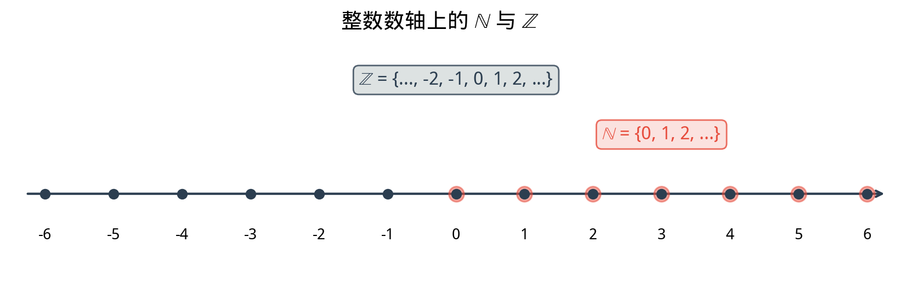

# §1 自然数与整数（Natural Numbers and Integers）

**前置知识**：[Part 1 第 2 章 集合论](../../part-01-foundations/ch02-sets/README.md)（集合、等价关系）、[Part 1 第 3 章 证明方法](../../part-01-foundations/ch03-proof-methods/README.md)（数学归纳法）

**全景图**：自然数是人类最早认识的数——数羊、数星星、数手指。整数则是人类第一次"发明"数——为了让减法畅通无阻，我们引入了负数。本节从自然数的基本公理出发，严格地理解自然数的结构，然后通过等价类的方法将自然数扩展为整数。这一扩展的模式——"旧运算不封闭 → 引入新数"——将在整个第 1 章中反复出现。

**预估学习时间**：约 2 小时

---

## 动机

数学的大厦始于最朴素的活动：**计数**。

一个牧羊人清点他的羊群：一只、两只、三只……他不需要知道什么是"集合"，什么是"公理"，就能完成这个任务。但作为数学家，我们需要追问：这些"数"究竟是什么？它们满足什么规则？这些规则为什么成立？

更深层的问题来自运算。加法和乘法在自然数中总是可行的——两个自然数之和仍然是自然数。但减法呢？$5 - 3 = 2$，没问题。$3 - 5 = ?$ 在自然数中，这个问题无解。

为了让减法永远可行，我们需要一种新的数——**负数**。自然数加上负数，就构成了**整数**。这是数系扩展的第一步，也是最直觉的一步。

---

## 1. 自然数（Natural Numbers）$\mathbb{N}$

### 1.1 什么是自然数？

> **定义 1**（自然数集，set of natural numbers）
>
> 自然数集记作 $\mathbb{N}$，定义为
>
> $$\mathbb{N} = \{0, 1, 2, 3, \ldots\}$$
>
> 即包含零和所有正整数的集合。

**约定说明**：关于 $\mathbb{N}$ 是否包含 $0$，数学界并没有统一的约定。有些教材定义 $\mathbb{N} = \{1, 2, 3, \ldots\}$（不含 $0$），此时用 $\mathbb{N}_0$ 表示含 $0$ 的版本。本教材采用包含 $0$ 的约定，因为这在集合论、计算机科学和现代数学中更为常用。当需要排除 $0$ 时，我们写 $\mathbb{N}^* = \{1, 2, 3, \ldots\}$ 或 $\mathbb{Z}^+$。

### 1.2 Peano 公理的直觉（Peano Axioms — Intuition）

自然数并非"凭空存在"的，它可以从几条简单的规则出发完全刻画。这组规则称为 **Peano 公理**（Peano axioms），以意大利数学家朱塞佩·皮亚诺（Giuseppe Peano, 1858–1932）命名。

> **Peano 公理**（非形式表述）
>
> 1. **零存在**：$0$ 是一个自然数。
> 2. **后继存在**：每个自然数 $n$ 都有一个**后继**（successor）$S(n)$，且 $S(n)$ 也是自然数。
> 3. **零不是后继**：不存在自然数 $n$ 使得 $S(n) = 0$，即 $0$ 不是任何自然数的后继。
> 4. **后继单射**：若 $S(m) = S(n)$，则 $m = n$。也就是说，不同的自然数有不同的后继。
> 5. **归纳公理**：若集合 $A \subseteq \mathbb{N}$ 满足 (i) $0 \in A$，(ii) 若 $n \in A$ 则 $S(n) \in A$，则 $A = \mathbb{N}$。

**直觉解读**：

- 公理 1 给出起点：我们从 $0$ 开始。
- 公理 2 给出生成规则：$0$ 的后继是 $1$，$1$ 的后继是 $2$，$2$ 的后继是 $3$……如此无穷延伸。
- 公理 3 保证没有"回环"：链条不会绕回 $0$。
- 公理 4 保证没有"合并"：链条不会从两个不同的数汇聚到同一个后继。
- 公理 5 就是数学归纳法原理——它保证自然数集就是从 $0$ 出发、通过反复取后继所生成的全部，没有"多余"的元素混进来。

将公理 3 和 4 结合，自然数形成一条从 $0$ 出发、无限延伸、不分叉、不回环的"链条"：

$$0 \to 1 \to 2 \to 3 \to 4 \to \cdots$$

### 1.3 自然数上的运算

#### 加法

加法可以通过后继运算递归定义。直觉上，$m + n$ 就是从 $m$ 开始，取 $n$ 次后继：

> **定义 2**（自然数加法，递归定义）
>
> 对任意自然数 $m$：
>
> 1. $m + 0 = m$（加零不变）
> 2. $m + S(n) = S(m + n)$（加后继 = 结果取后继）

**例子**：计算 $2 + 3$。

$$2 + 3 = 2 + S(2) = S(2 + 2) = S(2 + S(1)) = S(S(2 + 1))$$
$$= S(S(2 + S(0))) = S(S(S(2 + 0))) = S(S(S(2))) = S(S(3)) = S(4) = 5$$

这个过程虽然繁琐，但展示了加法的本质：它不过是反复取后继。

#### 乘法

类似地，乘法通过加法递归定义：

> **定义 3**（自然数乘法，递归定义）
>
> 对任意自然数 $m$：
>
> 1. $m \times 0 = 0$（乘零得零）
> 2. $m \times S(n) = m \times n + m$（乘后继 = 加一个 $m$）

**例子**：计算 $2 \times 3$。

$$2 \times 3 = 2 \times S(2) = 2 \times 2 + 2 = (2 \times S(1) + 2) = (2 \times 1 + 2) + 2$$
$$= (2 \times S(0) + 2) + 2 = ((2 \times 0 + 2) + 2) + 2 = (0 + 2 + 2) + 2 = 6$$

### 1.4 自然数的基本性质

> **命题 1**（$\mathbb{N}$ 上运算的封闭性）
>
> 对任意 $m, n \in \mathbb{N}$：
>
> - $m + n \in \mathbb{N}$（加法封闭）
> - $m \times n \in \mathbb{N}$（乘法封闭）

但减法不封闭！$3 - 5$ 在 $\mathbb{N}$ 中没有答案。这正是我们需要整数的原因。

加法和乘法满足以下熟悉的性质（均可用归纳法从上述递归定义推导）：

| 性质 | 加法 | 乘法 |
|------|------|------|
| 交换律（commutativity） | $m + n = n + m$ | $m \times n = n \times m$ |
| 结合律（associativity） | $(m + n) + k = m + (n + k)$ | $(m \times n) \times k = m \times (n \times k)$ |
| 单位元（identity） | $m + 0 = m$ | $m \times 1 = m$ |
| 分配律（distributivity） | \multicolumn{2}{c}{$m \times (n + k) = m \times n + m \times k$} |

（上表中分配律横跨两列，表示乘法对加法的分配。）

### 1.5 自然数的序

自然数上有自然的**全序关系**（total order）$\leq$：

> **定义 4**（自然数上的序）
>
> 对 $m, n \in \mathbb{N}$，定义 $m \leq n$ 当且仅当存在 $k \in \mathbb{N}$ 使得 $m + k = n$。

直觉上，$m \leq n$ 意味着从 $m$ 出发取若干次后继可以到达 $n$。

### 1.6 良序性（Well-Ordering）

自然数有一个极其重要的性质，它与数学归纳法等价：

> **定理 1**（自然数的良序原理，well-ordering principle）
>
> $\mathbb{N}$ 的每个非空子集都有最小元素。
>
> 即：若 $A \subseteq \mathbb{N}$，$A \neq \emptyset$，则存在 $a_0 \in A$ 使得对所有 $a \in A$，$a_0 \leq a$。

**直觉**：在自然数的"链条"上，从 $0$ 开始往右走，非空子集 $A$ 中你第一个碰到的元素就是最小元素。

**良序原理与归纳法的等价性**：在 Part 1 第 3 章中，我们已经学习了数学归纳法。事实上，良序原理和归纳法是等价的——接受其中一个作为公理，可以推导出另一个。

> **命题 2**（良序原理 $\Leftrightarrow$ 归纳法原理）
>
> 以下两条等价：
>
> (i) 自然数的良序原理。
>
> (ii) 数学归纳法原理：若 $P(0)$ 为真且对所有 $k \in \mathbb{N}$，$P(k) \Rightarrow P(k+1)$，则 $P(n)$ 对所有 $n \in \mathbb{N}$ 成立。

> **证明**（良序原理 $\Rightarrow$ 归纳法原理，思路）
>
> 设 $P(0)$ 为真且 $\forall k\,(P(k) \Rightarrow P(k+1))$。假设归纳法的结论不成立，即存在 $n$ 使得 $P(n)$ 为假。令 $A = \{n \in \mathbb{N} : \neg P(n)\}$。则 $A \neq \emptyset$。由良序原理，$A$ 有最小元素 $a_0$。因为 $P(0)$ 为真，所以 $a_0 \neq 0$，即 $a_0 \geq 1$。于是 $a_0 - 1 \in \mathbb{N}$ 且 $a_0 - 1 \notin A$（因为 $a_0$ 是 $A$ 的最小元素），故 $P(a_0 - 1)$ 为真。由归纳步骤，$P(a_0)$ 为真，但 $a_0 \in A$ 意味着 $P(a_0)$ 为假，矛盾。$\blacksquare$

---

## 2. 整数（Integers）$\mathbb{Z}$

### 2.1 扩展的动机

自然数在加法和乘法下封闭，但减法不封闭：

$$3 - 5 = ?$$

在 $\mathbb{N}$ 中没有答案。更一般地，方程

$$a + x = b$$

在 $\mathbb{N}$ 中只有当 $b \geq a$ 时才有解。为了让这个方程**总有解**，我们需要引入**负数**。自然数加上负数，就构成了整数集 $\mathbb{Z}$（来自德语 *Zahlen*，意为"数"）。

$$\mathbb{Z} = \{\ldots, -3, -2, -1, 0, 1, 2, 3, \ldots\}$$

### 2.2 整数的构造思想

我们如何从 $\mathbb{N}$ "制造"出 $\mathbb{Z}$？关键思想：用自然数的**有序对**来表示整数。

**直觉**：整数 $a - b$ 可以用有序对 $(a, b)$ 来表示，其中 $a, b \in \mathbb{N}$。例如：

| 有序对 $(a, b)$ | 表示的整数 $a - b$ |
|:---:|:---:|
| $(5, 3)$ | $2$ |
| $(3, 5)$ | $-2$ |
| $(0, 0)$ | $0$ |
| $(7, 0)$ | $7$ |
| $(0, 4)$ | $-4$ |

但这里有一个问题：同一个整数可以被多个有序对表示！例如，$(5, 3)$、$(6, 4)$、$(7, 5)$ 都表示整数 $2$。我们需要一个**等价关系**来识别这些表示。

> **定义 5**（$\mathbb{N} \times \mathbb{N}$ 上的等价关系）
>
> 在 $\mathbb{N} \times \mathbb{N}$ 上定义关系 $\sim$：
>
> $$(a, b) \sim (c, d) \iff a + d = b + c$$
>
> （直觉：$a - b = c - d$ 等价于 $a + d = b + c$，而后者只涉及自然数的加法，不需要减法！）

**关键观察**：我们在定义中巧妙地避免了减法——因为我们还没有减法！等式 $a + d = b + c$ 只使用了自然数的加法，是完全合法的。

> **命题 3**（$\sim$ 是等价关系）
>
> 上述关系 $\sim$ 满足自反性、对称性和传递性。

> **证明**：
>
> **自反性**：$(a, b) \sim (a, b)$？需要 $a + b = b + a$。由自然数加法的交换律成立。✓
>
> **对称性**：若 $(a, b) \sim (c, d)$，即 $a + d = b + c$，则 $c + b = d + a$（等号两边交换），即 $(c, d) \sim (a, b)$。✓
>
> **传递性**：若 $(a, b) \sim (c, d)$ 且 $(c, d) \sim (e, f)$，即 $a + d = b + c$ 且 $c + f = d + e$。两式相加：
>
> $$(a + d) + (c + f) = (b + c) + (d + e)$$
>
> 整理得 $a + f + (c + d) = b + e + (c + d)$。由自然数加法的消去律，$a + f = b + e$，即 $(a, b) \sim (e, f)$。✓
>
> $\blacksquare$

> **定义 6**（整数集的构造）
>
> 整数集 $\mathbb{Z}$ 定义为 $\mathbb{N} \times \mathbb{N}$ 关于等价关系 $\sim$ 的商集：
>
> $$\mathbb{Z} = (\mathbb{N} \times \mathbb{N}) / {\sim}$$
>
> 每个整数是一个等价类 $[(a, b)]$。我们将等价类 $[(a, b)]$ 直觉上理解为 $a - b$。

### 2.3 自然数嵌入整数

自然数如何"住进"整数中？

> **定义 7**（嵌入映射）
>
> 定义映射 $\iota: \mathbb{N} \to \mathbb{Z}$，$\iota(n) = [(n, 0)]$。

这个映射是**单射**（injective），且保持加法和乘法结构。因此我们可以将自然数 $n$ 等同于整数 $[(n, 0)]$，从而自然地将 $\mathbb{N}$ 视为 $\mathbb{Z}$ 的子集。

$$\mathbb{N} \hookrightarrow \mathbb{Z}, \quad n \mapsto [(n, 0)]$$

### 2.4 整数上的运算

在等价类表示下，整数的运算定义如下：

> **定义 8**（整数的加法和乘法）
>
> $$[(a, b)] + [(c, d)] = [(a + c, b + d)]$$
>
> $$[(a, b)] \times [(c, d)] = [(ac + bd, ad + bc)]$$

**加法的直觉**：$(a - b) + (c - d) = (a + c) - (b + d)$。

**乘法的直觉**：$(a - b)(c - d) = ac - ad - bc + bd = (ac + bd) - (ad + bc)$。

这些定义需要验证**与代表元的选取无关**（well-defined），即如果选择同一等价类的不同代表元，运算的结果仍在同一等价类中。这是构造商集时必须检查的标准步骤（详见习题）。

### 2.5 整数的减法与加法逆元

现在减法终于可以定义了！

> **定义 9**（加法逆元，additive inverse）
>
> 对整数 $[(a, b)]$，其加法逆元为 $-[(a, b)] = [(b, a)]$。
>
> 直觉：$-(a - b) = b - a$。

> **定义 10**（整数的减法）
>
> $$[(a, b)] - [(c, d)] = [(a, b)] + (- [(c, d)]) = [(a, b)] + [(d, c)] = [(a + d, b + c)]$$

**关键成果**：在 $\mathbb{Z}$ 中，方程 $a + x = b$ 对任意 $a, b \in \mathbb{Z}$ 总有唯一解 $x = b - a$。减法封闭了！

### 2.6 整数的序

> **定义 11**（整数上的序）
>
> 对整数 $x = [(a, b)]$ 和 $y = [(c, d)]$，定义：
>
> $$x \leq y \iff a + d \leq b + c \quad (\text{这里} \leq \text{是} \mathbb{N} \text{上的序})$$

在这个序下，$\mathbb{Z}$ 形成一个**全序集**（totally ordered set）：任意两个整数都可以比较大小。

### 2.7 整数的代数结构

整数 $(\mathbb{Z}, +, \times)$ 满足以下性质：

| 性质 | 内容 |
|------|------|
| 加法交换律 | $a + b = b + a$ |
| 加法结合律 | $(a + b) + c = a + (b + c)$ |
| 加法单位元 | $a + 0 = a$ |
| 加法逆元 | $a + (-a) = 0$ |
| 乘法交换律 | $a \cdot b = b \cdot a$ |
| 乘法结合律 | $(a \cdot b) \cdot c = a \cdot (b \cdot c)$ |
| 乘法单位元 | $a \cdot 1 = a$ |
| 分配律 | $a \cdot (b + c) = a \cdot b + a \cdot c$ |

在代数中，满足上述性质的结构称为**交换环**（commutative ring）。更进一步，$\mathbb{Z}$ 还是一个**整环**（integral domain），即满足**零因子消去律**：若 $a \cdot b = 0$ 则 $a = 0$ 或 $b = 0$。

但 $\mathbb{Z}$ **不是域**（field），因为大多数整数没有乘法逆元——例如 $2$ 的乘法逆元 $\frac{1}{2}$ 不是整数。这正是我们需要有理数的原因，将在 [§2](02-rationals.md) 中讨论。

### 2.8 绝对值与符号

> **定义 12**（整数的绝对值，absolute value）
>
> $$|n| = \begin{cases} n & \text{若 } n \geq 0 \\ -n & \text{若 } n < 0 \end{cases}$$
>
> 直觉：$|n|$ 是 $n$ 在数轴上到原点的距离。

绝对值满足以下性质：

> **命题 4**（绝对值的基本性质）
>
> 对任意 $a, b \in \mathbb{Z}$：
>
> (i) $|a| \geq 0$，且 $|a| = 0 \iff a = 0$
>
> (ii) $|ab| = |a| \cdot |b|$（乘法相容）
>
> (iii) $|a + b| \leq |a| + |b|$（三角不等式，triangle inequality）

> **定义 13**（符号函数，sign function）
>
> $$\text{sgn}(n) = \begin{cases} 1 & \text{若 } n > 0 \\ 0 & \text{若 } n = 0 \\ -1 & \text{若 } n < 0 \end{cases}$$
>
> 于是 $n = \text{sgn}(n) \cdot |n|$。

---

## 3. 运算的形式化（Formalization of Operations）

### 3.1 整数加法的形式化验证

我们已经定义了 $[(a,b)] + [(c,d)] = [(a+c, b+d)]$。但这个定义建立在等价类的代表元上——我们必须验证它**不依赖代表元的选取**。

> **命题 5**（加法的良定义性，well-definedness）
>
> 若 $(a, b) \sim (a', b')$ 且 $(c, d) \sim (c', d')$，则 $(a+c, b+d) \sim (a'+c', b'+d')$。

> **证明**：
>
> 已知 $a + b' = b + a'$ 且 $c + d' = d + c'$。
>
> 需证 $(a + c) + (b' + d') = (b + d) + (a' + c')$。
>
> 将两个已知等式相加：
>
> $$(a + b') + (c + d') = (b + a') + (d + c')$$
>
> 由加法的交换律和结合律重新排列：
>
> $$(a + c) + (b' + d') = (b + d) + (a' + c')$$
>
> 这正是所要证明的。$\blacksquare$

### 3.2 整数乘法的形式化验证

类似地，需要验证乘法 $[(a,b)] \times [(c,d)] = [(ac + bd, ad + bc)]$ 是良定义的。

> **命题 6**（乘法的良定义性）
>
> 若 $(a, b) \sim (a', b')$ 且 $(c, d) \sim (c', d')$，则 $(ac + bd, ad + bc) \sim (a'c' + b'd', a'd' + b'c')$。

证明过程较为繁琐但思路类似，本质上是利用 $a + b' = b + a'$ 和 $c + d' = d + c'$ 这两个等式进行代数运算。详细证明留作习题。

### 3.3 负数乘以负数为正

一个常见的问题是：为什么"负负得正"？在形式化框架下，这不是一个"规定"，而是一个可以**证明**的结论。

> **命题 7**（负负得正）
>
> 对任意 $a, b \in \mathbb{N}$，$a, b > 0$，有 $(-a) \times (-b) = ab$。

> **证明**：
>
> 在等价类表示中，$-a = [(0, a)]$，$-b = [(0, b)]$。
>
> $$[(0, a)] \times [(0, b)] = [(0 \cdot 0 + a \cdot b,\; 0 \cdot b + a \cdot 0)] = [(ab, 0)]$$
>
> 而 $[(ab, 0)]$ 对应正整数 $ab$。因此 $(-a)(-b) = ab$。$\blacksquare$

**直觉理解**：也可以从分配律推导。已知 $a + (-a) = 0$，两边乘以 $-b$：

$$a \cdot (-b) + (-a)(-b) = 0 \cdot (-b) = 0$$

又 $a \cdot (-b) = -(ab)$（可类似证明），所以：

$$-(ab) + (-a)(-b) = 0 \implies (-a)(-b) = ab$$

### 3.3 整数除法与余数

虽然整数的除法不封闭（$\frac{5}{3} \notin \mathbb{Z}$），但整数有一种重要的"带余除法"：

> **定理 3**（带余除法，division with remainder）
>
> 对任意整数 $a$ 和正整数 $b$，存在唯一的整数 $q$（商，quotient）和 $r$（余数，remainder）使得：
>
> $$a = bq + r, \quad 0 \leq r < b$$

**例子**：$17 = 5 \times 3 + 2$（$q = 3$，$r = 2$）。$-7 = 3 \times (-3) + 2$（$q = -3$，$r = 2$）。

> **证明思路**（利用良序原理）：
>
> 考虑集合 $S = \{a - bk : k \in \mathbb{Z},\; a - bk \geq 0\}$。由 Archimedean 性质，$S$ 非空。由良序原理，$S$ 有最小元素 $r = a - bq$。若 $r \geq b$，则 $r - b = a - b(q+1) \geq 0$ 且 $r - b < r$，矛盾于 $r$ 是最小的。因此 $0 \leq r < b$。唯一性留作习题。$\blacksquare$

带余除法是数论的基础工具，将在 Part 2 第 3 章中深入讨论。

---

## 4. 数系扩展的模式

回顾我们的旅程：

| | $\mathbb{N}$（自然数） | $\mathbb{Z}$（整数） |
|---|---|---|
| 加法封闭 | ✓ | ✓ |
| 减法封闭 | ✗ | ✓ |
| 乘法封闭 | ✓ | ✓ |
| 除法封闭 | ✗ | ✗ |
| 代数结构 | 交换幺半群 | 交换环（整环） |
| 序结构 | 良序 | 全序（但不良序！） |

扩展从 $\mathbb{N}$ 到 $\mathbb{Z}$，我们**获得**了减法的封闭性（每个元素有加法逆元），但**失去**了良序性——$\mathbb{Z}$ 没有最小元素。

下一步扩展：为了让除法封闭，我们将在 [§2](02-rationals.md) 中从 $\mathbb{Z}$ 构造有理数 $\mathbb{Q}$。

---

## 例题

### 例题 1：验证等价关系

**题目**：详细验证定义 5 中的等价关系 $\sim$ 的传递性，即：若 $(a, b) \sim (c, d)$ 且 $(c, d) \sim (e, f)$，则 $(a, b) \sim (e, f)$。

**解答**：

已知：
- $(a, b) \sim (c, d)$，即 $a + d = b + c$ ……①
- $(c, d) \sim (e, f)$，即 $c + f = d + e$ ……②

需证：$(a, b) \sim (e, f)$，即 $a + f = b + e$。

将 ① 和 ② 相加：

$$(a + d) + (c + f) = (b + c) + (d + e)$$

重新组合（利用加法交换律和结合律）：

$$(a + f) + (c + d) = (b + e) + (c + d)$$

由自然数加法的消去律（若 $x + k = y + k$ 则 $x = y$）：

$$a + f = b + e$$

即 $(a, b) \sim (e, f)$。$\blacksquare$

---

### 例题 2：负数相乘

**题目**：直接从分配律出发，证明对任意正整数 $a$，$(-1) \times a = -a$。

**解答**：

我们需要证明 $(-1) \times a + a = 0$（因为 $-a$ 是 $a$ 的加法逆元，满足 $-a + a = 0$）。

$$(-1) \times a + a = (-1) \times a + 1 \times a$$

由分配律：

$$= ((-1) + 1) \times a = 0 \times a = 0$$

因此 $(-1) \times a$ 是 $a$ 的加法逆元，即 $(-1) \times a = -a$。$\blacksquare$

推论：$(-1) \times (-1) = -(-1) = 1$，从而 $(-a)(-b) = (-1)a \cdot (-1)b = (-1)(-1) \cdot ab = ab$。

---

### 例题 3：良序原理的应用

**题目**：用良序原理证明：不存在无穷递减的自然数序列，即不存在序列 $a_1 > a_2 > a_3 > \cdots$，其中 $a_i \in \mathbb{N}$。

**解答**：

假设存在这样的无穷递减序列 $a_1 > a_2 > a_3 > \cdots$。

令 $A = \{a_1, a_2, a_3, \ldots\} \subseteq \mathbb{N}$。$A$ 非空（至少包含 $a_1$）。

由良序原理，$A$ 有最小元素 $a_0$。设 $a_0 = a_k$（即 $a_0$ 是序列中的第 $k$ 项）。

但 $a_{k+1} \in A$ 且 $a_{k+1} < a_k = a_0$，矛盾于 $a_0$ 是 $A$ 的最小元素。

因此假设不成立，不存在这样的无穷递减序列。$\blacksquare$

---

### 例题 4：整数运算的验证

**题目**：在等价类表示下，验证 $[(3, 1)] + [(0, 2)] = [(1, 0)]$，并解释其含义。

**解答**：

$$[(3, 1)] + [(0, 2)] = [(3 + 0, 1 + 2)] = [(3, 3)]$$

现在验证 $[(3, 3)] = [(1, 0)]$，即 $(3, 3) \sim (1, 0)$：

$$3 + 0 = 3 \quad \text{和} \quad 3 + 1 = 4$$

$3 + 0 \neq 3 + 1$，所以 $(3, 3) \not\sim (1, 0)$。

等等！让我们重新计算。$(3, 3) \sim (1, 0)$ 需要 $3 + 0 = 3 + 1$，即 $3 = 4$，不成立。

实际上 $[(3, 1)]$ 表示 $3 - 1 = 2$，$[(0, 2)]$ 表示 $0 - 2 = -2$。所以结果应该是 $2 + (-2) = 0$。

$[(3, 3)]$ 表示 $3 - 3 = 0 = [(0, 0)]$。验证：$(3, 3) \sim (0, 0)$ 需要 $3 + 0 = 3 + 0$，即 $3 = 3$。✓

因此 $[(3, 1)] + [(0, 2)] = [(3, 3)] = [(0, 0)]$，对应整数 $0$。

含义：$2 + (-2) = 0$。✓

---

## 要点回顾

1. **自然数** $\mathbb{N} = \{0, 1, 2, \ldots\}$ 是最基本的数系，可由 Peano 公理完全刻画。
2. **Peano 公理**的核心：零存在、后继存在、后继单射、零不是后继、归纳公理。
3. 自然数在**加法和乘法**下封闭，但**减法不封闭**。
4. **良序原理**：$\mathbb{N}$ 的每个非空子集有最小元素。它与数学归纳法等价。
5. **整数** $\mathbb{Z}$ 通过等价类 $[(a, b)]$（直觉为 $a - b$）从 $\mathbb{N} \times \mathbb{N}$ 构造。
6. 等价关系 $(a, b) \sim (c, d) \iff a + d = b + c$ 巧妙地避免了在定义中使用减法。
7. $\mathbb{Z}$ 是**交换环**（整环），加法、减法、乘法封闭，但除法不封闭。
8. **负负得正**是分配律的必然推论，不是人为规定。
9. 从 $\mathbb{N}$ 到 $\mathbb{Z}$ 的扩展获得了减法封闭性，失去了良序性。

---

## 进度检查点

完成本节后，你应该能够：

- [ ] 陈述 Peano 公理（非形式表述）
- [ ] 解释为什么自然数在减法下不封闭
- [ ] 描述用有序对 $(a, b)$ 和等价关系构造 $\mathbb{Z}$ 的基本思想
- [ ] 验证该等价关系确实是等价关系
- [ ] 在等价类表示下进行整数的加法和乘法运算
- [ ] 陈述良序原理，并解释它与归纳法的关系
- [ ] 证明"负负得正"

---

## 自测题

**自测题 1**：Peano 公理中的"归纳公理"（公理 5）有什么作用？如果去掉它会怎样？

参考答案

归纳公理保证 $\mathbb{N}$ 中没有"多余"的元素。没有它，除了 $0, 1, 2, \ldots$，还可能有额外的元素（比如一个"孤立的"元素 $\omega$，不是任何自然数的后继，也不是 $0$）混入 $\mathbb{N}$。归纳公理排除了这种可能性：它要求每个自然数要么是 $0$，要么是某个自然数的后继。

**自测题 2**：在构造整数时，为什么等价关系定义为 $(a, b) \sim (c, d) \iff a + d = b + c$，而不是 $a - b = c - d$？

参考答案

因为我们正在构造整数——减法尚未定义！$a - b$ 在 $\mathbb{N}$ 中可能无意义（例如 $3 - 5$）。而 $a + d = b + c$ 只涉及自然数的加法，是完全合法的。这是一个用旧工具（$\mathbb{N}$ 的加法）构建新概念（$\mathbb{Z}$）的巧妙技巧。

**自测题 3**：$\mathbb{Z}$ 有最小元素吗？这与 $\mathbb{N}$ 的良序性有何不同？

参考答案

$\mathbb{Z}$ 没有最小元素：对任意整数 $n$，总存在更小的整数 $n - 1$。因此 $\mathbb{Z}$ 不满足良序性（$\mathbb{Z}$ 本身是 $\mathbb{Z}$ 的非空子集，但没有最小元素）。更具体地，$\mathbb{Z}$ 的子集 $\{0, -1, -2, -3, \ldots\}$ 没有最小元素。良序性是 $\mathbb{N}$ 的特殊性质，在从 $\mathbb{N}$ 扩展到 $\mathbb{Z}$ 时丧失了。

**自测题 4**：在等价类表示下，计算 $[(2, 5)] \times [(1, 3)]$，并解释结果对应的整数。

参考答案

$[(2, 5)]$ 表示 $2 - 5 = -3$，$[(1, 3)]$ 表示 $1 - 3 = -2$。

$$[(2, 5)] \times [(1, 3)] = [(2 \cdot 1 + 5 \cdot 3,\; 2 \cdot 3 + 5 \cdot 1)] = [(2 + 15,\; 6 + 5)] = [(17, 11)]$$

$[(17, 11)]$ 表示 $17 - 11 = 6$。

验证：$(-3) \times (-2) = 6$。✓

---

## 习题

本节的练习题见 [练习题](exercises/exercises.md)（§1 部分）。
