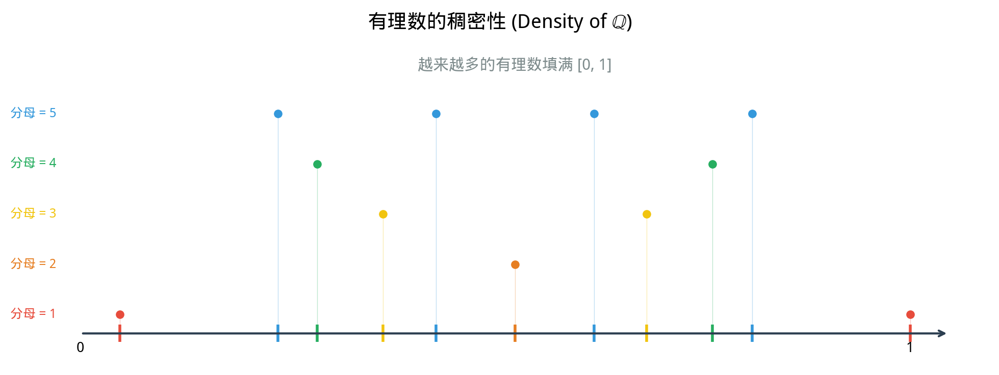

# §2 有理数（Rational Numbers）

**前置知识**：[§1 自然数与整数](01-naturals-integers.md)、[Part 1 第 2 章 §2 关系](../../part-01-foundations/ch02-sets/02-relations.md)（等价关系）

**全景图**：整数解决了减法不封闭的问题，但除法仍然不封闭——$2 \div 3$ 在整数中没有答案。为了让除法（除以非零数）畅通无阻，我们将整数扩展为有理数。有理数构成一个**域**（field）——加减乘除全部封闭。然而有理数并非完美：数轴上存在"空隙"——像 $\sqrt{2}$ 这样的数不是有理数。这些空隙将推动我们在 §3 中走向实数。

**预估学习时间**：约 2 小时

---

## 动机

整数的除法不封闭：

$$2 \div 3 = ?$$

在 $\mathbb{Z}$ 中没有答案。更一般地，方程

$$a \cdot x = b$$

在 $\mathbb{Z}$ 中只有当 $a \mid b$（$a$ 整除 $b$）时才有解。为了让这个方程**对所有 $a \neq 0$ 都有解**，我们需要引入分数。

这与 §1 中的扩展模式完全平行：

| 问题 | 从…扩展到… |
|------|------------|
| 减法不封闭：$3 - 5 = ?$ | $\mathbb{N} \to \mathbb{Z}$ |
| 除法不封闭：$2 \div 3 = ?$ | $\mathbb{Z} \to \mathbb{Q}$ |

---

## 1. 有理数的构造（Construction of Rationals）

### 1.1 构造的思路

回忆 §1 中整数的构造方法：用有序对 $(a, b)$ 表示 $a - b$，通过等价关系识别不同的表示。我们对有理数采用完全相同的策略：用有序对 $(a, b)$ 表示 $\frac{a}{b}$。

**直觉**：分数 $\frac{a}{b}$ 就是有序对 $(a, b)$，其中 $a \in \mathbb{Z}$，$b \in \mathbb{Z}$，$b \neq 0$。同一个有理数可以有多种表示：

$$\frac{1}{2} = \frac{2}{4} = \frac{3}{6} = \frac{-1}{-2} = \cdots$$

我们需要一个等价关系来识别这些不同的表示。

> **定义 1**（$\mathbb{Z} \times (\mathbb{Z} \setminus \{0\})$ 上的等价关系）
>
> 在集合 $\mathbb{Z} \times (\mathbb{Z} \setminus \{0\})$ 上定义关系 $\sim$：
>
> $$(a, b) \sim (c, d) \iff ad = bc$$
>
> （直觉：$\frac{a}{b} = \frac{c}{d}$ 等价于 $ad = bc$，而后者只涉及整数的乘法，不需要除法！）

这与 §1 中整数构造的策略一脉相承：用已有运算（整数乘法）定义等价关系，避免使用尚未定义的运算（除法）。

> **命题 1**（$\sim$ 是等价关系）
>
> 上述关系 $\sim$ 满足自反性、对称性和传递性。

> **证明**：
>
> **自反性**：$(a, b) \sim (a, b)$？需要 $ab = ba$。由整数乘法交换律成立。✓
>
> **对称性**：若 $(a, b) \sim (c, d)$，即 $ad = bc$，则 $cb = da$（等号两边交换），即 $(c, d) \sim (a, b)$。✓
>
> **传递性**：若 $(a, b) \sim (c, d)$ 且 $(c, d) \sim (e, f)$，即 $ad = bc$ 且 $cf = de$。
>
> 将两个等式相乘：$(ad)(cf) = (bc)(de)$，即 $acdf = bcde$。
>
> 若 $c \neq 0$，可消去 $c$：$adf = bde$，即 $d(af) = d(be)$。又 $d \neq 0$（因为 $(c, d)$ 中 $d \neq 0$），消去 $d$：$af = be$，即 $(a, b) \sim (e, f)$。✓
>
> 若 $c = 0$，则由 $ad = bc = 0$ 且 $d \neq 0$ 得 $a = 0$。由 $cf = 0 = de$ 且 $d \neq 0$ 得 $e = 0$。于是 $af = 0 = be$，即 $(a, b) \sim (e, f)$。✓
>
> $\blacksquare$

> **定义 2**（有理数集）
>
> 有理数集 $\mathbb{Q}$ 定义为商集：
>
> $$\mathbb{Q} = \big(\mathbb{Z} \times (\mathbb{Z} \setminus \{0\})\big) / {\sim}$$
>
> 等价类 $[(a, b)]$ 记作 $\frac{a}{b}$。字母 $\mathbb{Q}$ 来自意大利语 *quoziente*（商）。

### 1.2 有理数上的运算

> **定义 3**（有理数的加法和乘法）
>
> $$\frac{a}{b} + \frac{c}{d} = \frac{ad + bc}{bd}$$
>
> $$\frac{a}{b} \times \frac{c}{d} = \frac{ac}{bd}$$

**直觉**：这就是我们在小学学过的分数运算规则——通分加法，分子分母分别相乘。

与 §1 中整数的构造一样，必须验证这些运算是**良定义的**——与代表元的选取无关。验证方法类似（利用 $ad = bc$ 的等价条件），这里省略细节。

> **定义 4**（有理数的减法和除法）
>
> $$\frac{a}{b} - \frac{c}{d} = \frac{a}{b} + \frac{-c}{d} = \frac{ad - bc}{bd}$$
>
> 若 $c \neq 0$：
>
> $$\frac{a}{b} \div \frac{c}{d} = \frac{a}{b} \times \frac{d}{c} = \frac{ad}{bc}$$

**关键成果**：在 $\mathbb{Q}$ 中，方程 $ax = b$ 对任意 $a, b \in \mathbb{Q}$（$a \neq 0$）有唯一解 $x = \frac{b}{a}$。除法（除以非零数）封闭了！

### 1.3 整数嵌入有理数

> **命题 2**（$\mathbb{Z}$ 嵌入 $\mathbb{Q}$）
>
> 映射 $\iota: \mathbb{Z} \to \mathbb{Q}$，$\iota(n) = \frac{n}{1}$，是一个保持加法、乘法和序的单射。因此 $\mathbb{Z}$ 可以自然地视为 $\mathbb{Q}$ 的子集。

$$\mathbb{N} \subset \mathbb{Z} \subset \mathbb{Q}$$

---

## 2. 有理数的性质（Properties of Rationals）

### 2.1 域结构（Field Structure）

> **定理 1**（$\mathbb{Q}$ 是域）
>
> $(\mathbb{Q}, +, \times)$ 满足以下性质，称为**域公理**（field axioms）：
>
> **加法公理**：
> 1. 交换律：$a + b = b + a$
> 2. 结合律：$(a + b) + c = a + (b + c)$
> 3. 单位元：$a + 0 = a$
> 4. 逆元：$a + (-a) = 0$
>
> **乘法公理**：
> 5. 交换律：$a \cdot b = b \cdot a$
> 6. 结合律：$(a \cdot b) \cdot c = a \cdot (b \cdot c)$
> 7. 单位元：$a \cdot 1 = a$
> 8. 逆元（$a \neq 0$）：$a \cdot a^{-1} = 1$
>
> **分配律**：
> 9. $a \cdot (b + c) = a \cdot b + a \cdot c$

**域 vs 环**：回忆 §1 中，整数 $\mathbb{Z}$ 是一个环（ring）——它满足公理 1–7 和 9，但不满足公理 8（非零元素不一定有乘法逆元，例如 $2$ 在 $\mathbb{Z}$ 中没有乘法逆元）。有理数 $\mathbb{Q}$ 补上了公理 8，成为一个域（field）。

**域是什么？** 简单来说，域就是"加减乘除全部畅通"的代数结构。

### 2.2 有序域（Ordered Field）

有理数不仅是域，还是**有序域**：

> **定义 5**（$\mathbb{Q}$ 上的序）
>
> 对 $\frac{a}{b}, \frac{c}{d} \in \mathbb{Q}$（假设 $b, d > 0$），定义：
>
> $$\frac{a}{b} \leq \frac{c}{d} \iff ad \leq bc$$

> **定理 2**（$\mathbb{Q}$ 是有序域）
>
> $\mathbb{Q}$ 是一个**有序域**（ordered field），即它同时是一个域和一个全序集，且序与运算相容：
>
> - 若 $a \leq b$，则 $a + c \leq b + c$
> - 若 $a \leq b$ 且 $c \geq 0$，则 $ac \leq bc$

### 2.3 稠密性（Density）

有理数有一个与整数截然不同的性质：

> **定理 3**（有理数的稠密性，density of rationals）
>
> 在任意两个不同的有理数之间，存在另一个有理数。
>
> 即：若 $p, q \in \mathbb{Q}$，$p < q$，则存在 $r \in \mathbb{Q}$ 使得 $p < r < q$。

> **证明**：
>
> 取 $r = \frac{p + q}{2}$。
>
> 首先，$r \in \mathbb{Q}$：因为 $p, q \in \mathbb{Q}$，有理数的加法和除以 $2$（即乘以 $\frac{1}{2}$）的结果仍在 $\mathbb{Q}$ 中。
>
> 然后，$p < r$：因为 $p < q$，有 $2p < p + q$，即 $p < \frac{p + q}{2} = r$。
>
> 类似地，$r < q$：因为 $p + q < 2q$，即 $r = \frac{p + q}{2} < q$。
>
> 因此 $p < r < q$。$\blacksquare$

**推论**：在任意两个有理数之间，有**无穷多**个有理数。

> **证明**：
>
> 给定 $p < q$，由稠密性取 $r_1$ 使得 $p < r_1 < q$。再在 $p$ 与 $r_1$ 之间取 $r_2$，得 $p < r_2 < r_1 < q$。以此类推，可以取无穷多个有理数。$\blacksquare$

**直觉**：整数在数轴上如同"钉子"，相邻两个整数之间有间距 $1$ 的空隙。而有理数像"沙子"，无论你在数轴上找多么小的一段区间，里面都有无穷多个有理数。有理数"稠密"地填满了数轴……但是，真的**完全**填满了吗？

### 2.4 十进制表示（Decimal Representation）

有理数与十进制小数之间有漂亮的对应关系：

> **定理 4**（有理数的十进制表示）
>
> 一个实数是有理数，当且仅当它的十进制表示是**有限小数**（terminating decimal）或**无限循环小数**（eventually repeating decimal）。

**例子**：

| 有理数 | 十进制表示 | 类型 |
|:---:|:---:|:---:|
| $\frac{1}{4}$ | $0.25$ | 有限小数 |
| $\frac{1}{3}$ | $0.333\ldots = 0.\overline{3}$ | 循环小数 |
| $\frac{1}{7}$ | $0.\overline{142857}$ | 循环小数 |
| $\frac{22}{7}$ | $3.\overline{142857}$ | 循环小数 |

**为什么有理数的小数表示一定终止或循环？**

直觉说明：做长除法 $a \div b$ 时，每一步的余数只能取 $0, 1, 2, \ldots, b-1$ 这 $b$ 个值。因此至多 $b$ 步后，必然出现重复的余数，从而产生循环。如果某一步余数为 $0$，则小数终止。

> **命题 3**（有限小数的刻画）
>
> $\frac{a}{b}$（最简分数形式）是有限小数，当且仅当 $b$ 的质因子只含 $2$ 和 $5$。
>
> 即 $b = 2^m \cdot 5^n$，其中 $m, n \geq 0$。

**例子**：$\frac{1}{8} = \frac{1}{2^3} = 0.125$（有限小数）；$\frac{1}{6} = \frac{1}{2 \cdot 3}$，因为含质因子 $3$，所以是循环小数 $0.1\overline{6}$。

---

## 3. 有理数的"缺陷"（The "Defect" of Rationals）

有理数如此"稠密"，它们能填满整条数轴吗？

答案是**否定**的。数轴上存在"空隙"——有些点不对应任何有理数。

### 3.1 $\sqrt{2}$ 不是有理数

最著名的例子是 $\sqrt{2}$——即满足 $x^2 = 2$ 的正数。

> **定理 5**（$\sqrt{2}$ 的无理性）
>
> $\sqrt{2} \notin \mathbb{Q}$，即不存在有理数 $\frac{p}{q}$（$p, q \in \mathbb{Z}$，$q \neq 0$）使得 $\left(\frac{p}{q}\right)^2 = 2$。

> **证明**（反证法）：
>
> 假设 $\sqrt{2} = \frac{p}{q}$，其中 $p, q \in \mathbb{Z}$，$q > 0$，且 $\gcd(p, q) = 1$（最简分数）。
>
> 两边平方：$2 = \frac{p^2}{q^2}$，即 $p^2 = 2q^2$。
>
> 由此 $p^2$ 是偶数，所以 $p$ 是偶数（因为奇数的平方是奇数）。设 $p = 2k$。
>
> 代入：$(2k)^2 = 2q^2$，即 $4k^2 = 2q^2$，即 $q^2 = 2k^2$。
>
> 由此 $q^2$ 是偶数，所以 $q$ 是偶数。
>
> 但 $p$ 和 $q$ 都是偶数，矛盾于 $\gcd(p, q) = 1$。
>
> 因此假设不成立，$\sqrt{2} \notin \mathbb{Q}$。$\blacksquare$

这个证明最早可追溯到古希腊毕达哥拉斯学派（Pythagorean school），是数学史上最早的反证法之一。据传说，毕达哥拉斯学派的成员希帕索斯（Hippasus）因发现（或泄露）这一事实而被同门扔进大海。

### 3.2 有理数的"空隙"

$\sqrt{2}$ 在数轴上有一个明确的位置——它是边长为 $1$ 的正方形的对角线长度——但这个位置不被任何有理数占据。

更精确地说：定义 $A = \{r \in \mathbb{Q} : r > 0 \text{ 且 } r^2 < 2\}$ 和 $B = \{r \in \mathbb{Q} : r > 0 \text{ 且 } r^2 > 2\}$。

则 $A$ 没有最大元素，$B$ 没有最小元素。$A$ 中的数可以任意接近 $\sqrt{2}$ 但永远到不了，$B$ 也是如此。两组之间有一个"空隙"——$\sqrt{2}$ 的位置——而这个空隙不被 $\mathbb{Q}$ 中的任何数填充。

> **命题 4**（$A$ 没有最大元素）
>
> 设 $A = \{r \in \mathbb{Q} : r > 0,\; r^2 < 2\}$。则 $A$ 没有最大元素：对任意 $r \in A$，存在 $r' \in A$ 使得 $r < r'$。

> **证明思路**：
>
> 给定 $r \in A$（即 $r > 0$，$r^2 < 2$），我们需要找到一个有理数 $r'$ 使得 $r < r'$ 且 $(r')^2 < 2$。
>
> 取 $r' = r + \frac{2 - r^2}{r + 2}$。可以验证 $r' > r$（因为 $2 - r^2 > 0$）且 $r' \in \mathbb{Q}$（有理数的运算封闭）。
>
> 经过计算：
>
> $$(r')^2 = \left(r + \frac{2 - r^2}{r + 2}\right)^2 = \left(\frac{r(r+2) + 2 - r^2}{r + 2}\right)^2 = \left(\frac{2r + 2}{r + 2}\right)^2 = \left(\frac{2(r + 1)}{r + 2}\right)^2$$
>
> 需要验证 $(r')^2 < 2$，即 $\frac{4(r+1)^2}{(r+2)^2} < 2$，即 $4(r+1)^2 < 2(r+2)^2$，即 $2(r+1)^2 < (r+2)^2$。
>
> 展开：$2r^2 + 4r + 2 < r^2 + 4r + 4$，即 $r^2 < 2$。这正是 $r \in A$ 的条件。✓
>
> 因此 $r' \in A$ 且 $r' > r$，即 $A$ 没有最大元素。$\blacksquare$

### 3.3 有理数不完备

这个"空隙"的存在说明了有理数的一个根本性缺陷：

> **直觉总结**
>
> 有理数在数轴上是稠密的——任意两个有理数之间有无穷多个有理数。但有理数不是**完备的**——数轴上存在"空隙"，有些点不被任何有理数占据。

"完备性"（completeness）的精确含义将在 [§3 实数](03-reals.md) 中讨论。目前只需要知道：**有理数虽然稠密，但仍然有"漏洞"**。这些漏洞正是无理数（irrational numbers）所在的位置。

### 3.3 几何视角：数轴上的空隙

从几何角度看，有理数可以与数轴上的点对应。有理数的稠密性告诉我们：有理点在数轴上"到处都有"。但 $\sqrt{2}$ 的无理性告诉我们：有些几何上自然产生的点（如单位正方形对角线端点在数轴上的投影），并不对应任何有理数。

更具体地想象：拿一把只有有理刻度的尺子。无论刻度多么精细（$\frac{1}{10}$, $\frac{1}{100}$, $\frac{1}{1000}$, ...），你都无法精确标出 $\sqrt{2} \approx 1.41421356\ldots$ 的位置。每一个有理近似值都"差一点"——而这个差距永远无法通过有限精度消除。

可以将有理数类比为"有孔的海绵"：海绵到处都有物质（有理数稠密），但也到处都有孔洞（无理数的位置）。这些孔洞看不见、摸不着（你无法在有理数之间找到一个"空的区间"），但它们确实存在——而且比海绵本身的物质"多得多"（无理数不可数，有理数可数）。

### 3.4 更多无理数的例子

$\sqrt{2}$ 并非唯一的无理数。类似的论证可以证明：

- $\sqrt{3}$，$\sqrt{5}$，以及更一般地，$\sqrt{n}$ 对于非完全平方数 $n$ 都是无理数。
- $\sqrt[3]{2}$（$2$ 的立方根）是无理数。
- $\log_2 3$ 是无理数。

> **命题 5**
>
> 若正整数 $n$ 不是完全平方数，则 $\sqrt{n} \notin \mathbb{Q}$。

> **证明思路**（反证法）：
>
> 假设 $\sqrt{n} = \frac{p}{q}$（最简分数），则 $n = \frac{p^2}{q^2}$，即 $p^2 = nq^2$。
>
> 设 $n$ 的质因数分解中有某个质数 $r$ 出现奇数次。则 $nq^2$ 中 $r$ 的幂次与 $p^2$ 中 $r$ 的幂次的奇偶性不同（$p^2$ 中每个质因子都出现偶数次），矛盾于唯一分解定理。$\blacksquare$

---

## 4. 小结与展望

| | $\mathbb{N}$ | $\mathbb{Z}$ | $\mathbb{Q}$ |
|---|---|---|---|
| 加法封闭 | ✓ | ✓ | ✓ |
| 减法封闭 | ✗ | ✓ | ✓ |
| 乘法封闭 | ✓ | ✓ | ✓ |
| 除法封闭（除以非零） | ✗ | ✗ | ✓ |
| 代数结构 | 交换幺半群 | 整环 | **域** |
| 序结构 | 良序 | 全序 | 全序、稠密 |
| 完备性 | — | — | **不完备** |

从 $\mathbb{Z}$ 到 $\mathbb{Q}$，我们**获得**了除法的封闭性（域结构）和稠密性。

但 $\mathbb{Q}$ 仍有空隙。为了填满这些空隙——即实现**完备性**——我们需要在 [§3](03-reals.md) 中构造实数 $\mathbb{R}$。

### 3.5 无理性证明的一般方法

证明一个数是无理的，最常用的方法是**反证法**：假设它等于某个最简分数 $\frac{p}{q}$，然后推出矛盾（通常是 $p$ 和 $q$ 有公因子，矛盾于"最简"）。

另一种方法是利用**唯一分解定理**（fundamental theorem of arithmetic）：每个大于 $1$ 的整数可以唯一地分解为素数之积。如果 $\frac{p^2}{q^2} = n$（$n$ 不是完全平方数），则 $p^2$ 和 $q^2$ 的质因数分解中每个素数出现偶数次，而 $nq^2$ 中至少有一个素数出现奇数次，矛盾。

还有一些更高级的方法（如 Liouville 定理、连分数展开），但超出本章范围。

---

## 例题

### 例题 1：分数的等价性

**题目**：验证 $\frac{2}{3} = \frac{-4}{-6}$（使用等价关系的定义）。

**解答**：

需要验证 $(2, 3) \sim (-4, -6)$，即 $2 \times (-6) = 3 \times (-4)$。

$$2 \times (-6) = -12, \quad 3 \times (-4) = -12$$

$-12 = -12$。✓

因此 $\frac{2}{3} = \frac{-4}{-6}$。$\blacksquare$

---

### 例题 2：有理数的稠密性应用

**题目**：找出 $\frac{1}{3}$ 和 $\frac{1}{2}$ 之间的三个有理数。

**解答**：

**方法一**：反复取中点。

$$r_1 = \frac{\frac{1}{3} + \frac{1}{2}}{2} = \frac{\frac{5}{6}}{2} = \frac{5}{12}$$

$$r_2 = \frac{\frac{1}{3} + \frac{5}{12}}{2} = \frac{\frac{4}{12} + \frac{5}{12}}{2} = \frac{\frac{9}{12}}{2} = \frac{9}{24} = \frac{3}{8}$$

$$r_3 = \frac{\frac{5}{12} + \frac{1}{2}}{2} = \frac{\frac{5}{12} + \frac{6}{12}}{2} = \frac{\frac{11}{12}}{2} = \frac{11}{24}$$

验证：$\frac{1}{3} = \frac{8}{24} < \frac{3}{8} = \frac{9}{24} < \frac{5}{12} = \frac{10}{24} < \frac{11}{24} < \frac{1}{2} = \frac{12}{24}$。✓

**方法二**：通分。$\frac{1}{3} = \frac{4}{12}$，$\frac{1}{2} = \frac{6}{12}$。需要更多的数？进一步通分：$\frac{1}{3} = \frac{8}{24}$，$\frac{1}{2} = \frac{12}{24}$。

之间的有理数：$\frac{9}{24} = \frac{3}{8}$，$\frac{10}{24} = \frac{5}{12}$，$\frac{11}{24}$。

---

### 例题 3：证明 $\log_2 3$ 是无理数

**题目**：证明 $\log_2 3 \notin \mathbb{Q}$。

**解答**：

假设 $\log_2 3 = \frac{p}{q}$，其中 $p, q \in \mathbb{Z}$，$q > 0$。

则 $2^{p/q} = 3$，即 $2^p = 3^q$。

$2^p$ 是偶数（$p \geq 1$，因为 $\log_2 3 > 1$），$3^q$ 是奇数。

偶数 $\neq$ 奇数，矛盾。

因此 $\log_2 3 \notin \mathbb{Q}$。$\blacksquare$

---

### 例题 4：十进制表示

**题目**：将 $0.\overline{142857}$ 转化为分数。

**解答**：

设 $x = 0.\overline{142857} = 0.142857142857\ldots$

则 $10^6 x = 142857.\overline{142857}$

$$10^6 x - x = 142857$$

$$999999 x = 142857$$

$$x = \frac{142857}{999999} = \frac{1}{7}$$

验证：$1 \div 7 = 0.\overline{142857}$。✓

---

### 例题 5：有理数的中位数

**题目**：设 $a, b \in \mathbb{Q}$，$a < b$。证明中位数 $\frac{a + b}{2}$ 是 $a$ 和 $b$ 之间的有理数（即稠密性定理的具体构造）。

**解答**：

首先验证 $\frac{a+b}{2} \in \mathbb{Q}$：$a, b \in \mathbb{Q}$，有理数对加法封闭，$a + b \in \mathbb{Q}$；有理数对除法封闭（除以非零），$\frac{a + b}{2} \in \mathbb{Q}$。✓

然后验证 $a < \frac{a + b}{2} < b$：

$a < \frac{a + b}{2} \iff 2a < a + b \iff a < b$。✓（已知 $a < b$）

$\frac{a + b}{2} < b \iff a + b < 2b \iff a < b$。✓

因此 $a < \frac{a+b}{2} < b$，且 $\frac{a+b}{2} \in \mathbb{Q}$。$\blacksquare$

---

### 例题 6：有理数域的最小性

**题目**：证明 $\mathbb{Q}$ 是包含 $\mathbb{Z}$ 的最小域，即任何包含所有整数的域都包含 $\mathbb{Q}$。

**解答**：

设 $F$ 是一个域且 $\mathbb{Z} \subseteq F$。需证 $\mathbb{Q} \subseteq F$。

任取 $\frac{a}{b} \in \mathbb{Q}$，$a, b \in \mathbb{Z}$，$b \neq 0$。

因为 $\mathbb{Z} \subseteq F$，$a \in F$ 且 $b \in F$。因为 $b \neq 0$ 且 $F$ 是域，$b$ 在 $F$ 中有乘法逆元 $b^{-1} \in F$。

$\frac{a}{b} = a \cdot b^{-1} \in F$（域对乘法封闭）。

因此 $\mathbb{Q} \subseteq F$。$\blacksquare$

---

## 要点回顾

1. **有理数** $\mathbb{Q}$ 通过等价类从 $\mathbb{Z} \times (\mathbb{Z} \setminus \{0\})$ 构造，等价关系为 $(a,b) \sim (c,d) \iff ad = bc$。
2. 构造策略与整数相同：用已有运算（乘法）定义等价关系，避免使用未定义的运算（除法）。
3. $\mathbb{Q}$ 是一个**有序域**——加减乘除（除以非零）全部封闭。
4. **稠密性**：任意两个有理数之间有无穷多个有理数。
5. **十进制特征**：有理数等价于有限小数或无限循环小数。
6. **有理数不完备**：$\sqrt{2} \notin \mathbb{Q}$，数轴上存在不被有理数占据的"空隙"。
7. 从 $\mathbb{Z}$ 到 $\mathbb{Q}$，获得了域结构和稠密性，但仍缺少完备性。

---

## 进度检查点

完成本节后，你应该能够：

- [ ] 描述用有序对和等价关系构造 $\mathbb{Q}$ 的方法
- [ ] 陈述有理数的域公理
- [ ] 证明有理数的稠密性
- [ ] 将循环小数转化为分数
- [ ] 复述 $\sqrt{2}$ 无理性的反证法证明
- [ ] 解释"有理数不完备"是什么意思

---

## 自测题

**自测题 1**：域（field）与环（ring）的关键区别是什么？

参考答案

关键区别在于**乘法逆元**的存在性。在域中，每个非零元素都有乘法逆元（即除法总是可行的）；在环中，非零元素不一定有乘法逆元。例如，$\mathbb{Z}$ 是环但不是域（$2$ 在 $\mathbb{Z}$ 中没有乘法逆元），而 $\mathbb{Q}$ 是域（$2$ 的乘法逆元是 $\frac{1}{2} \in \mathbb{Q}$）。

**自测题 2**：为什么整数是"离散的"而有理数是"稠密的"？

参考答案

整数是离散的：每个整数 $n$ 都有一个"最近的邻居"$n+1$，之间没有其他整数。更精确地说，不存在整数 $m$ 使得 $n < m < n + 1$。

有理数是稠密的：任意两个不同的有理数之间，都存在另一个有理数（例如取中点 $\frac{p+q}{2}$）。有理数之间没有"间隙"——但有"空隙"（不被有理数占据的点，如 $\sqrt{2}$）。

**自测题 3**：$0.\overline{9} = 0.999\ldots$ 等于多少？

参考答案

$0.\overline{9} = 1$。

证明：设 $x = 0.\overline{9}$，则 $10x = 9.\overline{9}$，$10x - x = 9$，$9x = 9$，$x = 1$。

这不是"近似"或"极限"——$0.\overline{9}$ **严格等于** $1$。这是十进制表示不唯一性的一个例子：同一个有理数可以有不同的十进制表示。

**自测题 4**：$\frac{1}{6}$ 的十进制表示是有限小数还是循环小数？为什么？

参考答案

$\frac{1}{6}$ 是循环小数（$0.1\overline{6}$）。原因：将 $\frac{1}{6}$ 化为最简分数后，分母 $6 = 2 \times 3$ 含有质因子 $3$（不只是 $2$ 和 $5$）。根据命题 3，只有分母的质因子全为 $2$ 和 $5$ 的分数才是有限小数。

---

## 习题

本节的练习题见 [练习题](exercises/exercises.md)（§2 部分）。
