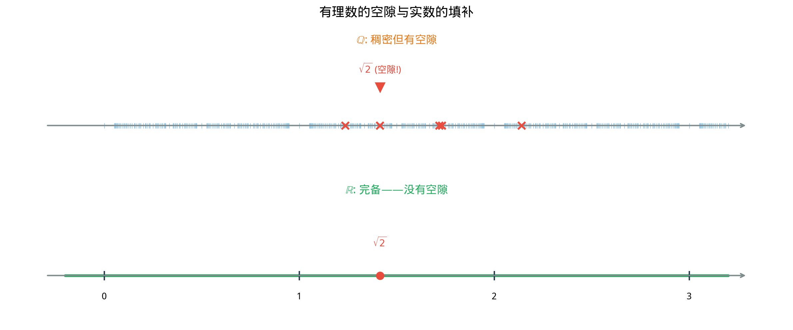
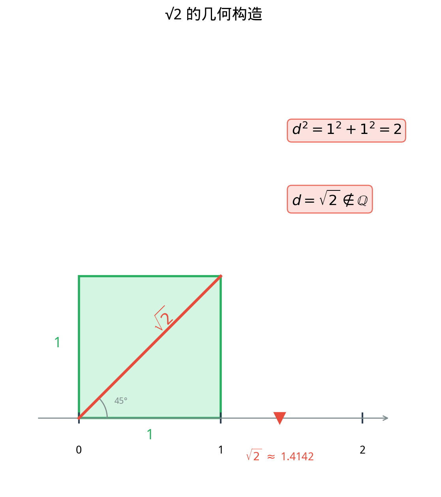

# §3 实数（Real Numbers）

**前置知识**：[§2 有理数](02-rationals.md)

**全景图**：有理数虽然稠密，却不完备——数轴上存在不被有理数占据的"空隙"（如 $\sqrt{2}$ 的位置）。实数的使命就是填满这些空隙，使数轴成为**连续的**、没有任何裂缝的整体。本节从无理数的发现讲起，引入实数的完备性（暂时接受为公理），然后讨论实数的基本性质和区间表示。实数的严格构造（Dedekind 分割或 Cauchy 序列）将在第 2 章中详细展开。

**预估学习时间**：约 2–3 小时

---

## 动机

在 §2 中，我们发现了有理数的一个根本性缺陷：数轴上存在**空隙**。$\sqrt{2}$ 在数轴上有确定的位置——它是边长为 $1$ 的正方形的对角线长度——但这个位置不被任何有理数占据。

更令人不安的是，这样的"空隙"并非罕见的例外，而是**无处不在**的。无理数实际上比有理数"多得多"——有理数是可数的（Part 1 Ch02 §4 已证），而无理数是不可数的（后面会提到）。

数学需要一个没有空隙的数轴。分析学的基本定理——中值定理、极值定理、微积分基本定理——都依赖于数轴的连续性。没有实数，微积分就站不住脚。

这就是我们需要实数的根本原因：**填满空隙，让数轴完备**。

---

## 1. 无理数的发现（Discovery of Irrational Numbers）

### 1.1 毕达哥拉斯的危机

古希腊毕达哥拉斯学派（约公元前 6 世纪）相信"万物皆数"——这里的"数"指的是自然数和它们的比（即有理数）。他们相信任何几何量都可以表示为两个整数之比。

然而，他们自己的定理——毕达哥拉斯定理（Pythagorean theorem）——摧毁了这个信念。

考虑一个边长为 $1$ 的正方形。其对角线长度 $d$ 满足：

$$d^2 = 1^2 + 1^2 = 2$$

即 $d = \sqrt{2}$。但正如 §2 中证明的，$\sqrt{2}$ 不是有理数。

这是数学史上第一次"危机"：几何上清晰存在的量（对角线长度），在算术上却找不到对应的数。一个边长为 $1$ 的正方形的对角线——如此简单的几何对象——竟然测量不出一个"精确的"有理数长度。

### 1.2 无理数的定义

> **定义 1**（无理数，irrational number）
>
> 无理数是不能表示为两个整数之比的实数。即，$x$ 是无理数当且仅当 $x \in \mathbb{R}$ 且 $x \notin \mathbb{Q}$。

**注意**：无理数的定义是**否定性的**——它告诉我们无理数"不是什么"（不是有理数），而不是"是什么"。这在数学中并不少见，但它确实让无理数比有理数更难具体描述。

### 1.3 无理数的例子

| 无理数 | 近似值 | 来源 |
|:---:|:---:|:---:|
| $\sqrt{2}$ | $1.41421\ldots$ | 正方形对角线 |
| $\sqrt{3}$ | $1.73205\ldots$ | 等边三角形的高 |
| $\pi$ | $3.14159\ldots$ | 圆周率 |
| $e$ | $2.71828\ldots$ | 自然对数的底 |
| $\phi = \frac{1 + \sqrt{5}}{2}$ | $1.61803\ldots$ | 黄金比例 |

这些数的小数表示都是**无限不循环**的——这正是它们不是有理数的标志。

### 1.4 代数无理数与超越数（预览）

无理数可以进一步分类：

> **定义 2**（代数数与超越数）
>
> - **代数数**（algebraic number）：某个整系数多项式 $a_n x^n + \cdots + a_1 x + a_0 = 0$（$a_n \neq 0$）的根。
> - **超越数**（transcendental number）：不是任何整系数多项式的根的实数。

**例子**：

- $\sqrt{2}$ 是代数数：它是 $x^2 - 2 = 0$ 的根。
- $\phi = \frac{1 + \sqrt{5}}{2}$ 是代数数：它是 $x^2 - x - 1 = 0$ 的根。
- $\pi$ 是超越数（1882 年由 Lindemann 证明）。
- $e$ 是超越数（1873 年由 Hermite 证明）。

所有有理数都是代数数（$\frac{p}{q}$ 是 $qx - p = 0$ 的根），但代数数不全是有理数（$\sqrt{2}$ 是代数数但不是有理数）。

$$\text{有理数} \subset \text{代数数} \subset \text{实数}$$

$$\text{超越数} = \text{实数} \setminus \text{代数数}$$

超越数的证明通常非常困难。$\pi$ 和 $e$ 的超越性证明是 19 世纪数学的重要成就。

---

## 2. 实数的直觉理解（Intuitive Understanding of Real Numbers）

### 2.1 完整的数轴

有理数在数轴上留下了空隙。实数的本质就是**填满所有空隙的数轴**。

> **直觉定义**（实数，暂用）
>
> 实数是数轴上所有点的集合。每个点对应一个实数，每个实数对应一个点。

$$\mathbb{R} = \mathbb{Q} \cup \{\text{所有无理数}\}$$

这意味着实数可以分为两类：
- 有理数（rational numbers）：可以表示为分数 $\frac{p}{q}$ 的数。
- 无理数（irrational numbers）：不能表示为分数的数。

这两类数**互补**地填满了整条数轴，没有遗漏。

### 2.2 十进制表示的视角

另一种理解实数的方式是通过十进制表示：

> **直觉**
>
> 每个实数都有一个（本质上唯一的）无限十进制表示。
>
> - 有限小数 $= $ 后面补无穷多个 $0$
> - 有理数 $\leftrightarrow$ 有限或循环小数
> - 无理数 $\leftrightarrow$ 无限不循环小数

例如，$\sqrt{2} = 1.41421356237\ldots$ 的小数位永远不会终止，也永远不会出现循环节。

从这个角度看，实数就是"所有可能的无限小数"。这个视角虽然直觉上有用，但在严格性上有困难（例如 $0.\overline{9} = 1$ 的问题），所以数学家更偏好用公理化方法或构造方法来定义实数。

---

## 3. 实数的完备性（Completeness of Real Numbers）

### 3.1 完备性公理

实数与有理数的根本区别在于**完备性**——数轴上没有空隙。这一性质可以用多种等价的方式表述，其中最基本的是**上确界公理**（least upper bound axiom）。

首先回忆一些术语：

> **定义 3**（上界与上确界）
>
> 设 $S \subseteq \mathbb{R}$，$S \neq \emptyset$。
>
> - **上界**（upper bound）：实数 $M$ 是 $S$ 的上界，如果对所有 $s \in S$，$s \leq M$。
> - **有上界**（bounded above）：$S$ 有上界存在时，称 $S$ 有上界。
> - **上确界**（supremum / least upper bound）：$S$ 的上确界记作 $\sup S$，是 $S$ 的所有上界中**最小**的那个。即 $\sup S = M$ 当且仅当：
>   1. $M$ 是 $S$ 的上界：$\forall s \in S, \; s \leq M$
>   2. $M$ 是最小的上界：$\forall \epsilon > 0, \; \exists s \in S, \; s > M - \epsilon$

类似地定义**下界**（lower bound）和**下确界**（infimum）$\inf S$。

> [暂认] 我们暂时接受实数的完备性公理——每个有上界的非空实数子集都有上确界（least upper bound/supremum）。这一性质将在 [第 2 章 实数的深入](../ch02-real-numbers/README.md) 中严格讨论。

> **公理**（实数的完备性，completeness axiom）
>
> 设 $S \subseteq \mathbb{R}$，$S \neq \emptyset$，且 $S$ 有上界。则 $\sup S$ 存在且 $\sup S \in \mathbb{R}$。

**直觉**：这个公理说的是，如果一组实数有"天花板"（上界），那么就存在一个"最低的天花板"（上确界），而且这个最低天花板本身也是实数——不会跑到实数之外。

### 3.2 有理数为何不完备？

让我们看看为什么这个公理在 $\mathbb{Q}$ 中**不成立**：

在 $\mathbb{Q}$ 中考虑集合 $A = \{r \in \mathbb{Q} : r^2 < 2\}$。

- $A$ 非空（例如 $1 \in A$）。
- $A$ 有上界（例如 $2$ 是上界，因为若 $r \in A$ 则 $r < 2$）。
- 但 $A$ 在 $\mathbb{Q}$ 中**没有上确界**！

如果 $\sup_{\mathbb{Q}} A$ 存在，它只能是 $\sqrt{2}$（因为 $A$ 中的数可以任意接近 $\sqrt{2}$）。但 $\sqrt{2} \notin \mathbb{Q}$。在 $\mathbb{Q}$ 中，$A$ 的上界集 $\{r \in \mathbb{Q} : r > 0,\; r^2 > 2\}$ 没有最小元素（§2 命题 4 的对偶）。

因此，$\mathbb{Q}$ 不满足完备性公理。这就是有理数的根本缺陷：有上界的集合不一定有上确界。

在 $\mathbb{R}$ 中，$\sup A = \sqrt{2} \in \mathbb{R}$，空隙被填上了。

### 3.3 完备性公理的意义

完备性公理是实数系的**核心特征**。它是 $\mathbb{R}$ 与 $\mathbb{Q}$ 的根本区别所在。后续数学中的许多重要定理都依赖于它：

- **中值定理**（intermediate value theorem）：连续函数达到中间值
- **极值定理**（extreme value theorem）：闭区间上的连续函数取到最大值和最小值
- **单调有界收敛**：单调有界序列收敛
- **微积分基本定理**

这些定理在 $\mathbb{Q}$ 上都不成立。完备性是分析学的基石。

---

## 4. 区间（Intervals）

实数的一个重要子集类型是**区间**——数轴上的"一段"。

### 4.1 有界区间

> **定义 4**（有界区间）
>
> 设 $a, b \in \mathbb{R}$，$a < b$。
>
> | 区间 | 定义 | 名称 |
> |:---:|:---:|:---:|
> | $(a, b)$ | $\{x \in \mathbb{R} : a < x < b\}$ | 开区间（open interval） |
> | $[a, b]$ | $\{x \in \mathbb{R} : a \leq x \leq b\}$ | 闭区间（closed interval） |
> | $[a, b)$ | $\{x \in \mathbb{R} : a \leq x < b\}$ | 半开区间（half-open interval） |
> | $(a, b]$ | $\{x \in \mathbb{R} : a < x \leq b\}$ | 半开区间（half-open interval） |

**术语**：$a$ 和 $b$ 称为区间的**端点**（endpoints）。开区间不包含端点，闭区间包含端点，半开区间包含一个端点。

**注意**：$(a, b)$ 这个记号既用于表示开区间，也用于表示有序对（ordered pair）。上下文通常会消除歧义。在可能混淆时，我们会用 $]a, b[$ 表示开区间（某些欧洲教材的记法）。

### 4.2 无界区间

> **定义 5**（无界区间）
>
> | 区间 | 定义 |
> |:---:|:---:|
> | $(a, +\infty)$ | $\{x \in \mathbb{R} : x > a\}$ |
> | $[a, +\infty)$ | $\{x \in \mathbb{R} : x \geq a\}$ |
> | $(-\infty, b)$ | $\{x \in \mathbb{R} : x < b\}$ |
> | $(-\infty, b]$ | $\{x \in \mathbb{R} : x \leq b\}$ |
> | $(-\infty, +\infty)$ | $\mathbb{R}$ |

**注意**：$+\infty$ 和 $-\infty$ **不是实数**，它们只是符号。写 $(a, +\infty)$ 时，$+\infty$ 那一端永远是开的——因为 $+\infty$ 不是一个可以"到达"的数。

### 4.3 区间的集合论表示

区间可以用集合构造器记法（set-builder notation）精确表示。例如：

$$[2, 5) = \{x \in \mathbb{R} : 2 \leq x < 5\}$$

$$(- \infty, 3] = \{x \in \mathbb{R} : x \leq 3\}$$

区间上的集合运算：

$$[1, 3] \cup [2, 5] = [1, 5]$$

$$[1, 3] \cap [2, 5] = [2, 3]$$

$$[1, 5] \setminus [2, 3] = [1, 2) \cup (3, 5]$$

---

## 5. 实数的性质（Properties of Real Numbers）

### 5.1 完备有序域

> **定理 1**（$\mathbb{R}$ 是完备有序域）
>
> $(\mathbb{R}, +, \times, \leq)$ 满足：
>
> 1. **域公理**：与 §2 中 $\mathbb{Q}$ 的域公理相同。
> 2. **全序公理**：任意两个实数可以比较大小，且序与运算相容。
> 3. **完备性公理**：每个有上界的非空子集有上确界。

事实上，可以证明 $\mathbb{R}$ 是**唯一的**（在同构意义下）完备有序域。这意味着完备性公理和有序域公理一起**完全确定**了实数系——无论你用什么方法构造实数，最终得到的结构都是相同的。

### 5.2 Archimedean 性质（预览）

> **定理 2**（Archimedean 性质，Archimedean property）
>
> 对任意实数 $x > 0$ 和 $y > 0$，存在正整数 $n$ 使得 $nx > y$。

**直觉**：无论 $y$ 多大，$x$ 多小，只要把足够多份 $x$ 加起来，就能超过 $y$。没有"无穷小"的正实数——任何正实数乘以足够大的整数都能变得任意大。

**等价表述**：对任意 $\epsilon > 0$，存在正整数 $n$ 使得 $\frac{1}{n} < \epsilon$。

> **证明**（利用完备性公理）：
>
> 假设 Archimedean 性质不成立，即存在 $x > 0$ 和 $y > 0$ 使得对所有正整数 $n$，$nx \leq y$。
>
> 令 $S = \{nx : n \in \mathbb{Z}^+\}$。则 $S$ 非空且 $y$ 是 $S$ 的上界。
>
> 由完备性公理，$\sup S = M$ 存在。
>
> 因为 $M$ 是 $S$ 的上确界，$M - x$ 不是 $S$ 的上界（因为 $M - x < M$）。所以存在正整数 $n_0$ 使得 $n_0 x > M - x$，即 $(n_0 + 1) x > M$。
>
> 但 $(n_0 + 1) x \in S$，所以 $(n_0 + 1) x \leq M$，矛盾。
>
> 因此 Archimedean 性质成立。$\blacksquare$

### 5.3 有理数在实数中的稠密性

一个美妙的事实：虽然有理数有"空隙"，但它们在实数中仍然是**稠密的**。

> **定理 3**（有理数在 $\mathbb{R}$ 中的稠密性）
>
> 对任意实数 $a, b$ 满足 $a < b$，存在有理数 $r$ 使得 $a < r < b$。

> **证明**（利用 Archimedean 性质）：
>
> 由 Archimedean 性质，存在正整数 $n$ 使得 $\frac{1}{n} < b - a$，即 $n(b - a) > 1$。
>
> 考虑整数 $m = \lfloor na \rfloor + 1$（$\lfloor \cdot \rfloor$ 为取整函数，取不超过 $na$ 的最大整数）。
>
> 则 $m - 1 \leq na < m$，即 $na < m$，即 $a < \frac{m}{n}$。
>
> 另一方面，$m = \lfloor na \rfloor + 1 \leq na + 1 < n a + n(b - a) = nb$。
>
> 所以 $m < nb$，即 $\frac{m}{n} < b$。
>
> 令 $r = \frac{m}{n} \in \mathbb{Q}$，则 $a < r < b$。$\blacksquare$

**推论**：无理数在 $\mathbb{R}$ 中也是稠密的——任意两个实数之间存在无理数。

> **证明**：
>
> 给定 $a < b$。由定理 3，存在有理数 $r$ 使得 $a - \sqrt{2} < r < b - \sqrt{2}$。
>
> 令 $s = r + \sqrt{2}$。则 $a < s < b$。
>
> $s$ 是无理数：若 $s = r + \sqrt{2}$ 是有理数，则 $\sqrt{2} = s - r$ 也是有理数（有理数的差是有理数），矛盾。
>
> 因此 $s$ 是 $a$ 和 $b$ 之间的无理数。$\blacksquare$

### 5.4 实数的不可数性

在 Part 1 第 2 章 §4 中，我们已经了解了 Cantor 的对角线论证。这个论证证明了：

> **定理 4**（$\mathbb{R}$ 的不可数性）
>
> 实数集 $\mathbb{R}$ 是不可数的，即 $|\mathbb{R}| > |\mathbb{N}|$。

这意味着实数"多于"自然数——不存在自然数到实数的满射。而由于 $\mathbb{Q}$ 是可数的（Part 1 已证），这意味着"大多数"实数是**无理数**。

更精确地：

$$|\mathbb{N}| = |\mathbb{Z}| = |\mathbb{Q}| = \aleph_0 < |\mathbb{R}| = 2^{\aleph_0} = \mathfrak{c}$$

实数集的基数 $\mathfrak{c}$ 称为**连续统基数**（cardinality of the continuum）。

### 5.5 嵌套区间定理（预览）

完备性公理有一个重要的等价形式：

> **定理 5**（嵌套区间定理，nested intervals theorem）
>
> 设 $\{[a_n, b_n]\}_{n=1}^{\infty}$ 是一系列闭区间，满足：
>
> 1. **嵌套**：$[a_1, b_1] \supseteq [a_2, b_2] \supseteq [a_3, b_3] \supseteq \cdots$
> 2. **长度趋于零**：$b_n - a_n \to 0$（即对任意 $\epsilon > 0$，存在 $N$ 使得 $b_N - a_N < \epsilon$）
>
> 则恰好存在一个实数 $c$ 属于所有这些区间：
>
> $$\bigcap_{n=1}^{\infty} [a_n, b_n] = \{c\}$$

> **证明思路**：
>
> 集合 $A = \{a_n : n \geq 1\}$ 非空且有上界（例如 $b_1$）。由完备性公理，$c = \sup A$ 存在。
>
> 对任意 $n$：$a_n \leq c$（因为 $c$ 是 $A$ 的上确界），$c \leq b_n$（因为 $b_n$ 是 $A$ 的上界——对任意 $m$，$a_m \leq b_{\max(m,n)} \leq b_n$）。
>
> 因此 $c \in [a_n, b_n]$ 对所有 $n$。
>
> 唯一性：若 $c' \in \bigcap [a_n, b_n]$，则 $|c - c'| \leq b_n - a_n \to 0$，故 $c' = c$。$\blacksquare$

**直觉**：想象一系列越来越小的"套娃"区间。它们最终"收缩"到一个点。这在有理数上不一定成立——例如区间 $[a_n, b_n]$ 可以"收缩"到 $\sqrt{2}$ 的位置，但 $\sqrt{2} \notin \mathbb{Q}$。

嵌套区间定理在分析学中非常有用，特别是在证明中值定理和二分法的正确性时。

### 5.6 实数构造方法简介（预览）

我们在本节中将完备性作为公理接受。但 $\mathbb{R}$ 可以从 $\mathbb{Q}$ 严格构造，就像 $\mathbb{Z}$ 从 $\mathbb{N}$ 构造、$\mathbb{Q}$ 从 $\mathbb{Z}$ 构造一样。有两种经典方法：

**Dedekind 分割**（Dedekind cuts, 1872）：将 $\mathbb{Q}$ 的每个"分割"定义为一个实数。分割是 $\mathbb{Q}$ 的一个子集 $A$，满足：$A$ 非空，$A \neq \mathbb{Q}$，$A$ 向下封闭（若 $r \in A$ 且 $s < r$ 则 $s \in A$），$A$ 没有最大元素。直觉上，$A$ 就是"小于某个实数的所有有理数"。

**Cauchy 序列**（Cauchy sequences, Cantor 1872）：将收敛速度"足够快"的有理数序列定义为实数。两个 Cauchy 序列定义同一个实数，当且仅当它们的差趋于零。

这两种构造在第 2 章中会详细讨论。

---

## 6. 实数的代数运算回顾

作为完备有序域，实数上的代数运算继承了有理数的所有性质，并且添加了完备性。这里列出实数运算的一些重要性质：

### 6.1 绝对值（Absolute Value）

> **定义 6**（实数的绝对值）
>
> $$|x| = \begin{cases} x & \text{若 } x \geq 0 \\ -x & \text{若 } x < 0 \end{cases}$$
>
> 等价地，$|x| = \max(x, -x) = \sqrt{x^2}$。

绝对值的核心性质：

> **命题 1**（绝对值的性质）
>
> 对任意 $a, b \in \mathbb{R}$：
>
> (i) $|a| \geq 0$，且 $|a| = 0 \iff a = 0$（正定性）
>
> (ii) $|ab| = |a| \cdot |b|$（乘法相容）
>
> (iii) $|a + b| \leq |a| + |b|$（三角不等式）
>
> (iv) $\big||a| - |b|\big| \leq |a - b|$（反三角不等式）

> **三角不等式的证明**：
>
> 对任意实数 $a$，有 $-|a| \leq a \leq |a|$。同理 $-|b| \leq b \leq |b|$。
>
> 两式相加：$-(|a| + |b|) \leq a + b \leq |a| + |b|$。
>
> 由绝对值的定义，这等价于 $|a + b| \leq |a| + |b|$。$\blacksquare$

### 6.2 实数的幂运算

对正实数 $a > 0$：

- **整数幂**：$a^n = \underbrace{a \cdot a \cdots a}_{n}$（$n \in \mathbb{Z}^+$），$a^0 = 1$，$a^{-n} = \frac{1}{a^n}$。
- **有理数幂**：$a^{p/q} = \sqrt[q]{a^p}$（$p/q \in \mathbb{Q}$，$q > 0$）。
- **实数幂**：$a^x$（$x \in \mathbb{R}$）的定义需要用到极限或指数函数的理论，将在后续章节中严格定义。

---

## 例题

### 例题 1：上确界的计算

**题目**：求集合 $S = \left\{\frac{n}{n+1} : n \in \mathbb{N}\right\} = \left\{0, \frac{1}{2}, \frac{2}{3}, \frac{3}{4}, \ldots\right\}$ 的上确界和下确界。

**解答**：

**下确界**：$S$ 的最小元素是 $\frac{0}{0+1} = 0$（取 $n = 0$），所以 $\inf S = 0$。

**上确界**：观察 $\frac{n}{n+1} = 1 - \frac{1}{n+1} < 1$ 对所有 $n \in \mathbb{N}$。所以 $1$ 是 $S$ 的上界。

$1$ 是最小的上界吗？对任意 $\epsilon > 0$，由 Archimedean 性质，存在正整数 $N$ 使得 $\frac{1}{N+1} < \epsilon$。则 $\frac{N}{N+1} = 1 - \frac{1}{N+1} > 1 - \epsilon$。

因此 $1 - \epsilon$ 不是 $S$ 的上界，即 $1$ 是最小的上界。

$$\sup S = 1, \quad \inf S = 0$$

注意 $\sup S = 1 \notin S$：上确界不一定属于集合本身。

---

### 例题 2：区间的集合运算

**题目**：计算 $\displaystyle\bigcap_{n=1}^{\infty} \left(-\frac{1}{n}, \frac{1}{n}\right)$。

**解答**：

$$\bigcap_{n=1}^{\infty} \left(-\frac{1}{n}, \frac{1}{n}\right) = \{x \in \mathbb{R} : \forall n \in \mathbb{Z}^+,\; -\frac{1}{n} < x < \frac{1}{n}\}$$

设 $x$ 属于这个交集。则对所有正整数 $n$，$|x| < \frac{1}{n}$。

若 $x \neq 0$，则 $|x| > 0$。由 Archimedean 性质，存在正整数 $N$ 使得 $\frac{1}{N} < |x|$，矛盾。

因此 $x = 0$。反过来，$0$ 显然属于每个 $\left(-\frac{1}{n}, \frac{1}{n}\right)$。

$$\bigcap_{n=1}^{\infty} \left(-\frac{1}{n}, \frac{1}{n}\right) = \{0\}$$

---

### 例题 3：利用稠密性

**题目**：证明不存在"最小的正无理数"。

**解答**：

假设 $\alpha > 0$ 是最小的正无理数。

由有理数在 $\mathbb{R}$ 中的稠密性，存在有理数 $r$ 使得 $0 < r < \alpha$。

考虑 $\beta = \alpha - r$。则 $\beta > 0$。

$\beta$ 是无理数（若 $\beta$ 是有理数，则 $\alpha = \beta + r$ 是两个有理数之和，也是有理数，矛盾）。

但 $\beta = \alpha - r < \alpha$，矛盾于 $\alpha$ 是最小的正无理数。

因此不存在最小的正无理数。$\blacksquare$

---

### 例题 4：上确界的等价刻画

**题目**：设 $S \subseteq \mathbb{R}$，$S \neq \emptyset$，$S$ 有上界。证明 $M = \sup S$ 当且仅当：(i) $M$ 是 $S$ 的上界；(ii) 对任意 $\epsilon > 0$，存在 $s \in S$ 使得 $s > M - \epsilon$。

**解答**：

$(\Rightarrow)$ 设 $M = \sup S$。

(i) 由上确界的定义，$M$ 是 $S$ 的上界。

(ii) 设 $\epsilon > 0$。若不存在 $s \in S$ 使得 $s > M - \epsilon$，则对所有 $s \in S$，$s \leq M - \epsilon$。这意味着 $M - \epsilon$ 也是 $S$ 的上界，但 $M - \epsilon < M$，矛盾于 $M$ 是最小上界。

$(\Leftarrow)$ 设 $M$ 满足 (i) 和 (ii)。

由 (i)，$M$ 是上界。设 $M'$ 是 $S$ 的任意上界。假设 $M' < M$，取 $\epsilon = M - M' > 0$。由 (ii)，存在 $s \in S$ 使得 $s > M - \epsilon = M'$，矛盾于 $M'$ 是上界。因此 $M \leq M'$，即 $M$ 是最小上界。$\blacksquare$

---

### 例题 5：嵌套区间的应用

**题目**：设 $a_1 = 1$，$b_1 = 2$。递归定义：$c_n = \frac{a_n + b_n}{2}$。若 $c_n^2 < 2$，令 $a_{n+1} = c_n$，$b_{n+1} = b_n$；若 $c_n^2 > 2$，令 $a_{n+1} = a_n$，$b_{n+1} = c_n$。证明 $\bigcap_{n=1}^{\infty} [a_n, b_n] = \{\sqrt{2}\}$。

**解答**：

**嵌套性**：由构造，$[a_{n+1}, b_{n+1}] \subseteq [a_n, b_n]$。✓

**长度趋于零**：$b_{n+1} - a_{n+1} = \frac{b_n - a_n}{2}$（每次取中点，区间长度减半）。

$$b_n - a_n = \frac{b_1 - a_1}{2^{n-1}} = \frac{1}{2^{n-1}} \to 0$$

由嵌套区间定理，$\bigcap [a_n, b_n] = \{c\}$ 恰好包含一个实数 $c$。

**$c = \sqrt{2}$**：对所有 $n$，$a_n^2 \leq 2 \leq b_n^2$（由构造保持的不变量）。由 $a_n \to c$ 和 $b_n \to c$（因为 $b_n - a_n \to 0$ 且 $a_n \leq c \leq b_n$），取极限得 $c^2 = 2$。又 $c > 0$（因为 $c \geq a_1 = 1$），所以 $c = \sqrt{2}$。$\blacksquare$

这就是**二分法**（bisection method）——一种寻找方程根的数值方法。它的正确性依赖于实数的完备性。

---

### 例题 6：上确界的运算

**题目**：设 $A, B \subseteq \mathbb{R}$ 非空有上界。定义 $A + B = \{a + b : a \in A,\; b \in B\}$。证明 $\sup(A + B) = \sup A + \sup B$。

**解答**：

设 $\alpha = \sup A$，$\beta = \sup B$。

**$\alpha + \beta$ 是 $A + B$ 的上界**：对任意 $a + b \in A + B$，$a \leq \alpha$，$b \leq \beta$，故 $a + b \leq \alpha + \beta$。

**$\alpha + \beta$ 是最小上界**：给定 $\epsilon > 0$。由上确界定义，存在 $a \in A$ 使得 $a > \alpha - \frac{\epsilon}{2}$，存在 $b \in B$ 使得 $b > \beta - \frac{\epsilon}{2}$。

则 $a + b > \alpha + \beta - \epsilon$，即 $(\alpha + \beta) - \epsilon$ 不是 $A + B$ 的上界。

因此 $\sup(A + B) = \alpha + \beta = \sup A + \sup B$。$\blacksquare$

---

## 要点回顾

1. **无理数**是不能表示为整数之比的实数。$\sqrt{2}$、$\pi$、$e$ 都是无理数。
2. 无理数分为**代数无理数**（某整系数多项式的根，如 $\sqrt{2}$）和**超越数**（如 $\pi$、$e$）。
3. **实数** = 有理数 + 无理数，对应数轴上的所有点。
4. 实数的核心特征是**完备性**：每个有上界的非空子集有上确界。有理数不具备此性质。
5. **Archimedean 性质**：没有无穷小的正实数。
6. **稠密性**：任意两个实数之间既有有理数也有无理数。
7. $\mathbb{R}$ 是**不可数**的，而 $\mathbb{Q}$ 是可数的，因此"大多数"实数是无理数。
8. **区间**是实数的重要子集类型：开区间、闭区间、半开区间、无界区间。
9. $\mathbb{R}$ 是唯一的完备有序域（在同构意义下）。

---

## 进度检查点

完成本节后，你应该能够：

- [ ] 解释为什么有理数不完备（举出反例）
- [ ] 区分代数数和超越数，各给一个例子
- [ ] 陈述完备性公理（上确界公理）
- [ ] 解释上确界与最大值的区别
- [ ] 陈述并证明 Archimedean 性质
- [ ] 证明有理数和无理数在 $\mathbb{R}$ 中的稠密性
- [ ] 正确使用区间记号

---

## 自测题

**自测题 1**：集合 $(0, 1)$ 的上确界是什么？它属于 $(0, 1)$ 吗？

参考答案

$\sup(0, 1) = 1$。$1 \notin (0, 1)$，所以上确界不属于集合本身。上确界不一定是集合的元素。

**自测题 2**：完备性公理在 $\mathbb{Q}$ 中不成立。请给出一个具体的反例。

参考答案

考虑 $S = \{r \in \mathbb{Q} : r > 0,\; r^2 < 2\}$。

- $S$ 非空（$1 \in S$）。
- $S$ 在 $\mathbb{Q}$ 中有上界（例如 $2$）。
- 但 $S$ 在 $\mathbb{Q}$ 中没有上确界：如果有，它只能是 $\sqrt{2}$，但 $\sqrt{2} \notin \mathbb{Q}$。

这个集合的"上确界本应是 $\sqrt{2}$"，但 $\sqrt{2}$ 不在 $\mathbb{Q}$ 中，所以上确界不存在。

**自测题 3**：$\sup\{1 - \frac{1}{n} : n \in \mathbb{Z}^+\}$ 等于多少？

参考答案

$\sup\{1 - \frac{1}{n} : n \in \mathbb{Z}^+\} = 1$。

理由：
- 对所有正整数 $n$，$1 - \frac{1}{n} < 1$，所以 $1$ 是上界。
- 对任意 $\epsilon > 0$，取 $n$ 充分大使得 $\frac{1}{n} < \epsilon$（Archimedean 性质），则 $1 - \frac{1}{n} > 1 - \epsilon$。所以 $1$ 是最小上界。

注意 $1$ 不属于集合本身。

**自测题 4**：Archimedean 性质的否定是什么？它意味着什么？

参考答案

Archimedean 性质的否定：存在 $x > 0$ 和 $y > 0$，使得对所有正整数 $n$，$nx \leq y$。

这意味着 $x$ 是一个"无穷小"的正数——无论乘以多大的整数，都无法超过 $y$。

在实数系中这不可能发生。但在某些非标准数系中（如超实数 ${}^*\mathbb{R}$），Archimedean 性质可以不成立——超实数中存在真正的"无穷小量"。这将在 [思考者角落](thinkers-corner.md) 中讨论。

---

## 习题

本节的练习题见 [练习题](exercises/exercises.md)（§3 部分）。
