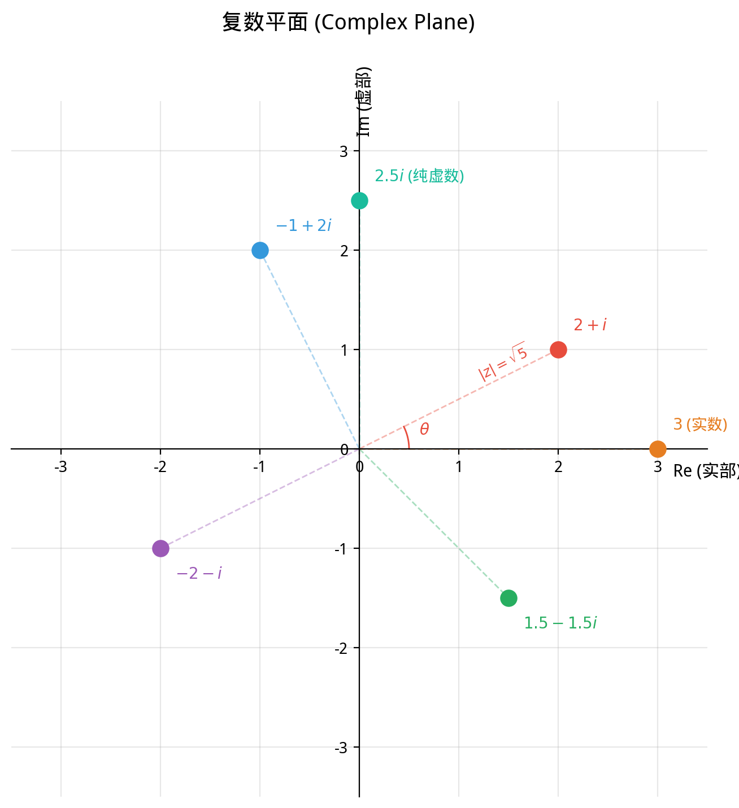

# §4 复数引入（Introduction to Complex Numbers）

**前置知识**：[§3 实数](03-reals.md)、[Part 1 第 3 章 证明方法](../../part-01-foundations/ch03-proof-methods/README.md)

**全景图**：实数填满了整条数轴，解决了有理数的完备性缺陷。但实数仍有一个"遗憾"：方程 $x^2 + 1 = 0$ 无解。任何实数的平方都是非负的，所以不存在实数 $x$ 满足 $x^2 = -1$。为了解决这个问题，我们进行数系的最后一次扩展——引入虚数单位 $i$，构建复数域 $\mathbb{C}$。这是本章数系链 $\mathbb{N} \subset \mathbb{Z} \subset \mathbb{Q} \subset \mathbb{R} \subset \mathbb{C}$ 的终点。本节只做概念性引入；复数的详细代数运算和几何解释将在 Part 3 第 4 章中展开。

**预估学习时间**：约 1.5 小时

---

## 动机

实数系 $\mathbb{R}$ 是一个完备有序域——"完美"的数轴。但让我们从代数的角度审视它：

方程 $x^2 - 2 = 0$ 有实数解：$x = \pm\sqrt{2}$。✓

方程 $x^2 + 1 = 0$ 呢？

$$x^2 = -1$$

对任意实数 $x$，$x^2 \geq 0$。所以 $x^2 = -1$ **无解**。

这个方程如此简单——一个二次多项式等于零——却在 $\mathbb{R}$ 中无解。更一般地，许多多项式方程在 $\mathbb{R}$ 中没有足够的根。例如 $x^4 + 1 = 0$ 也没有实数根。

在前几节中，我们看到了一个反复出现的模式：

| 方程 | 在…中无解 | 扩展到… |
|------|-----------|---------|
| $3 + x = 1$ | $\mathbb{N}$ | $\mathbb{Z}$（引入负数） |
| $2x = 3$ | $\mathbb{Z}$ | $\mathbb{Q}$（引入分数） |
| $x^2 = 2$ | $\mathbb{Q}$ | $\mathbb{R}$（引入无理数） |
| $x^2 = -1$ | $\mathbb{R}$ | $\mathbb{C}$（引入虚数） |

每一次扩展都遵循同样的逻辑：旧数系中有"不可能"的运算，引入新的数使之成为可能。

---

## 1. 虚数单位（Imaginary Unit）

> **定义 1**（虚数单位，imaginary unit）
>
> 引入一个新的数 $i$，定义为满足
>
> $$i^2 = -1$$
>
> 的数。$i$ 称为**虚数单位**（imaginary unit）。

"虚数"（imaginary number）这个名字是历史遗留的，来自笛卡尔（Descartes）的命名。它暗示这些数是"想象出来的"、不如实数"真实"。这是一个误导性的名字——复数在数学和物理中的重要性丝毫不亚于实数。量子力学、电路分析、流体力学、信号处理……复数无处不在。一个更好的名字或许是"旋转数"（这将在 Part 3 Ch04 的几何解释中变得清晰）。

**$i$ 的幂**：

$$i^0 = 1, \quad i^1 = i, \quad i^2 = -1, \quad i^3 = i \cdot i^2 = -i, \quad i^4 = (i^2)^2 = 1$$

$i$ 的幂呈周期 $4$ 的循环：$1 \to i \to -1 \to -i \to 1 \to \cdots$

**一般公式**：$i^n = i^{n \bmod 4}$，其中 $\bmod$ 表示取余数。

---

## 2. 复数（Complex Numbers）

### 2.1 定义

> **定义 2**（复数，complex number）
>
> 复数是形如
>
> $$z = a + bi$$
>
> 的表达式，其中 $a, b \in \mathbb{R}$，$i$ 是虚数单位。
>
> - $a$ 称为 $z$ 的**实部**（real part），记作 $\text{Re}(z) = a$。
> - $b$ 称为 $z$ 的**虚部**（imaginary part），记作 $\text{Im}(z) = b$。
> - 全体复数的集合记作 $\mathbb{C}$。

**注意**：虚部 $\text{Im}(z) = b$ 是一个**实数**，不是 $bi$。例如 $z = 3 + 4i$ 的虚部是 $4$，不是 $4i$。

### 2.2 特殊情况

| 条件 | 名称 | 例子 |
|------|------|------|
| $b = 0$ | 实数 | $5 = 5 + 0i$ |
| $a = 0$，$b \neq 0$ | 纯虚数（purely imaginary） | $3i = 0 + 3i$ |
| $a = 0$，$b = 0$ | 零 | $0 = 0 + 0i$ |

因此，每个实数都是复数（虚部为 $0$ 的复数），即 $\mathbb{R} \subset \mathbb{C}$。

### 2.3 复数的相等

> **定义 3**（复数的相等）
>
> 两个复数 $a + bi$ 和 $c + di$ 相等，当且仅当
>
> $$a = c \quad \text{且} \quad b = d$$
>
> 即实部和虚部分别相等。

---

## 3. 复数的基本运算

### 3.1 加法和减法

> **定义 4**（复数的加法）
>
> $$(a + bi) + (c + di) = (a + c) + (b + d)i$$
>
> 即实部加实部，虚部加虚部。

> **定义 5**（复数的减法）
>
> $$(a + bi) - (c + di) = (a - c) + (b - d)i$$

**例子**：$(3 + 2i) + (1 - 5i) = 4 + (-3)i = 4 - 3i$。

### 3.2 乘法

> **定义 6**（复数的乘法）
>
> $$(a + bi)(c + di) = ac + adi + bci + bdi^2 = (ac - bd) + (ad + bc)i$$
>
> 即按照分配律展开，然后利用 $i^2 = -1$。

**例子**：$(2 + 3i)(1 - i) = 2 - 2i + 3i - 3i^2 = 2 + i - 3(-1) = 2 + i + 3 = 5 + i$。

### 3.3 共轭与模

> **定义 7**（共轭复数，complex conjugate）
>
> 复数 $z = a + bi$ 的共轭记作 $\bar{z}$（或 $z^*$），定义为
>
> $$\bar{z} = a - bi$$
>
> 即将虚部取反。

> **定义 8**（复数的模，modulus）
>
> 复数 $z = a + bi$ 的模记作 $|z|$，定义为
>
> $$|z| = \sqrt{a^2 + b^2}$$

**关键性质**：

$$z \cdot \bar{z} = (a + bi)(a - bi) = a^2 + b^2 = |z|^2$$

这是一个非负实数！利用它可以定义除法。

### 3.4 除法

> **定义 9**（复数的除法）
>
> 对 $w \neq 0$，
>
> $$\frac{z}{w} = \frac{z \cdot \bar{w}}{w \cdot \bar{w}} = \frac{z \cdot \bar{w}}{|w|^2}$$

**例子**：$\frac{3 + i}{1 - 2i} = \frac{(3 + i)(1 + 2i)}{(1 - 2i)(1 + 2i)} = \frac{3 + 6i + i + 2i^2}{1 + 4} = \frac{3 + 7i - 2}{5} = \frac{1 + 7i}{5} = \frac{1}{5} + \frac{7}{5}i$

---

## 4. 复平面（Complex Plane）——预览

复数有一个美妙的几何解释：每个复数 $z = a + bi$ 对应平面上的一个点 $(a, b)$。

> **定义 10**（复平面/Argand 平面）
>
> **复平面**（complex plane）是以实轴（real axis，水平轴）和虚轴（imaginary axis，竖直轴）为坐标轴的平面。复数 $z = a + bi$ 对应点 $(a, b)$。

在复平面中：
- 复数的**模** $|z|$ 是点 $(a, b)$ 到原点的**距离**。
- 复数的**共轭** $\bar{z}$ 是点 $(a, b)$ 关于实轴的**对称点** $(a, -b)$。
- 复数的**加法**对应向量加法。
- 复数的**乘法**对应旋转和伸缩（这是复数最深刻的几何性质之一，将在 Part 3 Ch04 详细讨论）。

---

## 5. $\mathbb{C}$ 的代数结构

> **定理 1**（$\mathbb{C}$ 是域）
>
> $(\mathbb{C}, +, \times)$ 满足所有域公理（§2 定理 1 中列出的公理 1–9）。

**$\mathbb{C}$ 与 $\mathbb{R}$ 的关键区别**：

| 性质 | $\mathbb{R}$ | $\mathbb{C}$ |
|------|:---:|:---:|
| 域 | ✓ | ✓ |
| 全序 | ✓ | ✗ |
| 完备有序域 | ✓ | — |
| 代数闭 | ✗ | ✓ |

### 5.1 $\mathbb{C}$ 不可全序

> **定理 2**（$\mathbb{C}$ 不是有序域）
>
> 不存在 $\mathbb{C}$ 上的全序关系使得 $\mathbb{C}$ 成为有序域。

> **证明**（反证法）：
>
> 假设存在使 $\mathbb{C}$ 成为有序域的序 $\leq$。
>
> 在有序域中，非零元素的平方为正：$a \neq 0 \Rightarrow a^2 > 0$。
>
> 考虑 $i \neq 0$。则 $i^2 > 0$，即 $-1 > 0$。
>
> 但 $1 = 1^2 > 0$，所以 $1 > 0$ 且 $-1 > 0$，即 $1 + (-1) > 0 + 0$，即 $0 > 0$。矛盾。
>
> 因此 $\mathbb{C}$ 不能成为有序域。$\blacksquare$

**含义**：我们不能比较两个复数的"大小"（在与运算相容的意义下）。你不能说"$2 + 3i > 1 + 4i$"——这个表述没有意义。

### 5.2 代数基本定理（预览）

虽然 $\mathbb{C}$ 失去了全序性，但它获得了一个极其强大的性质：

> **定理 3**（代数基本定理，fundamental theorem of algebra）[暂认]
>
> 每个次数 $\geq 1$ 的复系数多项式在 $\mathbb{C}$ 中至少有一个根。
>
> 等价地：每个 $n$ 次（$n \geq 1$）复系数多项式恰好有 $n$ 个复数根（计重数）。

这意味着 $\mathbb{C}$ 是**代数闭**（algebraically closed）的——每个多项式方程都有解。我们不再需要进一步扩展数系！

**例子**：

- $x^2 + 1 = 0$：在 $\mathbb{R}$ 中无解；在 $\mathbb{C}$ 中有解 $x = \pm i$。
- $x^2 + 2x + 5 = 0$：判别式 $\Delta = 4 - 20 = -16 < 0$，在 $\mathbb{R}$ 中无解；在 $\mathbb{C}$ 中有解 $x = \frac{-2 \pm 4i}{2} = -1 \pm 2i$。
- $x^4 + 1 = 0$：在 $\mathbb{R}$ 中无解；在 $\mathbb{C}$ 中有 $4$ 个根（读者可以尝试找出它们）。

代数基本定理的证明需要分析学或拓扑学的工具，超出本章范围。

---

## 6. 数系扩展总结

### 6.1 扩展链

$$\mathbb{N} \subset \mathbb{Z} \subset \mathbb{Q} \subset \mathbb{R} \subset \mathbb{C}$$

每一步扩展都解决了前一个数系中"不可能"的问题：

| 扩展 | 动机（什么不封闭） | 新引入的数 |
|------|---------------------|------------|
| $\mathbb{N} \to \mathbb{Z}$ | 减法：$3 - 5 = ?$ | 负数 |
| $\mathbb{Z} \to \mathbb{Q}$ | 除法：$2 \div 3 = ?$ | 分数 |
| $\mathbb{Q} \to \mathbb{R}$ | 开方/极限：$\sqrt{2} = ?$ | 无理数 |
| $\mathbb{R} \to \mathbb{C}$ | 方程 $x^2 + 1 = 0$ | 虚数 |

### 6.2 性质的得与失

| 性质 | $\mathbb{N}$ | $\mathbb{Z}$ | $\mathbb{Q}$ | $\mathbb{R}$ | $\mathbb{C}$ |
|------|:---:|:---:|:---:|:---:|:---:|
| 加法封闭 | ✓ | ✓ | ✓ | ✓ | ✓ |
| 减法封闭 | ✗ | ✓ | ✓ | ✓ | ✓ |
| 乘法封闭 | ✓ | ✓ | ✓ | ✓ | ✓ |
| 除法封闭（$\div$ 非零） | ✗ | ✗ | ✓ | ✓ | ✓ |
| 代数结构 | 幺半群 | 整环 | 域 | 域 | 域 |
| 良序 | ✓ | ✗ | ✗ | ✗ | ✗ |
| 全序 | ✓ | ✓ | ✓ | ✓ | ✗ |
| 稠密 | ✗ | ✗ | ✓ | ✓ | — |
| 完备 | — | — | ✗ | ✓ | — |
| 代数闭 | ✗ | ✗ | ✗ | ✗ | ✓ |

**关键观察**：

1. 每一步扩展都**获得**新的性质（封闭性或结构性），但可能**失去**旧的性质。
2. 从 $\mathbb{N}$ 到 $\mathbb{R}$：越来越"丰富"——运算更封闭，结构更完善。
3. 从 $\mathbb{R}$ 到 $\mathbb{C}$：获得代数闭性，但失去全序性。这是一个有意义的"交换"。

### 6.3 为什么不继续扩展？

数系链在 $\mathbb{C}$ 处停止的原因：

1. **代数基本定理**：$\mathbb{C}$ 已经是代数闭的——每个多项式方程都有解。不需要为求解方程再扩展。
2. **Frobenius 定理**：在包含 $\mathbb{R}$ 的有限维结合代数中，只有 $\mathbb{R}$、$\mathbb{C}$ 和四元数 $\mathbb{H}$（Hamilton 四元数）。四元数失去了乘法交换律。
3. 继续扩展（八元数 $\mathbb{O}$ 等）会失去越来越多的代数性质。

---

## 例题

### 例题 1：复数运算

**题目**：设 $z = 2 - 3i$，$w = 1 + 4i$。计算 $zw$、$|z|$、$\frac{z}{w}$。

**解答**：

$$zw = (2 - 3i)(1 + 4i) = 2 + 8i - 3i - 12i^2 = 2 + 5i + 12 = 14 + 5i$$

$$|z| = \sqrt{2^2 + (-3)^2} = \sqrt{4 + 9} = \sqrt{13}$$

$$\frac{z}{w} = \frac{2 - 3i}{1 + 4i} = \frac{(2 - 3i)(1 - 4i)}{(1 + 4i)(1 - 4i)} = \frac{2 - 8i - 3i + 12i^2}{1 + 16} = \frac{2 - 11i - 12}{17} = \frac{-10 - 11i}{17}$$

$$= -\frac{10}{17} - \frac{11}{17}i$$

---

### 例题 2：$x^2 + 1 = 0$ 的求解

**题目**：求方程 $x^2 + 1 = 0$ 在 $\mathbb{C}$ 中的所有解。

**解答**：

$x^2 = -1$，即 $x^2 = i^2$。

设 $x = a + bi$，则 $(a + bi)^2 = a^2 - b^2 + 2abi = -1$。

比较实部和虚部：
- 实部：$a^2 - b^2 = -1$
- 虚部：$2ab = 0$

由 $2ab = 0$：$a = 0$ 或 $b = 0$。

若 $b = 0$：$a^2 = -1$，无实数解。

若 $a = 0$：$-b^2 = -1$，即 $b^2 = 1$，$b = \pm 1$。

因此 $x = i$ 或 $x = -i$。

---

### 例题 3：证明共轭的性质

**题目**：证明对任意复数 $z, w \in \mathbb{C}$，$\overline{z + w} = \bar{z} + \bar{w}$。

**解答**：

设 $z = a + bi$，$w = c + di$。

$$z + w = (a + c) + (b + d)i$$

$$\overline{z + w} = (a + c) - (b + d)i$$

$$\bar{z} + \bar{w} = (a - bi) + (c - di) = (a + c) + (-b - d)i = (a + c) - (b + d)i$$

两者相等。$\blacksquare$

---

### 例题 4：$\mathbb{C}$ 不可全序的理解

**题目**：解释为什么不能定义 $\mathbb{C}$ 上的"大于"关系（使之成为有序域），并用一个简单的例子说明直觉。

**解答**：

定理 2 的证明表明：在有序域中，非零元素的平方必须为正。但 $i^2 = -1$，如果 $\mathbb{C}$ 是有序域，则 $i^2 > 0$（因为 $i \neq 0$），即 $-1 > 0$，而 $1 = 1^2 > 0$ 也成立，于是 $0 = 1 + (-1) > 0$，矛盾。

**直觉**：实数排列在一条线上，所以有自然的先后顺序。复数排列在一个**平面**上——你无法对平面上的点排出一维的"大小顺序"而又保持与加法和乘法的相容性。

例如，$i$ 和 $-i$ 应该谁"更大"？无论怎么规定，都会导致矛盾。

---

## 要点回顾

1. **虚数单位** $i$ 满足 $i^2 = -1$，是方程 $x^2 + 1 = 0$ 的解。
2. **复数** $z = a + bi$（$a, b \in \mathbb{R}$），其中 $a = \text{Re}(z)$ 是实部，$b = \text{Im}(z)$ 是虚部。
3. $\mathbb{R} \subset \mathbb{C}$：实数是虚部为 $0$ 的复数。
4. 复数的运算：加法（分量加法）、乘法（利用 $i^2 = -1$ 展开）、除法（利用共轭）。
5. **共轭** $\bar{z} = a - bi$；**模** $|z| = \sqrt{a^2 + b^2}$；$z \bar{z} = |z|^2$。
6. $\mathbb{C}$ 是**域**，但**不是有序域**——不能比较复数的"大小"。
7. **代数基本定理**：$\mathbb{C}$ 是代数闭的，每个多项式方程都有复数解。
8. **数系扩展链**完成：$\mathbb{N} \subset \mathbb{Z} \subset \mathbb{Q} \subset \mathbb{R} \subset \mathbb{C}$。

---

## 进度检查点

完成本节后，你应该能够：

- [ ] 解释为什么实数系需要扩展到复数
- [ ] 进行复数的加、减、乘、除运算
- [ ] 计算复数的共轭和模
- [ ] 证明 $\mathbb{C}$ 不能成为有序域
- [ ] 描述数系扩展链 $\mathbb{N} \subset \mathbb{Z} \subset \mathbb{Q} \subset \mathbb{R} \subset \mathbb{C}$ 的每一步动机

---

## 自测题

**自测题 1**：$i^{2026}$ 等于多少？

参考答案

$i$ 的幂以 $4$ 为周期循环。$2026 = 4 \times 506 + 2$，所以 $i^{2026} = i^2 = -1$。

**自测题 2**：设 $z = 3 + 4i$，计算 $z \bar{z}$ 和 $|z|$。

参考答案

$\bar{z} = 3 - 4i$。

$z\bar{z} = (3 + 4i)(3 - 4i) = 9 + 16 = 25 = |z|^2$。

$|z| = \sqrt{25} = 5$。

**自测题 3**：为什么 $\mathbb{C}$ 之后不需要继续扩展数系？

参考答案

因为 $\mathbb{C}$ 是**代数闭**的（代数基本定理）：每个非常数复系数多项式至少有一个复数根。这意味着求解多项式方程不再需要新的数。

当然，数学家仍然研究 $\mathbb{C}$ 以外的"数系"（如四元数 $\mathbb{H}$、八元数 $\mathbb{O}$），但这些是出于其他动机（如推广到更高维的几何），而不是因为多项式方程无法求解。

**自测题 4**：实数到复数的扩展中，获得了什么，失去了什么？

参考答案

**获得**：代数闭性——每个多项式方程都有解。

**失去**：全序性——复数不能排成有意义的"大小"顺序（在保持与运算相容的意义下）。$\mathbb{R}$ 是有序域，$\mathbb{C}$ 不是。

这是一个有意义的取舍：放弃一维的"大小比较"，换来代数上的完备性。

---

## 习题

本节的练习题见 [练习题](exercises/exercises.md)（§4 部分）。
