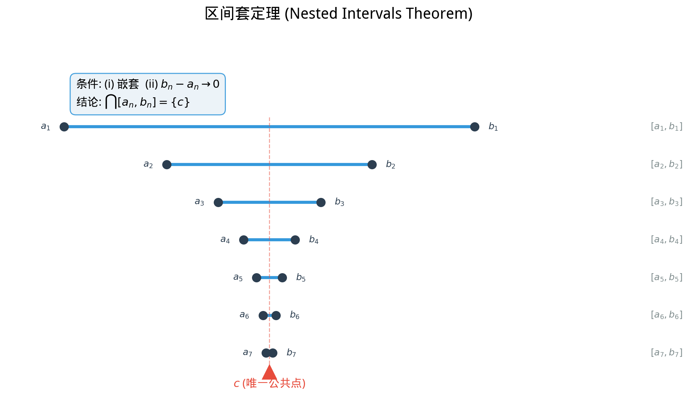

# §1 实数的性质（Properties of Real Numbers）

**前置知识**：[Part 2 第 1 章 §3 实数](../ch01-number-systems/03-reals.md)

**全景图**：在第 1 章中，我们从直觉出发认识了实数——它们填满数轴上有理数留下的"空隙"，使数轴成为连续的整体。但直觉还不够。本节将从公理的角度严格刻画实数的性质：$\mathbb{R}$ 是一个**完备有序域（complete ordered field）**。我们将逐步拆解这个描述——先理解"有序域"意味着什么，然后推导出阿基米德性质、有理数稠密性、区间套定理等一系列深刻且实用的结论。这些性质是分析学（Part 6）的基础工具。

**预估学习时间**：约 2 小时

---

## 动机

在 §1（第 1 章）中，我们知道 $\mathbb{Q}$ 是一个**有序域**——可以做加减乘除，可以比大小。$\mathbb{R}$ 也是有序域，但它比 $\mathbb{Q}$ 多了一样东西：**完备性**。

完备性将在 §2 中详细讨论。本节先集中理解 $\mathbb{R}$ 作为有序域的性质，以及从完备性可以推出的几个关键结论。这些结论看似"显然"——"任意两个实数之间总有有理数"——但它们的证明依赖于精心构建的公理体系，绝非不证自明。

---

## 1. 有序域公理（Ordered Field Axioms）

### 1.1 域公理（Field Axioms）

实数集 $\mathbb{R}$ 配备了两种运算——加法和乘法——它们满足以下公理：

> **定义 1**（域，field）
>
> 一个**域** $(F, +, \cdot)$ 是一个集合 $F$ 配备两种二元运算 $+$ 和 $\cdot$，满足以下公理：
>
> **加法公理**（$F$ 关于 $+$ 构成交换群）：
>
> | 编号 | 名称 | 公理 |
> |------|------|------|
> | A1 | 封闭性（closure） | $\forall a, b \in F,\; a + b \in F$ |
> | A2 | 结合律（associativity） | $\forall a, b, c \in F,\; (a + b) + c = a + (b + c)$ |
> | A3 | 单位元（identity） | $\exists\, 0 \in F,\; \forall a \in F,\; a + 0 = a$ |
> | A4 | 逆元（inverse） | $\forall a \in F,\; \exists\, (-a) \in F,\; a + (-a) = 0$ |
> | A5 | 交换律（commutativity） | $\forall a, b \in F,\; a + b = b + a$ |
>
> **乘法公理**（$F \setminus \{0\}$ 关于 $\cdot$ 构成交换群）：
>
> | 编号 | 名称 | 公理 |
> |------|------|------|
> | M1 | 封闭性 | $\forall a, b \in F,\; a \cdot b \in F$ |
> | M2 | 结合律 | $\forall a, b, c \in F,\; (a \cdot b) \cdot c = a \cdot (b \cdot c)$ |
> | M3 | 单位元 | $\exists\, 1 \in F,\; 1 \neq 0,\; \forall a \in F,\; a \cdot 1 = a$ |
> | M4 | 逆元 | $\forall a \in F \setminus \{0\},\; \exists\, a^{-1} \in F,\; a \cdot a^{-1} = 1$ |
> | M5 | 交换律 | $\forall a, b \in F,\; a \cdot b = b \cdot a$ |
>
> **分配律**（distributive law）：
>
> | 编号 | 名称 | 公理 |
> |------|------|------|
> | D | 分配律 | $\forall a, b, c \in F,\; a \cdot (b + c) = a \cdot b + a \cdot c$ |

**解读**：$\mathbb{Q}$ 和 $\mathbb{R}$ 都是域。$\mathbb{Z}$ 不是域（没有乘法逆元：$2$ 在 $\mathbb{Z}$ 中没有逆元）。$\mathbb{N}$ 连加法逆元都没有（没有负数），更不是域。

### 1.2 序公理（Order Axioms）

> **定义 2**（有序域，ordered field）
>
> 一个域 $F$ 称为**有序域（ordered field）**，若 $F$ 上存在一个全序关系 $\leq$，满足：
>
> | 编号 | 名称 | 公理 |
> |------|------|------|
> | O1 | 全序性（totality） | $\forall a, b \in F,\; a \leq b \text{ 或 } b \leq a$ |
> | O2 | 反对称性（antisymmetry） | 若 $a \leq b$ 且 $b \leq a$，则 $a = b$ |
> | O3 | 传递性（transitivity） | 若 $a \leq b$ 且 $b \leq c$，则 $a \leq c$ |
> | O4 | 加法保序（translation invariance） | 若 $a \leq b$，则 $a + c \leq b + c$ |
> | O5 | 正元素乘法保序 | 若 $a \leq b$ 且 $0 \leq c$，则 $a \cdot c \leq b \cdot c$ |

$\mathbb{Q}$ 和 $\mathbb{R}$ 都是有序域。一个重要的反例：$\mathbb{C}$ 无法被赋予一个与其域运算相容的全序——我们在第 1 章 §4 中提到过这一点。

### 1.3 从公理推出的基本性质

从域公理和序公理出发，可以证明许多"显然"的事实。以下举几个例子：

> **命题 1**（有序域中的基本性质）
>
> 设 $(F, +, \cdot, \leq)$ 是有序域，则：
>
> (a) $0 < 1$。
>
> (b) 若 $a > 0$，则 $-a < 0$；若 $a < 0$，则 $-a > 0$。
>
> (c) 若 $a > 0$ 且 $b > 0$，则 $ab > 0$。
>
> (d) $a^2 \geq 0$ 对所有 $a \in F$ 成立。
>
> (e) 若 $0 < a < b$，则 $0 < b^{-1} < a^{-1}$。

> **证明**（(a) 的证明）
>
> 由公理 M3，$1 \neq 0$，所以要么 $0 < 1$，要么 $1 < 0$。
>
> 假设 $1 < 0$。则 $-1 > 0$（由 (b)，此处先假设 (b) 已证）。
>
> 由 O5，$(-1)(-1) \geq 0$。又 $(-1)(-1) = 1$（这可以从域公理推出），故 $1 > 0$，矛盾。
>
> 因此 $0 < 1$。$\blacksquare$

> **证明**（(d) 的证明）
>
> 若 $a \geq 0$，则 $a \cdot a \geq 0 \cdot a = 0$（由 O5）。
>
> 若 $a < 0$，则 $-a > 0$，所以 $(-a)(-a) > 0$。而 $(-a)(-a) = a^2$（由域公理），故 $a^2 > 0$。
>
> 综合：$a^2 \geq 0$，且等号成立当且仅当 $a = 0$。$\blacksquare$

**注意**：性质 (d) 是 $\mathbb{C}$ 不可排序的关键原因。若 $\mathbb{C}$ 是有序域，则 $i^2 = -1 \geq 0$，即 $-1 \geq 0$，这与 $0 < 1$（从而 $-1 < 0$）矛盾。

---

## 2. 阿基米德性质（Archimedean Property）

有序域公理本身还不够描述 $\mathbb{R}$ 的特殊性——存在满足所有有序域公理但不同于 $\mathbb{R}$ 的"奇异"有序域（例如包含无穷大元素的域）。阿基米德性质排除了这些奇异情况。

### 2.1 定理陈述与直觉

> **定理 1**（阿基米德性质，Archimedean property）
>
> 对任意实数 $x \in \mathbb{R}$，存在自然数 $n \in \mathbb{N}$ 使得 $n > x$。

**直觉**：没有"无穷大的实数"。无论 $x$ 多大，总有一个自然数超过它。换言之，自然数在 $\mathbb{R}$ 中是**无界的**（unbounded above）。

等价的表述：对任意 $\varepsilon > 0$ 和任意 $M > 0$，存在 $n \in \mathbb{N}$ 使得 $n\varepsilon > M$。直觉上，无论步长 $\varepsilon$ 多小，迈足够多步总能超过任何目标 $M$。

### 2.2 从完备性的证明

> **证明**（阿基米德性质）
>
> 反证法。假设阿基米德性质不成立，即存在 $x \in \mathbb{R}$ 使得 $n \leq x$ 对所有 $n \in \mathbb{N}$。
>
> 这意味着 $\mathbb{N}$ 在 $\mathbb{R}$ 中有上界 $x$。由完备性公理（上确界原理），$\mathbb{N}$ 有上确界 $\alpha = \sup \mathbb{N}$。
>
> 因为 $\alpha$ 是上确界，$\alpha - 1$ 不是 $\mathbb{N}$ 的上界（否则 $\alpha$ 不是最小上界）。故存在 $m \in \mathbb{N}$ 使得 $m > \alpha - 1$，即
>
> $$m + 1 > \alpha$$
>
> 但 $m + 1 \in \mathbb{N}$，这与 $\alpha$ 是 $\mathbb{N}$ 的上界矛盾。
>
> 因此假设不成立，阿基米德性质成立。$\blacksquare$

**关键观察**：这个证明依赖于完备性公理。在不完备的有序域（如某些非标准模型）中，阿基米德性质可能不成立。

### 2.3 重要推论

> **推论 1**
>
> $$\inf\left\{\frac{1}{n} : n \in \mathbb{N}^+\right\} = 0$$
>
> 即：对任意 $\varepsilon > 0$，存在 $n \in \mathbb{N}^+$ 使得 $\frac{1}{n} < \varepsilon$。

> **证明**
>
> 设 $S = \{1/n : n \in \mathbb{N}^+\}$。
>
> 首先，$0$ 是 $S$ 的下界，因为 $1/n > 0$ 对所有 $n \in \mathbb{N}^+$。故 $\inf S \geq 0$。
>
> 其次，设 $\alpha = \inf S$，假设 $\alpha > 0$。由阿基米德性质，存在 $n \in \mathbb{N}^+$ 使得 $n > 1/\alpha$，即 $1/n < \alpha$。但 $1/n \in S$，这与 $\alpha$ 是 $S$ 的下界矛盾。
>
> 因此 $\alpha = 0$。$\blacksquare$

> **推论 2**
>
> 对任意实数 $x, y$ 满足 $x < y$，存在 $n \in \mathbb{N}^+$ 使得 $y - x > 1/n$。

> **证明**
>
> $y - x > 0$，由推论 1，存在 $n \in \mathbb{N}^+$ 使得 $1/n < y - x$。$\blacksquare$

---

## 3. 有理数的稠密性（Density of Rationals）

### 3.1 定理陈述

> **定理 2**（有理数的稠密性，density of rationals in $\mathbb{R}$）
>
> 对任意实数 $a, b$ 满足 $a < b$，存在有理数 $q \in \mathbb{Q}$ 使得 $a < q < b$。

**直觉**：无论两个实数靠得多近，它们之间总能找到一个有理数。这就是"稠密性"的含义——$\mathbb{Q}$ 在 $\mathbb{R}$ 中稠密。

### 3.2 证明

> **证明**（有理数的稠密性）
>
> 需要找到整数 $m$ 和正整数 $n$ 使得 $a < m/n < b$，即 $na < m < nb$。
>
> **第一步**：找到合适的 $n$。
>
> 由阿基米德性质（推论 2），存在 $n \in \mathbb{N}^+$ 使得 $n(b - a) > 1$，即 $nb - na > 1$。
>
> **第二步**：找到合适的 $m$。
>
> 考虑集合 $\{k \in \mathbb{Z} : k > na\}$。由阿基米德性质，这个集合非空（存在足够大的整数超过 $na$）。取 $m$ 为此集合中的最小元素（良序性/整数的离散性保证其存在）。则：
>
> $$m > na \quad \text{且} \quad m - 1 \leq na$$
>
> 第二个不等式给出 $m \leq na + 1$。
>
> **第三步**：验证 $m < nb$。
>
> $$m \leq na + 1 < na + n(b - a) = nb$$
>
> 最后一步用到了 $n(b - a) > 1$。
>
> 综合：$na < m < nb$，即 $a < m/n < b$，且 $m/n \in \mathbb{Q}$。$\blacksquare$

### 3.3 推广：无理数的稠密性

> **推论 3**（无理数的稠密性）
>
> 对任意实数 $a, b$ 满足 $a < b$，存在无理数 $\xi$ 使得 $a < \xi < b$。

> **证明**
>
> 考虑 $a/\sqrt{2}$ 和 $b/\sqrt{2}$（它们是实数且 $a/\sqrt{2} < b/\sqrt{2}$）。由有理数稠密性，存在 $q \in \mathbb{Q}$，$q \neq 0$，使得
>
> $$\frac{a}{\sqrt{2}} < q < \frac{b}{\sqrt{2}}$$
>
> 令 $\xi = q\sqrt{2}$，则 $a < \xi < b$。
>
> 断言 $\xi$ 是无理数：若 $\xi = q\sqrt{2} \in \mathbb{Q}$，则 $\sqrt{2} = \xi/q \in \mathbb{Q}$（因为 $q \neq 0$），矛盾。$\blacksquare$

**总结**：$\mathbb{Q}$ 和 $\mathbb{R} \setminus \mathbb{Q}$（无理数集）都在 $\mathbb{R}$ 中稠密。有理数和无理数在数轴上"交错分布"，任意两个实数之间既有有理数也有无理数。

---

## 4. 区间套定理（Nested Intervals Theorem）

### 4.1 定理陈述

> **定理 3**（区间套定理，nested intervals theorem）
>
> 设 $\{[a_n, b_n]\}_{n=1}^{\infty}$ 是一列闭区间，满足：
>
> (i) **嵌套性**：$[a_1, b_1] \supseteq [a_2, b_2] \supseteq [a_3, b_3] \supseteq \cdots$
>
> (ii) **长度趋于零**：$\lim_{n \to \infty} (b_n - a_n) = 0$
>
> 则存在唯一的实数 $c$ 属于所有区间：
>
> $$\bigcap_{n=1}^{\infty} [a_n, b_n] = \{c\}$$

**直觉**：想象一系列不断缩小的闭区间，每个包含下一个，且区间长度不断趋于零。这些区间最终"压缩"到一个点。

### 4.2 证明

> **证明**（区间套定理）
>
> **存在性**：
>
> 由嵌套性，$a_1 \leq a_2 \leq a_3 \leq \cdots$ 且 $b_1 \geq b_2 \geq b_3 \geq \cdots$。
>
> 进一步，对所有 $m, n$，有 $a_m \leq b_n$。
>
> 这是因为：不妨设 $m \leq n$（另一种情况类似），则
>
> $$a_m \leq a_n \leq b_n$$
>
> 因此 $\{a_n\}$ 是有上界的集合（任何 $b_k$ 都是其上界）。由完备性公理，设
>
> $$c = \sup\{a_n : n \in \mathbb{N}^+\}$$
>
> 对所有 $n$，$a_n \leq c$（上确界大于等于集合中每个元素）。
>
> 对所有 $n$，$c \leq b_n$（因为 $b_n$ 是 $\{a_k\}$ 的上界，而 $c$ 是最小上界）。
>
> 因此 $a_n \leq c \leq b_n$ 对所有 $n$ 成立，即 $c \in [a_n, b_n]$ 对所有 $n$ 成立。
>
> **唯一性**：
>
> 设 $c, c'$ 都属于所有 $[a_n, b_n]$。则对所有 $n$：
>
> $$|c - c'| \leq b_n - a_n$$
>
> 由条件 (ii)，$b_n - a_n \to 0$，故 $|c - c'| = 0$，即 $c = c'$。$\blacksquare$

### 4.3 闭区间的重要性

**警告**：区间套定理的条件中，**闭区间不能换成开区间**。

> **反例**
>
> 考虑开区间列 $(0, 1/n)$，其中 $n = 1, 2, 3, \ldots$
>
> - 嵌套性：$(0, 1) \supset (0, 1/2) \supset (0, 1/3) \supset \cdots$ ✓
> - 长度趋于零：$1/n \to 0$ ✓
>
> 但 $\bigcap_{n=1}^{\infty} (0, 1/n) = \varnothing$。
>
> 原因：$0$ 不属于任何 $(0, 1/n)$，而对任意 $x > 0$，由阿基米德性质存在 $n$ 使 $1/n < x$，故 $x \notin (0, 1/n)$。

同样，条件 (ii)（长度趋于零）也不可省略。若只有嵌套性但长度不趋于零，公共交集可能包含不止一个点（这不违反定理，只是失去唯一性），甚至可能是一个区间。

> **例**
>
> $[a_n, b_n] = [0, 1 + 1/n]$。嵌套性成立，$b_n - a_n = 1 + 1/n \to 1 \neq 0$。公共交集为 $[0, 1]$——一个包含无穷多点的区间。

---

## 5. 绝对值与三角不等式（Absolute Value and Triangle Inequality）

### 5.1 绝对值的定义

> **定义 3**（绝对值，absolute value）
>
> 对 $x \in \mathbb{R}$，定义
>
> $$|x| = \begin{cases} x & \text{若 } x \geq 0 \\ -x & \text{若 } x < 0 \end{cases}$$

几何意义：$|x|$ 是 $x$ 到原点的距离；$|x - y|$ 是 $x$ 和 $y$ 在数轴上的距离。

### 5.2 基本性质

> **命题 2**（绝对值的性质）
>
> 对任意 $a, b \in \mathbb{R}$：
>
> (a) $|a| \geq 0$，且 $|a| = 0 \iff a = 0$
>
> (b) $|-a| = |a|$
>
> (c) $|ab| = |a| \cdot |b|$
>
> (d) 若 $c \geq 0$，则 $|a| \leq c \iff -c \leq a \leq c$

### 5.3 三角不等式

> **定理 4**（三角不等式，triangle inequality）
>
> 对任意 $a, b \in \mathbb{R}$：
>
> $$|a + b| \leq |a| + |b|$$

> **证明**
>
> 由命题 2(d)，$-|a| \leq a \leq |a|$ 且 $-|b| \leq b \leq |b|$。
>
> 相加得 $-(|a| + |b|) \leq a + b \leq |a| + |b|$。
>
> 再由命题 2(d)，$|a + b| \leq |a| + |b|$。$\blacksquare$

**等号条件**：$|a + b| = |a| + |b|$ 当且仅当 $a$ 和 $b$ 同号（即 $ab \geq 0$）。

> **推论 4**（反三角不等式）
>
> $$\big||a| - |b|\big| \leq |a - b|$$

> **证明**
>
> $|a| = |(a - b) + b| \leq |a - b| + |b|$，故 $|a| - |b| \leq |a - b|$。
>
> 交换 $a, b$ 的角色：$|b| - |a| \leq |b - a| = |a - b|$。
>
> 综合：$\big||a| - |b|\big| \leq |a - b|$。$\blacksquare$

---

## 例题

> **例 1**（阿基米德性质的应用）
>
> 证明：对任意 $x, y \in \mathbb{R}$，若对所有 $n \in \mathbb{N}^+$ 都有 $x \leq y + 1/n$，则 $x \leq y$。

> **解**
>
> 反证法。假设 $x > y$，则 $x - y > 0$。由推论 1，存在 $n_0 \in \mathbb{N}^+$ 使得 $1/n_0 < x - y$，即 $y + 1/n_0 < x$，与 $x \leq y + 1/n_0$ 矛盾。$\blacksquare$

> **例 2**（有理数稠密性的应用）
>
> 证明：对任意 $x \in \mathbb{R}$ 和 $\varepsilon > 0$，存在 $q \in \mathbb{Q}$ 使得 $|x - q| < \varepsilon$。

> **解**
>
> 由有理数稠密性（定理 2），在 $(x - \varepsilon, x + \varepsilon)$ 中存在有理数 $q$。则 $x - \varepsilon < q < x + \varepsilon$，即 $|x - q| < \varepsilon$。$\blacksquare$

**解读**：每个实数都可以被有理数**任意精确地逼近**。这是十进制展开的理论基础。

> **例 3**（区间套定理的应用）
>
> 用区间套定理证明 $\sqrt{2}$ 存在（即存在 $c > 0$ 使得 $c^2 = 2$）。

> **解**
>
> 构造如下区间套：令 $a_1 = 1, b_1 = 2$。注意 $a_1^2 = 1 < 2 < 4 = b_1^2$。
>
> 在每一步，取中点 $m_n = (a_n + b_n)/2$：
> - 若 $m_n^2 < 2$，令 $a_{n+1} = m_n, b_{n+1} = b_n$
> - 若 $m_n^2 > 2$，令 $a_{n+1} = a_n, b_{n+1} = m_n$
> - 若 $m_n^2 = 2$，则已找到 $\sqrt{2}$
>
> 如此构造的 $[a_n, b_n]$ 满足嵌套性，且 $b_n - a_n = 1/2^{n-1} \to 0$。
>
> 由区间套定理，存在唯一的 $c \in \bigcap [a_n, b_n]$。
>
> 对所有 $n$，$a_n^2 \leq 2 \leq b_n^2$（归纳可证）。令 $n \to \infty$，利用序的保持性，得 $c^2 \leq 2 \leq c^2$，故 $c^2 = 2$。
>
> 又 $c \geq a_1 = 1 > 0$，故 $c > 0$。$\blacksquare$

> **例 4**（三角不等式的应用）
>
> 设 $|x - 3| < 1$，求 $|x^2 - 9|$ 的上界。

> **解**
>
> $|x^2 - 9| = |x - 3| \cdot |x + 3|$。
>
> 由 $|x - 3| < 1$，得 $2 < x < 4$，故 $5 < x + 3 < 7$，即 $|x + 3| < 7$。
>
> 因此 $|x^2 - 9| < 1 \cdot 7 = 7$。$\blacksquare$

---

## 要点回顾

| 概念 | 核心内容 |
|------|----------|
| 域公理 | 加法群 + 乘法群（去零）+ 分配律 |
| 有序域公理 | 域公理 + 与运算相容的全序 |
| 阿基米德性质 | $\forall x \in \mathbb{R},\; \exists n \in \mathbb{N},\; n > x$（无无穷大元素） |
| 推论：$\inf\{1/n\} = 0$ | 正整数的倒数可以任意小 |
| 有理数稠密性 | 任意两实数之间存在有理数 |
| 无理数稠密性 | 任意两实数之间也存在无理数 |
| 区间套定理 | 嵌套闭区间 + 长度→0 ⟹ 唯一公共点 |
| 闭区间不可换开区间 | 开区间套交集可以为空 |
| 绝对值 | 到原点的距离，$\|x-y\|$ 是 $x,y$ 的距离 |
| 三角不等式 | $\|a+b\| \leq \|a\| + \|b\|$ |

---

## 进度检查点

完成本节后，你应该能够：

- [ ] 陈述域公理和有序域公理
- [ ] 解释为什么 $\mathbb{Z}$ 不是域，$\mathbb{C}$ 不是有序域
- [ ] 陈述并证明阿基米德性质
- [ ] 陈述并证明有理数稠密性定理
- [ ] 陈述区间套定理，解释为什么闭区间条件不可省略
- [ ] 运用三角不等式和反三角不等式

---

## 自测题

**1.** $\mathbb{Z}$ 满足域公理中的哪些？不满足哪条？

答案

$\mathbb{Z}$ 满足所有加法公理（A1–A5）、乘法封闭性（M1）、结合律（M2）、单位元（M3）、交换律（M5）和分配律（D）。不满足乘法逆元公理（M4）：例如 $2 \in \mathbb{Z}$，但 $2^{-1} = 1/2 \notin \mathbb{Z}$。

**2.** 用阿基米德性质证明：对任意 $\varepsilon > 0$，存在 $N \in \mathbb{N}$ 使得 $1/2^N < \varepsilon$。

答案

由阿基米德性质，存在 $N \in \mathbb{N}$ 使得 $N > 1/\varepsilon$。又 $2^N \geq N$（对 $N \geq 1$ 可用归纳法证明），故 $2^N > 1/\varepsilon$，即 $1/2^N < \varepsilon$。

**3.** 开区间 $(0, 1/n)$ 的嵌套交集为何是空集？给出严格论证。

答案

设 $x \in \bigcap_{n=1}^{\infty}(0, 1/n)$。则 $x > 0$ 且 $x < 1/n$ 对所有 $n \in \mathbb{N}^+$。后者意味着 $n < 1/x$ 对所有 $n$，即 $\mathbb{N}^+$ 有上界 $1/x$，与阿基米德性质矛盾。故交集为空。

**4.** 证明：若 $a, b \in \mathbb{R}$ 满足 $a \leq b + \varepsilon$ 对所有 $\varepsilon > 0$，则 $a \leq b$。

答案

反证法。若 $a > b$，令 $\varepsilon_0 = (a - b)/2 > 0$。则 $a \leq b + \varepsilon_0 = b + (a-b)/2 = (a+b)/2$，故 $2a \leq a + b$，即 $a \leq b$，矛盾。因此 $a \leq b$。

**5.** 设 $|x - 2| < \delta$，其中 $\delta \leq 1$。求 $|x^2 - 4|$ 的上界（用 $\delta$ 表示）。

答案

$|x^2 - 4| = |x - 2||x + 2|$。由 $|x - 2| < \delta \leq 1$，得 $1 < x < 3$，故 $3 < x + 2 < 5$，$|x + 2| < 5$。因此 $|x^2 - 4| < 5\delta$。

---

## 习题

本节习题见 [练习题](exercises/exercises.md)。
