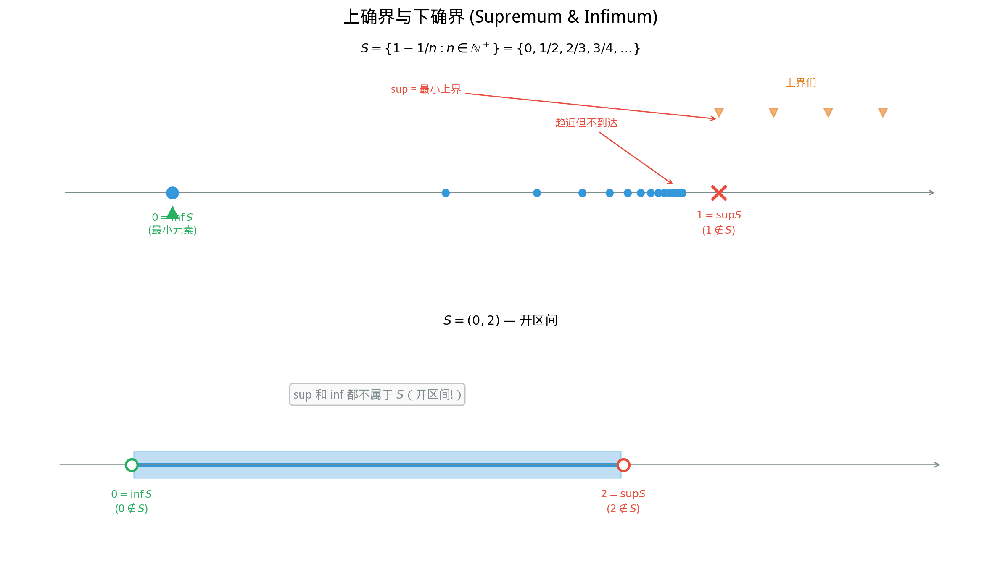

# §2 实数的完备性（Completeness of Real Numbers）[Bridge]

**前置知识**：[§1 实数的性质](01-properties.md)、[Part 1 第 2 章 §4 基数](../../part-01-foundations/ch02-sets/04-cardinality.md)

**全景图**：实数的完备性是分析学的灵魂。在第 1 章 §3 中，我们暂时接受了完备性公理（暂认），先用它推出了一系列重要性质。现在是兑现的时候了——本节将深入理解完备性究竟意味着什么、它从何而来、为什么有理数不具有这一性质。我们将介绍 Dedekind 切割这一直觉优美的构造方法，并比较完备性的几种等价形式。这是一节 **[Bridge]** 内容，连接具体的数系计算与抽象的分析学思维。

**预估学习时间**：约 3 小时

---

## 动机

> [兑现] 在 Part 2 Ch01 §3 中我们暂时接受了实数的完备性公理。现在我们来深入理解它。

回忆一下我们在 §3（第 1 章）中做了什么：我们声称"实数集 $\mathbb{R}$ 满足完备性公理——每个有上界的非空子集都有上确界"，然后利用这条公理推出了一系列结论（如阿基米德性质、有理数稠密性等）。

但这条公理的含义远比它的表述深刻。为什么需要这条公理？因为没有它，我们的数系会有"裂缝"——就像有理数集 $\mathbb{Q}$ 那样。完备性正是**填满裂缝**的保证。

本节的目标是三重的：
1. 严格理解上确界公理的含义和力量
2. 通过 Dedekind 切割看到完备性的**构造性来源**
3. 理解完备性的多种等价表述

---

## 1. 上确界公理（Supremum Axiom）

### 1.1 上界与上确界的回顾

> **定义 1**（上界，upper bound）
>
> 设 $S \subseteq \mathbb{R}$ 非空。称 $M \in \mathbb{R}$ 是 $S$ 的**上界**，若对所有 $s \in S$ 有 $s \leq M$。若 $S$ 有上界，则称 $S$ **有上界**（bounded above）。

> **定义 2**（上确界，supremum / least upper bound）
>
> 设 $S \subseteq \mathbb{R}$ 非空且有上界。称 $\alpha \in \mathbb{R}$ 是 $S$ 的**上确界**（supremum），记 $\alpha = \sup S$，若：
>
> (i) $\alpha$ 是 $S$ 的上界：$\forall s \in S,\; s \leq \alpha$
>
> (ii) $\alpha$ 是**最小**的上界：若 $M$ 是 $S$ 的上界，则 $\alpha \leq M$

等价地，条件 (ii) 可以替换为：

> (ii') 对任意 $\varepsilon > 0$，存在 $s \in S$ 使得 $s > \alpha - \varepsilon$

**直觉**：上确界是"刚好够大"的上界——不能再小一点，否则就不再是上界了。

类似地定义**下界**（lower bound）和**下确界**（infimum）：

> **定义 3**（下确界，infimum / greatest lower bound）
>
> 设 $S \subseteq \mathbb{R}$ 非空且有下界。称 $\beta = \inf S$ 是 $S$ 的**下确界**，若 $\beta$ 是最大的下界。

### 1.2 完备性公理的精确陈述

> **公理**（完备性公理 / 上确界公理，completeness axiom / least upper bound property）
>
> $\mathbb{R}$ 的每个**非空**且**有上界**的子集都有上确界，且上确界属于 $\mathbb{R}$。
>
> 即：若 $S \subseteq \mathbb{R}$，$S \neq \varnothing$，且 $S$ 有上界，则 $\sup S$ 存在。

**两个限定条件缺一不可**：
- "非空"：空集的每个实数都是上界（真空真），上确界不存在（没有最小上界，因为 $-\infty$ 不是实数）。
- "有上界"：$\mathbb{N}$ 无上界（阿基米德性质），谈不上上确界。

> **命题 1**（下确界原理）
>
> $\mathbb{R}$ 的每个非空且有下界的子集都有下确界。

> **证明**
>
> 设 $S \subseteq \mathbb{R}$ 非空且有下界。令 $-S = \{-s : s \in S\}$。则 $-S$ 非空且有上界（若 $m$ 是 $S$ 的下界，则 $-m$ 是 $-S$ 的上界）。
>
> 由完备性公理，$\alpha = \sup(-S)$ 存在。
>
> 断言 $-\alpha = \inf S$。
>
> (i) $-\alpha$ 是 $S$ 的下界：对任意 $s \in S$，$-s \in -S$，故 $-s \leq \alpha$，即 $s \geq -\alpha$。
>
> (ii) $-\alpha$ 是最大下界：若 $m$ 是 $S$ 的下界，则 $-m$ 是 $-S$ 的上界，故 $\alpha \leq -m$，即 $-\alpha \geq m$。$\blacksquare$

### 1.3 上确界的关键性质

> **命题 2**（上确界的逼近性质）
>
> 设 $\alpha = \sup S$。则对任意 $\varepsilon > 0$，存在 $s \in S$ 使得 $\alpha - \varepsilon < s \leq \alpha$。

> **证明**
>
> $\alpha - \varepsilon < \alpha$，所以 $\alpha - \varepsilon$ 不是 $S$ 的上界（因为 $\alpha$ 是最小上界）。故存在 $s \in S$ 使得 $s > \alpha - \varepsilon$。又 $s \leq \alpha$（因为 $\alpha$ 是上界），得 $\alpha - \varepsilon < s \leq \alpha$。$\blacksquare$

**重要性**：这个性质在分析学中反复使用——它说明上确界可以被集合中的元素"任意接近"。

---

## 2. Dedekind 切割（Dedekind Cut）

### 2.1 历史背景

1872 年，德国数学家理查德·戴德金（Richard Dedekind, 1831–1916）发表了一种优雅的实数构造方法。他的核心洞察是：既然有理数之间存在"裂缝"，那么每个裂缝本身就可以定义一个新的数。

### 2.2 切割的定义

> **定义 4**（Dedekind 切割，Dedekind cut）
>
> 有理数集 $\mathbb{Q}$ 的一个 **Dedekind 切割**是一个有序对 $(L, R)$，其中 $L, R \subseteq \mathbb{Q}$，满足：
>
> (D1) $L \neq \varnothing$ 且 $R \neq \varnothing$
>
> (D2) $L \cup R = \mathbb{Q}$（$L$ 和 $R$ 是 $\mathbb{Q}$ 的一个分割）
>
> (D3) $L \cap R = \varnothing$
>
> (D4) 对所有 $\ell \in L$ 和 $r \in R$，有 $\ell < r$（$L$ 中的每个元素小于 $R$ 中的每个元素）
>
> (D5) $L$ 没有最大元素

**直觉**：想象将有理数轴在某处"切一刀"，左边的有理数归入 $L$，右边的归入 $R$。这一刀切在哪里，就定义了哪个实数。

条件 (D5) 是技术性的——它保证当切在有理数点上时，该有理数归入 $R$（右边），使得每个切割有唯一的表示。

### 2.3 有理数的切割

每个有理数 $q$ 对应一个切割：

$$L_q = \{x \in \mathbb{Q} : x < q\}, \quad R_q = \{x \in \mathbb{Q} : x \geq q\}$$

验证这是一个合法的 Dedekind 切割：
- (D1)：$q - 1 \in L_q$，$q \in R_q$，故都非空
- (D2)(D3)：显然（每个有理数要么 $< q$，要么 $\geq q$）
- (D4)：若 $\ell < q \leq r$，则 $\ell < r$
- (D5)：$L_q$ 没有最大元素——对任意 $\ell \in L_q$，$(\ell + q)/2 \in L_q$ 且 $(\ell + q)/2 > \ell$

### 2.4 无理数的切割

**关键**：存在不对应任何有理数的切割——这些切割就对应无理数。

> **例 1**（$\sqrt{2}$ 的切割）
>
> 定义
>
> $$L = \{x \in \mathbb{Q} : x < 0 \text{ 或 } x^2 < 2\}, \quad R = \{x \in \mathbb{Q} : x \geq 0 \text{ 且 } x^2 \geq 2\}$$
>
> 验证这是一个 Dedekind 切割：
>
> - (D1)：$0 \in L$（因为 $0^2 = 0 < 2$），$2 \in R$（因为 $2^2 = 4 \geq 2$）
> - (D2)(D3)：每个有理数恰属于 $L$ 或 $R$ 之一
> - (D4)：需要验证（可以分情况讨论）
> - (D5)：$L$ 没有最大元素——对任意 $\ell \in L$ 且 $\ell > 0$，可以找到有理数 $\ell' > \ell$ 仍满足 $(\ell')^2 < 2$

这个切割不对应任何有理数——因为不存在有理数 $q$ 使得 $q^2 = 2$（在第 1 章 §2 中已证）。但它在直觉上精确地对应数轴上 $\sqrt{2}$ 的位置：$L$ 包含所有"小于 $\sqrt{2}$"的有理数，$R$ 包含所有"大于等于 $\sqrt{2}$"的有理数。

### 2.5 从切割到实数

Dedekind 的天才想法是：**将切割本身定义为实数**。

> **定义 5**（Dedekind 实数，非形式）
>
> **实数**就是有理数集的 Dedekind 切割。实数集 $\mathbb{R}$ 就是所有 Dedekind 切割的集合。

在这个框架下：
- 有理数 $q$ 对应切割 $(L_q, R_q)$——有理数自然地嵌入实数
- $\sqrt{2}$ 对应上面的切割 $(L, R)$——无理数填满了有理数之间的"裂缝"
- 切割之间的序关系：$(L_1, R_1) \leq (L_2, R_2) \iff L_1 \subseteq L_2$
- 切割上可以定义加法和乘法，使之成为有序域

### 2.6 为什么切割保证完备性

**关键定理**：由 Dedekind 切割构造的实数集满足完备性公理。

> **定理 1**（切割的完备性，sketch）
>
> 设 $\mathcal{S}$ 是一个由 Dedekind 切割组成的非空集合，且 $\mathcal{S}$ 有上界（即存在一个切割 $(L_M, R_M)$ 大于等于 $\mathcal{S}$ 中的每个切割）。则 $\mathcal{S}$ 有上确界。

> **证明梗概**
>
> 令 $L^* = \bigcup_{(L, R) \in \mathcal{S}} L$，$R^* = \mathbb{Q} \setminus L^*$。
>
> 可以验证 $(L^*, R^*)$ 是一个合法的 Dedekind 切割，并且它恰好是 $\mathcal{S}$ 的上确界。
>
> 直觉：将所有切割的"左半部分"取并集，得到的就是"最小的上界"所对应的切割。$\blacksquare$

**为什么这在 $\mathbb{Q}$ 中不行**：在 $\mathbb{Q}$ 中，如果我们只允许"有理数切割"（即切割点必须是有理数），那么 $\sqrt{2}$ 对应的切割没有有理数切割点——上确界不存在于 $\mathbb{Q}$ 中。Dedekind 切割的关键创新是**将切割本身作为新的数**，从而自动填补了所有空隙。

---

## 3. 为什么 $\mathbb{Q}$ 不完备（Why $\mathbb{Q}$ Is Not Complete）

### 3.1 具体的反例

> **命题 3**
>
> 集合
>
> $$S = \{q \in \mathbb{Q} : q > 0 \text{ 且 } q^2 < 2\}$$
>
> 在 $\mathbb{Q}$ 中有上界，但在 $\mathbb{Q}$ 中没有上确界。

> **证明**
>
> **$S$ 有上界**：$2$ 是 $S$ 的上界，因为若 $q \in S$ 则 $q^2 < 2 < 4$，又 $q > 0$，故 $q < 2$。
>
> **$S$ 在 $\mathbb{Q}$ 中没有上确界**：
>
> 假设 $\alpha \in \mathbb{Q}$ 是 $S$ 的上确界。则要么 $\alpha^2 < 2$，要么 $\alpha^2 > 2$，要么 $\alpha^2 = 2$。
>
> **情况 1**：$\alpha^2 < 2$。我们构造 $\alpha' \in \mathbb{Q}$ 使得 $\alpha' > \alpha$ 且 $(\alpha')^2 < 2$，这将说明 $\alpha$ 不是上界。
>
> 取 $\alpha' = \alpha + \delta$，其中 $\delta > 0$ 待定。则
>
> $$(\alpha')^2 = \alpha^2 + 2\alpha\delta + \delta^2 \leq \alpha^2 + (2\alpha + 1)\delta$$
>
> （利用 $\delta^2 \leq \delta$，只要 $\delta \leq 1$。）
>
> 取 $\delta = \min\left(1, \frac{2 - \alpha^2}{2\alpha + 1}\right)$，则 $(\alpha')^2 \leq \alpha^2 + (2 - \alpha^2) = 2$。
>
> 实际上不等式是严格的（需要更精细的选择），故 $(\alpha')^2 < 2$，且 $\alpha' > \alpha$，$\alpha' \in \mathbb{Q}$。这说明 $\alpha$ 不是 $S$ 的上界，矛盾。
>
> **情况 2**：$\alpha^2 > 2$。类似地构造 $\alpha'' < \alpha$ 使得 $(\alpha'')^2 > 2$ 且 $\alpha''$ 仍是 $S$ 的上界，说明 $\alpha$ 不是最小上界，矛盾。
>
> **情况 3**：$\alpha^2 = 2$。但 $\alpha \in \mathbb{Q}$，而我们已证 $\sqrt{2} \notin \mathbb{Q}$，矛盾。
>
> 三种情况都导致矛盾，故 $S$ 在 $\mathbb{Q}$ 中没有上确界。$\blacksquare$

### 3.2 几何直觉

在数轴上，$\mathbb{Q}$ 看起来"处处都有点"（稠密），但实际上充满了肉眼看不见的"针孔"。这些针孔就是无理数的位置。完备性公理的作用就是保证所有针孔都被填满。

如果把数轴比作一条绳子：
- $\mathbb{Q}$ 就像一条由无穷多条短线段拼接的绳子，虽然看起来连续，但其实到处断裂
- $\mathbb{R}$ 则是一条真正连续的、没有任何断裂的绳子

---

## 4. 完备性的等价形式（Equivalent Forms of Completeness）

完备性公理有多种等价表述。每种表述从不同角度刻画了"$\mathbb{R}$ 没有裂缝"这一核心思想。

> **定理 2**（完备性的等价形式）
>
> 以下命题对有序域 $F$ 等价（任一成立则全部成立）：
>
> **(LUB)** 上确界原理：$F$ 的每个非空有上界的子集有上确界。
>
> **(NI)** 区间套定理：若 $[a_1, b_1] \supseteq [a_2, b_2] \supseteq \cdots$ 且 $b_n - a_n \to 0$，则 $\bigcap [a_n, b_n] \neq \varnothing$。
>
> **(MCT)** 单调收敛定理：每个有界单调递增序列有极限。
>
> **(BW)** Bolzano-Weierstrass 定理：每个有界序列有收敛子列。
>
> **(CC)** Cauchy 完备性：每个 Cauchy 序列收敛。

**说明**：(MCT)、(BW)、(CC) 涉及极限和序列的概念，将在 Part 6（分析预备）中详细展开。此处先列出以供参考和预览。

### 4.1 LUB ⟹ NI（上确界原理推出区间套定理）

这已在 §1 定理 3 中证明。

### 4.2 NI ⟹ LUB（区间套定理推出上确界原理）

> **证明梗概**
>
> 设 $S \subseteq F$ 非空且有上界。选取 $a_1 \in S$ 和上界 $b_1$。
>
> 取中点 $m = (a_1 + b_1)/2$：
> - 若 $m$ 是 $S$ 的上界，令 $a_2 = a_1, b_2 = m$
> - 若 $m$ 不是 $S$ 的上界，令 $a_2 = m, b_2 = b_1$（并取 $a_2 \leq$ 某个 $s \in S, s > m$ 也可）
>
> 如此递推，得到嵌套闭区间 $[a_n, b_n]$，其中每个 $a_n$ 不是上界（或属于 $S$），每个 $b_n$ 是上界，且 $b_n - a_n = (b_1 - a_1)/2^{n-1} \to 0$。
>
> 由 NI，存在唯一 $\alpha \in \bigcap [a_n, b_n]$。可验证 $\alpha = \sup S$。$\blacksquare$

### 4.3 Cauchy 序列方法（预览）

**Cauchy 序列**（Cauchy sequence）是另一种构造实数的方法，由奥古斯丁-路易·柯西（Augustin-Louis Cauchy, 1789–1857）的思想发展而来。

直觉：一个序列 $\{a_n\}$ 是 Cauchy 的，意味着序列的项之间的距离越来越小——它们"聚在一起"。

> **定义 6**（Cauchy 序列，预览）
>
> 序列 $\{a_n\}$ 称为 **Cauchy 序列**，若对任意 $\varepsilon > 0$，存在 $N \in \mathbb{N}$ 使得当 $m, n > N$ 时 $|a_m - a_n| < \varepsilon$。

在 $\mathbb{R}$ 中，每个 Cauchy 序列都收敛——这就是 Cauchy 完备性。在 $\mathbb{Q}$ 中，Cauchy 序列可能不收敛（收敛的"目标"可能是无理数）。

**Cauchy 构造实数**的思路：将实数定义为有理数 Cauchy 序列的等价类（两个 Cauchy 序列等价，若它们的差趋于零）。这种方法在分析学中更为常用，将在 Part 6 中详细讨论。

---

## 5. 完备性的深层意义

### 5.1 连续性与完备性

完备性公理本质上说的是：**实数轴没有裂缝**。它是连续性（continuity）概念的源头。

在没有完备性的情况下，许多"直觉上显然"的定理都不成立：
- 中值定理（intermediate value theorem）：连续函数取到介于两个值之间的每个值——在 $\mathbb{Q}$ 上不成立
- 极值定理（extreme value theorem）：闭区间上的连续函数有最大值和最小值——在 $\mathbb{Q}$ 上不成立
- 微积分基本定理——依赖于实数的完备性

### 5.2 唯一性

实数有一个显著的特征：**完备有序域在同构意义下是唯一的**。

> **定理 3**（完备有序域的唯一性，不证）
>
> 任意两个完备有序域都是同构的（作为有序域同构）。

这意味着无论用 Dedekind 切割、Cauchy 序列还是其他方法构造实数，得到的都是"同一个"数系（在结构上完全等同）。$\mathbb{R}$ 不仅存在，而且本质上是唯一的。

---

## 例题

> **例 2**（上确界的计算）
>
> 求 $S = \{1 - 1/n : n \in \mathbb{N}^+\} = \{0, 1/2, 2/3, 3/4, \ldots\}$ 的上确界和下确界。

> **解**
>
> **上确界**：断言 $\sup S = 1$。
>
> (i) $1$ 是上界：$1 - 1/n < 1$ 对所有 $n \geq 1$。
>
> (ii) $1$ 是最小上界：对任意 $\varepsilon > 0$，由阿基米德性质，存在 $n$ 使得 $1/n < \varepsilon$，则 $1 - 1/n > 1 - \varepsilon$，即存在 $s \in S$ 使得 $s > 1 - \varepsilon$。
>
> 注意 $1 \notin S$——上确界不必属于集合本身。
>
> **下确界**：$\inf S = 0 = 1 - 1/1$，这是集合的最小元素。$\blacksquare$

> **例 3**（上确界与运算）
>
> 设 $A, B \subseteq \mathbb{R}$ 非空有上界。定义 $A + B = \{a + b : a \in A, b \in B\}$。证明：$\sup(A + B) = \sup A + \sup B$。

> **解**
>
> 设 $\alpha = \sup A$，$\beta = \sup B$。
>
> **$\alpha + \beta$ 是 $A + B$ 的上界**：对任意 $a \in A, b \in B$，$a \leq \alpha, b \leq \beta$，故 $a + b \leq \alpha + \beta$。
>
> **$\alpha + \beta$ 是最小上界**：设 $\varepsilon > 0$。由上确界的逼近性质（命题 2），存在 $a_0 \in A$ 使得 $a_0 > \alpha - \varepsilon/2$，存在 $b_0 \in B$ 使得 $b_0 > \beta - \varepsilon/2$。则
>
> $$a_0 + b_0 > (\alpha - \varepsilon/2) + (\beta - \varepsilon/2) = \alpha + \beta - \varepsilon$$
>
> 即 $\alpha + \beta - \varepsilon$ 不是 $A + B$ 的上界。由 $\varepsilon$ 的任意性，$\alpha + \beta$ 是最小上界。$\blacksquare$

> **例 4**（不完备性的后果）
>
> 定义函数 $f: \mathbb{Q} \to \mathbb{Q}$：
>
> $$f(x) = \begin{cases} -1 & \text{若 } x^2 < 2 \\ 1 & \text{若 } x^2 > 2 \end{cases}$$
>
> （注意 $x^2 = 2$ 在 $\mathbb{Q}$ 上不可能，所以 $f$ 在 $\mathbb{Q}$ 上处处有定义。）
>
> 则 $f$ 在 $\mathbb{Q}$ 上连续（在 $\mathbb{Q}$ 的拓扑意义下），$f(-1) = -1 < 0 < 1 = f(2)$，但不存在 $c \in \mathbb{Q}$ 使得 $f(c) = 0$。
>
> 这说明中值定理在 $\mathbb{Q}$ 上不成立——$\mathbb{Q}$ 的不完备性导致了"跳跃"。

---

## 要点回顾

| 概念 | 核心内容 |
|------|----------|
| 上确界 | 最小上界，"刚好够大"的上界 |
| 完备性公理 | 非空有上界子集必有上确界 |
| Dedekind 切割 | 将 $\mathbb{Q}$ 分为 $(L, R)$ 两部分，每个切割定义一个实数 |
| 有理数切割 | 对应有理数点，切在有理数位置 |
| 无理数切割 | 切割点不是有理数，"填补裂缝" |
| $\mathbb{Q}$ 不完备 | $\{q \in \mathbb{Q}: q^2 < 2\}$ 在 $\mathbb{Q}$ 中无上确界 |
| 完备性等价形式 | LUB ⟺ NI ⟺ MCT ⟺ BW ⟺ CC |
| Cauchy 序列 | 另一种构造实数的方法（Part 6 详述） |
| 完备有序域唯一 | $\mathbb{R}$ 本质上是唯一的完备有序域 |

---

## 进度检查点

完成本节后，你应该能够：

- [ ] 精确定义上界、上确界、下界、下确界
- [ ] 陈述完备性公理及其两个限定条件
- [ ] 解释 Dedekind 切割的定义和直觉
- [ ] 构造 $\sqrt{2}$ 的 Dedekind 切割
- [ ] 证明 $\{q \in \mathbb{Q} : q^2 < 2\}$ 在 $\mathbb{Q}$ 中没有上确界
- [ ] 列举完备性的几种等价形式
- [ ] 解释为什么完备性对分析学至关重要

---

## 暂认/兑现 状态

| 条目 | 状态 | 说明 |
|------|------|------|
| 实数的完备性公理 | ✅ 已兑现 | 在 Part 2 Ch01 §3 中暂认，本节通过 Dedekind 切割构造给出了完备性的来源 |

---

## 自测题

**1.** 求 $\sup\{x \in \mathbb{R} : x^2 < 9\}$ 和 $\inf\{x \in \mathbb{R} : x^2 < 9\}$。

答案

$\{x \in \mathbb{R} : x^2 < 9\} = (-3, 3)$。故 $\sup = 3$，$\inf = -3$。

验证：$3$ 是上界（$x^2 < 9 \implies |x| < 3 \implies x < 3$）。$3$ 是最小上界：对任意 $\varepsilon > 0$，$3 - \varepsilon/2 \in (-3, 3)$（只要 $\varepsilon$ 足够小），且 $3 - \varepsilon/2 > 3 - \varepsilon$。

**2.** 解释为什么 $(L, R) = (\{q \in \mathbb{Q}: q < 3\}, \{q \in \mathbb{Q}: q \geq 3\})$ 是一个合法的 Dedekind 切割。它对应哪个实数？

答案

验证五条公理：(D1) $2 \in L, 3 \in R$，都非空。(D2)(D3) 每个有理数恰好满足 $q < 3$ 或 $q \geq 3$ 之一。(D4) 若 $\ell < 3 \leq r$，则 $\ell < r$。(D5) $L$ 无最大元素：对任意 $\ell < 3$，$(\ell + 3)/2 < 3$ 且 $(\ell + 3)/2 > \ell$。

这个切割对应有理数 $3$。

**3.** 设 $A = \{1/n : n \in \mathbb{N}^+\}$，$B = \{-1/m : m \in \mathbb{N}^+\}$。求 $\sup(A + B)$。

答案

$A + B = \{1/n - 1/m : n, m \in \mathbb{N}^+\}$。

$\sup A = 1$（在 $n = 1$ 时取到），$\sup B = 0$（§1 推论 1 的对称版本：$\sup\{-1/m\} = 0$）。

由例 3 的结论，$\sup(A + B) = \sup A + \sup B = 1 + 0 = 1$。

直接验证：$1/1 - 1/m = 1 - 1/m$ 可以任意接近 $1$，但 $1/n - 1/m < 1/n \leq 1$，故 $\sup(A+B) = 1$。

**4.** 为什么完备性公理要求"非空"？如果去掉这个条件会怎样？

答案

$\varnothing$ 的每个实数都是上界（"对所有 $s \in \varnothing$，$s \leq M$"是空真命题）。如果要求空集有上确界，那上确界应该是所有实数中最小的——但不存在最小的实数（$-\infty$ 不是实数）。因此空集没有上确界，必须排除。

**5.** Dedekind 切割方法和 Cauchy 序列方法各有什么优缺点？

答案

**Dedekind 切割**：
- 优点：概念直觉清晰（"切一刀"），完备性的证明简洁自然
- 缺点：定义运算（特别是乘法）时细节繁琐，需要大量分情况讨论

**Cauchy 序列**：
- 优点：运算定义自然（逐项运算），可推广到一般度量空间的完备化
- 缺点：需要先定义等价关系和商集，概念上稍显间接

---

## 习题

本节习题见 [练习题](exercises/exercises.md)。
