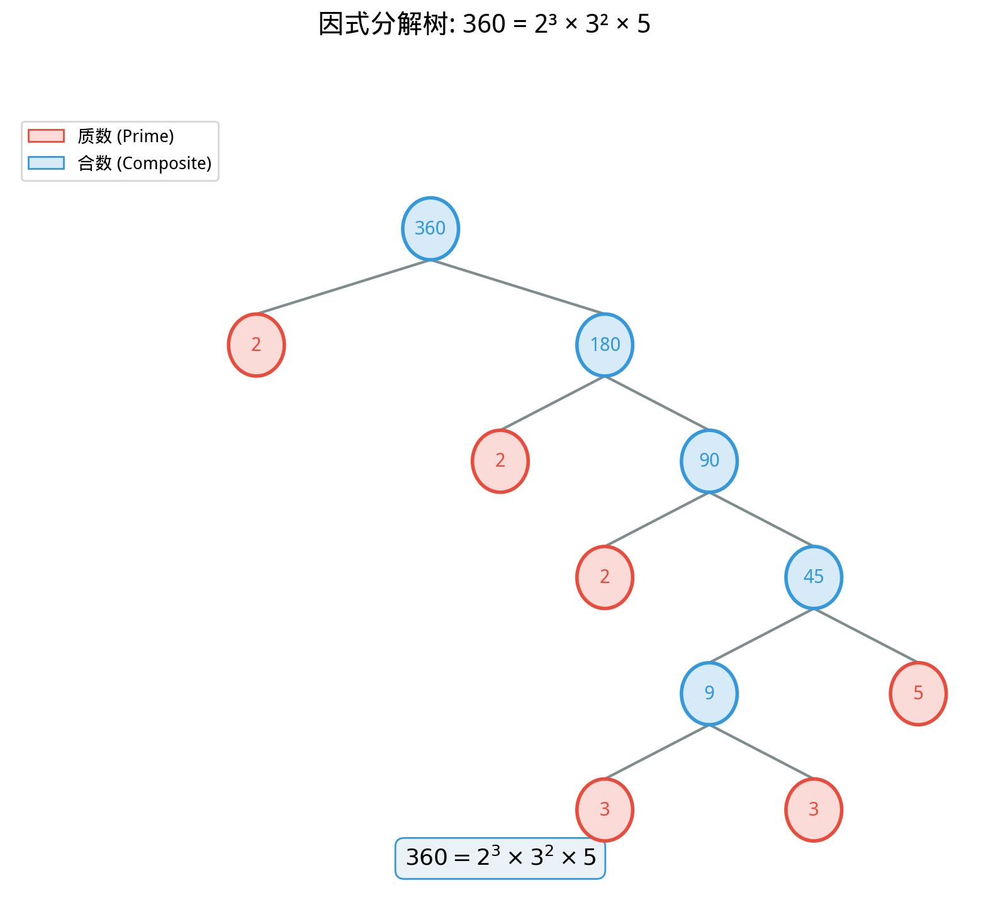
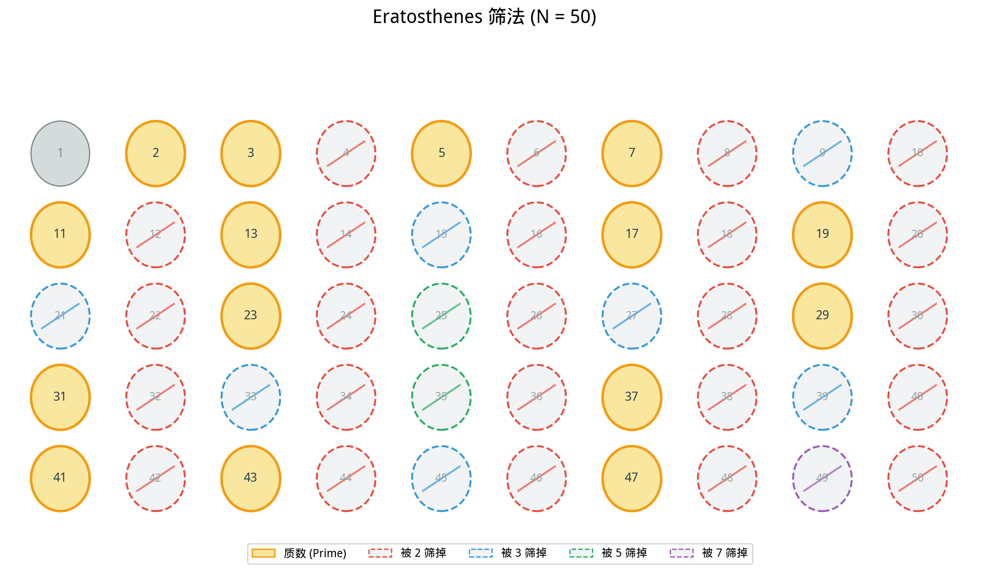

# §1 整除性与质数（Divisibility and Primes）

**前置知识**：[Part 2 第 1 章 §1 自然数与整数](../ch01-number-systems/01-naturals-integers.md)

**全景图**：整数看起来简单——$\ldots, -3, -2, -1, 0, 1, 2, 3, \ldots$ ——但它们内部的结构远比表面复杂。本节探索整除性（谁能被谁整除？）和质数（整数的"原子"）。我们将从整除的定义出发，经过带余除法和欧几里得算法，到达初等数论最深刻的定理——算术基本定理（Fundamental Theorem of Arithmetic）：每个大于 $1$ 的整数都可以唯一地写成质数的乘积。这条定理是整个数论大厦的基石。

**预估学习时间**：约 3 小时

---

## 动机

考虑一个简单的问题：12 可以被哪些正整数整除？

$$12 = 1 \times 12 = 2 \times 6 = 3 \times 4$$

所以 $12$ 的因子（divisors）是 $1, 2, 3, 4, 6, 12$。

进一步：$12 = 2^2 \times 3$。这个分解告诉我们 $12$ 的"原子组成"——它由两个 $2$ 和一个 $3$ 组合而成。这种分解是**唯一的**吗？看起来是——但证明它需要相当精巧的论证。

更深的问题：
- 给定两个整数 $a$ 和 $b$，如何高效地找到它们的最大公约数？
- 质数有多少个？有限还是无限？
- 质数如何分布在整数中？

这些问题引导我们进入整除理论和质数理论的世界。

---

## 1. 整除（Divisibility）

### 1.1 定义

> **定义 1**（整除，divisibility）
>
> 设 $a, b \in \mathbb{Z}$，$a \neq 0$。若存在 $k \in \mathbb{Z}$ 使得 $b = ak$，则称 $a$ **整除** $b$（或 $b$ 是 $a$ 的**倍数**，或 $a$ 是 $b$ 的**因子/约数**），记作 $a \mid b$。
>
> 若 $a$ 不整除 $b$，记作 $a \nmid b$。

**例子**：
- $3 \mid 12$（因为 $12 = 3 \times 4$）
- $5 \mid 0$（因为 $0 = 5 \times 0$）
- $7 \nmid 15$（不存在整数 $k$ 使得 $15 = 7k$）
- $(-4) \mid 20$（因为 $20 = (-4)(-5)$）

**注意**：定义中 $a \neq 0$，因为 $0$ 不整除任何非零整数（$b = 0 \cdot k = 0$ 只对 $b = 0$ 成立）。约定上我们不讨论 $0$ 作为除数的情况。

### 1.2 整除的基本性质

> **命题 1**（整除的性质）
>
> 设 $a, b, c \in \mathbb{Z}$（$a \neq 0$ 在涉及整除时）。
>
> (a) **自反性**：$a \mid a$（$a \neq 0$）
>
> (b) **传递性**：若 $a \mid b$ 且 $b \mid c$，则 $a \mid c$
>
> (c) **线性组合**：若 $a \mid b$ 且 $a \mid c$，则 $a \mid (bx + cy)$ 对任意 $x, y \in \mathbb{Z}$
>
> (d) **乘法保整除**：若 $a \mid b$，则 $a \mid bc$ 对任意 $c \in \mathbb{Z}$
>
> (e) **大小约束**：若 $a \mid b$ 且 $b \neq 0$，则 $|a| \leq |b|$
>
> (f) **互整除**：若 $a \mid b$ 且 $b \mid a$，则 $|a| = |b|$

> **证明**（选证 (b) 和 (c)）
>
> **(b)**：$a \mid b$ 意味 $b = ak_1$，$b \mid c$ 意味 $c = bk_2$。故 $c = ak_1 k_2$，而 $k_1 k_2 \in \mathbb{Z}$，故 $a \mid c$。
>
> **(c)**：$a \mid b$ 意味 $b = ak_1$，$a \mid c$ 意味 $c = ak_2$。故 $bx + cy = ak_1 x + ak_2 y = a(k_1 x + k_2 y)$，而 $k_1 x + k_2 y \in \mathbb{Z}$，故 $a \mid (bx + cy)$。$\blacksquare$

---

## 2. 带余除法（Division Algorithm）

### 2.1 定理陈述

> **定理 1**（带余除法，division algorithm）
>
> 设 $a \in \mathbb{Z}$，$b \in \mathbb{Z}^+$。则存在**唯一**的整数 $q$（商，quotient）和 $r$（余数，remainder）使得：
>
> $$a = bq + r, \quad 0 \leq r < b$$

**直觉**：将 $a$ 除以 $b$，商为 $q$，余数为 $r$。例如 $23 = 5 \times 4 + 3$，$-17 = 5 \times (-4) + 3$。

### 2.2 证明

> **证明**（带余除法的存在性和唯一性）
>
> **存在性**：
>
> 考虑集合 $S = \{a - bk : k \in \mathbb{Z},\; a - bk \geq 0\}$。
>
> 断言 $S \neq \varnothing$：取 $k = -|a|$，则 $a - b(-|a|) = a + b|a| \geq a + |a| \geq 0$。
>
> 由自然数的良序性，$S$ 有最小元素。设 $r = \min S$，对应 $q$ 使得 $r = a - bq$。
>
> 则 $r \geq 0$（由 $S$ 的定义）。需证 $r < b$：假设 $r \geq b$，则 $r - b = a - b(q + 1) \geq 0$，即 $r - b \in S$。但 $r - b < r$，与 $r = \min S$ 矛盾。故 $r < b$。
>
> **唯一性**：
>
> 设 $a = bq_1 + r_1 = bq_2 + r_2$，$0 \leq r_1, r_2 < b$。
>
> 则 $b(q_1 - q_2) = r_2 - r_1$。故 $b \mid (r_2 - r_1)$。
>
> 又 $|r_2 - r_1| < b$（因为 $0 \leq r_1, r_2 < b$）。
>
> 唯一满足 $b \mid (r_2 - r_1)$ 且 $|r_2 - r_1| < b$ 的情况是 $r_2 - r_1 = 0$，即 $r_1 = r_2$，从而 $q_1 = q_2$。$\blacksquare$

---

## 3. 最大公约数（Greatest Common Divisor）

### 3.1 定义

> **定义 2**（公约数与最大公约数，GCD）
>
> 设 $a, b \in \mathbb{Z}$，不全为零。
>
> - $d \in \mathbb{Z}^+$ 是 $a$ 和 $b$ 的**公约数**（common divisor），若 $d \mid a$ 且 $d \mid b$。
> - $a$ 和 $b$ 的**最大公约数**（greatest common divisor）是它们的最大的公约数，记作 $\gcd(a, b)$。

**例子**：$\gcd(12, 18) = 6$，$\gcd(7, 15) = 1$，$\gcd(0, 5) = 5$。

> **定义 3**（互素，coprime / relatively prime）
>
> 若 $\gcd(a, b) = 1$，则称 $a$ 和 $b$ **互素**（coprime）。

### 3.2 欧几里得算法（Euclidean Algorithm）

计算 $\gcd(a, b)$ 的最高效方法之一是**欧几里得算法**——可能是人类历史上最古老的算法，记载于欧几里得《几何原本》（约公元前 300 年）。

**算法描述**：

> **欧几里得算法**
>
> 输入：$a, b \in \mathbb{Z}^+$，$a \geq b$。
>
> 反复做带余除法：
>
> $$a = bq_1 + r_1, \quad 0 \leq r_1 < b$$
> $$b = r_1 q_2 + r_2, \quad 0 \leq r_2 < r_1$$
> $$r_1 = r_2 q_3 + r_3, \quad 0 \leq r_3 < r_2$$
> $$\vdots$$
> $$r_{n-2} = r_{n-1} q_n + r_n, \quad 0 \leq r_n < r_{n-1}$$
> $$r_{n-1} = r_n q_{n+1} + 0$$
>
> 最后一个非零余数 $r_n$ 即为 $\gcd(a, b)$。

**为什么算法终止**：余数序列 $b > r_1 > r_2 > \cdots \geq 0$ 是严格递减的非负整数序列，故必在有限步后到达 $0$。

> **例 1**（用欧几里得算法计算 $\gcd(252, 105)$）
>
> $$252 = 105 \times 2 + 42$$
> $$105 = 42 \times 2 + 21$$
> $$42 = 21 \times 2 + 0$$
>
> 最后一个非零余数是 $21$，故 $\gcd(252, 105) = 21$。

### 3.3 欧几里得算法的正确性

> **定理 2**（欧几里得算法的正确性）
>
> 欧几里得算法的输出 $r_n$ 等于 $\gcd(a, b)$。

> **证明**
>
> 关键观察：对任意整数 $x, y$ 和 $q$，$\gcd(x, y) = \gcd(y, x - qy)$。
>
> 证明此观察：设 $d = \gcd(x, y)$。则 $d \mid x$ 且 $d \mid y$，故 $d \mid (x - qy)$。因此 $d$ 是 $y$ 和 $x - qy$ 的公约数。反过来，设 $d'$ 是 $y$ 和 $x - qy$ 的公约数，则 $d' \mid y$ 且 $d' \mid (x - qy)$，故 $d' \mid (x - qy + qy) = x$，即 $d'$ 是 $x$ 和 $y$ 的公约数。因此两组公约数相同，最大公约数也相同。
>
> 应用到算法的每一步：
>
> $$\gcd(a, b) = \gcd(b, r_1) = \gcd(r_1, r_2) = \cdots = \gcd(r_{n-1}, r_n) = \gcd(r_n, 0) = r_n$$
>
> 最后一步用到 $\gcd(r_n, 0) = r_n$。$\blacksquare$

### 3.4 Bézout 等式（Bézout's Identity）

> **定理 3**（Bézout 等式，Bézout's identity）
>
> 设 $a, b \in \mathbb{Z}$，不全为零。则存在 $x, y \in \mathbb{Z}$ 使得
>
> $$\gcd(a, b) = ax + by$$
>
> 即最大公约数可以表示为 $a$ 和 $b$ 的**整数线性组合**。

> **证明**
>
> 考虑集合 $S = \{ax + by : x, y \in \mathbb{Z},\; ax + by > 0\}$。
>
> $S \neq \varnothing$：例如 $|a| = a \cdot \text{sgn}(a) + b \cdot 0 \in S$（若 $a \neq 0$）。
>
> 由良序性，$S$ 有最小元素 $d = ax_0 + by_0$。
>
> **断言 $d = \gcd(a, b)$**：
>
> (i) $d \mid a$：做带余除法 $a = dq + r$，$0 \leq r < d$。则 $r = a - dq = a - (ax_0 + by_0)q = a(1 - x_0 q) + b(-y_0 q)$。若 $r > 0$，则 $r \in S$ 且 $r < d$，矛盾。故 $r = 0$，即 $d \mid a$。
>
> 类似地，$d \mid b$。故 $d$ 是 $a, b$ 的公约数。
>
> (ii) 若 $c$ 是 $a, b$ 的任意公约数，则 $c \mid a$ 且 $c \mid b$，故 $c \mid (ax_0 + by_0) = d$。因此 $c \leq d$。
>
> 综合：$d$ 是最大公约数。$\blacksquare$

> **例 2**（扩展欧几里得算法求 Bézout 系数）
>
> 求 $x, y$ 使得 $\gcd(252, 105) = 252x + 105y$。
>
> 从欧几里得算法的步骤反推：
>
> $$21 = 105 - 42 \times 2$$
> $$42 = 252 - 105 \times 2$$
>
> 代入：
>
> $$21 = 105 - (252 - 105 \times 2) \times 2 = 105 - 252 \times 2 + 105 \times 4 = 252 \times (-2) + 105 \times 5$$
>
> 故 $x = -2, y = 5$。验证：$252 \times (-2) + 105 \times 5 = -504 + 525 = 21$。✓

### 3.5 GCD 的重要性质

> **推论 1**（Euclid 引理）
>
> 若 $p$ 是质数且 $p \mid ab$，则 $p \mid a$ 或 $p \mid b$。

> **证明**
>
> 假设 $p \nmid a$。因 $p$ 是质数，$\gcd(p, a) = 1$（$p$ 的正因子只有 $1$ 和 $p$，而 $p \nmid a$，故公因子只能是 $1$）。
>
> 由 Bézout 等式，$1 = px + ay$，对某些 $x, y \in \mathbb{Z}$。
>
> 两边乘 $b$：$b = pbx + aby$。
>
> $p \mid pbx$（显然），$p \mid aby$（因为 $p \mid ab$）。故 $p \mid b$。$\blacksquare$

---

## 4. 质数（Primes）

### 4.1 定义

> **定义 4**（质数与合数，prime and composite）
>
> 设 $n \in \mathbb{Z}$，$n \geq 2$。
>
> - 若 $n$ 的正因子只有 $1$ 和 $n$ 本身，则称 $n$ 为**质数**（prime number）。
> - 若 $n$ 不是质数（即存在 $1 < a < n$ 使得 $a \mid n$），则称 $n$ 为**合数**（composite number）。
>
> 注意：$1$ 既不是质数也不是合数。

最小的几个质数：$2, 3, 5, 7, 11, 13, 17, 19, 23, 29, 31, \ldots$

$2$ 是唯一的偶质数。

### 4.2 质数的无穷性

> **定理 4**（Euclid 定理，质数有无穷多个）
>
> 质数集合 $\mathbb{P} = \{2, 3, 5, 7, 11, \ldots\}$ 是无穷集。

> **证明**（Euclid 的经典证明，约公元前 300 年）
>
> 反证法。假设质数只有有限多个：$p_1, p_2, \ldots, p_n$。
>
> 考虑数 $N = p_1 p_2 \cdots p_n + 1$。
>
> $N > 1$，故 $N$ 要么是质数，要么可以被某个质数整除。
>
> 但对每个 $p_i$（$i = 1, \ldots, n$），$N$ 除以 $p_i$ 的余数为 $1$（因为 $N = p_1 \cdots p_n + 1$），故 $p_i \nmid N$。
>
> 这意味着 $N$ 的质因子不在列表 $\{p_1, \ldots, p_n\}$ 中——与假设"所有质数都在列表中"矛盾。$\blacksquare$

**注意**：这个证明**不是**说 $p_1 p_2 \cdots p_n + 1$ 一定是质数！例如 $2 \times 3 \times 5 \times 7 \times 11 \times 13 + 1 = 30031 = 59 \times 509$。关键是它有一个不在列表中的质因子。

### 4.3 合数的质因子

> **命题 2**
>
> 每个合数 $n$ 都有一个不超过 $\sqrt{n}$ 的质因子。

> **证明**
>
> 设 $n$ 是合数，$n = ab$，$1 < a \leq b < n$。
>
> 若 $a > \sqrt{n}$，则 $b \geq a > \sqrt{n}$，故 $n = ab > \sqrt{n} \cdot \sqrt{n} = n$，矛盾。
>
> 因此 $a \leq \sqrt{n}$。$a$ 要么是质数，要么有质因子 $p \leq a \leq \sqrt{n}$。无论如何，$n$ 有一个 $\leq \sqrt{n}$ 的质因子。$\blacksquare$

---

## 5. 算术基本定理（Fundamental Theorem of Arithmetic）

### 5.1 定理陈述

> **定理 5**（算术基本定理，Fundamental Theorem of Arithmetic / Unique Factorization Theorem）
>
> 每个整数 $n \geq 2$ 都可以写成质数的乘积：
>
> $$n = p_1^{a_1} p_2^{a_2} \cdots p_k^{a_k}$$
>
> 其中 $p_1 < p_2 < \cdots < p_k$ 是质数，$a_1, a_2, \ldots, a_k \geq 1$。
>
> 而且，这种分解（不计各因子的顺序）是**唯一的**。

### 5.2 存在性证明（强归纳法）

> **证明**（存在性）
>
> 对 $n$ 使用强归纳法。
>
> **基础情形**：$n = 2$。$2$ 本身是质数，分解为 $2$。
>
> **归纳步骤**：设对所有 $2 \leq m < n$，$m$ 都可以写成质数乘积。考虑 $n$：
>
> - 若 $n$ 是质数，它本身就是质数乘积（只有一个因子）。
> - 若 $n$ 是合数，则 $n = ab$，$1 < a, b < n$。由归纳假设，$a$ 和 $b$ 都可以写成质数乘积，故 $n = ab$ 也是质数乘积。
>
> 由强归纳原理，所有 $n \geq 2$ 都可以写成质数乘积。$\blacksquare$

### 5.3 唯一性证明（Euclid 引理）

> **证明**（唯一性）
>
> 假设
>
> $$n = p_1 p_2 \cdots p_r = q_1 q_2 \cdots q_s$$
>
> 是两种质数分解（允许重复因子，按非递减排列）。
>
> $p_1 \mid n = q_1 q_2 \cdots q_s$。由 Euclid 引理（推论 1，反复应用），$p_1 \mid q_j$ 对某个 $j$。因 $q_j$ 是质数，$p_1 = q_j$。
>
> 从两边消去 $p_1 = q_j$：
>
> $$p_2 \cdots p_r = q_1 \cdots q_{j-1} q_{j+1} \cdots q_s$$
>
> 对剩余部分重复此过程（对 $r$ 做归纳）。
>
> 若 $r < s$，则消去所有 $p_i$ 后右边还有质数剩余，其乘积等于 $1$，矛盾。若 $r > s$，类似矛盾。故 $r = s$，且每个 $p_i$ 与某个 $q_j$ 配对（一一对应），排序后 $p_i = q_i$。$\blacksquare$

> **例 3**（质因数分解）
>
> - $360 = 2^3 \times 3^2 \times 5$
> - $1001 = 7 \times 11 \times 13$
> - $2^{31} - 1 = 2147483647$（这是一个质数——梅森质数 $M_{31}$）

---

## 6. Eratosthenes 筛法（Sieve of Eratosthenes）

### 6.1 算法描述

Eratosthenes 筛法是一种古老而高效的方法，用于找出 $2$ 到 $N$ 之间的所有质数。由古希腊数学家埃拉托色尼（Eratosthenes, 约公元前 276–195 年）发明。

> **算法**（Eratosthenes 筛法）
>
> 1. 写出 $2, 3, 4, \ldots, N$
> 2. 从最小的未标记数 $p = 2$ 开始
> 3. 标记 $p$ 的所有大于 $p$ 的倍数 $2p, 3p, 4p, \ldots$（它们都是合数）
> 4. 找到下一个未标记的数，令其为新的 $p$
> 5. 若 $p^2 > N$，停止（由命题 2，剩余未标记的数都是质数）
> 6. 否则回到步骤 3

### 6.2 效率分析

筛法的时间复杂度为 $O(N \log \log N)$——对于找出 $N$ 以内所有质数，这几乎是最优的。

标记操作次数约为：

$$\sum_{p \leq N,\; p\text{ 质数}} \frac{N}{p} \approx N \sum_{p \leq N} \frac{1}{p} \approx N \log \log N$$

最后一步用到了素数倒数之和的渐近估计（这是一个深刻的解析数论结果）。

> **例 4**（筛出 $30$ 以内的质数）
>
> 初始列表：$2, 3, 4, 5, 6, 7, 8, 9, 10, 11, 12, 13, 14, 15, 16, 17, 18, 19, 20, 21, 22, 23, 24, 25, 26, 27, 28, 29, 30$
>
> 筛 $2$：去掉 $4, 6, 8, 10, 12, 14, 16, 18, 20, 22, 24, 26, 28, 30$
>
> 筛 $3$：去掉 $9, 15, 21, 27$（$6, 12, 18, 24, 30$ 已被筛掉）
>
> 筛 $5$：去掉 $25$（其余 $5$ 的倍数已被筛）
>
> $7^2 = 49 > 30$，停止。
>
> 剩余：$2, 3, 5, 7, 11, 13, 17, 19, 23, 29$——这就是 $30$ 以内的全部 $10$ 个质数。

---

## 例题

> **例 5**（GCD 与 Bézout 等式）
>
> 用欧几里得算法计算 $\gcd(1071, 462)$，并找出 Bézout 系数。

> **解**
>
> $$1071 = 462 \times 2 + 147$$
> $$462 = 147 \times 3 + 21$$
> $$147 = 21 \times 7 + 0$$
>
> 故 $\gcd(1071, 462) = 21$。
>
> 反推 Bézout 系数：
> $$21 = 462 - 147 \times 3$$
> $$147 = 1071 - 462 \times 2$$
> $$21 = 462 - (1071 - 462 \times 2) \times 3 = 462 \times 7 - 1071 \times 3$$
>
> 即 $21 = 1071 \times (-3) + 462 \times 7$。
>
> 验证：$1071 \times (-3) + 462 \times 7 = -3213 + 3234 = 21$。✓

> **例 6**（利用算术基本定理）
>
> 证明：若 $n^2$ 是偶数，则 $n$ 是偶数。

> **解**
>
> 设 $n$ 的质因数分解为 $n = 2^a \cdot m$，其中 $\gcd(m, 2) = 1$。
>
> 则 $n^2 = 2^{2a} \cdot m^2$。$n^2$ 是偶数意味 $2 \mid n^2$，即 $2a \geq 1$，故 $a \geq 1$。
>
> 因此 $2 \mid n$，即 $n$ 是偶数。$\blacksquare$
>
> （另一种证明：对偶法。若 $n$ 是奇数，则 $n = 2k + 1$，$n^2 = 4k^2 + 4k + 1$ 是奇数。）

> **例 7**（GCD 与 LCM 的关系）
>
> 对正整数 $a, b$，证明 $\gcd(a,b) \cdot \text{lcm}(a,b) = ab$。

> **解**
>
> 设 $a = p_1^{a_1} \cdots p_k^{a_k}$，$b = p_1^{b_1} \cdots p_k^{b_k}$（允许指数为 $0$）。
>
> 则 $\gcd(a,b) = p_1^{\min(a_1,b_1)} \cdots p_k^{\min(a_k,b_k)}$，$\text{lcm}(a,b) = p_1^{\max(a_1,b_1)} \cdots p_k^{\max(a_k,b_k)}$。
>
> 由 $\min(a_i, b_i) + \max(a_i, b_i) = a_i + b_i$，得
>
> $$\gcd(a,b) \cdot \text{lcm}(a,b) = p_1^{a_1+b_1} \cdots p_k^{a_k+b_k} = ab \qquad \blacksquare$$

---

## 要点回顾

| 概念 | 核心内容 |
|------|----------|
| 整除 $a \mid b$ | $\exists k \in \mathbb{Z},\; b = ak$ |
| 带余除法 | $a = bq + r$，$0 \leq r < b$，存在且唯一 |
| 最大公约数 | 最大的公约数，$\gcd(a,b) = ax + by$（Bézout） |
| 欧几里得算法 | 反复带余除法求 GCD，利用 $\gcd(a,b) = \gcd(b, a \bmod b)$ |
| 质数 | 大于 $1$、因子只有 $1$ 和自身的整数 |
| Euclid 引理 | $p \mid ab \implies p \mid a$ 或 $p \mid b$（$p$ 为质数） |
| 算术基本定理 | 唯一质因数分解：$n = p_1^{a_1} \cdots p_k^{a_k}$ |
| Eratosthenes 筛 | $O(N \log \log N)$ 找出 $N$ 以内所有质数 |

---

## 进度检查点

完成本节后，你应该能够：

- [ ] 判断整除关系，运用整除的基本性质
- [ ] 执行带余除法
- [ ] 用欧几里得算法计算 GCD
- [ ] 用扩展欧几里得算法求 Bézout 系数
- [ ] 陈述 Euclid 引理并理解其证明
- [ ] 陈述并证明算术基本定理（存在性 + 唯一性）
- [ ] 描述 Eratosthenes 筛法的步骤

---

## 自测题

**1.** 计算 $\gcd(270, 192)$，写出每步的带余除法。

答案

$270 = 192 \times 1 + 78$
$192 = 78 \times 2 + 36$
$78 = 36 \times 2 + 6$
$36 = 6 \times 6 + 0$

故 $\gcd(270, 192) = 6$。

**2.** 求 $x, y \in \mathbb{Z}$ 使得 $6 = 270x + 192y$。

答案

反推：$6 = 78 - 36 \times 2 = 78 - (192 - 78 \times 2) \times 2 = 78 \times 5 - 192 \times 2 = (270 - 192) \times 5 - 192 \times 2 = 270 \times 5 - 192 \times 7$。

故 $x = 5, y = -7$。验证：$270 \times 5 - 192 \times 7 = 1350 - 1344 = 6$。✓

**3.** 不通过质因数分解，证明 $\gcd(n, n+1) = 1$（相邻整数互素）。

答案

设 $d = \gcd(n, n+1)$。则 $d \mid n$ 且 $d \mid (n+1)$，故 $d \mid ((n+1) - n) = 1$。因此 $d = 1$。

**4.** 将 $2520$ 分解为质因数的乘积。

答案

$2520 = 2 \times 1260 = 2^2 \times 630 = 2^3 \times 315 = 2^3 \times 3 \times 105 = 2^3 \times 3 \times 3 \times 35 = 2^3 \times 3^2 \times 5 \times 7$。

**5.** Euclid 关于质数无穷性的证明中，$N = p_1 \cdots p_n + 1$ 一定是质数吗？举一个 $N$ 不是质数的例子。

答案

不一定。例如取 $p_1 = 2, p_2 = 3, p_3 = 5, p_4 = 7, p_5 = 11, p_6 = 13$，则 $N = 2 \times 3 \times 5 \times 7 \times 11 \times 13 + 1 = 30031 = 59 \times 509$，是合数。证明的关键不是 $N$ 是质数，而是 $N$ 有一个不在原列表中的质因子。

---

## 习题

本节习题见 [练习题](exercises/exercises.md)。
