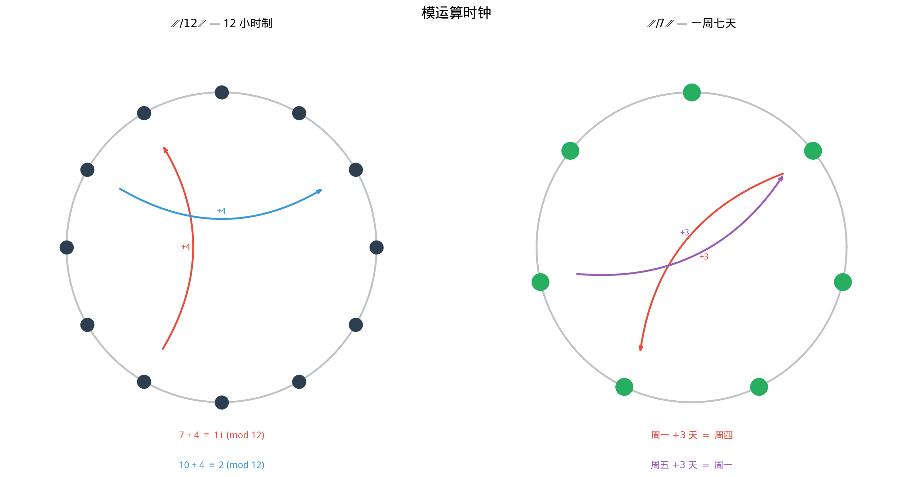

# §2 同余与模运算（Congruences and Modular Arithmetic）

**前置知识**：[§1 整除性与质数](01-divisibility-primes.md)、[Part 1 第 2 章 §2 关系](../../part-01-foundations/ch02-sets/02-relations.md)（等价关系）

**全景图**：同余（congruence）是数论的核心语言。当我们说"17 除以 5 余 2"时，我们实际上在说 $17$ 和 $2$ 在"模 5 的世界"中是"相同的"。同余将整数按余数分成若干等价类，在这些等价类上定义的加法和乘法构成了一个新的代数结构——$\mathbb{Z}/m\mathbb{Z}$。模运算在密码学、计算机科学和代数中无处不在。本节还将证明两个优美的定理：Fermat 小定理和中国剩余定理。

**预估学习时间**：约 2–3 小时

---

## 动机

日常生活中到处是"模运算"的影子：

- 时钟：$15$ 点就是下午 $3$ 点——$15 \equiv 3 \pmod{12}$
- 星期：今天是周一，$100$ 天后是周几？$100 = 14 \times 7 + 2$，所以是周三
- 奇偶性：一个数是偶数还是奇数，取决于它模 $2$ 的余数

更深层地，同余是一种**等价关系**（回忆 Part 1 Ch02 §2），它将无穷的整数集分成有限多个等价类。在等价类上做运算——这正是代数学的核心思想，也是从具体到抽象的关键一步。

---

## 1. 同余的定义（Definition of Congruence）

> **定义 1**（同余，congruence）
>
> 设 $m \in \mathbb{Z}^+$（称为**模数**，modulus）。对 $a, b \in \mathbb{Z}$，称 $a$ **同余于** $b$ **模** $m$，记作
>
> $$a \equiv b \pmod{m}$$
>
> 若 $m \mid (a - b)$，即 $a - b$ 是 $m$ 的倍数。

等价表述：$a \equiv b \pmod{m}$ 当且仅当 $a$ 和 $b$ 除以 $m$ 的余数相同。

**例子**：
- $17 \equiv 2 \pmod{5}$（$17 - 2 = 15 = 5 \times 3$）
- $-3 \equiv 4 \pmod{7}$（$-3 - 4 = -7 = 7 \times (-1)$）
- $100 \equiv 0 \pmod{10}$（$10 \mid 100$）
- $n \equiv 0 \pmod{2}$ 当且仅当 $n$ 是偶数

---

## 2. 同余是等价关系（Congruence as an Equivalence Relation）

> **定理 1**（同余是等价关系）
>
> 对固定的模数 $m$，同余关系 $\equiv \pmod{m}$ 是 $\mathbb{Z}$ 上的等价关系。即它满足：
>
> (i) **自反性**（reflexive）：$a \equiv a \pmod{m}$
>
> (ii) **对称性**（symmetric）：若 $a \equiv b \pmod{m}$，则 $b \equiv a \pmod{m}$
>
> (iii) **传递性**（transitive）：若 $a \equiv b \pmod{m}$ 且 $b \equiv c \pmod{m}$，则 $a \equiv c \pmod{m}$

> **证明**
>
> (i) $m \mid (a - a) = 0$。✓
>
> (ii) 若 $m \mid (a - b)$，则 $m \mid (-(a - b)) = (b - a)$。✓
>
> (iii) 若 $m \mid (a - b)$ 且 $m \mid (b - c)$，则 $m \mid ((a - b) + (b - c)) = (a - c)$（整除的线性组合性质）。✓ $\blacksquare$

**回顾**：在 Part 1 Ch02 §2 中，我们学习了等价关系将集合分成不相交的等价类（partition）。同余关系将 $\mathbb{Z}$ 分成 $m$ 个等价类。

---

## 3. 模运算（Modular Arithmetic）

### 3.1 剩余类

> **定义 2**（剩余类，residue class）
>
> 整数 $a$ 关于模 $m$ 的**剩余类**（residue class）是
>
> $$[a]_m = \{a + km : k \in \mathbb{Z}\} = \{\ldots, a - 2m, a - m, a, a + m, a + 2m, \ldots\}$$
>
> 即所有与 $a$ 模 $m$ 同余的整数的集合。

模 $m$ 恰好有 $m$ 个不同的剩余类：

$$\mathbb{Z}/m\mathbb{Z} = \{[0]_m, [1]_m, [2]_m, \ldots, [m-1]_m\}$$

**例**（$m = 4$）：

| 剩余类 | 元素 |
|--------|------|
| $[0]_4$ | $\ldots, -8, -4, 0, 4, 8, 12, \ldots$ |
| $[1]_4$ | $\ldots, -7, -3, 1, 5, 9, 13, \ldots$ |
| $[2]_4$ | $\ldots, -6, -2, 2, 6, 10, 14, \ldots$ |
| $[3]_4$ | $\ldots, -5, -1, 3, 7, 11, 15, \ldots$ |

### 3.2 剩余类上的运算

> **定义 3**（模 $m$ 加法和乘法）
>
> 在 $\mathbb{Z}/m\mathbb{Z}$ 上定义：
>
> $$[a]_m + [b]_m = [a + b]_m$$
> $$[a]_m \cdot [b]_m = [a \cdot b]_m$$

**关键问题：良定义性（well-definedness）**。由于同一个剩余类有多个代表元（如 $[2]_5 = [7]_5 = [-3]_5$），需要验证运算结果不依赖代表元的选取。

> **命题 1**（模运算的良定义性）
>
> 若 $a \equiv a' \pmod{m}$ 且 $b \equiv b' \pmod{m}$，则：
>
> (i) $a + b \equiv a' + b' \pmod{m}$
>
> (ii) $a \cdot b \equiv a' \cdot b' \pmod{m}$

> **证明**
>
> 设 $a = a' + km$ 且 $b = b' + lm$。
>
> (i) $a + b = (a' + b') + (k + l)m$，故 $m \mid ((a + b) - (a' + b'))$。
>
> (ii) $ab = (a' + km)(b' + lm) = a'b' + (a'l + b'k + klm)m$，故 $m \mid (ab - a'b')$。$\blacksquare$

### 3.3 模运算的性质

> **命题 2**（$\mathbb{Z}/m\mathbb{Z}$ 的代数性质）
>
> $(\mathbb{Z}/m\mathbb{Z}, +, \cdot)$ 满足：
>
> (a) 加法交换律、结合律
>
> (b) 加法单位元：$[0]_m$
>
> (c) 加法逆元：$[a]_m$ 的逆元是 $[-a]_m = [m - a]_m$
>
> (d) 乘法交换律、结合律
>
> (e) 乘法单位元：$[1]_m$
>
> (f) 分配律

这使 $\mathbb{Z}/m\mathbb{Z}$ 成为一个**交换环**（commutative ring）。但它不总是域——乘法逆元不一定存在。

> **命题 3**（乘法逆元的存在条件）
>
> $[a]_m$ 在 $\mathbb{Z}/m\mathbb{Z}$ 中有乘法逆元当且仅当 $\gcd(a, m) = 1$。

> **证明**
>
> ($\Rightarrow$) 若 $[a]_m [b]_m = [1]_m$，则 $ab \equiv 1 \pmod{m}$，即 $ab - 1 = km$，故 $ab - km = 1$。由 Bézout 等式，$\gcd(a, m) \mid 1$，故 $\gcd(a, m) = 1$。
>
> ($\Leftarrow$) 若 $\gcd(a, m) = 1$，由 Bézout 等式，$ax + my = 1$。则 $ax \equiv 1 \pmod{m}$，故 $[x]_m$ 是 $[a]_m$ 的逆元。$\blacksquare$

> **推论 1**
>
> $\mathbb{Z}/m\mathbb{Z}$ 是域当且仅当 $m$ 是质数。

> **证明**
>
> $\mathbb{Z}/m\mathbb{Z}$ 是域 $\iff$ 每个非零元素有乘法逆元 $\iff$ $\gcd(a, m) = 1$ 对所有 $1 \leq a \leq m - 1$ $\iff$ $m$ 是质数。$\blacksquare$

---

## 4. 模运算的性质（Properties of Modular Arithmetic）

### 4.1 加法与乘法的相容性

> **命题 4**（同余的运算性质）
>
> 设 $a \equiv b \pmod{m}$，$c \equiv d \pmod{m}$。则：
>
> (a) $a + c \equiv b + d \pmod{m}$
>
> (b) $a - c \equiv b - d \pmod{m}$
>
> (c) $ac \equiv bd \pmod{m}$
>
> (d) $a^n \equiv b^n \pmod{m}$ 对任意 $n \in \mathbb{N}$

(d) 的证明：由 (c) 反复应用（归纳法），$a^n = a \cdot a \cdots a \equiv b \cdot b \cdots b = b^n$。

### 4.2 消去律的注意事项

**警告**：同余关系下的消去律不总成立！

$6 \equiv 6 \pmod{4}$ 且 $6 \cdot 2 \equiv 6 \cdot 0 \pmod{4}$（$12 \equiv 0$），但 $2 \not\equiv 0 \pmod{4}$。

> **命题 5**（消去律的正确形式）
>
> 若 $ac \equiv bc \pmod{m}$ 且 $\gcd(c, m) = 1$，则 $a \equiv b \pmod{m}$。

> **证明**
>
> $m \mid c(a - b)$。由 $\gcd(c, m) = 1$ 和 Euclid 引理的推广，$m \mid (a - b)$。$\blacksquare$

---

## 5. Fermat 小定理（Fermat's Little Theorem）

### 5.1 定理陈述

> **定理 2**（Fermat 小定理，Fermat's little theorem）
>
> 设 $p$ 是质数，$a \in \mathbb{Z}$，$\gcd(a, p) = 1$（即 $p \nmid a$）。则
>
> $$a^{p-1} \equiv 1 \pmod{p}$$

等价形式：对任意 $a \in \mathbb{Z}$，$a^p \equiv a \pmod{p}$（无需 $\gcd(a,p)=1$）。

### 5.2 证明

> **证明**（Fermat 小定理）
>
> 考虑 $\mathbb{Z}/p\mathbb{Z}$ 中 $p - 1$ 个非零元素：$[1], [2], \ldots, [p-1]$。
>
> 将它们都乘以 $[a]$（其中 $\gcd(a, p) = 1$，故 $[a]$ 可逆）：
>
> $$[a] \cdot [1], \quad [a] \cdot [2], \quad \ldots, \quad [a] \cdot [p-1]$$
>
> **断言**：这 $p - 1$ 个元素恰好是 $[1], [2], \ldots, [p-1]$ 的一个排列。
>
> 证明断言：首先，$[a] \cdot [k] \neq [0]$（因为 $[a]$ 和 $[k]$ 都非零，且 $\mathbb{Z}/p\mathbb{Z}$ 是域，无零因子）。其次，若 $[a][i] = [a][j]$，则 $[a]([i] - [j]) = [0]$，由 $[a] \neq [0]$ 得 $[i] = [j]$。故 $p-1$ 个元素两两不同，且都非零——必然是 $[1], \ldots, [p-1]$ 的排列。
>
> 将所有元素相乘：
>
> $$([a][1])([a][2]) \cdots ([a][p-1]) = [1][2] \cdots [p-1]$$
>
> 左边 $= [a]^{p-1} \cdot [1][2] \cdots [p-1]$。
>
> 故 $[a]^{p-1} \cdot [(p-1)!] = [(p-1)!]$。
>
> 因为 $\gcd((p-1)!, p) = 1$（$p$ 是质数，$(p-1)!$ 的每个因子都小于 $p$），可以消去 $[(p-1)!]$：
>
> $$[a]^{p-1} = [1]$$
>
> 即 $a^{p-1} \equiv 1 \pmod{p}$。$\blacksquare$

> **例 1**（Fermat 小定理的应用）
>
> 计算 $2^{100} \bmod 13$。
>
> 由 Fermat 小定理，$2^{12} \equiv 1 \pmod{13}$。
>
> $100 = 12 \times 8 + 4$，故 $2^{100} = (2^{12})^8 \cdot 2^4 \equiv 1^8 \cdot 16 \equiv 16 \equiv 3 \pmod{13}$。

> **例 2**（Fermat 小定理的应用）
>
> 证明：$n^7 - n$ 对所有整数 $n$ 都是 $42$ 的倍数。
>
> $42 = 2 \times 3 \times 7$。需要证明 $2 \mid (n^7 - n)$，$3 \mid (n^7 - n)$，$7 \mid (n^7 - n)$。
>
> - $n^7 - n = n(n^6 - 1)$。由 Fermat 小定理（$p = 7$），$n^6 \equiv 1 \pmod{7}$ 当 $\gcd(n, 7) = 1$。当 $7 \mid n$ 时，$n^7 - n \equiv 0$。故 $7 \mid (n^7 - n)$。
> - $n^7 - n = n(n^6 - 1) = n(n^2 - 1)(n^4 + n^2 + 1)$。$n(n^2-1) = (n-1)n(n+1)$ 是三个连续整数之积，故 $6 \mid n(n^2-1)$，从而 $2 \mid (n^7-n)$ 且 $3 \mid (n^7-n)$。
>
> 综合：$\text{lcm}(2, 3, 7) = 42$ 整除 $n^7 - n$。$\blacksquare$

---

## 6. 中国剩余定理（Chinese Remainder Theorem）

### 6.1 历史

中国剩余定理（CRT）最早见于中国南北朝数学家孙子的《孙子算经》（约 3–5 世纪）中的"物不知数"问题：

> 今有物不知其数，三三数之剩二，五五数之剩三，七七数之剩二。问物几何？

用现代语言：求 $x$ 使得 $x \equiv 2 \pmod{3}$，$x \equiv 3 \pmod{5}$，$x \equiv 2 \pmod{7}$。

### 6.2 定理陈述

> **定理 3**（中国剩余定理，Chinese Remainder Theorem）
>
> 设 $m_1, m_2, \ldots, m_k$ 是两两互素的正整数（即 $\gcd(m_i, m_j) = 1$ 对 $i \neq j$）。则同余方程组
>
> $$\begin{cases} x \equiv a_1 \pmod{m_1} \\ x \equiv a_2 \pmod{m_2} \\ \quad \vdots \\ x \equiv a_k \pmod{m_k} \end{cases}$$
>
> 有解，且解在模 $M = m_1 m_2 \cdots m_k$ 下唯一。

### 6.3 证明

> **证明**
>
> **存在性**（构造法）：
>
> 令 $M = m_1 m_2 \cdots m_k$，$M_i = M / m_i$（即 $M_i$ 是除 $m_i$ 以外所有模数的乘积）。
>
> 因为 $\gcd(M_i, m_i) = 1$（$M_i$ 的每个质因子都是某个 $m_j$（$j \neq i$）的因子，而 $\gcd(m_i, m_j) = 1$），由 Bézout 等式，存在 $y_i$ 使得 $M_i y_i \equiv 1 \pmod{m_i}$。
>
> 令 $x = \sum_{i=1}^{k} a_i M_i y_i$。
>
> 验证：对第 $j$ 个同余式，当 $i \neq j$ 时 $m_j \mid M_i$（因为 $M_i$ 包含因子 $m_j$），故 $M_i y_i \equiv 0 \pmod{m_j}$。当 $i = j$ 时 $M_j y_j \equiv 1 \pmod{m_j}$。故
>
> $$x \equiv a_j M_j y_j \equiv a_j \cdot 1 = a_j \pmod{m_j} \quad \checkmark$$
>
> **唯一性**：设 $x_1, x_2$ 都是解。则 $m_i \mid (x_1 - x_2)$ 对所有 $i$。因 $m_1, \ldots, m_k$ 两两互素，$M = m_1 \cdots m_k \mid (x_1 - x_2)$。故 $x_1 \equiv x_2 \pmod{M}$。$\blacksquare$

> **例 3**（求解孙子问题）
>
> $x \equiv 2 \pmod{3}$，$x \equiv 3 \pmod{5}$，$x \equiv 2 \pmod{7}$。
>
> $M = 3 \times 5 \times 7 = 105$。$M_1 = 35, M_2 = 21, M_3 = 15$。
>
> 求 $y_i$：
> - $35y_1 \equiv 1 \pmod{3}$：$35 \equiv 2 \pmod{3}$，$2 \times 2 = 4 \equiv 1$，故 $y_1 = 2$
> - $21y_2 \equiv 1 \pmod{5}$：$21 \equiv 1 \pmod{5}$，故 $y_2 = 1$
> - $15y_3 \equiv 1 \pmod{7}$：$15 \equiv 1 \pmod{7}$，故 $y_3 = 1$
>
> $x = 2 \times 35 \times 2 + 3 \times 21 \times 1 + 2 \times 15 \times 1 = 140 + 63 + 30 = 233$
>
> $233 \equiv 233 - 2 \times 105 = 23 \pmod{105}$
>
> 验证：$23 = 3 \times 7 + 2$ ✓，$23 = 5 \times 4 + 3$ ✓，$23 = 7 \times 3 + 2$ ✓。

---

## 要点回顾

| 概念 | 核心内容 |
|------|----------|
| 同余 $a \equiv b \pmod{m}$ | $m \mid (a - b)$，等价于余数相同 |
| 同余是等价关系 | 自反、对称、传递 |
| $\mathbb{Z}/m\mathbb{Z}$ | $m$ 个剩余类组成的交换环 |
| 良定义性 | 运算结果不依赖代表元选取 |
| 乘法逆元 | $[a]_m$ 可逆 $\iff \gcd(a, m) = 1$ |
| $\mathbb{Z}/p\mathbb{Z}$ 是域 | 当且仅当 $p$ 是质数 |
| Fermat 小定理 | $a^{p-1} \equiv 1 \pmod{p}$（$p$ 质数，$p \nmid a$） |
| 中国剩余定理 | 模数两两互素时，联立同余有唯一解 $\pmod{M}$ |

---

## 进度检查点

完成本节后，你应该能够：

- [ ] 判断同余关系，解释同余的含义
- [ ] 证明同余是等价关系
- [ ] 在 $\mathbb{Z}/m\mathbb{Z}$ 中进行加法和乘法
- [ ] 判断何时乘法逆元存在，并用扩展欧几里得算法计算
- [ ] 陈述并证明 Fermat 小定理
- [ ] 运用 Fermat 小定理计算大指数的模
- [ ] 陈述并运用中国剩余定理

---

## 自测题

**1.** 计算 $3^{100} \bmod 7$。

答案

由 Fermat 小定理，$3^6 \equiv 1 \pmod{7}$。$100 = 6 \times 16 + 4$。

$3^{100} \equiv 3^4 = 81 \equiv 81 - 11 \times 7 = 81 - 77 = 4 \pmod{7}$。

**2.** 在 $\mathbb{Z}/12\mathbb{Z}$ 中，$[5]$ 有乘法逆元吗？如果有，是什么？

答案

$\gcd(5, 12) = 1$，故有逆元。$5 \times 5 = 25 = 2 \times 12 + 1$，故 $5 \times 5 \equiv 1 \pmod{12}$。$[5]$ 的逆元是 $[5]$ 本身。

**3.** 为什么 $\mathbb{Z}/6\mathbb{Z}$ 不是域？给出一个没有逆元的非零元素。

答案

$6$ 不是质数。$[2] \neq [0]$ 但 $\gcd(2, 6) = 2 \neq 1$，故 $[2]$ 没有乘法逆元。更严重地，$[2] \cdot [3] = [6] = [0]$，即 $\mathbb{Z}/6\mathbb{Z}$ 有**零因子**（zero divisors），不可能是域。

**4.** 用中国剩余定理求同时满足 $x \equiv 1 \pmod{4}$ 和 $x \equiv 2 \pmod{3}$ 的最小正整数。

答案

$M = 12$。$M_1 = 3, M_2 = 4$。

$3y_1 \equiv 1 \pmod{4}$：$3 \times 3 = 9 \equiv 1$，$y_1 = 3$。

$4y_2 \equiv 1 \pmod{3}$：$4 \equiv 1$，$y_2 = 1$。

$x = 1 \times 3 \times 3 + 2 \times 4 \times 1 = 9 + 8 = 17 \equiv 5 \pmod{12}$。

最小正整数为 $5$。验证：$5 = 4 + 1$ ✓，$5 = 3 + 2$ ✓。

**5.** 证明：若 $p$ 是奇质数，则 $1^2 + 2^2 + \cdots + (p-1)^2 \equiv 0 \pmod{p}$。（提示：配对 $k$ 和 $p - k$。）

答案

注意 $(p - k)^2 = p^2 - 2pk + k^2 \equiv k^2 \pmod{p}$。所以

$$\sum_{k=1}^{p-1} k^2 = \sum_{k=1}^{(p-1)/2} (k^2 + (p-k)^2) \equiv \sum_{k=1}^{(p-1)/2} 2k^2 \pmod{p}$$

更直接地：$\sum_{k=1}^{p-1} k^2 = \frac{(p-1)p(2p-1)}{6}$。由 $p$ 是质数且 $p \geq 3$，$p \mid (p-1)p(2p-1)/6$ 中的因子 $p$，故整个和 $\equiv 0 \pmod{p}$。

---

## 习题

本节习题见 [练习题](exercises/exercises.md)。
