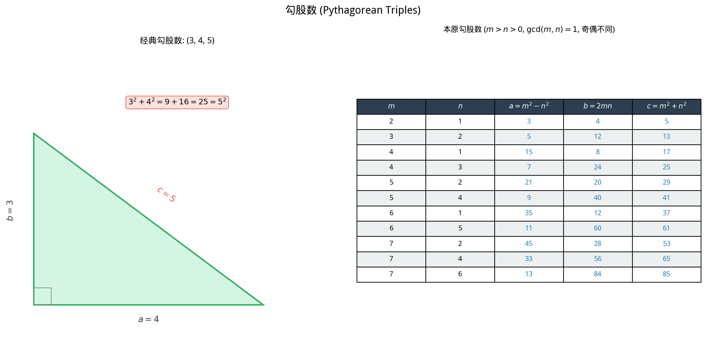

# §3 丢番图方程初步（Introduction to Diophantine Equations）

**前置知识**：[§1 整除性与质数](01-divisibility-primes.md)、[§2 同余与模运算](02-congruences.md)

**全景图**：丢番图方程（Diophantine equation）是只求**整数解**的方程，以古希腊数学家丢番图（Diophantus of Alexandria, 约 3 世纪）命名。这类方程看似简单——$3x + 5y = 1$ 有整数解吗？——但它蕴含了深刻的数论结构。本节聚焦三个主题：线性丢番图方程的可解性与通解、勾股数（Pythagorean triples）的完全参数化、以及 Fermat 的无穷递降法。这些内容综合运用了 §1 和 §2 的工具，展示了数论的力量和优美。

**预估学习时间**：约 2 小时

---

## 动机

方程 $x^2 + y^2 = z^2$ 对每个中学生都不陌生——它描述直角三角形的三边关系。但如果我们要求 $x, y, z$ 都是**正整数**呢？

$(3, 4, 5)$ 是一组解。$(5, 12, 13)$ 也是。这样的解有多少？能否找到**所有**的解？

更一般地：
- $2x + 3y = 7$ 有整数解吗？有多少组？
- $x^2 + y^2 = 3$ 有整数解吗？
- $x^n + y^n = z^n$（$n \geq 3$）呢？（这就是费马大定理！）

丢番图方程的核心困难在于：**解的存在性和结构完全取决于方程的算术性质**，不存在通用的求解方法。事实上，希尔伯特第十问题（Hilbert's tenth problem, 1900）问的就是"是否存在判定任意丢番图方程可解性的算法"，1970 年马蒂亚谢维奇（Matiyasevich）证明了答案是**否**——这是 20 世纪数学的深刻结果之一。

---

## 1. 线性丢番图方程（Linear Diophantine Equations）

### 1.1 问题设定

> **定义 1**（线性丢番图方程）
>
> 形如
>
> $$ax + by = c$$
>
> 的方程，其中 $a, b, c \in \mathbb{Z}$，$a, b$ 不全为零，要求 $x, y \in \mathbb{Z}$。

### 1.2 可解性判据

> **定理 1**（线性丢番图方程的可解性）
>
> 方程 $ax + by = c$ 有整数解 $(x, y)$ 当且仅当 $\gcd(a, b) \mid c$。

> **证明**
>
> ($\Rightarrow$) 设 $d = \gcd(a, b)$，$x_0, y_0$ 是一组解。则 $c = ax_0 + by_0$。由 $d \mid a$ 且 $d \mid b$，$d \mid (ax_0 + by_0) = c$。
>
> ($\Leftarrow$) 设 $d \mid c$，即 $c = dk$ 对某 $k \in \mathbb{Z}$。由 Bézout 等式，$d = ax_0 + by_0$ 对某 $x_0, y_0 \in \mathbb{Z}$。则 $c = dk = a(kx_0) + b(ky_0)$，故 $(kx_0, ky_0)$ 是一组解。$\blacksquare$

### 1.3 通解

> **定理 2**（线性丢番图方程的通解）
>
> 设 $d = \gcd(a, b)$ 且 $d \mid c$。设 $(x_0, y_0)$ 是 $ax + by = c$ 的一组特解。则**所有**整数解为：
>
> $$x = x_0 + \frac{b}{d} t, \quad y = y_0 - \frac{a}{d} t, \quad t \in \mathbb{Z}$$

> **证明**
>
> **这些都是解**：$a\left(x_0 + \frac{b}{d}t\right) + b\left(y_0 - \frac{a}{d}t\right) = ax_0 + by_0 + \frac{ab}{d}t - \frac{ab}{d}t = c$。✓
>
> **所有解都是这种形式**：设 $(x_1, y_1)$ 也是解。则
>
> $$a(x_1 - x_0) = -b(y_1 - y_0)$$
>
> 令 $a' = a/d$，$b' = b/d$（均为整数），$\gcd(a', b') = 1$。则
>
> $$a'(x_1 - x_0) = -b'(y_1 - y_0)$$
>
> $a' \mid b'(y_1 - y_0)$，由 $\gcd(a', b') = 1$ 和 Euclid 引理，$a' \mid (y_1 - y_0)$。设 $y_1 - y_0 = -a't$，则 $x_1 - x_0 = b't$。
>
> 即 $x_1 = x_0 + b't$，$y_1 = y_0 - a't$。$\blacksquare$

> **例 1**（求解线性丢番图方程）
>
> 求 $15x + 21y = 12$ 的所有整数解。
>
> **第一步**：$\gcd(15, 21) = 3$。$3 \mid 12$？是。故有解。
>
> **第二步**：化简。两边除以 $3$：$5x + 7y = 4$。
>
> **第三步**：求特解。用扩展欧几里得算法：$\gcd(5, 7) = 1$。
>
> $7 = 5 \times 1 + 2$
> $5 = 2 \times 2 + 1$
>
> 反推：$1 = 5 - 2 \times 2 = 5 - (7 - 5) \times 2 = 5 \times 3 - 7 \times 2$
>
> 故 $5 \times 3 + 7 \times (-2) = 1$。两边乘 $4$：$5 \times 12 + 7 \times (-8) = 4$。
>
> 特解：$(x_0, y_0) = (12, -8)$。
>
> **第四步**：通解。$a/d = 5, b/d = 7$。
>
> $$x = 12 + 7t, \quad y = -8 - 5t, \quad t \in \mathbb{Z}$$
>
> 验证（$t = -1$）：$x = 5, y = -3$，$15 \times 5 + 21 \times (-3) = 75 - 63 = 12$。✓

> **例 2**（不可解的情况）
>
> $6x + 10y = 7$ 有整数解吗？
>
> $\gcd(6, 10) = 2$，但 $2 \nmid 7$。故无整数解。
>
> 直觉：$6x + 10y$ 对任何整数 $x, y$ 都是偶数，不可能等于奇数 $7$。

---

## 2. 勾股数（Pythagorean Triples）

### 2.1 定义

> **定义 2**（勾股数，Pythagorean triple）
>
> 满足 $a^2 + b^2 = c^2$ 的正整数三元组 $(a, b, c)$ 称为**勾股数**。若 $\gcd(a, b, c) = 1$，称为**本原勾股数**（primitive Pythagorean triple）。

**例子**：$(3, 4, 5)$, $(5, 12, 13)$, $(8, 15, 17)$, $(7, 24, 25)$。

非本原的例子：$(6, 8, 10) = 2 \times (3, 4, 5)$。

### 2.2 完全参数化

> **定理 3**（勾股数的参数化）
>
> 所有本原勾股数 $(a, b, c)$（约定 $a$ 为奇，$b$ 为偶）由以下公式给出：
>
> $$a = m^2 - n^2, \quad b = 2mn, \quad c = m^2 + n^2$$
>
> 其中 $m > n > 0$，$\gcd(m, n) = 1$，且 $m, n$ 奇偶性不同。

> **证明**
>
> **第一步**：在本原勾股数中，$a$ 和 $b$ 不能同为奇数或同为偶数。
>
> 若 $a, b$ 都是偶数，则 $\gcd(a, b) \geq 2$，与本原性矛盾。
>
> 若 $a, b$ 都是奇数，则 $a^2 + b^2 \equiv 1 + 1 = 2 \pmod{4}$。但完全平方数模 $4$ 只能是 $0$ 或 $1$，所以 $c^2 \not\equiv 2 \pmod{4}$，矛盾。
>
> 故 $a, b$ 一奇一偶。约定 $a$ 奇、$b$ 偶。
>
> **第二步**：从 $a^2 + b^2 = c^2$ 推出 $b^2 = c^2 - a^2 = (c-a)(c+a)$。
>
> 因 $a$ 奇、$c$ 奇（$c^2 = a^2 + b^2$，奇 + 偶 = 奇），令 $c - a = 2s$，$c + a = 2t$（$s, t$ 为正整数）。则
>
> $$b^2 = 4st, \quad (b/2)^2 = st$$
>
> **第三步**：$\gcd(s, t) = 1$。
>
> 设 $d \mid s$ 且 $d \mid t$。则 $d \mid (t + s) = c$ 且 $d \mid (t - s) = a$。又 $d^2 \mid st = (b/2)^2$，故 $d \mid b/2$，即 $d \mid b$（若 $d$ 是奇数）或 $2d \mid b$。细节处理后，$d \mid \gcd(a, b, c) = 1$，故 $d = 1$。
>
> **第四步**：$st$ 是完全平方数，且 $\gcd(s, t) = 1$。
>
> 由算术基本定理，$s$ 和 $t$ 各自必须是完全平方数（因为它们互素，$st$ 的每个质因子只出现在 $s$ 或 $t$ 中，且在 $st$ 中出现偶数次）。
>
> 设 $s = n^2$，$t = m^2$（$m > n > 0$）。则：
>
> $$a = t - s = m^2 - n^2, \quad b = 2\sqrt{st} = 2mn, \quad c = t + s = m^2 + n^2$$
>
> $\gcd(m, n) = 1$ 且 $m, n$ 奇偶性不同（否则 $a, b, c$ 都是偶数）。
>
> **反向验证**：给定满足条件的 $m, n$，直接计算
>
> $$a^2 + b^2 = (m^2-n^2)^2 + (2mn)^2 = m^4 - 2m^2n^2 + n^4 + 4m^2n^2 = m^4 + 2m^2n^2 + n^4 = (m^2+n^2)^2 = c^2 \quad \checkmark$$
>
> $\blacksquare$

> **例 3**（生成勾股数）
>
> | $m$ | $n$ | $a = m^2 - n^2$ | $b = 2mn$ | $c = m^2 + n^2$ |
> |-----|-----|-----------------|-----------|-----------------|
> | 2   | 1   | 3               | 4         | 5               |
> | 3   | 2   | 5               | 12        | 13              |
> | 4   | 1   | 15              | 8         | 17              |
> | 4   | 3   | 7               | 24        | 25              |
> | 5   | 2   | 21              | 20        | 29              |
> | 5   | 4   | 9               | 40        | 41              |

---

## 3. Fermat 的无穷递降法（Fermat's Method of Infinite Descent）

### 3.1 基本思想

**无穷递降法**（method of infinite descent）是反证法的一种精巧变体，由皮埃尔·德·费马（Pierre de Fermat, 1601–1665）首创。

> **无穷递降法的模式**
>
> 要证明某个关于正整数的命题 $P$ 无解：
>
> 1. 假设存在正整数解
> 2. 从这个解出发，构造一个"更小"的正整数解
> 3. 从更小的解出发，再构造更小的……
> 4. 这产生了正整数的无穷递降序列，与正整数的良序性（或 $\mathbb{N}$ 没有无穷递降链）矛盾
> 5. 因此原假设不成立——无解

### 3.2 经典应用：$\sqrt{2}$ 的无理性

> **命题 1**（$\sqrt{2}$ 无理，用无穷递降法证明）
>
> $\sqrt{2}$ 不是有理数。

> **证明**
>
> 假设 $\sqrt{2} = a/b$，$a, b \in \mathbb{Z}^+$。则 $a^2 = 2b^2$，即 $a^2$ 是偶数，故 $a$ 是偶数（§1 例 6）。设 $a = 2a'$。
>
> 则 $4(a')^2 = 2b^2$，即 $b^2 = 2(a')^2$。故 $b$ 也是偶数，$b = 2b'$。
>
> 现在 $\sqrt{2} = a/b = 2a'/(2b') = a'/b'$，其中 $a' < a$ 且 $b' < b$。
>
> 从 $(a', b')$ 出发可以再做一次：得到 $(a'', b'')$，$a'' < a', b'' < b'$……
>
> 这产生了正整数的无穷递降链 $a > a' > a'' > \cdots$，矛盾。$\blacksquare$

### 3.3 应用：$x^4 + y^4 = z^2$ 无正整数解

> **定理 4**（Fermat）
>
> 方程 $x^4 + y^4 = z^2$ 没有正整数解。

> **证明**（无穷递降法，梗概）
>
> 假设 $(x, y, z)$ 是正整数解，且 $z$ 最小。不妨设 $\gcd(x, y) = 1$（否则约分）。
>
> 令 $a = x^2, b = y^2$。则 $a^2 + b^2 = z^2$，即 $(a, b, z)$ 是勾股数。由定理 3 的参数化（假设 $a$ 奇），$a = m^2 - n^2, b = 2mn, z = m^2 + n^2$，$\gcd(m,n) = 1$，$m,n$ 奇偶不同。
>
> 从 $y^2 = b = 2mn$ 和 $\gcd(m, n) = 1$，$m, n$ 一奇一偶，可推出 $m$ 和 $2n$（或 $2m$ 和 $n$）各自是完全平方数。
>
> 从 $x^2 = a = m^2 - n^2 = (m-n)(m+n)$ 和 $\gcd(m-n, m+n) = 1$（因 $\gcd(m,n)=1$ 且奇偶不同），$m-n$ 和 $m+n$ 各是完全平方数。设 $m - n = s^2, m + n = t^2$。
>
> 则 $m = (s^2 + t^2)/2$ 是完全平方数……经过仔细分析，可以得到一组新的解 $(x', y', z')$，其中 $z' \leq m < z$（因为 $m^2 < m^2 + n^2 = z$）。
>
> 这与 $z$ 的最小性矛盾。$\blacksquare$

> **推论 1**（Fermat 大定理的 $n = 4$ 情形）
>
> 方程 $x^4 + y^4 = z^4$ 没有正整数解。

> **证明**
>
> 若 $(x, y, z)$ 是 $x^4 + y^4 = z^4$ 的正整数解，则 $(x, y, z^2)$ 是 $x^4 + y^4 = z^2$ 的正整数解——但这不可能（定理 4）。$\blacksquare$

---

## 例题

> **例 4**（线性丢番图方程的应用）
>
> 一家商店只卖 $3$ 元和 $5$ 元的邮票。哪些面值可以用这两种邮票组合出来？

> **解**
>
> 需要 $3x + 5y = n$（$x, y \geq 0$）有非负整数解。
>
> $\gcd(3, 5) = 1 \mid n$，故对所有 $n$ 都有整数解。但需要**非负**解。
>
> 通解：$3 \times 2 + 5 \times (-1) = 1$，所以 $3(2n) + 5(-n) = n$。通解 $x = 2n + 5t, y = -n - 3t$。
>
> 要求 $x \geq 0, y \geq 0$：$t \geq -2n/5$ 且 $t \leq -n/3$。当 $n$ 足够大时存在这样的 $t$。
>
> 具体计算：$n = 1$：无非负解。$n = 2$：无。$n = 3$：$(1,0)$。$n = 4$：无。$n = 5$：$(0,1)$。$n = 6$：$(2,0)$。$n = 7$：无... 不对，$n = 7$：$3 \times 4 + 5 \times (-1) = 7$，不行。但 $7 = 3 \times (-1) + 5 \times 2 = -3 + 10$，所以 $x = -1$ 不行。那试 $x = 4, y = -1$ 不行。
>
> 等一下：$7 = 3 + 3 + 1$，不行。$7 = 5 + 2$，不行。$7 = 3 + 3 + 1$……所以 $n = 7$ 无非负解？
>
> 但 $8 = 3 + 5$，$(1, 1)$。$9 = 3 \times 3$。$10 = 5 \times 2$。$11 = 3 + 3 + 5$。……
>
> 对于 $n \geq 8$，总有非负解。不可表示的最大值是 $7$。一般地，$\gcd(a,b) = 1$ 时不可用 $a, b$ 的非负组合表示的最大整数是 $ab - a - b$（Sylvester-Frobenius 定理）。$3 \times 5 - 3 - 5 = 7$。✓

> **例 5**（同余方法判断丢番图方程无解）
>
> 证明 $x^2 + y^2 = 3$ 没有整数解。

> **解**
>
> 考虑模 $4$。完全平方数模 $4$ 的值：$0^2 \equiv 0, 1^2 \equiv 1, 2^2 \equiv 0, 3^2 \equiv 1$。故 $x^2 \bmod 4 \in \{0, 1\}$。
>
> $x^2 + y^2 \bmod 4 \in \{0, 1, 2\}$。但 $3 \bmod 4 = 3$。
>
> 故 $x^2 + y^2 \equiv 3 \pmod{4}$ 不可能，方程无整数解。$\blacksquare$

---

## 要点回顾

| 概念 | 核心内容 |
|------|----------|
| 线性丢番图方程 | $ax + by = c$ 有整数解 $\iff \gcd(a,b) \mid c$ |
| 通解 | $x = x_0 + (b/d)t,\; y = y_0 - (a/d)t$ |
| 勾股数 | $(a,b,c)$ 满足 $a^2+b^2=c^2$ |
| 参数化 | $a = m^2-n^2,\; b = 2mn,\; c = m^2+n^2$ |
| 无穷递降法 | 反证法变体：假设最小解存在 → 构造更小解 → 矛盾 |
| 模方法 | 用同余限制排除整数解的存在 |

---

## 进度检查点

完成本节后，你应该能够：

- [ ] 判断线性丢番图方程的可解性
- [ ] 用扩展欧几里得算法找特解，写出通解
- [ ] 陈述勾股数的参数化公式并理解证明思路
- [ ] 用参数化公式生成勾股数
- [ ] 解释无穷递降法的原理
- [ ] 用模方法证明某些丢番图方程无解

---

## 自测题

**1.** $12x + 18y = 15$ 有整数解吗？为什么？

答案

$\gcd(12, 18) = 6$，$6 \nmid 15$。故无整数解。

直觉：$12x + 18y$ 总是 $6$ 的倍数，而 $15$ 不是 $6$ 的倍数。

**2.** 求 $7x + 11y = 1$ 的所有整数解。

答案

$\gcd(7, 11) = 1 \mid 1$，有解。

$11 = 7 \times 1 + 4$，$7 = 4 \times 1 + 3$，$4 = 3 \times 1 + 1$。

反推：$1 = 4 - 3 = 4 - (7 - 4) = 2 \times 4 - 7 = 2(11 - 7) - 7 = 2 \times 11 - 3 \times 7$。

即 $7 \times (-3) + 11 \times 2 = 1$。特解 $(x_0, y_0) = (-3, 2)$。

通解：$x = -3 + 11t, y = 2 - 7t, t \in \mathbb{Z}$。

**3.** 用参数化公式，取 $m = 6, n = 1$，生成一组勾股数。

答案

$a = 36 - 1 = 35$，$b = 2 \times 6 \times 1 = 12$，$c = 36 + 1 = 37$。

验证：$35^2 + 12^2 = 1225 + 144 = 1369 = 37^2$。✓

$\gcd(6, 1) = 1$，$6$ 偶 $1$ 奇，故这是本原勾股数。

**4.** 证明 $x^2 \equiv 2 \pmod{3}$ 无解，从而 $x^2 - 3y^2 = 2$ 无整数解。

答案

$0^2 \equiv 0, 1^2 \equiv 1, 2^2 \equiv 1 \pmod{3}$。故 $x^2 \bmod 3 \in \{0, 1\}$，不能等于 $2$。

若 $x^2 - 3y^2 = 2$，则 $x^2 \equiv 2 \pmod{3}$（因 $3y^2 \equiv 0 \pmod{3}$），矛盾。

**5.** 解释为什么无穷递降法本质上是数学归纳法（或良序原理）的应用。

答案

无穷递降法假设存在最小的正整数解（由良序原理保证最小元素存在），然后构造更小的正整数解，与最小性矛盾。这等价于用强归纳法证明"对所有正整数 $n$，不存在以 $n$ 为某个参数的解"：基础情形直接验证，归纳步骤利用"更小解"的不存在性（归纳假设）。

---

## 习题

本节习题见 [练习题](exercises/exercises.md)。
