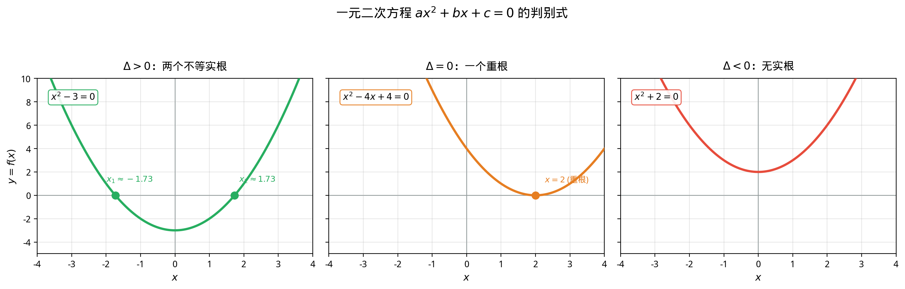

# §1 一元一次与一元二次方程（Linear and Quadratic Equations）

**前置知识**：[Part 2 第 1 章 数系](../../part-02-numbers/ch01-number-systems/README.md)（实数、复数的基本运算）、[Part 1 第 3 章 证明方法](../../part-01-foundations/ch03-proof-methods/README.md)（直接证明）

**全景图**：方程是代数的起点。一元一次方程虽然简单，但它建立了"方程求解"的基本思路和符号体系。一元二次方程则是代数史上第一个真正有深度的问题——它的求根公式（配方法）是一切高次方程求解尝试的原型，它的判别式将方程的代数性质与几何图像优雅地联系在一起，而韦达定理则揭示了"根"与"系数"之间不必经过求解就能建立的直接联系。

**预估学习时间**：约 3 小时

---

## 动机

考虑一个最基本的问题：

> "什么数乘以 $3$ 再加 $5$ 等于 $20$？"

写成数学语言：$3x + 5 = 20$。这就是一个**方程**。

方程的本质是一个**带有未知数的等式**。"解方程"就是找出使等式成立的未知数的值。这个想法简单而强大——它是代数学的核心活动。

但方程的深度远超这个简单的例子。当我们从一次方程走向二次方程 $ax^2 + bx + c = 0$ 时，新的现象出现了：

- 方程可能有**两个**解（甚至**没有**实数解）
- 解的"存在性"与方程系数之间存在精确的数量关系（判别式）
- 解与系数之间有不需要求解就能得到的关系（韦达定理）

这些现象将引导我们建立方程理论的第一批深刻结果。

---

## 1. 一元一次方程（Linear Equations in One Variable）

### 1.1 定义与求解

> **定义 1**（一元一次方程，linear equation in one variable）
>
> 形如
>
> $$ax + b = 0 \quad (a \neq 0)$$
>
> 的方程称为**一元一次方程**，其中 $a, b$ 为已知常数（$a$ 称为**系数**，$b$ 称为**常数项**），$x$ 为未知数。

求解过程直截了当：

$$ax + b = 0 \implies ax = -b \implies x = -\frac{b}{a}$$

这里用到了实数域的两个关键性质：
1. **加法逆元**：等式两边同时加 $-b$
2. **乘法逆元**：等式两边同时乘以 $a^{-1} = \frac{1}{a}$（这要求 $a \neq 0$）

### 1.2 方程求解的基本原则

上面的求解过程体现了方程变换的基本原则——**等式的性质**：

> **命题 1**（方程的等价变换）
>
> 设 $A = B$ 是一个等式，则以下变换不改变方程的解集（即产生等价方程）：
>
> 1. **加法变换**：$A + c = B + c$（等式两边加同一个数）
> 2. **乘法变换**：$cA = cB$，其中 $c \neq 0$（等式两边乘以同一个非零数）

**警告**：等式两边乘以 $0$ 会使任何等式变成 $0 = 0$，从而丢失信息。等式两边乘以包含未知数的表达式可能引入增根或丢失根。

**例题 1**. 解方程 $\frac{2x - 1}{3} = \frac{x + 2}{4}$。

**解**：等式两边乘以 $12$（$3$ 和 $4$ 的最小公倍数）：

$$4(2x - 1) = 3(x + 2)$$

$$8x - 4 = 3x + 6$$

$$5x = 10$$

$$x = 2$$

**验证**：$\frac{2(2) - 1}{3} = \frac{3}{3} = 1$，$\frac{2 + 2}{4} = \frac{4}{4} = 1$。✓

**例题 2**. 解方程 $\frac{1}{x - 1} = \frac{2}{x + 1}$。

**解**：等式两边乘以 $(x - 1)(x + 1)$（注意需要 $x \neq 1$ 且 $x \neq -1$）：

$$x + 1 = 2(x - 1)$$

$$x + 1 = 2x - 2$$

$$x = 3$$

**验证**：$\frac{1}{3 - 1} = \frac{1}{2}$，$\frac{2}{3 + 1} = \frac{2}{4} = \frac{1}{2}$。✓

### 1.3 讨论：$a = 0$ 的情况

当 $a = 0$ 时，方程 $ax + b = 0$ 退化为 $b = 0$：

- 若 $b = 0$：等式 $0 = 0$ 恒成立，方程有**无穷多解**（任何实数都是解）
- 若 $b \neq 0$：等式 $b = 0$ 矛盾，方程**无解**

这提醒我们：条件 $a \neq 0$ 不是可有可无的——它保证方程恰好有唯一解。

---

## 2. 一元二次方程（Quadratic Equations）

### 2.1 定义

> **定义 2**（一元二次方程，quadratic equation in one variable）
>
> 形如
>
> $$ax^2 + bx + c = 0 \quad (a \neq 0)$$
>
> 的方程称为**一元二次方程**，其中 $a, b, c$ 为实数常数，$a$ 称为**二次项系数**，$b$ 称为**一次项系数**，$c$ 称为**常数项**。

**为什么 $a \neq 0$？** 如果 $a = 0$，方程退化为一次方程，不再是"二次"。

### 2.2 配方法推导求根公式

配方法（completing the square）是求解二次方程的核心技术。它不仅给出了求根公式，其思想方法还将在后续的数学学习中反复出现。

**目标**：求方程 $ax^2 + bx + c = 0$（$a \neq 0$）的根。

**第 1 步**：等式两边除以 $a$（$a \neq 0$）：

$$x^2 + \frac{b}{a}x + \frac{c}{a} = 0$$

**第 2 步**：将常数项移到右边：

$$x^2 + \frac{b}{a}x = -\frac{c}{a}$$

**第 3 步**：**配方**——等式两边加上 $\left(\frac{b}{2a}\right)^2$：

$$x^2 + \frac{b}{a}x + \left(\frac{b}{2a}\right)^2 = -\frac{c}{a} + \frac{b^2}{4a^2}$$

左边恰好是完全平方：

$$\left(x + \frac{b}{2a}\right)^2 = \frac{b^2 - 4ac}{4a^2}$$

**配方的关键直觉**：对 $x^2 + px$，加上 $\left(\frac{p}{2}\right)^2$ 后得到 $\left(x + \frac{p}{2}\right)^2$。这个技巧来自恒等式 $(x + d)^2 = x^2 + 2dx + d^2$，令 $2d = p$ 即 $d = \frac{p}{2}$。

**第 4 步**：两边开方：

$$x + \frac{b}{2a} = \pm \frac{\sqrt{b^2 - 4ac}}{2|a|}$$

由于 $|a| = a$ 或 $-a$，而 $2|a|$ 出现在分母中，我们可以统一写为 $2a$（取 $\pm$ 已经覆盖了符号的讨论）：

$$x = \frac{-b \pm \sqrt{b^2 - 4ac}}{2a}$$

> **定理 1**（一元二次方程求根公式，quadratic formula）
>
> 方程 $ax^2 + bx + c = 0$（$a \neq 0$）的根为
>
> $$x = \frac{-b \pm \sqrt{b^2 - 4ac}}{2a}$$
>
> 其中 $\Delta = b^2 - 4ac$ 称为**判别式**（discriminant）。

> **证明**
>
> 如上配方法推导所示。$\blacksquare$

### 2.3 判别式 $\Delta$ 与根的分类

判别式 $\Delta = b^2 - 4ac$ 完全决定了二次方程根的性质：

> **定理 2**（判别式与根的分类）
>
> 设 $a, b, c \in \mathbb{R}$，$a \neq 0$。方程 $ax^2 + bx + c = 0$ 的根分三种情况：
>
> 1. **$\Delta > 0$**：方程有**两个不同的实数根**
>    $$x_1 = \frac{-b + \sqrt{\Delta}}{2a}, \quad x_2 = \frac{-b - \sqrt{\Delta}}{2a}$$
>
> 2. **$\Delta = 0$**：方程有**一个重根**（二重根）
>    $$x_1 = x_2 = -\frac{b}{2a}$$
>
> 3. **$\Delta < 0$**：方程**没有实数根**，但有**两个共轭复数根**
>    $$x_1 = \frac{-b + i\sqrt{|\Delta|}}{2a}, \quad x_2 = \frac{-b - i\sqrt{|\Delta|}}{2a}$$

**直觉理解**：二次方程 $ax^2 + bx + c = 0$ 的实数根就是抛物线 $y = ax^2 + bx + c$ 与 $x$ 轴的交点。

- $\Delta > 0$：抛物线与 $x$ 轴有两个交点
- $\Delta = 0$：抛物线与 $x$ 轴相切（恰好一个"触碰"点）
- $\Delta < 0$：抛物线不与 $x$ 轴相交（整条抛物线在 $x$ 轴上方或下方）

**例题 3**. 判断下列方程根的情况（不必求解）。

(a) $x^2 - 5x + 6 = 0$

$$\Delta = (-5)^2 - 4(1)(6) = 25 - 24 = 1 > 0$$

两个不同实数根。

(b) $4x^2 - 12x + 9 = 0$

$$\Delta = (-12)^2 - 4(4)(9) = 144 - 144 = 0$$

一个重根：$x = \frac{12}{8} = \frac{3}{2}$。

(c) $x^2 + x + 1 = 0$

$$\Delta = 1 - 4 = -3 < 0$$

无实数根，两个共轭复数根：$x = \frac{-1 \pm i\sqrt{3}}{2}$。

**例题 4**. 若方程 $x^2 + kx + k + 3 = 0$ 有重根，求 $k$ 的值。

**解**：重根条件为 $\Delta = 0$：

$$k^2 - 4(k + 3) = 0$$

$$k^2 - 4k - 12 = 0$$

$$(k - 6)(k + 2) = 0$$

$$k = 6 \text{ 或 } k = -2$$

**验证**：

- $k = 6$：方程 $x^2 + 6x + 9 = 0$，即 $(x + 3)^2 = 0$，重根 $x = -3$。✓
- $k = -2$：方程 $x^2 - 2x + 1 = 0$，即 $(x - 1)^2 = 0$，重根 $x = 1$。✓

### 2.4 韦达定理（Vieta's Formulas）

法国数学家弗朗索瓦·韦达（François Viète, 1540–1603）发现了方程的根与系数之间的直接关系——不需要先求出根，就能计算根的某些组合。

> **定理 3**（韦达定理，Vieta's formulas for quadratic）
>
> 设 $x_1, x_2$ 是方程 $ax^2 + bx + c = 0$（$a \neq 0$）的两个根（实数或复数），则
>
> $$x_1 + x_2 = -\frac{b}{a}$$
>
> $$x_1 \cdot x_2 = \frac{c}{a}$$

> **证明**
>
> 由求根公式：
>
> $$x_1 = \frac{-b + \sqrt{\Delta}}{2a}, \quad x_2 = \frac{-b - \sqrt{\Delta}}{2a}$$
>
> **根之和**：
>
> $$x_1 + x_2 = \frac{(-b + \sqrt{\Delta}) + (-b - \sqrt{\Delta})}{2a} = \frac{-2b}{2a} = -\frac{b}{a}$$
>
> **根之积**：
>
> $$x_1 \cdot x_2 = \frac{(-b + \sqrt{\Delta})(-b - \sqrt{\Delta})}{(2a)^2} = \frac{(-b)^2 - (\sqrt{\Delta})^2}{4a^2} = \frac{b^2 - \Delta}{4a^2}$$
>
> $$= \frac{b^2 - (b^2 - 4ac)}{4a^2} = \frac{4ac}{4a^2} = \frac{c}{a}$$
>
> $\blacksquare$

**另一种理解**：如果 $x_1, x_2$ 是 $ax^2 + bx + c = 0$ 的根，那么

$$ax^2 + bx + c = a(x - x_1)(x - x_2) = a\left[x^2 - (x_1 + x_2)x + x_1 x_2\right]$$

比较系数：$b = -a(x_1 + x_2)$，$c = a \cdot x_1 x_2$，直接得到韦达定理。

**例题 5**. 设 $x_1, x_2$ 是方程 $2x^2 - 5x + 1 = 0$ 的两个根。不解方程，求：

(a) $x_1 + x_2$
(b) $x_1 \cdot x_2$
(c) $x_1^2 + x_2^2$
(d) $\frac{1}{x_1} + \frac{1}{x_2}$

**解**：由韦达定理：$x_1 + x_2 = \frac{5}{2}$，$x_1 x_2 = \frac{1}{2}$。

(a) $x_1 + x_2 = \frac{5}{2}$

(b) $x_1 x_2 = \frac{1}{2}$

(c) $x_1^2 + x_2^2 = (x_1 + x_2)^2 - 2x_1 x_2 = \frac{25}{4} - 1 = \frac{21}{4}$

(d) $\frac{1}{x_1} + \frac{1}{x_2} = \frac{x_1 + x_2}{x_1 x_2} = \frac{5/2}{1/2} = 5$

**例题 6**. 已知两个数的和为 $7$，积为 $10$，求这两个数。

**解**：设两个数为 $x_1, x_2$。由韦达定理的逆向思维，$x_1, x_2$ 是方程

$$x^2 - 7x + 10 = 0$$

的根。解之：$(x - 2)(x - 5) = 0$，即 $x_1 = 2, x_2 = 5$（或反之）。

### 2.5 二次方程与二次函数图像的联系

一元二次方程 $ax^2 + bx + c = 0$ 与二次函数 $f(x) = ax^2 + bx + c$ 的关系是代数与几何相遇的第一个典范。

通过配方，二次函数可以写为**顶点式**：

$$f(x) = a\left(x + \frac{b}{2a}\right)^2 + c - \frac{b^2}{4a} = a\left(x + \frac{b}{2a}\right)^2 - \frac{\Delta}{4a}$$

由此可以读出抛物线的关键信息：

| 性质 | 公式 | 解读 |
|------|------|------|
| 顶点坐标 | $\left(-\frac{b}{2a},\; -\frac{\Delta}{4a}\right)$ | 抛物线的最高/低点 |
| 对称轴 | $x = -\frac{b}{2a}$ | 抛物线的对称轴正好在两根的中点 |
| 开口方向 | $a > 0$ 朝上，$a < 0$ 朝下 | 决定有最小值还是最大值 |
| 与 $x$ 轴的交点 | 由 $\Delta$ 决定 | 与判别式分析一致 |

**对称轴与韦达定理的联系**：对称轴 $x = -\frac{b}{2a} = \frac{x_1 + x_2}{2}$，即两根的算术平均值。这从几何上完全自然——抛物线关于顶点对称，两个零点自然关于对称轴对称。

**例题 7**. 研究函数 $f(x) = -2x^2 + 8x - 5$ 的图像特征。

**解**：

- $a = -2 < 0$，开口朝下
- 对称轴：$x = -\frac{8}{2(-2)} = 2$
- 顶点：$f(2) = -2(4) + 8(2) - 5 = -8 + 16 - 5 = 3$，顶点 $(2, 3)$
- 判别式：$\Delta = 64 - 40 = 24 > 0$，与 $x$ 轴有两个交点
- 两根：$x = \frac{-8 \pm \sqrt{24}}{-4} = \frac{-8 \pm 2\sqrt{6}}{-4} = 2 \mp \frac{\sqrt{6}}{2}$

即 $x_1 = 2 - \frac{\sqrt{6}}{2} \approx 0.78$，$x_2 = 2 + \frac{\sqrt{6}}{2} \approx 3.22$。两根确实关于 $x = 2$ 对称。

---

## 3. 特殊的二次方程与技巧

### 3.1 可降阶的方程

某些高次方程可以通过换元转化为二次方程：

**例题 8**. 解方程 $x^4 - 5x^2 + 4 = 0$。

**解**：令 $t = x^2$（$t \geq 0$），方程化为

$$t^2 - 5t + 4 = 0$$

$$(t - 1)(t - 4) = 0$$

$t = 1$ 或 $t = 4$。

回代：$x^2 = 1 \Rightarrow x = \pm 1$；$x^2 = 4 \Rightarrow x = \pm 2$。

方程有四个解：$x \in \{-2, -1, 1, 2\}$。

### 3.2 含参数的方程

**例题 9**. 关于 $x$ 的方程 $x^2 - 2mx + m + 2 = 0$ 有两个正实数根，求 $m$ 的取值范围。

**解**：设两根为 $x_1 > 0, x_2 > 0$。需要三个条件同时满足：

**条件 1**（实根）：$\Delta \geq 0$

$$4m^2 - 4(m + 2) \geq 0 \implies m^2 - m - 2 \geq 0 \implies (m - 2)(m + 1) \geq 0$$

$$m \leq -1 \text{ 或 } m \geq 2$$

**条件 2**（两根之和为正）：$x_1 + x_2 = 2m > 0 \implies m > 0$

**条件 3**（两根之积为正）：$x_1 x_2 = m + 2 > 0 \implies m > -2$

取三个条件的交集：$m \geq 2$。

---

## 要点回顾

1. 一元一次方程 $ax + b = 0$（$a \neq 0$）有唯一解 $x = -\frac{b}{a}$。
2. 一元二次方程 $ax^2 + bx + c = 0$（$a \neq 0$）的求根公式通过**配方法**推导：$x = \frac{-b \pm \sqrt{\Delta}}{2a}$。
3. **判别式** $\Delta = b^2 - 4ac$ 决定根的类型：$\Delta > 0$（两个不同实根）、$\Delta = 0$（重根）、$\Delta < 0$（共轭复数根）。
4. **韦达定理**：$x_1 + x_2 = -\frac{b}{a}$，$x_1 x_2 = \frac{c}{a}$，建立了根与系数的直接联系。
5. 二次方程与二次函数 $y = ax^2 + bx + c$ 的图像紧密关联——方程的根就是抛物线的零点。
6. 配方法同时给出了抛物线的**顶点式** $y = a(x - h)^2 + k$。

---

## 进度检查点

在继续之前，确认你能够：

- [ ] 不查公式，独立推导一元二次方程的求根公式
- [ ] 快速计算判别式并判断根的类型
- [ ] 利用韦达定理计算根的对称函数（如 $x_1^2 + x_2^2$）
- [ ] 将二次函数化为顶点式并描述图像特征
- [ ] 解含参数的二次方程，确定参数的取值范围

---

## 自测题

**自测题 1**：求方程 $3x^2 - 7x + 2 = 0$ 的解。

答案

$$\Delta = 49 - 24 = 25$$

$$x = \frac{7 \pm 5}{6}$$

$x_1 = \frac{7 + 5}{6} = 2$，$x_2 = \frac{7 - 5}{6} = \frac{1}{3}$。

验证（韦达定理）：$x_1 + x_2 = 2 + \frac{1}{3} = \frac{7}{3} = -\frac{-7}{3}$ ✓，$x_1 x_2 = \frac{2}{3}$ ✓。

**自测题 2**：不解方程，求方程 $x^2 + 3x - 5 = 0$ 两根的平方和 $x_1^2 + x_2^2$。

答案

由韦达定理：$x_1 + x_2 = -3$，$x_1 x_2 = -5$。

$$x_1^2 + x_2^2 = (x_1 + x_2)^2 - 2x_1 x_2 = 9 - 2(-5) = 9 + 10 = 19$$

**自测题 3**：若方程 $x^2 + bx + 3 = 0$ 的一个根是 $x = 1$，求另一个根和 $b$ 的值。

答案

将 $x = 1$ 代入：$1 + b + 3 = 0$，得 $b = -4$。

由韦达定理：$x_1 \cdot x_2 = 3$，所以另一个根 $x_2 = \frac{3}{1} = 3$。

验证：$x_1 + x_2 = 1 + 3 = 4 = -\frac{-4}{1}$ ✓。

**自测题 4**：将 $f(x) = 2x^2 - 12x + 22$ 化为顶点式，并求顶点坐标。

答案

$$f(x) = 2(x^2 - 6x) + 22 = 2(x^2 - 6x + 9 - 9) + 22 = 2(x - 3)^2 - 18 + 22 = 2(x - 3)^2 + 4$$

顶点 $(3, 4)$。

$\Delta = 144 - 176 = -32 < 0$，所以抛物线不与 $x$ 轴相交，$f(x)$ 的最小值为 $4$。

---

## 习题引用

完成本节学习后，请前往 [练习题](exercises/exercises.md) 的 §1 部分进行练习。
