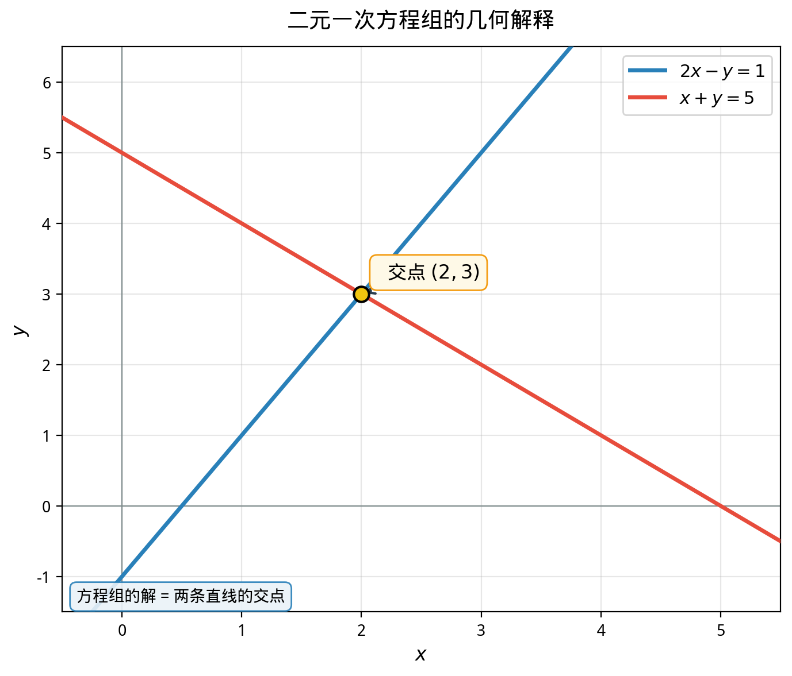

# §2 方程组（Systems of Equations）

**前置知识**：[§1 一元一次与一元二次方程](01-linear-quadratic.md)（一元方程的求解方法）、[Part 1 第 2 章 集合论](../../part-01-foundations/ch02-sets/README.md)（有序对的概念）

**全景图**：现实世界中的问题很少只涉及一个未知量。当有多个未知量和多个约束条件时，我们就需要同时解多个方程——这就是方程组。本节从 $2 \times 2$ 线性方程组的两种经典解法出发，揭示方程组求解背后的几何图像（直线的交点），然后推广到 $3 \times 3$ 系统（平面的交线和交点），最后简要讨论非线性方程组。这里的几何直觉将为后续的线性代数（Part 9）建立重要的空间想象力。

**预估学习时间**：约 2–3 小时

---

## 动机

一个典型的实际问题：

> 一个农场有鸡和兔共 $35$ 只，脚共 $94$ 只。鸡和兔各有多少只？

设鸡 $x$ 只，兔 $y$ 只。由题意：

$$\begin{cases} x + y = 35 \\ 2x + 4y = 94 \end{cases}$$

一个方程不够——它只给出一个约束，而我们有两个未知数。两个方程（两个约束）共同确定了 $x$ 和 $y$ 的值。这就是**方程组**的核心思想：用多个等式共同约束多个未知数。

**几何视角**：每个方程 $ax + by = c$ 在平面上定义一条直线。两个方程的公共解就是两条直线的**交点**。

---

## 1. $2 \times 2$ 线性方程组

### 1.1 一般形式

> **定义 1**（二元一次方程组，system of two linear equations in two unknowns）
>
> 形如
>
> $$\begin{cases} a_1 x + b_1 y = c_1 \\ a_2 x + b_2 y = c_2 \end{cases}$$
>
> 的方程组称为**二元一次方程组**，其中 $a_i, b_i, c_i$（$i = 1, 2$）为实数常数，$x, y$ 为未知数。

### 1.2 代入法（Substitution Method）

**思路**：从一个方程中用一个未知数表示另一个，代入第二个方程，化为一元方程。

**例题 1**. 解方程组

$$\begin{cases} x + y = 35 \\ 2x + 4y = 94 \end{cases}$$

**解**：

从第一个方程：$x = 35 - y$。

代入第二个方程：$2(35 - y) + 4y = 94$

$$70 - 2y + 4y = 94$$

$$2y = 24$$

$$y = 12$$

回代：$x = 35 - 12 = 23$。

**解**：$x = 23$（鸡），$y = 12$（兔）。

**验证**：$23 + 12 = 35$ ✓，$2(23) + 4(12) = 46 + 48 = 94$ ✓。

### 1.3 消元法（Elimination Method）

**思路**：将两个方程适当加减，消去一个未知数。

**例题 2**. 解方程组

$$\begin{cases} 3x + 2y = 16 \\ 5x - 2y = 8 \end{cases}$$

**解**：两方程相加（消去 $y$）：

$$8x = 24 \implies x = 3$$

代入第一个方程：$9 + 2y = 16 \implies y = \frac{7}{2}$。

**解**：$x = 3$，$y = \frac{7}{2}$。

**例题 3**. 解方程组

$$\begin{cases} 2x + 3y = 7 \\ 3x + 5y = 11 \end{cases}$$

**解**：为消去 $x$，第一个方程乘以 $3$，第二个乘以 $2$，然后相减：

$$\begin{cases} 6x + 9y = 21 \\ 6x + 10y = 22 \end{cases}$$

相减：$-y = -1$，即 $y = 1$。

代入：$2x + 3 = 7$，$x = 2$。

**解**：$x = 2$，$y = 1$。

### 1.4 几何解释——直线的交点

每个二元一次方程 $ax + by = c$（$a, b$ 不全为零）在 $xy$ 平面上定义一条直线。方程组的解就是两条直线的交点。

三种几何情况对应三种代数结果：

| 几何情况 | 代数条件 | 解的数目 |
|----------|----------|----------|
| 两直线**相交**于一点 | $\frac{a_1}{a_2} \neq \frac{b_1}{b_2}$ | **唯一解** |
| 两直线**平行**（不重合） | $\frac{a_1}{a_2} = \frac{b_1}{b_2} \neq \frac{c_1}{c_2}$ | **无解** |
| 两直线**重合** | $\frac{a_1}{a_2} = \frac{b_1}{b_2} = \frac{c_1}{c_2}$ | **无穷多解** |

> **定理 1**（$2 \times 2$ 线性方程组的解的判定）
>
> 设 $D = a_1 b_2 - a_2 b_1$（称为方程组的**行列式**，determinant）。
>
> 1. 若 $D \neq 0$，方程组有**唯一解**：
>    $$x = \frac{c_1 b_2 - c_2 b_1}{D}, \quad y = \frac{a_1 c_2 - a_2 c_1}{D}$$
>
> 2. 若 $D = 0$，方程组**无解或有无穷多解**（视常数项而定）。

> **证明**
>
> 用消元法。将第一个方程乘以 $b_2$，第二个乘以 $b_1$：
>
> $$\begin{cases} a_1 b_2 x + b_1 b_2 y = c_1 b_2 \\ a_2 b_1 x + b_1 b_2 y = c_2 b_1 \end{cases}$$
>
> 相减：$(a_1 b_2 - a_2 b_1)x = c_1 b_2 - c_2 b_1$，即 $Dx = c_1 b_2 - c_2 b_1$。
>
> 若 $D \neq 0$，$x = \frac{c_1 b_2 - c_2 b_1}{D}$。类似地可求 $y$。
>
> 若 $D = 0$，则 $x$ 无法唯一确定——此时两方程"不独立"。 $\blacksquare$

这个行列式 $D = a_1 b_2 - a_2 b_1$ 有一个更系统的表记方式：

$$D = \begin{vmatrix} a_1 & b_1 \\ a_2 & b_2 \end{vmatrix} = a_1 b_2 - a_2 b_1$$

这是**行列式**（determinant）的概念，将在线性代数（Part 9）中系统学习。

**例题 4**. 判断下列方程组解的情况：

$$\begin{cases} 2x + 6y = 10 \\ x + 3y = 4 \end{cases}$$

**解**：$D = 2 \times 3 - 1 \times 6 = 0$。

$\frac{a_1}{a_2} = \frac{2}{1} = 2$，$\frac{b_1}{b_2} = \frac{6}{3} = 2$，$\frac{c_1}{c_2} = \frac{10}{4} = \frac{5}{2} \neq 2$。

两直线平行不重合，方程组**无解**。

---

## 2. $3 \times 3$ 线性方程组

### 2.1 一般形式

> **定义 2**（三元一次方程组）
>
> 形如
>
> $$\begin{cases} a_1 x + b_1 y + c_1 z = d_1 \\ a_2 x + b_2 y + c_2 z = d_2 \\ a_3 x + b_3 y + c_3 z = d_3 \end{cases}$$
>
> 的方程组称为**三元一次方程组**。

### 2.2 消元法解三元方程组

核心思路不变——逐步消元，将三元化为二元，再化为一元。

**例题 5**. 解方程组

$$\begin{cases} x + y + z = 6 \\ 2x - y + z = 3 \\ x + 2y - z = 5 \end{cases}$$

**解**：

**第 1 步**：消去 $z$。

方程 (1) + 方程 (3)：$2x + 3y = 11$ …… (4)

方程 (2) + 方程 (3)：$3x + y = 8$ …… (5)

**第 2 步**：从 (4) 和 (5) 消去 $y$。

方程 (5) $\times 3$：$9x + 3y = 24$

(5)$\times 3$ $-$ (4)：$7x = 13$，$x = \frac{13}{7}$。

代入 (5)：$y = 8 - 3 \times \frac{13}{7} = \frac{56 - 39}{7} = \frac{17}{7}$。

代入 (1)：$z = 6 - \frac{13}{7} - \frac{17}{7} = \frac{42 - 13 - 17}{7} = \frac{12}{7}$。

**解**：$x = \frac{13}{7}$，$y = \frac{17}{7}$，$z = \frac{12}{7}$。

**验证**：

- $\frac{13}{7} + \frac{17}{7} + \frac{12}{7} = \frac{42}{7} = 6$ ✓
- $\frac{26}{7} - \frac{17}{7} + \frac{12}{7} = \frac{21}{7} = 3$ ✓
- $\frac{13}{7} + \frac{34}{7} - \frac{12}{7} = \frac{35}{7} = 5$ ✓

### 2.3 几何解释——平面的交

在三维空间中，每个三元一次方程 $ax + by + cz = d$ 定义一个**平面**。三个方程定义三个平面。方程组的解就是三个平面的公共点。

可能出现的几何情况：

| 几何情况 | 解的数目 |
|----------|----------|
| 三个平面交于**一点** | **唯一解** |
| 三个平面交于**一条直线** | **无穷多解**（一个自由参数） |
| 三个平面**共面** | **无穷多解**（两个自由参数） |
| 平面平行或其他退化情况 | **无解** |

**例题 6**. 分析方程组

$$\begin{cases} x + y + z = 1 \\ 2x + 2y + 2z = 3 \end{cases}$$

**解**：第二个方程是第一个的 $2$ 倍，但右边 $3 \neq 2 \times 1$。这意味着两个平面平行不重合，方程组**无解**。

---

## 3. 非线性方程组简介

当方程组中至少有一个方程是非线性的（即含有未知数的高次项、乘积项等），就构成**非线性方程组**。

非线性方程组没有像线性方程组那样的统一理论，但代入法和消元法仍然是基本工具。

**例题 7**. 解方程组

$$\begin{cases} x + y = 5 \\ xy = 6 \end{cases}$$

**解**：由韦达定理（§1 定理 3），$x$ 和 $y$ 是方程 $t^2 - 5t + 6 = 0$ 的两个根。

$$t^2 - 5t + 6 = (t - 2)(t - 3) = 0$$

$$\{x, y\} = \{2, 3\}$$

即 $(x, y) = (2, 3)$ 或 $(x, y) = (3, 2)$。

**例题 8**. 解方程组

$$\begin{cases} x^2 + y^2 = 25 \\ x - y = 1 \end{cases}$$

**解**：从第二个方程：$x = y + 1$。代入第一个方程：

$$(y + 1)^2 + y^2 = 25$$

$$y^2 + 2y + 1 + y^2 = 25$$

$$2y^2 + 2y - 24 = 0$$

$$y^2 + y - 12 = 0$$

$$(y + 4)(y - 3) = 0$$

$y = -4$ 或 $y = 3$。

对应 $x = -3$ 或 $x = 4$。

**解**：$(x, y) = (-3, -4)$ 或 $(x, y) = (4, 3)$。

**几何解释**：第一个方程是圆心在原点、半径为 $5$ 的圆；第二个方程是斜率为 $1$ 的直线。直线与圆的两个交点就是方程组的解。

**例题 9**. 解方程组

$$\begin{cases} x^2 + y^2 = 10 \\ x^2 - y^2 = 6 \end{cases}$$

**解**：两式相加：$2x^2 = 16$，$x^2 = 8$，$x = \pm 2\sqrt{2}$。

两式相减：$2y^2 = 4$，$y^2 = 2$，$y = \pm \sqrt{2}$。

由于 $x, y$ 的选取是独立的（$x^2$ 和 $y^2$ 已经确定），**四组解**均满足方程：

$$(x, y) \in \{(2\sqrt{2}, \sqrt{2}),\; (2\sqrt{2}, -\sqrt{2}),\; (-2\sqrt{2}, \sqrt{2}),\; (-2\sqrt{2}, -\sqrt{2})\}$$

---

## 要点回顾

1. 二元一次方程组的两种基本解法：**代入法**和**消元法**。
2. 行列式 $D = a_1 b_2 - a_2 b_1$ 决定 $2 \times 2$ 线性方程组解的存在唯一性：$D \neq 0$ 时有唯一解。
3. **几何解释**：$2 \times 2$ 系统对应两条直线的交点，$3 \times 3$ 系统对应三个平面的交点。
4. 三种解的情况：唯一解（相交）、无解（平行）、无穷多解（重合/共线）。
5. 非线性方程组没有统一理论，但代入法和韦达定理是常用工具。

---

## 进度检查点

在继续之前，确认你能够：

- [ ] 用代入法和消元法求解 $2 \times 2$ 线性方程组
- [ ] 计算行列式 $D$ 并判断方程组解的情况
- [ ] 画出方程组的几何图像（两条直线），从图形判断解的个数
- [ ] 用消元法逐步求解 $3 \times 3$ 线性方程组
- [ ] 对简单的非线性方程组选择合适的解法

---

## 自测题

**自测题 1**：解方程组 $\begin{cases} 3x - y = 7 \\ x + 2y = 0 \end{cases}$

答案

从第二个方程：$x = -2y$。代入第一个：$3(-2y) - y = 7$，$-7y = 7$，$y = -1$。

$x = -2(-1) = 2$。

**解**：$(x, y) = (2, -1)$。

验证：$3(2) - (-1) = 7$ ✓，$2 + 2(-1) = 0$ ✓。

**自测题 2**：判断方程组 $\begin{cases} 4x - 6y = 10 \\ -2x + 3y = -5 \end{cases}$ 的解的情况。

答案

$D = 4 \times 3 - (-2) \times (-6) = 12 - 12 = 0$。

第二个方程乘以 $-2$：$4x - 6y = 10$，与第一个方程完全相同。

两直线**重合**，方程组有**无穷多解**。解集为 $\{(x, y) : 2x - 3y = 5\}$，可参数化为 $x = \frac{5 + 3t}{2}$，$y = t$（$t \in \mathbb{R}$）。

**自测题 3**：解方程组 $\begin{cases} x + y = 7 \\ x^2 + y^2 = 29 \end{cases}$

答案

由 $x + y = 7$：$(x + y)^2 = 49$，即 $x^2 + 2xy + y^2 = 49$。

所以 $xy = \frac{49 - 29}{2} = 10$。

$x, y$ 是 $t^2 - 7t + 10 = 0$ 的根：$(t - 2)(t - 5) = 0$。

$(x, y) = (2, 5)$ 或 $(x, y) = (5, 2)$。

---

## 习题引用

完成本节学习后，请前往 [练习题](exercises/exercises.md) 的 §2 部分进行练习。
