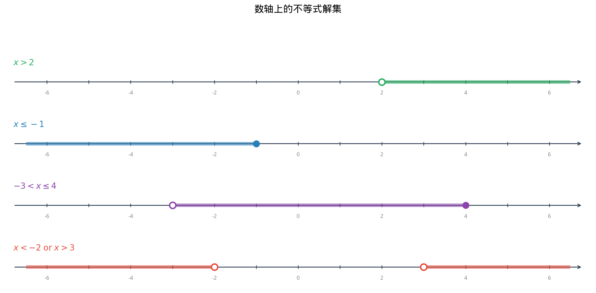
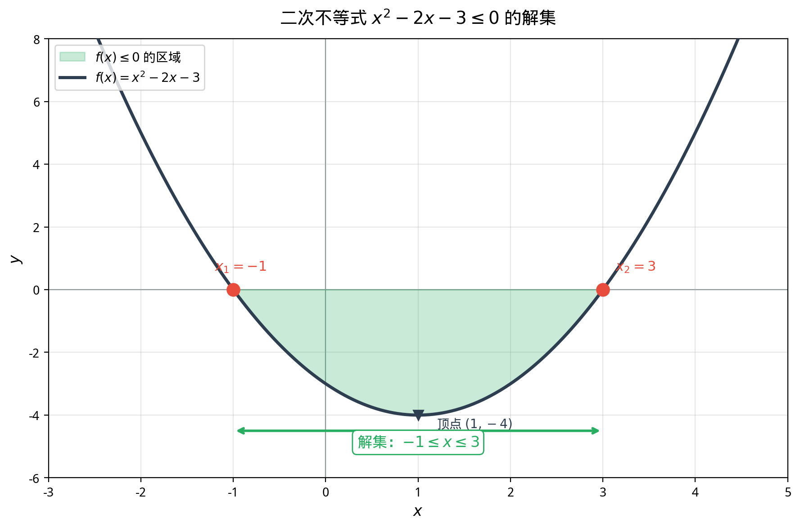

# §1 基本不等式（Basic Inequalities）

**前置知识**：[Part 2 第 1 章 数系](../../part-02-numbers/ch01-number-systems/README.md)（实数的有序性）、[Part 3 第 1 章 §1](../ch01-equations/01-linear-quadratic.md)（二次方程与判别式）

**全景图**：不等式是数学中"估计"的语言。从最简单的 $a < b$ 出发，我们将建立一套系统的不等式求解和证明方法。线性不等式在数轴上有直观的图示；二次不等式需要分析抛物线的开口方向和零点；绝对值不等式将"距离"的概念引入代数；三角不等式则是度量空间中最基本的公理之一。这些工具将在后续的分析学准备（Part 6）中大量使用。

**预估学习时间**：约 3–4 小时

---

## 动机

方程 $2x + 1 = 7$ 的解是一个点：$x = 3$。

不等式 $2x + 1 < 7$ 的解是一个区间：$x < 3$，即 $(-\infty, 3)$。

从"点"到"区间"，从"精确"到"范围"——这就是不等式相比方程的本质变化。

在实际问题中，精确解往往是奢望，而范围估计通常就已足够：

- "这个函数在 $[0, 1]$ 上有界"
- "误差不超过 $10^{-6}$"
- "利润至少为正"

所有这些陈述的数学语言都是不等式。

---

## 1. 不等式的基本性质（Properties of Inequalities）

### 1.1 有序域中的序

实数集 $\mathbb{R}$ 是一个**有序域**（ordered field）。序关系 $<$（或 $\leq$）满足以下基本性质：

> **命题 1**（不等式的基本性质）
>
> 设 $a, b, c \in \mathbb{R}$，则：
>
> 1. **三歧性**（trichotomy）：恰好有一个成立：$a < b$，$a = b$，$a > b$
> 2. **传递性**（transitivity）：若 $a < b$ 且 $b < c$，则 $a < c$
> 3. **加法保序**（addition preserves order）：若 $a < b$，则 $a + c < b + c$
> 4. **正数乘法保序**：若 $a < b$ 且 $c > 0$，则 $ac < bc$
> 5. **负数乘法反序**：若 $a < b$ 且 $c < 0$，则 $ac > bc$

**关键要点**：性质 5 是不等式与等式最重要的区别之一——**乘以负数要变号**。忘记这一点是不等式计算中最常见的错误。

**直接推论**：

- 若 $a < b$，则 $-a > -b$（两边乘以 $-1$）
- 若 $a > 0$ 且 $b > 0$，则 $a < b \iff \frac{1}{a} > \frac{1}{b}$（正数取倒数反序）
- 若 $a < b$ 且 $c < d$，则 $a + c < b + d$（同向不等式可以相加，但一般**不能**相减）

> **警告**
>
> 同向不等式**不能相减**！例如 $5 < 10$ 且 $3 < 7$，但 $5 - 7 = -2 < 10 - 3 = 7$ 虽然碰巧成立，$5 - 3 = 2 < 10 - 7 = 3$ 也恰好成立，但 $a - d$ 与 $b - c$ 的大小关系并不能从 $a < b$、$c < d$ 直接推出。

---

## 2. 一元一次不等式（Linear Inequalities）

### 2.1 求解方法

> **定义 1**（一元一次不等式，linear inequality in one variable）
>
> 形如 $ax + b > 0$（或 $\geq, <, \leq$）的不等式，其中 $a \neq 0$。

求解过程与一元一次方程类似，但注意乘以负数时要变号：

**情况 1**：$a > 0$

$$ax + b > 0 \implies ax > -b \implies x > -\frac{b}{a}$$

**情况 2**：$a < 0$

$$ax + b > 0 \implies ax > -b \implies x < -\frac{b}{a}$$

（注意不等号反向！）

**例题 1**. 解不等式 $3 - 2x \geq 5x + 10$。

**解**：

$$3 - 2x \geq 5x + 10$$

$$-7x \geq 7$$

$$x \leq -1$$

解集为 $(-\infty, -1]$。

### 2.2 联立不等式

**例题 2**. 解联立不等式 $\begin{cases} 2x + 1 > 3 \\ 5 - x \geq 1 \end{cases}$

**解**：

第一个不等式：$x > 1$

第二个不等式：$x \leq 4$

两个条件的交集：$1 < x \leq 4$，即 $(1, 4]$。

---

## 3. 一元二次不等式（Quadratic Inequalities）

### 3.1 符号分析法

一元二次不等式 $ax^2 + bx + c > 0$（$a \neq 0$）的解法，关键是将二次表达式**因式分解**，然后分析各因式的符号。

**求解步骤**：

1. 求方程 $ax^2 + bx + c = 0$ 的根（判别式 $\Delta$）
2. 将二次表达式因式分解（或写为顶点式）
3. 在数轴上标出根，分析各区间的符号
4. 根据不等式方向选择满足条件的区间

> **命题 2**（二次不等式的解集，$a > 0$ 的情况）
>
> 设 $f(x) = a(x - x_1)(x - x_2)$（$a > 0$，$x_1 < x_2$），则：
>
> - $f(x) > 0$ 的解集：$(-\infty, x_1) \cup (x_2, +\infty)$
> - $f(x) < 0$ 的解集：$(x_1, x_2)$
> - $f(x) \geq 0$ 的解集：$(-\infty, x_1] \cup [x_2, +\infty)$
> - $f(x) \leq 0$ 的解集：$[x_1, x_2]$
>
> 当 $a < 0$ 时，不等号方向反转。

**记忆口诀**：对 $a > 0$ 的抛物线——"大于零取两边，小于零取中间"。

**例题 3**. 解不等式 $x^2 - 5x + 6 < 0$。

**解**：因式分解：$(x - 2)(x - 3) < 0$。

两个根 $x_1 = 2, x_2 = 3$。$a = 1 > 0$（抛物线开口朝上）。

"小于零取中间"：解集为 $(2, 3)$。

**例题 4**. 解不等式 $-2x^2 + x + 3 \geq 0$。

**解**：先乘以 $-1$（变号）：$2x^2 - x - 3 \leq 0$。

$\Delta = 1 + 24 = 25$，根：$x = \frac{1 \pm 5}{4}$，即 $x_1 = -1, x_2 = \frac{3}{2}$。

$a = 2 > 0$，"小于等于零取中间"：解集为 $\left[-1, \frac{3}{2}\right]$。

### 3.2 特殊情况：$\Delta \leq 0$

**例题 5**. 解不等式 $x^2 + 2x + 5 > 0$。

**解**：$\Delta = 4 - 20 = -16 < 0$，无实根。

配方：$x^2 + 2x + 5 = (x + 1)^2 + 4 \geq 4 > 0$。

对所有实数 $x$ 成立。解集为 $\mathbb{R}$（即 $(-\infty, +\infty)$）。

> **命题 3**（恒正/恒负条件）
>
> 设 $f(x) = ax^2 + bx + c$（$a \neq 0$），则：
>
> - $f(x) > 0$ 对一切 $x \in \mathbb{R}$ 成立 $\iff$ $a > 0$ 且 $\Delta < 0$
> - $f(x) < 0$ 对一切 $x \in \mathbb{R}$ 成立 $\iff$ $a < 0$ 且 $\Delta < 0$

---

## 4. 绝对值不等式（Absolute Value Inequalities）

### 4.1 绝对值的定义回顾

回忆绝对值的定义：

$$|x| = \begin{cases} x & \text{if } x \geq 0 \\ -x & \text{if } x < 0 \end{cases}$$

几何意义：$|x|$ 是数轴上 $x$ 到原点的**距离**。更一般地，$|x - a|$ 是 $x$ 到 $a$ 的距离。

### 4.2 基本绝对值不等式

> **定理 1**（绝对值不等式的等价形式）
>
> 设 $r > 0$，则：
>
> 1. $|x - a| < r \iff a - r < x < a + r$
> 2. $|x - a| > r \iff x < a - r \text{ 或 } x > a + r$
> 3. $|x - a| \leq r \iff a - r \leq x \leq a + r$

**几何直觉**：$|x - a| < r$ 表示"$x$ 到 $a$ 的距离小于 $r$"，即 $x$ 在以 $a$ 为中心、$r$ 为半径的开区间 $(a-r, a+r)$ 内。

> **证明**（定理 1 的第 1 部分）
>
> $|x - a| < r$
>
> $\iff -r < x - a < r$（绝对值的定义）
>
> $\iff a - r < x < a + r$（各部分加 $a$）$\blacksquare$

**例题 6**. 解不等式 $|2x - 3| \leq 5$。

**解**：

$$-5 \leq 2x - 3 \leq 5$$

$$-2 \leq 2x \leq 8$$

$$-1 \leq x \leq 4$$

解集为 $[-1, 4]$。

**例题 7**. 解不等式 $|x + 1| > 3$。

**解**：$|x - (-1)| > 3$，即 $x$ 到 $-1$ 的距离大于 $3$。

$$x < -1 - 3 = -4 \quad \text{或} \quad x > -1 + 3 = 2$$

解集为 $(-\infty, -4) \cup (2, +\infty)$。

**例题 8**. 解不等式 $|3x - 1| < |x + 5|$。

**解**：两边平方（两边均非负，平方保持不等式方向）：

$$(3x - 1)^2 < (x + 5)^2$$

$$9x^2 - 6x + 1 < x^2 + 10x + 25$$

$$8x^2 - 16x - 24 < 0$$

$$x^2 - 2x - 3 < 0$$

$$(x - 3)(x + 1) < 0$$

解集为 $(-1, 3)$。

### 4.3 三角不等式（Triangle Inequality）

三角不等式是实数理论中最基本、最重要的不等式之一。

> **定理 2**（三角不等式，triangle inequality）
>
> 对任意 $a, b \in \mathbb{R}$：
>
> $$|a + b| \leq |a| + |b|$$
>
> 等号成立当且仅当 $a$ 和 $b$ 同号（或至少一个为零），即 $ab \geq 0$。

> **证明**
>
> 由 $-|a| \leq a \leq |a|$ 和 $-|b| \leq b \leq |b|$，相加得：
>
> $$-(|a| + |b|) \leq a + b \leq |a| + |b|$$
>
> 这恰好是 $|a + b| \leq |a| + |b|$。
>
> 等号条件：$|a + b| = |a| + |b|$ 当且仅当 $a$ 和 $b$ "同方向"——即 $a \geq 0, b \geq 0$ 或 $a \leq 0, b \leq 0$，等价于 $ab \geq 0$。$\blacksquare$

**名称由来**：在几何中，三角形任意一边的长度不超过其他两边之和。若将 $|a|$、$|b|$、$|a+b|$ 看作三角形的三边（在退化情况下三点共线），三角不等式正是这个几何事实的代数表述。

> **推论 1**（三角不等式的推广）
>
> 对任意 $a_1, a_2, \ldots, a_n \in \mathbb{R}$：
>
> $$|a_1 + a_2 + \cdots + a_n| \leq |a_1| + |a_2| + \cdots + |a_n|$$

> **证明**
>
> 对 $n$ 进行归纳。$n = 2$ 就是三角不等式本身。归纳步骤：
>
> $$|a_1 + \cdots + a_n + a_{n+1}| \leq |a_1 + \cdots + a_n| + |a_{n+1}| \leq (|a_1| + \cdots + |a_n|) + |a_{n+1}|$$
>
> $\blacksquare$

> **推论 2**（反三角不等式）
>
> 对任意 $a, b \in \mathbb{R}$：
>
> $$\big||a| - |b|\big| \leq |a - b|$$

> **证明**
>
> 由三角不等式：$|a| = |(a - b) + b| \leq |a - b| + |b|$，所以 $|a| - |b| \leq |a - b|$。
>
> 同理：$|b| - |a| \leq |b - a| = |a - b|$。
>
> 因此 $\big||a| - |b|\big| \leq |a - b|$。$\blacksquare$

**例题 9**. 已知 $|x - 2| < 0.1$，估计 $|x^2 - 4|$ 的范围。

**解**：$|x^2 - 4| = |x - 2| \cdot |x + 2|$。

由 $|x - 2| < 0.1$ 和反三角不等式：$|x| \leq |x - 2| + 2 < 2.1$。

所以 $|x + 2| \leq |x| + 2 < 4.1$。

因此 $|x^2 - 4| < 0.1 \times 4.1 = 0.41$。

---

## 5. 不等式证明的基本方法

### 5.1 利用平方非负性

> **引理**（基本不等式的根源）
>
> 对任意实数 $x$，$x^2 \geq 0$。等号当且仅当 $x = 0$。

这个看似平凡的事实是几乎所有经典不等式的起点。

**例题 10**. 证明：对任意 $a, b \in \mathbb{R}$，$a^2 + b^2 \geq 2ab$。

**证明**：$(a - b)^2 \geq 0$，展开得 $a^2 - 2ab + b^2 \geq 0$，即 $a^2 + b^2 \geq 2ab$。$\blacksquare$

### 5.2 作差法

要证明 $A \geq B$，等价于证明 $A - B \geq 0$。

**例题 11**. 设 $a, b > 0$，证明 $\frac{a}{b} + \frac{b}{a} \geq 2$。

**证明**：

$$\frac{a}{b} + \frac{b}{a} - 2 = \frac{a^2 + b^2 - 2ab}{ab} = \frac{(a - b)^2}{ab} \geq 0$$

最后一步用到 $ab > 0$（$a, b > 0$）。等号成立当且仅当 $a = b$。$\blacksquare$

---

## 要点回顾

1. 不等式的核心性质：**传递性**、**加法保序**、**正数乘法保序、负数乘法反序**。
2. 一元二次不等式通过**因式分解 + 符号分析**（或画抛物线）求解；口诀"大于零取两边，小于零取中间"（$a > 0$ 时）。
3. $|x - a| < r \iff a - r < x < a + r$——绝对值不等式的核心等价形式。
4. **三角不等式** $|a + b| \leq |a| + |b|$ 是分析学中最基本的工具之一。
5. **反三角不等式** $\big||a| - |b|\big| \leq |a - b|$ 是三角不等式的"反面"。
6. **平方非负性** $x^2 \geq 0$ 是几乎所有经典不等式的根源。

---

## 进度检查点

在继续之前，确认你能够：

- [ ] 解一元一次和一元二次不等式，并用区间表示解集
- [ ] 将绝对值不等式转化为等价的复合不等式
- [ ] 陈述并证明三角不等式
- [ ] 用平方非负性或作差法证明简单不等式
- [ ] 解释三角不等式名称的几何由来

---

## 自测题

**自测题 1**：解不等式 $x^2 - 4x - 5 > 0$。

答案

因式分解：$(x - 5)(x + 1) > 0$。

两根 $x_1 = -1, x_2 = 5$。$a = 1 > 0$（"大于零取两边"）。

解集：$(-\infty, -1) \cup (5, +\infty)$。

**自测题 2**：解不等式 $|4x - 3| \leq 9$。

答案

$$-9 \leq 4x - 3 \leq 9$$

$$-6 \leq 4x \leq 12$$

$$-\frac{3}{2} \leq x \leq 3$$

解集：$\left[-\frac{3}{2}, 3\right]$。

**自测题 3**：证明对任意实数 $x, y, z$：$x^2 + y^2 + z^2 \geq xy + yz + zx$。

答案

用作差法。

$x^2 + y^2 + z^2 - xy - yz - zx = \frac{1}{2}\left[(x-y)^2 + (y-z)^2 + (z-x)^2\right] \geq 0$。

等号成立当且仅当 $x = y = z$。

验证恒等式：$\frac{1}{2}[(x-y)^2 + (y-z)^2 + (z-x)^2]$

$= \frac{1}{2}[x^2 - 2xy + y^2 + y^2 - 2yz + z^2 + z^2 - 2zx + x^2]$

$= \frac{1}{2}[2x^2 + 2y^2 + 2z^2 - 2xy - 2yz - 2zx]$

$= x^2 + y^2 + z^2 - xy - yz - zx$。✓

**自测题 4**：若 $|x - 3| < 1$，求 $|x^2 - 9|$ 的上界。

答案

$|x^2 - 9| = |x - 3| \cdot |x + 3|$。

由 $|x - 3| < 1$：$2 < x < 4$，所以 $5 < x + 3 < 7$，$|x + 3| < 7$。

因此 $|x^2 - 9| < 1 \times 7 = 7$。

---

## 习题引用

完成本节学习后，请前往 [练习题](exercises/exercises.md) 的 §1 部分进行练习。
