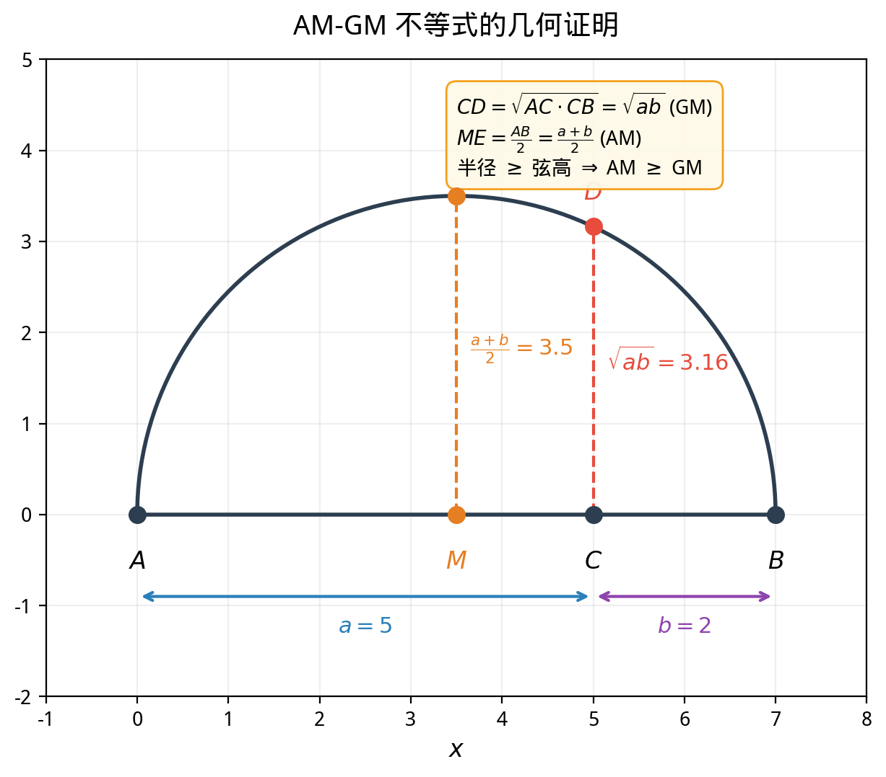

# §2 经典不等式（Classical Inequalities）

**前置知识**：[§1 基本不等式](01-basic-inequalities.md)（不等式的基本性质与证明方法）、[Part 3 第 1 章 §1](../ch01-equations/01-linear-quadratic.md)（二次方程与判别式）

**全景图**：本节介绍几个数学中最重要、最优美的不等式。它们不仅是解题工具，更是整个分析学的基石。AM-GM 不等式将算术平均与几何平均联系起来，Cauchy-Schwarz 不等式连接了代数与几何（向量的内积与夹角），排序不等式揭示了"顺序"与"大小"的深层关系，Jensen 不等式将凸性这一核心概念引入不等式理论。每个不等式都有多种证明方法——从纯代数的到几何的——这本身就是数学统一性的体现。

**预估学习时间**：约 5–6 小时

---

## 动机

在 §1 中，我们学会了解不等式（"什么值满足这个不等式？"）和证明简单的不等式。现在，我们要学习一些**万能工具**——它们是数学家工具箱中使用频率最高的不等式，几乎在数学的每个分支中都有应用。

一个典型的问题：

> 设 $x, y > 0$ 且 $x + y = 10$。求 $xy$ 的最大值。

凭直觉，$x = y = 5$ 时乘积最大（$xy = 25$）。但如何**证明**这是最大值？AM-GM 不等式给出了优雅的答案。

---

## 1. 算术-几何平均不等式（AM-GM Inequality）

### 1.1 两变量的情况

> **定理 1**（AM-GM 不等式，arithmetic mean–geometric mean inequality，二元）
>
> 设 $a, b \geq 0$，则
>
> $$\frac{a + b}{2} \geq \sqrt{ab}$$
>
> 等号成立当且仅当 $a = b$。
>
> 即：**算术平均不小于几何平均**。

### 1.2 代数证明

> **证明 1**（代数证明，从平方非负性出发）
>
> $(a - b)^2 \geq 0$（对任意实数 $a, b$ 成立）
>
> $a^2 - 2ab + b^2 \geq 0$
>
> 注意我们需要的是 $\frac{a+b}{2} \geq \sqrt{ab}$（其中 $a, b \geq 0$）。
>
> 令 $u = \sqrt{a} \geq 0$，$v = \sqrt{b} \geq 0$，则 $(u - v)^2 \geq 0$ 展开为
>
> $u^2 - 2uv + v^2 \geq 0$
>
> $a - 2\sqrt{ab} + b \geq 0$
>
> $a + b \geq 2\sqrt{ab}$
>
> $\frac{a + b}{2} \geq \sqrt{ab}$
>
> 等号成立当且仅当 $u = v$，即 $\sqrt{a} = \sqrt{b}$，即 $a = b$。$\blacksquare$

### 1.3 几何证明

> **证明 2**（几何证明，半圆中的垂线）
>
> 构造一个以 $AB$ 为直径的半圆，其中 $AB = a + b$。在直径上取点 $C$ 使得 $AC = a$、$CB = b$。过 $C$ 作半圆的垂线交半圆于 $D$。
>
> 由圆的性质（直径所对的角是直角），$\triangle ADB$ 是直角三角形，$CD$ 是斜边上的高。

> 由直角三角形的射影定理：$CD^2 = AC \cdot CB = ab$，即 $CD = \sqrt{ab}$。
>
> 而半圆的半径 $r = \frac{a + b}{2}$ 是圆心到圆上任意点的距离，特别地 $r \geq CD$（圆心到弦的距离不超过半径），即
>
> $$\frac{a + b}{2} \geq \sqrt{ab}$$
>
> 等号成立当且仅当 $C$ 是圆心，即 $a = b$。$\blacksquare$

### 1.4 AM-GM 不等式的应用

**例题 1**. 设 $x, y > 0$ 且 $x + y = 10$。求 $xy$ 的最大值。

**解**：由 AM-GM：$\frac{x + y}{2} \geq \sqrt{xy}$，即 $5 \geq \sqrt{xy}$，$xy \leq 25$。

等号成立当且仅当 $x = y = 5$。

**最大值为 $25$**。

**例题 2**. 设 $x > 0$。求 $f(x) = x + \frac{1}{x}$ 的最小值。

**解**：由 AM-GM：$x + \frac{1}{x} \geq 2\sqrt{x \cdot \frac{1}{x}} = 2$。

等号成立当且仅当 $x = \frac{1}{x}$，即 $x = 1$（因为 $x > 0$）。

**最小值为 $2$**。

**例题 3**. 设 $a, b, c > 0$ 且 $abc = 1$。证明 $a + b + c \geq 3$。

**证明**：由 AM-GM（三元形式，见下一小节）：

$$\frac{a + b + c}{3} \geq \sqrt[3]{abc} = \sqrt[3]{1} = 1$$

$$a + b + c \geq 3$$

等号成立当且仅当 $a = b = c = 1$。$\blacksquare$

### 1.5 $n$ 元 AM-GM 不等式

> **定理 2**（AM-GM 不等式，$n$ 元）
>
> 设 $a_1, a_2, \ldots, a_n \geq 0$，则
>
> $$\frac{a_1 + a_2 + \cdots + a_n}{n} \geq \sqrt[n]{a_1 a_2 \cdots a_n}$$
>
> 等号成立当且仅当 $a_1 = a_2 = \cdots = a_n$。

> **证明**（Cauchy 的前后归纳法，又称"Cauchy induction"）
>
> **第 1 步**：$n = 2$ 已证（定理 1）。
>
> **第 2 步**：证明 $n = 2^k$（$n$ 为 $2$ 的幂时成立）。
>
> 假设 $n$ 元成立，证 $2n$ 元成立。设 $a_1, \ldots, a_{2n} \geq 0$，令 $A = \frac{1}{n}\sum_{i=1}^n a_i$，$B = \frac{1}{n}\sum_{i=n+1}^{2n} a_i$。
>
> 由 $n$ 元假设：$A \geq \sqrt[n]{a_1 \cdots a_n}$，$B \geq \sqrt[n]{a_{n+1} \cdots a_{2n}}$。
>
> 由 $2$ 元情况：$\frac{A + B}{2} \geq \sqrt{AB} \geq \sqrt{\sqrt[n]{a_1 \cdots a_n} \cdot \sqrt[n]{a_{n+1} \cdots a_{2n}}} = \sqrt[2n]{a_1 \cdots a_{2n}}$。
>
> 而 $\frac{A + B}{2} = \frac{1}{2n}\sum_{i=1}^{2n} a_i$。$2^k$ 步完成。
>
> **第 3 步**：从 $n + 1$ 元推出 $n$ 元。
>
> 设 $n + 1$ 元成立，取 $a_{n+1} = \frac{a_1 + \cdots + a_n}{n} = A$（算术平均值）。
>
> 由 $n + 1$ 元：$\frac{a_1 + \cdots + a_n + A}{n + 1} \geq \sqrt[n+1]{a_1 \cdots a_n \cdot A}$
>
> 左边 $= \frac{nA + A}{n+1} = A$。
>
> 所以 $A \geq \sqrt[n+1]{a_1 \cdots a_n \cdot A}$，即 $A^{n+1} \geq a_1 \cdots a_n \cdot A$，$A^n \geq a_1 \cdots a_n$，$A \geq \sqrt[n]{a_1 \cdots a_n}$。
>
> 结合第 2、3 步：$2$ 的幂成立 → 中间所有正整数也成立。$\blacksquare$

---

## 2. Cauchy-Schwarz 不等式（Cauchy–Schwarz Inequality）

### 2.1 代数形式

> **定理 3**（Cauchy-Schwarz 不等式）
>
> 设 $a_1, a_2, \ldots, a_n$ 和 $b_1, b_2, \ldots, b_n$ 是实数，则
>
> $$\left(\sum_{i=1}^n a_i b_i\right)^2 \leq \left(\sum_{i=1}^n a_i^2\right)\left(\sum_{i=1}^n b_i^2\right)$$
>
> 等号成立当且仅当存在常数 $\lambda$ 使得 $a_i = \lambda b_i$ 对所有 $i$ 成立（或所有 $b_i = 0$），即两个"向量"成比例。

### 2.2 二次函数证明

> **证明**（通过二次函数的判别式）
>
> 构造函数 $f(t) = \sum_{i=1}^n (a_i - t b_i)^2$。
>
> 由于 $f(t)$ 是平方和，对一切 $t \in \mathbb{R}$ 有 $f(t) \geq 0$。
>
> 展开：
>
> $$f(t) = \sum a_i^2 - 2t\sum a_i b_i + t^2 \sum b_i^2$$
>
> 这是关于 $t$ 的二次函数（假设 $\sum b_i^2 > 0$，否则所有 $b_i = 0$，不等式显然成立）。
>
> 由 $f(t) \geq 0$ 对所有 $t$ 成立，这个二次函数的判别式 $\Delta \leq 0$：
>
> $$\Delta = 4\left(\sum a_i b_i\right)^2 - 4\left(\sum a_i^2\right)\left(\sum b_i^2\right) \leq 0$$
>
> $$\left(\sum a_i b_i\right)^2 \leq \left(\sum a_i^2\right)\left(\sum b_i^2\right)$$
>
> 等号成立当且仅当 $\Delta = 0$，即 $f(t) = 0$ 有实数解 $t_0$，此时 $a_i = t_0 b_i$ 对所有 $i$。$\blacksquare$

### 2.3 几何解释（向量的内积与夹角）

在 $n$ 维向量空间中，定义向量 $\mathbf{a} = (a_1, \ldots, a_n)$ 和 $\mathbf{b} = (b_1, \ldots, b_n)$。

- **内积**（dot product）：$\mathbf{a} \cdot \mathbf{b} = \sum a_i b_i$
- **模**（norm）：$|\mathbf{a}| = \sqrt{\sum a_i^2}$

Cauchy-Schwarz 不等式可以写为

$$|\mathbf{a} \cdot \mathbf{b}| \leq |\mathbf{a}| \cdot |\mathbf{b}|$$

由此可以**定义**两个向量的夹角 $\theta$：

$$\cos\theta = \frac{\mathbf{a} \cdot \mathbf{b}}{|\mathbf{a}| \cdot |\mathbf{b}|}$$

Cauchy-Schwarz 不等式保证了 $|\cos\theta| \leq 1$，即夹角的余弦值在 $[-1, 1]$ 范围内。这正是为什么这个不等式对于**定义高维空间中的角度**是不可或缺的。

### 2.4 二元特殊情况

当 $n = 2$ 时，Cauchy-Schwarz 不等式为

$$(a_1 b_1 + a_2 b_2)^2 \leq (a_1^2 + a_2^2)(b_1^2 + b_2^2)$$

**例题 4**. 设 $x, y > 0$ 且 $x + y = 1$。求 $\frac{1}{x} + \frac{1}{y}$ 的最小值。

**解法 1**（AM-GM）：$\frac{1}{x} + \frac{1}{y} = \frac{x + y}{xy} = \frac{1}{xy}$。由 AM-GM，$xy \leq \frac{(x+y)^2}{4} = \frac{1}{4}$，所以 $\frac{1}{xy} \geq 4$。等号当 $x = y = \frac{1}{2}$。

**解法 2**（Cauchy-Schwarz）：由 Cauchy-Schwarz 不等式（取 $a_1 = \frac{1}{\sqrt{x}}$, $a_2 = \frac{1}{\sqrt{y}}$, $b_1 = \sqrt{x}$, $b_2 = \sqrt{y}$）：

$$\left(\frac{1}{\sqrt{x}} \cdot \sqrt{x} + \frac{1}{\sqrt{y}} \cdot \sqrt{y}\right)^2 \leq \left(\frac{1}{x} + \frac{1}{y}\right)(x + y)$$

$$4 \leq \left(\frac{1}{x} + \frac{1}{y}\right) \cdot 1$$

**最小值为 $4$**。

**例题 5**. 证明：对任意实数 $a_1, a_2, \ldots, a_n$，

$$\left(\sum_{i=1}^n a_i\right)^2 \leq n \sum_{i=1}^n a_i^2$$

**证明**：在 Cauchy-Schwarz 不等式中取 $b_i = 1$（$i = 1, \ldots, n$）：

$$\left(\sum a_i \cdot 1\right)^2 \leq \left(\sum a_i^2\right)\left(\sum 1^2\right) = n\sum a_i^2$$

$\blacksquare$

这实际上是 **QM-AM 不等式**（均方根不小于算术平均）的等价形式。

**例题 6**（Cauchy-Schwarz 的"分数形式"）. 设 $x_1, \ldots, x_n > 0$ 且 $a_1, \ldots, a_n$ 为实数，证明

$$\frac{a_1^2}{x_1} + \frac{a_2^2}{x_2} + \cdots + \frac{a_n^2}{x_n} \geq \frac{(a_1 + a_2 + \cdots + a_n)^2}{x_1 + x_2 + \cdots + x_n}$$

**证明**：在 Cauchy-Schwarz 不等式中取 $u_i = \frac{a_i}{\sqrt{x_i}}$，$v_i = \sqrt{x_i}$：

$$\left(\sum \frac{a_i}{\sqrt{x_i}} \cdot \sqrt{x_i}\right)^2 \leq \left(\sum \frac{a_i^2}{x_i}\right)\left(\sum x_i\right)$$

$$\left(\sum a_i\right)^2 \leq \left(\sum \frac{a_i^2}{x_i}\right)\left(\sum x_i\right)$$

$$\sum \frac{a_i^2}{x_i} \geq \frac{(\sum a_i)^2}{\sum x_i}$$

$\blacksquare$

这个"分数形式"的 Cauchy-Schwarz（有时称为 **Titu 引理**或 **Engel 形式**）在竞赛数学中极其实用。

---

## 3. 排序不等式（Rearrangement Inequality）

### 3.1 陈述

> **定理 4**（排序不等式，rearrangement inequality）
>
> 设 $a_1 \leq a_2 \leq \cdots \leq a_n$ 和 $b_1 \leq b_2 \leq \cdots \leq b_n$ 是两组有序实数。设 $b_{\sigma(1)}, b_{\sigma(2)}, \ldots, b_{\sigma(n)}$ 是 $b_1, \ldots, b_n$ 的任意一个排列。则
>
> $$\sum_{i=1}^n a_i b_{n+1-i} \leq \sum_{i=1}^n a_i b_{\sigma(i)} \leq \sum_{i=1}^n a_i b_i$$
>
> 即：**顺序和最大，逆序和最小**。

**直觉**：大配大、小配小时总和最大。大配小、小配大时总和最小。任何其他配对都介于两者之间。

**例题 7**. 设 $a, b, c > 0$。证明 $\frac{a^2}{b} + \frac{b^2}{c} + \frac{c^2}{a} \geq a + b + c$。

**证明**：不妨设 $a \leq b \leq c$，则 $\frac{1}{a} \geq \frac{1}{b} \geq \frac{1}{c}$ 且 $a^2 \leq b^2 \leq c^2$。

由排序不等式（逆序和 $\leq$ 顺序和）：

$$a^2 \cdot \frac{1}{a} + b^2 \cdot \frac{1}{b} + c^2 \cdot \frac{1}{c} \leq a^2 \cdot \frac{1}{b} + b^2 \cdot \frac{1}{c} + c^2 \cdot \frac{1}{a}$$

等号右侧不是顺序和也不是逆序和，让我们换一种方式。

左边 $= a + b + c$，右边 $= \frac{a^2}{b} + \frac{b^2}{c} + \frac{c^2}{a}$。

但 $(a^2, b^2, c^2)$ 和 $(\frac{1}{c}, \frac{1}{b}, \frac{1}{a})$ 是逆序的，而 $(a^2, b^2, c^2)$ 和 $(\frac{1}{a}, \frac{1}{b}, \frac{1}{c})$ 是顺序的——

更规范地：$a^2 \leq b^2 \leq c^2$ 且 $\frac{1}{c} \leq \frac{1}{b} \leq \frac{1}{a}$（同为递增序列）。

顺序和 $= a^2 \cdot \frac{1}{c} + b^2 \cdot \frac{1}{b} + c^2 \cdot \frac{1}{a}$——不对，这不是我们要的形式。

让我们用更直接的方法：由 AM-GM，$\frac{a^2}{b} + b \geq 2a$（因为 $\frac{a^2}{b} + b \geq 2\sqrt{\frac{a^2}{b} \cdot b} = 2a$）。

类似地 $\frac{b^2}{c} + c \geq 2b$，$\frac{c^2}{a} + a \geq 2c$。

三式相加：$\frac{a^2}{b} + \frac{b^2}{c} + \frac{c^2}{a} + (a + b + c) \geq 2(a + b + c)$

$$\frac{a^2}{b} + \frac{b^2}{c} + \frac{c^2}{a} \geq a + b + c$$

$\blacksquare$

---

## 4. Jensen 不等式简介（Jensen's Inequality — Introduction）

### 4.1 凸函数

> **定义 1**（凸函数，convex function）
>
> 函数 $f: I \to \mathbb{R}$（$I$ 是区间）称为**凸函数**（convex function），若对任意 $x, y \in I$ 和 $0 \leq \lambda \leq 1$：
>
> $$f(\lambda x + (1 - \lambda)y) \leq \lambda f(x) + (1 - \lambda) f(y)$$

**几何直觉**：函数图像上任意两点之间的**弦**始终在函数图像的**上方**（或重合）。也就是说，图像"向下弯曲"。

常见的凸函数：$x^2$，$|x|$，$e^x$，$-\ln x$（$x > 0$）。

常见的凹函数（concave，不等号反向）：$\sqrt{x}$（$x \geq 0$），$\ln x$（$x > 0$）。

### 4.2 Jensen 不等式

> **定理 5**（Jensen 不等式，Jensen's inequality）
>
> 设 $f$ 是区间 $I$ 上的凸函数，$x_1, x_2, \ldots, x_n \in I$，$\lambda_1, \ldots, \lambda_n \geq 0$ 且 $\sum \lambda_i = 1$，则
>
> $$f\left(\sum_{i=1}^n \lambda_i x_i\right) \leq \sum_{i=1}^n \lambda_i f(x_i)$$
>
> 若 $f$ 是凹函数，不等号反向。

**特殊情况**（等权重 $\lambda_i = \frac{1}{n}$）：

$$f\left(\frac{x_1 + x_2 + \cdots + x_n}{n}\right) \leq \frac{f(x_1) + f(x_2) + \cdots + f(x_n)}{n}$$

**例题 8**. 从 Jensen 不等式导出 AM-GM 不等式。

**证明**：$f(x) = -\ln x$ 是凸函数（$x > 0$）。由 Jensen 不等式（等权重）：

$$-\ln\left(\frac{a_1 + \cdots + a_n}{n}\right) \leq \frac{-\ln a_1 + \cdots + (-\ln a_n)}{n}$$

$$\ln\left(\frac{a_1 + \cdots + a_n}{n}\right) \geq \frac{\ln a_1 + \cdots + \ln a_n}{n} = \ln\sqrt[n]{a_1 \cdots a_n}$$

$$\frac{a_1 + \cdots + a_n}{n} \geq \sqrt[n]{a_1 \cdots a_n}$$

$\blacksquare$

这表明 AM-GM 不等式是 Jensen 不等式（应用于凹函数 $\ln x$）的特殊情况。

---

## 5. 综合应用

**例题 9**（优化问题）. 一个开口的长方体盒子的体积为 $V$。求使表面积最小的长、宽、高之比。

**解**：设长方体的长、宽、高分别为 $a, b, h$。约束条件 $abh = V$。

表面积（无盖）：$S = ab + 2ah + 2bh$。

由 AM-GM：$S = ab + 2ah + 2bh \geq 3\sqrt[3]{ab \cdot 2ah \cdot 2bh} = 3\sqrt[3]{4a^2b^2h^2} = 3\sqrt[3]{4(abh)^2} = 3\sqrt[3]{4V^2}$

等号条件：$ab = 2ah = 2bh$。

$ab = 2ah \implies b = 2h$。

$ab = 2bh \implies a = 2h$。

所以 $a = b = 2h$。最优比例为 $a : b : h = 2 : 2 : 1$。

**例题 10**（用 Cauchy-Schwarz 证明不等式）. 设 $a, b, c > 0$。证明

$$\frac{a}{b + c} + \frac{b}{a + c} + \frac{c}{a + b} \geq \frac{3}{2}$$

**证明**：由 Cauchy-Schwarz 的分数形式（Titu 引理）：

$$\frac{a^2}{a(b+c)} + \frac{b^2}{b(a+c)} + \frac{c^2}{c(a+b)} \geq \frac{(a+b+c)^2}{a(b+c) + b(a+c) + c(a+b)}$$

右边分母 $= 2(ab + ac + bc)$。

所以

$$\frac{a}{b+c} + \frac{b}{a+c} + \frac{c}{a+b} \geq \frac{(a+b+c)^2}{2(ab+ac+bc)}$$

而 $(a+b+c)^2 = a^2 + b^2 + c^2 + 2(ab+ac+bc) \geq 3(ab+ac+bc)$（因为 $a^2 + b^2 + c^2 \geq ab + ac + bc$，在 §1 自测题 3 中已证）。

所以

$$\frac{(a+b+c)^2}{2(ab+ac+bc)} \geq \frac{3(ab+ac+bc)}{2(ab+ac+bc)} = \frac{3}{2}$$

$\blacksquare$

---

## 要点回顾

1. **AM-GM 不等式**：$\frac{a+b}{2} \geq \sqrt{ab}$，推广为 $n$ 元版本。证明方法：代数（平方非负）、几何（半圆）、Cauchy 前后归纳法。
2. **Cauchy-Schwarz 不等式**：$(\sum a_i b_i)^2 \leq (\sum a_i^2)(\sum b_i^2)$。证明方法：构造二次函数，利用判别式。几何解释：$|\cos\theta| \leq 1$。
3. **排序不等式**：顺序和 $\geq$ 乱序和 $\geq$ 逆序和。
4. **Jensen 不等式**：凸函数满足 $f(\bar{x}) \leq \overline{f(x)}$，AM-GM 是其特例（$f = -\ln$）。
5. **应用模式**：AM-GM 适合"积定和最小/和定积最大"；Cauchy-Schwarz 适合"分数和"的估计。

---

## 进度检查点

在继续之前，确认你能够：

- [ ] 写出并证明二元 AM-GM 不等式（代数方法和几何方法）
- [ ] 陈述 $n$ 元 AM-GM 不等式并描述 Cauchy 前后归纳法的思路
- [ ] 用二次函数判别式法证明 Cauchy-Schwarz 不等式
- [ ] 解释 Cauchy-Schwarz 不等式的几何含义（向量夹角）
- [ ] 用 AM-GM 或 Cauchy-Schwarz 解决至少一个优化问题
- [ ] 陈述排序不等式和 Jensen 不等式（无需证明）

---

## 自测题

**自测题 1**：设 $a, b > 0$ 且 $ab = 9$。求 $a + b$ 的最小值。

答案

由 AM-GM：$a + b \geq 2\sqrt{ab} = 2\sqrt{9} = 6$。

等号当 $a = b = 3$ 时成立。最小值为 $6$。

**自测题 2**：用 Cauchy-Schwarz 不等式证明 $(a^2 + b^2)(c^2 + d^2) \geq (ac + bd)^2$。

答案

取 $a_1 = a, a_2 = b, b_1 = c, b_2 = d$，直接由 Cauchy-Schwarz 不等式（$n = 2$）得

$$(ac + bd)^2 \leq (a^2 + b^2)(c^2 + d^2)$$

$\blacksquare$

**自测题 3**：设 $x, y, z > 0$ 且 $x + y + z = 1$。求 $\frac{1}{x} + \frac{1}{y} + \frac{1}{z}$ 的最小值。

答案

**方法 1**（Cauchy-Schwarz 分数形式）：

$$\frac{1}{x} + \frac{1}{y} + \frac{1}{z} = \frac{1^2}{x} + \frac{1^2}{y} + \frac{1^2}{z} \geq \frac{(1 + 1 + 1)^2}{x + y + z} = \frac{9}{1} = 9$$

**方法 2**（AM-GM）：由 AM-GM，$\frac{1}{x} + \frac{1}{y} + \frac{1}{z} \geq 3\sqrt[3]{\frac{1}{xyz}}$。由 AM-GM，$xyz \leq \left(\frac{x+y+z}{3}\right)^3 = \frac{1}{27}$，所以 $\frac{1}{xyz} \geq 27$，$\sqrt[3]{\frac{1}{xyz}} \geq 3$，$\frac{1}{x} + \frac{1}{y} + \frac{1}{z} \geq 9$。

等号当 $x = y = z = \frac{1}{3}$ 时取到。最小值为 $9$。

**自测题 4**：排序不等式的应用——设 $a, b, c > 0$，证明 $a^3 + b^3 + c^3 \geq a^2b + b^2c + c^2a$。

答案

不妨设 $a \leq b \leq c$。则 $a^2 \leq b^2 \leq c^2$（同序），$a \leq b \leq c$（同序）。

顺序和 $= a^2 \cdot a + b^2 \cdot b + c^2 \cdot c = a^3 + b^3 + c^3$（最大）。

$a^2 b + b^2 c + c^2 a$ 是一个乱序和。

由排序不等式：顺序和 $\geq$ 乱序和，即 $a^3 + b^3 + c^3 \geq a^2 b + b^2 c + c^2 a$。$\blacksquare$

---

## 习题引用

完成本节学习后，请前往 [练习题](exercises/exercises.md) 的 §2 部分进行练习。
