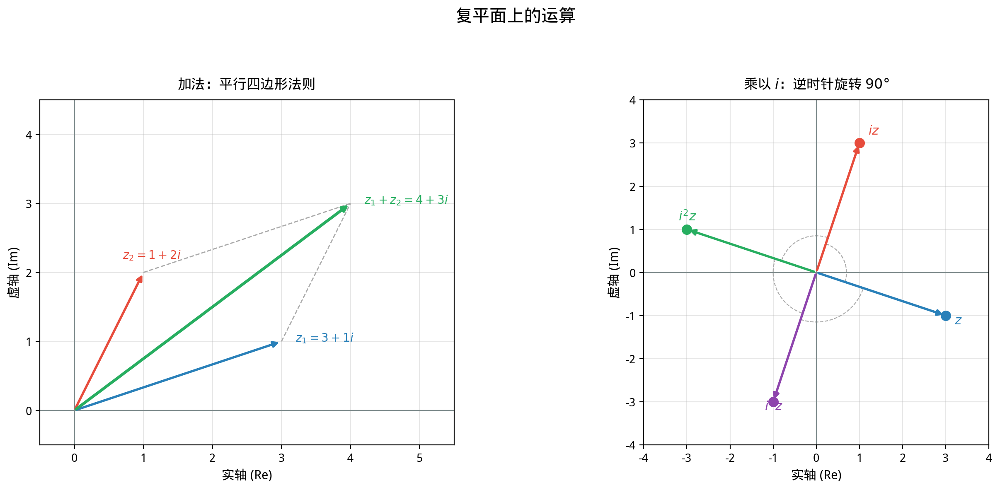

# §1 复数的运算（Complex Number Operations）

**前置知识**：[Part 2 第 1 章 §4 复数引入](../../part-02-numbers/ch01-number-systems/04-complex-intro.md)（虚数单位 $i$、复数 $z = a + bi$ 的定义）、[Part 3 第 1 章 §1](../ch01-equations/01-linear-quadratic.md)（一元二次方程的判别式）

**全景图**：Part 2 Ch01 §4 已经引入了复数的概念和初步运算。本节将系统而深入地发展复数的代数运算——特别是除法——并建立共轭和模的完整理论。然后，我们进入复数最迷人的一面：**几何解释**。每一个复数 $z = a + bi$ 对应复平面上的点 $(a, b)$，复数的加法是向量加法，乘法是旋转与缩放。这种代数与几何的统一是复数理论的灵魂。

**预估学习时间**：约 4–5 小时

---

## 动机

回忆 Part 2 中的数系扩展：

$$\mathbb{N} \subset \mathbb{Z} \subset \mathbb{Q} \subset \mathbb{R} \subset \mathbb{C}$$

复数域 $\mathbb{C}$ 是这条链的终点——它实现了**代数封闭性**（每个非常数多项式都有根）。我们已经知道 $\mathbb{C} = \{a + bi : a, b \in \mathbb{R}\}$，其中 $i^2 = -1$。

但复数远不只是"让 $x^2 + 1 = 0$ 有解"的工具。在 18 世纪，数学家们发现了一个惊人的事实：复数有着深刻的**几何意义**。当我们把 $z = a + bi$ 画在平面上时：

- **加法**变成了向量的平行四边形法则
- **乘法**变成了旋转和缩放
- **共轭**变成了关于实轴的反射
- **模**就是到原点的距离

这种代数运算与几何变换的完美对应，使得复数成为数学和物理中最强大的工具之一。

---

## 1. 复数的代数运算（Algebraic Operations）

### 1.1 回顾：复数的定义

> **定义 1**（复数，complex number）
>
> **复数**是形如 $z = a + bi$ 的表达式，其中 $a, b \in \mathbb{R}$，$i$ 满足 $i^2 = -1$。
>
> - $a = \text{Re}(z)$ 称为 $z$ 的**实部**（real part）
> - $b = \text{Im}(z)$ 称为 $z$ 的**虚部**（imaginary part）
> - 若 $b = 0$，则 $z = a$ 是实数；若 $a = 0, b \neq 0$，则 $z = bi$ 是**纯虚数**（pure imaginary）

两个复数相等当且仅当实部和虚部分别相等：

$$a + bi = c + di \iff a = c \text{ 且 } b = d$$

### 1.2 加法与减法

> **定义 2**（复数的加法与减法）
>
> 设 $z_1 = a + bi$，$z_2 = c + di$，则
>
> $$z_1 + z_2 = (a + c) + (b + d)i$$
>
> $$z_1 - z_2 = (a - c) + (b - d)i$$

实部与实部相加，虚部与虚部相加。这本质上就是向量加法。

**例题 1**. 计算 $(3 + 2i) + (1 - 5i)$。

**解**：$(3 + 1) + (2 + (-5))i = 4 - 3i$。

**例题 2**. 计算 $(2 - 7i) - (4 + 3i)$。

**解**：$(2 - 4) + (-7 - 3)i = -2 - 10i$。

### 1.3 乘法

> **定义 3**（复数的乘法）
>
> 设 $z_1 = a + bi$，$z_2 = c + di$，则
>
> $$z_1 \cdot z_2 = (ac - bd) + (ad + bc)i$$

这个公式不需要死记——只要把 $z_1 z_2$ 按分配律展开，然后用 $i^2 = -1$ 化简即可：

$$(a + bi)(c + di) = ac + adi + bci + bdi^2 = ac + adi + bci - bd = (ac - bd) + (ad + bc)i$$

**例题 3**. 计算 $(2 + 3i)(4 - i)$。

**解**：
$$= 2 \cdot 4 + 2 \cdot (-i) + 3i \cdot 4 + 3i \cdot (-i)$$
$$= 8 - 2i + 12i - 3i^2 = 8 + 10i - 3(-1) = 11 + 10i$$

**例题 4**. 计算 $(1 + i)^2$。

**解**：$(1 + i)^2 = 1 + 2i + i^2 = 1 + 2i - 1 = 2i$。

注意：$(1+i)^2$ 是**纯虚数**！这已经暗示了复数乘法的几何意义——乘以 $1+i$ 相当于旋转 $45°$ 并放大 $\sqrt{2}$ 倍，做两次就是旋转 $90°$ 并放大 $2$ 倍，结果落在虚轴上。

**例题 5**. 计算 $i$ 的正整数幂。

**解**：$i^1 = i$，$i^2 = -1$，$i^3 = i \cdot i^2 = -i$，$i^4 = (i^2)^2 = 1$，$i^5 = i^4 \cdot i = i$, ...

规律：$i^n$ 的值仅取决于 $n \bmod 4$：

| $n \bmod 4$ | $0$ | $1$ | $2$ | $3$ |
|--|--|--|--|--|
| $i^n$ | $1$ | $i$ | $-1$ | $-i$ |

### 1.4 除法

除法是复数运算中需要技巧的部分。核心思想是**有理化分母**——乘以分母的共轭。

> **定义 4**（复数的除法）
>
> 设 $z_1 = a + bi$，$z_2 = c + di \neq 0$，则
>
> $$\frac{z_1}{z_2} = \frac{a + bi}{c + di} = \frac{(a + bi)(c - di)}{(c + di)(c - di)} = \frac{(ac + bd) + (bc - ad)i}{c^2 + d^2}$$

关键观察：$(c + di)(c - di) = c^2 + d^2$，这是一个**正实数**（当 $z_2 \neq 0$ 时）。

**例题 6**. 计算 $\displaystyle\frac{3 + 4i}{1 - 2i}$。

**解**：

$$\frac{3 + 4i}{1 - 2i} = \frac{(3 + 4i)(1 + 2i)}{(1 - 2i)(1 + 2i)} = \frac{3 + 6i + 4i + 8i^2}{1 + 4} = \frac{3 + 10i - 8}{5} = \frac{-5 + 10i}{5} = -1 + 2i$$

**验证**：$(-1 + 2i)(1 - 2i) = -1 + 2i + 2i - 4i^2 = -1 + 4i + 4 = 3 + 4i$。✓

**例题 7**. 计算 $\displaystyle\frac{1}{i}$。

**解**：$\displaystyle\frac{1}{i} = \frac{1 \cdot (-i)}{i \cdot (-i)} = \frac{-i}{1} = -i$。

或者直接：$\displaystyle\frac{1}{i} = \frac{i}{i^2} = \frac{i}{-1} = -i$。

---

## 2. 共轭（Conjugate）

### 2.1 定义与基本性质

> **定义 5**（共轭复数，complex conjugate）
>
> 设 $z = a + bi$，则 $z$ 的**共轭**定义为
>
> $$\bar{z} = a - bi$$
>
> 几何上，$\bar{z}$ 是 $z$ 关于实轴的**反射**。

**例子**：$\overline{3 + 4i} = 3 - 4i$，$\overline{2 - i} = 2 + i$，$\overline{5} = 5$，$\overline{3i} = -3i$。

### 2.2 共轭的代数性质

> **定理 1**（共轭的性质）
>
> 设 $z, z_1, z_2 \in \mathbb{C}$，则：
>
> **(1)** $\overline{\overline{z}} = z$（共轭的共轭是自身）
>
> **(2)** $z + \bar{z} = 2\text{Re}(z)$，$z - \bar{z} = 2i\,\text{Im}(z)$
>
> **(3)** $z\bar{z} = [\text{Re}(z)]^2 + [\text{Im}(z)]^2 = |z|^2 \geq 0$
>
> **(4)** $\overline{z_1 + z_2} = \bar{z}_1 + \bar{z}_2$（共轭对加法分配）
>
> **(5)** $\overline{z_1 \cdot z_2} = \bar{z}_1 \cdot \bar{z}_2$（共轭对乘法分配）
>
> **(6)** $\overline{\left(\dfrac{z_1}{z_2}\right)} = \dfrac{\bar{z}_1}{\bar{z}_2}$（$z_2 \neq 0$）
>
> **(7)** $z \in \mathbb{R} \iff z = \bar{z}$

> **证明**（部分）
>
> 设 $z = a + bi$，$z_1 = a + bi$，$z_2 = c + di$。
>
> **(1)** $\overline{\overline{z}} = \overline{a - bi} = a + bi = z$。
>
> **(2)** $z + \bar{z} = (a + bi) + (a - bi) = 2a = 2\text{Re}(z)$。
>
> **(3)** $z\bar{z} = (a + bi)(a - bi) = a^2 - (bi)^2 = a^2 + b^2$。
>
> **(4)** $\overline{z_1 + z_2} = \overline{(a + c) + (b + d)i} = (a + c) - (b + d)i = (a - bi) + (c - di) = \bar{z}_1 + \bar{z}_2$。
>
> **(5)** $z_1 z_2 = (ac - bd) + (ad + bc)i$，所以 $\overline{z_1 z_2} = (ac - bd) - (ad + bc)i$。
> 另一方面，$\bar{z}_1 \bar{z}_2 = (a - bi)(c - di) = (ac - bd) + (-ad - bc)i = (ac - bd) - (ad + bc)i$。相等。✓
>
> 其余性质类似可证。$\blacksquare$

**性质 (5) 的重要推论**：对于实系数多项式 $f(x) = a_n x^n + \cdots + a_0$（$a_k \in \mathbb{R}$），若 $z$ 是 $f$ 的根，则 $\bar{z}$ 也是 $f$ 的根。这就是 Part 3 Ch03 §2 中提到的"实系数多项式的复数根成共轭对出现"的代数基础。

> **证明（复数根的共轭定理）**
>
> 设 $f(z) = a_n z^n + \cdots + a_1 z + a_0 = 0$，其中 $a_k \in \mathbb{R}$。取共轭：
>
> $$0 = \overline{f(z)} = \overline{a_n z^n + \cdots + a_0} = \bar{a}_n \bar{z}^n + \cdots + \bar{a}_0 = a_n \bar{z}^n + \cdots + a_0 = f(\bar{z})$$
>
> 因为 $\bar{a}_k = a_k$（系数是实数），且共轭对加法和乘法分配。$\blacksquare$

### 2.3 利用共轭提取实部和虚部

由性质 (2)：

$$\text{Re}(z) = \frac{z + \bar{z}}{2}, \qquad \text{Im}(z) = \frac{z - \bar{z}}{2i}$$

这两个公式在后续的分析和应用中非常有用。

---

## 3. 模（Modulus）

### 3.1 定义

> **定义 6**（模，modulus / absolute value）
>
> 设 $z = a + bi$，则 $z$ 的**模**定义为
>
> $$|z| = \sqrt{a^2 + b^2} = \sqrt{z\bar{z}}$$
>
> 几何上，$|z|$ 是复平面上从原点 $O$ 到点 $z$ 的距离。

**例子**：$|3 + 4i| = \sqrt{9 + 16} = 5$，$|1 - i| = \sqrt{2}$，$|5| = 5$，$|3i| = 3$。

### 3.2 模的性质

> **定理 2**（模的性质）
>
> 设 $z, z_1, z_2 \in \mathbb{C}$，则：
>
> **(1)** $|z| \geq 0$，等号成立当且仅当 $z = 0$
>
> **(2)** $|z|^2 = z\bar{z}$
>
> **(3)** $|\bar{z}| = |z|$
>
> **(4)** $|z_1 z_2| = |z_1| \cdot |z_2|$（模对乘法的"齐性"）
>
> **(5)** $\left|\dfrac{z_1}{z_2}\right| = \dfrac{|z_1|}{|z_2|}$（$z_2 \neq 0$）
>
> **(6)** $|\text{Re}(z)| \leq |z|$，$|\text{Im}(z)| \leq |z|$

> **证明（性质 (4)）**
>
> $$|z_1 z_2|^2 = (z_1 z_2)\overline{(z_1 z_2)} = z_1 z_2 \bar{z}_1 \bar{z}_2 = (z_1 \bar{z}_1)(z_2 \bar{z}_2) = |z_1|^2 |z_2|^2$$
>
> 取正平方根：$|z_1 z_2| = |z_1| |z_2|$。$\blacksquare$

### 3.3 复数的三角不等式

> **定理 3**（复数的三角不等式，triangle inequality）
>
> 对任意 $z_1, z_2 \in \mathbb{C}$：
>
> $$|z_1 + z_2| \leq |z_1| + |z_2|$$
>
> 等号成立当且仅当 $z_1$ 和 $z_2$ 的辐角相同（即 $z_2 = tz_1$，$t \geq 0$），或其中之一为零。

> **证明**
>
> $$|z_1 + z_2|^2 = (z_1 + z_2)\overline{(z_1 + z_2)} = (z_1 + z_2)(\bar{z}_1 + \bar{z}_2)$$
>
> $$= z_1\bar{z}_1 + z_1\bar{z}_2 + z_2\bar{z}_1 + z_2\bar{z}_2 = |z_1|^2 + z_1\bar{z}_2 + \overline{z_1\bar{z}_2} + |z_2|^2$$
>
> $$= |z_1|^2 + 2\text{Re}(z_1\bar{z}_2) + |z_2|^2$$
>
> 因为 $\text{Re}(w) \leq |w|$，所以
>
> $$|z_1 + z_2|^2 \leq |z_1|^2 + 2|z_1\bar{z}_2| + |z_2|^2 = |z_1|^2 + 2|z_1||z_2| + |z_2|^2 = (|z_1| + |z_2|)^2$$
>
> 取正平方根得到 $|z_1 + z_2| \leq |z_1| + |z_2|$。$\blacksquare$

**推论**（反向三角不等式）：

$$\big||z_1| - |z_2|\big| \leq |z_1 - z_2|$$

> **证明**
>
> 由三角不等式，$|z_1| = |(z_1 - z_2) + z_2| \leq |z_1 - z_2| + |z_2|$，即 $|z_1| - |z_2| \leq |z_1 - z_2|$。
>
> 交换 $z_1, z_2$：$|z_2| - |z_1| \leq |z_2 - z_1| = |z_1 - z_2|$。
>
> 合并得 $\big||z_1| - |z_2|\big| \leq |z_1 - z_2|$。$\blacksquare$

**例题 8**. 设 $|z| = 2$，求 $|z + 3 + 4i|$ 的取值范围。

**解**：由三角不等式和反向三角不等式：

$$\big||z| - |3 + 4i|\big| \leq |z + 3 + 4i| \leq |z| + |3 + 4i|$$

$$|2 - 5| \leq |z + 3 + 4i| \leq 2 + 5$$

$$3 \leq |z + 3 + 4i| \leq 7$$

几何上：$z$ 在以原点为圆心、半径为 $2$ 的圆上，$|z + 3 + 4i| = |z - (-3 - 4i)|$ 是 $z$ 到点 $-3 - 4i$ 的距离。最小距离为 $5 - 2 = 3$（原点到 $-3 - 4i$ 的距离减去半径），最大距离为 $5 + 2 = 7$。

---

## 4. 复平面（Argand Plane）

### 4.1 复平面的定义

> **定义 7**（复平面，complex plane / Argand plane）
>
> 将复数 $z = a + bi$ 对应到平面上的点 $(a, b)$，得到的平面称为**复平面**（也叫 Argand 平面或 Gauss 平面）。
>
> - 水平轴（$b = 0$）称为**实轴**（real axis）
> - 垂直轴（$a = 0$）称为**虚轴**（imaginary axis）
> - 原点 $O$ 对应复数 $0$

这个对应是一一的：$\mathbb{C} \longleftrightarrow \mathbb{R}^2$，$a + bi \longleftrightarrow (a, b)$。

历史上，这个将复数"可视化"的想法分别由 Caspar Wessel（1799）、Jean-Robert Argand（1806）和 Carl Friedrich Gauss 独立提出。它标志着人们终于"看懂"了复数。

### 4.2 几个特殊集合

在复平面中，许多代数条件都有清晰的几何意义：

| 条件 | 几何意义 |
|------|----------|
| $\text{Re}(z) = 0$ | 虚轴 |
| $\text{Im}(z) = 0$ | 实轴 |
| $\|z\| = r$ | 以原点为圆心、半径为 $r$ 的圆 |
| $\|z - z_0\| = r$ | 以 $z_0$ 为圆心、半径为 $r$ 的圆 |
| $\|z - z_1\| = \|z - z_2\|$ | $z_1$ 和 $z_2$ 的垂直平分线 |
| $\text{Re}(z) > 0$ | 右半平面 |

**例题 9**. 描述满足 $|z - 1 - i| = 2$ 的点的集合。

**解**：设 $z = x + yi$，则

$$|z - 1 - i| = |(x - 1) + (y - 1)i| = \sqrt{(x-1)^2 + (y-1)^2} = 2$$

即 $(x - 1)^2 + (y - 1)^2 = 4$，这是以 $(1, 1)$ 为圆心、半径为 $2$ 的圆。

**例题 10**. 描述满足 $|z - 2| = |z + 2i|$ 的点的集合。

**解**：设 $z = x + yi$。

$$|z - 2| = |z + 2i| \implies (x-2)^2 + y^2 = x^2 + (y+2)^2$$

展开：$x^2 - 4x + 4 + y^2 = x^2 + y^2 + 4y + 4$。

化简：$-4x = 4y$，即 $y = -x$。

这是一条过原点、斜率为 $-1$ 的直线——点 $2$（即 $(2,0)$）和 $-2i$（即 $(0,-2)$）的垂直平分线。

---

## 5. 复数加法的几何（Geometry of Addition）

### 5.1 向量加法

复数 $z = a + bi$ 可以看作从原点 $O$ 到点 $(a, b)$ 的**向量** $\vec{OZ}$。在这个视角下：

> **命题 1**（加法的几何意义）
>
> 复数的加法对应向量的**平行四边形法则**：
>
> $z_1 + z_2$ 对应的向量是 $\vec{OZ_1}$ 和 $\vec{OZ_2}$ 按平行四边形法则合成的结果。

具体地说：如果以 $O$、$Z_1$、$Z_2$ 为三个顶点构成平行四边形 $OZ_1WZ_2$，那么第四个顶点 $W$ 对应 $z_1 + z_2$。

### 5.2 减法的几何意义

$z_1 - z_2$ 可以理解为：

- 从 $Z_2$ 到 $Z_1$ 的向量，其长度为 $|z_1 - z_2|$
- 因此 $|z_1 - z_2|$ 是复平面上 $Z_1$ 和 $Z_2$ 之间的**距离**

**例题 11**. 在复平面上，设 $z_1 = 1 + 2i$，$z_2 = 3 + i$。求 $z_1 + z_2$ 和 $z_1 - z_2$ 的几何位置。

**解**：

$$z_1 + z_2 = 4 + 3i \quad \text{（平行四边形的第四个顶点）}$$

$$z_1 - z_2 = -2 + i \quad \text{（从 $Z_2$ 到 $Z_1$ 的向量，平移到原点）}$$

$$|z_1 - z_2| = \sqrt{4 + 1} = \sqrt{5} \quad \text{（$Z_1$ 到 $Z_2$ 的距离）}$$

### 5.3 三角不等式的几何解读

三角不等式 $|z_1 + z_2| \leq |z_1| + |z_2|$ 在复平面上说的是：

**三角形任意一边的长度不超过另外两边之和。**

在三角形 $O, Z_1, Z_1 + Z_2$ 中，三边长为 $|z_1|$、$|z_2|$、$|z_1 + z_2|$。三角不等式正是三角形的边长关系。

---

## 6. 复数乘法的几何（Geometry of Multiplication）—— 预览

本节给出乘法几何意义的直觉；严格的表述需要 §2 的极坐标形式。

### 6.1 关键观察

考虑 $z = 1 + i$。

$$|z| = \sqrt{2}, \quad z \text{ 在复平面上位于第一象限，与实轴成 } 45° \text{ 角}$$

现在计算 $z^2 = (1+i)^2 = 2i$。

$$|z^2| = 2 = (\sqrt{2})^2, \quad z^2 \text{ 在虚轴正方向，与实轴成 } 90° \text{ 角}$$

- 模：$\sqrt{2} \times \sqrt{2} = 2$（模**相乘**）
- 角度：$45° + 45° = 90°$（角度**相加**）

再来：$z^3 = z^2 \cdot z = 2i(1 + i) = 2i + 2i^2 = -2 + 2i$。

$$|z^3| = 2\sqrt{2}, \quad \text{与实轴成 } 135° \text{ 角}$$

- 模：$2 \times \sqrt{2} = 2\sqrt{2}$
- 角度：$90° + 45° = 135°$

这不是巧合！

### 6.2 乘法的几何规则（预告）

> **命题 2**（乘法的几何意义，预告）
>
> 设 $z_1, z_2 \in \mathbb{C}$，则
>
> - $|z_1 z_2| = |z_1| \cdot |z_2|$（模相乘）
> - $z_1 z_2$ 与实轴的夹角 = $z_1$ 的夹角 + $z_2$ 的夹角（辐角相加）
>
> 换言之：**乘以 $z_2$ 就是将 $z_1$ 旋转 $\arg(z_2)$ 角度，再缩放 $|z_2|$ 倍。**

这个优美的几何解释将在 §2 中用极坐标形式严格证明。

### 6.3 特殊情况

- **乘以 $i$**：$|i| = 1$，$\arg(i) = 90°$。所以乘以 $i$ 是**逆时针旋转 $90°$**。

  验证：$z = 3 + 2i$，$iz = i(3 + 2i) = 3i + 2i^2 = -2 + 3i$。
  点 $(3, 2)$ 旋转 $90°$ 得到 $(-2, 3)$。✓

- **乘以 $-1$**：$|-1| = 1$，$\arg(-1) = 180°$。所以乘以 $-1$ 是**旋转 $180°$**——即关于原点的反射。

- **乘以实数 $r > 0$**：$|r| = r$，$\arg(r) = 0°$。所以乘以正实数是**纯缩放**（无旋转）。

---

## 7. $\mathbb{C}$ 的域结构

复数在加法和乘法下构成一个**域**（field）——这意味着它满足与实数相同的代数运算律。

> **定理 4**（$\mathbb{C}$ 是域）
>
> $(\mathbb{C}, +, \cdot)$ 满足以下性质：
>
> **(a)** 加法交换律：$z_1 + z_2 = z_2 + z_1$
>
> **(b)** 加法结合律：$(z_1 + z_2) + z_3 = z_1 + (z_2 + z_3)$
>
> **(c)** 加法单位元：$z + 0 = z$（$0 = 0 + 0i$）
>
> **(d)** 加法逆元：$z + (-z) = 0$（$-z = -a - bi$）
>
> **(e)** 乘法交换律：$z_1 z_2 = z_2 z_1$
>
> **(f)** 乘法结合律：$(z_1 z_2) z_3 = z_1 (z_2 z_3)$
>
> **(g)** 乘法单位元：$z \cdot 1 = z$（$1 = 1 + 0i$）
>
> **(h)** 乘法逆元：若 $z \neq 0$，则存在 $z^{-1} = \dfrac{\bar{z}}{|z|^2}$，满足 $z z^{-1} = 1$
>
> **(i)** 分配律：$z_1(z_2 + z_3) = z_1 z_2 + z_1 z_3$

> **证明（乘法逆元）**
>
> 设 $z = a + bi \neq 0$。令 $w = \dfrac{a - bi}{a^2 + b^2}$，则
>
> $$zw = (a + bi) \cdot \frac{a - bi}{a^2 + b^2} = \frac{a^2 + b^2}{a^2 + b^2} = 1$$
>
> 因为 $z \neq 0$ 意味着 $a^2 + b^2 > 0$，所以 $w$ 是良定义的。$\blacksquare$

**注意**：$\mathbb{C}$ **不是**有序域——我们不能在复数上定义一个与运算相容的全序关系。直觉上，"$i > 0$ 还是 $i < 0$？"这个问题没有好答案（无论哪种假设都会导致矛盾）。这是从 $\mathbb{R}$ 扩展到 $\mathbb{C}$ 时"失去"的性质。

---

## 要点回顾

| 概念/结论 | 要点 |
|-----------|------|
| 四则运算 | 加减按分量，乘法用分配律 + $i^2 = -1$，除法乘以共轭 |
| 共轭 $\bar{z}$ | $\bar{z} = a - bi$；对加法、乘法、除法分配；$z\bar{z} = \|z\|^2$ |
| 模 $\|z\|$ | $\|z\| = \sqrt{a^2+b^2}$；$\|z_1 z_2\| = \|z_1\|\|z_2\|$ |
| 三角不等式 | $\|z_1 + z_2\| \leq \|z_1\| + \|z_2\|$ |
| 复平面 | $z = a + bi \leftrightarrow (a,b)$；实轴、虚轴 |
| 加法几何 | 向量的平行四边形法则 |
| 乘法几何 | 模相乘、辐角相加（旋转 + 缩放） |
| 域结构 | $\mathbb{C}$ 是域，但不是有序域 |

---

## 进度检查点

完成本节后，你应该能够：

- [ ] 计算任意两个复数的和、差、积、商
- [ ] 求复数的共轭，并运用共轭的性质
- [ ] 计算复数的模，并运用三角不等式
- [ ] 在复平面上定位复数，解释代数条件的几何意义
- [ ] 从几何角度理解复数的加法和乘法
- [ ] 解释为什么 $\mathbb{C}$ 不是有序域

---

## 自测题

**问题 1**. 计算 $\displaystyle\frac{2 + 3i}{1 + i}$。

查看答案

$$\frac{2 + 3i}{1 + i} = \frac{(2 + 3i)(1 - i)}{(1 + i)(1 - i)} = \frac{2 - 2i + 3i - 3i^2}{1 + 1} = \frac{5 + i}{2} = \frac{5}{2} + \frac{1}{2}i$$

**问题 2**. 设 $z = 1 - 2i$。计算 $z\bar{z}$ 和 $|z|$。

查看答案

$\bar{z} = 1 + 2i$，$z\bar{z} = (1 - 2i)(1 + 2i) = 1 + 4 = 5$，$|z| = \sqrt{5}$。

**问题 3**. 证明 $|z^2| = |z|^2$。

查看答案

由定理 2 (4)：$|z^2| = |z \cdot z| = |z| \cdot |z| = |z|^2$。

**问题 4**. 在复平面上描述集合 $\{z \in \mathbb{C} : |z - i| \leq 1 \text{ 且 } \text{Re}(z) \geq 0\}$。

查看答案

$|z - i| \leq 1$ 是以 $i$（即 $(0,1)$）为圆心、半径为 $1$ 的闭圆盘。$\text{Re}(z) \geq 0$ 是右半平面（含虚轴）。它们的交集是位于右半平面内（含边界）的半圆盘。

**问题 5**. 乘以 $i$ 将复平面上的点 $(3, -1)$ 映射到哪个点？

查看答案

$(3, -1)$ 对应 $z = 3 - i$。$iz = i(3 - i) = 3i - i^2 = 1 + 3i$，对应 $(1, 3)$。

几何验证：$(3, -1)$ 逆时针旋转 $90°$ 得到 $(1, 3)$（旋转公式：$(x, y) \mapsto (-y, x)$）。✓

---

## 习题引用

本节的配套练习见 [练习题](exercises/exercises.md)（§1 部分）。
