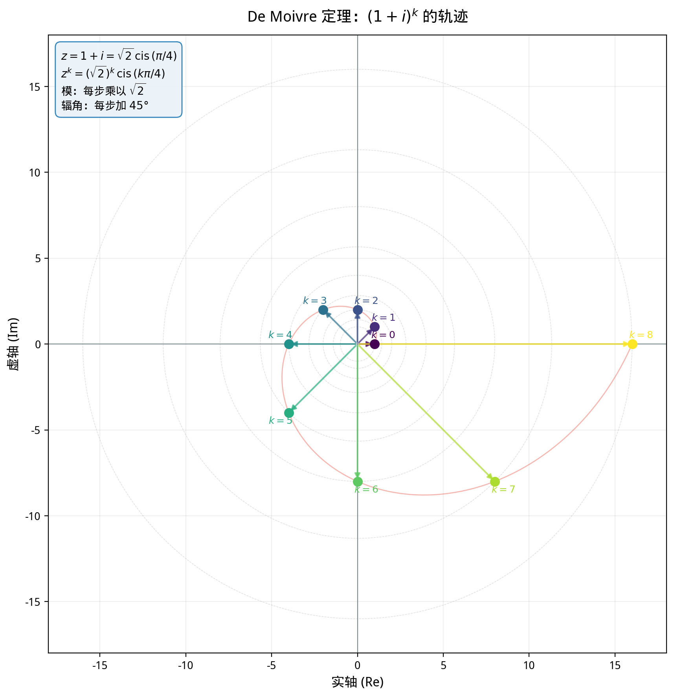
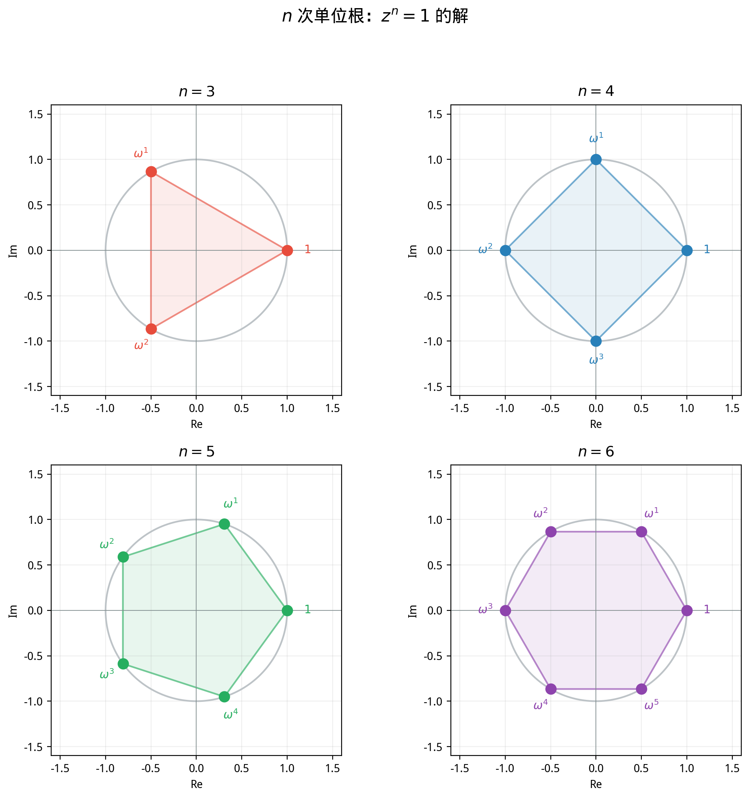

# §2 复数的极坐标形式（Polar Form of Complex Numbers）

**前置知识**：[§1 复数的运算](01-complex-operations.md)（四则运算、共轭、模、复平面）、[Part 4 第 2 章（三角函数）](../../part-04-functions/ch02-trigonometry/README.md)（$\sin\theta$, $\cos\theta$ 的定义与基本性质）

**全景图**：§1 中我们用 $z = a + bi$ 的"直角坐标形式"发展了复数的代数运算。但乘法和除法在这种表示下显得笨拙——尤其是高次幂的计算。本节引入复数的**极坐标表示** $z = r(\cos\theta + i\sin\theta)$，乘法变成"模相乘、辐角相加"——简洁得令人惊叹。这直接引出 **De Moivre 定理**，将三角函数的多倍角公式与复数的幂运算统一起来。最后，我们用极坐标形式完美地求解 $z^n = w$——一个 $n$ 次方程有恰好 $n$ 个根，均匀分布在圆上，代数与几何再次完美融合。

**预估学习时间**：约 4–5 小时

---

## 动机

考虑计算 $(1 + i)^{10}$。

用直角坐标形式，你需要反复展开乘法——极其繁琐。但如果我们知道 $1 + i$ 的"极坐标身份"：

$$1 + i = \sqrt{2}\left(\cos\frac{\pi}{4} + i\sin\frac{\pi}{4}\right)$$

那么由 De Moivre 定理：

$$(1 + i)^{10} = (\sqrt{2})^{10}\left(\cos\frac{10\pi}{4} + i\sin\frac{10\pi}{4}\right) = 32\left(\cos\frac{5\pi}{2} + i\sin\frac{5\pi}{2}\right) = 32(0 + i) = 32i$$

一步到位！

极坐标形式揭示了复数乘法的**真正本质**：旋转与缩放。

---

## 1. 极坐标表示（Polar Form）

### 1.1 从直角坐标到极坐标

复平面上的点 $z = a + bi$ 也可以用**极坐标** $(r, \theta)$ 来描述：

$$a = r\cos\theta, \quad b = r\sin\theta$$

其中 $r = |z| = \sqrt{a^2 + b^2}$ 是到原点的距离，$\theta$ 是从正实轴到向量 $\vec{OZ}$ 的角度（逆时针为正）。

代入 $z = a + bi$：

$$z = r\cos\theta + i\,r\sin\theta = r(\cos\theta + i\sin\theta)$$

> **定义 1**（极坐标形式，polar form）
>
> 设 $z \neq 0$，$r = |z|$，$\theta$ 为 $z$ 与正实轴的夹角。则
>
> $$z = r(\cos\theta + i\sin\theta)$$
>
> 称为 $z$ 的**极坐标形式**（polar form）。常用简记 $z = r\,\text{cis}\,\theta$。

**约定**：零复数 $z = 0$ 的模为 $r = 0$，辐角不定。

### 1.2 直角坐标与极坐标的互换

**极→直角**：

$$a = r\cos\theta, \quad b = r\sin\theta$$

**直角→极**：

$$r = \sqrt{a^2 + b^2}$$

$$\theta = \begin{cases} \arctan(b/a) & a > 0 \\ \arctan(b/a) + \pi & a < 0, b \geq 0 \\ \arctan(b/a) - \pi & a < 0, b < 0 \\ \pi/2 & a = 0, b > 0 \\ -\pi/2 & a = 0, b < 0 \end{cases}$$

实际计算中不需要记住这个分类——画图确定象限即可。

**例题 1**. 将下列复数化为极坐标形式。

**(a)** $z = 1 + i$

**解**：$r = \sqrt{1^2 + 1^2} = \sqrt{2}$。$\theta = \arctan(1/1) = \pi/4$（第一象限）。

$$1 + i = \sqrt{2}\left(\cos\frac{\pi}{4} + i\sin\frac{\pi}{4}\right)$$

**(b)** $z = -\sqrt{3} + i$

**解**：$r = \sqrt{3 + 1} = 2$。$\theta$：因为 $a = -\sqrt{3} < 0$，$b = 1 > 0$（第二象限），$\theta = \pi - \arctan(1/\sqrt{3}) = \pi - \pi/6 = 5\pi/6$。

$$-\sqrt{3} + i = 2\left(\cos\frac{5\pi}{6} + i\sin\frac{5\pi}{6}\right)$$

**(c)** $z = -2i$

**解**：$r = 2$，$\theta = -\pi/2$（虚轴负方向）。

$$-2i = 2\left(\cos\left(-\frac{\pi}{2}\right) + i\sin\left(-\frac{\pi}{2}\right)\right)$$

**(d)** $z = 3$

**解**：$r = 3$，$\theta = 0$。$3 = 3(\cos 0 + i\sin 0)$。

---

## 2. 辐角（Argument）

### 2.1 辐角的定义

> **定义 2**（辐角，argument）
>
> 设 $z \neq 0$，$z = r(\cos\theta + i\sin\theta)$。满足此等式的角 $\theta$ 称为 $z$ 的一个**辐角**，记作 $\theta \in \arg(z)$。
>
> 由于三角函数的周期性，$\arg(z)$ 不是一个数，而是一个**集合**：
>
> $$\arg(z) = \{\theta_0 + 2k\pi : k \in \mathbb{Z}\}$$
>
> 其中 $\theta_0$ 是任意一个满足条件的角。

> **定义 3**（主辐角，principal argument）
>
> $z \neq 0$ 的**主辐角**是满足 $\theta \in (-\pi, \pi]$ 的唯一辐角值，记作 $\text{Arg}(z)$（大写 $A$）。

**例子**：

| $z$ | $\text{Arg}(z)$ |
|-----|-----------------|
| $1$ | $0$ |
| $i$ | $\pi/2$ |
| $-1$ | $\pi$ |
| $-i$ | $-\pi/2$ |
| $1 + i$ | $\pi/4$ |
| $-1 - i$ | $-3\pi/4$ |

### 2.2 辐角与象限

| 象限 | $a$ 的符号 | $b$ 的符号 | $\text{Arg}(z)$ 的范围 |
|------|-----------|-----------|----------------------|
| 第一象限 | $+$ | $+$ | $(0, \pi/2)$ |
| 第二象限 | $-$ | $+$ | $(\pi/2, \pi)$ |
| 第三象限 | $-$ | $-$ | $(-\pi, -\pi/2)$ |
| 第四象限 | $+$ | $-$ | $(-\pi/2, 0)$ |

轴上的特殊值：$\text{Arg}(r) = 0$（$r > 0$），$\text{Arg}(-r) = \pi$（$r > 0$），$\text{Arg}(ri) = \pi/2$（$r > 0$），$\text{Arg}(-ri) = -\pi/2$（$r > 0$）。

---

## 3. 乘法与除法的极坐标形式

### 3.1 乘法

> **定理 1**（复数乘法的极坐标形式）
>
> 设 $z_1 = r_1(\cos\theta_1 + i\sin\theta_1)$，$z_2 = r_2(\cos\theta_2 + i\sin\theta_2)$，则
>
> $$z_1 z_2 = r_1 r_2 \left[\cos(\theta_1 + \theta_2) + i\sin(\theta_1 + \theta_2)\right]$$
>
> 即：**模相乘，辐角相加**。

> **证明**
>
> $$z_1 z_2 = r_1(\cos\theta_1 + i\sin\theta_1) \cdot r_2(\cos\theta_2 + i\sin\theta_2)$$
>
> $$= r_1 r_2 \left[(\cos\theta_1\cos\theta_2 - \sin\theta_1\sin\theta_2) + i(\cos\theta_1\sin\theta_2 + \sin\theta_1\cos\theta_2)\right]$$
>
> 利用三角函数的和角公式：
>
> $$\cos\theta_1\cos\theta_2 - \sin\theta_1\sin\theta_2 = \cos(\theta_1 + \theta_2)$$
>
> $$\cos\theta_1\sin\theta_2 + \sin\theta_1\cos\theta_2 = \sin(\theta_1 + \theta_2)$$
>
> 因此 $z_1 z_2 = r_1 r_2[\cos(\theta_1 + \theta_2) + i\sin(\theta_1 + \theta_2)]$。$\blacksquare$

这就是 §1 中"乘法的几何意义"的严格证明。

**例题 2**. 用极坐标形式计算 $(1 + i)(\sqrt{3} + i)$。

**解**：

$$1 + i = \sqrt{2}\,\text{cis}\,\frac{\pi}{4}, \quad \sqrt{3} + i = 2\,\text{cis}\,\frac{\pi}{6}$$

$$\therefore (1 + i)(\sqrt{3} + i) = 2\sqrt{2}\,\text{cis}\left(\frac{\pi}{4} + \frac{\pi}{6}\right) = 2\sqrt{2}\,\text{cis}\,\frac{5\pi}{12}$$

换回直角坐标：$2\sqrt{2}\left(\cos\frac{5\pi}{12} + i\sin\frac{5\pi}{12}\right)$。

验证：$(1 + i)(\sqrt{3} + i) = \sqrt{3} + i + \sqrt{3}i + i^2 = (\sqrt{3} - 1) + (1 + \sqrt{3})i$。

$|(\sqrt{3} - 1) + (1 + \sqrt{3})i| = \sqrt{(\sqrt{3}-1)^2 + (1+\sqrt{3})^2} = \sqrt{3 - 2\sqrt{3} + 1 + 1 + 2\sqrt{3} + 3} = \sqrt{8} = 2\sqrt{2}$。✓

### 3.2 除法

> **定理 2**（复数除法的极坐标形式）
>
> 设 $z_1 = r_1\,\text{cis}\,\theta_1$，$z_2 = r_2\,\text{cis}\,\theta_2$（$z_2 \neq 0$），则
>
> $$\frac{z_1}{z_2} = \frac{r_1}{r_2}\,\text{cis}\,(\theta_1 - \theta_2)$$
>
> 即：**模相除，辐角相减**。

> **证明**
>
> 设 $w = z_1 / z_2$，则 $z_1 = w z_2$。设 $w = \rho\,\text{cis}\,\phi$。
>
> 由定理 1：$z_1 = \rho r_2\,\text{cis}\,(\phi + \theta_2)$。
>
> 比较模和辐角：$r_1 = \rho r_2$（故 $\rho = r_1 / r_2$），$\theta_1 = \phi + \theta_2$（故 $\phi = \theta_1 - \theta_2$）。$\blacksquare$

### 3.3 共轭的极坐标形式

设 $z = r\,\text{cis}\,\theta$，则

$$\bar{z} = r\,\text{cis}\,(-\theta) = r(\cos\theta - i\sin\theta)$$

几何上：共轭 = 辐角取反（关于实轴反射），模不变。

### 3.4 倒数的极坐标形式

$$z^{-1} = \frac{1}{z} = \frac{1}{r}\,\text{cis}\,(-\theta)$$

---

## 4. De Moivre 定理

### 4.1 定理的陈述

> **定理 3**（De Moivre 定理，Abraham de Moivre, 1707）
>
> 对任意正整数 $n$：
>
> $$(\cos\theta + i\sin\theta)^n = \cos(n\theta) + i\sin(n\theta)$$
>
> 即 $(\text{cis}\,\theta)^n = \text{cis}\,(n\theta)$。
>
> 更一般地，该公式对所有整数 $n$（包括负整数和零）均成立。

### 4.2 归纳法证明

> **证明**（$n \geq 1$，数学归纳法）
>
> **基础步骤** ($n = 1$)：$(\cos\theta + i\sin\theta)^1 = \cos\theta + i\sin\theta = \cos(1\cdot\theta) + i\sin(1\cdot\theta)$。✓
>
> **归纳步骤**：假设 $(\cos\theta + i\sin\theta)^k = \cos(k\theta) + i\sin(k\theta)$ 对某个 $k \geq 1$ 成立。则
>
> $$(\cos\theta + i\sin\theta)^{k+1} = (\cos\theta + i\sin\theta)^k \cdot (\cos\theta + i\sin\theta)$$
>
> $$= [\cos(k\theta) + i\sin(k\theta)][\cos\theta + i\sin\theta]$$
>
> 由定理 1（乘法的极坐标形式，此处 $r_1 = r_2 = 1$）：
>
> $$= \cos(k\theta + \theta) + i\sin(k\theta + \theta) = \cos((k+1)\theta) + i\sin((k+1)\theta)$$
>
> 归纳完成。$\blacksquare$

**$n = 0$ 的情况**：$(\cos\theta + i\sin\theta)^0 = 1 = \cos 0 + i\sin 0$。✓

**$n < 0$ 的情况**：设 $n = -m$（$m > 0$），则

$$(\text{cis}\,\theta)^{-m} = \frac{1}{(\text{cis}\,\theta)^m} = \frac{1}{\text{cis}(m\theta)} = \text{cis}(-m\theta)$$

### 4.3 用 De Moivre 定理推导多倍角公式

**例题 3**. 用 De Moivre 定理推导 $\cos(3\theta)$ 和 $\sin(3\theta)$ 的展开式。

**解**：由 De Moivre 定理：

$$\cos(3\theta) + i\sin(3\theta) = (\cos\theta + i\sin\theta)^3$$

用二项式定理展开右端：

$$= \cos^3\theta + 3i\cos^2\theta\sin\theta + 3i^2\cos\theta\sin^2\theta + i^3\sin^3\theta$$

$$= \cos^3\theta + 3i\cos^2\theta\sin\theta - 3\cos\theta\sin^2\theta - i\sin^3\theta$$

$$= (\cos^3\theta - 3\cos\theta\sin^2\theta) + i(3\cos^2\theta\sin\theta - \sin^3\theta)$$

比较实部和虚部：

$$\cos(3\theta) = \cos^3\theta - 3\cos\theta\sin^2\theta = 4\cos^3\theta - 3\cos\theta$$

$$\sin(3\theta) = 3\cos^2\theta\sin\theta - \sin^3\theta = 3\sin\theta - 4\sin^3\theta$$

（最后一步用了 $\sin^2\theta = 1 - \cos^2\theta$ 和 $\cos^2\theta = 1 - \sin^2\theta$。）

这就是三倍角公式——De Moivre 定理让我们无需死记，只要展开即可。

**例题 4**. 计算 $(1 + i)^{10}$。

**解**：$1 + i = \sqrt{2}\,\text{cis}\,(\pi/4)$。

$$(1 + i)^{10} = (\sqrt{2})^{10}\,\text{cis}\left(\frac{10\pi}{4}\right) = 32\,\text{cis}\left(\frac{5\pi}{2}\right)$$

$\frac{5\pi}{2} = 2\pi + \frac{\pi}{2}$，所以 $\text{cis}\frac{5\pi}{2} = \text{cis}\frac{\pi}{2} = i$。

$$(1 + i)^{10} = 32i$$

验证：$(1+i)^2 = 2i$，$(1+i)^4 = (2i)^2 = -4$，$(1+i)^8 = 16$，$(1+i)^{10} = 16 \cdot 2i = 32i$。✓

**例题 5**. 计算 $\left(\frac{\sqrt{3}}{2} + \frac{1}{2}i\right)^{12}$。

**解**：$\frac{\sqrt{3}}{2} + \frac{1}{2}i = \text{cis}\,(\pi/6)$（模为 $1$）。

$$\left(\text{cis}\,\frac{\pi}{6}\right)^{12} = \text{cis}(2\pi) = 1$$

---

## 5. 单位根（Roots of Unity）

### 5.1 问题的提出

方程 $z^n = 1$ 有多少个复数解？

对于 $n = 2$：$z^2 = 1 \implies z = \pm 1$。两个解。

对于 $n = 3$：$z^3 = 1$。$z = 1$ 显然是一个解。还有其他的吗？

$z^3 - 1 = (z - 1)(z^2 + z + 1) = 0$

$z^2 + z + 1 = 0$ 的解：$z = \frac{-1 \pm \sqrt{1-4}}{2} = \frac{-1 \pm \sqrt{3}\,i}{2}$。

三个解：$1$，$\frac{-1+\sqrt{3}\,i}{2}$，$\frac{-1-\sqrt{3}\,i}{2}$。

这三个解在复平面上有什么位置关系？它们都在单位圆上（模为 $1$），且均匀地分成三等分！

### 5.2 单位根的一般理论

> **定理 4**（$n$ 次单位根，$n$-th roots of unity）
>
> 方程 $z^n = 1$ 在 $\mathbb{C}$ 中恰好有 $n$ 个解：
>
> $$\omega_k = \cos\frac{2k\pi}{n} + i\sin\frac{2k\pi}{n} = \text{cis}\,\frac{2k\pi}{n}, \quad k = 0, 1, 2, \ldots, n-1$$
>
> 这 $n$ 个点**均匀分布**在单位圆 $|z| = 1$ 上，构成正 $n$ 边形的顶点。

> **证明**
>
> 设 $z = r\,\text{cis}\,\theta$。由 De Moivre 定理：
>
> $$z^n = r^n\,\text{cis}(n\theta)$$
>
> 要求 $z^n = 1 = 1 \cdot \text{cis}(0)$。因此 $r^n = 1$（$r > 0$，故 $r = 1$），$n\theta = 2k\pi$（$k \in \mathbb{Z}$），故 $\theta = 2k\pi/n$。
>
> 当 $k$ 取 $0, 1, \ldots, n-1$ 时，$\theta$ 的值两两不同（它们都在 $[0, 2\pi)$ 内）。当 $k = n$ 时，$\theta = 2\pi$ 回到 $k = 0$ 的位置。因此恰好有 $n$ 个不同的解。$\blacksquare$

### 5.3 本原单位根

> **定义 4**（本原 $n$ 次单位根，primitive $n$-th root of unity）
>
> 记 $\omega = \text{cis}\,\frac{2\pi}{n}$。则所有 $n$ 次单位根可以表示为
>
> $$1, \omega, \omega^2, \ldots, \omega^{n-1}$$
>
> $\omega$ 称为一个**本原 $n$ 次单位根**——它不是任何更低次单位根方程的解。

### 5.4 单位根的性质

> **定理 5**（单位根的求和公式）
>
> 设 $\omega = \text{cis}\,\frac{2\pi}{n}$（$n \geq 2$），则
>
> $$1 + \omega + \omega^2 + \cdots + \omega^{n-1} = 0$$

> **证明**
>
> 这是等比级数求和。设 $S = 1 + \omega + \cdots + \omega^{n-1}$。
>
> $$S = \frac{\omega^n - 1}{\omega - 1} = \frac{1 - 1}{\omega - 1} = 0$$
>
> （其中 $\omega \neq 1$ 因为 $n \geq 2$。）$\blacksquare$

**几何解读**：$n$ 个均匀分布在圆上的单位向量之和为零——它们完美抵消。

**例题 6**. 写出所有 4 次单位根。

**解**：$\omega = \text{cis}\,\frac{2\pi}{4} = \text{cis}\,\frac{\pi}{2} = i$。

$$1, \; i, \; i^2 = -1, \; i^3 = -i$$

在复平面上，这四个点是单位圆上的正方形的四个顶点：$(1,0)$、$(0,1)$、$(-1,0)$、$(0,-1)$。

验证求和：$1 + i + (-1) + (-i) = 0$。✓

**例题 7**. 写出所有 6 次单位根。

**解**：$\omega = \text{cis}\,\frac{2\pi}{6} = \text{cis}\,\frac{\pi}{3} = \frac{1}{2} + \frac{\sqrt{3}}{2}i$。

$$\omega^0 = 1, \quad \omega^1 = \frac{1+\sqrt{3}\,i}{2}, \quad \omega^2 = \frac{-1+\sqrt{3}\,i}{2}, \quad \omega^3 = -1, \quad \omega^4 = \frac{-1-\sqrt{3}\,i}{2}, \quad \omega^5 = \frac{1-\sqrt{3}\,i}{2}$$

正六边形的六个顶点。

---

## 6. $n$ 次方根（$n$-th Roots of a Complex Number）

### 6.1 一般理论

> **定理 6**（复数的 $n$ 次方根）
>
> 设 $w = R\,\text{cis}\,\phi \neq 0$，$n$ 为正整数。则方程 $z^n = w$ 恰好有 $n$ 个解：
>
> $$z_k = R^{1/n}\,\text{cis}\left(\frac{\phi + 2k\pi}{n}\right), \quad k = 0, 1, \ldots, n-1$$
>
> 其中 $R^{1/n}$ 是 $R$ 的正实 $n$ 次方根。
>
> 这 $n$ 个根均匀分布在以原点为圆心、半径为 $R^{1/n}$ 的圆上。

> **证明**
>
> 设 $z = r\,\text{cis}\,\theta$。由 $z^n = w$：
>
> $$r^n\,\text{cis}(n\theta) = R\,\text{cis}\,\phi$$
>
> 因此 $r^n = R$（$r > 0$，故 $r = R^{1/n}$），$n\theta = \phi + 2k\pi$（$k \in \mathbb{Z}$），$\theta = (\phi + 2k\pi)/n$。
>
> $k = 0, 1, \ldots, n-1$ 给出 $n$ 个不同的角。$\blacksquare$

**注意**：$w$ 的 $n$ 次方根之间的关系非常简洁。如果 $z_0$ 是 $w$ 的一个 $n$ 次方根，那么所有 $n$ 个方根为

$$z_0, \; z_0\omega, \; z_0\omega^2, \; \ldots, \; z_0\omega^{n-1}$$

其中 $\omega = \text{cis}\,\frac{2\pi}{n}$ 是本原 $n$ 次单位根。

### 6.2 例题

**例题 8**. 求 $z^3 = 8$ 的所有解。

**解**：$w = 8 = 8\,\text{cis}(0)$，$R = 8$，$\phi = 0$，$n = 3$。

$$z_k = 8^{1/3}\,\text{cis}\frac{2k\pi}{3} = 2\,\text{cis}\frac{2k\pi}{3}$$

$$z_0 = 2, \quad z_1 = 2\,\text{cis}\frac{2\pi}{3} = 2\left(-\frac{1}{2} + \frac{\sqrt{3}}{2}i\right) = -1 + \sqrt{3}\,i$$

$$z_2 = 2\,\text{cis}\frac{4\pi}{3} = -1 - \sqrt{3}\,i$$

验证：$z_1^3 = (-1 + \sqrt{3}\,i)^3$。利用 De Moivre：$z_1 = 2\,\text{cis}\frac{2\pi}{3}$，$z_1^3 = 8\,\text{cis}(2\pi) = 8$。✓

**例题 9**. 求 $z^4 = -16$ 的所有解。

**解**：$w = -16 = 16\,\text{cis}(\pi)$。

$$z_k = 16^{1/4}\,\text{cis}\frac{\pi + 2k\pi}{4} = 2\,\text{cis}\frac{(2k+1)\pi}{4}$$

$$z_0 = 2\,\text{cis}\frac{\pi}{4} = 2 \cdot \frac{\sqrt{2}}{2}(1 + i) = \sqrt{2}(1 + i)$$

$$z_1 = 2\,\text{cis}\frac{3\pi}{4} = \sqrt{2}(-1 + i)$$

$$z_2 = 2\,\text{cis}\frac{5\pi}{4} = \sqrt{2}(-1 - i)$$

$$z_3 = 2\,\text{cis}\frac{7\pi}{4} = \sqrt{2}(1 - i)$$

四个根在半径为 $2$ 的圆上构成正方形。注意它们成共轭对：$z_0$ 与 $z_3$，$z_1$ 与 $z_2$。

**例题 10**. 求 $z^3 = 1 + i$ 的所有解。

**解**：首先将 $1 + i$ 化为极坐标形式：$1 + i = \sqrt{2}\,\text{cis}(\pi/4)$。

$$z_k = (\sqrt{2})^{1/3}\,\text{cis}\frac{\pi/4 + 2k\pi}{3} = 2^{1/6}\,\text{cis}\frac{\pi + 8k\pi}{12}$$

$$z_0 = 2^{1/6}\,\text{cis}\frac{\pi}{12}, \quad z_1 = 2^{1/6}\,\text{cis}\frac{3\pi}{4}, \quad z_2 = 2^{1/6}\,\text{cis}\frac{17\pi}{12}$$

三个根均匀分布在半径为 $2^{1/6} \approx 1.122$ 的圆上。

---

## 7. 应用：用单位根分解多项式

### 7.1 分圆多项式

$z^n - 1$ 可以完全分解为一次因式的乘积：

$$z^n - 1 = (z - 1)(z - \omega)(z - \omega^2) \cdots (z - \omega^{n-1})$$

其中 $\omega = \text{cis}\,\frac{2\pi}{n}$。

特别地，因为 $z^n - 1 = (z - 1)(z^{n-1} + z^{n-2} + \cdots + z + 1)$，所以

$$z^{n-1} + z^{n-2} + \cdots + z + 1 = (z - \omega)(z - \omega^2) \cdots (z - \omega^{n-1})$$

**例题 11**. 将 $z^4 + z^3 + z^2 + z + 1$ 分解为实系数的不可约因式。

**解**：$z^4 + z^3 + z^2 + z + 1 = \frac{z^5 - 1}{z - 1}$。它的根是 $5$ 次本原单位根：

$$\omega = \text{cis}\frac{2\pi}{5}, \; \omega^2 = \text{cis}\frac{4\pi}{5}, \; \omega^3 = \text{cis}\frac{6\pi}{5} = \overline{\omega^2}, \; \omega^4 = \text{cis}\frac{8\pi}{5} = \bar{\omega}$$

共轭对配对：

$$z^4 + z^3 + z^2 + z + 1 = (z - \omega)(z - \bar{\omega}) \cdot (z - \omega^2)(z - \overline{\omega^2})$$

$(z - \omega)(z - \bar{\omega}) = z^2 - (\omega + \bar{\omega})z + |\omega|^2 = z^2 - 2\cos\frac{2\pi}{5}\,z + 1$。

$\cos\frac{2\pi}{5} = \frac{\sqrt{5} - 1}{4}$，所以 $2\cos\frac{2\pi}{5} = \frac{\sqrt{5}-1}{2}$。

类似地，$(z - \omega^2)(z - \overline{\omega^2}) = z^2 - 2\cos\frac{4\pi}{5}\,z + 1$。

$\cos\frac{4\pi}{5} = -\frac{\sqrt{5}+1}{4}$，所以 $2\cos\frac{4\pi}{5} = -\frac{\sqrt{5}+1}{2}$。

$$z^4+z^3+z^2+z+1 = \left(z^2 - \frac{\sqrt{5}-1}{2}z + 1\right)\left(z^2 + \frac{\sqrt{5}+1}{2}z + 1\right)$$

### 7.2 用 De Moivre 定理求三角函数的精确值

**例题 12**. 求 $\cos\frac{2\pi}{5}$ 的精确值。

**解**：设 $\omega = \text{cis}\frac{2\pi}{5}$，则 $\omega^5 = 1$，$\omega \neq 1$。

$\omega^4 + \omega^3 + \omega^2 + \omega + 1 = 0$。

两边除以 $\omega^2$：$\omega^2 + \omega + 1 + \omega^{-1} + \omega^{-2} = 0$。

设 $u = \omega + \omega^{-1} = \omega + \bar{\omega} = 2\cos\frac{2\pi}{5}$。

$\omega^2 + \omega^{-2} = (\omega + \omega^{-1})^2 - 2 = u^2 - 2$。

代入：$(u^2 - 2) + u + 1 = 0$，即 $u^2 + u - 1 = 0$。

$$u = \frac{-1 + \sqrt{5}}{2} \quad \text{（取正值，因为 $\cos\frac{2\pi}{5} > 0$）}$$

$$\cos\frac{2\pi}{5} = \frac{u}{2} = \frac{\sqrt{5} - 1}{4}$$

这个值与黄金比例 $\varphi = \frac{1+\sqrt{5}}{2}$ 密切相关：$\cos\frac{2\pi}{5} = \frac{\varphi - 1}{2} = \frac{1}{2\varphi}$。

---

## 要点回顾

| 概念/结论 | 要点 |
|-----------|------|
| 极坐标形式 | $z = r\,\text{cis}\,\theta = r(\cos\theta + i\sin\theta)$ |
| 辐角 | $\arg(z)$ 有无穷多个值，主辐角 $\text{Arg}(z) \in (-\pi, \pi]$ |
| 乘法 | $z_1 z_2 = r_1 r_2\,\text{cis}(\theta_1 + \theta_2)$：模相乘、辐角相加 |
| 除法 | $z_1/z_2 = (r_1/r_2)\,\text{cis}(\theta_1 - \theta_2)$：模相除、辐角相减 |
| De Moivre | $(\text{cis}\,\theta)^n = \text{cis}(n\theta)$ |
| 单位根 | $z^n = 1$ 有 $n$ 个解，均匀分布在单位圆上 |
| 求和公式 | $1 + \omega + \omega^2 + \cdots + \omega^{n-1} = 0$（$\omega \neq 1$） |
| $n$ 次方根 | $z^n = w$ 有 $n$ 个解，均匀分布在半径 $\|w\|^{1/n}$ 的圆上 |

---

## 进度检查点

完成本节后，你应该能够：

- [ ] 将复数在直角坐标和极坐标之间互换
- [ ] 用极坐标形式进行复数的乘法和除法
- [ ] 陈述并证明 De Moivre 定理
- [ ] 用 De Moivre 定理计算高次幂和推导多倍角公式
- [ ] 求 $z^n = 1$ 的所有解并在复平面上画出
- [ ] 求 $z^n = w$ 的所有解
- [ ] 用单位根分解分圆多项式

---

## 自测题

**问题 1**. 将 $z = -1 + \sqrt{3}\,i$ 化为极坐标形式。

查看答案

$r = \sqrt{1 + 3} = 2$。因为 $a = -1 < 0$，$b = \sqrt{3} > 0$（第二象限），$\theta = \pi - \arctan(\sqrt{3}) = \pi - \pi/3 = 2\pi/3$。

$$z = 2\,\text{cis}\frac{2\pi}{3}$$

**问题 2**. 用 De Moivre 定理计算 $(-1 + \sqrt{3}\,i)^6$。

查看答案

$$(-1 + \sqrt{3}\,i)^6 = \left(2\,\text{cis}\frac{2\pi}{3}\right)^6 = 2^6\,\text{cis}(4\pi) = 64\,\text{cis}(0) = 64$$

**问题 3**. 求 $z^3 = -8$ 的所有解。

查看答案

$-8 = 8\,\text{cis}(\pi)$。

$$z_k = 2\,\text{cis}\frac{\pi + 2k\pi}{3}$$

$$z_0 = 2\,\text{cis}\frac{\pi}{3} = 2\left(\frac{1}{2} + \frac{\sqrt{3}}{2}i\right) = 1 + \sqrt{3}\,i$$

$$z_1 = 2\,\text{cis}\,\pi = -2$$

$$z_2 = 2\,\text{cis}\frac{5\pi}{3} = 1 - \sqrt{3}\,i$$

**问题 4**. 证明 $\cos\frac{2\pi}{7} + \cos\frac{4\pi}{7} + \cos\frac{6\pi}{7} = -\frac{1}{2}$。

查看答案

设 $\omega = \text{cis}\frac{2\pi}{7}$。由单位根的求和公式：

$$1 + \omega + \omega^2 + \cdots + \omega^6 = 0$$

取实部：

$$1 + \cos\frac{2\pi}{7} + \cos\frac{4\pi}{7} + \cos\frac{6\pi}{7} + \cos\frac{8\pi}{7} + \cos\frac{10\pi}{7} + \cos\frac{12\pi}{7} = 0$$

利用 $\cos(2\pi - x) = \cos x$：$\cos\frac{8\pi}{7} = \cos\frac{6\pi}{7}$，$\cos\frac{10\pi}{7} = \cos\frac{4\pi}{7}$，$\cos\frac{12\pi}{7} = \cos\frac{2\pi}{7}$。

$$1 + 2\left(\cos\frac{2\pi}{7} + \cos\frac{4\pi}{7} + \cos\frac{6\pi}{7}\right) = 0$$

$$\cos\frac{2\pi}{7} + \cos\frac{4\pi}{7} + \cos\frac{6\pi}{7} = -\frac{1}{2}$$

**问题 5**. 说明 $z^5 = 32$ 的 $5$ 个根中有哪些是实数。

查看答案

$z_k = 2\,\text{cis}\frac{2k\pi}{5}$，$k = 0, 1, 2, 3, 4$。

$z_k$ 是实数当且仅当 $\sin\frac{2k\pi}{5} = 0$，即 $\frac{2k\pi}{5}$ 是 $\pi$ 的整数倍。

$k = 0$：$\theta = 0$，$z_0 = 2$，是实数。

$k = 1, 2, 3, 4$：$\theta = \frac{2\pi}{5}, \frac{4\pi}{5}, \frac{6\pi}{5}, \frac{8\pi}{5}$，都不是 $\pi$ 的整数倍，不是实数。

只有一个实数根 $z_0 = 2$。

---

## 习题引用

本节的配套练习见 [练习题](exercises/exercises.md)（§2 部分）。
