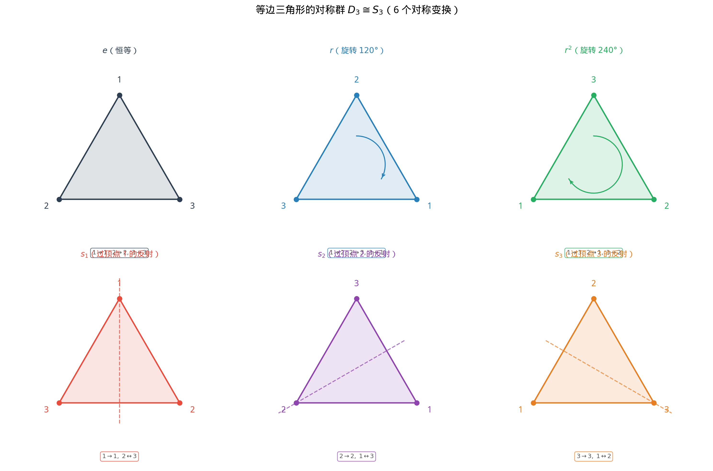

# §1 群的概念（The Concept of a Group）[Bridge]

**前置知识**：[Part 1 第 2 章 集合与关系](../../part-01-foundations/ch02-sets-relations/README.md)（集合、映射、等价关系）、[Part 2 第 3 章 §2 同余](../../part-02-numbers/ch03-number-theory/02-congruences.md)（$\mathbb{Z}/n\mathbb{Z}$）、[Part 3 第 4 章 §2](../ch04-complex-algebra/02-polar-form.md)（单位根）

**全景图**：抽象代数的起点是一个看似简单的观察：许多看起来完全不同的数学对象——整数的加法、矩阵的乘法、几何图形的对称变换——都满足同一组代数规律。群论将这些共同规律提炼为**四条公理**（封闭性、结合律、单位元、逆元），从而建立一个统一的理论框架。本节从最直觉的出发点——**几何图形的对称性**——开始，逐步引出群的定义、丰富的例子、子群的概念，并以 Lagrange 定理作结。

**预估学习时间**：约 6–8 小时

---

## 动机：对称性的代数

### 等边三角形的对称性

考虑一个等边三角形，顶点标记为 $1, 2, 3$（从顶部开始，顺时针排列）。

哪些操作能将这个三角形"映射到自身"（即操作后三角形占据的位置和形状不变，只是顶点的标号可能重新排列）？

1. **恒等变换** $e$：什么都不做。$1 \to 1, 2 \to 2, 3 \to 3$。
2. **逆时针旋转 $120°$** $r$：$1 \to 2, 2 \to 3, 3 \to 1$。
3. **逆时针旋转 $240°$** $r^2$：$1 \to 3, 2 \to 1, 3 \to 2$。
4. **关于过顶点 $1$ 的轴的反射** $s_1$：$1 \to 1, 2 \to 3, 3 \to 2$。
5. **关于过顶点 $2$ 的轴的反射** $s_2$：$1 \to 3, 2 \to 2, 3 \to 1$。
6. **关于过顶点 $3$ 的轴的反射** $s_3$：$1 \to 2, 2 \to 1, 3 \to 3$。

一共 $6$ 个对称变换。这不是巧合——$6 = 3!$，恰好是 $3$ 个元素的排列数。

### 对称变换的"乘法"

两个对称变换可以**复合**：先做一个，再做另一个。例如：

$$r \circ s_1: \quad 1 \xrightarrow{s_1} 1 \xrightarrow{r} 2, \quad 2 \xrightarrow{s_1} 3 \xrightarrow{r} 1, \quad 3 \xrightarrow{s_1} 2 \xrightarrow{r} 3$$

所以 $r \circ s_1$ 的效果是 $1 \to 2, 2 \to 1, 3 \to 3$，即 $r \circ s_1 = s_3$。

我们可以列出完整的"乘法表"（先做列，再做行）：

| $\circ$ | $e$ | $r$ | $r^2$ | $s_1$ | $s_2$ | $s_3$ |
|---------|-----|-----|-------|-------|-------|-------|
| $e$ | $e$ | $r$ | $r^2$ | $s_1$ | $s_2$ | $s_3$ |
| $r$ | $r$ | $r^2$ | $e$ | $s_3$ | $s_1$ | $s_2$ |
| $r^2$ | $r^2$ | $e$ | $r$ | $s_2$ | $s_3$ | $s_1$ |
| $s_1$ | $s_1$ | $s_2$ | $s_3$ | $e$ | $r$ | $r^2$ |
| $s_2$ | $s_2$ | $s_3$ | $s_1$ | $r^2$ | $e$ | $r$ |
| $s_3$ | $s_3$ | $s_1$ | $s_2$ | $r$ | $r^2$ | $e$ |

### 观察到的规律

1. **封闭性**：任意两个对称变换的复合仍然是一个对称变换。
2. **结合律**：$(f \circ g) \circ h = f \circ (g \circ h)$（函数复合总是结合的）。
3. **单位元**：恒等变换 $e$ 满足 $e \circ f = f \circ e = f$。
4. **逆元**：每个变换都有"反操作"。$r$ 的逆是 $r^2$（旋转 $240°$ 抵消 $120°$），$s_i$ 的逆是自身（反射两次回到原位）。
5. **不满足交换律**：$r \circ s_1 = s_3$，但 $s_1 \circ r = s_2$。$r \circ s_1 \neq s_1 \circ r$！

前四条规律正是群的公理。这个结构就是我们将要定义的"群"。

---

## 1. 群的定义（Definition of a Group）

### 1.1 二元运算

> **定义 1**（二元运算，binary operation）
>
> 集合 $G$ 上的一个**二元运算**是一个映射 $\cdot : G \times G \to G$，即对每一对 $(a, b) \in G \times G$，指定唯一的元素 $a \cdot b \in G$。
>
> 二元运算的**封闭性**：$a, b \in G \implies a \cdot b \in G$。

### 1.2 群的公理

> **定义 2**（群，group）
>
> 一个**群** $(G, \cdot)$ 由一个非空集合 $G$ 和 $G$ 上的二元运算 $\cdot$ 组成，满足以下四条公理：
>
> **(G1) 封闭性**（closure）：$\forall a, b \in G, \; a \cdot b \in G$
>
> **(G2) 结合律**（associativity）：$\forall a, b, c \in G, \; (a \cdot b) \cdot c = a \cdot (b \cdot c)$
>
> **(G3) 单位元**（identity element）：$\exists e \in G, \; \forall a \in G, \; e \cdot a = a \cdot e = a$
>
> **(G4) 逆元**（inverse element）：$\forall a \in G, \; \exists a^{-1} \in G, \; a \cdot a^{-1} = a^{-1} \cdot a = e$
>
> 若另外满足
>
> **(G5) 交换律**（commutativity）：$\forall a, b \in G, \; a \cdot b = b \cdot a$
>
> 则称 $(G, \cdot)$ 为**交换群**（commutative group）或 **Abel 群**（abelian group，得名于 Niels Henrik Abel）。

**注意**：(G1) 其实已经包含在"二元运算"的定义中（映射的像在 $G$ 中）。但为了清晰起见，我们仍将其单独列出。

### 1.3 单位元和逆元的唯一性

> **定理 1**（单位元的唯一性）
>
> 群 $(G, \cdot)$ 的单位元是唯一的。

> **证明**
>
> 设 $e$ 和 $e'$ 都是 $G$ 的单位元。则 $e = e \cdot e'$（因为 $e'$ 是单位元）$= e'$（因为 $e$ 是单位元）。$\blacksquare$

> **定理 2**（逆元的唯一性）
>
> 群 $(G, \cdot)$ 中每个元素的逆元是唯一的。

> **证明**
>
> 设 $b$ 和 $c$ 都是 $a$ 的逆元。则
>
> $$b = b \cdot e = b \cdot (a \cdot c) = (b \cdot a) \cdot c = e \cdot c = c$$
>
> （第三步用了结合律。）$\blacksquare$

> **定理 3**（消去律）
>
> 在群 $(G, \cdot)$ 中：
>
> - 若 $a \cdot b = a \cdot c$，则 $b = c$（**左消去律**）
> - 若 $b \cdot a = c \cdot a$，则 $b = c$（**右消去律**）

> **证明**
>
> $a \cdot b = a \cdot c \implies a^{-1} \cdot (a \cdot b) = a^{-1} \cdot (a \cdot c) \implies (a^{-1} \cdot a) \cdot b = (a^{-1} \cdot a) \cdot c \implies e \cdot b = e \cdot c \implies b = c$。右消去律类似。$\blacksquare$

> **命题 1**（逆元的运算法则）
>
> **(1)** $(a^{-1})^{-1} = a$
>
> **(2)** $(a \cdot b)^{-1} = b^{-1} \cdot a^{-1}$（"穿鞋脱鞋"法则——先穿的鞋后脱）

> **证明**
>
> **(1)** $a^{-1}$ 的逆元 $x$ 满足 $a^{-1} x = e$。由 $a^{-1} a = e$，知 $x = a$。
>
> **(2)** $(ab)(b^{-1}a^{-1}) = a(bb^{-1})a^{-1} = aea^{-1} = aa^{-1} = e$。因此 $(ab)^{-1} = b^{-1}a^{-1}$。$\blacksquare$

---

## 2. 群的例子

群的定义看起来很抽象，但它实际上无处不在。

### 2.1 $(\mathbb{Z}, +)$ — 整数加法群

- 集合：$\mathbb{Z} = \{\ldots, -2, -1, 0, 1, 2, \ldots\}$
- 运算：加法 $+$
- 封闭性：整数之和仍是整数。✓
- 结合律：$(a + b) + c = a + (b + c)$。✓
- 单位元：$0$，$a + 0 = 0 + a = a$。✓
- 逆元：$a$ 的逆元是 $-a$，$a + (-a) = 0$。✓
- 交换律：$a + b = b + a$。✓

因此 $(\mathbb{Z}, +)$ 是一个交换群（Abel 群）。

**注意**：$(\mathbb{Z}, \times)$ 不构成群——大多数整数没有乘法逆元（$2$ 的逆元 $1/2$ 不在 $\mathbb{Z}$ 中）。

### 2.2 $(\mathbb{Z}/n\mathbb{Z}, +)$ — 模 $n$ 整数加法群

- 集合：$\mathbb{Z}/n\mathbb{Z} = \{[0], [1], [2], \ldots, [n-1]\}$
- 运算：模 $n$ 加法 $[a] + [b] = [a + b]$
- 单位元：$[0]$
- $[a]$ 的逆元：$[n - a]$

这是一个有 $n$ 个元素的**有限**交换群。

**例子**：$\mathbb{Z}/4\mathbb{Z} = \{[0], [1], [2], [3]\}$，加法表：

| $+$ | $[0]$ | $[1]$ | $[2]$ | $[3]$ |
|-----|-------|-------|-------|-------|
| $[0]$ | $[0]$ | $[1]$ | $[2]$ | $[3]$ |
| $[1]$ | $[1]$ | $[2]$ | $[3]$ | $[0]$ |
| $[2]$ | $[2]$ | $[3]$ | $[0]$ | $[1]$ |
| $[3]$ | $[3]$ | $[0]$ | $[1]$ | $[2]$ |

### 2.3 $S_3$ — 三元对称群（置换群）

这正是动机部分讨论的等边三角形的对称群。

> **定义 3**（对称群，symmetric group）
>
> 集合 $\{1, 2, \ldots, n\}$ 的所有**置换**（双射 $\sigma: \{1,\ldots,n\} \to \{1,\ldots,n\}$）在函数复合运算下构成的群，称为 $n$ 元**对称群**（symmetric group），记作 $S_n$。
>
> $|S_n| = n!$

$S_3$ 有 $3! = 6$ 个元素。用**两行记号**表示：

$$e = \begin{pmatrix} 1 & 2 & 3 \\ 1 & 2 & 3 \end{pmatrix}, \quad r = \begin{pmatrix} 1 & 2 & 3 \\ 2 & 3 & 1 \end{pmatrix}, \quad r^2 = \begin{pmatrix} 1 & 2 & 3 \\ 3 & 1 & 2 \end{pmatrix}$$

$$s_1 = \begin{pmatrix} 1 & 2 & 3 \\ 1 & 3 & 2 \end{pmatrix}, \quad s_2 = \begin{pmatrix} 1 & 2 & 3 \\ 3 & 2 & 1 \end{pmatrix}, \quad s_3 = \begin{pmatrix} 1 & 2 & 3 \\ 2 & 1 & 3 \end{pmatrix}$$

等边三角形的对称群与 $S_3$ **同构**——它们作为抽象群完全一样！这是群论威力的第一个体现：不同的具体对象可以有相同的抽象结构。

$S_3$ 是最小的非交换群（$r \circ s_1 \neq s_1 \circ r$）。

### 2.4 $(\mathbb{R}^*, \times)$ — 非零实数乘法群

- 集合：$\mathbb{R}^* = \mathbb{R} \setminus \{0\}$
- 运算：乘法
- 单位元：$1$
- $a$ 的逆元：$1/a$

**为什么排除 $0$？** 因为 $0$ 没有乘法逆元。

类似地，$(\mathbb{Q}^*, \times)$ 和 $(\mathbb{C}^*, \times)$ 也是群。

### 2.5 $n$ 次单位根群

设 $\mu_n = \{z \in \mathbb{C} : z^n = 1\} = \{1, \omega, \omega^2, \ldots, \omega^{n-1}\}$，其中 $\omega = \text{cis}\frac{2\pi}{n}$。

$(\mu_n, \times)$ 在复数乘法下构成群：

- 封闭性：$\omega^a \cdot \omega^b = \omega^{a+b}$（指数模 $n$）
- 结合律：由复数乘法结合律
- 单位元：$\omega^0 = 1$
- 逆元：$(\omega^k)^{-1} = \omega^{n-k}$

$\mu_n$ 与 $\mathbb{Z}/n\mathbb{Z}$ 有着深刻的联系：映射 $[k] \mapsto \omega^k$ 是一个**群同构**（保运算的双射）。

### 2.6 反例：不构成群的例子

| 结构 | 为什么不是群 |
|------|-----------|
| $(\mathbb{Z}, \times)$ | $2$ 没有乘法逆元 |
| $(\mathbb{N}, +)$ | $1$ 没有加法逆元（$-1 \notin \mathbb{N}$） |
| $(\mathbb{R}, \times)$ | $0$ 没有乘法逆元 |
| $(\mathbb{Z}^+, -)$ | 减法不满足结合律，且 $1 - 2 = -1 \notin \mathbb{Z}^+$ |

---

## 3. 子群（Subgroup）

### 3.1 定义

> **定义 4**（子群，subgroup）
>
> 设 $(G, \cdot)$ 是群。非空子集 $H \subseteq G$ 若在 $G$ 的运算下自身也构成群，则称 $H$ 是 $G$ 的**子群**，记作 $H \leq G$。
>
> 若 $H \leq G$ 且 $H \neq G$，称 $H$ 是 $G$ 的**真子群**（proper subgroup），记作 $H < G$。

**注意**：$\{e\}$ 和 $G$ 本身总是 $G$ 的子群（称为**平凡子群**）。

### 3.2 子群判定法

验证一个子集是否是子群，不需要检验所有四条群公理——结合律自动继承。

> **定理 4**（子群判定法，subgroup test）
>
> 设 $G$ 是群，$H$ 是 $G$ 的非空子集。$H \leq G$ 当且仅当：
>
> **(1)** 对任意 $a, b \in H$，$a \cdot b \in H$（封闭性）
>
> **(2)** 对任意 $a \in H$，$a^{-1} \in H$（逆元封闭性）

> **证明**
>
> $(\Rightarrow)$：若 $H$ 是子群，则 (1)(2) 显然成立。
>
> $(\Leftarrow)$：结合律从 $G$ 继承。由 (2)，取 $a \in H$，$a^{-1} \in H$。由 (1)，$e = a \cdot a^{-1} \in H$。因此四条公理全部满足。$\blacksquare$

**更简洁的版本**（一步判定法）：

> **推论**：$\emptyset \neq H \subseteq G$ 是子群当且仅当：对任意 $a, b \in H$，$a \cdot b^{-1} \in H$。

### 3.3 子群的例子

**例题 1**. 证明偶数集合 $2\mathbb{Z} = \{\ldots, -4, -2, 0, 2, 4, \ldots\}$ 是 $(\mathbb{Z}, +)$ 的子群。

**解**：(1) 两个偶数之和仍是偶数：$2a + 2b = 2(a+b) \in 2\mathbb{Z}$。✓

(2) 偶数的相反数仍是偶数：$-(2a) = 2(-a) \in 2\mathbb{Z}$。✓

因此 $2\mathbb{Z} \leq \mathbb{Z}$。$\blacksquare$

更一般地，$n\mathbb{Z} = \{nk : k \in \mathbb{Z}\}$ 是 $(\mathbb{Z}, +)$ 的子群，对任意正整数 $n$。

**例题 2**. $\{e, r, r^2\}$ 是 $S_3$ 的子群。

**解**：$\{e, r, r^2\}$ 就是旋转构成的子集。由乘法表，$r \cdot r = r^2$，$r^2 \cdot r = e$，$r \cdot r^2 = e$，$r^2 \cdot r^2 = r$。封闭。$r$ 的逆是 $r^2$，$r^2$ 的逆是 $r$。满足子群判定法。✓

这个子群同构于 $\mathbb{Z}/3\mathbb{Z}$。

**例题 3**. $\{e, s_1\}$ 是 $S_3$ 的子群。

**解**：$s_1^2 = e$，所以 $\{e, s_1\}$ 对复合封闭，且 $s_1$ 的逆是自身。✓

类似地，$\{e, s_2\}$ 和 $\{e, s_3\}$ 也是子群。

**例题 4**. 正实数 $\mathbb{R}^+$ 是 $(\mathbb{R}^*, \times)$ 的子群。

**解**：正实数的乘积是正实数，正实数的倒数是正实数。✓

**例题 5**. $\mu_3 = \{1, \omega, \omega^2\}$（$\omega = \text{cis}\frac{2\pi}{3}$）是 $\mu_6$ 的子群。

**解**：$3$ 次单位根都是 $6$ 次单位根（因为若 $z^3 = 1$，则 $z^6 = (z^3)^2 = 1$），且它们在乘法下封闭。✓

---

## 4. 群的阶（Order）

### 4.1 群的阶

> **定义 5**（群的阶，order of a group）
>
> 群 $G$ 的**阶**是 $G$ 的元素个数，记作 $|G|$。若 $|G|$ 有限，称 $G$ 为**有限群**。

| 群 | 阶 |
|----|---|
| $(\mathbb{Z}, +)$ | $\infty$ |
| $(\mathbb{Z}/n\mathbb{Z}, +)$ | $n$ |
| $S_n$ | $n!$ |
| $\mu_n$ | $n$ |
| 等边三角形的对称群 | $6$ |

### 4.2 元素的阶

> **定义 6**（元素的阶，order of an element）
>
> 设 $a \in G$。满足 $a^n = e$ 的最小正整数 $n$ 称为 $a$ 的**阶**，记作 $\text{ord}(a) = n$ 或 $|a| = n$。若不存在这样的 $n$，则 $a$ 的阶为**无穷**。
>
> （这里 $a^n$ 表示 $\underbrace{a \cdot a \cdots a}_{n \text{ 个}}$。）

**例子**：

在 $(\mathbb{Z}/6\mathbb{Z}, +)$ 中（此处"$a^n$"应理解为 $\underbrace{a + a + \cdots + a}_{n}$）：

- $\text{ord}([1]) = 6$（$[1], [2], [3], [4], [5], [0]$ — 加了 $6$ 次回到 $[0]$）
- $\text{ord}([2]) = 3$（$[2], [4], [0]$）
- $\text{ord}([3]) = 2$（$[3], [0]$）
- $\text{ord}([0]) = 1$

在 $S_3$ 中：

- $\text{ord}(e) = 1$
- $\text{ord}(r) = 3$（$r, r^2, r^3 = e$）
- $\text{ord}(s_i) = 2$（$s_i^2 = e$）

> **命题 2**
>
> 设 $\text{ord}(a) = n$。则 $a^k = e$ 当且仅当 $n \mid k$。

> **证明**
>
> $(\Leftarrow)$：若 $k = nm$，则 $a^k = (a^n)^m = e^m = e$。
>
> $(\Rightarrow)$：设 $k = nq + r$（$0 \leq r < n$）。$a^r = a^{k - nq} = a^k (a^n)^{-q} = e \cdot e = e$。
> 因为 $n$ 是使 $a^n = e$ 的最小正整数，$0 \leq r < n$，所以 $r = 0$，即 $n \mid k$。$\blacksquare$

---

## 5. 陪集与 Lagrange 定理

### 5.1 陪集

> **定义 7**（左陪集，left coset）
>
> 设 $H \leq G$，$a \in G$。$a$ 关于 $H$ 的**左陪集**定义为
>
> $$aH = \{a \cdot h : h \in H\}$$
>
> 类似地，**右陪集** $Ha = \{h \cdot a : h \in H\}$。

**例题 6**. 在 $S_3$ 中，$H = \{e, r, r^2\}$。求所有左陪集。

**解**：$eH = \{e, r, r^2\} = H$。

$s_1 H = \{s_1 e, s_1 r, s_1 r^2\} = \{s_1, s_2, s_3\}$。

验证其他元素：$rH = \{r, r^2, e\} = H$（$r \in H$），$s_2 H = \{s_2, s_3, s_1\} = s_1 H$。

所以左陪集只有两个：$H$ 和 $\{s_1, s_2, s_3\}$。它们构成 $S_3$ 的一个**划分**。

### 5.2 陪集的性质

> **引理**（陪集的关键性质）
>
> 设 $H \leq G$。
>
> **(1)** $a \in aH$（因为 $a = a \cdot e$）
>
> **(2)** $aH = bH \iff a^{-1}b \in H \iff a$ 和 $b$ 属于同一个左陪集
>
> **(3)** 两个左陪集要么完全相同，要么完全不相交
>
> **(4)** 每个左陪集恰好有 $|H|$ 个元素

> **证明（关键步骤）**
>
> **(3)** 设 $aH \cap bH \neq \emptyset$，取 $c \in aH \cap bH$。则 $c = ah_1 = bh_2$，所以 $a = bh_2 h_1^{-1} \in bH$。对任意 $ah \in aH$，$ah = bh_2 h_1^{-1} h \in bH$。因此 $aH \subseteq bH$。对称地 $bH \subseteq aH$，故 $aH = bH$。
>
> **(4)** 映射 $\phi: H \to aH$，$\phi(h) = ah$，是双射（由消去律）。因此 $|aH| = |H|$。$\blacksquare$

因此，$G$ 的所有左陪集构成 $G$ 的一个**划分**——$G$ 被切成若干个大小相等、互不重叠的"块"。

### 5.3 Lagrange 定理

> **定理 5**（Lagrange 定理，Joseph-Louis Lagrange）
>
> 设 $G$ 是有限群，$H \leq G$。则
>
> $$|H| \;\big|\; |G|$$
>
> 即**子群的阶整除群的阶**。
>
> 更精确地：$|G| = |H| \cdot [G : H]$，其中 $[G : H]$ 是 $H$ 在 $G$ 中的**指标**（index）——即左陪集的个数。

> **证明**
>
> $G$ 被分成若干个不相交的左陪集：$G = a_1 H \cup a_2 H \cup \cdots \cup a_k H$。
>
> 每个陪集有 $|H|$ 个元素，共 $k$ 个陪集，因此 $|G| = k |H|$。
>
> 故 $|H| \mid |G|$，且 $k = [G : H] = |G| / |H|$。$\blacksquare$

### 5.4 Lagrange 定理的推论

> **推论 1**：元素的阶整除群的阶：$\text{ord}(a) \mid |G|$。

> **证明**：$a$ 生成的子群 $\langle a \rangle = \{e, a, a^2, \ldots, a^{n-1}\}$（$n = \text{ord}(a)$）是 $G$ 的子群，且 $|\langle a \rangle| = n$。由 Lagrange，$n \mid |G|$。$\blacksquare$

> **推论 2**：对任意 $a \in G$，$a^{|G|} = e$。

> **证明**：设 $n = \text{ord}(a)$。由推论 1，$n \mid |G|$，设 $|G| = nm$。则 $a^{|G|} = (a^n)^m = e^m = e$。$\blacksquare$

> **推论 3**：素数阶群只有平凡子群。若 $|G| = p$（$p$ 为素数），则 $G$ 的子群只有 $\{e\}$ 和 $G$。

> **证明**：子群 $H$ 的阶整除 $p$，而 $p$ 的因子只有 $1$ 和 $p$。$\blacksquare$

**联系 Fermat 小定理**：在 Part 2 Ch03 中我们证明了 Fermat 小定理：若 $p$ 是素数且 $\gcd(a, p) = 1$，则 $a^{p-1} \equiv 1 \pmod{p}$。

这恰好是 Lagrange 定理推论 2 在群 $(\mathbb{Z}/p\mathbb{Z})^* = \{[1], [2], \ldots, [p-1]\}$ 上的应用——$|(\mathbb{Z}/p\mathbb{Z})^*| = p - 1$，所以 $[a]^{p-1} = [1]$。

Lagrange 定理揭示了 Fermat 小定理的**真正来源**：它不是数论的偶然结果，而是群论的一般定理在特定群上的表现。

**例题 7**. 一个 $12$ 阶群的子群可能有多少个元素？

**解**：由 Lagrange 定理，子群的阶必须整除 $12$。$12$ 的因子为 $1, 2, 3, 4, 6, 12$。

所以子群的阶只能是 $1, 2, 3, 4, 6, 12$。

注意：Lagrange 定理的逆不一定成立——$|G|$ 的某个因子不一定对应一个子群。例如 $A_4$（$12$ 阶交错群）没有 $6$ 阶子群。

---

## 6. 联系：变换几何与群

几何变换在复合运算下自然构成群。这一联系将在 Part 5 第 4 章中详细展开。

| 变换类型 | 群 | 注解 |
|---------|-----|------|
| 平面旋转（绕原点） | $(\text{SO}(2), \circ)$ | 交换群，同构于 $(\mathbb{R}/2\pi\mathbb{Z}, +)$ |
| 平面等距变换 | 欧几里得群 $E(2)$ | 包含旋转、平移、反射 |
| 正 $n$ 边形的对称 | 二面体群 $D_n$ | $|D_n| = 2n$（$n$ 个旋转 + $n$ 个反射） |
| $n$ 个元素的置换 | $S_n$ | $|S_n| = n!$ |

等边三角形的对称群 = $D_3 \cong S_3$。正方形的对称群 = $D_4$（$8$ 个元素，$4$ 个旋转 + $4$ 个反射）。

复数的极坐标乘法提供了理解旋转群的完美工具：旋转角 $\theta$ 对应乘以 $\text{cis}\,\theta$。

---

## 要点回顾

| 概念/结论 | 要点 |
|-----------|------|
| 群的定义 | 集合 + 二元运算 + 四条公理（封闭、结合、单位元、逆元） |
| Abel 群 | 额外满足交换律的群 |
| 典型例子 | $(\mathbb{Z}, +)$、$(\mathbb{Z}/n\mathbb{Z}, +)$、$S_n$、$(\mathbb{R}^*, \times)$、$\mu_n$ |
| 子群 | 子集 + 继承运算 + 自身构成群 |
| 子群判定法 | 非空 + 封闭性 + 逆元封闭 |
| 元素的阶 | $\text{ord}(a) = $ 使 $a^n = e$ 的最小正整数 |
| Lagrange 定理 | $H \leq G \implies \|H\| \mid \|G\|$ |
| 推论 | $\text{ord}(a) \mid \|G\|$；$a^{\|G\|} = e$；素数阶群无真子群 |

---

## 进度检查点

完成本节后，你应该能够：

- [ ] 从对称性的直觉出发解释群的动机
- [ ] 陈述群的四条公理
- [ ] 证明单位元和逆元的唯一性
- [ ] 验证 $(\mathbb{Z}, +)$、$(\mathbb{Z}/n\mathbb{Z}, +)$、$S_3$、$(\mathbb{R}^*, \times)$ 是群
- [ ] 使用子群判定法
- [ ] 计算元素的阶
- [ ] 陈述和证明 Lagrange 定理
- [ ] 解释 Fermat 小定理如何从 Lagrange 定理得出

---

## 自测题

**问题 1**. $(\mathbb{Q}, \times)$ 是否构成群？为什么？

查看答案

不是。$0 \in \mathbb{Q}$ 没有乘法逆元。

但如果排除 $0$：$(\mathbb{Q}^*, \times)$ 构成群，其中 $a$ 的逆元为 $1/a$。

**问题 2**. 在 $(\mathbb{Z}/8\mathbb{Z}, +)$ 中，求每个元素的阶。

查看答案

- $\text{ord}([0]) = 1$
- $\text{ord}([1]) = 8$
- $\text{ord}([2]) = 4$（$[2]+[2]+[2]+[2] = [8] = [0]$）
- $\text{ord}([3]) = 8$
- $\text{ord}([4]) = 2$
- $\text{ord}([5]) = 8$
- $\text{ord}([6]) = 4$
- $\text{ord}([7]) = 8$

注意：所有阶都整除 $|G| = 8$，验证了 Lagrange 定理的推论。

**问题 3**. 列出 $S_3$ 的所有子群。

查看答案

由 Lagrange 定理，$S_3$（阶 $6$）的子群阶只能是 $1, 2, 3, 6$。

- 阶 $1$：$\{e\}$
- 阶 $2$：$\{e, s_1\}$，$\{e, s_2\}$，$\{e, s_3\}$（三个）
- 阶 $3$：$\{e, r, r^2\}$（唯一一个）
- 阶 $6$：$S_3$ 本身

共 $6$ 个子群。

**问题 4**. 设 $G$ 是 $7$ 阶群。证明 $G$ 是交换群。

查看答案

$7$ 是素数。取任意 $a \in G$，$a \neq e$。由 Lagrange 推论，$\text{ord}(a)$ 整除 $7$，而 $\text{ord}(a) > 1$（因为 $a \neq e$），所以 $\text{ord}(a) = 7$。

因此 $\langle a \rangle = \{e, a, a^2, \ldots, a^6\} = G$（子群 $\langle a \rangle$ 有 $7$ 个元素，等于 $G$）。

$G = \langle a \rangle$ 是**循环群**。循环群一定是交换群：$a^m \cdot a^n = a^{m+n} = a^n \cdot a^m$。$\blacksquare$

**问题 5**. 为什么 Lagrange 定理的逆不成立？

查看答案

Lagrange 定理说"子群的阶整除群的阶"，逆命题是"群的阶的每个因子都对应一个子群"。

反例：$A_4$（$4$ 元交错群，由偶置换组成，阶为 $12$）没有阶为 $6$ 的子群，尽管 $6 \mid 12$。

注意：对有限 Abel 群，Lagrange 定理的逆确实成立（这是 Cauchy 定理和有限 Abel 群结构定理的推论）。

---

## 习题引用

本节的配套练习见 [练习题](exercises/exercises.md)。
