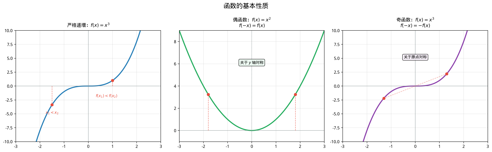

# §1 函数概念深化（Function Concepts Deepened）

**前置知识**：[Part 1 第 2 章 集合](../../part-01-foundations/ch02-sets/README.md)（函数的集合论定义、关系）、[Part 2 第 1 章 数系](../../part-02-numbers/ch01-number-systems/README.md)（实数性质）

**全景图**：在 Part 1 中，我们定义了函数为满足"每个输入恰有一个输出"的特殊关系。那是一个极度抽象的定义——它适用于任何集合之间的对应。现在，我们将目光聚焦于**实函数**（从 $\mathbb{R}$ 的子集到 $\mathbb{R}$ 的函数），研究它们的具体性质：单调性告诉我们函数的增减行为，有界性告诉我们函数值的范围，奇偶性揭示函数的对称结构，周期性描述函数的重复模式。这些性质构成了分析函数行为的基本框架。

**预估学习时间**：约 2–2.5 小时

---

## 动机

想象你在观测一个物理量随时间的变化——比如一天中的气温。你自然会问：

- 气温在什么时间段上升？什么时间段下降？（**单调性**）
- 气温有没有一个上限或下限？（**有界性**）
- 今天的气温曲线和昨天的是否相似？（**周期性**）
- 气温曲线关于某个时刻对称吗？（**对称性**）

这些问题对应的正是函数的基本性质。在正式定义之前，让我们先回顾函数的基本概念。

---

## 1. 从集合论到具体：函数的基本要素

### 1.1 回顾：函数的集合论定义

在 Part 1 中，我们定义了：

> **定义 1**（函数，function）
>
> 设 $A, B$ 为非空集合。一个从 $A$ 到 $B$ 的**函数** $f: A \to B$ 是一个关系 $f \subseteq A \times B$，满足：对每个 $a \in A$，恰好存在一个 $b \in B$ 使得 $(a, b) \in f$。
>
> 此时记 $b = f(a)$，称 $a$ 为**自变量**（independent variable），$b$ 为**因变量**（dependent variable）或 $a$ 在 $f$ 下的**像**（image）。

这个定义精确但抽象。在实际应用中，我们通常用一个**表达式**（如 $f(x) = x^2 + 1$）或一个**规则**来描述函数。

### 1.2 定义域、陪域与值域

> **定义 2**（定义域、陪域、值域）
>
> 设 $f: A \to B$ 为一个函数。
>
> - $A$ 称为 $f$ 的**定义域**（domain），记为 $\text{dom}(f)$。
> - $B$ 称为 $f$ 的**陪域**（codomain）。
> - 集合 $f(A) = \{f(x) : x \in A\} \subseteq B$ 称为 $f$ 的**值域**（range）或**像**（image），记为 $\text{ran}(f)$ 或 $\text{im}(f)$。

**关键区分**：值域 $\text{ran}(f)$ 是陪域 $B$ 的子集，但未必等于 $B$。例如，$f: \mathbb{R} \to \mathbb{R}$ 定义为 $f(x) = x^2$，其陪域为 $\mathbb{R}$，但值域为 $[0, +\infty)$——没有负数出现在输出中。

### 1.3 自然定义域

当函数由表达式给出但未明确指定定义域时，我们取使表达式有意义的最大实数子集，称为**自然定义域**（natural domain）。

**例题 1**. 求下列函数的自然定义域。

(a) $f(x) = \sqrt{x - 2}$

要求被开方数非负：$x - 2 \geq 0$，即 $x \geq 2$。定义域为 $[2, +\infty)$。

(b) $g(x) = \frac{1}{x^2 - 4}$

要求分母不为零：$x^2 - 4 \neq 0$，即 $x \neq \pm 2$。定义域为 $\mathbb{R} \setminus \{-2, 2\}$。

(c) $h(x) = \ln(x) + \sqrt{1 - x}$

要求 $x > 0$（对数的定义域）且 $1 - x \geq 0$（根号的定义域），即 $0 < x \leq 1$。定义域为 $(0, 1]$。

### 1.4 函数的图像

> **定义 3**（函数的图像，graph of a function）
>
> 函数 $f: A \to \mathbb{R}$ 的**图像**（graph）是平面上的点集
>
> $$\text{Graph}(f) = \{(x, f(x)) : x \in A\} \subseteq \mathbb{R}^2$$

图像是函数的"可视化表达"。反过来，一条平面曲线是某个函数的图像，当且仅当它通过以下检验：

> **命题 1**（垂直线检验，vertical line test）
>
> 平面上的曲线 $C$ 是某个函数 $y = f(x)$ 的图像，当且仅当每条垂直线 $x = a$ 至多与 $C$ 交于一点。

**直觉**：函数要求"每个输入恰有一个输出"。如果某条垂直线与曲线交于两点 $(a, b_1)$ 和 $(a, b_2)$（$b_1 \neq b_2$），则 $a$ 有两个输出，违反了函数的定义。

**例**：单位圆 $x^2 + y^2 = 1$ 不是函数的图像（垂直线 $x = 0$ 与它交于 $(0, 1)$ 和 $(0, -1)$ 两点）。但上半圆 $y = \sqrt{1 - x^2}$ 是函数的图像。

---

## 2. 单调性（Monotonicity）

### 2.1 定义

> **定义 4**（单调函数，monotone function）
>
> 设 $f$ 是定义在区间 $I$ 上的函数。
>
> - 若对所有 $x_1, x_2 \in I$，$x_1 < x_2 \implies f(x_1) < f(x_2)$，则称 $f$ 在 $I$ 上**严格递增**（strictly increasing）。
> - 若对所有 $x_1, x_2 \in I$，$x_1 < x_2 \implies f(x_1) > f(x_2)$，则称 $f$ 在 $I$ 上**严格递减**（strictly decreasing）。
> - 若对所有 $x_1, x_2 \in I$，$x_1 < x_2 \implies f(x_1) \leq f(x_2)$，则称 $f$ 在 $I$ 上**（非严格）递增**（non-decreasing）。
> - 若对所有 $x_1, x_2 \in I$，$x_1 < x_2 \implies f(x_1) \geq f(x_2)$，则称 $f$ 在 $I$ 上**（非严格）递减**（non-increasing）。
>
> 严格递增或严格递减的函数统称为**严格单调函数**（strictly monotone function）。

### 2.2 证明单调性

证明函数在某区间上单调，需要回到定义：取两个满足 $x_1 < x_2$ 的元素，证明 $f(x_1)$ 与 $f(x_2)$ 之间的不等关系。

**例题 2**. 证明 $f(x) = x^2$ 在 $[0, +\infty)$ 上严格递增。

**证明**：设 $0 \leq x_1 < x_2$，需证 $f(x_1) < f(x_2)$，即 $x_1^2 < x_2^2$。

$$x_2^2 - x_1^2 = (x_2 - x_1)(x_2 + x_1)$$

由于 $x_2 > x_1 \geq 0$，有 $x_2 - x_1 > 0$ 且 $x_2 + x_1 > 0$，因此 $x_2^2 - x_1^2 > 0$，即 $x_1^2 < x_2^2$。$\blacksquare$

**注意**：同样的方法可以证明 $f(x) = x^2$ 在 $(-\infty, 0]$ 上严格递减。因此 $f(x) = x^2$ 在整个 $\mathbb{R}$ 上**既不递增也不递减**——它先减后增。

### 2.3 差值法与商值法

判断单调性的两种常用技巧：

**差值法**：计算 $f(x_2) - f(x_1)$，判断其符号。

**商值法**（适用于正值函数）：计算 $\frac{f(x_2)}{f(x_1)}$，判断是否大于或小于 $1$。

**例题 3**. 证明 $f(x) = \frac{x}{x+1}$ 在 $(0, +\infty)$ 上严格递增。

**证明**：设 $0 < x_1 < x_2$。

$$f(x_2) - f(x_1) = \frac{x_2}{x_2 + 1} - \frac{x_1}{x_1 + 1} = \frac{x_2(x_1 + 1) - x_1(x_2 + 1)}{(x_2 + 1)(x_1 + 1)}$$

$$= \frac{x_2 x_1 + x_2 - x_1 x_2 - x_1}{(x_2 + 1)(x_1 + 1)} = \frac{x_2 - x_1}{(x_2 + 1)(x_1 + 1)}$$

由于 $x_2 > x_1 > 0$，分子 $x_2 - x_1 > 0$，分母 $(x_2 + 1)(x_1 + 1) > 0$，因此 $f(x_2) - f(x_1) > 0$。$\blacksquare$

---

## 3. 有界性（Boundedness）

### 3.1 定义

> **定义 5**（有界函数，bounded function）
>
> 设 $f$ 定义在集合 $D$ 上。
>
> - 若存在实数 $M$ 使得对所有 $x \in D$，$f(x) \leq M$，则称 $f$ **有上界**（bounded above），$M$ 为一个**上界**。
> - 若存在实数 $m$ 使得对所有 $x \in D$，$f(x) \geq m$，则称 $f$ **有下界**（bounded below），$m$ 为一个**下界**。
> - 若 $f$ 既有上界又有下界，则称 $f$ **有界**（bounded）。等价地，存在 $K > 0$ 使得对所有 $x \in D$，$|f(x)| \leq K$。

### 3.2 上确界与下确界

在有界函数中，最好的（最紧的）上界和下界有特殊的名称：

> **定义 6**（上确界与下确界）
>
> 设 $f$ 定义在 $D$ 上。
>
> - 若 $f$ 有上界，则所有上界中最小的称为 $f$ 的**上确界**（supremum），记为 $\sup_{x \in D} f(x)$。
> - 若 $f$ 有下界，则所有下界中最大的称为 $f$ 的**下确界**（infimum），记为 $\inf_{x \in D} f(x)$。

**与最大值/最小值的区别**：上确界未必是函数实际取到的值。例如 $f(x) = \frac{x}{x+1}$ 在 $(0, +\infty)$ 上的上确界为 $1$（当 $x \to +\infty$ 时 $f(x) \to 1$），但 $f$ 从不等于 $1$。此时 $\sup f = 1$ 但 $\max f$ 不存在。

**例题 4**. 讨论 $f(x) = \frac{1}{1 + x^2}$ 在 $\mathbb{R}$ 上的有界性。

**解**：对所有 $x \in \mathbb{R}$：
- $1 + x^2 \geq 1$，因此 $f(x) = \frac{1}{1 + x^2} \leq 1$，上界为 $1$。
- $f(x) > 0$（分子和分母都是正数），下界为 $0$。

因此 $f$ 有界，且 $0 < f(x) \leq 1$。

当 $x = 0$ 时 $f(0) = 1$，所以 $\sup f = \max f = 1$。当 $x \to \pm\infty$ 时 $f(x) \to 0$ 但不等于 $0$，所以 $\inf f = 0$ 但 $\min f$ 不存在。

---

## 4. 奇偶性（Parity / Even-Odd Symmetry）

### 4.1 定义

> **定义 7**（奇函数与偶函数）
>
> 设 $f$ 的定义域 $D$ 关于原点对称（即 $x \in D \iff -x \in D$）。
>
> - 若对所有 $x \in D$，$f(-x) = f(x)$，则称 $f$ 为**偶函数**（even function）。
> - 若对所有 $x \in D$，$f(-x) = -f(x)$，则称 $f$ 为**奇函数**（odd function）。

### 4.2 几何意义

- **偶函数**的图像关于 **$y$ 轴**对称。将图像沿 $y$ 轴翻折，它与自身重合。
- **奇函数**的图像关于**原点**对称（中心对称）。将图像绕原点旋转 $180°$，它与自身重合。

### 4.3 基本性质

> **命题 2**（奇偶性的基本性质）
>
> (a) 若 $f$ 是奇函数且 $0 \in \text{dom}(f)$，则 $f(0) = 0$。
>
> (b) 唯一既是奇函数又是偶函数的函数是零函数 $f(x) = 0$（在对称于原点的定义域上）。
>
> (c) 两个偶函数的和、差、积仍为偶函数；两个奇函数的和、差仍为奇函数，积为偶函数。

> **证明**（命题 2(a)）
>
> 设 $f$ 为奇函数且 $0 \in \text{dom}(f)$。由奇函数定义，$f(-0) = -f(0)$，即 $f(0) = -f(0)$，因此 $2f(0) = 0$，即 $f(0) = 0$。$\blacksquare$

> **证明**（命题 2(b)）
>
> 设 $f$ 既是奇函数又是偶函数。则对所有 $x$，$f(-x) = f(x)$（偶）且 $f(-x) = -f(x)$（奇）。因此 $f(x) = -f(x)$，即 $2f(x) = 0$，故 $f(x) = 0$。$\blacksquare$

### 4.4 常见例子

| 函数 | 奇偶性 | 验证 |
|------|--------|------|
| $f(x) = x^2$ | 偶 | $f(-x) = (-x)^2 = x^2 = f(x)$ |
| $f(x) = x^3$ | 奇 | $f(-x) = (-x)^3 = -x^3 = -f(x)$ |
| $f(x) = |x|$ | 偶 | $f(-x) = |-x| = |x| = f(x)$ |
| $f(x) = x^2 + x$ | 非奇非偶 | $f(-x) = x^2 - x \neq f(x)$ 且 $\neq -f(x)$ |

**例题 5**. 判断 $f(x) = \frac{x}{x^2 + 1}$ 的奇偶性。

**解**：定义域为 $\mathbb{R}$（$x^2 + 1 > 0$ 恒成立），关于原点对称。

$$f(-x) = \frac{-x}{(-x)^2 + 1} = \frac{-x}{x^2 + 1} = -f(x)$$

因此 $f$ 是**奇函数**。

### 4.5 任意函数的奇偶分解

> **定理 1**（奇偶分解）
>
> 设 $f$ 的定义域关于原点对称。则 $f$ 可以唯一地表示为一个偶函数与一个奇函数之和：
>
> $$f(x) = \underbrace{\frac{f(x) + f(-x)}{2}}_{f_e(x),\;\text{偶部分}} + \underbrace{\frac{f(x) - f(-x)}{2}}_{f_o(x),\;\text{奇部分}}$$

> **证明**
>
> **验证 $f_e$ 是偶函数**：$f_e(-x) = \frac{f(-x) + f(x)}{2} = f_e(x)$。✓
>
> **验证 $f_o$ 是奇函数**：$f_o(-x) = \frac{f(-x) - f(x)}{2} = -\frac{f(x) - f(-x)}{2} = -f_o(x)$。✓
>
> **验证 $f_e + f_o = f$**：$f_e(x) + f_o(x) = \frac{f(x) + f(-x)}{2} + \frac{f(x) - f(-x)}{2} = f(x)$。✓
>
> **唯一性**：设 $f = g + h$，其中 $g$ 为偶、$h$ 为奇。则 $f(x) = g(x) + h(x)$ 且 $f(-x) = g(x) - h(x)$。两式相加得 $g(x) = \frac{f(x) + f(-x)}{2} = f_e(x)$，两式相减得 $h(x) = \frac{f(x) - f(-x)}{2} = f_o(x)$。$\blacksquare$

**例**：$f(x) = e^x$ 可分解为

$$e^x = \underbrace{\frac{e^x + e^{-x}}{2}}_{\cosh x} + \underbrace{\frac{e^x - e^{-x}}{2}}_{\sinh x}$$

这正是双曲余弦和双曲正弦函数！

---

## 5. 周期性（Periodicity）

### 5.1 定义

> **定义 8**（周期函数，periodic function）
>
> 设 $f: \mathbb{R} \to \mathbb{R}$。若存在正数 $T > 0$ 使得对所有 $x \in \mathbb{R}$，
>
> $$f(x + T) = f(x)$$
>
> 则称 $f$ 为**周期函数**（periodic function），$T$ 称为 $f$ 的一个**周期**（period）。满足条件的最小正数 $T$（若存在）称为 $f$ 的**最小正周期**（fundamental period）。

### 5.2 基本性质

> **命题 3**（周期性的基本性质）
>
> (a) 若 $T$ 是 $f$ 的一个周期，则 $nT$（$n \in \mathbb{Z}^+$）也是 $f$ 的周期。
>
> (b) 若 $T_1, T_2$ 都是 $f$ 的周期，则 $T_1 + T_2$ 也是 $f$ 的周期。
>
> (c) 常函数 $f(x) = c$ 是周期函数（任何正数都是它的周期），但没有最小正周期。

> **证明**（命题 3(a)）
>
> 对 $n$ 用数学归纳法。$n = 1$ 时显然。设 $kT$ 为周期，则 $f(x + (k+1)T) = f((x + kT) + T) = f(x + kT) = f(x)$。$\blacksquare$

### 5.3 常见例子

最典型的周期函数是三角函数（将在第 3 章详细讨论）：

- $\sin x$ 和 $\cos x$ 的最小正周期为 $2\pi$。
- $\tan x$ 的最小正周期为 $\pi$。

**例题 6**. 证明 Dirichlet 函数

$$D(x) = \begin{cases} 1, & x \in \mathbb{Q} \\ 0, & x \notin \mathbb{Q} \end{cases}$$

是周期函数，且任何正有理数都是它的周期，但没有最小正周期。

**证明**：设 $r \in \mathbb{Q}$，$r > 0$。对任意 $x$：
- 若 $x \in \mathbb{Q}$，则 $x + r \in \mathbb{Q}$（有理数的加法封闭），因此 $D(x + r) = 1 = D(x)$。
- 若 $x \notin \mathbb{Q}$，则 $x + r \notin \mathbb{Q}$（否则 $x = (x + r) - r$ 为两个有理数之差，也是有理数，矛盾），因此 $D(x + r) = 0 = D(x)$。

所以任何正有理数 $r$ 都是 $D$ 的周期。但对任何正有理数 $r$，$r/2$ 仍为正有理数且 $r/2 < r$，因此不存在最小正周期。$\blacksquare$

---

## 6. 函数的运算

### 6.1 四则运算

> **定义 9**（函数的算术运算）
>
> 设 $f, g$ 的定义域分别为 $D_f, D_g$，$D = D_f \cap D_g \neq \emptyset$。在 $D$ 上定义：
>
> - $(f + g)(x) = f(x) + g(x)$
> - $(f - g)(x) = f(x) - g(x)$
> - $(f \cdot g)(x) = f(x) \cdot g(x)$
> - $\left(\frac{f}{g}\right)(x) = \frac{f(x)}{g(x)}$，定义域为 $\{x \in D : g(x) \neq 0\}$

### 6.2 性质的保持

> **命题 4**（运算对奇偶性的影响）
>
> 设 $f, g$ 的定义域都关于原点对称。
>
> | $f$ | $g$ | $f + g$ | $f \cdot g$ |
> |-----|-----|---------|-------------|
> | 偶 | 偶 | 偶 | 偶 |
> | 奇 | 奇 | 奇 | 偶 |
> | 偶 | 奇 | 非奇非偶（一般） | 奇 |

**例**：$f(x) = x^2$（偶）与 $g(x) = x^3$（奇）的积 $f(x) \cdot g(x) = x^5$ 是奇函数。✓

---

## 7. 函数性质的综合分析

将上述性质综合运用，可以高效地分析一个函数的全貌。

**例题 7**. 分析 $f(x) = \frac{2x}{x^2 + 1}$ 的性质。

**解**：

**(1) 定义域**：$x^2 + 1 > 0$ 对所有 $x \in \mathbb{R}$ 成立，定义域为 $\mathbb{R}$。

**(2) 奇偶性**：$f(-x) = \frac{2(-x)}{(-x)^2 + 1} = \frac{-2x}{x^2 + 1} = -f(x)$。奇函数。

**(3) 有界性**：由 AM-GM 不等式（Part 3），对 $x > 0$：

$$x^2 + 1 \geq 2\sqrt{x^2 \cdot 1} = 2|x|$$

因此

$$|f(x)| = \frac{2|x|}{x^2 + 1} \leq \frac{2|x|}{2|x|} = 1$$

等号当 $x^2 = 1$，即 $x = \pm 1$ 时成立。所以 $f$ 有界，$|f(x)| \leq 1$，且 $f(1) = 1$，$f(-1) = -1$。

**(4) 单调性**：设 $x_1 < x_2$。

$$f(x_2) - f(x_1) = \frac{2x_2}{x_2^2 + 1} - \frac{2x_1}{x_1^2 + 1} = \frac{2x_2(x_1^2 + 1) - 2x_1(x_2^2 + 1)}{(x_2^2 + 1)(x_1^2 + 1)}$$

分子 $= 2(x_2 x_1^2 + x_2 - x_1 x_2^2 - x_1) = 2[(x_2 - x_1) - x_1 x_2(x_2 - x_1)] = 2(x_2 - x_1)(1 - x_1 x_2)$

- 当 $x_1 x_2 < 1$ 时（特别是 $-1 < x_1 < x_2 < 1$ 时），$f(x_2) - f(x_1) > 0$，$f$ 递增。
- 当 $x_1 x_2 > 1$ 时（例如 $1 < x_1 < x_2$ 时），$f(x_2) - f(x_1) < 0$，$f$ 递减。

因此 $f$ 在 $(-1, 1)$ 上严格递增，在 $(1, +\infty)$ 上严格递减，在 $(-\infty, -1)$ 上严格递减。

---

## 要点回顾

1. 函数 $f: A \to B$ 的**定义域**是 $A$，**陪域**是 $B$，**值域**是 $f(A) \subseteq B$；三者应明确区分。
2. **垂直线检验**：曲线是函数图像当且仅当每条垂直线与之至多交于一点。
3. **单调性**的证明需回到定义：取 $x_1 < x_2$，证明 $f(x_1)$ 与 $f(x_2)$ 的大小关系。差值法和商值法是常用工具。
4. **有界性**：$|f(x)| \leq K$ 对所有 $x$ 成立。上确界和下确界是"最紧"的界。
5. **奇偶性**要求定义域关于原点对称。偶函数图像关于 $y$ 轴对称，奇函数图像关于原点对称。
6. **周期性**：$f(x + T) = f(x)$ 对所有 $x$ 成立。最小正周期是满足此条件的最小正数 $T$。
7. 任何定义域对称的函数可**唯一分解**为偶函数与奇函数之和。

---

## 进度检查点

在继续之前，确认你能够：

- [ ] 根据表达式确定函数的自然定义域
- [ ] 用定义证明函数在给定区间上的单调性
- [ ] 判断函数的有界性，并求出上确界和下确界
- [ ] 判断并证明函数的奇偶性
- [ ] 理解周期函数和最小正周期的概念
- [ ] 对给定函数进行奇偶分解

---

## 自测题

**自测题 1**：求函数 $f(x) = \frac{\sqrt{x+3}}{x-1}$ 的自然定义域。

答案

需要 $x + 3 \geq 0$ 且 $x - 1 \neq 0$，即 $x \geq -3$ 且 $x \neq 1$。

定义域为 $[-3, 1) \cup (1, +\infty)$。

**自测题 2**：证明 $f(x) = x^3 + x$ 在 $\mathbb{R}$ 上严格递增。

答案

设 $x_1 < x_2$。

$$f(x_2) - f(x_1) = (x_2^3 - x_1^3) + (x_2 - x_1)$$

$$= (x_2 - x_1)(x_2^2 + x_1 x_2 + x_1^2) + (x_2 - x_1)$$

$$= (x_2 - x_1)(x_2^2 + x_1 x_2 + x_1^2 + 1)$$

$x_2 - x_1 > 0$。对于 $x_2^2 + x_1 x_2 + x_1^2 + 1$，注意

$$x_2^2 + x_1 x_2 + x_1^2 = \left(x_1 + \frac{x_2}{2}\right)^2 + \frac{3x_2^2}{4} \geq 0$$

所以 $x_2^2 + x_1 x_2 + x_1^2 + 1 \geq 1 > 0$。

因此 $f(x_2) - f(x_1) > 0$，$f$ 严格递增。$\blacksquare$

**自测题 3**：判断 $f(x) = x|x|$ 的奇偶性。

答案

定义域为 $\mathbb{R}$，关于原点对称。

$f(-x) = (-x)|{-x}| = (-x)|x| = -(x|x|) = -f(x)$。

$f$ 是**奇函数**。

直觉：当 $x \geq 0$ 时 $f(x) = x^2$，当 $x < 0$ 时 $f(x) = -x^2$。图像关于原点对称。

**自测题 4**：设 $f(x+2) = f(x)$ 对所有 $x$ 成立，且 $f(3) = 5$。求 $f(7)$ 和 $f(-1)$。

答案

$f$ 的周期为 $2$（或 $2$ 的因子）。

$f(7) = f(7 - 2) = f(5) = f(5 - 2) = f(3) = 5$。

$f(-1) = f(-1 + 2) = f(1) = f(1 + 2) = f(3) = 5$。

---

## 习题引用

完成本节学习后，请前往 [练习题](exercises/exercises.md) 的 §1 部分进行练习。
