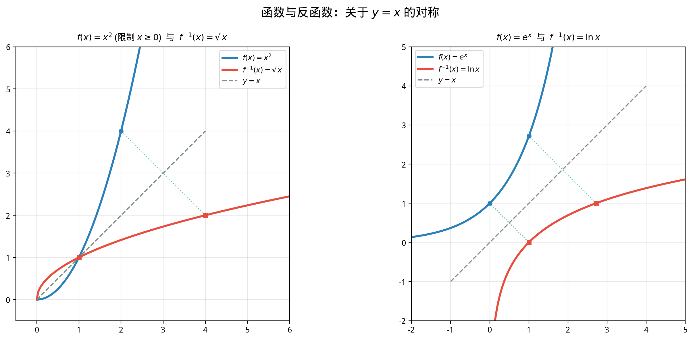

# §2 复合函数与反函数（Composition and Inverse Functions）

**前置知识**：[§1 函数概念深化](01-function-deep.md)、[Part 1 第 2 章 集合](../../part-01-foundations/ch02-sets/README.md)（单射、满射、双射）、[Part 3 第 1 章 方程](../../part-03-algebra/ch01-equations/README.md)（方程求解）

**全景图**：复合函数和反函数是构建新函数的两种基本操作。复合函数将两个函数"串联"——先通过一个函数变换，再将结果送入另一个函数。反函数则"反转"一个函数——从输出回推输入。这两个概念在后续的指数与对数（互为反函数）、三角与反三角（互为反函数）中反复出现，是理解这些函数对偶性的关键。

**预估学习时间**：约 2–2.5 小时

---

## 动机

考虑一个将摄氏温度转化为华氏温度的函数 $F(C) = \frac{9}{5}C + 32$，和一个将华氏温度转化为某种温度指数的函数 $I(F) = \sqrt{F - 10}$。

如何直接从摄氏温度计算温度指数？答案是将两个函数**复合**：

$$I(F(C)) = \sqrt{\frac{9}{5}C + 32 - 10} = \sqrt{\frac{9}{5}C + 22}$$

反过来，如果知道华氏温度想反推摄氏温度，就需要**反函数**：从 $F = \frac{9}{5}C + 32$ 解出 $C = \frac{5}{9}(F - 32)$。

这两个操作——复合与求逆——是函数世界的基本工具。

---

## 1. 复合函数（Composition of Functions）

### 1.1 定义

> **定义 1**（复合函数，composite function）
>
> 设 $f: A \to B$ 和 $g: B' \to C$，其中 $\text{ran}(f) \subseteq B' = \text{dom}(g)$（即 $f$ 的值域包含在 $g$ 的定义域中）。函数
>
> $$(g \circ f)(x) = g(f(x))$$
>
> 称为 $f$ 与 $g$ 的**复合函数**（composition），读作"$g$ 复合 $f$"。其定义域为 $\text{dom}(f)$。

**注意记号**：$(g \circ f)(x)$ 中，**先作用**的是 $f$（内层），**后作用**的是 $g$（外层）。书写顺序与作用顺序**相反**——这是一个常见的混淆点。

### 1.2 定义域的确定

在实际计算中，$f$ 的值域不一定完全落在 $g$ 的定义域内。此时 $g \circ f$ 的定义域需要限制。

> **命题 1**（复合函数的定义域）
>
> $(g \circ f)$ 的定义域为
>
> $$\text{dom}(g \circ f) = \{x \in \text{dom}(f) : f(x) \in \text{dom}(g)\}$$

**例题 1**. 设 $f(x) = x^2 - 1$，$g(x) = \sqrt{x}$。求 $(g \circ f)(x)$ 及其定义域。

**解**：$(g \circ f)(x) = g(f(x)) = g(x^2 - 1) = \sqrt{x^2 - 1}$。

定义域：需 $x \in \text{dom}(f) = \mathbb{R}$ 且 $f(x) = x^2 - 1 \in \text{dom}(g) = [0, +\infty)$，即 $x^2 - 1 \geq 0$，即 $|x| \geq 1$。

定义域为 $(-\infty, -1] \cup [1, +\infty)$。

**例题 2**. 设 $f(x) = \frac{1}{x}$，$g(x) = x^2 + 1$。求 $(g \circ f)(x)$ 和 $(f \circ g)(x)$。

**解**：

$(g \circ f)(x) = g\left(\frac{1}{x}\right) = \frac{1}{x^2} + 1$，定义域为 $\mathbb{R} \setminus \{0\}$。

$(f \circ g)(x) = f(x^2 + 1) = \frac{1}{x^2 + 1}$，定义域为 $\mathbb{R}$（因为 $x^2 + 1 > 0$ 恒成立）。

注意 $g \circ f \neq f \circ g$——**复合函数一般不满足交换律**。

### 1.3 复合的不可交换性

上面的例子已经说明 $g \circ f$ 与 $f \circ g$ 通常不同。我们可以精确地说：

> **命题 2**（复合的不可交换性）
>
> 函数复合一般不满足交换律：$g \circ f \neq f \circ g$。甚至当 $g \circ f$ 有定义时，$f \circ g$ 可能没有定义。

**但复合满足结合律**：

> **命题 3**（复合的结合律）
>
> 设 $f, g, h$ 为三个函数，且复合有定义。则
>
> $$h \circ (g \circ f) = (h \circ g) \circ f$$

> **证明**
>
> 对任意 $x$ 在定义域中：
>
> $$[h \circ (g \circ f)](x) = h((g \circ f)(x)) = h(g(f(x)))$$
>
> $$[(h \circ g) \circ f](x) = (h \circ g)(f(x)) = h(g(f(x)))$$
>
> 两者相等。$\blacksquare$

### 1.4 复合与单调性

> **命题 4**（复合函数的单调性）
>
> (a) 两个递增函数的复合是递增函数。
>
> (b) 两个递减函数的复合是递增函数。
>
> (c) 一个递增函数与一个递减函数的复合（无论顺序）是递减函数。
>
> 简记：**同增异减**。

> **证明**（命题 4(a)）
>
> 设 $f, g$ 都在相应区间上严格递增。设 $x_1 < x_2$，则 $f(x_1) < f(x_2)$（$f$ 递增），因此 $g(f(x_1)) < g(f(x_2))$（$g$ 递增）。即 $(g \circ f)(x_1) < (g \circ f)(x_2)$。$\blacksquare$

**例题 3**. $h(x) = (2x + 1)^3$。判断 $h$ 在 $\mathbb{R}$ 上的单调性。

**解**：$h = g \circ f$，其中 $f(x) = 2x + 1$（严格递增）和 $g(t) = t^3$（严格递增）。两个递增函数的复合是递增函数，所以 $h$ 在 $\mathbb{R}$ 上严格递增。

---

## 2. 反函数（Inverse Functions）

### 2.1 动机

给定 $f(x) = 2x + 3$，如果知道 $f(x) = 11$，能否"反向"求出 $x$？

$$2x + 3 = 11 \implies x = 4$$

这个"反向操作"就是反函数的本质：给定输出值，唯一确定输入值。

### 2.2 存在条件

反函数的存在需要函数是**单射**（一一对应）的。

> **定义 2**（单射、满射、双射——回顾）
>
> 设 $f: A \to B$。
>
> - $f$ 是**单射**（injective / one-to-one）：$f(x_1) = f(x_2) \implies x_1 = x_2$。
> - $f$ 是**满射**（surjective / onto）：对每个 $b \in B$，存在 $a \in A$ 使得 $f(a) = b$。
> - $f$ 是**双射**（bijective）：$f$ 既是单射又是满射。

> **定理 1**（反函数的存在与唯一性）
>
> 函数 $f: A \to B$ 有反函数 $f^{-1}: B \to A$ 当且仅当 $f$ 是双射。此时 $f^{-1}$ 唯一，且满足：
>
> $$f^{-1}(y) = x \iff f(x) = y$$
>
> 等价地，$f^{-1} \circ f = \text{id}_A$（$A$ 上的恒等函数）且 $f \circ f^{-1} = \text{id}_B$。

**实际操作**：在分析学的语境中，我们通常将 $f$ 的陪域**限制为其值域**，从而只需 $f$ 是单射即可保证反函数的存在。

> **命题 5**（严格单调函数的可逆性）
>
> 严格单调函数一定是单射，因此在其值域上有反函数。

> **证明**
>
> 设 $f$ 严格递增。若 $f(x_1) = f(x_2)$，则 $x_1 < x_2$ 会导致 $f(x_1) < f(x_2)$（矛盾），$x_1 > x_2$ 会导致 $f(x_1) > f(x_2)$（矛盾），因此 $x_1 = x_2$。故 $f$ 为单射。递减情况类似。$\blacksquare$

### 2.3 水平线检验

> **命题 6**（水平线检验，horizontal line test）
>
> $f: A \to \mathbb{R}$ 是单射，当且仅当每条水平线 $y = c$ 至多与 $f$ 的图像交于一点。

**直觉**：单射要求"不同的输入产生不同的输出"。如果水平线 $y = c$ 与图像交于两点 $(x_1, c)$ 和 $(x_2, c)$（$x_1 \neq x_2$），则 $f(x_1) = f(x_2) = c$ 但 $x_1 \neq x_2$，违反了单射性。

**例**：$f(x) = x^2$（$x \in \mathbb{R}$）不通过水平线检验——$y = 4$ 与图像交于 $(-2, 4)$ 和 $(2, 4)$。但如果限制定义域为 $[0, +\infty)$，则 $f$ 通过检验，有反函数 $f^{-1}(y) = \sqrt{y}$。

### 2.4 求反函数的步骤

对于用表达式给出的函数 $y = f(x)$：

1. **确认单射性**（通过单调性或水平线检验）。
2. **解方程**：将 $y = f(x)$ 中的 $x$ 用 $y$ 表示出来，得到 $x = f^{-1}(y)$。
3. **交换符号**（可选）：习惯上将自变量写为 $x$，即 $f^{-1}(x)$。
4. **确定定义域和值域**：$f^{-1}$ 的定义域 = $f$ 的值域，$f^{-1}$ 的值域 = $f$ 的定义域。

**例题 4**. 求 $f(x) = \frac{2x - 1}{x + 3}$（$x \neq -3$）的反函数。

**解**：

**(1) 单射性**：设 $f(x_1) = f(x_2)$，即 $\frac{2x_1 - 1}{x_1 + 3} = \frac{2x_2 - 1}{x_2 + 3}$。

交叉相乘：$(2x_1 - 1)(x_2 + 3) = (2x_2 - 1)(x_1 + 3)$

$2x_1 x_2 + 6x_1 - x_2 - 3 = 2x_1 x_2 + 6x_2 - x_1 - 3$

$6x_1 - x_2 = 6x_2 - x_1$

$7x_1 = 7x_2$，即 $x_1 = x_2$。✓ $f$ 是单射。

**(2) 求逆**：令 $y = \frac{2x - 1}{x + 3}$，解出 $x$：

$y(x + 3) = 2x - 1$

$yx + 3y = 2x - 1$

$yx - 2x = -1 - 3y$

$x(y - 2) = -(1 + 3y)$

$x = \frac{-(1 + 3y)}{y - 2} = \frac{3y + 1}{2 - y}$

**(3)** $f^{-1}(x) = \frac{3x + 1}{2 - x}$，定义域为 $\mathbb{R} \setminus \{2\}$。

**验证**：$(f \circ f^{-1})(x) = f\left(\frac{3x+1}{2-x}\right) = \frac{2 \cdot \frac{3x+1}{2-x} - 1}{\frac{3x+1}{2-x} + 3} = \frac{\frac{6x+2 - (2-x)}{2-x}}{\frac{3x+1 + 3(2-x)}{2-x}} = \frac{7x}{7} = x$。✓

**例题 5**. 求 $f(x) = x^2 - 4x + 5$（$x \geq 2$）的反函数。

**解**：配方：$f(x) = (x - 2)^2 + 1$。当 $x \geq 2$ 时，$(x - 2) \geq 0$，$f$ 严格递增。值域为 $[1, +\infty)$。

令 $y = (x - 2)^2 + 1$，则 $(x - 2)^2 = y - 1$，$x - 2 = \sqrt{y - 1}$（取正根，因 $x \geq 2$），$x = 2 + \sqrt{y - 1}$。

$$f^{-1}(x) = 2 + \sqrt{x - 1}, \quad x \geq 1$$

### 2.5 反函数的图像

> **定理 2**（反函数的图像对称性）
>
> $f$ 与 $f^{-1}$ 的图像关于直线 $y = x$ 对称。
>
> 即：点 $(a, b)$ 在 $f$ 的图像上当且仅当点 $(b, a)$ 在 $f^{-1}$ 的图像上。

> **证明**
>
> $(a, b) \in \text{Graph}(f) \iff f(a) = b \iff a = f^{-1}(b) \iff (b, a) \in \text{Graph}(f^{-1})$。
>
> 而 $(a, b) \mapsto (b, a)$ 正是关于直线 $y = x$ 的反射变换。$\blacksquare$

**例**：$y = e^x$ 和 $y = \ln x$ 的图像关于 $y = x$ 对称（将在第 2 章详细讨论）。

### 2.6 反函数的单调性

> **命题 7**（反函数保持单调性）
>
> 若 $f$ 在其定义域上严格递增（递减），则 $f^{-1}$ 在其定义域上也严格递增（递减）。

> **证明**
>
> 设 $f$ 严格递增。令 $y_1 < y_2$ 属于 $f$ 的值域，设 $f^{-1}(y_1) = x_1$，$f^{-1}(y_2) = x_2$。需证 $x_1 < x_2$。
>
> 若 $x_1 \geq x_2$，由 $f$ 递增得 $f(x_1) \geq f(x_2)$，即 $y_1 \geq y_2$，矛盾。故 $x_1 < x_2$。$\blacksquare$

---

## 3. 反函数与复合的关系

> **命题 8**（反函数与复合的恒等性质）
>
> 设 $f: A \to B$ 是双射，$f^{-1}: B \to A$ 是其反函数。则：
>
> (a) 对所有 $x \in A$，$(f^{-1} \circ f)(x) = x$。
>
> (b) 对所有 $y \in B$，$(f \circ f^{-1})(y) = y$。

这正是反函数的定义性质：$f$ 和 $f^{-1}$ 相互"抵消"。

> **命题 9**（反函数的反函数）
>
> 若 $f$ 可逆，则 $f^{-1}$ 也可逆，且 $(f^{-1})^{-1} = f$。

> **命题 10**（复合的反函数）
>
> 若 $f$ 和 $g$ 都可逆，则 $g \circ f$ 也可逆，且
>
> $$(g \circ f)^{-1} = f^{-1} \circ g^{-1}$$
>
> 注意反转顺序——类似于"穿袜子穿鞋，脱鞋脱袜子"。

> **证明**
>
> 对任意 $z$ 在 $(g \circ f)$ 的值域中，设 $(g \circ f)(x) = z$，即 $g(f(x)) = z$。
>
> 则 $f(x) = g^{-1}(z)$，$x = f^{-1}(g^{-1}(z)) = (f^{-1} \circ g^{-1})(z)$。
>
> 因此 $(g \circ f)^{-1} = f^{-1} \circ g^{-1}$。$\blacksquare$

---

## 4. 限制定义域以获得反函数

许多常见函数不是全局单射的，但可以通过**限制定义域**使其成为单射。

**例题 6**. $f(x) = x^2$ 在 $\mathbb{R}$ 上不是单射（$f(-2) = f(2) = 4$）。但：

- 限制到 $[0, +\infty)$：$f^{-1}(y) = \sqrt{y}$（算术平方根）
- 限制到 $(-\infty, 0]$：$f^{-1}(y) = -\sqrt{y}$（取负根）

这两种选择给出不同的反函数。选择哪一个取决于具体的应用场景。在标准约定中，$\sqrt{x}$ 指的是非负平方根，对应于 $f$ 在 $[0, +\infty)$ 上的限制。

这个思想在反三角函数（Part 4 Ch04）中至关重要——三角函数是周期函数，远非单射，必须仔细选择限制的区间才能定义反函数。

**例题 7**. 设 $f(x) = (x-1)^2 + 3$。在以下两个区间上分别求反函数：(a) $x \geq 1$；(b) $x \leq 1$。

**解**：

(a) 当 $x \geq 1$ 时，$f$ 严格递增，值域 $[3, +\infty)$。令 $y = (x-1)^2 + 3$，得 $x = 1 + \sqrt{y - 3}$。

$$f^{-1}(x) = 1 + \sqrt{x - 3}, \quad x \geq 3$$

(b) 当 $x \leq 1$ 时，$f$ 严格递减，值域 $[3, +\infty)$。令 $y = (x-1)^2 + 3$，得 $x = 1 - \sqrt{y - 3}$。

$$f^{-1}(x) = 1 - \sqrt{x - 3}, \quad x \geq 3$$

---

## 5. 隐函数初步（选读）

有时函数不是由 $y = f(x)$ 的显式形式给出，而是由一个方程 $F(x, y) = 0$ 隐式确定。

**例**：方程 $x^2 + y^2 = 1$ 隐式定义了 $y$ 关于 $x$ 的关系。但这个关系不是函数（不通过垂直线检验）。通过限制 $y \geq 0$ 或 $y \leq 0$，可以分别得到 $y = \sqrt{1 - x^2}$ 和 $y = -\sqrt{1 - x^2}$ 两个函数。

隐函数的系统理论（隐函数定理）将在多元微积分中详细讨论。

---

## 要点回顾

1. **复合函数** $(g \circ f)(x) = g(f(x))$：先 $f$ 后 $g$，书写顺序与作用顺序相反。
2. 复合函数的**定义域**：$\{x \in \text{dom}(f) : f(x) \in \text{dom}(g)\}$。
3. 复合**不满足交换律**，但满足**结合律**。
4. 复合函数的单调性遵循"**同增异减**"规则。
5. **反函数**的存在要求 $f$ 是双射（实际操作中通常要求单射，将陪域限制为值域）。
6. **水平线检验**判断单射性：每条水平线至多与图像交于一点。
7. 反函数的**图像**与原函数关于 $y = x$ 对称。
8. 求反函数的步骤：确认单射 → 解方程 → 确定定义域/值域。
9. 复合的反函数**反转顺序**：$(g \circ f)^{-1} = f^{-1} \circ g^{-1}$。
10. 非全局单射的函数可通过**限制定义域**获得反函数。

---

## 进度检查点

在继续之前，确认你能够：

- [ ] 计算复合函数 $g \circ f$ 并正确确定定义域
- [ ] 举例说明 $g \circ f \neq f \circ g$
- [ ] 用水平线检验判断函数是否为单射
- [ ] 熟练求解反函数，包括限制定义域的情况
- [ ] 理解反函数图像关于 $y = x$ 对称的原因
- [ ] 正确使用 $(g \circ f)^{-1} = f^{-1} \circ g^{-1}$

---

## 自测题

**自测题 1**：设 $f(x) = 2x + 1$，$g(x) = x^2$。求 $(f \circ g)(x)$ 和 $(g \circ f)(x)$，验证它们不相等。

答案

$(f \circ g)(x) = f(g(x)) = f(x^2) = 2x^2 + 1$

$(g \circ f)(x) = g(f(x)) = g(2x + 1) = (2x + 1)^2 = 4x^2 + 4x + 1$

$2x^2 + 1 \neq 4x^2 + 4x + 1$（例如取 $x = 1$：$f \circ g$ 给出 $3$，$g \circ f$ 给出 $9$）。

**自测题 2**：设 $f(x) = \sqrt{x}$，$g(x) = 1 - x^2$。求 $(f \circ g)(x)$ 的定义域。

答案

$(f \circ g)(x) = f(1 - x^2) = \sqrt{1 - x^2}$

需要 $x \in \text{dom}(g) = \mathbb{R}$ 且 $g(x) = 1 - x^2 \in \text{dom}(f) = [0, +\infty)$。

$1 - x^2 \geq 0 \iff x^2 \leq 1 \iff -1 \leq x \leq 1$。

定义域为 $[-1, 1]$。

**自测题 3**：求 $f(x) = \frac{x}{x - 1}$（$x \neq 1$）的反函数。你发现了什么？

答案

令 $y = \frac{x}{x-1}$，解出 $x$：

$y(x - 1) = x$

$yx - y = x$

$yx - x = y$

$x(y - 1) = y$

$x = \frac{y}{y - 1}$

所以 $f^{-1}(x) = \frac{x}{x - 1}$。

惊人的发现：$f^{-1} = f$！这个函数是**自逆的**（involutory）。

验证：$f(f(x)) = f\left(\frac{x}{x-1}\right) = \frac{\frac{x}{x-1}}{\frac{x}{x-1} - 1} = \frac{\frac{x}{x-1}}{\frac{x - (x-1)}{x-1}} = \frac{\frac{x}{x-1}}{\frac{1}{x-1}} = x$。✓

**自测题 4**：设 $f$ 是奇函数且可逆。证明 $f^{-1}$ 也是奇函数。

答案

需证：对所有 $y$ 在 $f^{-1}$ 的定义域中，$f^{-1}(-y) = -f^{-1}(y)$。

设 $f^{-1}(y) = x$，即 $f(x) = y$。

由于 $f$ 是奇函数：$f(-x) = -f(x) = -y$。

因此 $f^{-1}(-y) = -x = -f^{-1}(y)$。$\blacksquare$

---

## 习题引用

完成本节学习后，请前往 [练习题](exercises/exercises.md) 的 §2 部分进行练习。
