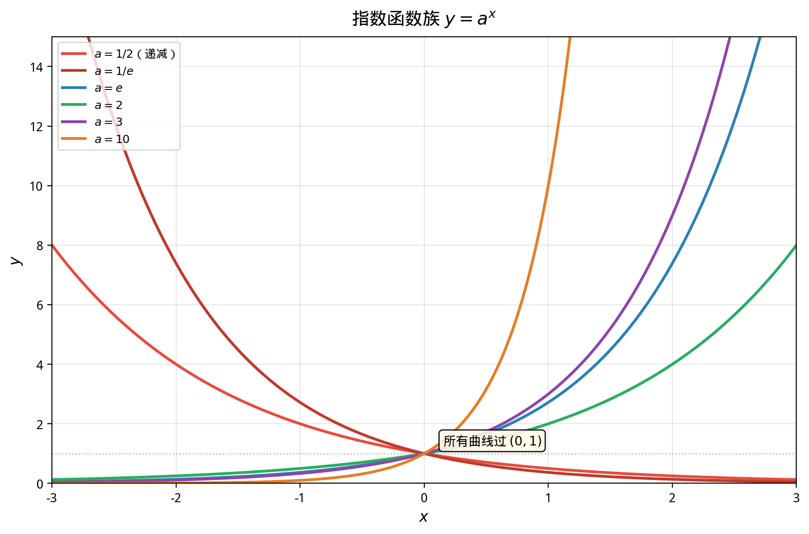

# §1 指数函数（Exponential Functions）

**前置知识**：[Part 2 第 1 章 数系](../../part-02-numbers/ch01-number-systems/README.md)（实数的完备性）、[Part 4 第 1 章 函数概念](../ch01-function-concepts/README.md)（单调性、反函数）

**全景图**：指数函数 $f(x) = a^x$ 是刻画"持续按比例增长（或衰减）"的数学语言。本节从最原始的"重复乘法"出发，逐步将指数的概念从自然数推广到所有实数，然后系统研究指数函数的性质和图像。最后，我们将引入自然底数 $e$——一个在数学中具有独特地位的常数，它使得指数函数在微积分中获得最优雅的性质。

**预估学习时间**：约 2.5–3.5 小时

---

## 动机

假设你在银行存入 $1000$ 元，年利率 $5\%$，每年复利一次。$n$ 年后你的存款为：

$$A(n) = 1000 \times (1.05)^n$$

这里 $(1.05)^n$ 就是一个指数表达式。当 $n$ 从自然数扩展到所有实数时（比如你想知道 $2.5$ 年后的存款），我们就需要 $1.05^{2.5}$ ——但什么是"$1.05$ 的 $2.5$ 次方"？

要让 $a^x$ 对所有实数 $x$ 有意义，我们需要系统地**推广指数的定义**。

---

## 1. 指数的推广（Extending the Exponent）

### 1.1 自然数指数

最基本的定义——**重复乘法**：

> **定义 1**（自然数指数）
>
> 设 $a \in \mathbb{R}$，$n \in \mathbb{N}^+$。定义
>
> $$a^n = \underbrace{a \cdot a \cdot \ldots \cdot a}_{n\text{ 个}}$$
>
> 约定 $a^0 = 1$（$a \neq 0$）。

从这个定义出发，可以直接验证**指数运算法则**：

> **命题 1**（自然数指数的运算法则）
>
> 设 $a, b > 0$，$m, n \in \mathbb{N}$。则：
>
> (i) $a^{m+n} = a^m \cdot a^n$ （同底数幂相乘）
>
> (ii) $(a^m)^n = a^{mn}$ （幂的幂）
>
> (iii) $(ab)^n = a^n \cdot b^n$ （积的幂）

这些法则将成为推广指数概念的"指导原则"——我们要求推广后的指数仍然满足这些法则。

### 1.2 整数指数

> **定义 2**（负整数指数）
>
> 设 $a \neq 0$，$n \in \mathbb{N}^+$。定义
>
> $$a^{-n} = \frac{1}{a^n}$$

**为什么这样定义？** 为了保持法则 $a^{m+n} = a^m \cdot a^n$。我们需要 $a^n \cdot a^{-n} = a^{n+(-n)} = a^0 = 1$，因此 $a^{-n}$ 必须等于 $\frac{1}{a^n}$。

### 1.3 有理数指数

> **定义 3**（有理数指数）
>
> 设 $a > 0$，$\frac{p}{q} \in \mathbb{Q}$（$q \in \mathbb{N}^+$，$\gcd(|p|, q) = 1$）。定义
>
> $$a^{p/q} = \sqrt[q]{a^p} = \left(\sqrt[q]{a}\right)^p$$

这里 $\sqrt[q]{a}$ 是 $a$ 的正实数 $q$ 次方根（存在性由实数完备性保证）。

**为什么这样定义？** 由法则 $\left(a^{p/q}\right)^q = a^{(p/q) \cdot q} = a^p$，所以 $a^{p/q}$ 应该是 $a^p$ 的 $q$ 次方根。

**需要检验的一致性**：若 $\frac{p}{q} = \frac{p'}{q'}$（即 $pq' = p'q$），则 $\sqrt[q]{a^p} = \sqrt[q']{a^{p'}}$。这可以通过 $\left(\sqrt[q]{a^p}\right)^{qq'} = a^{pq'} = a^{p'q} = \left(\sqrt[q']{a^{p'}}\right)^{qq'}$ 和正实数 $qq'$ 次方根的唯一性来证明。

**例**：$8^{2/3} = \left(\sqrt[3]{8}\right)^2 = 2^2 = 4$。$27^{-1/3} = \frac{1}{27^{1/3}} = \frac{1}{3}$。

> **命题 2**（有理数指数的运算法则）
>
> 设 $a, b > 0$，$r, s \in \mathbb{Q}$。则命题 1 中的三条法则对有理数指数仍然成立：
>
> (i) $a^{r+s} = a^r \cdot a^s$
>
> (ii) $(a^r)^s = a^{rs}$
>
> (iii) $(ab)^r = a^r \cdot b^r$

### 1.4 实数指数

如何定义 $2^{\sqrt{2}}$？$\sqrt{2}$ 是无理数，不能写成分数形式。

**关键思想**：利用有理数逼近无理数。

$\sqrt{2} = 1.41421356\ldots$

取有理数序列 $r_1 = 1.4, r_2 = 1.41, r_3 = 1.414, \ldots$，使 $r_n \to \sqrt{2}$。则定义

$$2^{\sqrt{2}} = \lim_{n \to \infty} 2^{r_n}$$

> **定义 4**（实数指数——非正式）
>
> 设 $a > 0$，$x \in \mathbb{R}$。取有理数列 $\{r_n\}$ 使 $r_n \to x$，定义
>
> $$a^x = \lim_{n \to \infty} a^{r_n}$$

**这个极限存在吗？与有理数列的选择无关吗？** 答案是肯定的，但严格证明需要实数的完备性（Part 6 将详细讨论连续性和极限）。在此我们接受这个结果。

关键事实是：推广后的实数指数**仍然满足**命题 1 的三条运算法则。

---

## 2. 指数函数（The Exponential Function）

### 2.1 定义

> **定义 5**（指数函数，exponential function）
>
> 设 $a > 0$ 且 $a \neq 1$。函数
>
> $$f(x) = a^x, \quad x \in \mathbb{R}$$
>
> 称为以 $a$ 为底的**指数函数**。$a$ 称为**底数**（base）。

**为什么要求 $a \neq 1$？** 若 $a = 1$，$f(x) = 1^x = 1$（常函数），没有什么可研究的。

**为什么要求 $a > 0$？** 若 $a < 0$，例如 $(-2)^{1/2} = \sqrt{-2}$ 在实数范围内无意义。若 $a = 0$，$0^x$ 在 $x \leq 0$ 时无意义。

### 2.2 基本性质

> **定理 1**（指数函数的性质）
>
> 设 $a > 0$，$a \neq 1$。函数 $f(x) = a^x$ 具有以下性质：
>
> **(1) 定义域与值域**：$\text{dom}(f) = \mathbb{R}$，$\text{ran}(f) = (0, +\infty)$。
>
> **(2) 恒过定点**：$f(0) = a^0 = 1$，即图像恒过点 $(0, 1)$。
>
> **(3) 正值性**：$a^x > 0$ 对所有 $x \in \mathbb{R}$ 成立。
>
> **(4) 单调性**：
> - 若 $a > 1$，$f$ 在 $\mathbb{R}$ 上**严格递增**（增长型）。
> - 若 $0 < a < 1$，$f$ 在 $\mathbb{R}$ 上**严格递减**（衰减型）。
>
> **(5) 指数法则**：$a^{x+y} = a^x \cdot a^y$。
>
> **(6) 极限行为**：
> - $a > 1$：$\lim_{x \to +\infty} a^x = +\infty$，$\lim_{x \to -\infty} a^x = 0$。
> - $0 < a < 1$：$\lim_{x \to +\infty} a^x = 0$，$\lim_{x \to -\infty} a^x = +\infty$。
>
> **(7) 连续性**：$f(x) = a^x$ 在 $\mathbb{R}$ 上连续（将在 Part 6 严格定义）。

> **证明**（性质 (4)，$a > 1$ 的情况）
>
> 设 $x_1 < x_2$，需证 $a^{x_1} < a^{x_2}$。
>
> $$\frac{a^{x_2}}{a^{x_1}} = a^{x_2 - x_1}$$
>
> 由于 $a > 1$ 且 $x_2 - x_1 > 0$，有 $a^{x_2 - x_1} > a^0 = 1$（正数的正次幂大于 $1$）。
>
> 因此 $a^{x_2} > a^{x_1}$。$\blacksquare$

### 2.3 图像分析

指数函数的图像根据底数 $a$ 分为两族：

**当 $a > 1$（增长型）**：
- 从左到右递增，曲线向上弯曲
- 当 $x \to -\infty$ 时，曲线无限接近 $x$ 轴（但永不触及）——$x$ 轴是**水平渐近线**
- 增长速度越来越快（指数增长）

**当 $0 < a < 1$（衰减型）**：
- 从左到右递减，曲线向下趋近 $x$ 轴
- 当 $x \to +\infty$ 时，$x$ 轴是水平渐近线
- 实际上 $a^x = (1/a)^{-x}$，其中 $1/a > 1$，所以衰减型就是增长型关于 $y$ 轴的翻转

**所有指数函数共同的特征**：
- 恒过 $(0, 1)$
- 始终在 $x$ 轴上方
- $x$ 轴为渐近线
- 底数 $a$ 越大，$a > 1$ 时增长越快

**例题 1**. 比较 $2^{3.1}$，$2^{3}$，$2^{\pi}$ 的大小。

**解**：$a = 2 > 1$，$f(x) = 2^x$ 严格递增。$3 < 3.1 < \pi \approx 3.14159$。

因此 $2^3 < 2^{3.1} < 2^{\pi}$。

**例题 2**. 解不等式 $3^{2x-1} > 27$。

**解**：$27 = 3^3$，所以不等式变为 $3^{2x-1} > 3^3$。

$a = 3 > 1$，$f(x) = 3^x$ 严格递增，因此 $2x - 1 > 3$，即 $x > 2$。

解集为 $(2, +\infty)$。

---

## 3. 指数函数的图像变换

一般的指数型函数 $g(x) = Ca^{kx} + D$ 可以通过 $f(x) = a^x$ 的图像变换得到：

| 参数 | 效果 |
|------|------|
| $C$（纵向伸缩）| $|C| > 1$ 拉伸，$|C| < 1$ 压缩；$C < 0$ 关于 $x$ 轴翻转 |
| $k$（横向伸缩）| $k > 1$ 水平压缩（增长加快），$0 < k < 1$ 水平拉伸 |
| $D$（垂直平移）| 图像上移 $D$ 个单位，水平渐近线变为 $y = D$ |

**例题 3**. 描述 $g(x) = 2 \cdot 3^x - 1$ 的图像特征。

**解**：从 $f(x) = 3^x$ 出发：
- 纵向拉伸 $2$ 倍：$2 \cdot 3^x$
- 下移 $1$ 单位：$2 \cdot 3^x - 1$

图像特征：
- 过点 $(0, 2 \cdot 1 - 1) = (0, 1)$
- 水平渐近线 $y = -1$（而非 $y = 0$）
- 严格递增
- 当 $x \to -\infty$ 时 $g(x) \to -1$

---

## 4. 自然底数 $e$（The Natural Base）

### 4.1 引入

在所有可能的底数中，有一个底数具有独特的数学地位：**自然底数** $e$。

考虑以下问题：在银行存入 $1$ 元，年利率 $100\%$，但将复利的频率不断提高：

| 复利频率 | 每期利率 | 1 年后的本息 |
|----------|----------|-------------|
| 年 ($n=1$) | $100\%$ | $(1 + 1)^1 = 2$ |
| 半年 ($n=2$) | $50\%$ | $(1 + 1/2)^2 = 2.25$ |
| 季 ($n=4$) | $25\%$ | $(1 + 1/4)^4 \approx 2.4414$ |
| 月 ($n=12$) | $8.33\%$ | $(1 + 1/12)^{12} \approx 2.6130$ |
| 日 ($n=365$) | $0.274\%$ | $(1 + 1/365)^{365} \approx 2.7146$ |
| 小时 ($n=8760$) | | $\approx 2.71813$ |
| $n \to \infty$ | | $\to e$ |

复利频率趋于无穷时，本息趋于一个有限的极限——这个极限就是 $e$。

### 4.2 定义

> **定义 6**（自然底数 $e$）
>
> $$e = \lim_{n \to \infty} \left(1 + \frac{1}{n}\right)^n$$
>
> $e \approx 2.71828\,18284\,59045\ldots$
>
> $e$ 是一个无理数（甚至是超越数——不是任何整系数多项式的根）。

**极限存在的直觉**：序列 $a_n = \left(1 + \frac{1}{n}\right)^n$ 可以证明是单调递增且有上界的（$a_n < 3$ 对所有 $n$），因此由实数完备性，极限存在。严格证明将在 Part 6（序列与极限）中给出。

### 4.3 为什么 $e$ 是"自然的"

$e$ 的"自然性"体现在以下几个方面（部分将在微积分中详细展开）：

**(1) 微积分中的优雅性**：$\frac{d}{dx} e^x = e^x$。自然指数函数是**唯一一个导数等于自身**的函数（在常数倍意义下）。这意味着 $e^x$ 的增长速率恰好等于它的当前值。

**(2) 连续复利**：如上所述，$e$ 自然出现在连续复利中。

**(3) 多种等价定义**：

$$e = \sum_{n=0}^{\infty} \frac{1}{n!} = 1 + 1 + \frac{1}{2} + \frac{1}{6} + \frac{1}{24} + \cdots$$

$$e = \lim_{n \to \infty} \left(1 + \frac{1}{n}\right)^n$$

$e$ 也是使得 $\int_1^e \frac{1}{t}\,dt = 1$ 的唯一正数。

**(4) Euler 公式**：$e^{i\theta} = \cos\theta + i\sin\theta$，特别是 $e^{i\pi} + 1 = 0$。这将指数函数、三角函数、虚数单位、$\pi$ 和 $0, 1$ 联系在一起。

### 4.4 自然指数函数

> **定义 7**（自然指数函数）
>
> 函数 $f(x) = e^x$（常记为 $\exp(x)$）称为**自然指数函数**（natural exponential function）。

自然指数函数继承了一般指数函数的所有性质，但因为底数 $e$ 的特殊性，它在数学中占有中心地位。

**例题 4**. 证明 $e > 2$。

**证明**：取 $n = 1$：$\left(1 + 1\right)^1 = 2$。由序列 $\left(1 + \frac{1}{n}\right)^n$ 单调递增，对所有 $n \geq 2$ 都有 $\left(1 + \frac{1}{n}\right)^n > 2$。因此 $e = \lim_{n \to \infty} \left(1 + \frac{1}{n}\right)^n \geq 2$。

更精确地，取 $n = 2$：$\left(1 + \frac{1}{2}\right)^2 = \frac{9}{4} = 2.25 > 2$。

因此 $e \geq 2.25 > 2$。$\blacksquare$

**例题 5**. 证明 $e < 3$。

**证明**：利用二项式定理，

$$\left(1 + \frac{1}{n}\right)^n = \sum_{k=0}^{n} \binom{n}{k} \frac{1}{n^k}$$

$$= 1 + 1 + \frac{1}{2!}\left(1 - \frac{1}{n}\right) + \frac{1}{3!}\left(1 - \frac{1}{n}\right)\left(1 - \frac{2}{n}\right) + \cdots$$

每一项 $\leq \frac{1}{k!}$，因此

$$\left(1 + \frac{1}{n}\right)^n < \sum_{k=0}^{n} \frac{1}{k!} < \sum_{k=0}^{\infty} \frac{1}{k!}$$

而 $k! \geq 2^{k-1}$（对 $k \geq 1$），所以

$$\sum_{k=0}^{\infty} \frac{1}{k!} < 1 + \sum_{k=1}^{\infty} \frac{1}{2^{k-1}} = 1 + \frac{1}{1 - 1/2} = 1 + 2 = 3$$

因此 $e \leq 3$。实际上严格的不等式 $e < 3$ 成立（因为 $k! > 2^{k-1}$ 对 $k \geq 3$）。$\blacksquare$

---

## 5. 指数增长与衰减模型

### 5.1 指数增长

许多自然现象遵循**指数增长**模型：

$$N(t) = N_0 \cdot a^t \quad (a > 1)$$

或等价地 $N(t) = N_0 e^{kt}$（$k > 0$），其中 $N_0$ 为初始量，$k$ 为增长率。

**特征**：每经过固定时间间隔，量增加固定**倍数**（而非固定增量）。

### 5.2 指数衰减

**指数衰减**模型：

$$N(t) = N_0 \cdot a^t \quad (0 < a < 1)$$

或 $N(t) = N_0 e^{-kt}$（$k > 0$）。

**半衰期**（half-life）：使 $N(t) = \frac{N_0}{2}$ 的时间 $t_{1/2}$。

$$N_0 e^{-k t_{1/2}} = \frac{N_0}{2} \implies e^{-k t_{1/2}} = \frac{1}{2} \implies t_{1/2} = \frac{\ln 2}{k}$$

（这里用到了对数——下一节的内容。）

**例题 6**. 细菌群体每 $20$ 分钟翻倍，初始数量 $1000$。求 $3$ 小时后的数量。

**解**：$3$ 小时 $= 180$ 分钟 $= 9$ 个 $20$ 分钟。

$$N = 1000 \times 2^9 = 1000 \times 512 = 512000$$

---

## 要点回顾

1. **指数的推广**：自然数（重复乘法）→ 整数（$a^{-n} = 1/a^n$）→ 有理数（$a^{p/q} = \sqrt[q]{a^p}$）→ 实数（通过极限/连续性）。推广的指导原则是保持运算法则 $a^{x+y} = a^x \cdot a^y$。
2. **指数函数** $f(x) = a^x$（$a > 0, a \neq 1$）：定义域 $\mathbb{R}$，值域 $(0, +\infty)$，恒过 $(0, 1)$，始终为正。
3. **单调性**：$a > 1$ 时递增，$0 < a < 1$ 时递减。
4. **自然底数** $e = \lim_{n \to \infty} (1 + 1/n)^n \approx 2.718$，$2 < e < 3$。
5. $e$ 的"自然性"：$\frac{d}{dx}e^x = e^x$（导数等于自身）。
6. **指数增长/衰减**：$N(t) = N_0 e^{kt}$，指数增长是"最快"的常见增长模式之一。

---

## 进度检查点

在继续之前，确认你能够：

- [ ] 解释指数从自然数推广到实数的逻辑
- [ ] 熟练运用指数运算法则
- [ ] 画出 $y = a^x$（$a > 1$ 和 $0 < a < 1$）的草图，标注关键特征
- [ ] 解释 $e$ 的定义和它为什么是"自然"的
- [ ] 解简单的指数方程和不等式
- [ ] 用指数模型描述增长和衰减

---

## 自测题

**自测题 1**：化简 $\frac{8^{2/3} \cdot 4^{-1/2}}{2^3}$。

答案

$8^{2/3} = (2^3)^{2/3} = 2^2 = 4$

$4^{-1/2} = (2^2)^{-1/2} = 2^{-1} = \frac{1}{2}$

$2^3 = 8$

$$\frac{4 \cdot \frac{1}{2}}{8} = \frac{2}{8} = \frac{1}{4}$$

**自测题 2**：解方程 $4^x = 8^{x-1}$。

答案

$4^x = (2^2)^x = 2^{2x}$

$8^{x-1} = (2^3)^{x-1} = 2^{3(x-1)} = 2^{3x-3}$

$2^{2x} = 2^{3x-3} \implies 2x = 3x - 3 \implies x = 3$。

验证：$4^3 = 64$，$8^2 = 64$。✓

**自测题 3**：设 $f(x) = 2^x - 2^{-x}$。证明 $f$ 是奇函数。

答案

$f(-x) = 2^{-x} - 2^{-(-x)} = 2^{-x} - 2^x = -(2^x - 2^{-x}) = -f(x)$。

因此 $f$ 是奇函数。$\blacksquare$

**自测题 4**：某放射性物质每 $100$ 年衰减为原来的 $\frac{1}{2}$。经过 $300$ 年后，剩余量是原来的多少？

答案

$300$ 年 $= 3$ 个半衰期。剩余量为 $\left(\frac{1}{2}\right)^3 = \frac{1}{8}$，即原来的 $12.5\%$。

---

## 习题引用

完成本节学习后，请前往 [练习题](exercises/exercises.md) 的 §1 部分进行练习。
