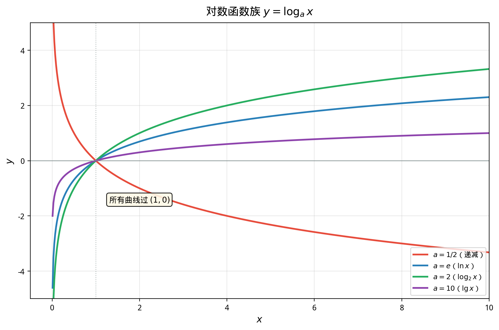
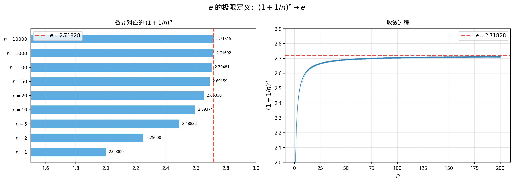

# §2 对数函数（Logarithmic Functions）

**前置知识**：[§1 指数函数](01-exponential.md)、[Part 4 第 1 章 §2 反函数](../ch01-function-concepts/02-composition-inverse.md)

**全景图**：对数是指数的"逆运算"——指数回答"$a$ 的 $x$ 次方是多少？"，对数回答"$a$ 的多少次方等于 $y$？"。这种逆向思维不仅定义了一类新的函数，更提供了一套强大的运算法则：对数将乘法化为加法、将幂运算化为乘法，极大地简化了涉及乘积和幂次的计算。从天文学家的计算表到酸碱度 pH 值，从地震的里氏震级到声音的分贝，对数渗透在科学的方方面面。

**预估学习时间**：约 2.5–3.5 小时

---

## 动机

在上一节中我们解决了这样的问题："$2^x$ 等于多少？"——给定底数和指数，求结果。

但反过来的问题同样自然："$2$ 的多少次方等于 $32$？"答案当然是 $5$（因为 $2^5 = 32$）。但如果问题变成"$2$ 的多少次方等于 $10$？"，答案就不那么明显了——它是 $2^x = 10$ 的解，一个介于 $3$（因为 $2^3 = 8$）和 $4$（因为 $2^4 = 16$）之间的无理数。

对数正是为了精确表达和计算这类问题而发明的。

---

## 1. 对数的定义（Definition of Logarithm）

### 1.1 基本定义

> **定义 1**（对数，logarithm）
>
> 设 $a > 0$，$a \neq 1$，$x > 0$。**以 $a$ 为底 $x$ 的对数**定义为
>
> $$\log_a x = y \quad \iff \quad a^y = x$$
>
> 即 $\log_a x$ 是使得 $a^y = x$ 的唯一实数 $y$。

**存在性与唯一性**：由指数函数 $f(t) = a^t$ 严格单调且值域为 $(0, +\infty)$，对每个 $x > 0$，方程 $a^y = x$ 恰有唯一解。因此 $\log_a x$ 是良定义的。

**本质**：$\log_a$ 是指数函数 $a^x$ 的**反函数**：

$$\log_a(a^x) = x \quad (\forall x \in \mathbb{R})$$

$$a^{\log_a x} = x \quad (\forall x > 0)$$

### 1.2 直接推论

从定义直接得到：

> **命题 1**（对数的基本值）
>
> (a) $\log_a 1 = 0$（因为 $a^0 = 1$）
>
> (b) $\log_a a = 1$（因为 $a^1 = a$）
>
> (c) $\log_a(a^n) = n$（直接由定义）

**例**：$\log_2 8 = 3$（因为 $2^3 = 8$），$\log_3 \frac{1}{9} = -2$（因为 $3^{-2} = \frac{1}{9}$），$\log_{10} 1000 = 3$。

---

## 2. 对数运算法则（Laws of Logarithms）

对数的运算法则是指数运算法则的"翻译"。每一条对数法则都可以从相应的指数法则推导出来。

> **定理 1**（对数运算法则）
>
> 设 $a > 0$，$a \neq 1$，$x, y > 0$，$r \in \mathbb{R}$。则：
>
> **(i) 积的对数**：$\log_a(xy) = \log_a x + \log_a y$
>
> **(ii) 商的对数**：$\log_a\left(\frac{x}{y}\right) = \log_a x - \log_a y$
>
> **(iii) 幂的对数**：$\log_a(x^r) = r \cdot \log_a x$

> **证明**（法则 (i)）
>
> 设 $\log_a x = m$，$\log_a y = n$。则 $x = a^m$，$y = a^n$。
>
> $$xy = a^m \cdot a^n = a^{m+n}$$
>
> 因此 $\log_a(xy) = m + n = \log_a x + \log_a y$。$\blacksquare$

> **证明**（法则 (iii)）
>
> 设 $\log_a x = m$，即 $x = a^m$。
>
> $$x^r = (a^m)^r = a^{mr}$$
>
> 因此 $\log_a(x^r) = mr = r \cdot \log_a x$。$\blacksquare$

**对数法则的直觉**：对数将指数世界的"乘法"翻译为"加法"。这就是为什么对数在历史上被用作计算工具——在计算机出现之前，天文学家和工程师使用**对数表**将复杂的乘法运算转化为简单的加法运算。

**例题 1**. 化简 $\log_2 48 - \log_2 3$。

**解**：$\log_2 48 - \log_2 3 = \log_2 \frac{48}{3} = \log_2 16 = 4$。

**例题 2**. 展开 $\log_a \frac{x^3 \sqrt{y}}{z^2}$。

**解**：

$$\log_a \frac{x^3 \sqrt{y}}{z^2} = \log_a(x^3) + \log_a(\sqrt{y}) - \log_a(z^2) = 3\log_a x + \frac{1}{2}\log_a y - 2\log_a z$$

---

## 3. 换底公式（Change of Base Formula）

> **定理 2**（换底公式，change of base formula）
>
> 设 $a, b > 0$，$a \neq 1$，$b \neq 1$，$x > 0$。则
>
> $$\log_a x = \frac{\log_b x}{\log_b a}$$

> **证明**
>
> 设 $\log_a x = y$，即 $a^y = x$。对两边取 $\log_b$：
>
> $$\log_b(a^y) = \log_b x$$
>
> $$y \cdot \log_b a = \log_b x$$
>
> $$y = \frac{\log_b x}{\log_b a}$$
>
> $\blacksquare$

**推论**：$\log_a b = \frac{1}{\log_b a}$（在换底公式中令 $x = b$）。

**实际用途**：计算器通常只提供 $\ln$（自然对数）和 $\log_{10}$（常用对数）按键。要计算 $\log_2 7$，使用换底公式：

$$\log_2 7 = \frac{\ln 7}{\ln 2} \approx \frac{1.9459}{0.6931} \approx 2.807$$

---

## 4. 常用对数与自然对数

### 4.1 常用对数

> **定义 2**（常用对数，common logarithm）
>
> 以 $10$ 为底的对数称为**常用对数**，记为 $\lg x$ 或 $\log x$（在工程和某些教材中）：
>
> $$\lg x = \log_{10} x$$

常用对数的特点：$\lg 10^n = n$，因此可以快速判断一个数的**数量级**。例如 $\lg 5000 \approx 3.7$，说明 $5000$ 的量级在 $10^3$ 和 $10^4$ 之间。

### 4.2 自然对数

> **定义 3**（自然对数，natural logarithm）
>
> 以 $e$ 为底的对数称为**自然对数**，记为 $\ln x$：
>
> $$\ln x = \log_e x$$

自然对数是数学中最常用的对数。在高等数学和理论物理中，如果没有标明底数的 $\log x$ 通常指 $\ln x$。

$$\ln e = 1, \quad \ln 1 = 0, \quad \ln(e^x) = x, \quad e^{\ln x} = x$$

---

## 5. 对数函数的图像与性质

### 5.1 作为反函数的图像

对数函数 $y = \log_a x$ 是指数函数 $y = a^x$ 的反函数。由反函数的图像对称性（Ch01 §2），$y = \log_a x$ 的图像是 $y = a^x$ 关于直线 $y = x$ 的镜像。

### 5.2 基本性质

> **定理 3**（对数函数的性质）
>
> 设 $a > 0$，$a \neq 1$。函数 $f(x) = \log_a x$ 具有以下性质：
>
> **(1) 定义域与值域**：$\text{dom}(f) = (0, +\infty)$，$\text{ran}(f) = \mathbb{R}$。
>
> **(2) 恒过定点**：$f(1) = \log_a 1 = 0$，即图像恒过点 $(1, 0)$。
>
> **(3) 单调性**：
> - 若 $a > 1$，$f$ 严格递增。
> - 若 $0 < a < 1$，$f$ 严格递减。
>
> **(4) 极限行为**：
> - $a > 1$：$\lim_{x \to +\infty} \log_a x = +\infty$（缓慢增长），$\lim_{x \to 0^+} \log_a x = -\infty$。
> - $0 < a < 1$：$\lim_{x \to +\infty} \log_a x = -\infty$，$\lim_{x \to 0^+} \log_a x = +\infty$。
>
> **(5) 连续性**：$f$ 在 $(0, +\infty)$ 上连续。

### 5.3 图像特征

**与指数函数的对比**：

| 指数函数 $y = a^x$ | 对数函数 $y = \log_a x$ |
|---------------------|-------------------------|
| 定义域 $\mathbb{R}$ | 定义域 $(0, +\infty)$ |
| 值域 $(0, +\infty)$ | 值域 $\mathbb{R}$ |
| 过 $(0, 1)$ | 过 $(1, 0)$ |
| 水平渐近线 $y = 0$ | 垂直渐近线 $x = 0$ |
| 增长极快（指数增长）| 增长极慢（对数增长）|

### 5.4 对数增长的"缓慢性"

对数函数增长极其缓慢。虽然 $\ln x \to +\infty$（$x \to +\infty$），但它被任何正幂次函数 $x^\epsilon$（$\epsilon > 0$）超越：

$$\lim_{x \to +\infty} \frac{\ln x}{x^\epsilon} = 0 \quad (\forall \epsilon > 0)$$

**数值感受**：$\ln 10 \approx 2.3$，$\ln 100 \approx 4.6$，$\ln 1000 \approx 6.9$，$\ln 10^6 \approx 13.8$，$\ln 10^{100} \approx 230$。从 $10$ 到 $10^{100}$（增长了 $10^{99}$ 倍），$\ln$ 值仅从 $2.3$ 增加到 $230$。

---

## 6. 应用

### 6.1 指数方程的求解

对数是解指数方程的基本工具。

**例题 3**. 解方程 $5^x = 12$。

**解**：两边取自然对数：$x \ln 5 = \ln 12$，$x = \frac{\ln 12}{\ln 5} = \log_5 12 \approx \frac{2.4849}{1.6094} \approx 1.544$。

**例题 4**. 解方程 $e^{2x} - 3e^x + 2 = 0$。

**解**：令 $t = e^x$（$t > 0$），方程化为 $t^2 - 3t + 2 = 0$，$(t-1)(t-2) = 0$。

$t = 1$：$e^x = 1$，$x = 0$。

$t = 2$：$e^x = 2$，$x = \ln 2 \approx 0.693$。

### 6.2 对数方程的求解

**例题 5**. 解方程 $\log_2(x - 1) + \log_2(x + 1) = 3$。

**解**：$\log_2[(x-1)(x+1)] = 3$，$(x-1)(x+1) = 2^3 = 8$，$x^2 - 1 = 8$，$x^2 = 9$，$x = \pm 3$。

检验：$x = 3$：$\log_2 2 + \log_2 4 = 1 + 2 = 3$。✓

$x = -3$：$\log_2(-4)$ 无意义。✗

解为 $x = 3$。

### 6.3 pH 值

溶液的酸碱度用 **pH 值**定义：

$$\text{pH} = -\log_{10}[\text{H}^+]$$

其中 $[\text{H}^+]$ 是氢离子浓度（mol/L）。纯水的 $[\text{H}^+] = 10^{-7}$，$\text{pH} = 7$（中性）。

### 6.4 里氏震级

地震的**里氏震级**（Richter magnitude）：

$$M = \log_{10}\left(\frac{A}{A_0}\right)$$

其中 $A$ 是地震波振幅，$A_0$ 是参考振幅。震级每增加 $1$，振幅增加 $10$ 倍。

### 6.5 分贝

声音强度用**分贝**（decibel, dB）衡量：

$$L = 10 \log_{10}\left(\frac{I}{I_0}\right)$$

其中 $I$ 是声音强度，$I_0 = 10^{-12}\;\text{W/m}^2$ 是人耳听觉阈值。

---

## 7. 对数不等式

> **命题 2**（对数不等式的基本原则）
>
> (a) 若 $a > 1$：$\log_a x > \log_a y \iff x > y > 0$（保持不等号方向）。
>
> (b) 若 $0 < a < 1$：$\log_a x > \log_a y \iff 0 < x < y$（反转不等号方向）。

**例题 6**. 解不等式 $\log_3(2x - 1) > 2$。

**解**：底数 $a = 3 > 1$，保持方向。$2x - 1 > 3^2 = 9$，$2x > 10$，$x > 5$。

还需 $2x - 1 > 0$，即 $x > \frac{1}{2}$。交集为 $x > 5$，解集 $(5, +\infty)$。

---

## 要点回顾

1. **对数的定义**：$\log_a x = y \iff a^y = x$。对数是指数的反函数。
2. **基本值**：$\log_a 1 = 0$，$\log_a a = 1$。
3. **运算法则**：积→和，商→差，幂→倍。这些法则直接来自指数法则。
4. **换底公式**：$\log_a x = \frac{\log_b x}{\log_b a}$，使得可以在不同底数之间转换。
5. **常用对数** $\lg = \log_{10}$，**自然对数** $\ln = \log_e$。
6. **对数函数**的定义域为 $(0, +\infty)$，值域为 $\mathbb{R}$，图像是指数函数关于 $y = x$ 的镜像。
7. 对数增长极其缓慢，被任何正幂次函数超越。
8. **应用**：pH 值、里氏震级、分贝等都使用对数尺度。

---

## 进度检查点

在继续之前，确认你能够：

- [ ] 在对数和指数形式之间自如转换
- [ ] 熟练运用三条对数运算法则
- [ ] 使用换底公式计算任意底数的对数
- [ ] 画出对数函数的草图（$a > 1$ 和 $0 < a < 1$）
- [ ] 解指数方程和对数方程
- [ ] 解对数不等式（注意底数大于/小于 $1$ 的情况）

---

## 自测题

**自测题 1**：计算 $\log_2 32 + \log_3 \frac{1}{27} - \log_5 125$。

答案

$\log_2 32 = \log_2 2^5 = 5$

$\log_3 \frac{1}{27} = \log_3 3^{-3} = -3$

$\log_5 125 = \log_5 5^3 = 3$

$5 + (-3) - 3 = -1$

**自测题 2**：化简 $\log_a(a^2 b) - 2\log_a\sqrt{ab}$（$a, b > 0$，$a \neq 1$）。

答案

$\log_a(a^2 b) = \log_a a^2 + \log_a b = 2 + \log_a b$

$2\log_a\sqrt{ab} = 2 \cdot \frac{1}{2}\log_a(ab) = \log_a a + \log_a b = 1 + \log_a b$

差 $= (2 + \log_a b) - (1 + \log_a b) = 1$。

**自测题 3**：解方程 $\log_2 x + \log_2(x - 2) = 3$。

答案

$\log_2[x(x-2)] = 3$，$x(x-2) = 8$，$x^2 - 2x - 8 = 0$，$(x-4)(x+2) = 0$。

$x = 4$ 或 $x = -2$。检验：$x = 4$：$\log_2 4 + \log_2 2 = 2 + 1 = 3$。✓

$x = -2$：$\log_2(-2)$ 无意义。✗

解为 $x = 4$。

**自测题 4**：证明 $\log_a b \cdot \log_b c \cdot \log_c a = 1$（$a, b, c > 0$ 且均不等于 $1$）。

答案

用换底公式（以任意底 $d$ 为基准）：

$\log_a b = \frac{\log_d b}{\log_d a}$，$\log_b c = \frac{\log_d c}{\log_d b}$，$\log_c a = \frac{\log_d a}{\log_d c}$。

$$\log_a b \cdot \log_b c \cdot \log_c a = \frac{\log_d b}{\log_d a} \cdot \frac{\log_d c}{\log_d b} \cdot \frac{\log_d a}{\log_d c} = 1$$

各项消去。$\blacksquare$

---

## 习题引用

完成本节学习后，请前往 [练习题](exercises/exercises.md) 的 §2 部分进行练习。
