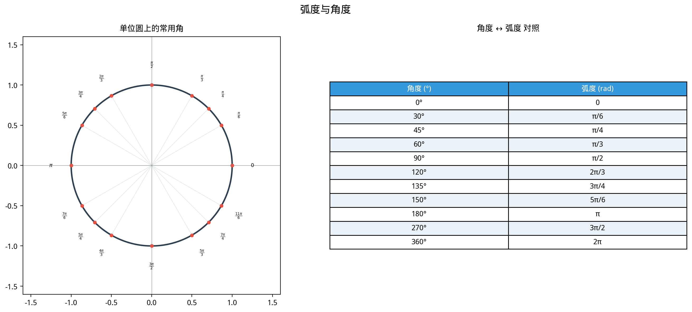
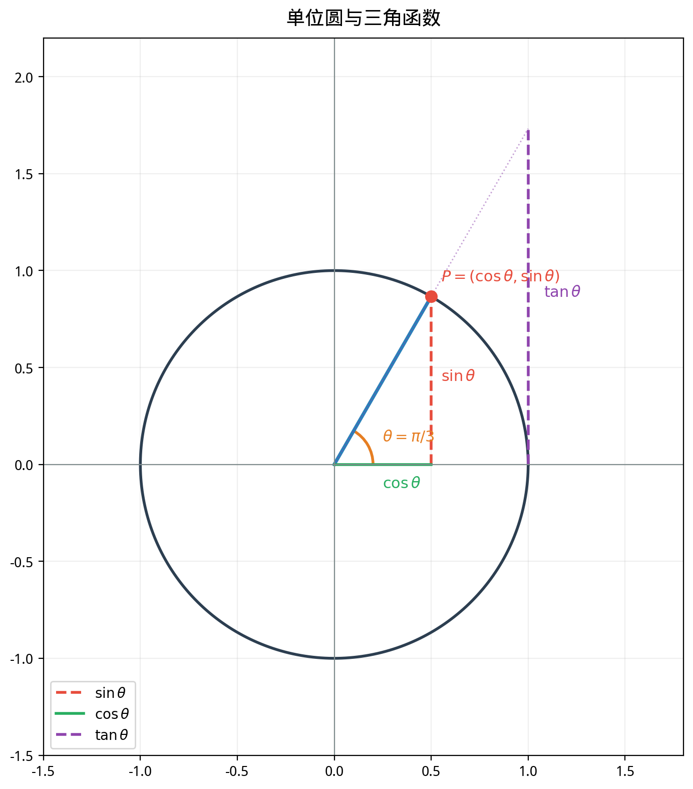

# §1 三角函数的几何起源（Geometric Origin of Trigonometric Functions）

**前置知识**：[Part 4 第 1 章 函数概念](../ch01-function-concepts/README.md)（函数定义、定义域、值域）、[Part 2 第 1 章 数系](../../part-02-numbers/ch01-number-systems/README.md)（实数）

**全景图**：三角函数诞生于对三角形的研究（"trigonometry"= 三角 + 测量），但其现代定义远超三角形的范畴。通过**单位圆定义**，三角函数从仅对锐角有意义的几何量，升级为定义在全体实数上的周期函数。本节建立这一定义，引入六个三角函数，计算特殊角的值，并推导最基本的三角恒等式——Pythagoras 恒等式。

**预估学习时间**：约 2–3 小时

---

## 动机

想象一个质点在单位圆上运动。在时刻 $t$，质点位于圆上对应弧长为 $t$ 的位置（从 $(1, 0)$ 开始逆时针计量）。质点的 $x$ 坐标和 $y$ 坐标如何随 $t$ 变化？

答案是：$x = \cos t$，$y = \sin t$。

这个简单的画面——**圆上运动的坐标投影**——就是三角函数的几何本质。它解释了为什么三角函数是周期的（质点绕圆一周后回到原位）、为什么 $\sin^2 t + \cos^2 t = 1$（质点始终在单位圆上）、以及为什么 $\sin$ 和 $\cos$ 有如此密切的关系。

---

## 1. 角度与弧度（Degrees and Radians）

### 1.1 角度制

> **定义 1**（角度制，degree measure）
>
> 将一个圆周分为 $360$ 等份，每一份对应的圆心角为 $1°$（degree）。

这个 $360$ 的选择来自古巴比伦的六十进制——$360 = 6 \times 60$，有大量的因子（$360$ 有 $24$ 个因子），便于等分。但 $360$ 是一个**人为的约定**，与数学本身无关。

### 1.2 弧度制

> **定义 2**（弧度制，radian measure）
>
> 在半径为 $r$ 的圆中，弧长等于 $r$ 的弧所对应的圆心角定义为 **$1$ 弧度**（radian, rad）。
>
> 一般地，弧长为 $s$ 的弧对应的圆心角为
>
> $$\theta = \frac{s}{r} \;\text{（弧度）}$$

由于整个圆周的弧长为 $2\pi r$，对应的圆心角为 $\frac{2\pi r}{r} = 2\pi$ 弧度。因此：

$$2\pi \;\text{rad} = 360°, \quad \pi \;\text{rad} = 180°$$

### 1.3 角度与弧度的转换

$$\theta_{\text{rad}} = \frac{\pi}{180} \cdot \theta_{\text{deg}}, \qquad \theta_{\text{deg}} = \frac{180}{\pi} \cdot \theta_{\text{rad}}$$

**常用转换表**：

| 角度 | $0°$ | $30°$ | $45°$ | $60°$ | $90°$ | $120°$ | $180°$ | $270°$ | $360°$ |
|------|------|-------|-------|-------|-------|--------|--------|--------|--------|
| 弧度 | $0$ | $\frac{\pi}{6}$ | $\frac{\pi}{4}$ | $\frac{\pi}{3}$ | $\frac{\pi}{2}$ | $\frac{2\pi}{3}$ | $\pi$ | $\frac{3\pi}{2}$ | $2\pi$ |

### 1.4 为什么弧度制是"自然的"

弧度制的"自然性"有以下体现：

**(1)** 弧度定义本质上是**无量纲**的（弧长除以半径），不依赖于任何人为的约定。

**(2)** 在弧度制下，弧长公式和扇形面积公式极其简洁：

$$s = r\theta, \qquad A = \frac{1}{2}r^2\theta$$

**(3)** 在微积分中，只有当角度用弧度衡量时，三角函数的导数才有简洁形式：

$$\frac{d}{d\theta}\sin\theta = \cos\theta, \qquad \frac{d}{d\theta}\cos\theta = -\sin\theta$$

如果用角度制，这些公式中会出现额外的因子 $\frac{\pi}{180}$。

**从本节起，除非特别说明，所有角度都用弧度制。**

---

## 2. 单位圆定义（Unit Circle Definition）

### 2.1 定义

> **定义 3**（正弦和余弦的单位圆定义）
>
> 设 $\theta \in \mathbb{R}$。在单位圆 $x^2 + y^2 = 1$ 上，从点 $(1, 0)$ 出发，沿圆周逆时针（$\theta > 0$）或顺时针（$\theta < 0$）移动弧长 $|\theta|$，到达点 $P = (x, y)$。定义：
>
> $$\cos\theta = x, \qquad \sin\theta = y$$
>
> 即 $P = (\cos\theta, \sin\theta)$。

**关键优势**：这个定义对所有实数 $\theta$ 有效，不限于锐角或正角。

### 2.2 直觉理解

- $\theta = 0$：$P = (1, 0)$，$\cos 0 = 1$，$\sin 0 = 0$。
- $\theta = \pi/2$（$90°$）：$P = (0, 1)$，$\cos(\pi/2) = 0$，$\sin(\pi/2) = 1$。
- $\theta = \pi$（$180°$）：$P = (-1, 0)$，$\cos\pi = -1$，$\sin\pi = 0$。
- $\theta = 3\pi/2$（$270°$）：$P = (0, -1)$，$\cos(3\pi/2) = 0$，$\sin(3\pi/2) = -1$。
- $\theta = 2\pi$（$360°$）：回到 $(1, 0)$，$\cos 2\pi = 1$，$\sin 2\pi = 0$。

---

## 3. 六个三角函数（The Six Trigonometric Functions）

### 3.1 定义

> **定义 4**（六个三角函数）
>
> 设 $\theta \in \mathbb{R}$，$P = (\cos\theta, \sin\theta)$ 为单位圆上对应的点。
>
> | 函数 | 定义 | 定义域 |
> |------|------|--------|
> | 正弦（sine） | $\sin\theta = y$ | $\mathbb{R}$ |
> | 余弦（cosine） | $\cos\theta = x$ | $\mathbb{R}$ |
> | 正切（tangent） | $\tan\theta = \frac{\sin\theta}{\cos\theta} = \frac{y}{x}$ | $\theta \neq \frac{\pi}{2} + k\pi$（$k \in \mathbb{Z}$） |
> | 余切（cotangent） | $\cot\theta = \frac{\cos\theta}{\sin\theta} = \frac{x}{y}$ | $\theta \neq k\pi$（$k \in \mathbb{Z}$） |
> | 正割（secant） | $\sec\theta = \frac{1}{\cos\theta} = \frac{1}{x}$ | $\theta \neq \frac{\pi}{2} + k\pi$ |
> | 余割（cosecant） | $\csc\theta = \frac{1}{\sin\theta} = \frac{1}{y}$ | $\theta \neq k\pi$ |

### 3.2 值域

| 函数 | 值域 |
|------|------|
| $\sin\theta$ | $[-1, 1]$ |
| $\cos\theta$ | $[-1, 1]$ |
| $\tan\theta$ | $(-\infty, +\infty) = \mathbb{R}$ |
| $\cot\theta$ | $\mathbb{R}$ |
| $\sec\theta$ | $(-\infty, -1] \cup [1, +\infty)$ |
| $\csc\theta$ | $(-\infty, -1] \cup [1, +\infty)$ |

### 3.3 各象限的符号（ASTC 规则）

单位圆上 $P = (x, y)$ 的坐标在四个象限中的符号：

| 象限 | $x$（$\cos$） | $y$（$\sin$） | $\tan = y/x$ |
|------|-------------|-------------|-------------|
| I（$0 < \theta < \pi/2$） | $+$ | $+$ | $+$ |
| II（$\pi/2 < \theta < \pi$） | $-$ | $+$ | $-$ |
| III（$\pi < \theta < 3\pi/2$） | $-$ | $-$ | $+$ |
| IV（$3\pi/2 < \theta < 2\pi$） | $+$ | $-$ | $-$ |

**助记口诀**：**A**ll **S**tudents **T**ake **C**alculus（ASTC）——All（第一象限全正）、Sine（第二象限正弦正）、Tangent（第三象限正切正）、Cosine（第四象限余弦正）。

---

## 4. 特殊角的三角函数值

### 4.1 $30°$、$45°$、$60°$ 的精确值

这三个角的三角函数值可以从两个特殊三角形导出：

**等腰直角三角形**（$45°$-$45°$-$90°$）：边比 $1:1:\sqrt{2}$。

$$\sin\frac{\pi}{4} = \cos\frac{\pi}{4} = \frac{1}{\sqrt{2}} = \frac{\sqrt{2}}{2}, \quad \tan\frac{\pi}{4} = 1$$

**$30°$-$60°$-$90°$ 三角形**：边比 $1:\sqrt{3}:2$（由等边三角形一分为二得到）。

$$\sin\frac{\pi}{6} = \frac{1}{2}, \quad \cos\frac{\pi}{6} = \frac{\sqrt{3}}{2}, \quad \tan\frac{\pi}{6} = \frac{1}{\sqrt{3}} = \frac{\sqrt{3}}{3}$$

$$\sin\frac{\pi}{3} = \frac{\sqrt{3}}{2}, \quad \cos\frac{\pi}{3} = \frac{1}{2}, \quad \tan\frac{\pi}{3} = \sqrt{3}$$

### 4.2 完整特殊角表

| $\theta$ | $0$ | $\frac{\pi}{6}$ | $\frac{\pi}{4}$ | $\frac{\pi}{3}$ | $\frac{\pi}{2}$ |
|----------|-----|----------|----------|----------|----------|
| $\sin\theta$ | $0$ | $\frac{1}{2}$ | $\frac{\sqrt{2}}{2}$ | $\frac{\sqrt{3}}{2}$ | $1$ |
| $\cos\theta$ | $1$ | $\frac{\sqrt{3}}{2}$ | $\frac{\sqrt{2}}{2}$ | $\frac{1}{2}$ | $0$ |
| $\tan\theta$ | $0$ | $\frac{\sqrt{3}}{3}$ | $1$ | $\sqrt{3}$ | 无定义 |

**记忆技巧**：$\sin$ 的值按 $\frac{\sqrt{0}}{2}, \frac{\sqrt{1}}{2}, \frac{\sqrt{2}}{2}, \frac{\sqrt{3}}{2}, \frac{\sqrt{4}}{2}$ 的模式排列。$\cos$ 的值是 $\sin$ 的反序。

### 4.3 利用对称性扩展

利用三角函数在各象限的符号和对称性，可以将第一象限的值扩展到所有角度。

**例题 1**. 求 $\sin\frac{5\pi}{6}$。

**解**：$\frac{5\pi}{6} = \pi - \frac{\pi}{6}$，位于第二象限。$\sin(\pi - \theta) = \sin\theta$，因此 $\sin\frac{5\pi}{6} = \sin\frac{\pi}{6} = \frac{1}{2}$。

**例题 2**. 求 $\cos\frac{7\pi}{4}$。

**解**：$\frac{7\pi}{4} = 2\pi - \frac{\pi}{4}$，位于第四象限。$\cos(2\pi - \theta) = \cos\theta$，因此 $\cos\frac{7\pi}{4} = \cos\frac{\pi}{4} = \frac{\sqrt{2}}{2}$。

**例题 3**. 求 $\tan\frac{4\pi}{3}$。

**解**：$\frac{4\pi}{3} = \pi + \frac{\pi}{3}$，位于第三象限。$\tan(\pi + \theta) = \tan\theta$，因此 $\tan\frac{4\pi}{3} = \tan\frac{\pi}{3} = \sqrt{3}$。

---

## 5. 基本恒等式（Fundamental Identities）

### 5.1 Pythagoras 恒等式

> **定理 1**（Pythagoras 恒等式）
>
> 对所有 $\theta \in \mathbb{R}$：
>
> $$\sin^2\theta + \cos^2\theta = 1$$

> **证明**
>
> $P = (\cos\theta, \sin\theta)$ 在单位圆 $x^2 + y^2 = 1$ 上，因此 $\cos^2\theta + \sin^2\theta = 1$。$\blacksquare$

这是最基本、最重要的三角恒等式。从它可以导出其他所有 Pythagoras 类恒等式。

### 5.2 导出恒等式

将 $\sin^2\theta + \cos^2\theta = 1$ 两边除以 $\cos^2\theta$（需 $\cos\theta \neq 0$）：

$$\tan^2\theta + 1 = \sec^2\theta$$

两边除以 $\sin^2\theta$（需 $\sin\theta \neq 0$）：

$$1 + \cot^2\theta = \csc^2\theta$$

> **定理 2**（Pythagoras 恒等式族）
>
> **(i)** $\sin^2\theta + \cos^2\theta = 1$
>
> **(ii)** $\tan^2\theta + 1 = \sec^2\theta$
>
> **(iii)** $1 + \cot^2\theta = \csc^2\theta$

### 5.3 互余关系

> **命题 1**（互余关系，cofunction identities）
>
> $$\sin\left(\frac{\pi}{2} - \theta\right) = \cos\theta, \qquad \cos\left(\frac{\pi}{2} - \theta\right) = \sin\theta$$
>
> $$\tan\left(\frac{\pi}{2} - \theta\right) = \cot\theta, \qquad \cot\left(\frac{\pi}{2} - \theta\right) = \tan\theta$$

**几何理解**：在直角三角形中，两个锐角互余（和为 $\pi/2$）。一个角的对边是另一个角的邻边。因此一个角的"正弦"（sine, 对边/斜边）等于另一个角的"余弦"（cosine = "complementary sine"，余角的正弦）。

### 5.4 倒数关系

> **命题 2**（倒数关系，reciprocal identities）
>
> $$\csc\theta = \frac{1}{\sin\theta}, \quad \sec\theta = \frac{1}{\cos\theta}, \quad \cot\theta = \frac{1}{\tan\theta}$$

### 5.5 应用

**例题 4**. 已知 $\sin\theta = \frac{3}{5}$ 且 $\theta$ 在第二象限，求其余五个三角函数值。

**解**：由 $\sin^2\theta + \cos^2\theta = 1$：$\cos^2\theta = 1 - \frac{9}{25} = \frac{16}{25}$，$\cos\theta = \pm\frac{4}{5}$。

第二象限 $\cos\theta < 0$，故 $\cos\theta = -\frac{4}{5}$。

$$\tan\theta = \frac{\sin\theta}{\cos\theta} = \frac{3/5}{-4/5} = -\frac{3}{4}$$

$$\cot\theta = \frac{1}{\tan\theta} = -\frac{4}{3}, \quad \sec\theta = \frac{1}{\cos\theta} = -\frac{5}{4}, \quad \csc\theta = \frac{1}{\sin\theta} = \frac{5}{3}$$

**例题 5**. 化简 $\frac{\sin^2\theta}{1 - \cos\theta}$。

**解**：$\sin^2\theta = 1 - \cos^2\theta = (1 - \cos\theta)(1 + \cos\theta)$。

$$\frac{\sin^2\theta}{1 - \cos\theta} = \frac{(1-\cos\theta)(1+\cos\theta)}{1-\cos\theta} = 1 + \cos\theta$$

（需 $\cos\theta \neq 1$，即 $\theta \neq 2k\pi$。）

---

## 6. 三角函数与直角三角形

虽然单位圆定义更一般，但在直角三角形中，三角函数有更直观的几何解释。

对于锐角 $\theta$（$0 < \theta < \pi/2$），在直角三角形中：

$$\sin\theta = \frac{\text{对边}}{\text{斜边}}, \quad \cos\theta = \frac{\text{邻边}}{\text{斜边}}, \quad \tan\theta = \frac{\text{对边}}{\text{邻边}}$$

**助记口诀**（SOH-CAH-TOA）：

- **S**ine = **O**pposite / **H**ypotenuse
- **C**osine = **A**djacent / **H**ypotenuse
- **T**angent = **O**pposite / **A**djacent

**例题 6**. 一个直角三角形的两直角边分别为 $5$ 和 $12$，求各锐角的三角函数值。

**解**：斜边 $c = \sqrt{5^2 + 12^2} = \sqrt{169} = 13$。

设 $\alpha$ 为对边长 $5$ 的角：

$$\sin\alpha = \frac{5}{13}, \quad \cos\alpha = \frac{12}{13}, \quad \tan\alpha = \frac{5}{12}$$

另一个锐角 $\beta = \frac{\pi}{2} - \alpha$：

$$\sin\beta = \frac{12}{13}, \quad \cos\beta = \frac{5}{13}, \quad \tan\beta = \frac{12}{5}$$

---

## 要点回顾

1. **弧度制**：$\theta = s/r$，$\pi \;\text{rad} = 180°$。弧度制是数学中的标准角度衡量方式。
2. **单位圆定义**：$P = (\cos\theta, \sin\theta)$ 是单位圆上弧度为 $\theta$ 的点。这个定义对所有实数 $\theta$ 有效。
3. **六个三角函数**：$\sin, \cos, \tan, \cot, \sec, \csc$，后四个由前两个导出。
4. **ASTC 规则**：各象限中三角函数的符号——全、正弦、正切、余弦。
5. **特殊角值**（$0, \pi/6, \pi/4, \pi/3, \pi/2$）：从特殊三角形导出，必须熟记。
6. **Pythagoras 恒等式**：$\sin^2\theta + \cos^2\theta = 1$，以及导出的 $\tan^2\theta + 1 = \sec^2\theta$，$1 + \cot^2\theta = \csc^2\theta$。
7. **互余关系**：$\sin(\pi/2 - \theta) = \cos\theta$ 等。

---

## 进度检查点

在继续之前，确认你能够：

- [ ] 在弧度和角度之间自如转换
- [ ] 用单位圆快速确定 $\sin\theta$ 和 $\cos\theta$ 的符号
- [ ] 不查表写出特殊角（$0°, 30°, 45°, 60°, 90°$ 及其在其他象限的对应角）的三角函数值
- [ ] 已知一个三角函数值和象限，求其余五个
- [ ] 用 Pythagoras 恒等式化简三角表达式

---

## 自测题

**自测题 1**：将 $225°$ 转换为弧度；将 $\frac{7\pi}{6}$ 转换为角度。

答案

$225° = 225 \cdot \frac{\pi}{180} = \frac{5\pi}{4}$

$\frac{7\pi}{6} = \frac{7\pi}{6} \cdot \frac{180}{\pi} = \frac{7 \cdot 180}{6} = 210°$

**自测题 2**：求 $\sin\frac{2\pi}{3}$，$\cos\frac{5\pi}{4}$，$\tan\frac{11\pi}{6}$。

答案

$\sin\frac{2\pi}{3} = \sin(\pi - \frac{\pi}{3}) = \sin\frac{\pi}{3} = \frac{\sqrt{3}}{2}$

$\cos\frac{5\pi}{4} = \cos(\pi + \frac{\pi}{4}) = -\cos\frac{\pi}{4} = -\frac{\sqrt{2}}{2}$

$\tan\frac{11\pi}{6} = \tan(2\pi - \frac{\pi}{6}) = -\tan\frac{\pi}{6} = -\frac{\sqrt{3}}{3}$

**自测题 3**：已知 $\cos\theta = -\frac{5}{13}$，$\theta$ 在第三象限。求 $\sin\theta$ 和 $\tan\theta$。

答案

$\sin^2\theta = 1 - \cos^2\theta = 1 - \frac{25}{169} = \frac{144}{169}$

第三象限 $\sin\theta < 0$：$\sin\theta = -\frac{12}{13}$

$\tan\theta = \frac{\sin\theta}{\cos\theta} = \frac{-12/13}{-5/13} = \frac{12}{5}$

**自测题 4**：证明 $\frac{1 + \tan^2\theta}{1 + \cot^2\theta} = \tan^2\theta$。

答案

$\frac{1 + \tan^2\theta}{1 + \cot^2\theta} = \frac{\sec^2\theta}{\csc^2\theta} = \frac{1/\cos^2\theta}{1/\sin^2\theta} = \frac{\sin^2\theta}{\cos^2\theta} = \tan^2\theta$

$\blacksquare$

---

## 习题引用

完成本节学习后，请前往 [练习题](exercises/exercises.md) 的 §1 部分进行练习。
