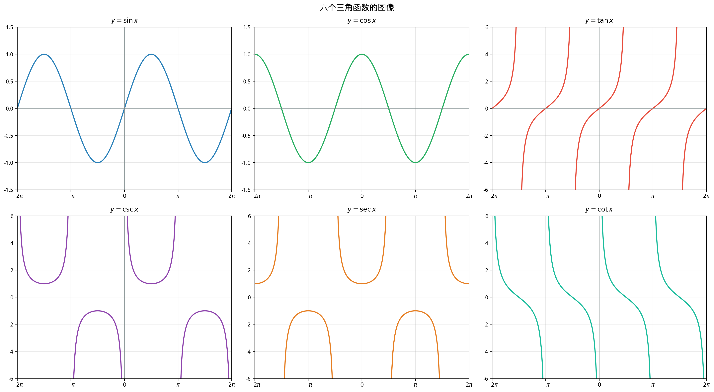
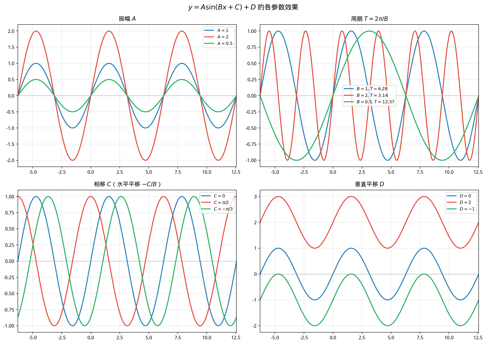

# §2 三角函数的性质与图像（Properties and Graphs of Trigonometric Functions）

**前置知识**：[§1 三角函数的几何起源](01-trig-geometric.md)、[Part 4 第 1 章 §1 函数概念深化](../ch01-function-concepts/01-function-deep.md)（单调性、奇偶性、周期性）

**全景图**：上一节建立了三角函数的定义并计算了特殊角的值——这是"点"的信息。本节要将这些点连成"面"——系统研究三角函数的全局性质（周期性、对称性、单调性）并画出完整的图像。最后，我们将学习如何通过参数 $A, B, C, D$ 来变换正弦/余弦的图像，这在物理学（波动、振动）和工程学（信号处理）中至关重要。

**预估学习时间**：约 2–3 小时

---

## 动机

三角函数的图像是理解其行为的最直观方式。一旦你能"看到"正弦波在纸上起伏，很多性质就变得一目了然：

- 为什么 $\sin x$ 的值永远在 $-1$ 和 $1$ 之间？（因为波峰和波谷就在那里。）
- 为什么 $\sin(-x) = -\sin x$？（因为图像关于原点对称。）
- 什么是"频率"和"相位"？（它们决定了波的快慢和位移。）

---

## 1. 周期性（Periodicity）

### 1.1 正弦和余弦的周期

> **定理 1**（正弦和余弦的周期）
>
> $$\sin(x + 2\pi) = \sin x, \qquad \cos(x + 2\pi) = \cos x$$
>
> 对所有 $x \in \mathbb{R}$ 成立。$2\pi$ 是 $\sin$ 和 $\cos$ 的**最小正周期**。

> **证明**
>
> 角 $x$ 和角 $x + 2\pi$ 在单位圆上对应同一个点（绕了完整的一圈），因此坐标相同。
>
> 最小性：若 $T > 0$ 是 $\sin$ 的周期，则 $\sin T = \sin(0 + T) = \sin 0 = 0$。满足 $\sin T = 0$ 的最小正数是 $T = \pi$。但 $\sin(\pi/2 + \pi) = \sin(3\pi/2) = -1 \neq 1 = \sin(\pi/2)$，所以 $\pi$ 不是 $\sin$ 的周期。下一个候选是 $T = 2\pi$，它确实满足条件。$\blacksquare$

### 1.2 正切和余切的周期

> **定理 2**（正切和余切的周期）
>
> $$\tan(x + \pi) = \tan x, \qquad \cot(x + \pi) = \cot x$$
>
> $\pi$ 是 $\tan$ 和 $\cot$ 的**最小正周期**。

> **证明**
>
> 角 $x + \pi$ 对应单位圆上的点 $(-\cos x, -\sin x)$（从 $P$ 到关于原点的对称点）。
>
> $$\tan(x + \pi) = \frac{-\sin x}{-\cos x} = \frac{\sin x}{\cos x} = \tan x$$
>
> 最小性：$\tan(\pi/4 + T) = \tan(\pi/4) = 1$ 对周期 $T$ 成立。$\tan(\pi/4 + T) = 1$ 当 $\pi/4 + T = \pi/4 + k\pi$，即 $T = k\pi$。最小正值 $T = \pi$。$\blacksquare$

---

## 2. 对称性（Symmetry）

### 2.1 奇偶性

> **定理 3**（三角函数的奇偶性）
>
> - $\sin(-x) = -\sin x$（$\sin$ 是**奇函数**）
> - $\cos(-x) = \cos x$（$\cos$ 是**偶函数**）
> - $\tan(-x) = -\tan x$（$\tan$ 是**奇函数**）

> **证明**
>
> 角 $-x$ 对应单位圆上的点 $(\cos x, -\sin x)$（关于 $x$ 轴的反射）。
>
> 因此 $\cos(-x) = \cos x$（$x$ 坐标不变）且 $\sin(-x) = -\sin x$（$y$ 坐标取反）。
>
> $\tan(-x) = \frac{\sin(-x)}{\cos(-x)} = \frac{-\sin x}{\cos x} = -\tan x$。$\blacksquare$

### 2.2 平移对称

> **命题 1**（关键平移关系）
>
> $$\sin\left(x + \frac{\pi}{2}\right) = \cos x, \qquad \cos\left(x + \frac{\pi}{2}\right) = -\sin x$$

**意义**：$\cos x$ 就是 $\sin x$ 向**左**平移 $\frac{\pi}{2}$ 得到的。$\sin$ 和 $\cos$ 的图像形状完全相同，只是水平位置不同。

---

## 3. 正弦函数的完整图像

### 3.1 关键数据

| $x$ | $0$ | $\frac{\pi}{6}$ | $\frac{\pi}{4}$ | $\frac{\pi}{3}$ | $\frac{\pi}{2}$ | $\pi$ | $\frac{3\pi}{2}$ | $2\pi$ |
|-----|-----|----------|----------|----------|----------|------|-----------|--------|
| $\sin x$ | $0$ | $\frac{1}{2}$ | $\frac{\sqrt{2}}{2}$ | $\frac{\sqrt{3}}{2}$ | $1$ | $0$ | $-1$ | $0$ |

### 3.2 图像特征

- **周期**：$2\pi$
- **振幅**：$1$（最大值 $1$ 与最小值 $-1$ 之差的一半）
- **零点**：$x = k\pi$（$k \in \mathbb{Z}$）
- **最大值**：$\sin x = 1$ 当 $x = \frac{\pi}{2} + 2k\pi$
- **最小值**：$\sin x = -1$ 当 $x = -\frac{\pi}{2} + 2k\pi$
- **对称性**：关于原点对称（奇函数），关于 $x = \frac{\pi}{2} + k\pi$ 对称（极值点处）
- **单调性**：在 $\left[-\frac{\pi}{2} + 2k\pi,\; \frac{\pi}{2} + 2k\pi\right]$ 上递增，在 $\left[\frac{\pi}{2} + 2k\pi,\; \frac{3\pi}{2} + 2k\pi\right]$ 上递减

---

## 4. 余弦函数的完整图像

### 4.1 图像特征

- **周期**：$2\pi$
- **振幅**：$1$
- **零点**：$x = \frac{\pi}{2} + k\pi$
- **最大值**：$\cos x = 1$ 当 $x = 2k\pi$
- **最小值**：$\cos x = -1$ 当 $x = (2k+1)\pi$
- **对称性**：关于 $y$ 轴对称（偶函数），关于 $x = k\pi$ 对称
- **单调性**：在 $[2k\pi - \pi,\; 2k\pi]$ 上递增，在 $[2k\pi,\; 2k\pi + \pi]$ 上递减
- **与 $\sin$ 的关系**：$\cos x = \sin\left(x + \frac{\pi}{2}\right)$，即 $\sin$ 向左移 $\frac{\pi}{2}$

---

## 5. 正切函数的完整图像

### 5.1 图像特征

- **周期**：$\pi$
- **无界**：$\tan x$ 没有最大值和最小值
- **零点**：$x = k\pi$
- **垂直渐近线**：$x = \frac{\pi}{2} + k\pi$（$\cos x = 0$ 的位置）
- **对称性**：关于原点对称（奇函数）
- **单调性**：在每个连续区间 $\left(-\frac{\pi}{2} + k\pi,\; \frac{\pi}{2} + k\pi\right)$ 上严格递增
- **在渐近线附近的行为**：
  - $x \to \frac{\pi}{2}^-$ 时 $\tan x \to +\infty$
  - $x \to -\frac{\pi}{2}^+$ 时 $\tan x \to -\infty$

---

## 6. 图像变换：$y = A\sin(Bx + C) + D$

### 6.1 四个参数的意义

一般正弦波 $y = A\sin(Bx + C) + D$ 中，四个参数各有明确的几何/物理意义：

> **定义 1**（正弦波的参数）
>
> $$y = A\sin(Bx + C) + D$$
>
> | 参数 | 名称 | 效果 |
> |------|------|------|
> | $\|A\|$ | **振幅**（amplitude） | 波峰到中线的距离。$A < 0$ 时图像关于中线翻转 |
> | $\frac{2\pi}{\|B\|}$ | **周期**（period） | 完成一次完整振荡的 $x$ 间隔 |
> | $-\frac{C}{B}$ | **相移**（phase shift） | 图像水平平移量。$C/B > 0$ 左移，$C/B < 0$ 右移 |
> | $D$ | **垂直位移**（vertical shift） | 中线（平衡位置）的高度，$y = D$ |

### 6.2 变换步骤

从 $y = \sin x$ 到 $y = A\sin(Bx + C) + D$ 的变换可以按以下步骤理解：

**步骤 1**：$y = \sin x \to y = \sin(Bx)$（水平伸缩：周期变为 $\frac{2\pi}{|B|}$）

**步骤 2**：$y = \sin(Bx) \to y = \sin(Bx + C)$（水平平移：左移 $\frac{C}{B}$）

**步骤 3**：$y = \sin(Bx + C) \to y = A\sin(Bx + C)$（垂直伸缩：振幅变为 $|A|$）

**步骤 4**：$y = A\sin(Bx + C) \to y = A\sin(Bx + C) + D$（垂直平移：上移 $D$）

### 6.3 例题

**例题 1**. 分析 $y = 3\sin(2x - \frac{\pi}{3}) + 1$ 的图像特征。

**解**：与标准形式 $y = A\sin(Bx + C) + D$ 对比：

$A = 3$，$B = 2$，$C = -\frac{\pi}{3}$，$D = 1$。

- **振幅**：$|A| = 3$
- **周期**：$\frac{2\pi}{|B|} = \frac{2\pi}{2} = \pi$
- **相移**：$-\frac{C}{B} = -\frac{-\pi/3}{2} = \frac{\pi}{6}$（向右移 $\frac{\pi}{6}$）
- **垂直位移**：$D = 1$（中线 $y = 1$）
- **最大值**：$1 + 3 = 4$，**最小值**：$1 - 3 = -2$
- **值域**：$[-2, 4]$

**例题 2**. 求满足以下条件的正弦函数：振幅 $2$，周期 $4\pi$，向左移 $\frac{\pi}{2}$，中线 $y = -1$。

**解**：

$|A| = 2$，取 $A = 2$。

$\frac{2\pi}{|B|} = 4\pi \implies |B| = \frac{1}{2}$，取 $B = \frac{1}{2}$。

相移 $-\frac{C}{B} = -\frac{\pi}{2}$（向左移），$C = B \cdot \frac{\pi}{2} = \frac{1}{2} \cdot \frac{\pi}{2} = \frac{\pi}{4}$。

$D = -1$。

$$y = 2\sin\left(\frac{1}{2}x + \frac{\pi}{4}\right) - 1$$

### 6.4 从图像读出方程

**例题 3**. 某函数 $y = A\sin(Bx + C) + D$（$A > 0, B > 0$）的图像满足：最大值 $5$，最小值 $-1$，周期 $\pi$，$x = \frac{\pi}{6}$ 时取最大值。求 $A, B, C, D$。

**解**：

$A = \frac{5 - (-1)}{2} = 3$，$D = \frac{5 + (-1)}{2} = 2$。

$\frac{2\pi}{B} = \pi \implies B = 2$。

最大值在 $x = \frac{\pi}{6}$ 时取到，即 $\sin(2 \cdot \frac{\pi}{6} + C) = 1$，$\frac{\pi}{3} + C = \frac{\pi}{2}$，$C = \frac{\pi}{6}$。

$$y = 3\sin\left(2x + \frac{\pi}{6}\right) + 2$$

---

## 7. 余弦型的变换

所有关于 $A\sin(Bx + C) + D$ 的分析完全类似地适用于 $A\cos(Bx + C) + D$。两者可以互相转换：

$$A\sin(Bx + C) = A\cos\left(Bx + C - \frac{\pi}{2}\right)$$

$$A\cos(Bx + C) = A\sin\left(Bx + C + \frac{\pi}{2}\right)$$

---

## 8. $\sec$、$\csc$、$\cot$ 的图像（简述）

**$y = \sec x = \frac{1}{\cos x}$**：
- 垂直渐近线在 $\cos x = 0$ 的位置：$x = \frac{\pi}{2} + k\pi$
- 在 $\cos x > 0$ 的区间上 $\sec x > 0$，在 $\cos x < 0$ 的区间上 $\sec x < 0$
- 值域 $(-\infty, -1] \cup [1, +\infty)$，周期 $2\pi$

**$y = \csc x = \frac{1}{\sin x}$**：类似，渐近线在 $x = k\pi$。

**$y = \cot x = \frac{\cos x}{\sin x}$**：形状类似 $\tan x$ 但递减，渐近线在 $x = k\pi$，周期 $\pi$。

---

## 要点回顾

1. **周期**：$\sin x$ 和 $\cos x$ 的周期为 $2\pi$；$\tan x$ 和 $\cot x$ 的周期为 $\pi$。
2. **奇偶性**：$\sin, \tan, \cot, \csc$ 是奇函数；$\cos, \sec$ 是偶函数。
3. **$\sin x$ 的图像**：波浪形，振幅 $1$，周期 $2\pi$，过原点，关于原点对称。
4. **$\cos x$ 的图像**：$\sin x$ 向左移 $\frac{\pi}{2}$，关于 $y$ 轴对称。
5. **$\tan x$ 的图像**：周期 $\pi$，无界，有垂直渐近线，在每个周期内严格递增。
6. **正弦波** $y = A\sin(Bx + C) + D$：振幅 $|A|$，周期 $\frac{2\pi}{|B|}$，相移 $-\frac{C}{B}$，中线 $y = D$。
7. 从图像可以反推方程的参数。

---

## 进度检查点

在继续之前，确认你能够：

- [ ] 不查资料画出 $\sin x$, $\cos x$, $\tan x$ 在至少两个周期内的图像
- [ ] 说出 $\sin$, $\cos$, $\tan$ 的周期、对称性和单调区间
- [ ] 给定 $y = A\sin(Bx + C) + D$，快速确定振幅、周期、相移和中线
- [ ] 从图像的关键信息（最值、周期、相位）反推方程

---

## 自测题

**自测题 1**：$y = -2\cos(3x + \pi) + 4$ 的振幅、周期、相移和中线分别是什么？

答案

振幅 $|A| = |-2| = 2$

周期 $\frac{2\pi}{|B|} = \frac{2\pi}{3}$

相移 $-\frac{C}{B} = -\frac{\pi}{3}$（向左移 $\frac{\pi}{3}$）

中线 $y = D = 4$

值域 $[4-2, 4+2] = [2, 6]$

**自测题 2**：$\sin x$ 在 $\left[\frac{\pi}{2}, \frac{3\pi}{2}\right]$ 上是递增还是递减？

答案

**递减**。在 $\frac{\pi}{2}$ 处取到最大值 $1$，在 $\frac{3\pi}{2}$ 处取到最小值 $-1$。

**自测题 3**：函数 $y = \sin(2x - \frac{\pi}{4})$ 的图像可以由 $y = \sin(2x)$ 向哪个方向平移多少得到？

答案

$\sin(2x - \frac{\pi}{4}) = \sin\left(2(x - \frac{\pi}{8})\right)$

向**右**平移 $\frac{\pi}{8}$。

注意：不是 $\frac{\pi}{4}$！先提取 $B$，平移量是 $\frac{C}{B}$ 而不是 $C$。

**自测题 4**：$y = \tan x$ 在 $x = \frac{\pi}{4}$ 处的函数值是多少？它在包含 $\frac{\pi}{4}$ 的连续区间上是递增还是递减？

答案

$\tan\frac{\pi}{4} = 1$

包含 $\frac{\pi}{4}$ 的连续区间是 $(-\frac{\pi}{2}, \frac{\pi}{2})$。$\tan x$ 在此区间上**严格递增**。

---

## 习题引用

完成本节学习后，请前往 [练习题](exercises/exercises.md) 的 §2 部分进行练习。
