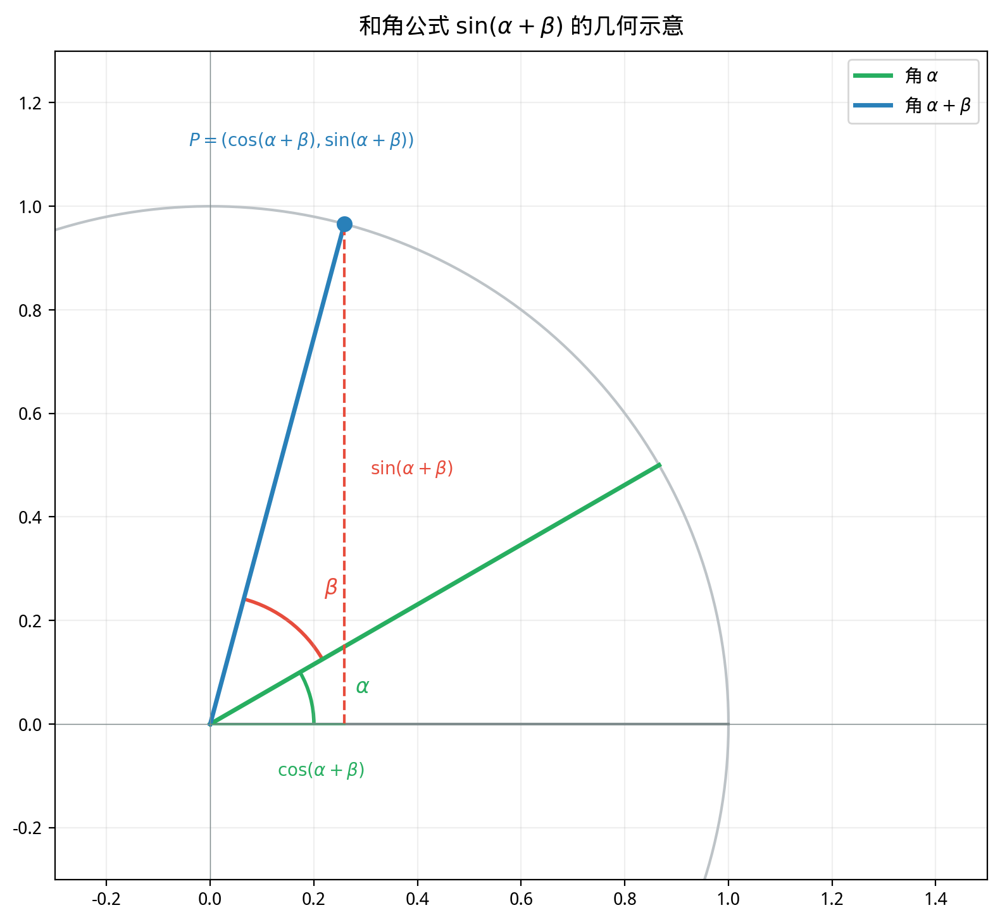

# §3 三角恒等式（Trigonometric Identities）

**前置知识**：[§1 三角函数的几何起源](01-trig-geometric.md)（六个三角函数、基本恒等式）、[§2 三角函数的性质与图像](02-trig-properties.md)（周期性、奇偶性）

**全景图**：三角恒等式是三角函数理论的代数核心。和差角公式是一切高级恒等式的基石——从它出发可以推导出二倍角、半角、和差化积、积化和差、万能公式等全部结果。掌握这些恒等式，不仅是解三角方程和化简表达式的必备工具，更是微积分（三角换元、Fourier 级数）和物理（波的叠加与干涉）的基础。

**预估学习时间**：约 3–4 小时

---

## 动机

考虑一个看似简单的问题：$\cos 15°$ 是多少？

$15° = 45° - 30°$，我们知道 $\cos 45°$ 和 $\cos 30°$ 的精确值。但 $\cos 15° \neq \cos 45° - \cos 30°$——余弦不满足"减法分配律"。

正确的答案需要**和差角公式**：

$$\cos 15° = \cos(45° - 30°) = \cos 45°\cos 30° + \sin 45°\sin 30°$$

$$= \frac{\sqrt{2}}{2} \cdot \frac{\sqrt{3}}{2} + \frac{\sqrt{2}}{2} \cdot \frac{1}{2} = \frac{\sqrt{6} + \sqrt{2}}{4}$$

和差角公式告诉我们如何将"复合角"的三角函数分解为"简单角"的三角函数的组合。这是本节的核心。

---

## 1. 和差角公式（Angle Addition and Subtraction Formulas）

### 1.1 余弦的差角公式

> **定理 1**（余弦的差角公式）
>
> 对所有 $\alpha, \beta \in \mathbb{R}$：
>
> $$\cos(\alpha - \beta) = \cos\alpha\cos\beta + \sin\alpha\sin\beta$$

> **证明**（几何法）
>
> 在单位圆上取点 $P = (\cos\alpha, \sin\alpha)$ 和 $Q = (\cos\beta, \sin\beta)$。
>
> **方法一：距离公式**
>
> $PQ$ 之间的距离平方：
>
> $$|PQ|^2 = (\cos\alpha - \cos\beta)^2 + (\sin\alpha - \sin\beta)^2$$
>
> 展开：
>
> $$= \cos^2\alpha - 2\cos\alpha\cos\beta + \cos^2\beta + \sin^2\alpha - 2\sin\alpha\sin\beta + \sin^2\beta$$
>
> $$= (\cos^2\alpha + \sin^2\alpha) + (\cos^2\beta + \sin^2\beta) - 2(\cos\alpha\cos\beta + \sin\alpha\sin\beta)$$
>
> $$= 2 - 2(\cos\alpha\cos\beta + \sin\alpha\sin\beta)$$
>
> 另一方面，弧 $PQ$ 对应的圆心角为 $\alpha - \beta$（或与之相差 $2\pi$ 的倍数）。将这段弧旋转到从 $(1, 0)$ 开始的位置，$PQ$ 的距离等于点 $(\cos(\alpha - \beta), \sin(\alpha - \beta))$ 到 $(1, 0)$ 的距离：
>
> $$|PQ|^2 = (\cos(\alpha - \beta) - 1)^2 + \sin^2(\alpha - \beta)$$
>
> $$= \cos^2(\alpha - \beta) - 2\cos(\alpha - \beta) + 1 + \sin^2(\alpha - \beta)$$
>
> $$= 2 - 2\cos(\alpha - \beta)$$
>
> 两个表达式相等：
>
> $$2 - 2\cos(\alpha - \beta) = 2 - 2(\cos\alpha\cos\beta + \sin\alpha\sin\beta)$$
>
> $$\cos(\alpha - \beta) = \cos\alpha\cos\beta + \sin\alpha\sin\beta \qquad \blacksquare$$

### 1.2 余弦的和角公式

在差角公式中用 $-\beta$ 替换 $\beta$：

$$\cos(\alpha + \beta) = \cos(\alpha - (-\beta)) = \cos\alpha\cos(-\beta) + \sin\alpha\sin(-\beta)$$

由 $\cos(-\beta) = \cos\beta$，$\sin(-\beta) = -\sin\beta$：

> **推论 1**
>
> $$\cos(\alpha + \beta) = \cos\alpha\cos\beta - \sin\alpha\sin\beta$$

### 1.3 正弦的和差角公式

利用互余关系 $\sin\theta = \cos(\frac{\pi}{2} - \theta)$：

$$\sin(\alpha + \beta) = \cos\left(\frac{\pi}{2} - (\alpha + \beta)\right) = \cos\left(\left(\frac{\pi}{2} - \alpha\right) - \beta\right)$$

$$= \cos\left(\frac{\pi}{2} - \alpha\right)\cos\beta + \sin\left(\frac{\pi}{2} - \alpha\right)\sin\beta = \sin\alpha\cos\beta + \cos\alpha\sin\beta$$

> **定理 2**（正弦的和差角公式）
>
> $$\sin(\alpha + \beta) = \sin\alpha\cos\beta + \cos\alpha\sin\beta$$
>
> $$\sin(\alpha - \beta) = \sin\alpha\cos\beta - \cos\alpha\sin\beta$$

### 1.4 正切的和差角公式

$$\tan(\alpha + \beta) = \frac{\sin(\alpha + \beta)}{\cos(\alpha + \beta)} = \frac{\sin\alpha\cos\beta + \cos\alpha\sin\beta}{\cos\alpha\cos\beta - \sin\alpha\sin\beta}$$

分子分母同除以 $\cos\alpha\cos\beta$（假设不为零）：

> **定理 3**（正切的和差角公式）
>
> $$\tan(\alpha + \beta) = \frac{\tan\alpha + \tan\beta}{1 - \tan\alpha\tan\beta}$$
>
> $$\tan(\alpha - \beta) = \frac{\tan\alpha - \tan\beta}{1 + \tan\alpha\tan\beta}$$
>
> （需 $\cos\alpha \neq 0$，$\cos\beta \neq 0$，且分母不为零。）

### 1.5 和差角公式汇总

$$\boxed{\begin{aligned}
\sin(\alpha \pm \beta) &= \sin\alpha\cos\beta \pm \cos\alpha\sin\beta \\
\cos(\alpha \pm \beta) &= \cos\alpha\cos\beta \mp \sin\alpha\sin\beta \\
\tan(\alpha \pm \beta) &= \frac{\tan\alpha \pm \tan\beta}{1 \mp \tan\alpha\tan\beta}
\end{aligned}}$$

**记忆要点**：正弦"同名异号"（$\sin\alpha\cos\beta \pm \cos\alpha\sin\beta$），余弦"异名同号变反"（$\cos\alpha\cos\beta \mp \sin\alpha\sin\beta$，符号与外面相反）。

**例题 1**. 求 $\sin 75°$ 的精确值。

**解**：$75° = 45° + 30°$。

$$\sin 75° = \sin 45°\cos 30° + \cos 45°\sin 30° = \frac{\sqrt{2}}{2} \cdot \frac{\sqrt{3}}{2} + \frac{\sqrt{2}}{2} \cdot \frac{1}{2} = \frac{\sqrt{6} + \sqrt{2}}{4}$$

**例题 2**. 已知 $\tan\alpha = 2$，$\tan\beta = 3$。求 $\tan(\alpha + \beta)$。

**解**：$\tan(\alpha + \beta) = \frac{2 + 3}{1 - 2 \cdot 3} = \frac{5}{-5} = -1$。

因此 $\alpha + \beta = \frac{3\pi}{4} + k\pi$（$k \in \mathbb{Z}$）。

---

## 2. 二倍角公式（Double Angle Formulas）

在和角公式中令 $\beta = \alpha$：

> **定理 4**（二倍角公式）
>
> $$\sin 2\alpha = 2\sin\alpha\cos\alpha$$
>
> $$\cos 2\alpha = \cos^2\alpha - \sin^2\alpha$$
>
> $$\tan 2\alpha = \frac{2\tan\alpha}{1 - \tan^2\alpha}$$

### 2.1 余弦二倍角的三种形式

利用 $\sin^2\alpha + \cos^2\alpha = 1$：

$$\cos 2\alpha = \cos^2\alpha - \sin^2\alpha = \begin{cases} 2\cos^2\alpha - 1 & \text{（用 }\sin^2\alpha = 1 - \cos^2\alpha\text{）} \\ 1 - 2\sin^2\alpha & \text{（用 }\cos^2\alpha = 1 - \sin^2\alpha\text{）} \end{cases}$$

> **推论 2**（余弦二倍角的三种等价形式）
>
> $$\cos 2\alpha = \cos^2\alpha - \sin^2\alpha = 2\cos^2\alpha - 1 = 1 - 2\sin^2\alpha$$

这三种形式各有用处：
- 第一种在已知 $\sin\alpha$ 和 $\cos\alpha$ 时直接使用。
- 第二、三种在后续推导**降幂公式**和**半角公式**时至关重要。

### 2.2 降幂公式

从 $\cos 2\alpha = 2\cos^2\alpha - 1$ 和 $\cos 2\alpha = 1 - 2\sin^2\alpha$ 解出：

> **推论 3**（降幂公式，power-reducing formulas）
>
> $$\cos^2\alpha = \frac{1 + \cos 2\alpha}{2}, \qquad \sin^2\alpha = \frac{1 - \cos 2\alpha}{2}$$

降幂公式将二次的三角函数表示为一次的——这在积分计算中极为有用（$\int \sin^2 x\,dx$ 和 $\int \cos^2 x\,dx$）。

**例题 3**. 化简 $\cos^4 x$。

**解**：

$$\cos^4 x = (\cos^2 x)^2 = \left(\frac{1 + \cos 2x}{2}\right)^2 = \frac{1 + 2\cos 2x + \cos^2 2x}{4}$$

$$= \frac{1 + 2\cos 2x + \frac{1 + \cos 4x}{2}}{4} = \frac{3 + 4\cos 2x + \cos 4x}{8}$$

---

## 3. 半角公式（Half-Angle Formulas）

在降幂公式中用 $\alpha/2$ 替换 $\alpha$：

> **定理 5**（半角公式）
>
> $$\sin\frac{\alpha}{2} = \pm\sqrt{\frac{1 - \cos\alpha}{2}}$$
>
> $$\cos\frac{\alpha}{2} = \pm\sqrt{\frac{1 + \cos\alpha}{2}}$$
>
> $$\tan\frac{\alpha}{2} = \pm\sqrt{\frac{1 - \cos\alpha}{1 + \cos\alpha}} = \frac{\sin\alpha}{1 + \cos\alpha} = \frac{1 - \cos\alpha}{\sin\alpha}$$
>
> 前两个公式中的 $\pm$ 号由 $\alpha/2$ 所在象限决定。后两种 $\tan(\alpha/2)$ 的表达式无需符号判断。

> **证明**（$\tan(\alpha/2)$ 的无符号形式）
>
> $$\tan\frac{\alpha}{2} = \frac{\sin(\alpha/2)}{\cos(\alpha/2)} = \frac{2\sin(\alpha/2)\cos(\alpha/2)}{2\cos^2(\alpha/2)} = \frac{\sin\alpha}{1 + \cos\alpha}$$
>
> 另一种：$\frac{\sin(\alpha/2)}{\cos(\alpha/2)} = \frac{2\sin^2(\alpha/2)}{2\sin(\alpha/2)\cos(\alpha/2)} = \frac{1 - \cos\alpha}{\sin\alpha}$。$\blacksquare$

**例题 4**. 求 $\cos 22.5°$ 的精确值。

**解**：$22.5° = \frac{45°}{2}$。$\cos 45° = \frac{\sqrt{2}}{2}$。

$$\cos 22.5° = \sqrt{\frac{1 + \cos 45°}{2}} = \sqrt{\frac{1 + \frac{\sqrt{2}}{2}}{2}} = \sqrt{\frac{2 + \sqrt{2}}{4}} = \frac{\sqrt{2 + \sqrt{2}}}{2}$$

（取正号，因为 $22.5°$ 在第一象限。）

---

## 4. 和差化积公式（Sum-to-Product Formulas）

### 4.1 推导

将和角公式和差角公式相加减：

$\sin(\alpha + \beta) + \sin(\alpha - \beta) = 2\sin\alpha\cos\beta$

$\sin(\alpha + \beta) - \sin(\alpha - \beta) = 2\cos\alpha\sin\beta$

令 $A = \alpha + \beta$，$B = \alpha - \beta$（即 $\alpha = \frac{A+B}{2}$，$\beta = \frac{A-B}{2}$）：

> **定理 6**（和差化积公式，sum-to-product）
>
> $$\sin A + \sin B = 2\sin\frac{A+B}{2}\cos\frac{A-B}{2}$$
>
> $$\sin A - \sin B = 2\cos\frac{A+B}{2}\sin\frac{A-B}{2}$$
>
> $$\cos A + \cos B = 2\cos\frac{A+B}{2}\cos\frac{A-B}{2}$$
>
> $$\cos A - \cos B = -2\sin\frac{A+B}{2}\sin\frac{A-B}{2}$$

### 4.2 记忆口诀

"正加正，正弦余弦化一半；正减正，余弦正弦化一半；余加余，余弦余弦化一半；余减余，负正弦正弦化一半。"

**例题 5**. 化简 $\sin 50° + \sin 10°$。

**解**：

$$\sin 50° + \sin 10° = 2\sin\frac{50° + 10°}{2}\cos\frac{50° - 10°}{2} = 2\sin 30°\cos 20° = 2 \cdot \frac{1}{2} \cdot \cos 20° = \cos 20°$$

---

## 5. 积化和差公式（Product-to-Sum Formulas）

和差化积的逆过程：

> **定理 7**（积化和差公式，product-to-sum）
>
> $$\sin\alpha\cos\beta = \frac{1}{2}[\sin(\alpha + \beta) + \sin(\alpha - \beta)]$$
>
> $$\cos\alpha\sin\beta = \frac{1}{2}[\sin(\alpha + \beta) - \sin(\alpha - \beta)]$$
>
> $$\cos\alpha\cos\beta = \frac{1}{2}[\cos(\alpha - \beta) + \cos(\alpha + \beta)]$$
>
> $$\sin\alpha\sin\beta = \frac{1}{2}[\cos(\alpha - \beta) - \cos(\alpha + \beta)]$$

这些公式直接从和差角公式的加减得到。它们在积分（$\int \sin mx \cos nx \, dx$）和信号处理（调制解调）中广泛使用。

**例题 6**. 计算 $\cos 20°\cos 40°\cos 80°$。

**解**：这是一个经典问题。利用恒等式 $\sin 2\theta = 2\sin\theta\cos\theta$：

$$\cos 20° = \frac{\sin 40°}{2\sin 20°}, \quad \cos 40° = \frac{\sin 80°}{2\sin 40°}, \quad \cos 80° = \frac{\sin 160°}{2\sin 80°}$$

$$\cos 20°\cos 40°\cos 80° = \frac{\sin 40°}{2\sin 20°} \cdot \frac{\sin 80°}{2\sin 40°} \cdot \frac{\sin 160°}{2\sin 80°} = \frac{\sin 160°}{8\sin 20°}$$

$\sin 160° = \sin 20°$，因此

$$\cos 20°\cos 40°\cos 80° = \frac{\sin 20°}{8\sin 20°} = \frac{1}{8}$$

---

## 6. 万能公式（Weierstrass Substitution）

### 6.1 公式

令 $t = \tan\frac{\alpha}{2}$，则：

> **定理 8**（万能公式）
>
> $$\sin\alpha = \frac{2t}{1 + t^2}, \qquad \cos\alpha = \frac{1 - t^2}{1 + t^2}, \qquad \tan\alpha = \frac{2t}{1 - t^2}$$

> **证明**
>
> $$\sin\alpha = 2\sin\frac{\alpha}{2}\cos\frac{\alpha}{2} = \frac{2\sin\frac{\alpha}{2}\cos\frac{\alpha}{2}}{\cos^2\frac{\alpha}{2} + \sin^2\frac{\alpha}{2}}$$
>
> 分子分母同除以 $\cos^2\frac{\alpha}{2}$：
>
> $$= \frac{2\tan\frac{\alpha}{2}}{1 + \tan^2\frac{\alpha}{2}} = \frac{2t}{1 + t^2}$$
>
> 对于余弦：
>
> $$\cos\alpha = \cos^2\frac{\alpha}{2} - \sin^2\frac{\alpha}{2} = \frac{\cos^2\frac{\alpha}{2} - \sin^2\frac{\alpha}{2}}{\cos^2\frac{\alpha}{2} + \sin^2\frac{\alpha}{2}} = \frac{1 - \tan^2\frac{\alpha}{2}}{1 + \tan^2\frac{\alpha}{2}} = \frac{1 - t^2}{1 + t^2}$$
>
> $\blacksquare$

### 6.2 为什么叫"万能"

万能公式将 $\sin\alpha$ 和 $\cos\alpha$ **同时表达为**同一个变量 $t = \tan(\alpha/2)$ 的有理函数。这意味着任何三角函数的有理式都可以转化为 $t$ 的有理式——从而可以用代数方法处理。在积分学中，这被称为 **Weierstrass 代换**，可以将任何形如 $\int R(\sin x, \cos x)\,dx$ 的积分化为有理函数的积分。

**例题 7**. 用万能公式化简 $\frac{1 - \cos\alpha}{\sin\alpha}$。

**解**：

$$\frac{1 - \cos\alpha}{\sin\alpha} = \frac{1 - \frac{1-t^2}{1+t^2}}{\frac{2t}{1+t^2}} = \frac{\frac{2t^2}{1+t^2}}{\frac{2t}{1+t^2}} = \frac{2t^2}{2t} = t = \tan\frac{\alpha}{2}$$

这与半角公式中 $\tan(\alpha/2) = \frac{1 - \cos\alpha}{\sin\alpha}$ 一致。

---

## 7. 三角方程（Trigonometric Equations）

### 7.1 基本三角方程

> **命题 1**（基本三角方程的通解）
>
> **(i)** $\sin x = a$（$|a| \leq 1$）：$x = \arcsin a + 2k\pi$ 或 $x = \pi - \arcsin a + 2k\pi$（$k \in \mathbb{Z}$）。
>
> 简写：$x = (-1)^n \arcsin a + n\pi$（$n \in \mathbb{Z}$）。
>
> **(ii)** $\cos x = a$（$|a| \leq 1$）：$x = \pm \arccos a + 2k\pi$（$k \in \mathbb{Z}$）。
>
> **(iii)** $\tan x = a$（$a \in \mathbb{R}$）：$x = \arctan a + k\pi$（$k \in \mathbb{Z}$）。

**注**：$\arcsin, \arccos, \arctan$ 是反三角函数（将在 Part 4 Ch04 详细讨论）。此处只需知道它们给出一个特解。

### 7.2 利用恒等式解方程

**例题 8**. 解方程 $2\sin^2 x - \sin x - 1 = 0$。

**解**：令 $t = \sin x$：$2t^2 - t - 1 = 0$，$(2t + 1)(t - 1) = 0$。

$t = -\frac{1}{2}$ 或 $t = 1$。

$\sin x = -\frac{1}{2}$：$x = -\frac{\pi}{6} + 2k\pi$ 或 $x = \pi + \frac{\pi}{6} + 2k\pi = \frac{7\pi}{6} + 2k\pi$。

$\sin x = 1$：$x = \frac{\pi}{2} + 2k\pi$。

**例题 9**. 解方程 $\sin x + \cos x = 1$。

**解**：利用辅助角公式——将 $a\sin x + b\cos x$ 化为 $R\sin(x + \varphi)$。

$\sin x + \cos x = \sqrt{2}\sin\left(x + \frac{\pi}{4}\right)$

因此 $\sqrt{2}\sin\left(x + \frac{\pi}{4}\right) = 1$，$\sin\left(x + \frac{\pi}{4}\right) = \frac{\sqrt{2}}{2}$。

$x + \frac{\pi}{4} = \frac{\pi}{4} + 2k\pi$ 或 $x + \frac{\pi}{4} = \frac{3\pi}{4} + 2k\pi$。

$x = 2k\pi$ 或 $x = \frac{\pi}{2} + 2k\pi$。

**辅助角公式**：

> **命题 2**（辅助角公式）
>
> $$a\sin x + b\cos x = \sqrt{a^2 + b^2}\sin(x + \varphi)$$
>
> 其中 $\tan\varphi = \frac{b}{a}$（$\varphi$ 由 $\cos\varphi = \frac{a}{\sqrt{a^2+b^2}}$，$\sin\varphi = \frac{b}{\sqrt{a^2+b^2}}$ 确定）。

> **证明**
>
> $$a\sin x + b\cos x = \sqrt{a^2+b^2}\left(\frac{a}{\sqrt{a^2+b^2}}\sin x + \frac{b}{\sqrt{a^2+b^2}}\cos x\right)$$
>
> 令 $\cos\varphi = \frac{a}{\sqrt{a^2+b^2}}$，$\sin\varphi = \frac{b}{\sqrt{a^2+b^2}}$（注意 $\cos^2\varphi + \sin^2\varphi = 1$）：
>
> $$= \sqrt{a^2+b^2}(\sin x\cos\varphi + \cos x\sin\varphi) = \sqrt{a^2+b^2}\sin(x + \varphi) \qquad \blacksquare$$

**例题 10**. 求 $f(x) = 3\sin x + 4\cos x$ 的最大值。

**解**：$\sqrt{3^2 + 4^2} = \sqrt{25} = 5$。因此 $f(x) = 5\sin(x + \varphi)$，其中 $\tan\varphi = \frac{4}{3}$。

最大值为 $5$（当 $\sin(x + \varphi) = 1$ 时取到）。

---

## 8. 三倍角公式（选读）

由和角公式 $\sin 3\alpha = \sin(2\alpha + \alpha)$ 和二倍角公式可以推导：

$$\sin 3\alpha = 3\sin\alpha - 4\sin^3\alpha$$

$$\cos 3\alpha = 4\cos^3\alpha - 3\cos\alpha$$

这些公式虽不常用，但在某些竞赛题和 Chebyshev 多项式中出现。

---

## 要点回顾

1. **和差角公式**是所有三角恒等式的基石。$\cos(\alpha - \beta)$ 的证明用距离公式，其余由此推导。
2. **二倍角公式**是和角公式中 $\beta = \alpha$ 的特例。$\cos 2\alpha$ 有三种等价形式。
3. **降幂公式**将 $\sin^2$ 和 $\cos^2$ 化为一次三角函数，在积分中常用。
4. **半角公式**由降幂公式取根号得到，注意 $\pm$ 号的确定。
5. **和差化积**和**积化和差**互为逆操作，前者将和/差化为积，后者将积化为和/差。
6. **万能公式**（$t = \tan(\alpha/2)$ 代换）将 $\sin\alpha, \cos\alpha$ 表达为 $t$ 的有理函数。
7. **辅助角公式** $a\sin x + b\cos x = \sqrt{a^2 + b^2}\sin(x + \varphi)$ 用于化简线性组合和解方程。
8. 解三角方程的关键：化为基本方程 $\sin x = a$、$\cos x = a$ 或 $\tan x = a$。

---

## 进度检查点

在继续之前，确认你能够：

- [ ] 默写和差角公式并能从 $\cos(\alpha - \beta)$ 开始推导其余公式
- [ ] 从和角公式推导二倍角公式
- [ ] 用降幂公式化简 $\sin^2 x$、$\cos^2 x$，甚至 $\sin^4 x$
- [ ] 使用半角公式计算非标准角的精确值
- [ ] 使用和差化积或积化和差化简表达式
- [ ] 用辅助角公式处理 $a\sin x + b\cos x$ 型表达式
- [ ] 解基本的三角方程

---

## 自测题

**自测题 1**：求 $\sin 105°$ 的精确值。

答案

$\sin 105° = \sin(60° + 45°) = \sin 60°\cos 45° + \cos 60°\sin 45°$

$= \frac{\sqrt{3}}{2} \cdot \frac{\sqrt{2}}{2} + \frac{1}{2} \cdot \frac{\sqrt{2}}{2} = \frac{\sqrt{6} + \sqrt{2}}{4}$

**自测题 2**：已知 $\cos\alpha = \frac{3}{5}$（$\alpha$ 在第四象限），求 $\cos 2\alpha$ 和 $\sin 2\alpha$。

答案

$\sin\alpha = -\frac{4}{5}$（第四象限 $\sin < 0$）。

$\cos 2\alpha = 2\cos^2\alpha - 1 = 2 \cdot \frac{9}{25} - 1 = \frac{18 - 25}{25} = -\frac{7}{25}$

$\sin 2\alpha = 2\sin\alpha\cos\alpha = 2 \cdot (-\frac{4}{5}) \cdot \frac{3}{5} = -\frac{24}{25}$

**自测题 3**：化简 $\sin 40° + \sin 80°$。

答案

$\sin 40° + \sin 80° = 2\sin\frac{40°+80°}{2}\cos\frac{80°-40°}{2} = 2\sin 60°\cos 20°$

$= 2 \cdot \frac{\sqrt{3}}{2} \cdot \cos 20° = \sqrt{3}\cos 20°$

**自测题 4**：解方程 $\cos 2x = \cos x$（求 $[0, 2\pi)$ 中的所有解）。

答案

$\cos 2x - \cos x = 0$。用 $\cos 2x = 2\cos^2 x - 1$：

$2\cos^2 x - 1 - \cos x = 0$

$2\cos^2 x - \cos x - 1 = 0$

$(2\cos x + 1)(\cos x - 1) = 0$

$\cos x = -\frac{1}{2}$：$x = \frac{2\pi}{3}$ 或 $x = \frac{4\pi}{3}$

$\cos x = 1$：$x = 0$

解集：$\{0, \frac{2\pi}{3}, \frac{4\pi}{3}\}$。

---

## 习题引用

完成本节学习后，请前往 [练习题](exercises/exercises.md) 的 §3 部分进行练习。
