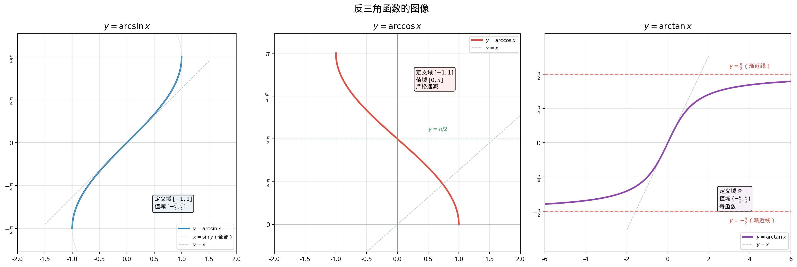

# §1 反三角函数（Inverse Trigonometric Functions）

**前置知识**：[Part 4 第 1 章 §2 复合与反函数](../ch01-function-concepts/02-composition-inverse.md)（反函数的存在条件）、[Part 4 第 3 章 三角函数](../ch03-trigonometric/README.md)（六个三角函数的定义、性质、图像）

**全景图**：三角函数将角度映射为比值，但我们经常需要反过来——从比值恢复角度。由于三角函数的周期性，这个"反向映射"并不直接。本节的核心任务是：通过**限制定义域**使三角函数成为双射，从而定义出三个主要的反三角函数 $\arcsin$、$\arccos$、$\arctan$，研究它们的性质和图像，并用它们来系统地求解三角方程。

**预估学习时间**：约 3–4 小时

---

## 动机

### 问题的起源

在物理和工程中，经常出现这样的问题：

- 一个斜面的倾斜角 $\theta$ 满足 $\sin\theta = 0.6$，求 $\theta$。
- 一个交流电路中，电压和电流的相位差 $\phi$ 满足 $\tan\phi = 2$，求 $\phi$。
- 一个射弹的发射角 $\alpha$ 使得 $\cos\alpha = 0.8$，求 $\alpha$。

这些问题都在问同一件事：**给定三角函数值，求角度**。这正是反函数的工作。

### 困难所在

回顾 Part 4 第 1 章的结论：函数 $f$ 有反函数的充要条件是 $f$ 是**双射**（bijection）。三角函数满足这个条件吗？

答案是**不满足**。以 $\sin x$ 为例：

- $\sin 0 = 0$，$\sin \pi = 0$，$\sin 2\pi = 0$，……同一个值 $0$ 对应无穷多个 $x$。
- 这意味着 $\sin$ **不是单射**（injective）。

更一般地，三角函数的**周期性**使得每个函数值都被无穷多个输入取到。因此，在整个定义域上，三角函数不存在反函数。

### 解决思路

既然全局不行，我们就**局部处理**：选取一个合适的区间，使三角函数在这个区间上既是单射又是满射（到值域上），从而定义反函数。这个思路在 Part 4 第 1 章 §2 中已经讨论过——这里是最重要的应用。

---

## 1. $\arcsin x$——反正弦函数

### 1.1 限制 $\sin x$ 的定义域

$\sin x$ 在整个 $\mathbb{R}$ 上的值域是 $[-1, 1]$。为了让 $\sin$ 成为双射，我们需要找一个区间 $I$，使得：

1. $\sin$ 在 $I$ 上是**严格单调的**（保证单射）；
2. $\sin$ 在 $I$ 上的值域恰好是 $[-1, 1]$（保证满射到值域）。

标准选择是 $I = \left[-\frac{\pi}{2}, \frac{\pi}{2}\right]$。

**为什么选这个区间？**

- $\sin x$ 在 $\left[-\frac{\pi}{2}, \frac{\pi}{2}\right]$ 上严格递增。
- $\sin\left(-\frac{\pi}{2}\right) = -1$，$\sin\left(\frac{\pi}{2}\right) = 1$，所以值域恰好是 $[-1, 1]$。
- 这个区间**包含原点**，使得 $\arcsin 0 = 0$，符合直觉。
- 这个区间是**连续的**，不像 $[0, \pi/2] \cup [3\pi/2, 2\pi]$ 那样断开。

> **定义 1**（反正弦函数，arcsine function）
>
> **反正弦函数** $\arcsin: [-1, 1] \to \left[-\frac{\pi}{2}, \frac{\pi}{2}\right]$ 定义为：
>
> $$y = \arcsin x \iff \sin y = x \text{ 且 } y \in \left[-\frac{\pi}{2}, \frac{\pi}{2}\right]$$
>
> 也记为 $\sin^{-1} x$。

**注意符号**：$\sin^{-1} x$ 是 $\arcsin x$ 的另一种写法，**不是** $(\sin x)^{-1} = \frac{1}{\sin x} = \csc x$。为避免歧义，本书优先使用 $\arcsin$ 记号。

### 1.2 关键性质

| 性质 | 内容 |
|------|------|
| 定义域 | $[-1, 1]$ |
| 值域 | $\left[-\frac{\pi}{2}, \frac{\pi}{2}\right]$ |
| 单调性 | 严格递增 |
| 奇偶性 | **奇函数**：$\arcsin(-x) = -\arcsin x$ |
| 端点值 | $\arcsin(-1) = -\frac{\pi}{2}$，$\arcsin(0) = 0$，$\arcsin(1) = \frac{\pi}{2}$ |

### 1.3 特殊值表

$$\begin{array}{c|cccccc}
x & -1 & -\frac{\sqrt{3}}{2} & -\frac{\sqrt{2}}{2} & -\frac{1}{2} & 0 & \frac{1}{2} & \frac{\sqrt{2}}{2} & \frac{\sqrt{3}}{2} & 1 \\
\hline
\arcsin x & -\frac{\pi}{2} & -\frac{\pi}{3} & -\frac{\pi}{4} & -\frac{\pi}{6} & 0 & \frac{\pi}{6} & \frac{\pi}{4} & \frac{\pi}{3} & \frac{\pi}{2}
\end{array}$$

### 1.4 图像

$\arcsin x$ 的图像可以通过将 $\sin x$（限制在 $[-\pi/2, \pi/2]$ 上）的图像关于直线 $y = x$ **做对称**得到。

**图像特征**：
- 图像从 $(-1, -\pi/2)$ 单调递增到 $(1, \pi/2)$。
- 在 $x = \pm 1$ 处，切线是垂直的（斜率趋向 $\infty$）——这预示着微积分中的 $\frac{d}{dx}\arcsin x = \frac{1}{\sqrt{1-x^2}}$ 在端点处趋于无穷。
- 图像关于原点对称（奇函数）。

---

## 2. $\arccos x$——反余弦函数

### 2.1 限制 $\cos x$ 的定义域

$\cos x$ 在 $[0, \pi]$ 上严格递减，值域为 $[-1, 1]$（因为 $\cos 0 = 1$，$\cos\pi = -1$）。

> **定义 2**（反余弦函数，arccosine function）
>
> **反余弦函数** $\arccos: [-1, 1] \to [0, \pi]$ 定义为：
>
> $$y = \arccos x \iff \cos y = x \text{ 且 } y \in [0, \pi]$$

### 2.2 关键性质

| 性质 | 内容 |
|------|------|
| 定义域 | $[-1, 1]$ |
| 值域 | $[0, \pi]$ |
| 单调性 | 严格递减（注意！与 $\arcsin$ 相反） |
| 奇偶性 | **既不是奇函数也不是偶函数** |
| 端点值 | $\arccos(-1) = \pi$，$\arccos(0) = \frac{\pi}{2}$，$\arccos(1) = 0$ |

### 2.3 特殊值表

$$\begin{array}{c|cccccc}
x & -1 & -\frac{\sqrt{3}}{2} & -\frac{\sqrt{2}}{2} & -\frac{1}{2} & 0 & \frac{1}{2} & \frac{\sqrt{2}}{2} & \frac{\sqrt{3}}{2} & 1 \\
\hline
\arccos x & \pi & \frac{5\pi}{6} & \frac{3\pi}{4} & \frac{2\pi}{3} & \frac{\pi}{2} & \frac{\pi}{3} & \frac{\pi}{4} & \frac{\pi}{6} & 0
\end{array}$$

### 2.4 $\arcsin$ 与 $\arccos$ 的关系

> **命题 1**（互余关系，complementary identity）
>
> 对所有 $x \in [-1, 1]$：
>
> $$\arcsin x + \arccos x = \frac{\pi}{2}$$

**证明**. 设 $\alpha = \arcsin x$，则 $\sin\alpha = x$ 且 $\alpha \in [-\pi/2, \pi/2]$。

由余角关系 $\cos(\frac{\pi}{2} - \alpha) = \sin\alpha = x$。

又 $\frac{\pi}{2} - \alpha \in [0, \pi]$（因为 $\alpha \in [-\pi/2, \pi/2]$），这恰好是 $\arccos$ 值域的要求。

因此 $\arccos x = \frac{\pi}{2} - \alpha = \frac{\pi}{2} - \arcsin x$。$\blacksquare$

**实用价值**：有了这个恒等式，任何涉及 $\arccos$ 的计算都可以转化为 $\arcsin$（或反之），减少需要记忆的公式。

### 2.5 $\arccos$ 的对称性

虽然 $\arccos$ 不是奇函数，但它有自己的对称性：

> **命题 2**
>
> 对所有 $x \in [-1, 1]$：$\arccos(-x) = \pi - \arccos x$。

**证明**. $\arccos(-x) = \frac{\pi}{2} - \arcsin(-x) = \frac{\pi}{2} + \arcsin x = \frac{\pi}{2} + \left(\frac{\pi}{2} - \arccos x\right) = \pi - \arccos x$。$\blacksquare$

---

## 3. $\arctan x$——反正切函数

### 3.1 限制 $\tan x$ 的定义域

$\tan x$ 在 $\left(-\frac{\pi}{2}, \frac{\pi}{2}\right)$ 上严格递增，值域为 $\mathbb{R}$（全体实数）。

> **定义 3**（反正切函数，arctangent function）
>
> **反正切函数** $\arctan: \mathbb{R} \to \left(-\frac{\pi}{2}, \frac{\pi}{2}\right)$ 定义为：
>
> $$y = \arctan x \iff \tan y = x \text{ 且 } y \in \left(-\frac{\pi}{2}, \frac{\pi}{2}\right)$$

### 3.2 关键性质

| 性质 | 内容 |
|------|------|
| 定义域 | $\mathbb{R}$（全体实数——这是与 $\arcsin, \arccos$ 的重要区别） |
| 值域 | $\left(-\frac{\pi}{2}, \frac{\pi}{2}\right)$（**开区间**——不包含端点） |
| 单调性 | 严格递增 |
| 奇偶性 | **奇函数**：$\arctan(-x) = -\arctan x$ |
| 渐近行为 | $\lim_{x \to +\infty}\arctan x = \frac{\pi}{2}$，$\lim_{x \to -\infty}\arctan x = -\frac{\pi}{2}$ |

### 3.3 特殊值

$$\arctan 0 = 0, \quad \arctan 1 = \frac{\pi}{4}, \quad \arctan\sqrt{3} = \frac{\pi}{3}, \quad \arctan\frac{1}{\sqrt{3}} = \frac{\pi}{6}$$

### 3.4 水平渐近线

$\arctan x$ 有两条**水平渐近线**：$y = \frac{\pi}{2}$ 和 $y = -\frac{\pi}{2}$。

这是因为 $\tan y \to +\infty$（当 $y \to \frac{\pi}{2}^-$），所以反过来，当 $x \to +\infty$ 时，$\arctan x \to \frac{\pi}{2}$。类似地，$x \to -\infty$ 时 $\arctan x \to -\frac{\pi}{2}$。

### 3.5 $\arctan$ 与 $\text{arccot}$ 的关系

类似于 $\arcsin$ 和 $\arccos$ 的互余关系：

> **命题 3**
>
> 对所有 $x \in \mathbb{R}$：$\arctan x + \text{arccot}\, x = \frac{\pi}{2}$。

---

## 4. 其他反三角函数（简述）

除了三个主要的反三角函数外，$\cot$、$\sec$、$\csc$ 也可以类似地定义反函数：

| 函数 | 限制区间 | 反函数 | 定义域 | 值域 |
|------|----------|--------|--------|------|
| $\sin$ | $[-\pi/2, \pi/2]$ | $\arcsin$ | $[-1, 1]$ | $[-\pi/2, \pi/2]$ |
| $\cos$ | $[0, \pi]$ | $\arccos$ | $[-1, 1]$ | $[0, \pi]$ |
| $\tan$ | $(-\pi/2, \pi/2)$ | $\arctan$ | $\mathbb{R}$ | $(-\pi/2, \pi/2)$ |
| $\cot$ | $(0, \pi)$ | $\text{arccot}$ | $\mathbb{R}$ | $(0, \pi)$ |
| $\sec$ | $[0, \pi] \setminus \{\pi/2\}$ | $\text{arcsec}$ | $(-\infty, -1] \cup [1, +\infty)$ | $[0, \pi] \setminus \{\pi/2\}$ |
| $\csc$ | $[-\pi/2, \pi/2] \setminus \{0\}$ | $\text{arccsc}$ | $(-\infty, -1] \cup [1, +\infty)$ | $[-\pi/2, \pi/2] \setminus \{0\}$ |

在实际应用中，$\arcsin$、$\arccos$、$\arctan$ 是最常用的三个，其余三个可以通过恒等式转化。例如 $\text{arcsec}\, x = \arccos\frac{1}{x}$（$|x| \geq 1$）。

---

## 5. 反三角函数的恒等式

### 5.1 基本复合恒等式

> **命题 4**（正向复合）
>
> (a) $\sin(\arcsin x) = x$，对所有 $x \in [-1, 1]$。
>
> (b) $\cos(\arccos x) = x$，对所有 $x \in [-1, 1]$。
>
> (c) $\tan(\arctan x) = x$，对所有 $x \in \mathbb{R}$。

这些等式直接来自反函数的定义：$f(f^{-1}(x)) = x$。

### 5.2 ⚠️ 反向复合——最常见的错误

> **命题 5**（反向复合需要条件！）
>
> (a) $\arcsin(\sin x) = x$ **仅当** $x \in \left[-\frac{\pi}{2}, \frac{\pi}{2}\right]$。
>
> (b) $\arccos(\cos x) = x$ **仅当** $x \in [0, \pi]$。
>
> (c) $\arctan(\tan x) = x$ **仅当** $x \in \left(-\frac{\pi}{2}, \frac{\pi}{2}\right)$。

**为什么不能去掉条件？** $f^{-1}(f(x)) = x$ 只在 $f$ 的限制定义域上成立。如果 $x$ 在限制定义域之外，$\arcsin(\sin x)$ 仍然有意义（因为 $\sin x \in [-1,1]$ 总是成立），但结果会被"折叠"回 $[-\pi/2, \pi/2]$。

**例题 1**. 计算以下各值。

(a) $\arcsin\left(\sin\frac{\pi}{3}\right)$

$\frac{\pi}{3} \in [-\frac{\pi}{2}, \frac{\pi}{2}]$，所以直接有 $\arcsin\left(\sin\frac{\pi}{3}\right) = \frac{\pi}{3}$。✓

(b) $\arcsin\left(\sin\frac{5\pi}{6}\right)$

$\frac{5\pi}{6} \notin [-\frac{\pi}{2}, \frac{\pi}{2}]$，**不能**直接写 $\frac{5\pi}{6}$！

先计算 $\sin\frac{5\pi}{6} = \sin\left(\pi - \frac{\pi}{6}\right) = \sin\frac{\pi}{6} = \frac{1}{2}$。

然后 $\arcsin\frac{1}{2} = \frac{\pi}{6}$。

所以 $\arcsin\left(\sin\frac{5\pi}{6}\right) = \frac{\pi}{6}$（不是 $\frac{5\pi}{6}$！）。

(c) $\arccos\left(\cos\frac{7\pi}{4}\right)$

$\frac{7\pi}{4} \notin [0, \pi]$。$\cos\frac{7\pi}{4} = \cos\left(2\pi - \frac{\pi}{4}\right) = \cos\frac{\pi}{4} = \frac{\sqrt{2}}{2}$。

$\arccos\frac{\sqrt{2}}{2} = \frac{\pi}{4}$。

(d) $\arctan\left(\tan\frac{3\pi}{4}\right)$

$\frac{3\pi}{4} \notin (-\frac{\pi}{2}, \frac{\pi}{2})$。$\tan\frac{3\pi}{4} = -1$。$\arctan(-1) = -\frac{\pi}{4}$。

### 5.3 $\arcsin(\sin x)$ 的一般公式

> **命题 6**
>
> 对所有 $x \in \mathbb{R}$：
>
> $$\arcsin(\sin x) = (-1)^n\left(x - n\pi\right)$$
>
> 其中 $n$ 是使 $x - n\pi \in [-\frac{\pi}{2}, \frac{\pi}{2}]$ 的整数。

等价地，$\arcsin(\sin x)$ 的图像是一个**锯齿波**（zigzag），在 $[-\pi/2, \pi/2]$ 内是恒等函数，然后通过反射周期性延拓。

### 5.4 混合恒等式

在很多问题中，我们需要计算诸如 $\sin(\arccos x)$ 这样的"交叉"复合。方法是利用勾股定理。

> **命题 7**（交叉复合恒等式）
>
> 对 $x \in [-1, 1]$：
>
> (a) $\sin(\arccos x) = \sqrt{1 - x^2}$
>
> (b) $\cos(\arcsin x) = \sqrt{1 - x^2}$
>
> 对 $x \in \mathbb{R}$：
>
> (c) $\sin(\arctan x) = \frac{x}{\sqrt{1 + x^2}}$
>
> (d) $\cos(\arctan x) = \frac{1}{\sqrt{1 + x^2}}$

**证明（以 (a) 为例）**. 设 $\theta = \arccos x$，则 $\cos\theta = x$ 且 $\theta \in [0, \pi]$。

由 $\sin^2\theta + \cos^2\theta = 1$，得 $\sin\theta = \pm\sqrt{1 - x^2}$。

因为 $\theta \in [0, \pi]$，所以 $\sin\theta \geq 0$，取正号：$\sin(\arccos x) = \sqrt{1-x^2}$。$\blacksquare$

**证明（(c)）**. 设 $\theta = \arctan x$，则 $\tan\theta = x$ 且 $\theta \in (-\pi/2, \pi/2)$。

构造直角三角形：对边 $= x$，邻边 $= 1$，斜边 $= \sqrt{1+x^2}$。

$$\sin\theta = \frac{x}{\sqrt{1+x^2}} \qquad \blacksquare$$

**例题 2**. 化简 $\cos\left(2\arcsin\frac{3}{5}\right)$。

设 $\theta = \arcsin\frac{3}{5}$，则 $\sin\theta = \frac{3}{5}$，$\cos\theta = \frac{4}{5}$。

$$\cos(2\theta) = 1 - 2\sin^2\theta = 1 - 2\cdot\frac{9}{25} = 1 - \frac{18}{25} = \frac{7}{25}$$

**例题 3**. 化简 $\tan\left(\arcsin\frac{5}{13}\right)$。

设 $\theta = \arcsin\frac{5}{13}$，则 $\sin\theta = \frac{5}{13}$，$\cos\theta = \sqrt{1 - \frac{25}{169}} = \frac{12}{13}$。

$$\tan\theta = \frac{\sin\theta}{\cos\theta} = \frac{5/13}{12/13} = \frac{5}{12}$$

### 5.5 反三角函数的加法公式

> **命题 8**（$\arctan$ 的加法公式）
>
> 若 $xy < 1$，则
>
> $$\arctan x + \arctan y = \arctan\frac{x+y}{1-xy}$$
>
> 若 $xy > 1$ 且 $x > 0$，则
>
> $$\arctan x + \arctan y = \pi + \arctan\frac{x+y}{1-xy}$$

**证明**. 设 $\alpha = \arctan x$，$\beta = \arctan y$。由正切加法公式：

$$\tan(\alpha + \beta) = \frac{\tan\alpha + \tan\beta}{1 - \tan\alpha\tan\beta} = \frac{x+y}{1-xy}$$

当 $xy < 1$ 时，$\alpha + \beta \in (-\pi/2, \pi/2)$，所以可以直接取 $\arctan$。

当 $xy > 1$ 且 $x, y > 0$ 时，$\alpha + \beta \in (\pi/2, \pi)$，需要加上 $\pi$ 的修正。$\blacksquare$

**例题 4**. 证明 $\arctan 1 + \arctan 2 + \arctan 3 = \pi$。

先计算 $\arctan 2 + \arctan 3$。因为 $2 \cdot 3 = 6 > 1$ 且 $2 > 0$：

$$\arctan 2 + \arctan 3 = \pi + \arctan\frac{2+3}{1-6} = \pi + \arctan(-1) = \pi - \frac{\pi}{4} = \frac{3\pi}{4}$$

所以 $\arctan 1 + \arctan 2 + \arctan 3 = \frac{\pi}{4} + \frac{3\pi}{4} = \pi$。$\blacksquare$

---

## 6. 三角方程的求解

反三角函数为系统地写出三角方程的**全部解**提供了标准框架。

### 6.1 $\sin x = a$ 的通解

> **定理 1**（正弦方程的通解）
>
> 方程 $\sin x = a$（$|a| \leq 1$）的全部解为：
>
> $$x = n\pi + (-1)^n \arcsin a, \quad n \in \mathbb{Z}$$

**推导**. $\sin x = a$ 有一个**特解** $x_0 = \arcsin a$。

$\sin$ 的所有零点位于 $n\pi$，利用 $\sin(\pi - x_0) = \sin x_0$ 以及周期性 $2\pi$，可以验证通解公式涵盖了所有解。具体地：
- $n$ 为偶数时，$x = 2k\pi + \arcsin a$；
- $n$ 为奇数时，$x = (2k+1)\pi - \arcsin a = \pi - \arcsin a + 2k\pi$。

这两类恰好对应 $\sin$ 在每个周期中取同一值的两个位置。

### 6.2 $\cos x = a$ 的通解

> **定理 2**（余弦方程的通解）
>
> 方程 $\cos x = a$（$|a| \leq 1$）的全部解为：
>
> $$x = 2n\pi \pm \arccos a, \quad n \in \mathbb{Z}$$

**推导**. 特解 $x_0 = \arccos a$。由 $\cos$ 的偶函数性质 $\cos(-x_0) = \cos x_0$，再利用周期 $2\pi$ 即得。

### 6.3 $\tan x = a$ 的通解

> **定理 3**（正切方程的通解）
>
> 方程 $\tan x = a$（$a \in \mathbb{R}$）的全部解为：
>
> $$x = n\pi + \arctan a, \quad n \in \mathbb{Z}$$

**推导**. $\tan$ 的周期为 $\pi$，且在每个周期中取每个值恰好一次，所以通解的结构最简单。

### 6.4 应用举例

**例题 5**. 求 $2\sin x - 1 = 0$ 的通解。

$\sin x = \frac{1}{2}$，$\arcsin\frac{1}{2} = \frac{\pi}{6}$。

通解：$x = n\pi + (-1)^n \cdot \frac{\pi}{6}$，$n \in \mathbb{Z}$。

展开前几项：$x = \frac{\pi}{6}, \frac{5\pi}{6}, \frac{\pi}{6} + 2\pi, \frac{5\pi}{6} + 2\pi, \ldots$

**例题 6**. 求 $\cos 2x = \frac{\sqrt{3}}{2}$ 在 $[0, 2\pi)$ 中的所有解。

$2x = 2n\pi \pm \arccos\frac{\sqrt{3}}{2} = 2n\pi \pm \frac{\pi}{6}$。

$x = n\pi \pm \frac{\pi}{12}$。

在 $[0, 2\pi)$ 中：$x = \frac{\pi}{12}, \frac{11\pi}{12}, \frac{13\pi}{12}, \frac{23\pi}{12}$。

**例题 7**. 求 $\tan(3x - \frac{\pi}{4}) = \sqrt{3}$ 的通解。

$3x - \frac{\pi}{4} = n\pi + \arctan\sqrt{3} = n\pi + \frac{\pi}{3}$。

$3x = n\pi + \frac{\pi}{3} + \frac{\pi}{4} = n\pi + \frac{7\pi}{12}$。

$x = \frac{n\pi}{3} + \frac{7\pi}{36}$，$n \in \mathbb{Z}$。

**例题 8**. 求 $2\cos^2 x + 3\sin x - 3 = 0$ 在 $[0, 2\pi)$ 中的所有解。

用 $\cos^2 x = 1 - \sin^2 x$ 代换：

$$2(1 - \sin^2 x) + 3\sin x - 3 = 0 \implies -2\sin^2 x + 3\sin x - 1 = 0$$

$$2\sin^2 x - 3\sin x + 1 = 0 \implies (2\sin x - 1)(\sin x - 1) = 0$$

- $\sin x = \frac{1}{2}$：$x = \frac{\pi}{6}$ 或 $x = \frac{5\pi}{6}$。
- $\sin x = 1$：$x = \frac{\pi}{2}$。

解集为 $\left\{\frac{\pi}{6}, \frac{\pi}{2}, \frac{5\pi}{6}\right\}$。

**例题 9**. 求 $\sin x + \cos x = 1$ 在 $[0, 2\pi)$ 中的所有解。

利用辅助角公式：$\sin x + \cos x = \sqrt{2}\sin\left(x + \frac{\pi}{4}\right)$。

$$\sqrt{2}\sin\left(x + \frac{\pi}{4}\right) = 1 \implies \sin\left(x + \frac{\pi}{4}\right) = \frac{1}{\sqrt{2}} = \frac{\sqrt{2}}{2}$$

$$x + \frac{\pi}{4} = n\pi + (-1)^n\frac{\pi}{4}$$

- $n = 0$：$x + \frac{\pi}{4} = \frac{\pi}{4}$，$x = 0$。
- $n = 1$：$x + \frac{\pi}{4} = \pi - \frac{\pi}{4} = \frac{3\pi}{4}$，$x = \frac{\pi}{2}$。
- $n = 2$：$x + \frac{\pi}{4} = 2\pi + \frac{\pi}{4}$，$x = 2\pi$（不在 $[0, 2\pi)$ 中）。

解集为 $\left\{0, \frac{\pi}{2}\right\}$。

验证：$\sin 0 + \cos 0 = 0 + 1 = 1$ ✓；$\sin\frac{\pi}{2} + \cos\frac{\pi}{2} = 1 + 0 = 1$ ✓。

---

## 7. 反三角函数与直角三角形

反三角函数提供了一种从**边长信息**直接得到**角度信息**的桥梁。

**例题 10**. 在直角三角形 $ABC$ 中，$\angle C = 90°$，$a = 3$，$b = 4$，$c = 5$。求 $\angle A$ 和 $\angle B$。

$$\angle A = \arcsin\frac{a}{c} = \arcsin\frac{3}{5} = \arctan\frac{3}{4}$$

$$\angle B = \arcsin\frac{b}{c} = \arcsin\frac{4}{5} = \arctan\frac{4}{3}$$

注意 $\arctan\frac{3}{4} + \arctan\frac{4}{3} = \frac{\pi}{2}$（互余），这也可以用命题 8 的加法公式验证：

$$\arctan\frac{3}{4} + \arctan\frac{4}{3} = \arctan\frac{\frac{3}{4}+\frac{4}{3}}{1-\frac{3}{4}\cdot\frac{4}{3}}$$

分母 $= 1 - 1 = 0$，$\frac{x+y}{1-xy} \to \infty$，所以 $\arctan(\infty) = \frac{\pi}{2}$。✓

---

## 8. 常见错误与辨析

### 错误 1：$\arcsin(\sin x) = x$（不加条件）

$\arcsin(\sin\frac{5\pi}{6}) = \frac{\pi}{6} \neq \frac{5\pi}{6}$。正确做法见 §5.2。

### 错误 2：$\sin^{-1} x = \frac{1}{\sin x}$

$\sin^{-1}$ 是反函数记号，**不是**负一次幂。$\frac{1}{\sin x} = \csc x$。

### 错误 3：忽略通解的完整性

$\sin x = \frac{1}{2}$ 的解不只是 $x = \frac{\pi}{6}$，也包括 $x = \frac{5\pi}{6}$，以及所有周期平移。

### 错误 4：$\arctan x + \arctan y = \arctan\frac{x+y}{1-xy}$（不考虑 $xy \geq 1$ 的情况）

当 $xy > 1$ 时需要加或减 $\pi$ 修正（见命题 8）。

---

## 要点回顾

1. **反三角函数存在的前提**是限制三角函数的定义域使之成为双射。
2. **三个主要反三角函数**：$\arcsin: [-1,1] \to [-\pi/2, \pi/2]$，$\arccos: [-1,1] \to [0,\pi]$，$\arctan: \mathbb{R} \to (-\pi/2, \pi/2)$。
3. **互余关系**：$\arcsin x + \arccos x = \frac{\pi}{2}$。
4. **正向复合**总是等于 $x$：$\sin(\arcsin x) = x$。
5. **反向复合**需要条件：$\arcsin(\sin x) = x$ 仅当 $x \in [-\pi/2, \pi/2]$。
6. **交叉复合**用勾股定理处理：$\sin(\arccos x) = \sqrt{1-x^2}$。
7. **三角方程通解**：$\sin x = a \Rightarrow x = n\pi + (-1)^n\arcsin a$；$\cos x = a \Rightarrow x = 2n\pi \pm \arccos a$；$\tan x = a \Rightarrow x = n\pi + \arctan a$。

---

## 进度检查点

> **暂认 / 兑现 追踪**
>
> | 暂认项目 | 状态 | 说明 |
> |----------|------|------|
> | $\frac{d}{dx}\arcsin x = \frac{1}{\sqrt{1-x^2}}$ | 暂认 | 将在 Part 6 微积分基础中推导 |
> | $\lim_{x \to 0}\frac{\sin x}{x} = 1$ | 暂认 | 用于解释渐近行为，Part 6 严格证明 |
> | $\int \frac{dx}{\sqrt{1-x^2}} = \arcsin x + C$ | 暂认 | Part 6 反导数的重要应用 |

---

## 自测题

**自测 1**. $\arcsin\left(\sin\frac{7\pi}{6}\right)$ 的值是？

答案

$\sin\frac{7\pi}{6} = -\sin\frac{\pi}{6} = -\frac{1}{2}$。$\arcsin\left(-\frac{1}{2}\right) = -\frac{\pi}{6}$。

答案：$-\frac{\pi}{6}$。

**自测 2**. $\arccos(-\frac{\sqrt{3}}{2})$ 的值是？

答案

需要找 $\theta \in [0, \pi]$ 使得 $\cos\theta = -\frac{\sqrt{3}}{2}$。$\cos\frac{5\pi}{6} = -\frac{\sqrt{3}}{2}$。

答案：$\frac{5\pi}{6}$。

**自测 3**. 化简 $\cos(\arctan 3)$。

答案

设 $\theta = \arctan 3$。构造直角三角形：对边 $= 3$，邻边 $= 1$，斜边 $= \sqrt{10}$。$\cos\theta = \frac{1}{\sqrt{10}}$。

**自测 4**. 方程 $\cos x = -\frac{1}{2}$ 的通解是什么？

答案

$\arccos(-\frac{1}{2}) = \frac{2\pi}{3}$。通解：$x = 2n\pi \pm \frac{2\pi}{3}$，$n \in \mathbb{Z}$。

**自测 5**. 下面哪个等式是错的？(a) $\sin(\arcsin 0.5) = 0.5$；(b) $\arcsin(\sin 3\pi) = 3\pi$；(c) $\arctan(-1) = -\pi/4$。

答案

**(b)** 是错的。$\sin 3\pi = 0$，$\arcsin 0 = 0 \neq 3\pi$。(a) 和 (c) 都是正确的。

---

## 习题引用

→ [练习题](exercises/exercises.md)（15+ 题，含基础与综合）

→ [练习题解答](exercises/solutions.md)

→ [挑战题](exercises/challenge.md)（2 道高难度题）

→ [思考者角落](thinkers-corner.md)
