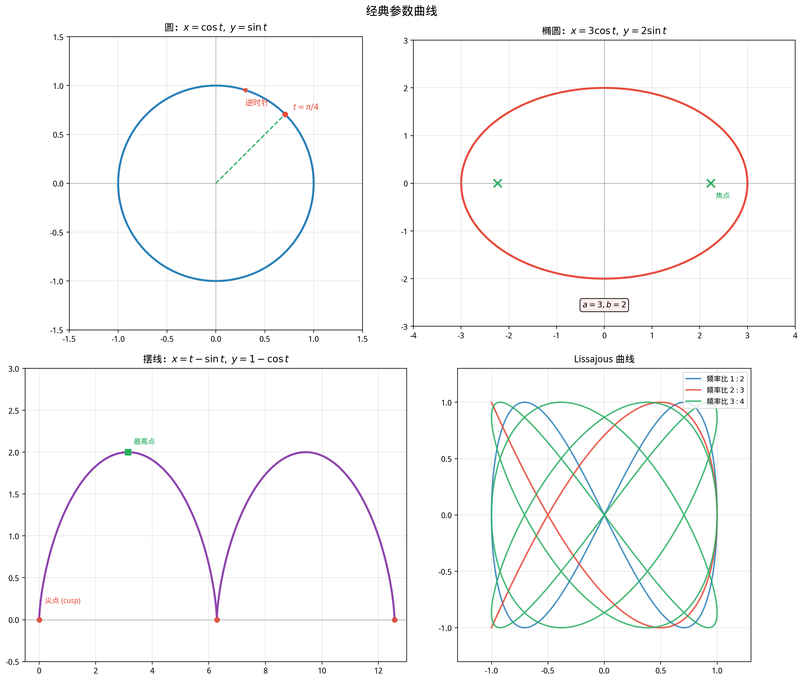

# §1 参数方程（Parametric Equations）

**前置知识**：[Part 4 第 1 章 函数概念](../ch01-function-concepts/README.md)（函数与图像）、[Part 4 第 3 章 三角函数](../ch03-trigonometric/README.md)（三角函数的性质——参数化大量使用三角函数）

**全景图**：之前描述曲线的方式是给出一个方程 $y = f(x)$ 或 $F(x,y) = 0$。但这种方式有其局限——有些曲线无法用单一的 $y = f(x)$ 表达（如圆），有些曲线的隐式方程 $F(x,y)=0$ 虽然存在但极为复杂。参数方程提供了全新的视角：我们引入一个辅助变量（**参数**），分别用两个函数表达 $x$ 和 $y$。参数就像时间——它告诉我们曲线是如何被"描画"出来的。

**预估学习时间**：约 2.5–3.5 小时

---

## 动机

### 从物理到数学

想象一个粒子在平面上运动。在时刻 $t$，它的位置是 $(x(t), y(t))$。我们不需要先知道 $y$ 关于 $x$ 的关系——我们只需要知道每个时刻的坐标。当 $t$ 从某个起始值变化到终止值时，粒子的轨迹就形成了一条曲线。

这种描述方式天然地就是**参数方程**。

### 垂直线检验的限制

回顾 Part 4 第 1 章：函数 $y = f(x)$ 的图像必须通过**垂直线检验**（每条垂直线至多交曲线一点）。但很多自然的曲线不满足这个条件：

- **圆** $x^2 + y^2 = r^2$：垂直线 $x = 0$ 交圆于两点。
- **椭圆**、**双曲线**等圆锥曲线也类似。
- 更复杂的曲线（如"8"字形、摆线）更是如此。

参数方程打破了这个限制——它可以描述**任意形状的曲线**，包括自交曲线和闭合曲线。

---

## 1. 参数方程的基本概念

### 1.1 定义

> **定义 1**（参数方程，parametric equations）
>
> 设 $f$ 和 $g$ 是定义在区间 $I$ 上的函数。方程组
>
> $$x = f(t), \quad y = g(t), \quad t \in I$$
>
> 称为一组**参数方程**。变量 $t$ 称为**参数**（parameter）。当 $t$ 遍历 $I$ 时，点 $(x, y) = (f(t), g(t))$ 在平面上描出的轨迹称为参数方程的**参数曲线**（parametric curve）。

**注意**：参数方程不仅确定了曲线的**形状**，还确定了曲线被**描画的方向**（随着 $t$ 增大，点的运动方向）和**速度**（$t$ 变化相同的量，点移动的距离可以不同）。

### 1.2 第一个例子：直线段

设 $A = (x_1, y_1)$ 和 $B = (x_2, y_2)$ 是平面上两点。从 $A$ 到 $B$ 的线段可以参数化为：

$$x = x_1 + t(x_2 - x_1) = (1-t)x_1 + tx_2, \quad y = (1-t)y_1 + ty_2, \quad t \in [0, 1]$$

- $t = 0$ 时在 $A$，$t = 1$ 时在 $B$。
- $t = 1/2$ 时在中点 $\left(\frac{x_1+x_2}{2}, \frac{y_1+y_2}{2}\right)$。
- 这其实就是向量的**线性插值**（linear interpolation）。

**例题 1**. 写出从 $(1, 3)$ 到 $(4, -1)$ 的线段的参数方程。

$$x = 1 + 3t, \quad y = 3 - 4t, \quad t \in [0, 1]$$

验证：$t = 0$ 得 $(1, 3)$ ✓；$t = 1$ 得 $(4, -1)$ ✓。

---

## 2. 消参——从参数方程到直角坐标方程

### 2.1 消参的方法

"消参"（eliminating the parameter）是从参数方程中消去参数 $t$，得到 $x$ 和 $y$ 之间的直接关系的过程。

**方法**：从一个方程中解出 $t$，代入另一个方程。

**例题 2**. $x = 2t + 1$，$y = t^2 - 3$。

从第一个方程：$t = \frac{x-1}{2}$。代入第二个：

$$y = \left(\frac{x-1}{2}\right)^2 - 3 = \frac{(x-1)^2}{4} - 3$$

这是一条抛物线。

**例题 3**. $x = 3\cos t$，$y = 3\sin t$，$t \in [0, 2\pi)$。

$\cos t = x/3$，$\sin t = y/3$。由 $\cos^2 t + \sin^2 t = 1$：

$$\frac{x^2}{9} + \frac{y^2}{9} = 1 \implies x^2 + y^2 = 9$$

这是半径为 $3$ 的圆。

### 2.2 消参的注意事项

> ⚠️ **消参可能丢失信息**
>
> 参数方程包含的信息（方向、速度、参数范围）在消参后可能丢失。

**例题 4**. 比较以下两组参数方程：
- (A) $x = t$，$y = t^2$，$t \in \mathbb{R}$
- (B) $x = \sin t$，$y = \sin^2 t$，$t \in \mathbb{R}$

两者消参后都得到 $y = x^2$。但 (B) 的范围是 $x \in [-1, 1]$（因为 $\sin t \in [-1, 1]$），而 (A) 覆盖整条抛物线。

另外，(A) 中 $x$ 单调递增（粒子从左到右一直走），而 (B) 中粒子在 $[-1, 1]$ 之间来回振荡。

---

## 3. 经典参数曲线

### 3.1 圆的参数化

标准圆 $x^2 + y^2 = r^2$ 的标准参数化：

$$x = r\cos t, \quad y = r\sin t, \quad t \in [0, 2\pi)$$

这来自三角函数的基本性质：$r^2\cos^2 t + r^2\sin^2 t = r^2$。

当 $t$ 从 $0$ 增加到 $2\pi$ 时，点 $(x,y)$ **逆时针**绑定圆一周。

**变体**：圆心在 $(a, b)$、半径为 $r$ 的圆：

$$x = a + r\cos t, \quad y = b + r\sin t$$

### 3.2 椭圆的参数化

椭圆 $\frac{x^2}{a^2} + \frac{y^2}{b^2} = 1$ 的标准参数化：

$$x = a\cos t, \quad y = b\sin t, \quad t \in [0, 2\pi)$$

验证：$\frac{a^2\cos^2 t}{a^2} + \frac{b^2\sin^2 t}{b^2} = \cos^2 t + \sin^2 t = 1$ ✓。

**注意**：这里参数 $t$ **不是**椭圆上的点与原点连线的角度（除非 $a = b$，即圆的情况）。$t$ 有时被称为**离心角**（eccentric anomaly）——在天文学的开普勒方程中有重要意义。

### 3.3 摆线（Cycloid）

> **定义 2**（摆线，cycloid）
>
> **摆线**是一个半径为 $r$ 的圆沿直线滚动时，圆周上一定点所描绘的曲线。

**推导参数方程**. 设圆沿 $x$ 轴滚动，标记点初始位于原点。当圆滚过角度 $t$（弧度），圆心位于 $(rt, r)$。

标记点相对于圆心的位置为 $(-r\sin t, -r\cos t)$（注意相对于圆心向下旋转）。

因此标记点的绝对位置为：

$$x = rt - r\sin t = r(t - \sin t)$$
$$y = r - r\cos t = r(1 - \cos t)$$

即**摆线的参数方程**为：

$$\boxed{x = r(t - \sin t), \quad y = r(1 - \cos t), \quad t \in \mathbb{R}}$$

**摆线的特点**：
- 摆线由无穷多个"拱形"（arch）组成，每个拱形对应 $t \in [2k\pi, 2(k+1)\pi]$。
- 一个拱形的长度为 $8r$（将在微积分中证明）。
- 一个拱形下的面积为 $3\pi r^2$——恰好是滚动圆面积 $\pi r^2$ 的 **3 倍**！
- 摆线是**最速降线**（brachistochrone）和**等时线**（tautochrone）——这两个历史上的著名问题将在 Part 6 思考者角落中讨论。

**例题 5**. 摆线在 $t = 0, \pi, 2\pi$ 处的坐标是什么？

- $t = 0$：$(0, 0)$（起点，也是一个**尖点/cusp**）。
- $t = \pi$：$(\pi r, 2r)$（拱形的最高点）。
- $t = 2\pi$：$(2\pi r, 0)$（回到底部，下一个尖点）。

### 3.4 Lissajous 曲线

> **定义 3**（Lissajous 曲线）
>
> **Lissajous 曲线**（又称 Lissajous 图形）由参数方程
>
> $$x = A\sin(at + \delta), \quad y = B\sin(bt)$$
>
> 定义，其中 $A, B$ 是振幅，$a, b$ 是频率，$\delta$ 是相位差。

Lissajous 曲线的形状完全由**频率比** $a:b$ 和**相位差** $\delta$ 决定。

| $a:b$ | $\delta$ | 曲线形状 |
|--------|----------|----------|
| $1:1$ | $0$ | 直线段 $y = \frac{B}{A}x$ |
| $1:1$ | $\pi/2$ | 椭圆 |
| $1:2$ | $0$ | "∞"字形（双纽线状） |
| $2:3$ | $\pi/2$ | 更复杂的闭合曲线 |

**物理背景**：Lissajous 曲线最初出现在 19 世纪 Jules Antoine Lissajous 对两个正交振动的叠加的研究中。今天，用示波器观察两个正弦信号的合成图形，看到的就是 Lissajous 曲线。如果曲线闭合，则两个频率的比值是有理数。

---

## 4. 参数化的非唯一性

> **关键观察**：同一条曲线可以有**无穷多种**不同的参数化方式。

### 4.1 简单例子：圆

以下三组参数方程描述的是**同一条曲线**（单位圆），但参数化方式不同：

**(A)** $x = \cos t, \quad y = \sin t, \quad t \in [0, 2\pi)$

逆时针，从 $(1, 0)$ 开始。

**(B)** $x = \sin t, \quad y = \cos t, \quad t \in [0, 2\pi)$

逆时针转 $90°$——从 $(0, 1)$ 开始。实际上曲线先顺时针走半圈再……更准确地说，当 $t$ 增大时，$x = \sin t$ 先增后减，$y = \cos t$ 先减后增，所以这实际上是**顺时针**方向。

**(C)** $x = \cos 2t, \quad y = \sin 2t, \quad t \in [0, \pi)$

速度加倍——$t$ 只需走 $[0, \pi)$ 就绑定一圈。

**(D)** $x = \frac{1-t^2}{1+t^2}, \quad y = \frac{2t}{1+t^2}, \quad t \in \mathbb{R}$

有理参数化（rational parametrization），用有理函数描述圆！这在代数几何中意义重大——它证明了圆是**有理曲线**（rational curve）。

不过 (D) 遗漏了一个点：当 $t \to \pm\infty$ 时，$(x, y) \to (-1, 0)$，但 $(-1, 0)$ 本身不被有限的 $t$ 值取到。

### 4.2 重新参数化（Reparametrization）

> **定义 4**（重新参数化）
>
> 设 $\gamma(t) = (f(t), g(t))$（$t \in I$）是一条参数曲线。若 $\phi: J \to I$ 是一个连续的双射函数，则
>
> $$\tilde{\gamma}(s) = \gamma(\phi(s)) = (f(\phi(s)), g(\phi(s))), \quad s \in J$$
>
> 是 $\gamma$ 的一个**重新参数化**。
>
> 若 $\phi$ 严格递增，称为**保向重新参数化**（orientation-preserving）。
> 若 $\phi$ 严格递减，称为**反向重新参数化**（orientation-reversing）。

**例题 6**. 线段 $x = 1 + 3t$，$y = 3 - 4t$（$t \in [0, 1]$）用 $t = s^2$（$s \in [0, 1]$）重新参数化后变为：

$$x = 1 + 3s^2, \quad y = 3 - 4s^2, \quad s \in [0, 1]$$

这描述了同一条线段，但"速度"不同——开始慢，结束快。

### 4.3 弧长参数化（预告）

在微积分中，有一种特别"自然"的参数化方式——**弧长参数化**（arc length parametrization），其中参数 $s$ 就是从曲线起点到当前点的弧长。这种参数化在微分几何中有核心地位：曲线在弧长参数下的"速度"恒为 $1$。

---

## 5. 参数方程与隐式方程的比较

| 方面 | $y = f(x)$ / $F(x,y)=0$ | $x = f(t), y = g(t)$ |
|------|--------------------------|----------------------|
| 曲线的限制 | $y=f(x)$ 需通过垂直线检验 | 无限制——可描述任意曲线 |
| 方向与速度 | 无 | 有——$t$ 增加的方向就是运动方向 |
| 自交 | $y=f(x)$ 不可自交 | 可以自交 |
| 消参 | — | 可能复杂，可能丢失信息 |
| 计算弧长/面积 | 需要特定公式 | 有统一的参数公式 |

---

## 要点回顾

1. **参数方程** $x = f(t), y = g(t)$ 通过引入参数 $t$ 描述曲线，$t$ 赋予曲线方向和速度。
2. **消参**可以得到直角坐标方程，但可能丢失方向和范围信息。
3. **经典参数曲线**：圆 $(\cos t, \sin t)$、椭圆 $(a\cos t, b\sin t)$、摆线 $r(t-\sin t, 1-\cos t)$、Lissajous 曲线。
4. **参数化不唯一**：同一曲线有无穷多种参数化，选择取决于问题的需要。
5. **摆线**具有最速降线和等时线的性质——将在 Part 6 深入讨论。

---

## 进度检查点

> **暂认 / 兑现 追踪**
>
> | 暂认项目 | 状态 | 说明 |
> |----------|------|------|
> | 参数曲线的弧长公式 $L = \int_a^b \sqrt{x'(t)^2 + y'(t)^2}\,dt$ | 暂认 | Part 6 微积分应用 |
> | 摆线的弧长 $8r$ 和面积 $3\pi r^2$ | 暂认 | Part 6 积分计算 |
> | 弧长参数化的严格定义 | 暂认 | 微分几何课程 |

---

## 自测题

**自测 1**. 将参数方程 $x = 5\cos t$，$y = 5\sin t$ 消参为直角坐标方程。

答案

$\cos t = x/5$，$\sin t = y/5$。$\cos^2 t + \sin^2 t = 1 \Rightarrow x^2 + y^2 = 25$。这是半径为 $5$ 的圆。

**自测 2**. 摆线 $x = 2(t-\sin t), y = 2(1-\cos t)$ 在 $t = \pi$ 处的坐标是？

答案

$x = 2(\pi - 0) = 2\pi$，$y = 2(1-(-1)) = 4$。即 $(2\pi, 4)$——拱形的最高点。

**自测 3**. 参数方程 $x = t^2$，$y = t^3$ 的曲线经过原点几次？

答案

当 $t = 0$ 时 $(x,y) = (0,0)$。这是唯一使 $x = 0$ 的 $t$ 值（因为 $t^2 = 0 \Rightarrow t = 0$），所以曲线只经过原点一次。

**自测 4**. Lissajous 曲线 $x = \sin(2t), y = \sin(3t)$ 的频率比是什么？曲线是否闭合？

答案

频率比为 $2:3$。因为 $2/3$ 是有理数，曲线闭合。最小正周期为 $t \in [0, 2\pi)$。

---

## 习题引用

→ [练习题](exercises/exercises.md)（15+ 题）

→ [练习题解答](exercises/solutions.md)

→ [挑战题](exercises/challenge.md)

→ [思考者角落](thinkers-corner.md)
