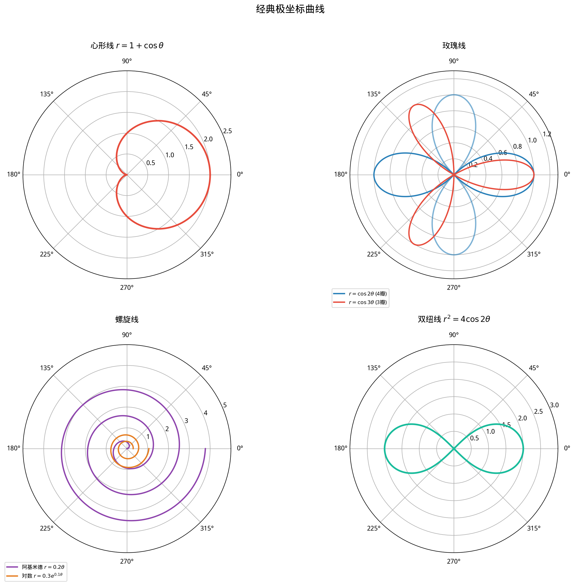

# §2 极坐标（Polar Coordinates）

**前置知识**：[Part 4 第 3 章 三角函数](../ch03-trigonometric/README.md)（三角函数——极坐标的核心工具）、[Part 4 第 4 章 反三角函数](../ch04-inverse-trig/README.md)（$\arctan$——坐标转换中使用）、[Part 3 第 4 章 复数](../../part-03-algebra/ch04-complex-numbers/README.md)（复数的极坐标形式——本节建立联系）

**全景图**：直角坐标系（Cartesian coordinates）用水平距离 $x$ 和垂直距离 $y$ 来定位平面上的点。然而，有些情形下用**距离和角度**来描述位置更加自然——雷达屏幕上的信号由距离和方位角确定，行星的轨道由到太阳的距离和角度确定。极坐标系 $(r, \theta)$ 正是这种"距离 + 角度"的坐标系统。在极坐标下，许多具有径向对称性的曲线（心形线、玫瑰线、螺旋线等）有极其简洁的方程。

**预估学习时间**：约 2.5–3.5 小时

---

## 动机

### 大自然中的极坐标

很多自然现象具有**围绕中心点**的结构：

- **向日葵的种子**排列成螺旋形——用距离和角度描述比用 $x, y$ 直观得多。
- **雷达和声纳**以观测站为中心，用方位角和距离描述目标。
- **行星轨道**围绕太阳，椭圆轨道在极坐标下有特别简洁的方程（焦点-准线形式）。
- **声音的指向性图案**（如麦克风的极坐标响应图）天然就是极坐标图。

### 与复数的联系

在 Part 3 第 4 章中，我们已经见过极坐标的"原型"——复数的**极坐标形式** $z = r e^{i\theta} = r(\cos\theta + i\sin\theta)$。那里 $r = |z|$ 是模，$\theta = \arg z$ 是辐角。极坐标系可以看作将这种表示方式推广到整个平面。

---

## 1. 极坐标系

### 1.1 定义

> **定义 1**（极坐标系，polar coordinate system）
>
> 在平面上选定一个点 $O$（称为**极点**，pole）和从 $O$ 出发的一条射线（称为**极轴**，polar axis，通常取正 $x$ 轴方向）。平面上任意点 $P$（$P \neq O$）可以用一对数 $(r, \theta)$ 表示：
>
> - $r = |OP|$：$P$ 到极点的**距离**（**极径**，radial coordinate），$r \geq 0$。
> - $\theta$：极轴到射线 $OP$ 的**角度**（**极角**，angular coordinate），逆时针为正。
>
> 极点的坐标约定为 $(0, \theta)$（$\theta$ 任意）。

### 1.2 极坐标与直角坐标的转换

将极坐标系的极点与直角坐标系的原点重合，极轴与正 $x$ 轴重合。

> **命题 1**（坐标转换公式）
>
> **极坐标 → 直角坐标**：
>
> $$x = r\cos\theta, \quad y = r\sin\theta$$
>
> **直角坐标 → 极坐标**：
>
> $$r = \sqrt{x^2 + y^2}, \quad \theta = \arctan\frac{y}{x} \text{（需根据象限调整）}$$

**⚠️ $\theta$ 的确定需要注意象限**：$\arctan\frac{y}{x}$ 的值域是 $(-\frac{\pi}{2}, \frac{\pi}{2})$，只覆盖第一、四象限。完整的公式是：

$$\theta = \begin{cases}
\arctan\frac{y}{x} & \text{若 } x > 0 \\
\arctan\frac{y}{x} + \pi & \text{若 } x < 0, y \geq 0 \\
\arctan\frac{y}{x} - \pi & \text{若 } x < 0, y < 0 \\
\frac{\pi}{2} & \text{若 } x = 0, y > 0 \\
-\frac{\pi}{2} & \text{若 } x = 0, y < 0
\end{cases}$$

这本质上就是编程语言中的 `atan2(y, x)` 函数。

### 1.3 极坐标的非唯一性

> ⚠️ 与直角坐标不同，**极坐标表示不唯一**。

同一个点 $P$ 有无穷多个极坐标表示：

$$P = (r, \theta) = (r, \theta + 2n\pi) \quad (n \in \mathbb{Z})$$

如果允许**负极径** $r < 0$（约定 $(-r, \theta)$ 表示 $(r, \theta + \pi)$，即沿 $\theta$ 方向的反方向走距离 $|r|$），则还有：

$$P = (-r, \theta + \pi) = (-r, \theta + (2n+1)\pi)$$

**例题 1**. 点 $(3, \frac{\pi}{4})$（极坐标）的直角坐标是什么？

$$x = 3\cos\frac{\pi}{4} = \frac{3\sqrt{2}}{2}, \quad y = 3\sin\frac{\pi}{4} = \frac{3\sqrt{2}}{2}$$

**例题 2**. 点 $(-2, 3)$（直角坐标）的极坐标是什么？

$$r = \sqrt{4 + 9} = \sqrt{13}$$

$x < 0, y > 0$（第二象限）：$\theta = \arctan\frac{3}{-2} + \pi = \pi - \arctan\frac{3}{2}$。

---

## 2. 极坐标方程与经典曲线

极坐标方程的一般形式是 $r = f(\theta)$ 或 $F(r, \theta) = 0$。

### 2.1 基本曲线

**圆**（过原点，圆心在极轴上）：

$$r = 2a\cos\theta \quad \text{（圆心 $(a, 0)$，半径 $a$）}$$

验证：$r = 2a\cos\theta \Rightarrow r^2 = 2ar\cos\theta \Rightarrow x^2 + y^2 = 2ax \Rightarrow (x-a)^2 + y^2 = a^2$。✓

**直线**（过原点）：

$$\theta = \alpha \quad \text{（通过原点的直线，与极轴成角 $\alpha$）}$$

**直线**（不过原点）：

$$r = \frac{d}{\cos(\theta - \alpha)} \quad \text{（与原点到直线的距离为 $d$，法线方向角为 $\alpha$）}$$

### 2.2 心形线（Cardioid）

> **定义 2**（心形线，cardioid）
>
> 由极坐标方程 $r = a(1 + \cos\theta)$（或 $r = a(1 - \cos\theta)$、$r = a(1 + \sin\theta)$ 等变体）定义的曲线称为**心形线**。

以 $r = 1 + \cos\theta$ 为例：

| $\theta$ | $0$ | $\frac{\pi}{3}$ | $\frac{\pi}{2}$ | $\frac{2\pi}{3}$ | $\pi$ | $\frac{4\pi}{3}$ | $\frac{3\pi}{2}$ | $\frac{5\pi}{3}$ | $2\pi$ |
|----------|-----|------|------|------|------|------|------|------|------|
| $r$ | $2$ | $\frac{3}{2}$ | $1$ | $\frac{1}{2}$ | $0$ | $\frac{1}{2}$ | $1$ | $\frac{3}{2}$ | $2$ |

**特征**：
- 在 $\theta = 0$ 处 $r$ 最大（$r = 2$），在 $\theta = \pi$ 处 $r = 0$（尖点/cusp）。
- 曲线形状像一颗心脏（cardia = 心脏），故名。
- 心形线的面积为 $\frac{3\pi a^2}{2}$（将在 Part 6 积分中推导）。
- 心形线实际上是摆线的一个"表亲"——它可以看作一个圆在等大圆上滚动时，圆周上定点的轨迹。

### 2.3 玫瑰线（Rose Curve）

> **定义 3**（玫瑰线，rose curve）
>
> 由极坐标方程 $r = a\cos(n\theta)$ 或 $r = a\sin(n\theta)$ 定义的曲线称为 $n$ 瓣**玫瑰线**。

**瓣数规律**：
- 若 $n$ 为**奇数**，玫瑰线有 **$n$ 瓣**（$\theta \in [0, \pi)$ 即完成一次描绘）。
- 若 $n$ 为**偶数**，玫瑰线有 **$2n$ 瓣**（$\theta \in [0, 2\pi)$ 完成一次描绘）。

**例子**：
- $r = \cos\theta$：$n = 1$，1 瓣——其实就是一个圆（但只有"半个"方向）。
- $r = \cos 2\theta$：$n = 2$，4 瓣的四叶玫瑰线。
- $r = \cos 3\theta$：$n = 3$，3 瓣的三叶玫瑰线。
- $r = \cos 4\theta$：$n = 4$，8 瓣。

**为什么偶数 $n$ 的瓣数翻倍？** 对于奇数 $n$，在某些 $\theta$ 值处 $\cos(n\theta) < 0$，如果不允许负 $r$，这些部分不被绘出；但这些"缺失"部分实际上与 $\theta + \pi$ 处的正值重合。对于偶数 $n$，这种重合不发生，所以出现了额外的瓣。

### 2.4 阿基米德螺旋线（Archimedean Spiral）

> **定义 4**（阿基米德螺旋线）
>
> $$r = a\theta \quad (\theta \geq 0, a > 0)$$

随着 $\theta$ 增加，$r$ 线性增加——螺旋的每圈之间的间距恒定，等于 $2\pi a$。

这种螺旋出现在：
- **黑胶唱片**的纹路（近似等间距螺旋）。
- **卷簧**的截面形状。
- **某些天线设计**（如螺旋天线）。

**其他类型的螺旋线**：
- **对数螺旋**（logarithmic spiral）：$r = ae^{b\theta}$。特点是每圈间距**按几何比例**增加。出现在鹦鹉螺壳、台风云图和星系旋臂中——大自然偏爱对数螺旋。
- **费马螺旋**（Fermat's spiral）：$r = a\sqrt{\theta}$。向日葵种子的排列近似于两条交织的费马螺旋。

### 2.5 双纽线（Lemniscate）

> **定义 5**（伯努利双纽线，lemniscate of Bernoulli）
>
> $$r^2 = a^2\cos 2\theta$$

曲线形状像阿拉伯数字 "∞" 或一个蝴蝶结。

- 只在 $\cos 2\theta \geq 0$ 时有定义，即 $\theta \in [-\frac{\pi}{4}, \frac{\pi}{4}] \cup [\frac{3\pi}{4}, \frac{5\pi}{4}]$。
- 转换为直角坐标：$r^2 = a^2\cos 2\theta$，$r^2 = a^2(\cos^2\theta - \sin^2\theta)$，$(x^2+y^2)^2 = a^2(x^2-y^2)$。
- 双纽线是 **Cassini 卵形线**（Cassini oval）的特殊情况——当两焦点之间的距离恰好等于常数 $c$ 时。

---

## 3. 极坐标曲线的对称性

分析极坐标曲线的对称性可以大大简化绘图和计算。

### 3.1 对称性检验

> **命题 2**（极坐标对称性检验）
>
> 设 $r = f(\theta)$ 是一条极坐标曲线。
>
> (a) **关于极轴（$x$ 轴）对称**：若 $f(-\theta) = f(\theta)$。
>
> (b) **关于 $y$ 轴对称**（即 $\theta = \pi/2$ 的直线）：若 $f(\pi - \theta) = f(\theta)$。
>
> (c) **关于原点对称**：若 $f(\theta + \pi) = f(\theta)$（或等价地 $f(-\theta) = -f(\theta)$，若允许负 $r$）。

**⚠️ 注意**：这些是**充分条件**，不是充要条件。由于极坐标的非唯一性，一条曲线可能具有某种对称性但不被上述检验捕捉到。

**例题 3**. 分析 $r = 1 + \cos\theta$（心形线）的对称性。

$f(-\theta) = 1 + \cos(-\theta) = 1 + \cos\theta = f(\theta)$ ✓ → 关于极轴对称。

$f(\pi - \theta) = 1 + \cos(\pi-\theta) = 1 - \cos\theta \neq f(\theta)$ → 不关于 $y$ 轴对称。

**例题 4**. 分析 $r = \cos 2\theta$（四叶玫瑰线）的对称性。

$f(-\theta) = \cos(-2\theta) = \cos 2\theta = f(\theta)$ → 关于极轴对称。

$f(\pi - \theta) = \cos(2\pi - 2\theta) = \cos 2\theta = f(\theta)$ → 关于 $y$ 轴对称。

$f(\theta + \pi) = \cos(2\theta + 2\pi) = \cos 2\theta = f(\theta)$ → 关于原点对称。

四叶玫瑰线具有**所有三种对称性**。

---

## 4. 直角坐标方程与极坐标方程的互化

### 4.1 极坐标 → 直角坐标

利用 $x = r\cos\theta$，$y = r\sin\theta$，$r^2 = x^2 + y^2$。

**例题 5**. 将 $r = 4\sin\theta$ 转化为直角坐标方程。

两边乘以 $r$：$r^2 = 4r\sin\theta$，$x^2 + y^2 = 4y$，$(x^2) + (y-2)^2 = 4$。

这是圆心 $(0, 2)$、半径 $2$ 的圆。

**例题 6**. 将 $r = \frac{2}{1 + \cos\theta}$ 转化为直角坐标方程。

$r(1 + \cos\theta) = 2$，$r + r\cos\theta = 2$，$r + x = 2$，$r = 2 - x$。

$r^2 = (2-x)^2$，$x^2 + y^2 = 4 - 4x + x^2$，$y^2 = -4x + 4 = -4(x - 1)$。

这是顶点在 $(1, 0)$、开口向左的抛物线。

### 4.2 直角坐标 → 极坐标

**例题 7**. 将 $x^2 + y^2 - 6x = 0$ 转化为极坐标方程。

$r^2 - 6r\cos\theta = 0$，$r(r - 6\cos\theta) = 0$。

由于 $r = 0$ 只是原点（已包含在 $r = 6\cos\theta$ 中，当 $\theta = \pi/2$），所以极坐标方程为 $r = 6\cos\theta$。

**例题 8**. 将 $y = x$ 转化为极坐标方程。

$r\sin\theta = r\cos\theta$，$\tan\theta = 1$，$\theta = \frac{\pi}{4}$。

---

## 5. 极坐标与复数的联系

在 Part 3 第 4 章中，我们学习了复数的极坐标形式：$z = r(\cos\theta + i\sin\theta) = re^{i\theta}$。

这里 $(r, \theta)$ 恰好就是复数 $z$ 在极坐标系中的坐标。因此：

> **观察**：**复平面就是配备了极坐标系的实平面**。

这个联系使得以下概念统一起来：

| 极坐标概念 | 复数概念 |
|------------|----------|
| 极径 $r$ | 模 $|z|$ |
| 极角 $\theta$ | 辐角 $\arg z$ |
| $r = $ 常数 | $|z| = $ 常数（以原点为圆心的圆） |
| $\theta = $ 常数 | $\arg z = $ 常数（从原点出发的射线） |
| 旋转 $\theta \mapsto \theta + \alpha$ | 乘以 $e^{i\alpha}$ |
| 缩放 $r \mapsto kr$ | 乘以 $k$ |

**De Moivre 定理的极坐标解读**：$(r, \theta)^n = (r^n, n\theta)$——极径取 $n$ 次方，极角乘以 $n$。

**例题 9**. 用复数验证：极坐标方程 $r = 2\cos\theta$ 表示一个圆。

在复数框架下：$|z| = 2\text{Re}(z/|z|) = 2\frac{\text{Re}(z)}{|z|}$，即 $|z|^2 = 2\text{Re}(z)$，即 $x^2 + y^2 = 2x$，即 $(x-1)^2 + y^2 = 1$。✓

---

## 6. 极坐标中的面积与弧长（预告）

虽然详细推导留给 Part 6（微积分），这里预告关键公式：

> **极坐标面积公式**（暂认）
>
> 曲线 $r = f(\theta)$（$\alpha \leq \theta \leq \beta$）与两条射线 $\theta = \alpha$、$\theta = \beta$ 围成的面积为：
>
> $$A = \frac{1}{2}\int_{\alpha}^{\beta} r^2\, d\theta = \frac{1}{2}\int_{\alpha}^{\beta} [f(\theta)]^2\, d\theta$$

**直觉**：面积元素是一个"微小扇形"，面积为 $\frac{1}{2}r^2\,d\theta$（半径为 $r$，圆心角为 $d\theta$ 的扇形面积）。

---

## 要点回顾

1. **极坐标** $(r, \theta)$ 用距离和角度描述点的位置，适合具有径向对称性的情形。
2. **坐标转换**：$x = r\cos\theta, y = r\sin\theta$；$r = \sqrt{x^2+y^2}, \theta = \text{atan2}(y,x)$。
3. **极坐标不唯一**：$(r, \theta) = (r, \theta+2n\pi) = (-r, \theta + (2n+1)\pi)$。
4. **经典极坐标曲线**：心形线 $r = 1+\cos\theta$、玫瑰线 $r = \cos n\theta$、螺旋线 $r = a\theta$、双纽线 $r^2 = \cos 2\theta$。
5. **对称性检验**：$f(-\theta) = f(\theta)$（极轴对称）、$f(\pi-\theta) = f(\theta)$（$y$ 轴对称）、$f(\theta+\pi) = f(\theta)$（原点对称）。
6. **极坐标系与复平面**的完美对应：极径 = 模，极角 = 辐角。

---

## 进度检查点

> **暂认 / 兑现 追踪**
>
> | 暂认项目 | 状态 | 说明 |
> |----------|------|------|
> | 极坐标面积公式 $A = \frac{1}{2}\int r^2\,d\theta$ | 暂认 | Part 6 积分应用 |
> | 极坐标弧长公式 $L = \int\sqrt{r^2 + (dr/d\theta)^2}\,d\theta$ | 暂认 | Part 6 积分应用 |
> | 圆锥曲线的极坐标方程 $r = \frac{ed}{1+e\cos\theta}$ | 暂认 | Part 5 解析几何 |

---

## 自测题

**自测 1**. 将极坐标 $(4, \frac{2\pi}{3})$ 转换为直角坐标。

答案

$x = 4\cos\frac{2\pi}{3} = 4(-\frac{1}{2}) = -2$，$y = 4\sin\frac{2\pi}{3} = 4\frac{\sqrt{3}}{2} = 2\sqrt{3}$。

答案：$(-2, 2\sqrt{3})$。

**自测 2**. 极坐标方程 $r = 6\sin\theta$ 表示什么曲线？

答案

两边乘以 $r$：$r^2 = 6r\sin\theta$，$x^2+y^2 = 6y$，$x^2 + (y-3)^2 = 9$。

这是圆心 $(0, 3)$、半径 $3$ 的圆。

**自测 3**. $r = \cos 3\theta$ 是几瓣的玫瑰线？

答案

$n = 3$ 是奇数，所以有 $3$ 瓣。

**自测 4**. 心形线 $r = 1 - \sin\theta$ 关于哪条线对称？

答案

检验：$f(\pi-\theta) = 1-\sin(\pi-\theta) = 1-\sin\theta = f(\theta)$。关于 $\theta = \pi/2$（即 $y$ 轴）对称。

---

## 习题引用

→ [练习题](exercises/exercises.md)（15+ 题）

→ [练习题解答](exercises/solutions.md)

→ [挑战题](exercises/challenge.md)

→ [思考者角落](thinkers-corner.md)
