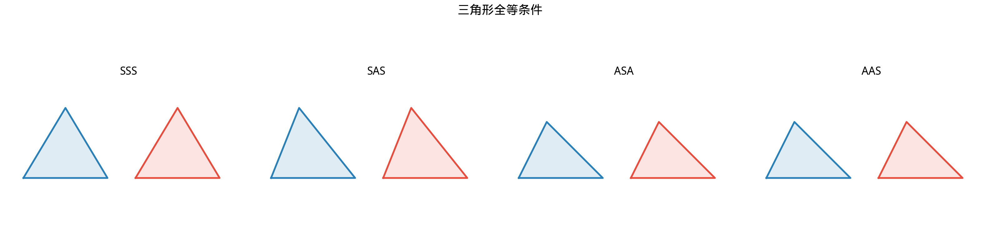
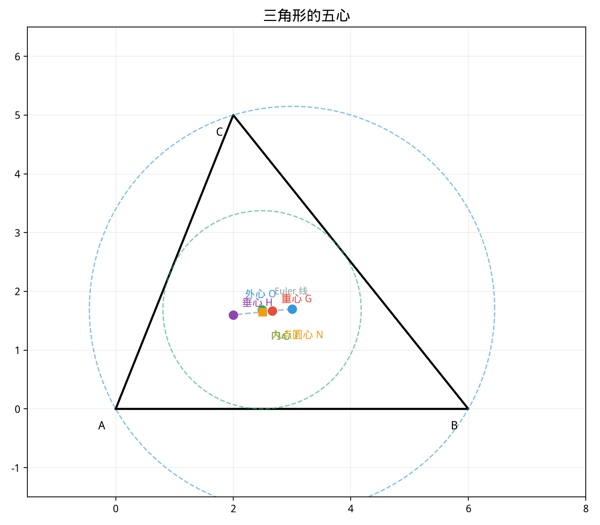

# §2 三角形（Triangles）

**前置知识**：[§1 公理化方法](01-axiomatic.md)（公理系统的基本概念）、[Part 1 第 3 章 证明方法](../../part-01-foundations/ch03-proofs/README.md)（直接证明、反证法）

**全景图**：三角形是最简单的多边形——三条线段围成一个封闭区域。但这个"最简单"的对象蕴含着极其丰富的理论。本节系统研究三角形的全等与相似（判定条件及其证明思路）、面积计算（从基本公式到 Heron 公式）、四条特殊线段（中线、高线、角平分线、中垂线）以及五个特殊点（重心、外心、内心、垂心、旁心），最后介绍 Euler 线和九点圆。

**预估学习时间**：约 3–4 小时

---

## 动机

为什么三角形如此重要？因为**任何多边形都可以三角剖分**——分割成三角形。理解三角形就相当于掌握了所有多边形问题的基本构件。此外，三角形的刚性（三边确定形状）使得它在工程和建筑中无处不在——从桥梁的桁架到屋顶的结构，三角形提供了不可替代的稳定性。

---

## 1. 三角形的基本概念

> **定义 1**（三角形）
>
> 设 $A$, $B$, $C$ 是不共线的三点。由线段 $AB$, $BC$, $CA$ 围成的图形称为**三角形**（triangle），记作 $\triangle ABC$。$A$, $B$, $C$ 称为**顶点**（vertices），$AB$, $BC$, $CA$ 称为**边**（sides），顶点处的角称为**内角**（interior angles），通常记作 $\angle A$, $\angle B$, $\angle C$ 或 $\alpha$, $\beta$, $\gamma$。

约定：在 $\triangle ABC$ 中，边 $a = BC$（对角 $A$ 的对边），$b = CA$（对角 $B$ 的对边），$c = AB$（对角 $C$ 的对边）。

> **定理 1**（三角形内角和）
>
> 三角形的三个内角之和等于 $180°$（即 $\pi$ 弧度）：
>
> $$\alpha + \beta + \gamma = 180°$$

> **证明**
>
> 过顶点 $A$ 作直线 $\ell$ 平行于 $BC$。设 $\ell$ 与 $AB$ 同侧的角为 $\angle 1$，与 $AC$ 同侧的角为 $\angle 2$。
>
> 由平行线的性质（内错角相等）：$\angle 1 = \angle B$，$\angle 2 = \angle C$。
>
> 由于 $\angle 1$, $\angle A$, $\angle 2$ 构成一个平角：$\angle 1 + \angle A + \angle 2 = 180°$。
>
> 因此 $\angle A + \angle B + \angle C = 180°$。$\blacksquare$

**注**：此证明依赖平行公设（第五公设），因此三角形内角和为 $180°$ 是欧氏几何特有的结论。

### 1.1 三角形的分类

按边分类：
- **等边三角形**（equilateral）：$a = b = c$
- **等腰三角形**（isosceles）：至少两边相等
- **不等边三角形**（scalene）：三边互不相等

按角分类：
- **锐角三角形**（acute）：三个角都是锐角
- **直角三角形**（right）：有一个直角
- **钝角三角形**（obtuse）：有一个钝角

---

## 2. 三角形的全等（Congruence of Triangles）

### 2.1 全等的定义

> **定义 2**（三角形全等）
>
> 两个三角形 $\triangle ABC$ 和 $\triangle DEF$ **全等**（congruent），记作 $\triangle ABC \cong \triangle DEF$，如果它们的对应边和对应角分别相等：
>
> $$AB = DE, \; BC = EF, \; CA = FD, \; \angle A = \angle D, \; \angle B = \angle E, \; \angle C = \angle F$$

全等意味着两个三角形的"形状和大小完全相同"——一个可以通过平移、旋转和/或翻转与另一个重合。

### 2.2 全等判定条件

判定两个三角形全等，不需要验证全部六个等式——以下任一条件即可：

> **定理 2**（SSS，边-边-边）
>
> 如果两个三角形的三条对应边分别相等，则这两个三角形全等。

*证明思路*：将两个三角形放在一起使一条公共边重合。利用等边条件和等腰三角形的性质，可以证明第三个顶点的位置也重合。（完整证明需要 Hilbert 的合同公理。）

> **定理 3**（SAS，边-角-边）
>
> 如果两个三角形的两条对应边及其夹角分别相等，则这两个三角形全等。

*证明思路*：SAS 实际上是 Euclid 的合同公理（他将其作为"公理"而非定理——在 Hilbert 体系中，它是合同公理的直接推论）。将一个三角形"叠"到另一个上，使给定的两边和夹角重合，则第三个顶点由两条线段的交点唯一确定，故第三边和其余两角也必然相等。

> **定理 4**（ASA，角-边-角）
>
> 如果两个三角形的两个对应角及其夹边分别相等，则这两个三角形全等。

> **证明**（ASA）
>
> 设 $\triangle ABC$ 和 $\triangle DEF$ 满足 $\angle A = \angle D$，$AB = DE$，$\angle B = \angle E$。
>
> 由三角形内角和，$\angle C = 180° - \angle A - \angle B = 180° - \angle D - \angle E = \angle F$。
>
> 需要证明 $BC = EF$。反证法：假设 $BC \neq EF$，不妨设 $BC > EF$。在 $BC$ 上取点 $C'$ 使 $BC' = EF$。
>
> 则 $\triangle ABC' \cong \triangle DEF$（SAS：$AB = DE$，$\angle B = \angle E$，$BC' = EF$）。
>
> 因此 $\angle BAC' = \angle D = \angle A$，即 $\angle BAC' = \angle BAC$。
>
> 但 $C'$ 在 $BC$ 上且 $C' \neq C$，所以 $AC'$ 和 $AC$ 是不同的射线，$\angle BAC' \neq \angle BAC$——矛盾。
>
> 因此 $BC = EF$，由 SAS 得 $\triangle ABC \cong \triangle DEF$。$\blacksquare$

> **定理 5**（AAS，角-角-边）
>
> 如果两个三角形的两个对应角和其中一个角的对边分别相等，则这两个三角形全等。

> **证明**（AAS）
>
> 设 $\angle A = \angle D$，$\angle B = \angle E$，$a = d$（即 $BC = EF$）。
>
> 由内角和定理，$\angle C = \angle F$。
>
> 现在 $\angle B = \angle E$，$BC = EF$，$\angle C = \angle F$，由 ASA 得 $\triangle ABC \cong \triangle DEF$。$\blacksquare$

### 2.3 为什么 SSA 不行？

**SSA（边-边-角）不是有效的全等条件**——存在反例。

给定 $\triangle ABC$ 满足 $AB = c$，$BC = a$，$\angle A = \alpha$。如果 $\alpha$ 是锐角且 $a < c$，可能存在两种不同的三角形满足这些条件（**二义性情况**，the ambiguous case）。

直观地说，以 $A$ 为顶点画角 $\alpha$，在角的一边取 $AB = c$。以 $B$ 为圆心、$a$ 为半径画圆。圆可能与角的另一边交于 0 个、1 个或 2 个点——对应于无解、唯一解或二义性。

### 2.4 直角三角形的特殊全等条件

> **定理 6**（HL，斜边-直角边）
>
> 如果两个直角三角形的斜边和一条直角边分别相等，则这两个直角三角形全等。

> **证明**（HL）
>
> 设 $\triangle ABC$ 和 $\triangle DEF$ 都是直角三角形（$\angle C = \angle F = 90°$），且斜边 $AB = DE = c$，直角边 $BC = EF = a$。
>
> 由 Pythagoras 定理：$AC = \sqrt{c^2 - a^2} = \sqrt{DE^2 - EF^2} = DF$。
>
> 因此三边对应相等：$AB = DE$，$BC = EF$，$CA = FD$，由 SSS 得 $\triangle ABC \cong \triangle DEF$。$\blacksquare$

---

## 3. 三角形的相似（Similarity of Triangles）

### 3.1 相似的定义

> **定义 3**（三角形相似）
>
> 两个三角形 $\triangle ABC$ 和 $\triangle DEF$ **相似**（similar），记作 $\triangle ABC \sim \triangle DEF$，如果它们的对应角分别相等，且对应边成比例：
>
> $$\angle A = \angle D, \; \angle B = \angle E, \; \angle C = \angle F$$
>
> 且
>
> $$\frac{AB}{DE} = \frac{BC}{EF} = \frac{CA}{FD} = k$$
>
> 比值 $k$ 称为**相似比**（ratio of similarity）。

相似意味着"形状相同但大小可能不同"。全等是相似的特例（$k = 1$）。

### 3.2 相似判定条件

> **定理 7**（AA，角-角）
>
> 如果两个三角形的两个对应角分别相等，则这两个三角形相似。

> **证明**（AA）
>
> 设 $\angle A = \angle D$，$\angle B = \angle E$。由内角和定理，$\angle C = \angle F$。
>
> 需要证明对应边成比例。在 $\triangle DEF$ 中，在边 $DE$ 上取点 $D'$ 使 $DD' = 0$（即 $D' = D$），在 $DF$ 上取点 $F'$ 使 $DF' = CA \cdot \frac{DE}{AB}$... 
>
> 更直接的方法：在 $DE$ 上取点 $B'$ 使 $DB' = AB$，过 $B'$ 作 $B'C' \parallel EF$ 交 $DF$ 于 $C'$。
>
> 由 $\angle D = \angle A$ 和 $DB' = AB$，以及 $\angle DB'C' = \angle DEF = \angle B$（平行线同位角），所以 $\triangle DB'C' \cong \triangle ABC$（ASA）。
>
> 由平行线截比例线段（Thales 定理的推论）：$\frac{DB'}{DE} = \frac{DC'}{DF} = \frac{B'C'}{EF}$。
>
> 因此 $\frac{AB}{DE} = \frac{CA}{FD} = \frac{BC}{EF}$。$\blacksquare$

> **定理 8**（SAS 相似）
>
> 如果两个三角形的两条对应边成比例且夹角相等，则这两个三角形相似。

> **定理 9**（SSS 相似）
>
> 如果两个三角形的三条对应边成比例，则这两个三角形相似。

---

## 4. 三角形的面积（Area of Triangles）

### 4.1 基本面积公式

> **定理 10**（三角形面积公式）
>
> 以 $b$ 为底、$h$ 为对应高的三角形，其面积为
>
> $$S = \frac{1}{2}bh$$

*推导*：一个三角形总可以看作某个平行四边形（面积 $= bh$）的一半——沿对角线将平行四边形分成两个全等三角形。

### 4.2 用两边与夹角的面积公式

利用高 $h = b \sin C$（当以 $a$ 为底时，$h = b\sin C$）：

> **推论**
>
> $$S = \frac{1}{2}ab\sin C = \frac{1}{2}bc\sin A = \frac{1}{2}ca\sin B$$

### 4.3 Heron 公式

> **定理 11**（Heron 公式，海伦公式）
>
> 设三角形三边为 $a$, $b$, $c$，半周长 $s = \frac{a+b+c}{2}$，则
>
> $$S = \sqrt{s(s-a)(s-b)(s-c)}$$

> **证明**（Heron 公式）
>
> 从 $S = \frac{1}{2}ab\sin C$ 出发。由余弦定理 $\cos C = \frac{a^2 + b^2 - c^2}{2ab}$，得
>
> $$\sin^2 C = 1 - \cos^2 C = 1 - \left(\frac{a^2+b^2-c^2}{2ab}\right)^2$$
>
> $$= \frac{(2ab)^2 - (a^2+b^2-c^2)^2}{4a^2b^2}$$
>
> 分子用平方差分解：
>
> $$(2ab)^2 - (a^2+b^2-c^2)^2 = [2ab + (a^2+b^2-c^2)][2ab - (a^2+b^2-c^2)]$$
>
> $$= [(a+b)^2 - c^2][c^2 - (a-b)^2]$$
>
> $$= (a+b+c)(a+b-c)(c+a-b)(c-a+b)$$
>
> 令 $s = \frac{a+b+c}{2}$，则 $a+b+c = 2s$，$a+b-c = 2(s-c)$，$c+a-b = 2(s-b)$，$c-a+b = 2(s-a)$。
>
> $$\sin^2 C = \frac{16s(s-a)(s-b)(s-c)}{4a^2b^2}$$
>
> $$S = \frac{1}{2}ab\sin C = \frac{1}{2}ab \cdot \frac{4\sqrt{s(s-a)(s-b)(s-c)}}{2ab} = \sqrt{s(s-a)(s-b)(s-c)}$$
>
> $\blacksquare$

---

## 5. 特殊线段（Special Segments）

三角形有四种重要的特殊线段：

### 5.1 中线（Median）

> **定义 4**（中线）
>
> 从三角形的一个顶点到对边中点的线段称为**中线**（median）。

三角形有三条中线。

### 5.2 高线（Altitude）

> **定义 5**（高线）
>
> 从三角形的一个顶点到对边（或对边的延长线）的垂线段称为**高线**（altitude）。垂足到顶点的距离称为高（height）。

三角形有三条高线。

### 5.3 角平分线（Angle Bisector）

> **定义 6**（角平分线）
>
> 平分三角形的一个内角的射线（从顶点出发到对边的交点）所在的线段称为**角平分线**（angle bisector）。

> **定理 12**（角平分线定理）
>
> 三角形的角平分线将对边按邻边之比分割。即，若 $AD$ 是 $\angle A$ 的角平分线，$D$ 在 $BC$ 上，则
>
> $$\frac{BD}{DC} = \frac{AB}{AC} = \frac{c}{b}$$

> **证明**
>
> 过 $C$ 作 $CE \parallel DA$，交 $BA$ 的延长线于 $E$。
>
> $\angle BAD = \angle AEC$（平行线同位角），$\angle DAC = \angle ACE$（平行线内错角）。
>
> 因为 $AD$ 平分 $\angle A$，$\angle BAD = \angle DAC$，所以 $\angle AEC = \angle ACE$，即 $\triangle AEC$ 是等腰三角形，$AE = AC = b$。
>
> 在 $\triangle BCE$ 中，$DA \parallel CE$，由 Thales 定理：$\frac{BD}{DC} = \frac{BA}{AE} = \frac{c}{b}$。$\blacksquare$

### 5.4 中垂线（Perpendicular Bisector）

> **定义 7**（中垂线）
>
> 线段的**中垂线**（perpendicular bisector）是过该线段中点且垂直于该线段的直线。

> **定理 13**（中垂线的性质）
>
> 线段 $AB$ 的中垂线上的点到 $A$ 和 $B$ 的距离相等。反之，到 $A$ 和 $B$ 距离相等的点在 $AB$ 的中垂线上。

---

## 6. 三角形的五心（Five Centers of a Triangle）

### 6.1 重心（Centroid）

> **定理 14**（三条中线共点）
>
> 三角形的三条中线交于一点，称为**重心**（centroid），通常记作 $G$。重心将每条中线分为 $2:1$ 的两段（从顶点到重心的距离是从重心到对边中点距离的 $2$ 倍）。

> **证明**
>
> 设 $M$ 是 $BC$ 的中点，$N$ 是 $AC$ 的中点。中线 $AM$ 和 $BN$ 交于 $G$。
>
> 在 $\triangle ABM$ 中考虑中线 $BN$：$N$ 是 $AC$ 的中点。取 $AM$ 上的点 $G$ 使得 $AG:GM = 2:1$。
>
> 连接 $MN$。由中位线定理，$MN \parallel AB$ 且 $MN = \frac{1}{2}AB$。
>
> 在 $\triangle AGG'$（$G'$ 为 $BN$ 与 $AM$ 的交点）中，利用 $MN \parallel AB$ 和截线比例关系，可以证明 $G$ 恰好将 $AM$ 分为 $2:1$，同时将 $BN$ 分为 $2:1$。
>
> 由对称性，第三条中线也过 $G$。$\blacksquare$

重心的坐标公式（解析几何中）：若顶点为 $A(x_1,y_1)$, $B(x_2,y_2)$, $C(x_3,y_3)$，则

$$G = \left(\frac{x_1+x_2+x_3}{3}, \frac{y_1+y_2+y_3}{3}\right)$$

### 6.2 外心（Circumcenter）

> **定理 15**（三条中垂线共点）
>
> 三角形三条边的中垂线交于一点，称为**外心**（circumcenter），记作 $O$。外心到三个顶点的距离相等，即外心是三角形**外接圆**（circumscribed circle）的圆心。

> **证明**
>
> 设 $AB$ 的中垂线和 $BC$ 的中垂线交于 $O$。
>
> 由中垂线的性质：$OA = OB$（$O$ 在 $AB$ 的中垂线上）；$OB = OC$（$O$ 在 $BC$ 的中垂线上）。
>
> 因此 $OA = OC$，即 $O$ 到 $A$ 和 $C$ 的距离相等，所以 $O$ 在 $AC$ 的中垂线上。
>
> 故三条中垂线交于一点 $O$，且 $OA = OB = OC = R$（外接圆半径）。$\blacksquare$

**位置**：锐角三角形的外心在内部，直角三角形的外心在斜边中点，钝角三角形的外心在外部。

### 6.3 内心（Incenter）

> **定理 16**（三条角平分线共点）
>
> 三角形三个内角的角平分线交于一点，称为**内心**（incenter），记作 $I$。内心到三条边的距离相等，即内心是三角形**内切圆**（inscribed circle）的圆心。

> **证明**
>
> 设 $\angle A$ 的角平分线和 $\angle B$ 的角平分线交于 $I$。
>
> 角平分线的性质：角平分线上的点到角两边的距离相等。
>
> $I$ 在 $\angle A$ 的角平分线上 $\Rightarrow$ $I$ 到 $AB$ 和 $AC$ 的距离相等，设为 $d_1 = d_2$。
>
> $I$ 在 $\angle B$ 的角平分线上 $\Rightarrow$ $I$ 到 $AB$ 和 $BC$ 的距离相等，设为 $d_1 = d_3$。
>
> 因此 $d_2 = d_3$，即 $I$ 到 $AC$ 和 $BC$ 的距离相等，所以 $I$ 在 $\angle C$ 的角平分线上。
>
> 故三条角平分线交于一点 $I$，且 $I$ 到三条边的距离 $r$ 相等（内切圆半径）。$\blacksquare$

内切圆半径公式：$r = \frac{S}{s}$，其中 $S$ 是三角形面积，$s$ 是半周长。

### 6.4 垂心（Orthocenter）

> **定理 17**（三条高线共点）
>
> 三角形的三条高线交于一点，称为**垂心**（orthocenter），记作 $H$。

*证明思路*：过三角形的每个顶点分别作对边的平行线，构成一个更大的三角形 $\triangle A'B'C'$。$\triangle ABC$ 的高线恰好是 $\triangle A'B'C'$ 的中垂线。由中垂线共点（外心存在），高线也共点。

**位置**：锐角三角形的垂心在内部，直角三角形的垂心在直角顶点，钝角三角形的垂心在外部。

### 6.5 旁心（Excenter）

> **定义 8**（旁心）
>
> 三角形有三个**旁切圆**（excircle）：每个旁切圆与三角形的一条边及另外两条边的延长线相切。旁切圆的圆心称为**旁心**（excenter）。

对角 $A$ 的旁切圆的圆心 $I_A$ 是 $\angle A$ 的内角平分线与 $\angle B$ 和 $\angle C$ 的外角平分线的交点。

### 6.6 Euler 线（Euler Line）

> **定理 18**（Euler 线）
>
> 在任意三角形中，重心 $G$、外心 $O$ 和垂心 $H$ 三点共线，且 $G$ 将 $OH$ 分为 $1:2$ 的两段：
>
> $$OG : GH = 1 : 2$$
>
> 这条直线称为 **Euler 线**。

**注**：内心一般不在 Euler 线上（只有等腰三角形等特殊情况例外）。

### 6.7 九点圆（Nine-Point Circle）

> **定理 19**（九点圆定理）
>
> 以下九个点共圆：三条边的中点（3个），三条高的垂足（3个），每个顶点与垂心连线的中点（3个）。该圆称为**九点圆**（nine-point circle），其圆心在 Euler 线上（$O$ 和 $H$ 的中点），半径为外接圆半径的一半。

九点圆是三角形几何中的瑰宝，它将看似无关的九个特殊点用一个优雅的圆统一起来。

---

## 例题

**例题 1**：证明等腰三角形的两个底角相等。

**解**：设 $\triangle ABC$ 满足 $AB = AC$。作 $\angle A$ 的角平分线 $AD$（$D$ 在 $BC$ 上）。

在 $\triangle ABD$ 和 $\triangle ACD$ 中：
- $AB = AC$（已知）
- $\angle BAD = \angle CAD$（$AD$ 平分 $\angle A$）
- $AD = AD$（公共边）

由 SAS，$\triangle ABD \cong \triangle ACD$。因此 $\angle B = \angle C$。$\blacksquare$

---

**例题 2**：在 $\triangle ABC$ 中，$a = 7$, $b = 8$, $c = 9$。求面积 $S$。

**解**：用 Heron 公式。半周长 $s = \frac{7 + 8 + 9}{2} = 12$。

$$S = \sqrt{12 \cdot (12-7) \cdot (12-8) \cdot (12-9)} = \sqrt{12 \cdot 5 \cdot 4 \cdot 3} = \sqrt{720} = 12\sqrt{5}$$

---

**例题 3**：$\triangle ABC$ 中，$D$ 是 $BC$ 的中点，$E$ 是 $AC$ 的中点。证明 $DE \parallel AB$ 且 $DE = \frac{1}{2}AB$（中位线定理）。

**解**：$D$ 是 $BC$ 的中点，$E$ 是 $AC$ 的中点，所以 $\frac{CD}{CB} = \frac{CE}{CA} = \frac{1}{2}$，且 $\angle C$ 公共。

由 SAS 相似，$\triangle CDE \sim \triangle CBA$，相似比 $k = \frac{1}{2}$。

因此 $DE = \frac{1}{2}AB$，且 $\angle CDE = \angle CBA$（对应角相等）。由内错角相等得 $DE \parallel AB$。$\blacksquare$

---

## 要点回顾

| 概念 | 要点 |
|------|------|
| 全等判定 | SSS, SAS, ASA, AAS（四种有效条件）；SSA 不行（二义性） |
| 直角三角形 | HL（斜边-直角边）也可判定全等 |
| 相似判定 | AA, SAS 相似, SSS 相似 |
| 面积 | $S = \frac{1}{2}bh = \frac{1}{2}ab\sin C = \sqrt{s(s-a)(s-b)(s-c)}$ |
| 角平分线定理 | 角平分线将对边按邻边之比分割：$BD:DC = c:b$ |
| 重心 $G$ | 三中线交点，分中线为 $2:1$ |
| 外心 $O$ | 三中垂线交点，外接圆圆心 |
| 内心 $I$ | 三角平分线交点，内切圆圆心，$r = S/s$ |
| 垂心 $H$ | 三高线交点 |
| Euler 线 | $O$, $G$, $H$ 共线，$OG:GH = 1:2$ |

---

## 进度检查点

完成本节后，你应该能够：

- [ ] 陈述并使用所有全等判定条件，并解释 SSA 为什么无效
- [ ] 陈述 AA 相似条件，并理解为什么两角就够了
- [ ] 用至少三种方法计算三角形面积
- [ ] 证明 Heron 公式
- [ ] 描述四种特殊线段和五心的定义与性质
- [ ] 知道 Euler 线和九点圆的存在

---

## 自测题

**自测题 1**：两个三角形满足 $AB = DE$，$BC = EF$，$\angle B = \angle E$。能否判定它们全等？

答案

能。这是 SAS 条件——两边及其**夹角**相等。注意 $\angle B$ 是 $AB$ 和 $BC$ 的夹角，满足 SAS。

**自测题 2**：三角形 $\triangle ABC$ 中，$a = 5$, $b = 12$, $c = 13$。问：(a) 这是什么类型的三角形？(b) 面积是多少？

答案

(a) $5^2 + 12^2 = 25 + 144 = 169 = 13^2$，满足 Pythagoras 定理，所以是**直角三角形**（直角在 $C$）。

(b) 直角边为 $a = 5$，$b = 12$，$S = \frac{1}{2} \cdot 5 \cdot 12 = 30$。

**自测题 3**：内心和外心的本质区别是什么？

答案

**外心**是到三个**顶点**距离相等的点（外接圆圆心），由三条边的**中垂线**交出。

**内心**是到三条**边**距离相等的点（内切圆圆心），由三个**角平分线**交出。

一个关注"到顶点的距离"，一个关注"到边的距离"。

**自测题 4**：Euler 线上有哪三个特殊点？它们的排列比例是什么？

答案

外心 $O$、重心 $G$、垂心 $H$ 共线。$G$ 在 $O$ 和 $H$ 之间，$OG : GH = 1 : 2$。

---

## 习题引用

本节练习见[练习题](exercises/exercises.md)第 §2 部分。
