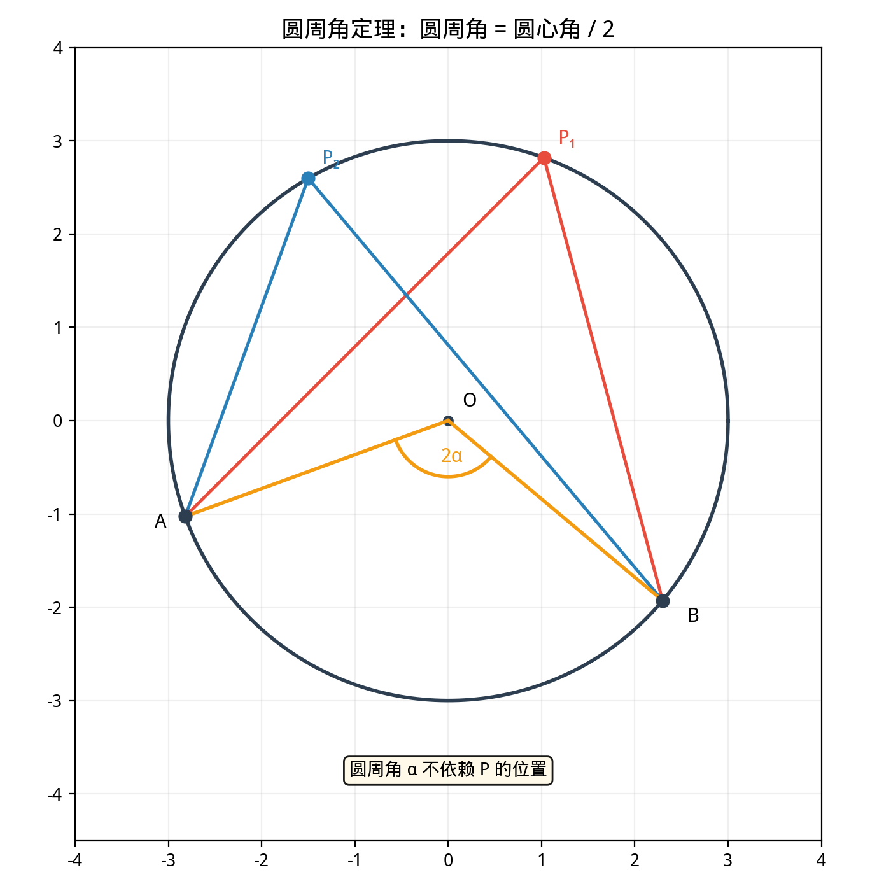
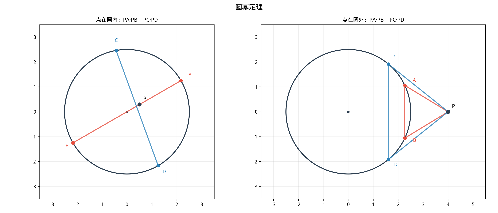

# §3 圆（Circles）

**前置知识**：[§1 公理化方法](01-axiomatic.md)（公理与定理）、[§2 三角形](02-triangles.md)（全等、相似、面积）

**全景图**：圆是平面上最完美的曲线——到定点等距的所有点的集合。本节系统研究圆的基本概念（圆心、半径、弦、弧、扇形），然后深入三个核心定理：**圆周角定理**（将角与弧联系起来）、**切线性质**（切线与半径垂直）和**圆幂定理**（将不同位置的割线/切线统一起来），最后讨论圆内接四边形和 Ptolemy 定理。

**预估学习时间**：约 2–3 小时

---

## 动机

圆是最对称的平面图形——它在任意角度的旋转下都不变。这种极端的对称性使得圆拥有一系列优雅的性质，而这些性质几乎都可以追溯到一个核心事实：**圆上每个点到圆心的距离相等**。

在实际应用中，圆和弧无处不在：车轮、齿轮、天体轨道（近似）、光学透镜……理解圆的几何性质是理解这些应用的基础。

---

## 1. 圆的基本概念

### 1.1 定义与术语

> **定义 1**（圆）
>
> 平面上到定点 $O$ 的距离等于定值 $r > 0$ 的所有点的集合称为**圆**（circle），记作 $\odot O$ 或 $\odot(O, r)$。点 $O$ 称为**圆心**（center），$r$ 称为**半径**（radius）。

> **定义 2**（弦、直径、弧、扇形）
>
> - **弦**（chord）：连接圆上两点的线段。
> - **直径**（diameter）：过圆心的弦，长度 $d = 2r$。
> - **弧**（arc）：圆上两点之间的一段曲线。两点将圆分为两段弧：较短的称为**劣弧**（minor arc），较长的称为**优弧**（major arc）。
> - **扇形**（sector）：由两条半径和一段弧围成的区域。
> - **弓形**（segment）：由一条弦和一段弧围成的区域。

### 1.2 弦的基本性质

> **定理 1**（垂径定理）
>
> 过圆心垂直于弦的直径平分该弦及其所对的弧。

> **证明**
>
> 设弦 $AB$ 被过圆心 $O$ 的直径 $MN$ 垂直于 $P$ 点。即 $OP \perp AB$。
>
> 连接 $OA$ 和 $OB$。由 $OA = OB = r$，$OP = OP$（公共边），$\angle OPA = \angle OPB = 90°$。
>
> 由 HL 全等，$\triangle OPA \cong \triangle OPB$。因此 $PA = PB$，即 $P$ 是 $AB$ 的中点。$\blacksquare$

> **推论**
>
> 等弦对等弧（在同一圆或等圆中）。

---

## 2. 圆心角与圆周角（Central and Inscribed Angles）

### 2.1 圆心角

> **定义 3**（圆心角）
>
> 顶点在圆心的角称为**圆心角**（central angle）。圆心角的度数等于它所对弧的度数。

### 2.2 圆周角

> **定义 4**（圆周角）
>
> 顶点在圆上、两边经过圆上另外两点的角称为**圆周角**（inscribed angle）。

### 2.3 圆周角定理

> **定理 2**（圆周角定理，inscribed angle theorem）
>
> 圆周角等于同弧上圆心角的一半。等价地，同弧上的所有圆周角相等。
>
> 若弧 $BC$ 对应的圆心角为 $\alpha$，则弧 $BC$ 上任意圆周角 $\angle BAC = \frac{\alpha}{2}$。

> **证明**（圆周角定理）
>
> 分三种情况讨论（根据圆心 $O$ 相对于 $\angle BAC$ 的位置）。
>
> **情况 1**：$O$ 在 $\angle BAC$ 的一条边上（即 $AO$ 经过 $B$ 或 $C$）。
>
> 不妨设 $O$ 在 $AC$ 上（即 $AC$ 是直径）。连接 $OB$。
>
> $OA = OB = r$，$\triangle OAB$ 是等腰三角形。$\angle OAB = \angle OBA$。
>
> $\angle BOC$ 是 $\triangle OAB$ 的外角：$\angle BOC = \angle OAB + \angle OBA = 2\angle OAB = 2\angle BAC$。
>
> 因此 $\angle BAC = \frac{1}{2}\angle BOC$。✓
>
> **情况 2**：$O$ 在 $\angle BAC$ 的内部。
>
> 作直径 $AD$。由情况 1：$\angle BAD = \frac{1}{2}\angle BOD$，$\angle DAC = \frac{1}{2}\angle DOC$。
>
> $\angle BAC = \angle BAD + \angle DAC = \frac{1}{2}(\angle BOD + \angle DOC) = \frac{1}{2}\angle BOC$。✓
>
> **情况 3**：$O$ 在 $\angle BAC$ 的外部。
>
> 作直径 $AD$。由情况 1：$\angle BAD = \frac{1}{2}\angle BOD$，$\angle CAD = \frac{1}{2}\angle COD$。
>
> $\angle BAC = \angle BAD - \angle CAD = \frac{1}{2}(\angle BOD - \angle COD) = \frac{1}{2}\angle BOC$。✓
>
> $\blacksquare$

### 2.4 重要推论

> **推论 1**（直径对的圆周角）
>
> 半圆（直径）所对的圆周角是直角。反之，如果圆周角是直角，它所对的弦是直径。
>
> （Thales 定理——据说是西方数学史上第一个被证明的定理。）

> **推论 2**（同弧上的圆周角）
>
> 同一段弧上的所有圆周角相等。

---

## 3. 切线（Tangent Lines）

### 3.1 切线的定义与基本性质

> **定义 5**（切线）
>
> 与圆只有一个公共点的直线称为圆的**切线**（tangent line），该公共点称为**切点**（point of tangency）。

> **定理 3**（切线垂直于半径）
>
> 过切点的半径垂直于切线。反之，过圆上一点作垂直于半径的直线，该直线是圆的切线。

> **证明**
>
> 设切线 $\ell$ 与 $\odot O$ 切于 $T$。反证法：假设 $OT$ 不垂直于 $\ell$。
>
> 从 $O$ 向 $\ell$ 作垂线，垂足为 $F$。则 $OF < OT = r$。
>
> 在 $\ell$ 上，$F$ 两侧各取点 $T'$ 使 $FT' = \sqrt{r^2 - OF^2}$。则 $OT' = \sqrt{OF^2 + FT'^2} = r$，即 $T'$ 在圆上。
>
> 这意味着 $\ell$ 与圆有两个（甚至更多）公共点，与"切线只有一个公共点"矛盾。
>
> 因此 $OT \perp \ell$。$\blacksquare$

### 3.2 从外部点引切线

> **定理 4**（切线长定理）
>
> 从圆外一点引圆的两条切线，切线长相等。且该点与圆心的连线平分两条切线的夹角。

> **证明**
>
> 设 $P$ 是 $\odot O$ 外的点，$PA$ 和 $PB$ 是从 $P$ 到 $\odot O$ 的两条切线（$A$, $B$ 是切点）。
>
> $OA \perp PA$，$OB \perp PB$（切线垂直于半径）。
>
> $OA = OB = r$，$OP = OP$（公共边），$\angle OAP = \angle OBP = 90°$。
>
> 由 HL 全等，$\triangle OAP \cong \triangle OBP$。因此 $PA = PB$（切线长相等），$\angle APO = \angle BPO$（$OP$ 平分两切线夹角）。$\blacksquare$

### 3.3 割线-切线角

> **定理 5**（弦切角定理）
>
> 切线与弦所成的角（弦切角）等于弦所对弧上的圆周角。
>
> 即，若 $PA$ 是切线（$A$ 为切点），$AB$ 是弦，则 $\angle PAB = \frac{1}{2}\overset{\frown}{AB}$（弦切角等于所夹弧的圆心角的一半）。

---

## 4. 圆幂定理（Power of a Point）

### 4.1 定义

> **定义 6**（点的幂）
>
> 设 $P$ 是平面上的一点，$\odot O$ 的半径为 $r$。点 $P$ 对于 $\odot O$ 的**幂**（power of a point）定义为
>
> $$\text{pow}(P) = |PO|^2 - r^2$$
>
> - $P$ 在圆外：$\text{pow}(P) > 0$
> - $P$ 在圆上：$\text{pow}(P) = 0$
> - $P$ 在圆内：$\text{pow}(P) < 0$

### 4.2 相交弦定理

> **定理 6**（相交弦定理）
>
> 圆的两条弦 $AB$ 和 $CD$ 交于圆内一点 $P$，则
>
> $$PA \cdot PB = PC \cdot PD$$

> **证明**
>
> 连接 $AC$ 和 $BD$。
>
> 在 $\triangle PAC$ 和 $\triangle PDB$ 中：
> - $\angle APC = \angle DPB$（对顶角）
> - $\angle PAC = \angle PDB$（同弧 $BC$ 上的圆周角）
>
> 由 AA 相似，$\triangle PAC \sim \triangle PDB$。
>
> 对应边成比例：$\frac{PA}{PD} = \frac{PC}{PB}$，即 $PA \cdot PB = PC \cdot PD$。$\blacksquare$

### 4.3 割线定理

> **定理 7**（割线定理）
>
> 从圆外一点 $P$ 引两条割线，分别与圆交于 $A, B$ 和 $C, D$（$A$ 和 $C$ 分别在 $P$ 与 $B$, $D$ 之间），则
>
> $$PA \cdot PB = PC \cdot PD$$

> **证明**
>
> 连接 $AC$ 和 $BD$。
>
> $\angle PAC = \angle PDB$（圆内接四边形 $ACDB$ 的外角等于对角的内角，或用同弧上的圆周角）。
>
> $\angle P$ 公共。由 AA 相似，$\triangle PAC \sim \triangle PDB$。
>
> $\frac{PA}{PD} = \frac{PC}{PB}$，即 $PA \cdot PB = PC \cdot PD$。$\blacksquare$

### 4.4 切割线定理

> **定理 8**（切割线定理）
>
> 从圆外一点 $P$ 引一条切线（切点 $T$）和一条割线（与圆交于 $A, B$），则
>
> $$PT^2 = PA \cdot PB$$

> **证明**
>
> 连接 $TA$ 和 $TB$。
>
> $\angle PTA = \angle PBT$（弦切角 $\angle PTA$ 等于弧 $TA$ 上的圆周角 $\angle TBA$）。$\angle P$ 公共。
>
> 由 AA 相似，$\triangle PTA \sim \triangle PBT$。
>
> $\frac{PT}{PB} = \frac{PA}{PT}$，即 $PT^2 = PA \cdot PB$。$\blacksquare$

### 4.5 统一视角：圆幂

上述三个定理（相交弦、割线、切割线）可以用**圆幂**统一表述：

> **定理 9**（圆幂定理的统一表述）
>
> 过点 $P$ 的任意直线与 $\odot O$ 交于 $X$ 和 $Y$（$X$, $Y$ 可重合，即切线情况），则乘积 $\overrightarrow{PX} \cdot \overrightarrow{PY}$（带符号的乘积）是常数，等于 $|PO|^2 - r^2$。

这意味着圆幂只取决于 $P$ 和圆的相对位置，与所选的直线无关。

---

## 5. 圆内接四边形与 Ptolemy 定理

### 5.1 圆内接四边形

> **定义 7**（圆内接四边形）
>
> 四个顶点都在同一个圆上的四边形称为**圆内接四边形**（cyclic quadrilateral）。

> **定理 10**（圆内接四边形的对角互补）
>
> 圆内接四边形的对角之和为 $180°$。反之，如果一个四边形的对角之和为 $180°$，则它是圆内接四边形。

> **证明**
>
> 设 $ABCD$ 是 $\odot O$ 的内接四边形。
>
> $\angle A$ 是弧 $BCD$ 上的圆周角，$\angle A = \frac{1}{2}\overset{\frown}{BCD}$。
>
> $\angle C$ 是弧 $BAD$ 上的圆周角，$\angle C = \frac{1}{2}\overset{\frown}{BAD}$。
>
> $\overset{\frown}{BCD} + \overset{\frown}{BAD} = 360°$（整个圆周），因此 $\angle A + \angle C = \frac{1}{2} \cdot 360° = 180°$。$\blacksquare$

### 5.2 Ptolemy 定理

> **定理 11**（Ptolemy 定理）
>
> 圆内接四边形 $ABCD$ 的对角线与边满足：
>
> $$AC \cdot BD = AB \cdot CD + AD \cdot BC$$
>
> 即对角线乘积等于两对对边乘积之和。

> **证明**（Ptolemy 定理）
>
> 在对角线 $AC$ 上取点 $E$ 使得 $\angle ABE = \angle DBC$。
>
> 由 $\angle ABE = \angle DBC$ 和 $\angle AEB$ 对应 $\angle DCB$（同弧 $AD$ 上的圆周角，$\angle BAC = \angle BDC$），得 $\triangle ABE \sim \triangle DBC$（AA）。
>
> 因此 $\frac{AB}{DB} = \frac{AE}{DC}$，即 $AB \cdot DC = AE \cdot DB$ ... ①
>
> 又 $\angle ABD = \angle ABE + \angle EBD = \angle DBC + \angle EBD = \angle EBC$。
>
> $\angle ADB = \angle ACB$（同弧 $AB$ 上的圆周角），因此 $\triangle ABD \sim \triangle EBC$（AA）。
>
> $\frac{AD}{EC} = \frac{BD}{BC}$，即 $AD \cdot BC = EC \cdot BD$ ... ②
>
> ① + ②：$AB \cdot CD + AD \cdot BC = (AE + EC) \cdot BD = AC \cdot BD$。$\blacksquare$

**Ptolemy 不等式**：对于一般的（不一定内接于圆的）四边形 $ABCD$，有

$$AC \cdot BD \leq AB \cdot CD + AD \cdot BC$$

等号当且仅当 $ABCD$ 是圆内接四边形（且顶点按此顺序排列在圆上）。

---

## 例题

**例题 1**：在 $\odot O$ 中，弦 $AB$ 对应的圆心角为 $80°$。求弧 $AB$（劣弧）上的圆周角。

**解**：由圆周角定理，弧 $AB$ 上任意圆周角 $= \frac{1}{2} \times 80° = 40°$。

注意：这里"弧 $AB$ 上的圆周角"是指顶点在**优弧**（即不含弦 $AB$ 的那段弧）上的角。

---

**例题 2**：从圆外一点 $P$ 引一条切线 $PT$（$T$ 为切点）和一条割线 $PAB$（$A$ 在 $P$ 和 $B$ 之间）。已知 $PT = 6$，$PA = 4$。求 $PB$。

**解**：由切割线定理，$PT^2 = PA \cdot PB$。

$$36 = 4 \cdot PB, \quad PB = 9$$

因此弦 $AB = PB - PA = 9 - 4 = 5$。

---

**例题 3**：正方形 $ABCD$ 内接于圆。边长为 $a$。用 Ptolemy 定理验证对角线的长度。

**解**：正方形的四边 $AB = BC = CD = DA = a$，对角线 $AC = BD$。

由 Ptolemy 定理：$AC \cdot BD = AB \cdot CD + AD \cdot BC = a \cdot a + a \cdot a = 2a^2$。

因此 $AC^2 = 2a^2$（因为 $AC = BD$），$AC = a\sqrt{2}$。

这与 Pythagoras 定理的结果一致：$AC = \sqrt{a^2 + a^2} = a\sqrt{2}$。✓

---

## 要点回顾

| 概念 | 要点 |
|------|------|
| 圆周角定理 | 圆周角 $= \frac{1}{2}$ 圆心角（同弧） |
| Thales 定理 | 直径对的圆周角 $= 90°$ |
| 切线性质 | 切线 $\perp$ 过切点的半径 |
| 切线长定理 | 从外部点引两条切线，切线长相等 |
| 相交弦定理 | $PA \cdot PB = PC \cdot PD$（圆内交点） |
| 割线定理 | $PA \cdot PB = PC \cdot PD$（圆外交点） |
| 切割线定理 | $PT^2 = PA \cdot PB$ |
| 圆幂 | $|PO|^2 - r^2$，与通过 $P$ 的直线无关 |
| 圆内接四边形 | 对角之和 $= 180°$ |
| Ptolemy 定理 | $AC \cdot BD = AB \cdot CD + AD \cdot BC$ |

---

## 进度检查点

完成本节后，你应该能够：

- [ ] 陈述并证明圆周角定理（三种情况）
- [ ] 用圆周角定理推出 Thales 定理
- [ ] 证明切线垂直于半径
- [ ] 陈述并证明相交弦定理、割线定理、切割线定理
- [ ] 用圆幂的概念统一理解上述三个定理
- [ ] 证明圆内接四边形对角互补
- [ ] 陈述并证明 Ptolemy 定理

---

## 自测题

**自测题 1**：圆周角定理的核心结论是什么？

答案

圆周角等于它所对弧上的圆心角的一半。等价地，同一段弧所对的所有圆周角都相等。

**自测题 2**：$\triangle ABC$ 内接于 $\odot O$，$\angle A = 90°$。那么 $BC$ 是什么？

答案

$BC$ 是直径。这是 Thales 定理的逆：如果圆周角为直角，则它所对的弦是直径。

**自测题 3**：两条弦 $AB$ 和 $CD$ 在圆内交于 $P$，$PA = 3$，$PB = 8$，$PC = 4$。求 $PD$。

答案

由相交弦定理：$PA \cdot PB = PC \cdot PD$，即 $3 \times 8 = 4 \times PD$，$PD = 6$。

**自测题 4**：圆内接四边形 $ABCD$ 中，$\angle A = 75°$。求 $\angle C$。

答案

圆内接四边形对角互补：$\angle A + \angle C = 180°$，因此 $\angle C = 180° - 75° = 105°$。

---

## 习题引用

本节练习见[练习题](exercises/exercises.md)第 §3 部分。
