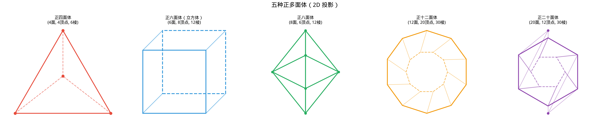

# §4 面积与体积（Area and Volume）

**前置知识**：[§2 三角形](02-triangles.md)（面积公式）、[§3 圆](03-circles.md)（圆的基本概念）

**全景图**：面积和体积是几何中最基本的度量。我们已经知道三角形的面积公式，本节将系统推导平行四边形、梯形等常见图形的面积公式，然后引入一个强大的工具——**Cavalieri 原理**（祖暅原理），用它统一推导棱柱、圆柱、锥体和球的体积公式。最后，我们介绍五种正多面体（Platonic solids），并证明正多面体恰好只有五种。

**预估学习时间**：约 2–3 小时

---

## 动机

面积和体积的计算看似是"公式记忆"的问题，但实际上每个公式背后都有深刻的几何思想。**为什么**三角形面积是 $\frac{1}{2}bh$？**为什么**球的体积是 $\frac{4}{3}\pi r^3$？这些"为什么"比公式本身更重要——理解推导过程，你就永远不会忘记公式，而且能把方法推广到新的情况。

---

## 1. 平面图形的面积

### 1.1 矩形的面积

面积的起点是矩形：长 $a$、宽 $b$ 的矩形面积为

$$S_{\text{矩形}} = ab$$

这是面积的**定义**——我们选择"单位正方形"（边长为 $1$）作为面积单位，然后通过拼接得到任意矩形的面积。

### 1.2 平行四边形的面积

> **定理 1**（平行四边形面积）
>
> 底为 $b$、高为 $h$ 的平行四边形面积为
>
> $$S = bh$$

> **证明**
>
> 将平行四边形 $ABCD$ 的一个三角形部分（从一端切下的直角三角形）平移到另一端，可以拼成一个底为 $b$、高为 $h$ 的矩形。因此 $S = bh$。
>
> 更严格地说：过 $A$ 和 $B$ 分别向对边作垂线，垂足为 $E$ 和 $F$。$ABFE$ 是矩形（面积 $= bh$），而 $\triangle ADE \cong \triangle BCF$（AAS：$\angle AED = \angle BFC = 90°$，$AD = BC$，$\angle ADE = \angle BCF$）。所以 $S_{ABCD} = S_{ABFE} = bh$。$\blacksquare$

### 1.3 三角形的面积（再推导）

> **推论**
>
> 三角形可看作平行四边形的一半（沿对角线）：$S_{\triangle} = \frac{1}{2}bh$。

### 1.4 梯形的面积

> **定理 2**（梯形面积）
>
> 上底为 $a$、下底为 $b$、高为 $h$ 的梯形面积为
>
> $$S = \frac{1}{2}(a+b)h$$

> **证明**
>
> 方法 1（拼接法）：将两个全等的梯形拼接（一个翻转 $180°$），得到底为 $a+b$、高为 $h$ 的平行四边形。面积 $= (a+b)h$。因此一个梯形面积 $= \frac{1}{2}(a+b)h$。
>
> 方法 2（分割法）：沿对角线将梯形分为两个三角形。一个底为 $a$，高为 $h$；另一个底为 $b$，高为 $h$。总面积 $= \frac{1}{2}ah + \frac{1}{2}bh = \frac{1}{2}(a+b)h$。$\blacksquare$

### 1.5 圆的面积

> **定理 3**（圆的面积）
>
> 半径为 $r$ 的圆面积为
>
> $$S = \pi r^2$$

*直觉推导*：将圆分为 $n$ 个等面积的扇形（每个扇形近似等腰三角形，底 $\approx \frac{2\pi r}{n}$，高 $\approx r$）。每个小三角形面积 $\approx \frac{1}{2} \cdot \frac{2\pi r}{n} \cdot r$。总面积 $\approx n \cdot \frac{\pi r^2}{n} = \pi r^2$。当 $n \to \infty$ 时，近似变为精确。（严格证明需要微积分中的积分。）

---

## 2. Cavalieri 原理（祖暅原理）

### 2.1 背景

Cavalieri 原理（在中国数学史中称为**祖暅原理**，由南北朝数学家祖暅之提出）是计算体积的一个极其强大的工具。它的核心思想是：**如果两个立体在每个水平截面的面积都相等，那么它们的体积也相等。**

### 2.2 陈述

> **定理 4**（Cavalieri 原理 / 祖暅原理）
>
> 设两个立体夹在两个平行平面之间。如果用平行于这两个平面的任意平面去截两个立体，所得的截面面积总是相等的，则两个立体的体积相等。

*直觉*：把每个立体想象成一摞无穷薄的"切片"叠起来。如果对应的每一片面积都相等，那么"总厚度"——体积——也相等。

祖暅之（约公元 5 世纪）的原话是："缘幂势既同，则积不容异。"——截面积（"幂"）既然相同，体积（"积"）不可能不同。

### 2.3 应用前提

Cavalieri 原理的价值在于：我们可以用一个**已知体积的参照立体**来计算另一个形状复杂的立体的体积，只要证明它们的截面积相同。

---

## 3. 立体的体积

### 3.1 棱柱和圆柱（Prisms and Cylinders）

> **定理 5**（棱柱/圆柱体积）
>
> 底面积为 $A$、高为 $h$ 的棱柱（prism）或圆柱（cylinder）的体积为
>
> $$V = Ah$$

*推导*：棱柱/圆柱的每个水平截面（平行于底面的截面）都与底面全等，面积为 $A$。由 Cavalieri 原理，其体积等于底面积为 $A$、高为 $h$ 的长方体体积，即 $V = Ah$。

特别地，圆柱（底面为半径 $r$ 的圆）：$V = \pi r^2 h$。

### 3.2 锥体（Pyramids and Cones）

> **定理 6**（锥体体积）
>
> 底面积为 $A$、高为 $h$ 的锥体（pyramid）或圆锥（cone）的体积为
>
> $$V = \frac{1}{3}Ah$$

> **证明思路**（棱锥）
>
> **步骤 1**：先证明对于三棱锥（底面为三角形的锥体），底面积和高相同的两个三棱锥体积相等——这由 Cavalieri 原理得到。在距顶点高度 $t$ 处的截面是与底面相似的三角形，相似比为 $t/h$，面积比为 $(t/h)^2$，所以截面积 $= A \cdot (t/h)^2$。两个底面积和高相同的三棱锥，截面积公式完全相同，故体积相等。
>
> **步骤 2**：取一个三棱柱（底面为三角形、高为 $h$ 的棱柱），将其分割为三个三棱锥。可以验证（通过底面积和高的关系）这三个三棱锥体积相等。
>
> 三棱柱体积 $= Ah$，每个三棱锥体积 $= \frac{1}{3}Ah$。
>
> **步骤 3**：一般锥体的底面可以三角剖分，体积等于各三棱锥体积之和，最终也得到 $\frac{1}{3}Ah$。$\blacksquare$

特别地，圆锥（底面为半径 $r$ 的圆）：$V = \frac{1}{3}\pi r^2 h$。

### 3.3 球的体积

> **定理 7**（球的体积）
>
> 半径为 $r$ 的球（sphere）体积为
>
> $$V = \frac{4}{3}\pi r^3$$

> **证明**（利用 Cavalieri 原理）
>
> 将半径为 $r$ 的半球与一个参照立体进行比较。参照立体是：底面半径为 $r$、高为 $r$ 的圆柱，挖去一个底面半径为 $r$、高为 $r$ 的圆锥（顶点在上、底面在下）。
>
> 在距底面高度 $t$（$0 \leq t \leq r$）处取水平截面：
>
> **半球的截面**：一个圆。由勾股定理，截面半径 $= \sqrt{r^2 - t^2}$，面积 $= \pi(r^2 - t^2)$。
>
> **参照立体的截面**：圆柱截面（半径 $r$ 的圆，面积 $\pi r^2$）减去圆锥截面（高度 $t$ 处的圆锥截面半径 $= t$，面积 $\pi t^2$）。净面积 $= \pi r^2 - \pi t^2 = \pi(r^2 - t^2)$。
>
> 两者截面积恒等！由 Cavalieri 原理：
>
> $$V_{\text{半球}} = V_{\text{圆柱}} - V_{\text{圆锥}} = \pi r^2 \cdot r - \frac{1}{3}\pi r^2 \cdot r = \pi r^3 - \frac{1}{3}\pi r^3 = \frac{2}{3}\pi r^3$$
>
> 因此整个球的体积：
>
> $$V_{\text{球}} = 2 \times \frac{2}{3}\pi r^3 = \frac{4}{3}\pi r^3$$
>
> $\blacksquare$

### 3.4 球的表面积

> **定理 8**（球的表面积）
>
> 半径为 $r$ 的球的表面积为
>
> $$S = 4\pi r^2$$

*直觉推导*：将球壳看作由无穷多个极薄的"锥壳"组成（每个锥壳的顶点在球心、底面在球面上）。设球面被分为许多小块，第 $i$ 块面积为 $\Delta S_i$。对应的锥壳体积 $\approx \frac{1}{3}r \cdot \Delta S_i$。

$$V = \sum_i \frac{1}{3}r \cdot \Delta S_i = \frac{1}{3}r \cdot S$$

已知 $V = \frac{4}{3}\pi r^3$，因此 $\frac{4}{3}\pi r^3 = \frac{1}{3}r \cdot S$，解得 $S = 4\pi r^2$。

---

## 4. 正多面体（Platonic Solids）

### 4.1 定义

> **定义 1**（正多面体）
>
> **正多面体**（regular polyhedron / Platonic solid）是满足以下条件的凸多面体：
>
> 1. 所有面都是全等的正多边形
> 2. 每个顶点处汇聚相同数目的面

### 4.2 五种正多面体

| 名称 | 面数 | 每面形状 | 每顶点面数 | 边数 | 顶点数 |
|------|------|----------|-----------|------|--------|
| 正四面体（tetrahedron） | 4 | 正三角形 | 3 | 6 | 4 |
| 正六面体（hexahedron/cube） | 6 | 正方形 | 3 | 12 | 8 |
| 正八面体（octahedron） | 8 | 正三角形 | 4 | 12 | 6 |
| 正十二面体（dodecahedron） | 12 | 正五边形 | 3 | 30 | 20 |
| 正二十面体（icosahedron） | 20 | 正三角形 | 5 | 30 | 12 |

### 4.3 为什么恰好只有五种？

> **定理 9**（正多面体恰好只有五种）
>
> 满足正多面体定义的凸多面体恰好只有上述五种。

> **证明**
>
> 设每个面是正 $n$ 边形（$n \geq 3$），每个顶点处汇聚 $m$ 个面（$m \geq 3$）。
>
> **角度约束**：正 $n$ 边形的每个内角为 $\frac{(n-2) \cdot 180°}{n}$。在一个顶点处，$m$ 个这样的角汇聚，总角度为 $m \cdot \frac{(n-2) \cdot 180°}{n}$。
>
> 为了形成一个"凸起"的顶点（而非平面或凹面），这个总角度必须**严格小于** $360°$：
>
> $$m \cdot \frac{(n-2) \cdot 180°}{n} < 360°$$
>
> 化简：
>
> $$m(n-2) < 2n \quad \Longleftrightarrow \quad mn - 2m < 2n \quad \Longleftrightarrow \quad mn - 2m - 2n < 0$$
>
> $$\Longleftrightarrow \quad (m-2)(n-2) < 4$$
>
> 由 $m \geq 3$，$n \geq 3$，令 $m' = m - 2 \geq 1$，$n' = n - 2 \geq 1$，需要 $m'n' < 4$。
>
> 满足条件的正整数对 $(m', n')$（从而 $(m, n)$）为：
>
> | $m'$ | $n'$ | $m$ | $n$ | 正多面体 |
> |------|------|-----|-----|----------|
> | 1 | 1 | 3 | 3 | 正四面体 |
> | 1 | 2 | 3 | 4 | 正六面体（立方体） |
> | 2 | 1 | 4 | 3 | 正八面体 |
> | 1 | 3 | 3 | 5 | 正十二面体 |
> | 3 | 1 | 5 | 3 | 正二十面体 |
>
> 恰好五种。$\blacksquare$

### 4.4 Euler 公式

> **定理 10**（Euler 多面体公式）
>
> 对于任何凸多面体，设顶点数为 $V$，边数为 $E$，面数为 $F$，则
>
> $$V - E + F = 2$$

可以验证上述五种正多面体都满足 Euler 公式。例如正方体：$V = 8$，$E = 12$，$F = 6$，$8 - 12 + 6 = 2$。✓

---

## 例题

**例题 1**：一个圆柱的底面半径 $r = 3$，高 $h = 10$。求体积和侧面积。

**解**：

体积：$V = \pi r^2 h = \pi \cdot 9 \cdot 10 = 90\pi$

侧面积：将侧面展开为矩形，底边为圆的周长 $2\pi r = 6\pi$，高为 $h = 10$。侧面积 $= 6\pi \cdot 10 = 60\pi$。

---

**例题 2**：一个正四面体的边长为 $a$。求其体积。

**解**：正四面体的底面是边长为 $a$ 的正三角形，面积 $A = \frac{\sqrt{3}}{4}a^2$。

设底面三角形的中心到顶点的距离为 $l$（正三角形的外接圆半径）：$l = \frac{a}{\sqrt{3}}$。

正四面体的高 $h$ 满足 $h^2 + l^2 = a^2$（从顶点到底面中心到底面顶点构成直角三角形）：

$$h = \sqrt{a^2 - \frac{a^2}{3}} = a\sqrt{\frac{2}{3}} = \frac{a\sqrt{6}}{3}$$

体积 $V = \frac{1}{3}Ah = \frac{1}{3} \cdot \frac{\sqrt{3}}{4}a^2 \cdot \frac{a\sqrt{6}}{3} = \frac{a^3\sqrt{2}}{12}$。

---

**例题 3**：用 Cavalieri 原理说明为什么"斜圆柱"（底面为圆、侧面倾斜）与同底同高的直圆柱体积相等。

**解**：斜圆柱和直圆柱有相同的底面（半径 $r$ 的圆），且高度相同（$h$）。

在距底面高度 $t$ 处取平行于底面的截面：两者的截面都是半径为 $r$ 的圆（面积 $\pi r^2$），因为截面形状不受倾斜的影响——只是截面的位置在水平方向上偏移了。

由 Cavalieri 原理，两者体积相等：$V = \pi r^2 h$。

这就像一叠圆形纸牌：无论你把牌堆推成直的还是斜的，总体积不变。

---

## 要点回顾

| 概念 | 要点 |
|------|------|
| 平行四边形面积 | $S = bh$ |
| 梯形面积 | $S = \frac{1}{2}(a+b)h$ |
| 圆面积 | $S = \pi r^2$ |
| Cavalieri 原理 | 截面积处处相等 $\Rightarrow$ 体积相等 |
| 棱柱/圆柱体积 | $V = Ah$ |
| 锥体/圆锥体积 | $V = \frac{1}{3}Ah$ |
| 球体积 | $V = \frac{4}{3}\pi r^3$ |
| 球表面积 | $S = 4\pi r^2$ |
| 正多面体 | 恰好五种，由 $(m-2)(n-2) < 4$ 决定 |
| Euler 公式 | $V - E + F = 2$ |

---

## 进度检查点

完成本节后，你应该能够：

- [ ] 推导平行四边形、三角形、梯形的面积公式
- [ ] 陈述 Cavalieri 原理并解释其直觉
- [ ] 用 Cavalieri 原理推导球的体积
- [ ] 解释锥体体积为什么是 $\frac{1}{3}Ah$ 而非 $Ah$
- [ ] 列出五种正多面体并证明为什么只有五种
- [ ] 验证正多面体满足 Euler 公式 $V - E + F = 2$

---

## 自测题

**自测题 1**：一个底面半径 $5$，高 $12$ 的圆锥，体积是多少？

答案

$V = \frac{1}{3}\pi r^2 h = \frac{1}{3}\pi \cdot 25 \cdot 12 = 100\pi$

**自测题 2**：用 Cavalieri 原理的语言解释为什么球体积公式中出现 $\frac{4}{3}$。

答案

半球与"圆柱减去圆锥"有相同的截面积。半球体积 $= V_{\text{圆柱}} - V_{\text{圆锥}} = \pi r^3 - \frac{1}{3}\pi r^3 = \frac{2}{3}\pi r^3$。整球体积 $= 2 \times \frac{2}{3}\pi r^3 = \frac{4}{3}\pi r^3$。$\frac{4}{3}$ 来自 $2 \times (1 - \frac{1}{3}) = 2 \times \frac{2}{3}$。

**自测题 3**：正八面体有多少条边？验证它满足 Euler 公式。

答案

正八面体：$V = 6$（顶点），$F = 8$（面，每面正三角形），每条边被 2 个面共享，每面 3 条边，$E = \frac{8 \times 3}{2} = 12$。

Euler 公式：$V - E + F = 6 - 12 + 8 = 2$。✓

**自测题 4**：为什么不存在由正六边形组成的正多面体？

答案

正六边形的每个内角为 $\frac{(6-2) \times 180°}{6} = 120°$。在一个顶点处至少需要 3 个面汇聚，总角度 $\geq 3 \times 120° = 360°$。但形成凸顶点要求总角度**严格小于** $360°$，所以正六边形无法构成正多面体的面。

形式化地：$(m-2)(n-2) < 4$，令 $n = 6$：$(m-2) \times 4 < 4$，即 $m - 2 < 1$，$m < 3$。但 $m \geq 3$，矛盾。

---

## 习题引用

本节练习见[练习题](exercises/exercises.md)第 §4 部分。
