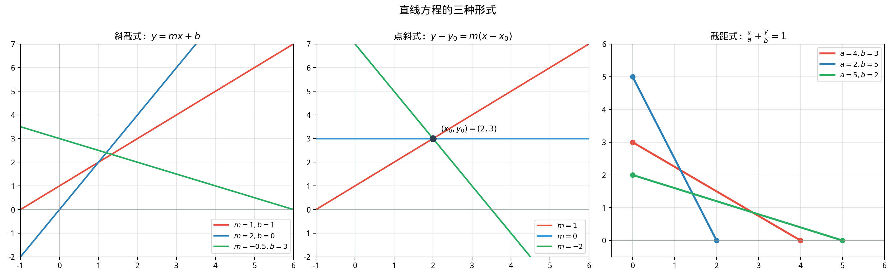

# §1 坐标系与直线（Coordinate System and Lines）

**前置知识**：[Part 5 第 1 章 欧氏几何](../ch01-euclidean/README.md)（三角形、Pythagoras 定理）、[Part 3 第 1 章 方程](../../part-03-algebra/ch01-equations/README.md)（一元一次方程）

**全景图**：解析几何的出发点是**坐标系**——给平面上的每个点一个"地址" $(x, y)$。有了坐标，距离变成公式，中点变成平均值，直线变成方程。本节系统建立坐标系中的直线理论：从距离和中点公式出发，研究直线的多种方程形式，推导平行与垂直条件、点到直线距离公式和两直线夹角公式。

**预估学习时间**：约 3–4 小时

---

## 动机

欧氏几何的证明优雅但有时费力——你需要"看到"辅助线、发现巧妙的全等或相似关系。解析几何提供了一种**机械化**的替代方案：**把几何翻译成代数，然后计算。**

例如，"证明三角形三条中线交于一点"在综合几何中需要巧妙的论证，但在解析几何中只需要设坐标、写方程、解方程组——虽然不如综合证明优雅，但完全是例行计算。

Descartes 在 1637 年的《方法论》附录《几何学》（*La Géométrie*）中引入了这种方法，彻底改变了几何学的面貌。

---

## 1. 笛卡尔坐标系（Cartesian Coordinate System）

### 1.1 建立坐标系

> **定义 1**（笛卡尔坐标系）
>
> 在平面上取两条互相垂直的数轴，交点 $O$ 为**原点**（origin）。水平的称为 **$x$ 轴**（$x$-axis），向右为正；竖直的称为 **$y$ 轴**（$y$-axis），向上为正。两轴将平面分为四个**象限**（quadrants）。
>
> 平面上每个点 $P$ 对应唯一的有序实数对 $(x, y)$，称为 $P$ 的**坐标**（coordinates）：$x$ 为**横坐标**（abscissa），$y$ 为**纵坐标**（ordinate）。

四个象限的符号特征：

| 象限 | $x$ | $y$ |
|------|-----|-----|
| 第一象限 | $+$ | $+$ |
| 第二象限 | $-$ | $+$ |
| 第三象限 | $-$ | $-$ |
| 第四象限 | $+$ | $-$ |

### 1.2 历史注记

"笛卡尔坐标系"以 René Descartes（1596–1650）命名。他的创新在于将代数和几何**统一起来**——几何图形用方程描述，代数方程用图形可视化。这种统一是现代数学的基石之一。

有趣的是，Descartes 实际上只使用了正的坐标（第一象限），完整的四象限坐标系是后人的拓展。

---

## 2. 距离公式（Distance Formula）

### 2.1 推导

> **定理 1**（两点间距离公式）
>
> 平面上两点 $A(x_1, y_1)$ 和 $B(x_2, y_2)$ 之间的距离为
>
> $$|AB| = \sqrt{(x_2 - x_1)^2 + (y_2 - y_1)^2}$$

> **证明**
>
> 过 $A$ 作水平线，过 $B$ 作竖直线，交于点 $C(x_2, y_1)$。
>
> $\triangle ACB$ 是直角三角形（$\angle C = 90°$），$AC = |x_2 - x_1|$，$BC = |y_2 - y_1|$。
>
> 由 Pythagoras 定理：
>
> $$|AB|^2 = AC^2 + BC^2 = (x_2 - x_1)^2 + (y_2 - y_1)^2$$
>
> $|AB| = \sqrt{(x_2 - x_1)^2 + (y_2 - y_1)^2}$。$\blacksquare$

### 2.2 特别情况

- 点 $P(x, y)$ 到原点的距离：$|OP| = \sqrt{x^2 + y^2}$
- 水平线段（$y_1 = y_2$）：$|AB| = |x_2 - x_1|$
- 竖直线段（$x_1 = x_2$）：$|AB| = |y_2 - y_1|$

---

## 3. 中点公式（Midpoint Formula）

> **定理 2**（中点公式）
>
> 线段 $AB$ 的中点 $M$ 的坐标为两端点坐标的平均值：
>
> $$M = \left(\frac{x_1 + x_2}{2}, \frac{y_1 + y_2}{2}\right)$$

> **证明**
>
> 设 $M(x_m, y_m)$ 是 $AB$ 的中点。$M$ 将 $AB$ 分为 $1:1$ 的两段。
>
> $x$ 坐标方向：$x_m - x_1 = x_2 - x_m$，解得 $x_m = \frac{x_1 + x_2}{2}$。
>
> $y$ 坐标方向同理。$\blacksquare$

**推广**（内分点公式）：$P$ 将线段 $AB$ 按 $m:n$ 的比内分（$AP:PB = m:n$），则

$$P = \left(\frac{nx_1 + mx_2}{m + n}, \frac{ny_1 + my_2}{m + n}\right)$$

---

## 4. 直线方程（Equations of Lines）

### 4.1 斜率

> **定义 2**（斜率）
>
> 非竖直直线的**斜率**（slope）定义为
>
> $$m = \frac{y_2 - y_1}{x_2 - x_1} = \frac{\Delta y}{\Delta x}$$
>
> 其中 $(x_1, y_1)$ 和 $(x_2, y_2)$ 是直线上的任意两个不同的点。斜率与所选的两点无关。

竖直直线的斜率无定义（$\Delta x = 0$）。

斜率的几何意义：直线与 $x$ 轴正方向的夹角 $\theta$ 满足 $m = \tan\theta$。

### 4.2 斜截式（Slope-Intercept Form）

> **定理 3**（斜截式）
>
> 斜率为 $m$、$y$ 轴截距为 $b$ 的直线方程为
>
> $$y = mx + b$$

这是直线方程最常见的形式。$b$ 是直线与 $y$ 轴的交点的纵坐标。

### 4.3 点斜式（Point-Slope Form）

> **定理 4**（点斜式）
>
> 过点 $(x_1, y_1)$、斜率为 $m$ 的直线方程为
>
> $$y - y_1 = m(x - x_1)$$

> **证明**
>
> 设 $(x, y)$ 是直线上的任意一点（$x \neq x_1$）。由斜率定义：$\frac{y - y_1}{x - x_1} = m$。
>
> 整理得 $y - y_1 = m(x - x_1)$。当 $x = x_1$ 时，$y = y_1$，也满足方程。$\blacksquare$

### 4.4 两点式（Two-Point Form）

过两点 $(x_1, y_1)$ 和 $(x_2, y_2)$（$x_1 \neq x_2$）的直线方程为

$$\frac{y - y_1}{y_2 - y_1} = \frac{x - x_1}{x_2 - x_1}$$

这由点斜式代入 $m = \frac{y_2 - y_1}{x_2 - x_1}$ 得到。

### 4.5 截距式（Intercept Form）

设直线与 $x$ 轴交于 $(a, 0)$，与 $y$ 轴交于 $(0, b)$（$a \neq 0$，$b \neq 0$），则

$$\frac{x}{a} + \frac{y}{b} = 1$$

### 4.6 一般式（General Form）

> **定理 5**（直线的一般方程）
>
> 平面上的任何直线都可以表示为
>
> $$ax + by + c = 0$$
>
> 其中 $a$, $b$ 不同时为零。反之，当 $a$, $b$ 不同时为零时，此方程总表示一条直线。

一般式是最通用的形式——它可以表示竖直直线（$b = 0$），而斜截式不能。

---

## 5. 平行与垂直（Parallel and Perpendicular Lines）

### 5.1 平行条件

> **定理 6**（平行条件）
>
> 两条非竖直直线平行，当且仅当它们的斜率相等：
>
> $$\ell_1 \parallel \ell_2 \quad \Longleftrightarrow \quad m_1 = m_2 \quad (\text{且 } \ell_1 \neq \ell_2)$$

*证明*：平行意味着方向相同，即与 $x$ 轴的夹角相同，即斜率相同。

对于一般式 $a_1x + b_1y + c_1 = 0$ 和 $a_2x + b_2y + c_2 = 0$，平行条件为 $a_1b_2 = a_2b_1$（且不是同一条线）。

### 5.2 垂直条件

> **定理 7**（垂直条件）
>
> 两条斜率都存在且非零的直线垂直，当且仅当它们的斜率之积为 $-1$：
>
> $$\ell_1 \perp \ell_2 \quad \Longleftrightarrow \quad m_1 \cdot m_2 = -1$$

> **证明**
>
> 设 $\ell_1$ 与 $x$ 轴正方向的夹角为 $\alpha$，$\ell_2$ 的为 $\beta$。$m_1 = \tan\alpha$，$m_2 = \tan\beta$。
>
> $\ell_1 \perp \ell_2$ 意味着 $\beta = \alpha + 90°$（或 $\alpha - 90°$）。
>
> $m_2 = \tan(\alpha + 90°) = -\cot\alpha = -\frac{1}{\tan\alpha} = -\frac{1}{m_1}$
>
> 因此 $m_1 m_2 = -1$。$\blacksquare$

---

## 6. 点到直线的距离（Distance from Point to Line）

> **定理 8**（点到直线的距离公式）
>
> 点 $P(x_0, y_0)$ 到直线 $\ell: ax + by + c = 0$ 的距离为
>
> $$d = \frac{|ax_0 + by_0 + c|}{\sqrt{a^2 + b^2}}$$

> **证明**
>
> 设 $Q$ 是 $P$ 在 $\ell$ 上的垂足。过 $P$ 作 $\ell$ 的垂线，其方程可以用斜率写出。
>
> 更直接的方法：设 $\ell$ 上与 $P$ 最近的点为 $Q(x_q, y_q)$。
>
> $\vec{PQ} = (x_q - x_0, y_q - y_0)$ 与 $\ell$ 的法向量 $\vec{n} = (a, b)$ 平行（因为 $PQ \perp \ell$）。
>
> 因此 $\vec{PQ} = t(a, b)$，即 $x_q = x_0 + ta$，$y_q = y_0 + tb$。
>
> $Q$ 在 $\ell$ 上：$a(x_0 + ta) + b(y_0 + tb) + c = 0$。
>
> $ax_0 + by_0 + c + t(a^2 + b^2) = 0$，$t = -\frac{ax_0 + by_0 + c}{a^2 + b^2}$。
>
> $$d = |PQ| = |t| \cdot |\vec{n}| = \frac{|ax_0 + by_0 + c|}{a^2 + b^2} \cdot \sqrt{a^2 + b^2} = \frac{|ax_0 + by_0 + c|}{\sqrt{a^2 + b^2}}$$
>
> $\blacksquare$

### 6.1 两平行线间的距离

两条平行直线 $ax + by + c_1 = 0$ 和 $ax + by + c_2 = 0$ 之间的距离为

$$d = \frac{|c_1 - c_2|}{\sqrt{a^2 + b^2}}$$

（取第一条线上任意一点代入第二条线的点到直线距离公式。）

---

## 7. 两直线的夹角（Angle Between Two Lines）

> **定理 9**（两直线的夹角）
>
> 斜率分别为 $m_1$、$m_2$ 的两直线的夹角 $\theta$（$0 < \theta \leq 90°$）满足
>
> $$\tan\theta = \left|\frac{m_1 - m_2}{1 + m_1 m_2}\right|$$
>
> （前提：$1 + m_1 m_2 \neq 0$，即两直线不垂直。）

> **证明**
>
> 设两直线与 $x$ 轴正方向的夹角分别为 $\alpha$ 和 $\beta$，$m_1 = \tan\alpha$，$m_2 = \tan\beta$。
>
> 两直线的夹角 $\theta = |\alpha - \beta|$（取锐角）。
>
> $$\tan(\alpha - \beta) = \frac{\tan\alpha - \tan\beta}{1 + \tan\alpha\tan\beta} = \frac{m_1 - m_2}{1 + m_1 m_2}$$
>
> 取绝对值得 $\tan\theta = \left|\frac{m_1 - m_2}{1 + m_1 m_2}\right|$。$\blacksquare$

---

## 例题

**例题 1**：求过 $A(1, 3)$ 和 $B(4, -1)$ 的直线方程。

**解**：斜率 $m = \frac{-1 - 3}{4 - 1} = \frac{-4}{3}$。

点斜式：$y - 3 = -\frac{4}{3}(x - 1)$。

整理：$y = -\frac{4}{3}x + \frac{4}{3} + 3 = -\frac{4}{3}x + \frac{13}{3}$。

一般式：$4x + 3y - 13 = 0$。

---

**例题 2**：求点 $P(3, -1)$ 到直线 $4x - 3y + 2 = 0$ 的距离。

**解**：

$$d = \frac{|4 \cdot 3 - 3 \cdot (-1) + 2|}{\sqrt{4^2 + (-3)^2}} = \frac{|12 + 3 + 2|}{\sqrt{16 + 9}} = \frac{17}{5}$$

---

**例题 3**：直线 $\ell_1: 2x + 3y - 5 = 0$ 和 $\ell_2: x - 2y + 3 = 0$ 的夹角是多少？

**解**：$m_1 = -\frac{2}{3}$，$m_2 = \frac{1}{2}$。

$$\tan\theta = \left|\frac{-\frac{2}{3} - \frac{1}{2}}{1 + (-\frac{2}{3}) \cdot \frac{1}{2}}\right| = \left|\frac{-\frac{4}{6} - \frac{3}{6}}{1 - \frac{1}{3}}\right| = \left|\frac{-\frac{7}{6}}{\frac{2}{3}}\right| = \left|-\frac{7}{4}\right| = \frac{7}{4}$$

$\theta = \arctan\frac{7}{4} \approx 60.26°$。

---

## 要点回顾

| 概念 | 要点 |
|------|------|
| 距离公式 | $\sqrt{(x_2-x_1)^2 + (y_2-y_1)^2}$ |
| 中点公式 | $\left(\frac{x_1+x_2}{2}, \frac{y_1+y_2}{2}\right)$ |
| 斜截式 | $y = mx + b$ |
| 点斜式 | $y - y_1 = m(x - x_1)$ |
| 一般式 | $ax + by + c = 0$ |
| 平行条件 | $m_1 = m_2$（斜率相等） |
| 垂直条件 | $m_1 m_2 = -1$（斜率之积为 $-1$） |
| 点到直线距离 | $\frac{\|ax_0 + by_0 + c\|}{\sqrt{a^2+b^2}}$ |
| 两线夹角 | $\tan\theta = \left\|\frac{m_1-m_2}{1+m_1m_2}\right\|$ |

---

## 进度检查点

完成本节后，你应该能够：

- [ ] 用距离公式计算两点间距离
- [ ] 用中点公式求中点坐标
- [ ] 写出直线的斜截式、点斜式、一般式、截距式
- [ ] 在不同形式之间转换
- [ ] 判定两直线平行或垂直
- [ ] 计算点到直线的距离
- [ ] 计算两直线的夹角

---

## 自测题

**自测题 1**：$A(2, 5)$ 和 $B(6, 1)$ 之间的距离是多少？中点坐标呢？

答案

$|AB| = \sqrt{(6-2)^2 + (1-5)^2} = \sqrt{16 + 16} = 4\sqrt{2}$。

中点 $M = \left(\frac{2+6}{2}, \frac{5+1}{2}\right) = (4, 3)$。

**自测题 2**：直线 $y = 3x + 2$ 和 $y = 3x - 5$ 是什么关系？它们之间的距离是多少？

答案

两条直线斜率都是 $3$，但截距不同（$2 \neq -5$），所以它们**平行**。

改写为一般式：$3x - y + 2 = 0$ 和 $3x - y - 5 = 0$。

距离 $= \frac{|2 - (-5)|}{\sqrt{9 + 1}} = \frac{7}{\sqrt{10}} = \frac{7\sqrt{10}}{10}$。

**自测题 3**：直线 $\ell_1$ 斜率为 $2$，直线 $\ell_2$ 与 $\ell_1$ 垂直。$\ell_2$ 的斜率是多少？

答案

$m_1 m_2 = -1$，$2 \cdot m_2 = -1$，$m_2 = -\frac{1}{2}$。

**自测题 4**：写出过点 $(1, 2)$ 且斜率为 $-3$ 的直线的一般式方程。

答案

点斜式：$y - 2 = -3(x - 1)$，$y = -3x + 5$。一般式：$3x + y - 5 = 0$。

---

## 习题引用

本节练习见[练习题](exercises/exercises.md)第 §1 部分。
