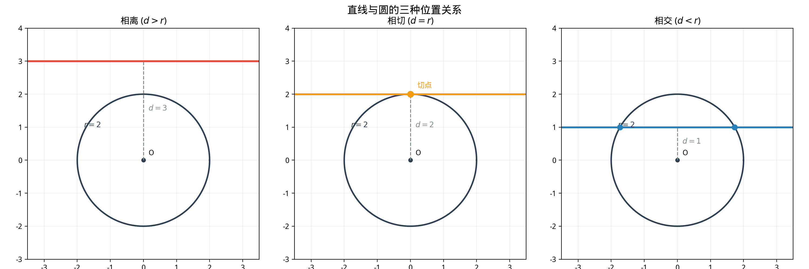

# §2 圆的方程（Equation of a Circle）

**前置知识**：[§1 坐标系与直线](01-coordinate-lines.md)（坐标系、距离公式、直线方程、点到直线距离）

**全景图**：在欧氏几何中，圆是"到定点等距的点的集合"。在解析几何中，这个定义直接翻译成一个方程。本节推导圆的标准方程和一般方程，研究直线与圆的三种位置关系（相交、相切、相离），并给出切线方程的求法。

**预估学习时间**：约 2–3 小时

---

## 动机

我们已经知道如何用方程描述直线。下一个自然的问题是：**圆的方程是什么？**

圆的定义——"到圆心距离等于半径的所有点"——用距离公式直接翻译成一个方程。这个方程是一个二次方程（含 $x^2$ 和 $y^2$），比直线的一次方程复杂一级。理解圆的方程是通往下一章（圆锥曲线——椭圆、双曲线、抛物线）的桥梁。

---

## 1. 圆的标准方程（Standard Form）

### 1.1 推导

> **定理 1**（圆的标准方程）
>
> 以 $(h, k)$ 为圆心、$r$ 为半径的圆的方程为
>
> $$(x - h)^2 + (y - k)^2 = r^2$$

> **证明**
>
> 点 $P(x, y)$ 在圆上，当且仅当 $P$ 到圆心 $(h, k)$ 的距离等于 $r$：
>
> $$\sqrt{(x - h)^2 + (y - k)^2} = r$$
>
> 两边平方即得标准方程。$\blacksquare$

### 1.2 特殊情况

- 圆心在原点：$(h, k) = (0, 0)$，方程为 $x^2 + y^2 = r^2$。
- 圆心在 $x$ 轴上：$(h, 0)$，方程为 $(x - h)^2 + y^2 = r^2$。
- 圆心在 $y$ 轴上：$(0, k)$，方程为 $x^2 + (y - k)^2 = r^2$。

### 1.3 由标准方程读取信息

给定标准方程 $(x - 3)^2 + (y + 2)^2 = 16$：
- 圆心：$(3, -2)$（注意 $y + 2 = y - (-2)$）
- 半径：$r = \sqrt{16} = 4$

---

## 2. 圆的一般方程（General Form）

### 2.1 展开

将标准方程展开：

$$(x - h)^2 + (y - k)^2 = r^2$$

$$x^2 - 2hx + h^2 + y^2 - 2ky + k^2 = r^2$$

$$x^2 + y^2 - 2hx - 2ky + (h^2 + k^2 - r^2) = 0$$

令 $D = -2h$，$E = -2k$，$F = h^2 + k^2 - r^2$：

> **定理 2**（圆的一般方程）
>
> 圆的方程可以写成
>
> $$x^2 + y^2 + Dx + Ey + F = 0$$
>
> 其中圆心为 $\left(-\frac{D}{2}, -\frac{E}{2}\right)$，半径为 $r = \frac{1}{2}\sqrt{D^2 + E^2 - 4F}$。
>
> 此方程表示圆的充要条件是 $D^2 + E^2 - 4F > 0$。

### 2.2 从一般方程到标准方程：配方法

**核心技巧**：对 $x$ 和 $y$ 分别配方（completing the square）。

**例**：将 $x^2 + y^2 - 6x + 4y - 3 = 0$ 化为标准形式。

$$\underbrace{(x^2 - 6x)}_{\text{配方}} + \underbrace{(y^2 + 4y)}_{\text{配方}} = 3$$

$$(x^2 - 6x + 9) + (y^2 + 4y + 4) = 3 + 9 + 4$$

$$(x - 3)^2 + (y + 2)^2 = 16$$

圆心 $(3, -2)$，半径 $r = 4$。

### 2.3 退化情况

- $D^2 + E^2 - 4F = 0$：方程表示一个**点**（半径为 $0$ 的"圆"）。
- $D^2 + E^2 - 4F < 0$：方程**无实数解**（虚圆）。

---

## 3. 确定圆的条件

确定一个圆需要三个独立条件（因为圆有三个参数：$h$, $k$, $r$）。

### 3.1 过三点的圆

> **定理 3**
>
> 不共线的三点确定唯一一个圆。

*方法*：将三点坐标代入一般方程 $x^2 + y^2 + Dx + Ey + F = 0$，得到关于 $D$, $E$, $F$ 的三元一次方程组，解之即可。

---

## 4. 直线与圆的位置关系（Line-Circle Positions）

设圆 $\odot C$ 的圆心为 $C(h, k)$，半径为 $r$，直线 $\ell: ax + by + c = 0$。圆心到直线的距离为

$$d = \frac{|ah + bk + c|}{\sqrt{a^2 + b^2}}$$

> **定理 4**（直线与圆的位置关系）
>
> - $d < r$：直线与圆**相交**（secant），有两个公共点
> - $d = r$：直线与圆**相切**（tangent），有一个公共点（切点）
> - $d > r$：直线与圆**相离**（external），无公共点

> **证明**
>
> 从圆心 $C$ 向直线 $\ell$ 作垂线，垂足 $M$。设直线与圆的公共点为 $P$。
>
> $\triangle CMP$ 是直角三角形（$\angle M = 90°$），$CP = r$，$CM = d$。
>
> $PM = \sqrt{r^2 - d^2}$（当 $d \leq r$ 时）。
>
> - $d < r$：$PM > 0$，$M$ 两侧各有一个公共点，共 2 个。
> - $d = r$：$PM = 0$，$M$ 即切点，共 1 个。
> - $d > r$：$r^2 - d^2 < 0$，无实数解，共 0 个。$\blacksquare$

### 4.1 代数方法

也可以将直线方程代入圆的方程，化为一元二次方程 $at^2 + bt + c = 0$，由判别式 $\Delta = b^2 - 4ac$ 来判定：

- $\Delta > 0$：两个交点（相交）
- $\Delta = 0$：一个交点（相切）
- $\Delta < 0$：无交点（相离）

两种方法（几何的 $d$ vs. $r$ 和代数的 $\Delta$）是等价的。

### 4.2 弦长公式

当 $d < r$（直线与圆相交），弦长为

$$|AB| = 2\sqrt{r^2 - d^2}$$

---

## 5. 切线方程（Tangent Line Equations）

### 5.1 过圆上一点的切线

> **定理 5**（过圆上一点的切线方程）
>
> 圆 $x^2 + y^2 = r^2$ 上的点 $P(x_0, y_0)$ 处的切线方程为
>
> $$x_0 x + y_0 y = r^2$$

> **证明**
>
> 切线过 $P(x_0, y_0)$ 且垂直于半径 $OP$。$OP$ 的斜率为 $\frac{y_0}{x_0}$（假设 $x_0 \neq 0$）。
>
> 切线斜率 $= -\frac{x_0}{y_0}$（垂直条件）。
>
> 切线方程：$y - y_0 = -\frac{x_0}{y_0}(x - x_0)$。
>
> $y_0(y - y_0) = -x_0(x - x_0)$
>
> $y_0 y - y_0^2 = -x_0 x + x_0^2$
>
> $x_0 x + y_0 y = x_0^2 + y_0^2 = r^2$。$\blacksquare$

**推广**：圆 $(x-h)^2 + (y-k)^2 = r^2$ 上的点 $(x_0, y_0)$ 处的切线方程为

$$(x_0 - h)(x - h) + (y_0 - k)(y - k) = r^2$$

### 5.2 从圆外一点引切线

设 $P(x_0, y_0)$ 是圆 $x^2 + y^2 = r^2$ 外的一点（即 $x_0^2 + y_0^2 > r^2$）。从 $P$ 引切线。

设切点为 $T(a, b)$。由上节，切线方程为 $ax + by = r^2$。又 $P(x_0, y_0)$ 在切线上：$ax_0 + by_0 = r^2$。同时 $T$ 在圆上：$a^2 + b^2 = r^2$。

这给出一个关于 $(a, b)$ 的方程组，可以解出切点坐标，进而得到切线方程。

**切线长**：$|PT| = \sqrt{x_0^2 + y_0^2 - r^2}$（由勾股定理，$|OP|^2 = |OT|^2 + |PT|^2$）。

---

## 例题

**例题 1**：求以 $(2, -3)$ 为圆心、过点 $(5, 1)$ 的圆的方程。

**解**：半径 $r = \sqrt{(5-2)^2 + (1-(-3))^2} = \sqrt{9 + 16} = 5$。

标准方程：$(x - 2)^2 + (y + 3)^2 = 25$。

一般方程：$x^2 - 4x + 4 + y^2 + 6y + 9 = 25$，即 $x^2 + y^2 - 4x + 6y - 12 = 0$。

---

**例题 2**：判断直线 $3x + 4y - 10 = 0$ 与圆 $x^2 + y^2 = 4$ 的位置关系。

**解**：圆心 $(0, 0)$，半径 $r = 2$。

$$d = \frac{|3 \cdot 0 + 4 \cdot 0 - 10|}{\sqrt{9 + 16}} = \frac{10}{5} = 2 = r$$

$d = r$，所以直线与圆**相切**。

---

**例题 3**：求过三点 $A(0, 0)$, $B(4, 0)$, $C(0, 6)$ 的圆的方程。

**解**：设圆的一般方程为 $x^2 + y^2 + Dx + Ey + F = 0$。

代入 $A(0,0)$：$F = 0$。

代入 $B(4,0)$：$16 + 4D + F = 0$，$4D = -16$，$D = -4$。

代入 $C(0,6)$：$36 + 6E + F = 0$，$6E = -36$，$E = -6$。

方程：$x^2 + y^2 - 4x - 6y = 0$。

配方：$(x - 2)^2 + (y - 3)^2 = 13$。圆心 $(2, 3)$，半径 $\sqrt{13}$。

---

## 要点回顾

| 概念 | 要点 |
|------|------|
| 标准方程 | $(x-h)^2 + (y-k)^2 = r^2$，圆心 $(h,k)$，半径 $r$ |
| 一般方程 | $x^2 + y^2 + Dx + Ey + F = 0$，配方化为标准形式 |
| 圆心和半径 | $\left(-\frac{D}{2}, -\frac{E}{2}\right)$，$r = \frac{1}{2}\sqrt{D^2+E^2-4F}$ |
| 位置关系 | $d < r$：相交；$d = r$：相切；$d > r$：相离 |
| 弦长 | $2\sqrt{r^2 - d^2}$ |
| 切线方程 | 圆 $x^2+y^2=r^2$ 上 $(x_0,y_0)$ 处：$x_0 x + y_0 y = r^2$ |
| 切线长 | $\sqrt{x_0^2 + y_0^2 - r^2}$（从外部点到切点） |

---

## 进度检查点

完成本节后，你应该能够：

- [ ] 写出给定圆心和半径的圆的标准方程
- [ ] 将一般方程配方化为标准方程，读出圆心和半径
- [ ] 用圆心到直线的距离判定直线与圆的位置关系
- [ ] 计算弦长
- [ ] 求圆上一点处的切线方程
- [ ] 确定过三点的圆的方程

---

## 自测题

**自测题 1**：将方程 $x^2 + y^2 + 8x - 2y + 13 = 0$ 化为标准形式，并求圆心和半径。

答案

$(x^2 + 8x + 16) + (y^2 - 2y + 1) = -13 + 16 + 1 = 4$

$(x + 4)^2 + (y - 1)^2 = 4$

圆心 $(-4, 1)$，半径 $r = 2$。

**自测题 2**：圆 $(x-1)^2 + (y-2)^2 = 9$ 与直线 $x + y = 0$ 的位置关系？

答案

圆心 $(1, 2)$，半径 $r = 3$。直线 $x + y = 0$。

$d = \frac{|1 + 2|}{\sqrt{2}} = \frac{3}{\sqrt{2}} = \frac{3\sqrt{2}}{2} \approx 2.12$。

$d \approx 2.12 < 3 = r$，所以直线与圆**相交**。

**自测题 3**：圆 $x^2 + y^2 = 25$ 上点 $(3, 4)$ 处的切线方程是什么？

答案

$x_0 x + y_0 y = r^2$，即 $3x + 4y = 25$。

---

## 习题引用

本节练习见[练习题](exercises/exercises.md)第 §2 部分。
