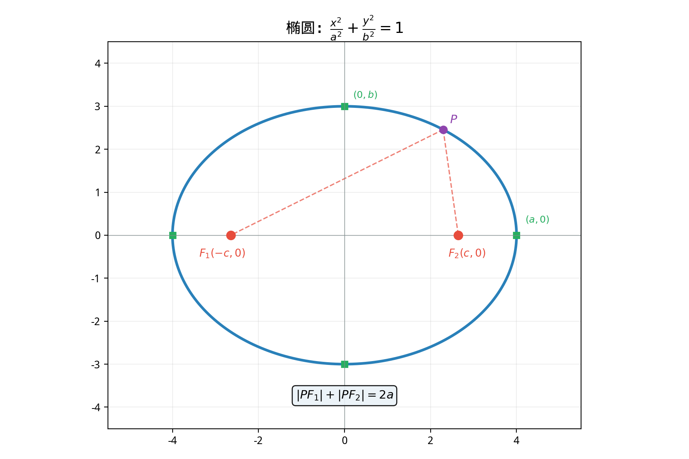
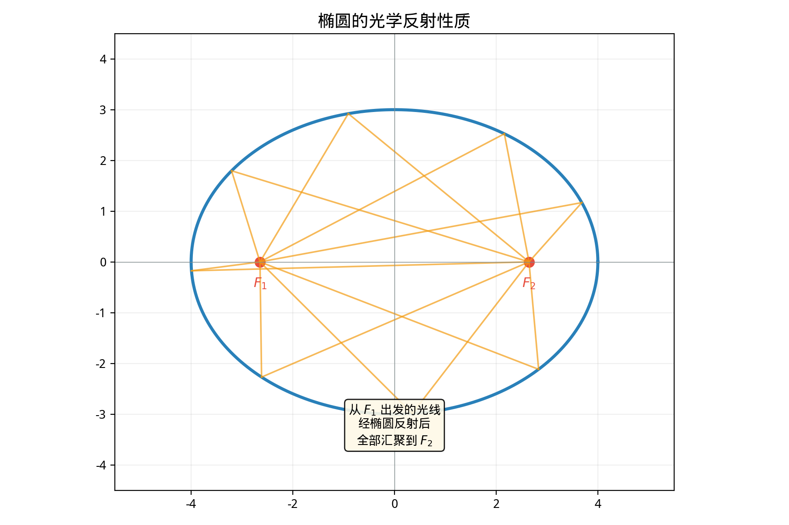

# §1 椭圆（Ellipse）

**前置知识**：[Part 5 第 2 章 解析几何](../ch02-analytic/README.md)（坐标系、距离公式、圆的方程）、[Part 3 第 1 章 方程](../../part-03-algebra/ch01-equations/README.md)（二次方程、配方法）

**全景图**：椭圆是圆锥曲线三姐妹中最"温和"的——它是一条封闭曲线，是圆的"拉伸"版本。椭圆的定义优雅而自然：**到两个定点（焦点）距离之和为常数的点的轨迹。** 本节从这个定义出发推导标准方程，分析关键参数（焦点、顶点、离心率），介绍椭圆的光学反射性质，并给出参数方程。

**预估学习时间**：约 2–3 小时

---

## 动机

想象你在地面上插两个钉子，用一根绳子绕过两个钉子（绳长大于钉距），用铅笔绷紧绳子画曲线——你画出的就是椭圆。

这不仅是一个数学曲线：Kepler 第一定律告诉我们，**每颗行星的轨道都是椭圆，太阳位于一个焦点**。理解椭圆就是理解行星运动的几何。

---

## 1. 椭圆的定义

> **定义 1**（椭圆）
>
> 平面上到两个定点 $F_1$, $F_2$ 的距离之和等于常数 $2a$（$2a > |F_1F_2|$）的所有点的集合称为**椭圆**（ellipse）。$F_1$ 和 $F_2$ 称为**焦点**（foci）。

设两焦点之间的距离为 $|F_1F_2| = 2c$。条件 $2a > 2c$，即 $a > c$（否则满足条件的点不存在或退化为线段）。

---

## 2. 标准方程的推导

### 2.1 坐标设置

将两焦点放在 $x$ 轴上，关于原点对称：$F_1(-c, 0)$，$F_2(c, 0)$。

设 $P(x, y)$ 是椭圆上任意一点。定义条件：

$$|PF_1| + |PF_2| = 2a$$

$$\sqrt{(x+c)^2 + y^2} + \sqrt{(x-c)^2 + y^2} = 2a$$

### 2.2 化简

令 $\sqrt{(x+c)^2 + y^2} = 2a - \sqrt{(x-c)^2 + y^2}$，两边平方：

$$(x+c)^2 + y^2 = 4a^2 - 4a\sqrt{(x-c)^2 + y^2} + (x-c)^2 + y^2$$

展开后大量项抵消：

$$x^2 + 2cx + c^2 = 4a^2 - 4a\sqrt{(x-c)^2 + y^2} + x^2 - 2cx + c^2$$

$$4cx = 4a^2 - 4a\sqrt{(x-c)^2 + y^2}$$

$$a\sqrt{(x-c)^2 + y^2} = a^2 - cx$$

再次平方：

$$a^2[(x-c)^2 + y^2] = a^4 - 2a^2cx + c^2x^2$$

$$a^2x^2 - 2a^2cx + a^2c^2 + a^2y^2 = a^4 - 2a^2cx + c^2x^2$$

$$a^2x^2 - c^2x^2 + a^2y^2 = a^4 - a^2c^2$$

$$(a^2 - c^2)x^2 + a^2y^2 = a^2(a^2 - c^2)$$

### 2.3 引入 $b$

令 $b^2 = a^2 - c^2$（由 $a > c > 0$ 保证 $b > 0$）：

$$b^2x^2 + a^2y^2 = a^2b^2$$

两边除以 $a^2b^2$：

> **定理 1**（椭圆的标准方程，焦点在 $x$ 轴上）
>
> $$\frac{x^2}{a^2} + \frac{y^2}{b^2} = 1 \qquad (a > b > 0)$$
>
> 其中 $a$ 为**半长轴**（semi-major axis），$b$ 为**半短轴**（semi-minor axis），焦点 $F_1(-c, 0)$, $F_2(c, 0)$，且 $c^2 = a^2 - b^2$。

### 2.4 焦点在 $y$ 轴上的情况

如果焦点在 $y$ 轴上，$F_1(0, -c)$，$F_2(0, c)$，标准方程为

$$\frac{x^2}{b^2} + \frac{y^2}{a^2} = 1 \qquad (a > b > 0)$$

**判断焦点位置的规则**：分母大的那个变量对应的轴就是焦点所在的轴。

---

## 3. 椭圆的关键参数

| 参数 | 符号 | 定义/关系 |
|------|------|----------|
| 半长轴 | $a$ | 椭圆中心到最远顶点的距离 |
| 半短轴 | $b$ | 椭圆中心到最近顶点的距离 |
| 半焦距 | $c$ | 椭圆中心到焦点的距离，$c = \sqrt{a^2 - b^2}$ |
| 顶点 | — | 长轴端点 $(\pm a, 0)$，短轴端点 $(0, \pm b)$ |
| 离心率 | $e$ | $e = \frac{c}{a}$，$0 < e < 1$ |

### 3.1 离心率的几何意义

> **定义 2**（离心率）
>
> 椭圆的**离心率**（eccentricity）定义为
>
> $$e = \frac{c}{a}, \qquad 0 < e < 1$$

离心率衡量椭圆的"扁"度：
- $e \to 0$：$c \to 0$，两焦点趋于重合，椭圆趋于**圆**（$a = b$）
- $e \to 1$：$c \to a$，$b \to 0$，椭圆趋于一条线段

**例**：地球轨道的离心率 $e \approx 0.017$（非常接近圆）；哈雷彗星轨道的离心率 $e \approx 0.967$（非常扁的椭圆）。

### 3.2 焦点半径公式

> **定理 2**（焦点半径）
>
> 椭圆 $\frac{x^2}{a^2} + \frac{y^2}{b^2} = 1$ 上的点 $P(x_0, y_0)$ 到两焦点的距离分别为
>
> $$|PF_1| = a + ex_0, \qquad |PF_2| = a - ex_0$$

> **证明**
>
> $|PF_1| = \sqrt{(x_0 + c)^2 + y_0^2}$。由椭圆方程，$y_0^2 = b^2\left(1 - \frac{x_0^2}{a^2}\right) = \frac{b^2(a^2 - x_0^2)}{a^2}$。
>
> $(x_0 + c)^2 + y_0^2 = x_0^2 + 2cx_0 + c^2 + \frac{b^2(a^2 - x_0^2)}{a^2}$
>
> $= x_0^2 + 2cx_0 + c^2 + b^2 - \frac{b^2x_0^2}{a^2}$
>
> $= x_0^2\left(1 - \frac{b^2}{a^2}\right) + 2cx_0 + a^2$（因为 $b^2 + c^2 = a^2$）
>
> $= \frac{c^2x_0^2}{a^2} + 2cx_0 + a^2 = \left(\frac{cx_0}{a} + a\right)^2 = (ex_0 + a)^2$
>
> 因此 $|PF_1| = a + ex_0$（$|x_0| \leq a$，$e < 1$，所以 $a + ex_0 > 0$）。
>
> 类似地，$|PF_2| = a - ex_0$。$\blacksquare$

---

## 4. 光学反射性质（Optical Reflection Property）

> **定理 3**（椭圆的反射性质）
>
> 从椭圆的一个焦点发出的光线（或声波），经椭圆反射后，一定通过另一个焦点。

*证明思路*：椭圆在点 $P$ 处的切线将 $\angle F_1PF_2$ 的外角平分。由反射定律（入射角 = 反射角），入射光线 $F_1P$ 反射后沿 $PF_2$ 传播。

**应用**：
- **耳语廊**（Whispering Gallery）：椭圆形大厅中，站在一个焦点处低声说话，另一个焦点处的人可以清晰听到。
- **碎石术**：医学上利用椭圆反射性质，将冲击波从一个焦点聚焦到另一个焦点（肾结石所在位置）来碎石。

---

## 5. 椭圆的参数方程（Parametric Equations）

> **定理 4**（椭圆的参数方程）
>
> 椭圆 $\frac{x^2}{a^2} + \frac{y^2}{b^2} = 1$ 可以用参数方程表示为
>
> $$x = a\cos t, \qquad y = b\sin t, \qquad t \in [0, 2\pi)$$

验证：$\frac{x^2}{a^2} + \frac{y^2}{b^2} = \cos^2 t + \sin^2 t = 1$。✓

**几何意义**：参数 $t$ 不是点 $P$ 与原点连线的角度（除非 $a = b$）。它是一个辅助角——从椭圆的外接圆（半径 $a$）的角度参数化。

---

## 例题

**例题 1**：求椭圆 $\frac{x^2}{25} + \frac{y^2}{9} = 1$ 的焦点坐标、离心率和顶点。

**解**：$a^2 = 25$，$b^2 = 9$，$a = 5$，$b = 3$。

$c = \sqrt{a^2 - b^2} = \sqrt{25 - 9} = 4$。焦点 $F_1(-4, 0)$，$F_2(4, 0)$。

$e = \frac{c}{a} = \frac{4}{5} = 0.8$。

顶点：$(\pm 5, 0)$，$(0, \pm 3)$。

---

**例题 2**：已知椭圆过点 $(3, 0)$ 和 $(0, 2)$，求标准方程。

**解**：设方程 $\frac{x^2}{a^2} + \frac{y^2}{b^2} = 1$。

代入 $(3, 0)$：$\frac{9}{a^2} = 1$，$a^2 = 9$。

代入 $(0, 2)$：$\frac{4}{b^2} = 1$，$b^2 = 4$。

方程：$\frac{x^2}{9} + \frac{y^2}{4} = 1$。

---

**例题 3**：椭圆 $\frac{x^2}{16} + \frac{y^2}{12} = 1$ 上的点 $P$ 到焦点 $F_1$ 的距离为 $3$。求 $|PF_2|$。

**解**：$a = 4$，$|PF_1| + |PF_2| = 2a = 8$。

$|PF_2| = 8 - 3 = 5$。

---

## 要点回顾

| 概念 | 要点 |
|------|------|
| 定义 | $\|PF_1\| + \|PF_2\| = 2a$（$a > c$） |
| 标准方程 | $\frac{x^2}{a^2} + \frac{y^2}{b^2} = 1$（$a > b > 0$），焦点在长轴上 |
| 关键关系 | $c^2 = a^2 - b^2$ |
| 离心率 | $e = c/a$，$0 < e < 1$；$e \to 0$ 趋于圆，$e \to 1$ 趋于线段 |
| 焦点半径 | $\|PF_1\| = a + ex_0$，$\|PF_2\| = a - ex_0$ |
| 反射性质 | 一个焦点的光线经反射通过另一个焦点 |
| 参数方程 | $x = a\cos t$，$y = b\sin t$ |

---

## 进度检查点

完成本节后，你应该能够：

- [ ] 从定义推导椭圆的标准方程
- [ ] 由标准方程读出 $a$, $b$, $c$, $e$ 和焦点坐标
- [ ] 解释离心率的几何意义
- [ ] 用 $|PF_1| + |PF_2| = 2a$ 解决焦点距离问题
- [ ] 写出椭圆的参数方程
- [ ] 描述椭圆的反射性质及其应用

---

## 自测题

**自测题 1**：椭圆 $\frac{x^2}{36} + \frac{y^2}{16} = 1$ 的焦点坐标和离心率？

答案

$a^2 = 36$, $b^2 = 16$, $c = \sqrt{36-16} = \sqrt{20} = 2\sqrt{5}$。焦点 $(\pm 2\sqrt{5}, 0)$。$e = \frac{2\sqrt{5}}{6} = \frac{\sqrt{5}}{3}$。

**自测题 2**：为什么 $a > c$ 是椭圆存在的必要条件？

答案

椭圆定义要求 $|PF_1| + |PF_2| = 2a > |F_1F_2| = 2c$。如果 $2a \leq 2c$，由三角不等式 $|PF_1| + |PF_2| \geq |F_1F_2|$，满足条件的点或者不存在（$2a < 2c$），或者只有线段 $F_1F_2$ 上的点（$2a = 2c$），退化了。

**自测题 3**：当 $e = 0$ 时椭圆变成什么？当 $e$ 接近 $1$ 时呢？

答案

$e = 0 \Rightarrow c = 0 \Rightarrow a = b$，椭圆退化为**圆**。$e \to 1 \Rightarrow c \to a \Rightarrow b \to 0$，椭圆变得无限扁，趋于焦点之间的**线段**。

---

## 习题引用

本节练习见[练习题](exercises/exercises.md)第 §1 部分。
