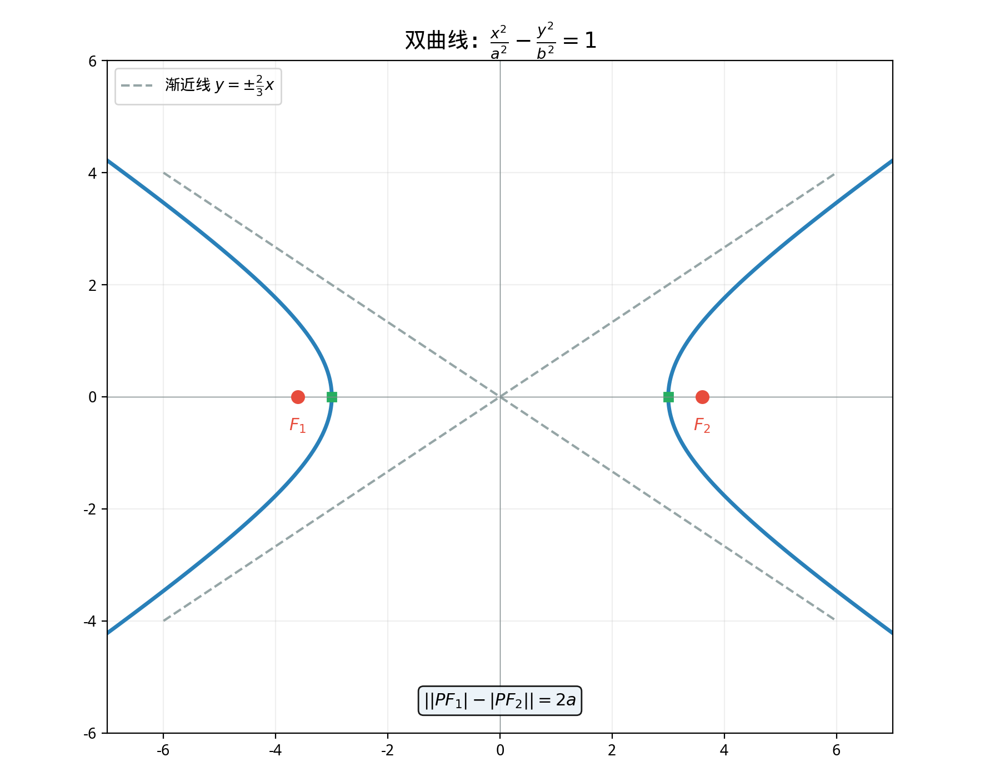

# §2 双曲线（Hyperbola）

**前置知识**：[§1 椭圆](01-ellipse.md)（椭圆的定义与标准方程推导方法）

**全景图**：双曲线是圆锥曲线的第二个成员。如果椭圆的定义是"到两焦点距离之**和**为常数"，那么双曲线的定义则是"到两焦点距离之**差**的绝对值为常数"。一字之差，产生了完全不同的曲线——双曲线是**开放的**，有两条分支，向无穷远延伸，趋近但永远不到达两条渐近线。

**预估学习时间**：约 2 小时

---

## 动机

椭圆和双曲线是一对"对偶"：一个用"和"定义，一个用"差"定义。椭圆是封闭的，双曲线是开放的。理解它们之间的对比与联系，是理解圆锥曲线的关键。

在实际应用中，双曲线出现在许多场景：
- **LORAN 导航系统**：通过测量信号到达时间差定位，其等时差曲线就是双曲线
- **冷却塔**的截面形状
- **双曲函数** $\cosh$ 和 $\sinh$ 与双曲线的关系，类似于 $\cos$ 和 $\sin$ 与圆的关系

---

## 1. 双曲线的定义

> **定义 1**（双曲线）
>
> 平面上到两个定点 $F_1$, $F_2$ 的距离之差的绝对值等于常数 $2a$（$0 < 2a < |F_1F_2|$）的所有点的集合称为**双曲线**（hyperbola）。$F_1$ 和 $F_2$ 称为**焦点**。

设 $|F_1F_2| = 2c$。条件 $0 < a < c$（否则无法形成双曲线）。

注意绝对值：$||PF_1| - |PF_2|| = 2a$。去掉绝对值后，$|PF_1| - |PF_2| = 2a$ 对应双曲线的一支（靠近 $F_2$），$|PF_1| - |PF_2| = -2a$ 对应另一支。

---

## 2. 标准方程的推导

### 2.1 坐标设置

取 $F_1(-c, 0)$，$F_2(c, 0)$。设 $P(x, y)$ 在双曲线上：

$$||PF_1| - |PF_2|| = 2a$$

$$\left|\sqrt{(x+c)^2 + y^2} - \sqrt{(x-c)^2 + y^2}\right| = 2a$$

### 2.2 化简过程

化简过程与椭圆类似（移项、平方、再移项、再平方）。省略中间步骤，最终得到：

$$(c^2 - a^2)x^2 - a^2y^2 = a^2(c^2 - a^2)$$

### 2.3 引入 $b$

令 $b^2 = c^2 - a^2$（由 $c > a > 0$ 保证 $b > 0$）：

$$b^2x^2 - a^2y^2 = a^2b^2$$

两边除以 $a^2b^2$：

> **定理 1**（双曲线的标准方程，焦点在 $x$ 轴上）
>
> $$\frac{x^2}{a^2} - \frac{y^2}{b^2} = 1 \qquad (a > 0, \; b > 0)$$
>
> 焦点 $F_1(-c, 0)$, $F_2(c, 0)$，其中 $c^2 = a^2 + b^2$。

**注意与椭圆的关键区别**：
- 椭圆：$c^2 = a^2 - b^2$，要求 $a > b$
- 双曲线：$c^2 = a^2 + b^2$，$a$ 和 $b$ 没有大小关系

### 2.4 焦点在 $y$ 轴上的情况

$$\frac{y^2}{a^2} - \frac{x^2}{b^2} = 1$$

焦点 $F_1(0, -c)$, $F_2(0, c)$，$c^2 = a^2 + b^2$。

**判断焦点位置的规则**：正号项（$+$ 号前的项）对应的变量的轴就是焦点所在的轴。

---

## 3. 渐近线（Asymptotes）

### 3.1 推导

当 $|x| \to \infty$ 时，双曲线 $\frac{x^2}{a^2} - \frac{y^2}{b^2} = 1$ 上的点趋近于什么？

从方程 $y^2 = b^2\left(\frac{x^2}{a^2} - 1\right)$，当 $|x| \gg a$ 时，$\frac{x^2}{a^2} - 1 \approx \frac{x^2}{a^2}$，所以 $y \approx \pm\frac{b}{a}x$。

> **定理 2**（双曲线的渐近线）
>
> 双曲线 $\frac{x^2}{a^2} - \frac{y^2}{b^2} = 1$ 的两条**渐近线**（asymptotes）为
>
> $$y = \frac{b}{a}x \qquad \text{和} \qquad y = -\frac{b}{a}x$$
>
> 双曲线无限趋近渐近线但永远不与之相交。

### 3.2 渐近线的几何意义

渐近线将平面分为四个区域，双曲线的两支分别在相对的两个区域中。

两条渐近线可以合写为 $\frac{x^2}{a^2} - \frac{y^2}{b^2} = 0$，即 $\left(\frac{x}{a} - \frac{y}{b}\right)\left(\frac{x}{a} + \frac{y}{b}\right) = 0$。

---

## 4. 双曲线的关键参数

| 参数 | 符号 | 定义/关系 |
|------|------|----------|
| 实半轴 | $a$ | 中心到实轴顶点的距离 |
| 虚半轴 | $b$ | 与渐近线相关，$b$ 不一定 $< a$ |
| 半焦距 | $c$ | $c = \sqrt{a^2 + b^2}$ |
| 实轴顶点 | — | $(\pm a, 0)$（焦点在 $x$ 轴时） |
| 渐近线 | — | $y = \pm\frac{b}{a}x$ |
| 离心率 | $e$ | $e = \frac{c}{a} > 1$ |

### 4.1 离心率

> **定义 2**（双曲线的离心率）
>
> $$e = \frac{c}{a} = \frac{\sqrt{a^2 + b^2}}{a} > 1$$

离心率的几何意义：
- $e \to 1^+$：$b \to 0$，渐近线趋于合拢，双曲线退化
- $e$ 增大：渐近线张角增大，双曲线越来越"开"
- $e = \sqrt{2}$：$a = b$，渐近线 $y = \pm x$，两条渐近线互相垂直——这种双曲线称为**等轴双曲线**（rectangular/equilateral hyperbola）

### 4.2 等轴双曲线

当 $a = b$ 时，方程为 $\frac{x^2}{a^2} - \frac{y^2}{a^2} = 1$，即 $x^2 - y^2 = a^2$。渐近线 $y = \pm x$ 互相垂直。例如函数 $y = \frac{k}{x}$（$k \neq 0$）的图像经过旋转 $45°$ 就是等轴双曲线。

---

## 5. 焦点半径公式

> **定理 3**（双曲线的焦点半径）
>
> 对于双曲线 $\frac{x^2}{a^2} - \frac{y^2}{b^2} = 1$ 上的点 $P(x_0, y_0)$：
>
> - 在右支（$x_0 > 0$）上：$|PF_1| = a + ex_0$，$|PF_2| = ex_0 - a$
> - 在左支（$x_0 < 0$）上：$|PF_1| = -(a + ex_0)$，$|PF_2| = -(ex_0 - a) = a - ex_0$

（统一写法：$|PF_1| = |a + ex_0|$，$|PF_2| = |ex_0 - a|$。）

---

## 例题

**例题 1**：求双曲线 $\frac{x^2}{9} - \frac{y^2}{16} = 1$ 的焦点坐标、渐近线和离心率。

**解**：$a^2 = 9$，$b^2 = 16$，$a = 3$，$b = 4$。

$c = \sqrt{9 + 16} = 5$。焦点 $(\pm 5, 0)$。

渐近线：$y = \pm\frac{4}{3}x$。

离心率：$e = \frac{5}{3}$。

---

**例题 2**：已知双曲线的渐近线为 $y = \pm 2x$，且过点 $(3, 4)$。求标准方程。

**解**：渐近线 $y = \pm\frac{b}{a}x$，$\frac{b}{a} = 2$，所以 $b = 2a$。

设方程 $\frac{x^2}{a^2} - \frac{y^2}{4a^2} = 1$。代入 $(3, 4)$：

$$\frac{9}{a^2} - \frac{16}{4a^2} = 1 \quad \Rightarrow \quad \frac{9}{a^2} - \frac{4}{a^2} = 1 \quad \Rightarrow \quad \frac{5}{a^2} = 1 \quad \Rightarrow \quad a^2 = 5$$

$b^2 = 4a^2 = 20$。方程：$\frac{x^2}{5} - \frac{y^2}{20} = 1$。

---

**例题 3**：双曲线 $\frac{x^2}{4} - \frac{y^2}{12} = 1$ 上的点 $P$ 到焦点 $F_1(-4, 0)$ 的距离为 $7$。求 $|PF_2|$。

**解**：$a = 2$，$c = \sqrt{4 + 12} = 4$。$||PF_1| - |PF_2|| = 2a = 4$。

$|PF_1| = 7$，$|7 - |PF_2|| = 4$。

$|PF_2| = 7 - 4 = 3$ 或 $|PF_2| = 7 + 4 = 11$。

需要判断 $P$ 在哪一支。$P$ 离 $F_1$ 更远（$|PF_1| = 7 > |PF_2|$），所以 $P$ 在靠近 $F_2$ 的那支（右支），$|PF_1| - |PF_2| = 4$，$|PF_2| = 3$。

验证：如果 $P$ 在左支，$|PF_2| - |PF_1| = 4$，$|PF_2| = 11$。两者都是可能的（取决于 $P$ 在哪支），但通常需要额外信息。答案为 $|PF_2| = 3$ 或 $|PF_2| = 11$。

---

## 要点回顾

| 概念 | 要点 |
|------|------|
| 定义 | $\|\|PF_1\| - \|PF_2\|\| = 2a$（$0 < a < c$） |
| 标准方程 | $\frac{x^2}{a^2} - \frac{y^2}{b^2} = 1$（焦点在 $x$ 轴） |
| 关键关系 | $c^2 = a^2 + b^2$（注意与椭圆的区别） |
| 渐近线 | $y = \pm\frac{b}{a}x$ |
| 离心率 | $e = c/a > 1$；$e$ 越大双曲线越"开" |
| 等轴双曲线 | $a = b$，$e = \sqrt{2}$，渐近线正交 |

---

## 进度检查点

完成本节后，你应该能够：

- [ ] 从定义推导双曲线的标准方程
- [ ] 说出 $c^2 = a^2 + b^2$（而非 $a^2 - b^2$）
- [ ] 求出渐近线方程
- [ ] 计算离心率并解释其几何意义
- [ ] 用定义中的距离差解决焦点距离问题
- [ ] 区分椭圆和双曲线的异同

---

## 自测题

**自测题 1**：双曲线 $\frac{x^2}{4} - \frac{y^2}{5} = 1$ 的 $c$ 等于多少？

答案

$c = \sqrt{a^2 + b^2} = \sqrt{4 + 5} = 3$。

**自测题 2**：椭圆中 $c^2 = a^2 - b^2$，双曲线中 $c^2 = a^2 + b^2$。为什么符号不同？

答案

在椭圆中，$a > c$（距离之和大于焦距），令 $b^2 = a^2 - c^2 > 0$。在双曲线中，$c > a$（焦距大于距离之差），令 $b^2 = c^2 - a^2 > 0$。两者的 $b$ 的定义方式保证 $b^2$ 为正。等价地，椭圆 $b^2 = a^2 - c^2$，双曲线 $b^2 = c^2 - a^2$，统一写成 $c^2 = a^2 \pm b^2$。

**自测题 3**：双曲线 $\frac{x^2}{9} - \frac{y^2}{16} = 1$ 的渐近线是什么？

答案

$y = \pm\frac{b}{a}x = \pm\frac{4}{3}x$。

---

## 习题引用

本节练习见[练习题](exercises/exercises.md)第 §2 部分。
