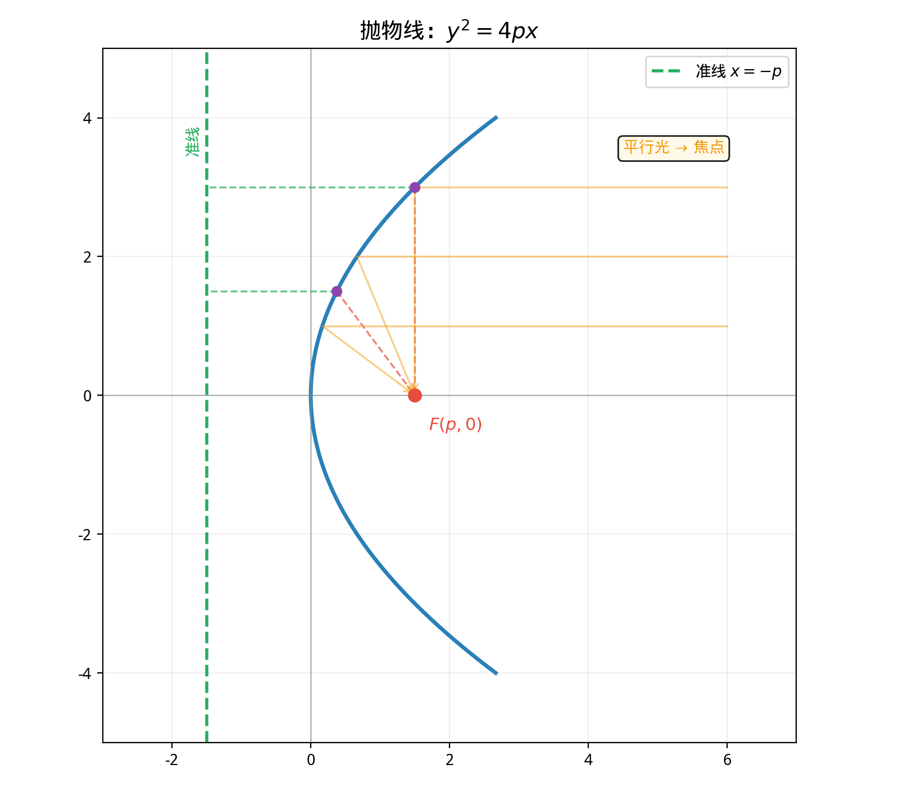

# §3 抛物线（Parabola）

**前置知识**：[§1 椭圆](01-ellipse.md)、[§2 双曲线](02-hyperbola.md)（圆锥曲线的基本概念、标准方程推导方法）

**全景图**：抛物线是圆锥曲线三姐妹中最"特殊"的——它只有一个焦点和一条准线，且离心率恰好等于 $1$。抛物线是椭圆和双曲线之间的"分界线"。它的定义也是最简洁的：**到焦点和到准线距离相等的点的轨迹。** 抛物线的反射性质使它在工程中极为重要——从卫星天线到汽车大灯，从射击弹道到桥梁拱形，抛物线无处不在。

**预估学习时间**：约 2 小时

---

## 动机

抛一颗球，它在空中划出的轨迹是什么曲线？（忽略空气阻力。）答案是**抛物线**——这正是"抛物线"（parabola）这个名字的直觉来源。

但抛物线不仅出现在抛体运动中。它还有一个惊人的性质：**平行于抛物线轴的光线经反射后都汇聚到焦点。** 这个性质使抛物面成为望远镜和卫星天线的理想形状。

---

## 1. 抛物线的定义

> **定义 1**（抛物线）
>
> 平面上到一个定点 $F$（**焦点**，focus）和一条定直线 $\ell$（**准线**，directrix）（$F \notin \ell$）距离相等的所有点的集合称为**抛物线**（parabola）。
>
> 即对抛物线上的任意点 $P$：
>
> $$|PF| = d(P, \ell)$$

设焦点到准线的距离为 $d(F, \ell) = 2p$（$p > 0$）。$p$ 称为**焦准距**。

---

## 2. 标准方程的推导

### 2.1 坐标设置

取焦点和准线关于原点对称：$F(p, 0)$，准线 $\ell: x = -p$。

设 $P(x, y)$ 在抛物线上：

$$|PF| = d(P, \ell)$$

$$\sqrt{(x - p)^2 + y^2} = |x + p| = x + p$$

（最后一步因为 $P$ 在准线右侧，$x \geq 0$，所以 $x + p > 0$。）

两边平方：

$$(x - p)^2 + y^2 = (x + p)^2$$

$$x^2 - 2px + p^2 + y^2 = x^2 + 2px + p^2$$

$$y^2 = 4px$$

> **定理 1**（抛物线的标准方程）
>
> 焦点在 $x$ 轴正半轴、开口向右的抛物线标准方程为
>
> $$y^2 = 4px \qquad (p > 0)$$
>
> 焦点 $F(p, 0)$，准线 $x = -p$。

### 2.2 四种标准形式

根据开口方向的不同，抛物线有四种标准方程：

| 开口方向 | 方程 | 焦点 | 准线 |
|---------|------|------|------|
| 向右 | $y^2 = 4px$ | $(p, 0)$ | $x = -p$ |
| 向左 | $y^2 = -4px$ | $(-p, 0)$ | $x = p$ |
| 向上 | $x^2 = 4py$ | $(0, p)$ | $y = -p$ |
| 向下 | $x^2 = -4py$ | $(0, -p)$ | $y = p$ |

**助记**：变量的平方项决定抛物线的轴方向（$y^2$ → 水平轴，$x^2$ → 竖直轴），系数的正负决定开口方向。

---

## 3. 抛物线的关键元素

### 3.1 顶点（Vertex）

> **定义 2**
>
> 抛物线的**顶点**（vertex）是抛物线上距焦点最近的点。在标准形式 $y^2 = 4px$ 中，顶点为原点 $(0, 0)$。

### 3.2 通径（Latus Rectum）

> **定义 3**（通径）
>
> 过焦点且垂直于抛物线轴的弦称为**通径**（latus rectum）。其长度为 $4p$。

验证：在 $y^2 = 4px$ 中令 $x = p$：$y^2 = 4p^2$，$y = \pm 2p$。通径长 $= 4p$。

通径是抛物线中一个重要的度量——它衡量抛物线在焦点处的"宽度"。

### 3.3 离心率

抛物线的离心率恒为 $e = 1$——这正是它在椭圆（$e < 1$）和双曲线（$e > 1$）之间的"分界"位置。

---

## 4. 焦点弦（Focal Chord）

> **定义 4**（焦点弦）
>
> 过抛物线焦点的弦称为**焦点弦**（focal chord）。

> **定理 2**（焦点弦长公式）
>
> 设焦点弦 $AB$ 的两端点为 $A(x_1, y_1)$, $B(x_2, y_2)$，则
>
> $$|AB| = x_1 + x_2 + 2p$$

> **证明**
>
> 由抛物线定义，$|AF| = x_1 + p$，$|BF| = x_2 + p$。
>
> $|AB| = |AF| + |BF| = x_1 + x_2 + 2p$。$\blacksquare$

> **推论**（焦点弦的坐标关系）
>
> 对于 $y^2 = 4px$，若焦点弦两端点为 $(x_1, y_1)$ 和 $(x_2, y_2)$，则
>
> $$x_1 x_2 = p^2, \qquad y_1 y_2 = -4p^2$$

---

## 5. 反射性质（Reflection Property）

> **定理 3**（抛物线的反射性质）
>
> 平行于抛物线轴的光线射到抛物线上后，反射光线经过焦点。反之，从焦点发出的光线经抛物线反射后，成为平行于轴的光线。

*证明思路*：抛物线在点 $P$ 处的切线与 $PF$（焦点连线）的夹角等于切线与轴的平行方向的夹角——这正是反射定律（入射角 = 反射角）。

**应用**：

1. **卫星天线**（satellite dish）：抛物面形状。来自卫星的信号（近似平行波）经抛物面反射后汇聚到焦点，焦点处放置接收器。

2. **汽车大灯和手电筒**：灯泡放在抛物面的焦点处，发出的光经反射变成平行光束，照射远方。

3. **太阳能灶**：抛物面将平行的太阳光汇聚到焦点，焦点处的温度极高。

4. **射电望远镜**：如中国的 FAST（500 米口径球面射电望远镜）近似使用抛物面来收集电磁波。

---

## 6. 抛物线与二次函数

> **定理 4**
>
> 二次函数 $y = ax^2 + bx + c$（$a \neq 0$）的图像是一条抛物线，其轴平行于 $y$ 轴。

配方：$y = a\left(x + \frac{b}{2a}\right)^2 + \frac{4ac - b^2}{4a}$。

顶点 $\left(-\frac{b}{2a}, \frac{4ac - b^2}{4a}\right)$，开口方向由 $a$ 的正负决定。

焦点距顶点 $\frac{1}{4|a|}$（即 $p = \frac{1}{4|a|}$）。

---

## 例题

**例题 1**：求抛物线 $y^2 = 12x$ 的焦点和准线。

**解**：$4p = 12$，$p = 3$。焦点 $(3, 0)$，准线 $x = -3$。

---

**例题 2**：抛物线的焦点为 $(0, -2)$，求标准方程。

**解**：焦点在 $y$ 轴负半轴，开口向下。$p = 2$，方程 $x^2 = -4py = -8y$。

---

**例题 3**：抛物线 $y^2 = 8x$ 上的点 $P$ 到焦点的距离为 $5$。求 $P$ 的坐标。

**解**：$4p = 8$，$p = 2$，焦点 $F(2, 0)$。

$|PF| = x + p = x + 2 = 5$，$x = 3$。

$y^2 = 8 \times 3 = 24$，$y = \pm 2\sqrt{6}$。

$P = (3, 2\sqrt{6})$ 或 $P = (3, -2\sqrt{6})$。

---

## 要点回顾

| 概念 | 要点 |
|------|------|
| 定义 | $\|PF\| = d(P, \ell)$（到焦点与到准线距离相等） |
| 标准方程 | $y^2 = 4px$（开口向右），$x^2 = 4py$（开口向上），等 |
| 焦准距 | $p$：焦点到准线距离的一半 |
| 通径 | 过焦点垂直于轴的弦，长 $4p$ |
| 离心率 | $e = 1$（恒等于 $1$） |
| 焦点距离 | $\|PF\| = x + p$（$y^2 = 4px$ 形式） |
| 反射性质 | 平行光 → 焦点；焦点光 → 平行光 |

---

## 进度检查点

完成本节后，你应该能够：

- [ ] 从定义推导抛物线的标准方程
- [ ] 写出四种开口方向的标准方程
- [ ] 由方程求焦点和准线
- [ ] 用 $|PF| = x + p$ 计算焦点距离
- [ ] 描述抛物线的反射性质及其应用
- [ ] 将二次函数与抛物线联系起来

---

## 自测题

**自测题 1**：抛物线 $x^2 = -16y$ 的焦点和准线？

答案

$4p = 16$，$p = 4$。开口向下，焦点 $(0, -4)$，准线 $y = 4$。

**自测题 2**：为什么抛物线只有一个焦点，而椭圆和双曲线有两个？

答案

椭圆和双曲线的定义涉及**两个焦点**的距离之和或差。抛物线的定义涉及**一个焦点和一条准线**的距离相等。从离心率的角度看，抛物线是 $e = 1$ 的极限情况——可以看作"一个焦点跑到无穷远"后椭圆或双曲线的极限。

**自测题 3**：抛物线 $y^2 = 20x$ 上哪个点到焦点的距离为 $10$？

答案

$4p = 20$，$p = 5$。$|PF| = x + 5 = 10$，$x = 5$。$y^2 = 100$，$y = \pm 10$。$P = (5, 10)$ 或 $(5, -10)$。

---

## 习题引用

本节练习见[练习题](exercises/exercises.md)第 §3 部分。
