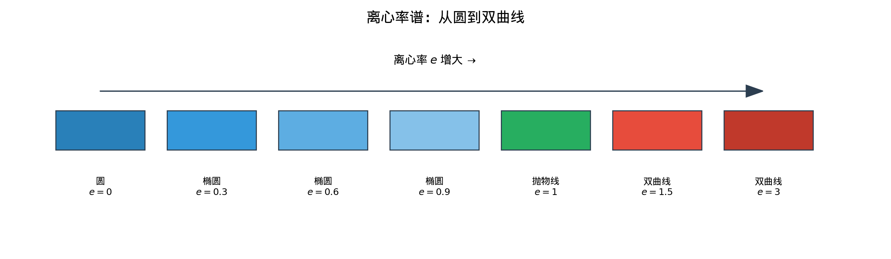
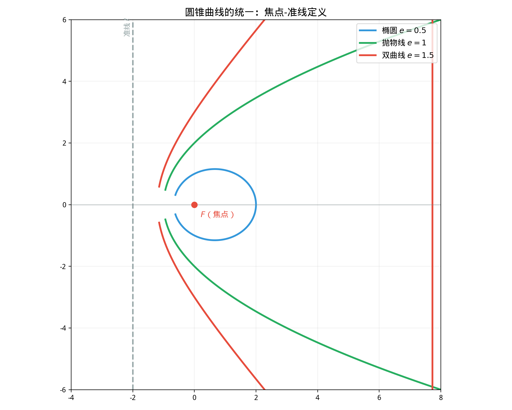

# §4 圆锥曲线的统一（Unified Theory of Conics）

**前置知识**：[§1 椭圆](01-ellipse.md)、[§2 双曲线](02-hyperbola.md)、[§3 抛物线](03-parabola.md)

**全景图**：前三节分别研究了椭圆、双曲线和抛物线。它们看起来很不同——一个封闭，一个有两支，一个开放——但它们有一个共同的来源：**圆锥面的截线**。本节建立圆锥曲线的统一理论：(1) 用**焦点-准线定义**将三种曲线统一为一个参数族（离心率 $e$），(2) 用**一般二次方程**的判别式分类所有圆锥曲线，(3) 从几何角度看圆锥面的截线。

**预估学习时间**：约 1.5–2 小时

---

## 动机

我们已经分别研究了三种圆锥曲线。一个自然的问题是：它们之间有什么**统一的联系**？它们只是恰好被叫做"圆锥曲线"的三种无关曲线，还是同一个家族的不同成员？

答案是后者——而且统一的方式极其优雅。关键参数是**离心率** $e$：一个数字就决定了曲线的"身份"。

---

## 1. 焦点-准线统一定义

### 1.1 统一定义

> **定义 1**（圆锥曲线的焦点-准线定义）
>
> 设 $F$ 是一个定点（焦点），$\ell$ 是一条不过 $F$ 的定直线（准线），$e > 0$ 是一个常数（离心率）。平面上满足
>
> $$\frac{|PF|}{d(P, \ell)} = e$$
>
> 的所有点 $P$ 的集合称为**圆锥曲线**（conic section）。

### 1.2 离心率决定曲线类型

> **定理 1**（离心率与曲线类型）
>
> - $0 < e < 1$：曲线是**椭圆**（ellipse）
> - $e = 1$：曲线是**抛物线**（parabola）
> - $e > 1$：曲线是**双曲线**（hyperbola）

### 1.3 验证椭圆

设焦点 $F(c, 0)$，准线 $x = \frac{a^2}{c}$（椭圆的准线）。对椭圆 $\frac{x^2}{a^2} + \frac{y^2}{b^2} = 1$ 上的点 $P(x_0, y_0)$：

$$|PF_2| = a - ex_0 \quad \text{（焦点半径公式）}$$

$$d(P, \ell) = \frac{a^2}{c} - x_0 = \frac{a^2 - cx_0}{c} = \frac{a(a - ex_0)}{c}$$

$$\frac{|PF_2|}{d(P, \ell)} = \frac{a - ex_0}{\frac{a(a - ex_0)}{c}} = \frac{c}{a} = e$$

✓ 验证通过。

### 1.4 验证双曲线

类似地，双曲线的准线为 $x = \frac{a^2}{c}$。焦点半径 $|PF_2| = |ex_0 - a|$，到准线距离 $d = |x_0 - \frac{a^2}{c}|$。可以验证 $\frac{|PF_2|}{d} = e$。

### 1.5 圆的情况

圆可以看作 $e = 0$ 的极限情况。当 $e \to 0$ 时，准线退到无穷远，椭圆趋于圆。但严格来说，$e = 0$ 时焦点-准线定义不直接适用（准线不存在）。

---

## 2. 离心率的几何意义

离心率 $e$ 控制着圆锥曲线的"形状"：

| $e$ 的值 | 曲线类型 | 形状特征 |
|---------|---------|---------|
| $e = 0$ | 圆 | 完美对称 |
| $0 < e < 1$ | 椭圆 | $e$ 越小越接近圆，$e$ 越大越扁 |
| $e = 1$ | 抛物线 | 开口曲线，无渐近线 |
| $e > 1$ | 双曲线 | $e$ 越大渐近线张角越大 |
| $e \to \infty$ | — | 趋近于两条直线 |

可以想象一个连续的"变形"过程：从圆开始，逐渐增大 $e$，圆先变成椭圆（越来越扁），然后在 $e = 1$ 时"打开"成抛物线，继续增大 $e$ 变成双曲线（两支越来越张开）。

---

## 3. 一般二次方程与分类

### 3.1 一般二次方程

> **定义 2**（一般二次方程）
>
> 平面上最一般的二次曲线可以用方程
>
> $$Ax^2 + Bxy + Cy^2 + Dx + Ey + F = 0$$
>
> 来描述，其中 $A$, $B$, $C$ 不全为零。

### 3.2 判别式分类

> **定理 2**（二次曲线的判别式分类）
>
> 设 $\Delta = B^2 - 4AC$。在非退化情况下（曲线不退化为点、直线或虚曲线）：
>
> - $\Delta < 0$：**椭圆**（$A = C$ 且 $B = 0$ 时为圆）
> - $\Delta = 0$：**抛物线**
> - $\Delta > 0$：**双曲线**

**直觉**：$\Delta$ 的角色类似于一元二次方程 $ax^2 + bx + c = 0$ 的判别式。不同的符号导致不同的解的类型，这里不同的符号导致不同的曲线类型。

### 3.3 验证

- **圆** $x^2 + y^2 = r^2$：$A = C = 1$，$B = 0$。$\Delta = 0 - 4 = -4 < 0$。✓ 椭圆（特殊情况：圆）。

- **椭圆** $\frac{x^2}{a^2} + \frac{y^2}{b^2} = 1$：即 $b^2x^2 + a^2y^2 - a^2b^2 = 0$。$A = b^2$，$B = 0$，$C = a^2$。$\Delta = -4a^2b^2 < 0$。✓

- **双曲线** $\frac{x^2}{a^2} - \frac{y^2}{b^2} = 1$：即 $b^2x^2 - a^2y^2 - a^2b^2 = 0$。$A = b^2$，$B = 0$，$C = -a^2$。$\Delta = 4a^2b^2 > 0$。✓

- **抛物线** $y^2 = 4px$：即 $0 \cdot x^2 + 0 \cdot xy + 1 \cdot y^2 - 4p \cdot x = 0$。$A = 0$，$B = 0$，$C = 1$。$\Delta = 0 - 0 = 0$。✓

### 3.4 退化情况

一般二次方程也可以表示以下退化曲线：
- **一个点**：例如 $x^2 + y^2 = 0$（只有原点满足）
- **一条直线**：例如 $x^2 = 0$（即 $x = 0$）
- **两条直线**：例如 $x^2 - y^2 = 0$，即 $(x-y)(x+y) = 0$
- **无实数解（虚曲线）**：例如 $x^2 + y^2 + 1 = 0$

### 3.5 消去交叉项

如果 $B \neq 0$（存在 $xy$ 交叉项），可以通过**坐标旋转**消去它。旋转角 $\theta$ 满足

$$\tan 2\theta = \frac{B}{A - C} \quad (A \neq C)$$

旋转后得到新坐标 $(x', y')$ 下没有交叉项的方程，可以用上述判别式分类。

---

## 4. 圆锥面的截线（Sections of a Cone）

### 4.1 圆锥面

> **定义 3**（圆锥面）
>
> 设有一条定直线（**轴**）和一个定角 $\alpha$（**半锥角**）。过轴上一点（**顶点**）作所有与轴成角 $\alpha$ 的直线，这些直线构成的曲面称为（双叶）**圆锥面**（cone）。

注意这是一个**双叶**圆锥面——从顶点向两个方向无限延伸。

### 4.2 用平面截圆锥

用一个平面去截圆锥面，设平面与轴的夹角为 $\beta$。截线的类型取决于 $\alpha$ 和 $\beta$ 的关系：

> **定理 3**（圆锥截线的分类）
>
> - $\beta = 90°$（平面垂直于轴）：截线是**圆**
> - $\alpha < \beta < 90°$（平面倾斜但不平行于母线）：截线是**椭圆**
> - $\beta = \alpha$（平面平行于一条母线）：截线是**抛物线**
> - $0 \leq \beta < \alpha$（平面与两叶都相交）：截线是**双曲线**

这就是"圆锥曲线"名称的来源——它们真的是圆锥面的截线！

### 4.3 与离心率的关系

$e = \frac{\cos\beta}{\cos\alpha}$（其中 $\alpha$ 是半锥角，$\beta$ 是截面与轴的夹角）。

- $\beta > \alpha \Rightarrow \cos\beta < \cos\alpha \Rightarrow e < 1$：椭圆
- $\beta = \alpha \Rightarrow e = 1$：抛物线
- $\beta < \alpha \Rightarrow e > 1$：双曲线

---

## 5. 统一视角的总结

三种圆锥曲线的对比：

| 性质 | 椭圆 | 抛物线 | 双曲线 |
|------|------|--------|--------|
| 离心率 | $0 < e < 1$ | $e = 1$ | $e > 1$ |
| 焦点数 | 2 | 1 | 2 |
| 准线数 | 2 | 1 | 2 |
| 形状 | 封闭 | 开放，一支 | 开放，两支 |
| $c^2 = $ | $a^2 - b^2$ | — | $a^2 + b^2$ |
| 渐近线 | 无 | 无 | 有（两条） |
| 判别式 $\Delta$ | $< 0$ | $= 0$ | $> 0$ |
| 截面 vs. 轴 | $\beta > \alpha$ | $\beta = \alpha$ | $\beta < \alpha$ |

所有这些差异源于一个参数——**离心率** $e$——的不同取值。这就是数学的优雅：表面上复杂的分类，深层结构却极其简单。

---

## 例题

**例题 1**：用判别式 $\Delta = B^2 - 4AC$ 判断以下方程表示的曲线类型：
(a) $2x^2 + 3y^2 - 12 = 0$
(b) $x^2 - 4y^2 - 4 = 0$
(c) $x^2 - 6x - 4y + 5 = 0$

**解**：

(a) $A = 2$, $B = 0$, $C = 3$。$\Delta = 0 - 24 = -24 < 0$。椭圆。

(b) $A = 1$, $B = 0$, $C = -4$。$\Delta = 0 + 16 = 16 > 0$。双曲线。

(c) $A = 1$, $B = 0$, $C = 0$。$\Delta = 0 - 0 = 0$。抛物线。

验证 (c)：$x^2 - 6x - 4y + 5 = 0$，$(x-3)^2 = 4y + 4$，$(x-3)^2 = 4(y+1)$。这是顶点 $(3, -1)$、开口向上的抛物线。✓

---

**例题 2**：一条圆锥曲线的焦点为 $(2, 0)$，准线为 $x = 8$，离心率 $e = \frac{1}{2}$。求方程。

**解**：$e < 1$，这是椭圆。

对于曲线上的点 $P(x, y)$：$\frac{|PF|}{d(P, \ell)} = \frac{1}{2}$。

$$\frac{\sqrt{(x-2)^2 + y^2}}{|x - 8|} = \frac{1}{2}$$

$(x-2)^2 + y^2 = \frac{1}{4}(x-8)^2$

$4(x-2)^2 + 4y^2 = (x-8)^2$

$4x^2 - 16x + 16 + 4y^2 = x^2 - 16x + 64$

$3x^2 + 4y^2 = 48$

$\frac{x^2}{16} + \frac{y^2}{12} = 1$

这是标准椭圆，$a^2 = 16$，$b^2 = 12$，$c = \sqrt{16 - 12} = 2$。焦点 $(\pm 2, 0)$。✓

---

**例题 3**：方程 $4x^2 + 4xy + y^2 + 2x - y = 0$ 表示什么类型的曲线？

**解**：$A = 4$, $B = 4$, $C = 1$。$\Delta = 16 - 16 = 0$。

$\Delta = 0$，非退化情况下应该是抛物线。

验证：$4x^2 + 4xy + y^2 = (2x + y)^2$。方程变为 $(2x + y)^2 + 2x - y = 0$。

令 $u = 2x + y$：$u^2 + 2x - y = 0$。由 $y = u - 2x$：$u^2 + 2x - (u - 2x) = 0$，$u^2 + 4x - u = 0$，$x = \frac{u - u^2}{4} = \frac{u(1-u)}{4}$。这确实是一条抛物线（旋转后的坐标系中）。

---

## 要点回顾

| 概念 | 要点 |
|------|------|
| 统一定义 | $\frac{\|PF\|}{d(P,\ell)} = e$ |
| $e < 1$ | 椭圆 |
| $e = 1$ | 抛物线 |
| $e > 1$ | 双曲线 |
| $e = 0$ | 圆（极限情况） |
| 判别式 | $\Delta = B^2 - 4AC$：$<0$ 椭圆，$=0$ 抛物线，$>0$ 双曲线 |
| 圆锥截线 | $\beta > \alpha$：椭圆；$\beta = \alpha$：抛物线；$\beta < \alpha$：双曲线 |
| 消去交叉项 | 坐标旋转角 $\theta$：$\tan 2\theta = \frac{B}{A-C}$ |

---

## 进度检查点

完成本节后，你应该能够：

- [ ] 陈述焦点-准线统一定义
- [ ] 通过离心率判断曲线类型
- [ ] 用判别式 $B^2 - 4AC$ 分类一般二次方程
- [ ] 解释圆锥曲线如何从圆锥面的截线得到
- [ ] 描述从圆到双曲线的"连续变形"过程
- [ ] 处理含有 $xy$ 交叉项的二次方程

---

## 自测题

**自测题 1**：圆锥曲线 $\frac{|PF|}{d(P, \ell)} = \frac{3}{2}$ 是什么类型的曲线？

答案

$e = \frac{3}{2} > 1$，这是**双曲线**。

**自测题 2**：方程 $5x^2 + 3y^2 - 30 = 0$ 表示什么类型的曲线？

答案

$A = 5$, $B = 0$, $C = 3$。$\Delta = 0 - 60 = -60 < 0$。椭圆。具体地：$\frac{x^2}{6} + \frac{y^2}{10} = 1$。

**自测题 3**：为什么抛物线是椭圆和双曲线之间的"分界线"？

答案

从离心率看：椭圆 $e < 1$，双曲线 $e > 1$，抛物线 $e = 1$ 恰好在分界处。从圆锥截面看：截面平行于母线时（$\beta = \alpha$）得到抛物线，这是"椭圆截面"和"双曲线截面"之间的临界位置。从判别式看：$\Delta = 0$ 是 $\Delta < 0$（椭圆）和 $\Delta > 0$（双曲线）之间的分界。

**自测题 4**：方程 $x^2 + 2xy + y^2 + x - y = 0$ 的判别式是多少？这是什么类型的曲线？

答案

$A = 1$, $B = 2$, $C = 1$。$\Delta = 4 - 4 = 0$。这是抛物线（或退化情况）。注意 $x^2 + 2xy + y^2 = (x+y)^2$，方程变为 $(x+y)^2 + (x-y) = 0$。令 $u = x+y$, $v = x-y$：$u^2 + v = 0$，即 $v = -u^2$，确实是抛物线。

---

## 习题引用

本节练习见[练习题](exercises/exercises.md)第 §4 部分。
