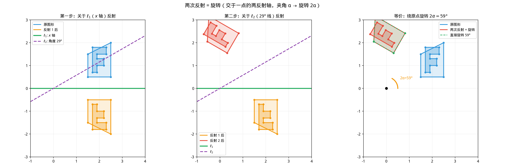
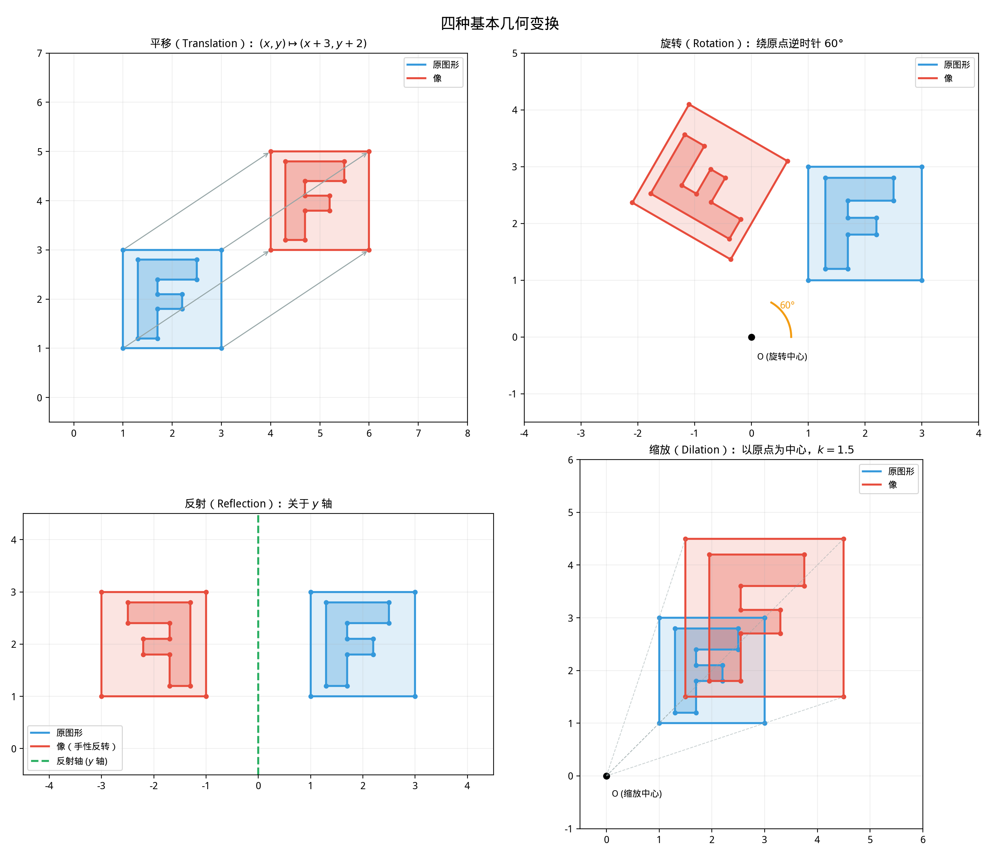

# §1 几何变换（Geometric Transformations）

**前置知识**：[Part 5 第 2 章 解析几何](../ch02-analytic/README.md)（坐标系、直线方程）、[Part 4 第 3 章 三角函数](../../part-04-functions/ch03-trigonometry/README.md)（$\sin\theta$, $\cos\theta$ 的定义与性质）

**全景图**：几何变换是将平面上的点映射到平面上的点的函数。本节系统研究四种基本变换——平移、旋转、反射、缩放——然后将它们分类为**等距变换**（保持距离不变）和**相似变换**（保持角度不变），最后探讨变换的复合及其与群论的联系。

**预估学习时间**：约 5–7 小时

---

## 动机

想象你拿着一张透明纸，上面画了一个三角形。你可以把它**平移**（滑动）、**旋转**（转动）、**翻转**（反射）、**放大或缩小**（缩放）。每一种操作都是一个几何变换。

这些变换并非孤立存在：

- 两次反射的复合等于一次旋转。
- 所有等距变换在复合下构成一个**群**——这正是 Part 3 Ch05 中群论的具体实例。
- Felix Klein 的 **Erlangen 纲领**（1872）宣称：**几何就是研究在变换群下不变的性质**——这一观点统一了整个几何学。

---

## 1. 几何变换的基本概念

> **定义 1**（几何变换）
>
> 平面上的**几何变换**（geometric transformation）是一个映射 $T: \mathbb{R}^2 \to \mathbb{R}^2$，将每个点 $P$ 映射到唯一的点 $T(P)$，称为 $P$ 的**像**（image）。

在坐标表示下，变换 $T$ 将 $(x, y)$ 映射到 $(x', y')$：

$$T: (x, y) \mapsto (x', y')$$

我们关心的核心问题：**变换保持了什么性质？改变了什么性质？**

---

## 2. 平移（Translation）

### 2.1 定义与坐标公式

> **定义 2**（平移）
>
> 给定向量 $\vec{v} = (a, b)$，**平移** $T_{\vec{v}}$ 将每个点 $(x, y)$ 移动到 $(x + a, y + b)$：
>
> $$T_{\vec{v}}: (x, y) \mapsto (x + a, y + b)$$

平移的几何含义：把整个平面沿向量 $\vec{v}$ 的方向"滑动"，每个点移动的距离和方向完全相同。

### 2.2 平移的性质

1. **保距性**：$|T_{\vec{v}}(P)T_{\vec{v}}(Q)| = |PQ|$，即任意两点间的距离不变。

   证明：设 $P = (x_1, y_1)$，$Q = (x_2, y_2)$。

   $$|T_{\vec{v}}(P)T_{\vec{v}}(Q)| = \sqrt{(x_1+a-x_2-a)^2 + (y_1+b-y_2-b)^2} = \sqrt{(x_1-x_2)^2 + (y_1-y_2)^2} = |PQ|$$

2. **保角性**：任意两条线段的夹角不变。

3. **保方向性**：图形的"手性"（左右方向）不变——平移不会把左手变成右手。

4. **无不动点**：若 $\vec{v} \neq \vec{0}$，则没有任何点满足 $T_{\vec{v}}(P) = P$（即 $(a, b) \neq (0, 0)$ 时无不动点）。

### 2.3 例题 1

> **例 1**：将三角形 $\triangle ABC$（$A(1, 2)$, $B(4, 2)$, $C(2, 5)$）沿向量 $\vec{v} = (3, -1)$ 平移。求像的顶点坐标。

**解**：

$$A' = (1+3, 2-1) = (4, 1)$$
$$B' = (4+3, 2-1) = (7, 1)$$
$$C' = (2+3, 5-1) = (5, 4)$$

可以验证：$|AB| = |A'B'| = 3$，$|AC| = |A'C'| = \sqrt{10}$，$|BC| = |B'C'| = \sqrt{13}$。距离确实保持不变。

---

## 3. 旋转（Rotation）

### 3.1 定义与坐标公式

> **定义 3**（旋转）
>
> 给定**旋转中心** $O$ 和**旋转角** $\theta$（逆时针为正），**旋转** $R_{O,\theta}$ 将每个点 $P$ 绕 $O$ 旋转 $\theta$ 角度。

当旋转中心为原点 $O = (0, 0)$ 时，旋转有简洁的矩阵形式。

### 3.2 推导旋转公式

设点 $P = (x, y)$ 的极坐标为 $(r, \alpha)$，即 $x = r\cos\alpha$，$y = r\sin\alpha$。

旋转 $\theta$ 后，$P' = (r, \alpha + \theta)$：

$$x' = r\cos(\alpha + \theta) = r(\cos\alpha\cos\theta - \sin\alpha\sin\theta) = x\cos\theta - y\sin\theta$$

$$y' = r\sin(\alpha + \theta) = r(\sin\alpha\cos\theta + \cos\alpha\sin\theta) = x\sin\theta + y\cos\theta$$

> **定理 1**（绕原点旋转的坐标公式）
>
> $$R_{O,\theta}: (x, y) \mapsto (x\cos\theta - y\sin\theta,\; x\sin\theta + y\cos\theta)$$

### 3.3 矩阵形式

上述公式可以用**矩阵乘法**简洁表示：

$$\begin{pmatrix} x' \\ y' \end{pmatrix} = \begin{pmatrix} \cos\theta & -\sin\theta \\ \sin\theta & \cos\theta \end{pmatrix} \begin{pmatrix} x \\ y \end{pmatrix}$$

记旋转矩阵为：

$$R_\theta = \begin{pmatrix} \cos\theta & -\sin\theta \\ \sin\theta & \cos\theta \end{pmatrix}$$

**特殊旋转矩阵**：

| 角度 $\theta$ | $R_\theta$ | 效果 |
|---------------|-----------|------|
| $0°$ | $\begin{pmatrix} 1 & 0 \\ 0 & 1 \end{pmatrix}$ | 恒等变换 |
| $90°$ | $\begin{pmatrix} 0 & -1 \\ 1 & 0 \end{pmatrix}$ | $(x,y) \mapsto (-y, x)$ |
| $180°$ | $\begin{pmatrix} -1 & 0 \\ 0 & -1 \end{pmatrix}$ | $(x,y) \mapsto (-x, -y)$ |
| $270°$ | $\begin{pmatrix} 0 & 1 \\ -1 & 0 \end{pmatrix}$ | $(x,y) \mapsto (y, -x)$ |

### 3.4 绕任意点旋转

若旋转中心为 $C = (h, k)$ 而非原点，三步完成：

1. **平移**使 $C$ 到原点：$(x, y) \mapsto (x - h, y - k)$
2. **绕原点旋转** $\theta$
3. **平移回来**：$(x, y) \mapsto (x + h, y + k)$

合并后：

$$x' = (x-h)\cos\theta - (y-k)\sin\theta + h$$
$$y' = (x-h)\sin\theta + (y-k)\cos\theta + k$$

### 3.5 旋转的性质

1. **保距性**：$|R(P)R(Q)| = |PQ|$（旋转矩阵是正交矩阵，$R_\theta^T R_\theta = I$）。
2. **保角性**：线段的夹角不变。
3. **保方向性**：手性不变（行列式 $\det R_\theta = \cos^2\theta + \sin^2\theta = 1 > 0$）。
4. **不动点**：旋转中心 $O$ 是唯一的不动点（当 $\theta \neq 0°$）。

### 3.6 例题 2

> **例 2**：将点 $P(3, 1)$ 绕原点逆时针旋转 $60°$。

**解**：

$$x' = 3\cos 60° - 1\sin 60° = 3 \cdot \frac{1}{2} - 1 \cdot \frac{\sqrt{3}}{2} = \frac{3 - \sqrt{3}}{2}$$

$$y' = 3\sin 60° + 1\cos 60° = 3 \cdot \frac{\sqrt{3}}{2} + 1 \cdot \frac{1}{2} = \frac{3\sqrt{3} + 1}{2}$$

$$P' = \left(\frac{3 - \sqrt{3}}{2}, \frac{3\sqrt{3} + 1}{2}\right) \approx (0.634, 3.098)$$

验证：$|OP| = \sqrt{9+1} = \sqrt{10}$，$|OP'| = \sqrt{\frac{(3-\sqrt{3})^2}{4} + \frac{(3\sqrt{3}+1)^2}{4}}$。

展开：$(3-\sqrt{3})^2 = 12 - 6\sqrt{3}$，$(3\sqrt{3}+1)^2 = 28 + 6\sqrt{3}$。和 $= 40$。$|OP'| = \sqrt{40/4} = \sqrt{10}$。✓

---

## 4. 反射（Reflection）

### 4.1 定义

> **定义 4**（反射）
>
> 关于直线 $\ell$（称为**反射轴**或**对称轴**）的**反射** $M_\ell$ 将每个点 $P$ 映射到 $P'$，使得 $\ell$ 是线段 $PP'$ 的垂直平分线。

等价地：$P'$ 是 $P$ 关于 $\ell$ 的**镜像**。

### 4.2 关于坐标轴的反射

**关于 $x$ 轴反射**：

$$M_{x}: (x, y) \mapsto (x, -y)$$

矩阵形式：$\begin{pmatrix} 1 & 0 \\ 0 & -1 \end{pmatrix}$

**关于 $y$ 轴反射**：

$$M_{y}: (x, y) \mapsto (-x, y)$$

矩阵形式：$\begin{pmatrix} -1 & 0 \\ 0 & 1 \end{pmatrix}$

### 4.3 关于直线 $y = x$ 的反射

$$M_{y=x}: (x, y) \mapsto (y, x)$$

矩阵形式：$\begin{pmatrix} 0 & 1 \\ 1 & 0 \end{pmatrix}$

**几何意义**：交换坐标——这正是为什么函数 $f$ 与其反函数 $f^{-1}$ 的图像关于 $y = x$ 对称（参见 Part 4 Ch01）。

### 4.4 关于过原点的任意直线的反射

设反射轴为过原点且与 $x$ 轴正方向夹角为 $\alpha$ 的直线。

> **定理 2**（关于过原点直线的反射矩阵）
>
> $$M_\alpha = \begin{pmatrix} \cos 2\alpha & \sin 2\alpha \\ \sin 2\alpha & -\cos 2\alpha \end{pmatrix}$$

**推导**：可以将反射分解为三步：
1. 旋转 $-\alpha$（使反射轴与 $x$ 轴重合）
2. 关于 $x$ 轴反射
3. 旋转 $\alpha$（旋转回来）

$$M_\alpha = R_\alpha \begin{pmatrix} 1 & 0 \\ 0 & -1 \end{pmatrix} R_{-\alpha}$$

计算：

$$R_\alpha \begin{pmatrix} 1 & 0 \\ 0 & -1 \end{pmatrix} R_{-\alpha} = \begin{pmatrix} \cos\alpha & -\sin\alpha \\ \sin\alpha & \cos\alpha \end{pmatrix} \begin{pmatrix} 1 & 0 \\ 0 & -1 \end{pmatrix} \begin{pmatrix} \cos\alpha & \sin\alpha \\ -\sin\alpha & \cos\alpha \end{pmatrix}$$

$$= \begin{pmatrix} \cos\alpha & \sin\alpha \\ \sin\alpha & -\cos\alpha \end{pmatrix} \begin{pmatrix} \cos\alpha & \sin\alpha \\ -\sin\alpha & \cos\alpha \end{pmatrix}$$

$$= \begin{pmatrix} \cos^2\alpha - \sin^2\alpha & 2\sin\alpha\cos\alpha \\ 2\sin\alpha\cos\alpha & \sin^2\alpha - \cos^2\alpha \end{pmatrix} = \begin{pmatrix} \cos 2\alpha & \sin 2\alpha \\ \sin 2\alpha & -\cos 2\alpha \end{pmatrix}$$

**验证特殊情形**：

- $\alpha = 0$（$x$ 轴）：$M_0 = \begin{pmatrix} 1 & 0 \\ 0 & -1 \end{pmatrix}$ ✓
- $\alpha = \frac{\pi}{2}$（$y$ 轴）：$M_{\pi/2} = \begin{pmatrix} -1 & 0 \\ 0 & 1 \end{pmatrix}$ ✓
- $\alpha = \frac{\pi}{4}$（$y = x$）：$M_{\pi/4} = \begin{pmatrix} 0 & 1 \\ 1 & 0 \end{pmatrix}$ ✓

### 4.5 反射的性质

1. **保距性**：$|M(P)M(Q)| = |PQ|$。
2. **保角性**：线段夹角的大小不变。
3. **⚠️ 反转方向**：手性改变！左手变成右手。行列式 $\det M_\alpha = -\cos^2 2\alpha - \sin^2 2\alpha = -1 < 0$。
4. **不动点**：反射轴上的所有点都是不动点。
5. **自逆性**：$M_\ell \circ M_\ell = \text{id}$（反射两次回到原位），即 $M_\ell^2 = I$。

### 4.6 例题 3

> **例 3**：求点 $P(3, 5)$ 关于直线 $y = 2x$ 的反射像。

**解**：直线 $y = 2x$ 与 $x$ 轴的夹角 $\alpha = \arctan 2$。

$$\cos\alpha = \frac{1}{\sqrt{5}}, \quad \sin\alpha = \frac{2}{\sqrt{5}}$$

$$\cos 2\alpha = \cos^2\alpha - \sin^2\alpha = \frac{1}{5} - \frac{4}{5} = -\frac{3}{5}$$

$$\sin 2\alpha = 2\sin\alpha\cos\alpha = \frac{4}{5}$$

$$x' = x\cos 2\alpha + y\sin 2\alpha = 3 \cdot \left(-\frac{3}{5}\right) + 5 \cdot \frac{4}{5} = -\frac{9}{5} + \frac{20}{5} = \frac{11}{5}$$

$$y' = x\sin 2\alpha - y\cos 2\alpha = 3 \cdot \frac{4}{5} - 5 \cdot \left(-\frac{3}{5}\right) = \frac{12}{5} + \frac{15}{5} = \frac{27}{5}$$

$$P' = \left(\frac{11}{5}, \frac{27}{5}\right)$$

验证：$PP'$ 的中点 $= \left(\frac{3 + 11/5}{2}, \frac{5 + 27/5}{2}\right) = \left(\frac{26/5}{2}, \frac{52/5}{2}\right) = \left(\frac{13}{5}, \frac{26}{5}\right)$。

检查中点是否在 $y = 2x$ 上：$\frac{26}{5} = 2 \cdot \frac{13}{5}$ ✓

检查 $PP'$ 是否垂直于 $y = 2x$：$PP'$ 的斜率 $= \frac{27/5 - 5}{11/5 - 3} = \frac{2/5}{-4/5} = -\frac{1}{2}$。与 $y = 2x$ 的斜率 $2$ 的乘积 $= 2 \times (-\frac{1}{2}) = -1$。✓

---

## 5. 缩放（Dilation / Scaling）

### 5.1 定义与坐标公式

> **定义 5**（缩放）
>
> 以 $O$ 为**缩放中心**、$k$（$k > 0$, $k \neq 1$）为**缩放因子**（scale factor）的**缩放** $D_{O,k}$ 将每个点 $P$ 映射到 $P'$，使得：
>
> $$\overrightarrow{OP'} = k \cdot \overrightarrow{OP}$$

当缩放中心为原点时：

$$D_{O,k}: (x, y) \mapsto (kx, ky)$$

矩阵形式：$\begin{pmatrix} k & 0 \\ 0 & k \end{pmatrix} = kI$

- $k > 1$：放大
- $0 < k < 1$：缩小
- $k = 1$：恒等变换

### 5.2 非均匀缩放

更一般地，可以在 $x$ 和 $y$ 方向使用不同的缩放因子：

$$D_{k_1, k_2}: (x, y) \mapsto (k_1 x, k_2 y)$$

矩阵形式：$\begin{pmatrix} k_1 & 0 \\ 0 & k_2 \end{pmatrix}$

当 $k_1 \neq k_2$ 时，非均匀缩放**不保角**。例如，将圆 $x^2 + y^2 = 1$ 变为椭圆 $\frac{x^2}{k_1^2} + \frac{y^2}{k_2^2} = 1$。

### 5.3 缩放的性质

1. **不保距**（当 $k \neq 1$）：距离乘以 $k$，即 $|D(P)D(Q)| = k \cdot |PQ|$。
2. **保角性**（均匀缩放）：角度不变。
3. **面积**变为 $k^2$ 倍。
4. **不动点**：缩放中心 $O$ 是唯一的不动点。

### 5.4 绕任意点缩放

以 $C = (h, k)$ 为中心、因子为 $r$ 的缩放：

$$x' = h + r(x - h) = rx + h(1 - r)$$
$$y' = k + r(y - k) = ry + k(1 - r)$$

### 5.5 例题 4

> **例 4**：以 $C(1, 2)$ 为中心、缩放因子 $k = 2$ 对三角形 $\triangle PQR$（$P(2, 3)$, $Q(4, 3)$, $R(3, 5)$）进行缩放。

**解**：

$$P' = (1 + 2(2-1),\; 2 + 2(3-2)) = (3, 4)$$
$$Q' = (1 + 2(4-1),\; 2 + 2(3-2)) = (7, 4)$$
$$R' = (1 + 2(3-1),\; 2 + 2(5-2)) = (5, 8)$$

$\triangle PQR$ 的边长：$|PQ| = 2$, $|PR| = \sqrt{1+4} = \sqrt{5}$, $|QR| = \sqrt{1+4} = \sqrt{5}$。

$\triangle P'Q'R'$ 的边长：$|P'Q'| = 4$, $|P'R'| = \sqrt{4+16} = 2\sqrt{5}$, $|Q'R'| = \sqrt{4+16} = 2\sqrt{5}$。

每条边都变为原来的 $2$ 倍。✓

---

## 6. 等距变换（Isometry）

### 6.1 定义

> **定义 6**（等距变换）
>
> 如果变换 $T$ 保持任意两点间的距离，即对所有点 $P$, $Q$：
>
> $$|T(P)T(Q)| = |PQ|$$
>
> 则称 $T$ 为**等距变换**（isometry），也叫**合同变换**或**刚体运动**。

等距变换保持图形的"形状和大小"——就像把一块刚性的拼板在桌面上移动。

### 6.2 等距变换的分类定理

> **定理 3**（等距变换分类）
>
> 平面上的等距变换恰好有以下四种：
>
> 1. **平移**（translation）
> 2. **旋转**（rotation）
> 3. **反射**（reflection）
> 4. **滑移反射**（glide reflection）

**滑移反射**是先沿某条直线 $\ell$ 方向平移，再关于 $\ell$ 反射（或反过来——因为这两个操作关于 $\ell$ 是可交换的）。

### 6.3 保向与反向

等距变换可按是否保持方向分为两类：

| 类型 | 保持方向？ | 行列式 | 不动点 |
|------|----------|--------|--------|
| 平移 | 是 | $+1$ | 无（$\vec{v} \neq \vec{0}$） |
| 旋转 | 是 | $+1$ | 旋转中心（1 个） |
| 反射 | 否 | $-1$ | 反射轴上所有点 |
| 滑移反射 | 否 | $-1$ | 无 |

**保向等距变换**（$\det = +1$）：平移 + 旋转，合称为**正等距变换**。

**反向等距变换**（$\det = -1$）：反射 + 滑移反射，合称为**负等距变换**。

### 6.4 等距变换保持的性质

等距变换保持：
- 距离
- 角度
- 面积
- 平行性
- 直线的直性（直线映射为直线）

一句话总结：**等距变换保持一切"度量性质"。**

### 6.5 例题 5

> **例 5**：判断以下变换是什么类型的等距变换。
>
> (a) $(x, y) \mapsto (-x, -y)$
>
> (b) $(x, y) \mapsto (-y, x)$
>
> (c) $(x, y) \mapsto (-x + 2, y)$

**解**：

**(a)** 矩阵为 $\begin{pmatrix} -1 & 0 \\ 0 & -1 \end{pmatrix} = -I$。$\det = 1 > 0$（保向）。不动点 $(0,0)$。这是**绕原点旋转 $180°$**。

**(b)** 矩阵为 $\begin{pmatrix} 0 & -1 \\ 1 & 0 \end{pmatrix}$。$\det = 1 > 0$（保向）。不动点 $(0,0)$。这是**绕原点逆时针旋转 $90°$**。

**(c)** $(x, y) \mapsto (-x + 2, y)$。可以写为先关于 $y$ 轴反射（$(x,y) \mapsto (-x, y)$），再沿 $x$ 方向平移 $2$。等价于**关于直线 $x = 1$ 的反射**。

验证：$x = 1$ 上的点 $(1, y)$ 映射到 $(-1+2, y) = (1, y)$（不动）。✓

---

## 7. 相似变换（Similarity Transformation）

### 7.1 定义

> **定义 7**（相似变换）
>
> 如果变换 $T$ 存在正常数 $k$，使得对所有点 $P$, $Q$：
>
> $$|T(P)T(Q)| = k \cdot |PQ|$$
>
> 则称 $T$ 为**相似变换**（similarity transformation），$k$ 为**相似比**。

- $k = 1$ 时，相似变换就是等距变换。
- 相似变换保持**角度**（因此保持形状），但按 $k$ 的比例改变距离。

### 7.2 相似变换的结构

> **定理 4**
>
> 每个相似变换都可以写成一个**缩放**和一个**等距变换**的复合：
>
> $$S = D_{O,k} \circ T$$
>
> 其中 $T$ 是等距变换，$D_{O,k}$ 是以某点为中心的缩放。

### 7.3 相似变换保持的性质

相似变换保持：
- **角度**（因此保持形状）
- **平行性**
- **直线性**（直线映射为直线）
- **面积比**（面积乘以 $k^2$）

相似变换**不保持**：
- **距离**（除非 $k = 1$）
- **面积**（除非 $k = 1$）

### 7.4 相似与几何中的相似形

Part 5 Ch01 中的三角形相似（AA, SAS, SSS 相似判定）就可以用相似变换来理解：

> 两个三角形相似 $\iff$ 存在一个相似变换将一个映射到另一个。

这把"形状相同但大小不同"的直觉精确化了。

---

## 8. 变换的复合（Composition of Transformations）

### 8.1 基本概念

两个变换 $S$ 和 $T$ 的**复合** $S \circ T$ 定义为：先做 $T$，再做 $S$：

$$(S \circ T)(P) = S(T(P))$$

> **⚠️ 顺序很重要！** 一般来说 $S \circ T \neq T \circ S$。

### 8.2 两次反射 = 旋转

这是变换几何中最美的定理之一：

> **定理 5**（两次反射定理）
>
> (a) 关于两条**平行线** $\ell_1$, $\ell_2$（间距 $d$）的反射的复合 $M_{\ell_2} \circ M_{\ell_1}$ 是沿 $\ell_1$ 到 $\ell_2$ 方向的**平移**，距离 $2d$。
>
> (b) 关于两条**相交线** $\ell_1$, $\ell_2$（交于 $O$，夹角 $\alpha$）的反射的复合 $M_{\ell_2} \circ M_{\ell_1}$ 是绕 $O$ 的**旋转**，角度 $2\alpha$。

**证明 (b) 的概要**：

设 $\ell_1$ 与 $x$ 轴夹角为 $\beta$，$\ell_2$ 与 $x$ 轴夹角为 $\beta + \alpha$。

$$M_{\ell_2} \circ M_{\ell_1} = M_{\beta+\alpha} \circ M_\beta$$

用矩阵计算：

$$M_{\beta+\alpha} M_\beta = \begin{pmatrix} \cos 2(\beta+\alpha) & \sin 2(\beta+\alpha) \\ \sin 2(\beta+\alpha) & -\cos 2(\beta+\alpha) \end{pmatrix} \begin{pmatrix} \cos 2\beta & \sin 2\beta \\ \sin 2\beta & -\cos 2\beta \end{pmatrix}$$

利用三角恒等式，乘积为：

$$\begin{pmatrix} \cos 2\alpha & -\sin 2\alpha \\ \sin 2\alpha & \cos 2\alpha \end{pmatrix} = R_{2\alpha}$$

这就是绕原点旋转 $2\alpha$。$\blacksquare$

### 8.3 复合的矩阵表示

如果变换 $T_1$ 的矩阵是 $A_1$，$T_2$ 的矩阵是 $A_2$，则复合 $T_2 \circ T_1$ 的矩阵是 $A_2 A_1$（矩阵乘法）。

注意顺序：**先做的变换在右边**。

### 8.4 例题 6

> **例 6**：先关于 $x$ 轴反射，再绕原点旋转 $90°$。求复合变换的公式和矩阵。

**解**：

$x$ 轴反射：$M_x = \begin{pmatrix} 1 & 0 \\ 0 & -1 \end{pmatrix}$

旋转 $90°$：$R_{90°} = \begin{pmatrix} 0 & -1 \\ 1 & 0 \end{pmatrix}$

复合（先反射再旋转）：

$$R_{90°} M_x = \begin{pmatrix} 0 & -1 \\ 1 & 0 \end{pmatrix} \begin{pmatrix} 1 & 0 \\ 0 & -1 \end{pmatrix} = \begin{pmatrix} 0 & 1 \\ 1 & 0 \end{pmatrix}$$

这就是关于 $y = x$ 的反射！

**对比**：先旋转再反射：

$$M_x R_{90°} = \begin{pmatrix} 1 & 0 \\ 0 & -1 \end{pmatrix} \begin{pmatrix} 0 & -1 \\ 1 & 0 \end{pmatrix} = \begin{pmatrix} 0 & -1 \\ -1 & 0 \end{pmatrix}$$

这是关于 $y = -x$ 的反射——**结果不同！** 顺序确实很重要。

### 8.5 例题 7

> **例 7**：证明三次旋转 $R_{120°} \circ R_{120°} \circ R_{120°} = \text{id}$（恒等变换）。

**解**：

$$R_{120°}^3 = R_{360°} = R_0 = I$$

$$\begin{pmatrix} \cos 120° & -\sin 120° \\ \sin 120° & \cos 120° \end{pmatrix}^3 = \begin{pmatrix} -\frac{1}{2} & -\frac{\sqrt{3}}{2} \\ \frac{\sqrt{3}}{2} & -\frac{1}{2} \end{pmatrix}^3 = \begin{pmatrix} 1 & 0 \\ 0 & 1 \end{pmatrix}$$

这正是旋转的周期性：旋转 $360°$ 回到原点。

---

## 9. 变换群与 Erlangen 纲领（Transformation Groups）

### 9.1 变换在复合下构成群

回顾 [Part 3 第 5 章](../../part-03-algebra/ch05-abstract/README.md) 群的四条公理。平面等距变换集合在复合运算 $\circ$ 下满足：

1. **封闭性**：两个等距变换的复合仍是等距变换。
2. **结合律**：$(T_1 \circ T_2) \circ T_3 = T_1 \circ (T_2 \circ T_3)$。
3. **单位元**：恒等变换 $\text{id}(P) = P$ 是单位元。
4. **逆元**：每个等距变换都有逆变换（平移的逆是反方向平移，旋转的逆是反方向旋转，反射自身就是逆）。

> **定理 6**
>
> 平面等距变换集合在复合运算下构成一个群，称为**欧氏群**（Euclidean group），记作 $E(2)$。

类似地：
- 旋转群 $SO(2)$：所有绕原点旋转的集合。
- 相似变换群：所有相似变换的集合。
- 正三角形的对称群 $D_3$：$3$ 次旋转 + $3$ 次反射，共 $6$ 个元素（即 Part 3 Ch05 中的二面体群）。

### 9.2 Klein 的 Erlangen 纲领

> **核心思想**（Erlangen Programme, 1872）
>
> 每一种几何都对应一个变换群 $G$。该几何研究的是在 $G$ 的作用下**不变**的性质。

| 几何 | 变换群 | 不变量 |
|------|--------|--------|
| 欧氏几何 | 等距变换群 $E(2)$ | 距离、角度、面积 |
| 相似几何 | 相似变换群 | 角度、形状比例 |
| 仿射几何 | 仿射变换群 | 平行性、面积比 |
| 射影几何 | 射影变换群 | 共线性、交比 |

变换群越大，保持的不变量越少，但理论越"粗犷"。射影几何中直线可以"弯"成曲线吗？不能——但平行线可以相交（在无穷远点）。这是一个比欧氏几何更"宽广"的几何世界。

### 9.3 对称性的精确定义

用变换语言，可以精确定义"对称"：

> **定义 8**
>
> 图形 $\mathcal{F}$ 的一个**对称变换**（symmetry）是使 $\mathcal{F}$ 保持不变的等距变换。$\mathcal{F}$ 的所有对称变换构成一个群，称为 $\mathcal{F}$ 的**对称群**。

| 图形 | 对称群 | 阶（元素个数） |
|------|--------|-------------|
| 等边三角形 | $D_3$ | 6 |
| 正方形 | $D_4$ | 8 |
| 正 $n$ 边形 | $D_n$ | $2n$ |
| 圆 | $O(2)$ | 无穷 |

### 9.4 例题 8

> **例 8**：列出正方形的所有对称变换。

**解**：

设正方形的顶点为 $A(1,1)$, $B(-1,1)$, $C(-1,-1)$, $D(1,-1)$。

**旋转**（4 个）：
- $R_0 = \text{id}$（$0°$）
- $R_{90°}$（逆时针 $90°$）
- $R_{180°}$
- $R_{270°}$

**反射**（4 个）：
- $M_x$：关于 $x$ 轴
- $M_y$：关于 $y$ 轴
- $M_{y=x}$：关于 $y = x$
- $M_{y=-x}$：关于 $y = -x$

共 $8$ 个元素，构成**二面体群** $D_4$。

---

## 10. 仿射变换（Affine Transformation）简介

仿射变换是更一般的线性变换加上平移：

$$T: \begin{pmatrix} x \\ y \end{pmatrix} \mapsto A\begin{pmatrix} x \\ y \end{pmatrix} + \begin{pmatrix} t_1 \\ t_2 \end{pmatrix}$$

其中 $A$ 是 $2 \times 2$ 可逆矩阵。

仿射变换保持：
- **直线的直性**
- **平行性**（平行线映射为平行线）
- **比例**（线段上的分割比）

但**不一定保持距离或角度**。

等距变换和相似变换都是仿射变换的特殊情形。

---

## 要点回顾

| 变换 | 坐标公式（中心为原点） | 矩阵 | 保距？ | 保角？ | 保向？ |
|------|----------------------|------|--------|--------|--------|
| 平移 $\vec{v}=(a,b)$ | $(x+a, y+b)$ | 无（需齐次坐标） | ✓ | ✓ | ✓ |
| 旋转 $\theta$ | $(x\cos\theta-y\sin\theta, x\sin\theta+y\cos\theta)$ | $R_\theta$ | ✓ | ✓ | ✓ |
| 反射（过原点线 $\alpha$） | $(x\cos 2\alpha+y\sin 2\alpha, x\sin 2\alpha-y\cos 2\alpha)$ | $M_\alpha$ | ✓ | ✓ | ✗ |
| 缩放 $k$ | $(kx, ky)$ | $kI$ | ✗ | ✓ | ✓ |

**核心定理**：
1. 等距变换分类：平移、旋转、反射、滑移反射（共四种）。
2. 两次反射定理：平行线反射 = 平移，相交线反射 = 旋转。
3. 等距变换在复合下构成欧氏群 $E(2)$。
4. Klein 的 Erlangen 纲领：几何 = 变换群下的不变量。

---

## 进度检查点

完成本节后，请确认你可以：

- [ ] 写出平移、旋转、反射、缩放的坐标公式
- [ ] 写出旋转矩阵和反射矩阵
- [ ] 推导关于任意过原点直线的反射矩阵
- [ ] 计算两个变换的复合矩阵
- [ ] 解释为什么两次反射等于旋转（或平移）
- [ ] 说出等距变换的四种类型
- [ ] 理解变换群和 Erlangen 纲领的核心思想
- [ ] 列出正多边形的对称群元素

---

## 自测题

**1.** 将点 $(4, -2)$ 绕原点逆时针旋转 $90°$，像的坐标是什么？

答案

$(x', y') = (4\cos 90° - (-2)\sin 90°, 4\sin 90° + (-2)\cos 90°) = (0 + 2, 4 + 0) = (2, 4)$。

**2.** 关于 $y$ 轴反射后再关于 $x$ 轴反射，等价于什么变换？

答案

$M_x \circ M_y: (x,y) \mapsto (-x, y) \mapsto (-x, -y)$。这是绕原点旋转 $180°$。

矩阵验证：$\begin{pmatrix} 1 & 0 \\ 0 & -1 \end{pmatrix}\begin{pmatrix} -1 & 0 \\ 0 & 1 \end{pmatrix} = \begin{pmatrix} -1 & 0 \\ 0 & -1 \end{pmatrix} = R_{180°}$。✓

两条反射轴互相垂直（夹角 $90°$），因此复合是旋转 $2 \times 90° = 180°$。

**3.** 矩阵 $\begin{pmatrix} 0 & 1 \\ 1 & 0 \end{pmatrix}$ 代表什么几何变换？它是等距变换吗？保向吗？

答案

这是关于直线 $y = x$ 的反射。$\det = -1$，所以是等距变换但不保向。

验证：$\alpha = 45°$，$M_{45°} = \begin{pmatrix} \cos 90° & \sin 90° \\ \sin 90° & -\cos 90° \end{pmatrix} = \begin{pmatrix} 0 & 1 \\ 1 & 0 \end{pmatrix}$。✓

**4.** 以 $(2, 3)$ 为中心、缩放因子 $k = 3$ 缩放点 $(5, 1)$。像是什么？

答案

$x' = 2 + 3(5 - 2) = 2 + 9 = 11$，$y' = 3 + 3(1 - 3) = 3 - 6 = -3$。像为 $(11, -3)$。

**5.** 正六边形有多少个对称变换？它的对称群是什么？

答案

正六边形有 $6$ 次旋转（$0°, 60°, 120°, 180°, 240°, 300°$）和 $6$ 次反射（3 条对角线 + 3 条对边中点连线），共 $12$ 个对称变换。对称群为二面体群 $D_6$，阶为 $12$。

**6.** 设 $T_1$ 是沿 $(3, 0)$ 平移，$T_2$ 是关于 $y$ 轴反射。$T_1 \circ T_2$ 和 $T_2 \circ T_1$ 分别是什么？

答案

$T_1 \circ T_2: (x, y) \mapsto (-x, y) \mapsto (-x+3, y)$。这是关于 $x = \frac{3}{2}$ 的反射。

$T_2 \circ T_1: (x, y) \mapsto (x+3, y) \mapsto (-(x+3), y) = (-x-3, y)$。这是关于 $x = -\frac{3}{2}$ 的反射。

结果不同！这说明平移和反射一般不可交换。

---

## 习题引用

更多练习请见 [练习题](exercises/exercises.md) 和 [挑战题](exercises/challenge.md)。
