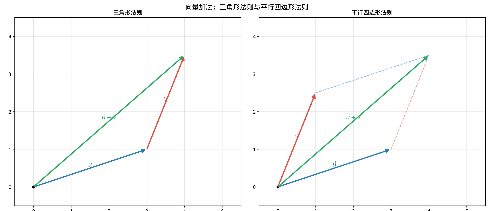

# §1 向量基础（Vector Basics）

**前置知识**：[Part 5 第 2 章 解析几何](../ch02-analytic/README.md)（坐标系、距离公式）、[Part 2 第 1 章 数系](../../part-02-numbers/ch01-number-systems/README.md)（实数运算）

**全景图**：向量（vector）是同时具有**大小**（magnitude）和**方向**（direction）的量。本节从向量的直觉出发，建立向量加法、标量乘法和线性组合的概念，然后引入坐标表示，为后续的点积和叉积做准备。

**预估学习时间**：约 1.5–2 小时

---

## 动机

在日常生活中，有些量只需要一个数字就能完全描述——温度、质量、时间——这些叫做**标量**（scalar）。但有些量既有大小又有方向——速度、力、位移——单独一个数字不够，需要同时说明"多大"和"朝哪个方向"。这就是**向量**。

你推一辆购物车：推力的大小（10 牛顿）和方向（向前）共同决定了效果。如果方向相同，两个力相加；如果方向相反，相互抵消。向量的运算就是对"有方向的量"的运算。

---

## 1. 向量的定义

### 1.1 几何向量

> **定义 1**（向量）
>
> **向量**（vector）是一个具有**大小**和**方向**的量。几何上用一条**有向线段**（directed line segment）表示：从起点 $A$ 到终点 $B$ 的箭头，记为 $\overrightarrow{AB}$ 或粗体 $\mathbf{v}$（手写时常用 $\vec{v}$）。

- **大小**（模，magnitude）：$|\overrightarrow{AB}|$ 或 $|\vec{v}|$，就是线段 $AB$ 的长度。
- **方向**：从 $A$ 到 $B$ 的方向。

> **定义 2**（标量）
>
> **标量**（scalar）是只有大小而无方向的量——就是一个实数。

### 1.2 相等向量

> **定义 3**（向量相等）
>
> 两个向量 $\vec{u}$ 和 $\vec{v}$ **相等**，当且仅当它们具有**相同的大小和方向**。

注意：位置不重要！只要大小和方向相同，无论起点在哪，两个向量就是相等的。

### 1.3 自由向量与位置向量

- **自由向量**（free vector）：可以自由平移的向量——只关心大小和方向，不关心起点位置。物理中的力、速度通常视为自由向量。
- **位置向量**（position vector）：起点固定在原点 $O$ 的向量。点 $P(x, y)$ 的位置向量就是 $\overrightarrow{OP}$。

### 1.4 特殊向量

- **零向量**（zero vector）：$\vec{0}$，大小为 $0$，方向未定义。
- **单位向量**（unit vector）：大小为 $1$ 的向量。给定非零向量 $\vec{v}$，其对应的单位向量为 $\hat{v} = \frac{\vec{v}}{|\vec{v}|}$。

---

## 2. 向量加法

### 2.1 三角形法则（Triangle Rule）

将第二个向量的起点放在第一个向量的终点，从第一个向量的起点到第二个向量的终点画箭头——这就是和向量。

$$\vec{u} + \vec{v}: \text{将 } \vec{v} \text{ 的起点接在 } \vec{u} \text{ 的终点}$$

### 2.2 平行四边形法则（Parallelogram Rule）

将两个向量的起点放在同一点，以它们为邻边构成平行四边形，对角线（从共同起点出发）就是和向量。

### 2.3 向量减法

$$\vec{u} - \vec{v} = \vec{u} + (-\vec{v})$$

其中 $-\vec{v}$ 是 $\vec{v}$ 的**反向量**——方向相反、大小相同。

几何意义：$\vec{u} - \vec{v}$ 是从 $\vec{v}$ 的终点到 $\vec{u}$ 的终点的向量（当两者起点相同时）。

### 2.4 向量加法的性质

设 $\vec{u}$, $\vec{v}$, $\vec{w}$ 为任意向量：

| 性质 | 公式 |
|------|------|
| 交换律（commutative） | $\vec{u} + \vec{v} = \vec{v} + \vec{u}$ |
| 结合律（associative） | $(\vec{u} + \vec{v}) + \vec{w} = \vec{u} + (\vec{v} + \vec{w})$ |
| 零向量（identity） | $\vec{u} + \vec{0} = \vec{u}$ |
| 逆元（inverse） | $\vec{u} + (-\vec{u}) = \vec{0}$ |

> 向量加法满足加法群的所有公理——向量集合在加法下构成一个**阿贝尔群**（回顾 Part 3 Ch05）。

### 2.5 例题 1

> **例 1**：$\vec{u} = \overrightarrow{AB}$，$\vec{v} = \overrightarrow{BC}$，$\vec{w} = \overrightarrow{CD}$。用 $\vec{u}$, $\vec{v}$, $\vec{w}$ 表示 $\overrightarrow{AD}$。

**解**：

$$\overrightarrow{AD} = \overrightarrow{AB} + \overrightarrow{BC} + \overrightarrow{CD} = \vec{u} + \vec{v} + \vec{w}$$

这就是向量加法的"首尾相接"性质。

---

## 3. 标量乘法（Scalar Multiplication）

### 3.1 定义

> **定义 4**（标量乘法）
>
> 给定标量 $c \in \mathbb{R}$ 和向量 $\vec{v}$，**标量乘法** $c\vec{v}$ 的定义为：
>
> - $|c\vec{v}| = |c| \cdot |\vec{v}|$（大小乘以 $|c|$）
> - 方向：$c > 0$ 时同向，$c < 0$ 时反向，$c = 0$ 时为零向量

### 3.2 标量乘法的性质

| 性质 | 公式 |
|------|------|
| 标量分配律 | $c(\vec{u} + \vec{v}) = c\vec{u} + c\vec{v}$ |
| 向量分配律 | $(c + d)\vec{v} = c\vec{v} + d\vec{v}$ |
| 结合律 | $c(d\vec{v}) = (cd)\vec{v}$ |
| 单位元 | $1 \cdot \vec{v} = \vec{v}$ |

### 3.3 平行向量

> **命题 1**
>
> 两个非零向量 $\vec{u}$ 和 $\vec{v}$ **平行**（parallel）当且仅当存在标量 $c \neq 0$ 使得 $\vec{u} = c\vec{v}$。
>
> - $c > 0$：同向
> - $c < 0$：反向

---

## 4. 线性组合（Linear Combination）

### 4.1 定义

> **定义 5**（线性组合）
>
> 给定向量 $\vec{v}_1, \vec{v}_2, \ldots, \vec{v}_n$ 和标量 $a_1, a_2, \ldots, a_n$，称
>
> $$a_1\vec{v}_1 + a_2\vec{v}_2 + \cdots + a_n\vec{v}_n$$
>
> 为 $\vec{v}_1, \ldots, \vec{v}_n$ 的一个**线性组合**（linear combination）。

### 4.2 张成（Spanning）

> **定义 6**
>
> 两个不平行的向量 $\vec{u}$, $\vec{v}$ 可以**张成**（span）整个二维平面：平面上的任意向量 $\vec{w}$ 都可以唯一地表示为 $\vec{w} = a\vec{u} + b\vec{v}$。

这个想法是 Part 9（线性代数）中**基**（basis）概念的先声。

### 4.3 例题 2

> **例 2**：设 $\vec{u} = (1, 0)$, $\vec{v} = (0, 1)$。将 $\vec{w} = (3, -2)$ 表示为 $\vec{u}$ 和 $\vec{v}$ 的线性组合。

**解**：

$$\vec{w} = 3\vec{u} + (-2)\vec{v} = 3(1, 0) + (-2)(0, 1) = (3, 0) + (0, -2) = (3, -2)$$

---

## 5. 坐标表示

### 5.1 二维坐标

在二维坐标系中，向量 $\vec{v}$ 可以用其分量（components）表示：

$$\vec{v} = (v_1, v_2) = v_1\vec{i} + v_2\vec{j}$$

其中 $\vec{i} = (1, 0)$ 和 $\vec{j} = (0, 1)$ 是 $x$ 方向和 $y$ 方向的**标准基向量**（standard basis vectors）。

### 5.2 三维坐标

在三维空间中：

$$\vec{v} = (v_1, v_2, v_3) = v_1\vec{i} + v_2\vec{j} + v_3\vec{k}$$

其中 $\vec{i} = (1, 0, 0)$，$\vec{j} = (0, 1, 0)$，$\vec{k} = (0, 0, 1)$。

### 5.3 坐标运算

设 $\vec{u} = (u_1, u_2, u_3)$，$\vec{v} = (v_1, v_2, v_3)$：

$$\vec{u} + \vec{v} = (u_1 + v_1, u_2 + v_2, u_3 + v_3)$$

$$c\vec{u} = (cu_1, cu_2, cu_3)$$

$$\vec{u} - \vec{v} = (u_1 - v_1, u_2 - v_2, u_3 - v_3)$$

### 5.4 用坐标表示有向线段

如果 $A = (a_1, a_2, a_3)$，$B = (b_1, b_2, b_3)$，则：

$$\overrightarrow{AB} = B - A = (b_1 - a_1, b_2 - a_2, b_3 - a_3)$$

### 5.5 例题 3

> **例 3**：设 $A(1, 2, -1)$, $B(3, 0, 4)$, $C(2, 1, 1)$。
>
> (a) 求 $\overrightarrow{AB}$ 和 $\overrightarrow{AC}$。
>
> (b) 求 $2\overrightarrow{AB} - 3\overrightarrow{AC}$。
>
> (c) 三角形 $ABC$ 的重心坐标。

**解**：

**(a)** $\overrightarrow{AB} = (3-1, 0-2, 4-(-1)) = (2, -2, 5)$

$\overrightarrow{AC} = (2-1, 1-2, 1-(-1)) = (1, -1, 2)$

**(b)** $2\overrightarrow{AB} - 3\overrightarrow{AC} = 2(2, -2, 5) - 3(1, -1, 2) = (4, -4, 10) - (3, -3, 6) = (1, -1, 4)$

**(c)** 重心 $= \frac{A + B + C}{3} = \frac{(1+3+2, 2+0+1, -1+4+1)}{3} = \frac{(6, 3, 4)}{3} = (2, 1, \frac{4}{3})$

---

## 6. 向量的模（Magnitude）

### 6.1 公式

$$|\vec{v}| = \sqrt{v_1^2 + v_2^2} \quad \text{（2D）}$$

$$|\vec{v}| = \sqrt{v_1^2 + v_2^2 + v_3^2} \quad \text{（3D）}$$

这直接来自 Pythagoras 定理。

### 6.2 两点间的距离

$$|AB| = |\overrightarrow{AB}| = \sqrt{(b_1-a_1)^2 + (b_2-a_2)^2 + (b_3-a_3)^2}$$

### 6.3 单位向量

$$\hat{v} = \frac{\vec{v}}{|\vec{v}|}$$

### 6.4 例题 4

> **例 4**：求 $\vec{v} = (3, -4)$ 的模和单位向量。

**解**：$|\vec{v}| = \sqrt{9 + 16} = 5$。

$\hat{v} = \frac{(3, -4)}{5} = \left(\frac{3}{5}, -\frac{4}{5}\right)$。

验证：$|\hat{v}| = \sqrt{\frac{9}{25} + \frac{16}{25}} = 1$。✓

---

## 7. 向量在几何中的初步应用

### 7.1 中点公式

线段 $AB$ 的中点 $M$ 的位置向量：

$$\overrightarrow{OM} = \frac{\overrightarrow{OA} + \overrightarrow{OB}}{2}$$

### 7.2 内分点

点 $P$ 将 $AB$ 按 $m:n$ 内分：

$$\overrightarrow{OP} = \frac{n\overrightarrow{OA} + m\overrightarrow{OB}}{m + n}$$

### 7.3 证明：三角形中线交于一点

> **例 5**（向量证明中线交于重心）：
>
> 设三角形 $OAB$ 的三个顶点的位置向量为 $\vec{0}$, $\vec{a}$, $\vec{b}$。证明三条中线交于一点（重心），其位置向量为 $\frac{\vec{a} + \vec{b}}{3}$。

**证明**：

$AB$ 的中点 $M = \frac{\vec{a} + \vec{b}}{2}$。

从 $O$ 到 $M$ 的中线上，$\frac{2}{3}$ 处的点 $G_1 = \frac{2}{3} \cdot \frac{\vec{a}+\vec{b}}{2} = \frac{\vec{a}+\vec{b}}{3}$。

$OB$ 的中点 $N = \frac{\vec{b}}{2}$。

从 $A$ 到 $N$ 的中线上，$\frac{2}{3}$ 处的点 $G_2 = \vec{a} + \frac{2}{3}\left(\frac{\vec{b}}{2} - \vec{a}\right) = \vec{a} + \frac{\vec{b} - 2\vec{a}}{3} = \frac{\vec{a} + \vec{b}}{3}$。

$G_1 = G_2$，所以两条中线交于 $G = \frac{\vec{a} + \vec{b}}{3}$。类似可验证第三条中线也过此点。

对于一般三角形 $ABC$，重心 $G = \frac{\vec{a} + \vec{b} + \vec{c}}{3}$。$\blacksquare$

> **观察**：向量证明比综合几何证明简洁得多——不需要辅助线，不需要相似三角形。这就是向量语言的威力。

---

## 要点回顾

| 概念 | 要点 |
|------|------|
| 向量 | 有大小和方向的量，用有向线段或坐标表示 |
| 向量加法 | 三角形法则 / 平行四边形法则，满足交换律和结合律 |
| 标量乘法 | $c\vec{v}$：大小乘以 $\|c\|$，$c < 0$ 则方向反转 |
| 线性组合 | $a\vec{u} + b\vec{v}$：两个不平行向量可张成平面 |
| 坐标表示 | $\vec{v} = (v_1, v_2, v_3)$，标准基 $\vec{i}, \vec{j}, \vec{k}$ |
| 模 | $\|\vec{v}\| = \sqrt{v_1^2+v_2^2+v_3^2}$ |
| 单位向量 | $\hat{v} = \vec{v}/\|\vec{v}\|$ |

---

## 进度检查点

完成本节后，请确认你可以：

- [ ] 区分标量和向量，区分自由向量和位置向量
- [ ] 用三角形法则和平行四边形法则进行向量加法
- [ ] 进行标量乘法，判断平行向量
- [ ] 将向量表示为标准基的线性组合
- [ ] 计算向量的模和单位向量
- [ ] 用向量证明简单的几何定理（如中线交于一点）

---

## 自测题

**1.** 设 $\vec{u} = (2, -3, 1)$, $\vec{v} = (-1, 4, 2)$。求 $3\vec{u} - 2\vec{v}$ 和 $|3\vec{u} - 2\vec{v}|$。

答案

$3\vec{u} - 2\vec{v} = (6, -9, 3) - (-2, 8, 4) = (8, -17, -1)$。

$|3\vec{u} - 2\vec{v}| = \sqrt{64 + 289 + 1} = \sqrt{354}$。

**2.** 向量 $\vec{v} = (3, 4)$ 的单位向量是什么？

答案

$|\vec{v}| = 5$，$\hat{v} = \left(\frac{3}{5}, \frac{4}{5}\right)$。

**3.** 设 $A(1, 3)$, $B(5, 1)$。求 $\overrightarrow{AB}$，以及将 $AB$ 按 $1:3$ 内分的点的坐标。

答案

$\overrightarrow{AB} = (4, -2)$。

内分点 $P = \frac{3A + 1B}{1+3} = \frac{(3, 9) + (5, 1)}{4} = \frac{(8, 10)}{4} = (2, 2.5)$。

**4.** 两个向量 $\vec{u} = (2, -1)$ 和 $\vec{v} = (-6, 3)$ 是否平行？

答案

$\vec{v} = -3\vec{u}$，所以 $\vec{u} \parallel \vec{v}$（反向平行）。

**5.** 三角形 $ABC$ 的顶点为 $A(0, 0, 0)$, $B(6, 0, 0)$, $C(0, 4, 0)$。用向量方法求重心坐标。

答案

$G = \frac{A + B + C}{3} = \frac{(0+6+0, 0+0+4, 0+0+0)}{3} = (2, \frac{4}{3}, 0)$。

---

## 习题引用

更多练习请见 [练习题](exercises/exercises.md)。
