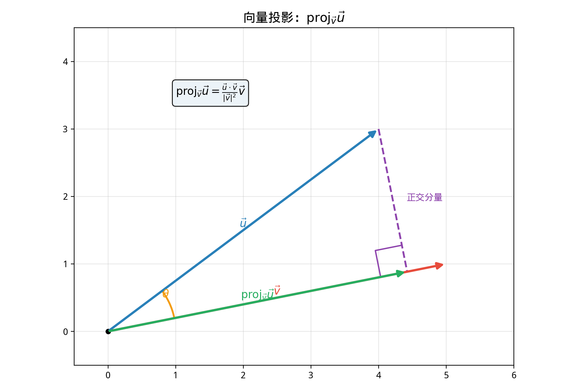

# §2 向量的内积与应用（Dot Product and Applications）

**前置知识**：[§1 向量基础](01-vector-basics.md)（向量加法、标量乘法、坐标表示、模）、[Part 4 第 3 章 三角函数](../../part-04-functions/ch03-trigonometry/README.md)（$\cos\theta$ 的定义）

**全景图**：向量的**点积**（dot product）是把两个向量"乘"在一起得到一个**标量**的运算。尽管定义简单，点积却是几何中最有力的工具之一：它统一了长度、角度、正交性和投影的计算，并在物理学中描述"功"的概念。

**预估学习时间**：约 2–3 小时

---

## 动机

你已经知道如何把两个向量相加，如何用标量乘以向量。但有没有一种方法把两个向量"相乘"？

事实上有两种！本节介绍的**点积**将两个向量映射到一个标量（$\vec{u} \cdot \vec{v} \in \mathbb{R}$）。下一节的**叉积**将两个三维向量映射到另一个向量（$\vec{u} \times \vec{v} \in \mathbb{R}^3$）。

点积的核心力量在于它**编码了角度信息**：两个向量的点积为零意味着它们垂直——这是几何中最重要的关系之一。

---

## 1. 点积的定义（Dot Product）

### 1.1 代数定义

> **定义 1**（点积——代数形式）
>
> 设 $\vec{u} = (u_1, u_2, u_3)$, $\vec{v} = (v_1, v_2, v_3)$。它们的**点积**（dot product），也叫**内积**（inner product）或**数量积**（scalar product），定义为：
>
> $$\vec{u} \cdot \vec{v} = u_1 v_1 + u_2 v_2 + u_3 v_3$$

二维情形：$\vec{u} \cdot \vec{v} = u_1 v_1 + u_2 v_2$。

结果是一个**标量**，不是向量。

### 1.2 几何定义

> **定理 1**（点积——几何形式）
>
> $$\vec{u} \cdot \vec{v} = |\vec{u}||\vec{v}|\cos\theta$$
>
> 其中 $\theta$ 是 $\vec{u}$ 和 $\vec{v}$ 之间的夹角（$0 \leq \theta \leq \pi$）。

**证明**：

设 $\vec{u}$, $\vec{v}$ 的夹角为 $\theta$。由余弦定理应用于 $\vec{u}$, $\vec{v}$, $\vec{u} - \vec{v}$ 构成的三角形：

$$|\vec{u} - \vec{v}|^2 = |\vec{u}|^2 + |\vec{v}|^2 - 2|\vec{u}||\vec{v}|\cos\theta$$

左边展开（用坐标）：

$$|\vec{u} - \vec{v}|^2 = (u_1 - v_1)^2 + (u_2 - v_2)^2 + (u_3 - v_3)^2$$
$$= u_1^2 - 2u_1 v_1 + v_1^2 + u_2^2 - 2u_2 v_2 + v_2^2 + u_3^2 - 2u_3 v_3 + v_3^2$$
$$= |\vec{u}|^2 + |\vec{v}|^2 - 2(u_1 v_1 + u_2 v_2 + u_3 v_3)$$

对比两个表达式：

$$-2(u_1 v_1 + u_2 v_2 + u_3 v_3) = -2|\vec{u}||\vec{v}|\cos\theta$$

$$u_1 v_1 + u_2 v_2 + u_3 v_3 = |\vec{u}||\vec{v}|\cos\theta$$

即 $\vec{u} \cdot \vec{v} = |\vec{u}||\vec{v}|\cos\theta$。$\blacksquare$

### 1.3 点积的符号与角度

$$\vec{u} \cdot \vec{v} \begin{cases} > 0 & \theta < 90° \text{（锐角）} \\ = 0 & \theta = 90° \text{（直角）} \\ < 0 & \theta > 90° \text{（钝角）} \end{cases}$$

---

## 2. 点积的性质

设 $\vec{u}$, $\vec{v}$, $\vec{w}$ 为向量，$c$ 为标量：

| 性质 | 公式 |
|------|------|
| 交换律 | $\vec{u} \cdot \vec{v} = \vec{v} \cdot \vec{u}$ |
| 分配律 | $\vec{u} \cdot (\vec{v} + \vec{w}) = \vec{u} \cdot \vec{v} + \vec{u} \cdot \vec{w}$ |
| 标量结合律 | $(c\vec{u}) \cdot \vec{v} = c(\vec{u} \cdot \vec{v})$ |
| 正定性 | $\vec{v} \cdot \vec{v} \geq 0$，等号当且仅当 $\vec{v} = \vec{0}$ |
| 与模的关系 | $\vec{v} \cdot \vec{v} = |\vec{v}|^2$ |

> **注意**：点积**没有结合律** $(\vec{u} \cdot \vec{v}) \cdot \vec{w}$ 没有意义，因为 $\vec{u} \cdot \vec{v}$ 是标量。

### 例题 1

> **例 1**：设 $\vec{u} = (1, -2, 3)$, $\vec{v} = (4, 5, -1)$。求 $\vec{u} \cdot \vec{v}$。

**解**：

$$\vec{u} \cdot \vec{v} = 1 \times 4 + (-2) \times 5 + 3 \times (-1) = 4 - 10 - 3 = -9$$

---

## 3. 向量的长度/模

> **推论 1**
>
> $$|\vec{v}| = \sqrt{\vec{v} \cdot \vec{v}}$$

用点积来定义模（长度），这在抽象向量空间中有自然推广（→ Part 9）。

### 三角不等式（向量形式）

$$|\vec{u} + \vec{v}| \leq |\vec{u}| + |\vec{v}|$$

等号当且仅当 $\vec{u}$ 和 $\vec{v}$ 同向。

### Cauchy-Schwarz 不等式

$$|\vec{u} \cdot \vec{v}| \leq |\vec{u}| \cdot |\vec{v}|$$

这正是 Part 3 Ch02 中 Cauchy-Schwarz 不等式的向量版本。由 $|\cos\theta| \leq 1$ 直接得到。

---

## 4. 向量的夹角

> **定理 2**（向量夹角公式）
>
> $$\cos\theta = \frac{\vec{u} \cdot \vec{v}}{|\vec{u}||\vec{v}|}$$

### 例题 2

> **例 2**：求 $\vec{u} = (1, 2, 2)$ 和 $\vec{v} = (2, -1, 0)$ 的夹角。

**解**：

$$\vec{u} \cdot \vec{v} = 2 - 2 + 0 = 0$$

$\cos\theta = 0$，$\theta = 90°$。

$\vec{u}$ 和 $\vec{v}$ 正交！

---

## 5. 正交性（Orthogonality）

> **定义 2**（正交）
>
> 两个向量 $\vec{u}$ 和 $\vec{v}$ **正交**（orthogonal，或垂直 perpendicular），记为 $\vec{u} \perp \vec{v}$，当且仅当：
>
> $$\vec{u} \cdot \vec{v} = 0$$

约定：零向量与任何向量正交。

### 标准基的正交性

$$\vec{i} \cdot \vec{j} = 0, \quad \vec{j} \cdot \vec{k} = 0, \quad \vec{k} \cdot \vec{i} = 0$$

$$\vec{i} \cdot \vec{i} = 1, \quad \vec{j} \cdot \vec{j} = 1, \quad \vec{k} \cdot \vec{k} = 1$$

标准基是**正交归一基**（orthonormal basis）——互相正交，每个长度为 $1$。

### 例题 3

> **例 3**：求一个与 $\vec{v} = (3, -1)$ 正交的向量。

**解**：设 $\vec{u} = (a, b)$，$\vec{u} \cdot \vec{v} = 3a - b = 0$，$b = 3a$。

取 $a = 1$：$\vec{u} = (1, 3)$。

验证：$(1, 3) \cdot (3, -1) = 3 - 3 = 0$。✓

> **观察**：在 2D 中，$(a, b)$ 的一个正交向量总是 $(-b, a)$（或 $(b, -a)$）——逆时针旋转 $90°$。

---

## 6. 投影（Projection）

### 6.1 标量投影

> **定义 3**（标量投影）
>
> $\vec{u}$ 在 $\vec{v}$ 方向上的**标量投影**（scalar projection）为：
>
> $$\text{comp}_{\vec{v}}\vec{u} = \frac{\vec{u} \cdot \vec{v}}{|\vec{v}|} = |\vec{u}|\cos\theta$$

标量投影是一个实数，表示 $\vec{u}$ 在 $\vec{v}$ 方向上的"分量大小"（可正可负）。

### 6.2 向量投影

> **定义 4**（向量投影）
>
> $\vec{u}$ 在 $\vec{v}$ 上的**向量投影**（vector projection）为：
>
> $$\text{proj}_{\vec{v}}\vec{u} = \frac{\vec{u} \cdot \vec{v}}{|\vec{v}|^2}\vec{v} = \frac{\vec{u} \cdot \vec{v}}{\vec{v} \cdot \vec{v}}\vec{v}$$

### 6.3 正交分解

任何向量 $\vec{u}$ 都可以分解为平行于 $\vec{v}$ 的分量和正交于 $\vec{v}$ 的分量：

$$\vec{u} = \underbrace{\text{proj}_{\vec{v}}\vec{u}}_{\text{平行分量}} + \underbrace{\left(\vec{u} - \text{proj}_{\vec{v}}\vec{u}\right)}_{\text{正交分量}}$$

可以验证正交分量确实与 $\vec{v}$ 正交。

### 6.4 例题 4

> **例 4**：将 $\vec{u} = (3, 4)$ 投影到 $\vec{v} = (1, 1)$ 上。

**解**：

$$\text{proj}_{\vec{v}}\vec{u} = \frac{\vec{u} \cdot \vec{v}}{|\vec{v}|^2}\vec{v} = \frac{3 + 4}{1 + 1}(1, 1) = \frac{7}{2}(1, 1) = \left(\frac{7}{2}, \frac{7}{2}\right)$$

正交分量：$\vec{u} - \text{proj}_{\vec{v}}\vec{u} = (3, 4) - \left(\frac{7}{2}, \frac{7}{2}\right) = \left(-\frac{1}{2}, \frac{1}{2}\right)$。

验证正交性：$\left(-\frac{1}{2}, \frac{1}{2}\right) \cdot (1, 1) = -\frac{1}{2} + \frac{1}{2} = 0$。✓

---

## 7. 应用

### 7.1 点到直线的距离（向量方法）

**问题**：求点 $P$ 到过点 $A$ 方向为 $\vec{d}$ 的直线 $\ell$ 的距离。

**方法**：

$$d(P, \ell) = \frac{|\overrightarrow{AP} - \text{proj}_{\vec{d}}\overrightarrow{AP}|}{1} = |\overrightarrow{AP}| \sin\theta$$

其中 $\theta$ 是 $\overrightarrow{AP}$ 与 $\vec{d}$ 的夹角。

更直接的公式（2D）：

$$d = \frac{|\overrightarrow{AP} \cdot \vec{n}|}{|\vec{n}|}$$

其中 $\vec{n}$ 是 $\ell$ 的法向量。

### 7.2 例题 5

> **例 5**：求点 $P(3, 7)$ 到直线 $2x - y + 1 = 0$ 的距离。

**解**：

**方法一（公式法）**：$d = \frac{|2(3) - 7 + 1|}{\sqrt{4+1}} = \frac{|6 - 7 + 1|}{\sqrt{5}} = \frac{0}{\sqrt{5}} = 0$。

$P$ 在直线上！验证：$2(3) - 7 + 1 = 0$。✓

**方法二（新的例子）**：求 $P(4, 5)$ 到 $2x - y + 1 = 0$ 的距离。

法向量 $\vec{n} = (2, -1)$。直线上取一点 $A(0, 1)$。

$\overrightarrow{AP} = (4, 4)$。$\overrightarrow{AP} \cdot \vec{n} = 8 - 4 = 4$。

$d = \frac{|4|}{\sqrt{5}} = \frac{4}{\sqrt{5}} = \frac{4\sqrt{5}}{5}$。

### 7.3 物理中的功（Work）

物理中，力 $\vec{F}$ 使物体沿位移 $\vec{d}$ 运动所做的**功**（work）为：

$$W = \vec{F} \cdot \vec{d} = |\vec{F}||\vec{d}|\cos\theta$$

- $\theta = 0°$（力与位移同向）：$W = |\vec{F}||\vec{d}|$（最大功）
- $\theta = 90°$（力与位移垂直）：$W = 0$（不做功）
- $\theta = 180°$（力与位移反向）：$W = -|\vec{F}||\vec{d}|$（负功）

### 7.4 例题 6

> **例 6**：力 $\vec{F} = (3, 4, 2)$ 牛顿作用于物体，使其从 $A(1, 0, -1)$ 移动到 $B(4, 2, 3)$。求力 $\vec{F}$ 所做的功。

**解**：

$$\vec{d} = \overrightarrow{AB} = (3, 2, 4)$$

$$W = \vec{F} \cdot \vec{d} = 9 + 8 + 8 = 25 \text{ J}$$

---

## 8. 方向余弦（Direction Cosines）

三维向量 $\vec{v} = (v_1, v_2, v_3)$ 与三个坐标轴的夹角 $\alpha$, $\beta$, $\gamma$ 满足：

$$\cos\alpha = \frac{v_1}{|\vec{v}|}, \quad \cos\beta = \frac{v_2}{|\vec{v}|}, \quad \cos\gamma = \frac{v_3}{|\vec{v}|}$$

这三个值称为**方向余弦**（direction cosines），满足：

$$\cos^2\alpha + \cos^2\beta + \cos^2\gamma = 1$$

单位向量 $\hat{v} = (\cos\alpha, \cos\beta, \cos\gamma)$。

---

## 要点回顾

| 概念 | 公式 | 结果类型 |
|------|------|----------|
| 点积（代数） | $\vec{u}\cdot\vec{v} = u_1v_1 + u_2v_2 + u_3v_3$ | 标量 |
| 点积（几何） | $\vec{u}\cdot\vec{v} = \|\vec{u}\|\|\vec{v}\|\cos\theta$ | 标量 |
| 模 | $\|\vec{v}\| = \sqrt{\vec{v}\cdot\vec{v}}$ | 标量 $\geq 0$ |
| 夹角 | $\cos\theta = \frac{\vec{u}\cdot\vec{v}}{\|\vec{u}\|\|\vec{v}\|}$ | 角度 |
| 正交性 | $\vec{u} \perp \vec{v} \iff \vec{u}\cdot\vec{v} = 0$ | 布尔 |
| 投影 | $\text{proj}_{\vec{v}}\vec{u} = \frac{\vec{u}\cdot\vec{v}}{\|\vec{v}\|^2}\vec{v}$ | 向量 |

---

## 进度检查点

完成本节后，请确认你可以：

- [ ] 用代数和几何两种方式计算点积
- [ ] 用点积计算向量的模
- [ ] 用点积求两向量的夹角
- [ ] 判断两个向量是否正交
- [ ] 计算向量投影（标量投影和向量投影）
- [ ] 用向量方法求点到直线的距离
- [ ] 理解点积在物理中的"功"的含义

---

## 自测题

**1.** 求 $\vec{u} = (2, -1, 3)$ 和 $\vec{v} = (1, 4, -2)$ 的点积和夹角。

答案

$\vec{u} \cdot \vec{v} = 2 - 4 - 6 = -8$。

$|\vec{u}| = \sqrt{4+1+9} = \sqrt{14}$，$|\vec{v}| = \sqrt{1+16+4} = \sqrt{21}$。

$\cos\theta = \frac{-8}{\sqrt{14}\sqrt{21}} = \frac{-8}{\sqrt{294}} = \frac{-8}{7\sqrt{6}}$。

$\theta = \arccos\left(\frac{-8}{7\sqrt{6}}\right) \approx 118.1°$。

**2.** 将 $\vec{u} = (5, 1)$ 投影到 $\vec{v} = (2, 3)$ 上。

答案

$\text{proj}_{\vec{v}}\vec{u} = \frac{10+3}{4+9}(2,3) = \frac{13}{13}(2,3) = (2,3)$。

所以 $\vec{u}$ 在 $\vec{v}$ 方向上的投影恰好是 $\vec{v}$ 本身。

**3.** 求一个同时与 $\vec{u} = (1, 0, 1)$ 和 $\vec{v} = (0, 1, -1)$ 正交的非零向量。

答案

设 $\vec{w} = (a, b, c)$。$\vec{w} \cdot \vec{u} = a + c = 0$，$\vec{w} \cdot \vec{v} = b - c = 0$。

$c = -a$, $b = c = -a$。取 $a = 1$：$\vec{w} = (1, -1, -1)$。

验证：$(1,-1,-1)\cdot(1,0,1) = 1+0-1 = 0$ ✓，$(1,-1,-1)\cdot(0,1,-1) = 0-1+1 = 0$ ✓。

**4.** 力 $\vec{F} = (5, -3)$ 作用于物体使其沿 $(4, 0)$ 方向移动。求功。

答案

$W = \vec{F} \cdot \vec{d} = 5 \times 4 + (-3) \times 0 = 20$ J。

**5.** 证明 Cauchy-Schwarz 不等式：$|\vec{u} \cdot \vec{v}| \leq |\vec{u}||\vec{v}|$。

答案

$|\vec{u}\cdot\vec{v}| = |\vec{u}||\vec{v}||\cos\theta| \leq |\vec{u}||\vec{v}| \cdot 1 = |\vec{u}||\vec{v}|$。

等号成立当且仅当 $|\cos\theta| = 1$，即 $\theta = 0°$ 或 $180°$，即 $\vec{u}$ 和 $\vec{v}$ 平行。$\blacksquare$

---

## 习题引用

更多练习请见 [练习题](exercises/exercises.md)。
