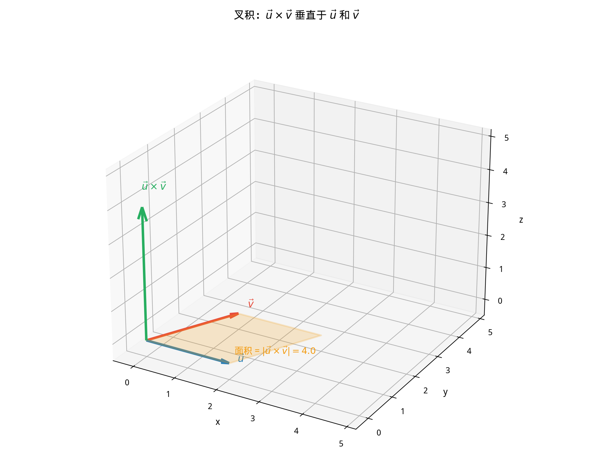

# §3 向量积（Cross Product）

**前置知识**：[§1 向量基础](01-vector-basics.md)、[§2 点积](02-dot-product.md)（向量运算、模、夹角、正交性）

**全景图**：**叉积**（cross product）是三维空间中特有的向量运算——它把两个向量映射为一个新向量，这个新向量**垂直于原来的两个向量**。叉积的模等于由两个向量张成的平行四边形的面积，这使得叉积成为计算面积和法向量的利器。本节系统学习叉积的定义、性质和应用，最后介绍**混合积**用于计算体积。

**预估学习时间**：约 2–3 小时

---

## 动机

点积把两个向量变成一个标量——它告诉你"两个向量在多大程度上指向同一方向"。但有时你需要回答另一个问题："有没有一个方向同时垂直于这两个向量？"

答案就是叉积。物理中的力矩 $\vec{\tau} = \vec{r} \times \vec{F}$、Lorentz 力 $\vec{F} = q\vec{v} \times \vec{B}$——这些都是叉积的实例。

---

## 1. 叉积的定义（Cross Product）

### 1.1 几何定义

> **定义 1**（叉积——几何形式）
>
> 两个三维向量 $\vec{u}$ 和 $\vec{v}$ 的**叉积**（cross product），也叫**向量积**（vector product），记为 $\vec{u} \times \vec{v}$，是一个向量，满足：
>
> 1. **大小**：$|\vec{u} \times \vec{v}| = |\vec{u}||\vec{v}|\sin\theta$，其中 $\theta$ 是 $\vec{u}$ 和 $\vec{v}$ 的夹角。
> 2. **方向**：垂直于 $\vec{u}$ 和 $\vec{v}$ 所在的平面，由**右手定则**确定——右手四指从 $\vec{u}$ 弯向 $\vec{v}$，拇指指向即为 $\vec{u} \times \vec{v}$ 的方向。

> **⚠️ 重要**：叉积仅在**三维空间**中定义。二维空间没有"垂直于平面"的方向。

### 1.2 代数定义（行列式公式）

> **定义 2**（叉积——代数形式）
>
> 设 $\vec{u} = (u_1, u_2, u_3)$, $\vec{v} = (v_1, v_2, v_3)$，则：
>
> $$\vec{u} \times \vec{v} = \begin{vmatrix} \vec{i} & \vec{j} & \vec{k} \\ u_1 & u_2 & u_3 \\ v_1 & v_2 & v_3 \end{vmatrix}$$

按第一行展开：

$$\vec{u} \times \vec{v} = \vec{i}\begin{vmatrix} u_2 & u_3 \\ v_2 & v_3 \end{vmatrix} - \vec{j}\begin{vmatrix} u_1 & u_3 \\ v_1 & v_3 \end{vmatrix} + \vec{k}\begin{vmatrix} u_1 & u_2 \\ v_1 & v_2 \end{vmatrix}$$

$$= (u_2 v_3 - u_3 v_2)\vec{i} - (u_1 v_3 - u_3 v_1)\vec{j} + (u_1 v_2 - u_2 v_1)\vec{k}$$

即：

$$\vec{u} \times \vec{v} = (u_2 v_3 - u_3 v_2,\; u_3 v_1 - u_1 v_3,\; u_1 v_2 - u_2 v_1)$$

### 1.3 标准基的叉积

$$\vec{i} \times \vec{j} = \vec{k}, \quad \vec{j} \times \vec{k} = \vec{i}, \quad \vec{k} \times \vec{i} = \vec{j}$$

$$\vec{j} \times \vec{i} = -\vec{k}, \quad \vec{k} \times \vec{j} = -\vec{i}, \quad \vec{i} \times \vec{k} = -\vec{j}$$

$$\vec{i} \times \vec{i} = \vec{j} \times \vec{j} = \vec{k} \times \vec{k} = \vec{0}$$

记忆方法：$\vec{i} \to \vec{j} \to \vec{k} \to \vec{i}$（循环顺序得正号，反方向得负号）。

### 1.4 例题 1

> **例 1**：求 $\vec{u} = (1, 2, 3)$ 和 $\vec{v} = (4, 5, 6)$ 的叉积。

**解**：

$$\vec{u} \times \vec{v} = \begin{vmatrix} \vec{i} & \vec{j} & \vec{k} \\ 1 & 2 & 3 \\ 4 & 5 & 6 \end{vmatrix}$$

$$= \vec{i}(2 \cdot 6 - 3 \cdot 5) - \vec{j}(1 \cdot 6 - 3 \cdot 4) + \vec{k}(1 \cdot 5 - 2 \cdot 4)$$

$$= \vec{i}(12 - 15) - \vec{j}(6 - 12) + \vec{k}(5 - 8)$$

$$= (-3, 6, -3)$$

**验证正交性**：

$\vec{u} \cdot (\vec{u} \times \vec{v}) = 1(-3) + 2(6) + 3(-3) = -3 + 12 - 9 = 0$ ✓

$\vec{v} \cdot (\vec{u} \times \vec{v}) = 4(-3) + 5(6) + 6(-3) = -12 + 30 - 18 = 0$ ✓

---

## 2. 叉积的几何意义

### 2.1 面积公式

> **定理 1**（平行四边形面积）
>
> 由 $\vec{u}$ 和 $\vec{v}$ 张成的**平行四边形的面积**为：
>
> $$S_{\text{平行四边形}} = |\vec{u} \times \vec{v}| = |\vec{u}||\vec{v}|\sin\theta$$

**推论**：由 $\vec{u}$ 和 $\vec{v}$ 张成的**三角形的面积**为：

$$S_{\triangle} = \frac{1}{2}|\vec{u} \times \vec{v}|$$

### 2.2 法向量

叉积 $\vec{u} \times \vec{v}$ 是由 $\vec{u}$ 和 $\vec{v}$ 确定的平面的**法向量**（normal vector）。这在求平面方程时非常有用。

### 2.3 例题 2

> **例 2**：求三角形 $ABC$ 的面积，其中 $A(1, 0, 0)$, $B(0, 2, 0)$, $C(0, 0, 3)$。

**解**：

$\overrightarrow{AB} = (-1, 2, 0)$，$\overrightarrow{AC} = (-1, 0, 3)$。

$$\overrightarrow{AB} \times \overrightarrow{AC} = \begin{vmatrix} \vec{i} & \vec{j} & \vec{k} \\ -1 & 2 & 0 \\ -1 & 0 & 3 \end{vmatrix} = (6-0, 0-(-3), 0-(-2)) = (6, 3, 2)$$

$$S = \frac{1}{2}|(6, 3, 2)| = \frac{1}{2}\sqrt{36+9+4} = \frac{7}{2}$$

---

## 3. 叉积的性质

设 $\vec{u}$, $\vec{v}$, $\vec{w}$ 为三维向量，$c$ 为标量：

| 性质 | 公式 |
|------|------|
| 反交换律 | $\vec{u} \times \vec{v} = -(\vec{v} \times \vec{u})$ |
| 分配律 | $\vec{u} \times (\vec{v} + \vec{w}) = \vec{u} \times \vec{v} + \vec{u} \times \vec{w}$ |
| 标量结合律 | $(c\vec{u}) \times \vec{v} = c(\vec{u} \times \vec{v})$ |
| 自身叉积 | $\vec{u} \times \vec{u} = \vec{0}$ |
| 平行判定 | $\vec{u} \times \vec{v} = \vec{0} \iff \vec{u} \parallel \vec{v}$（或其中一个为零向量） |

> **⚠️ 叉积不满足结合律**：$(\vec{u} \times \vec{v}) \times \vec{w} \neq \vec{u} \times (\vec{v} \times \vec{w})$（一般不等！）

### 3.1 反交换律的后果

交换两个因子的顺序，叉积变号：

$$\vec{v} \times \vec{u} = -\vec{u} \times \vec{v}$$

这意味着叉积**不满足交换律**。方向由右手定则决定——从 $\vec{v}$ 弯向 $\vec{u}$ 与从 $\vec{u}$ 弯向 $\vec{v}$ 方向相反。

### 3.2 例题 3

> **例 3**：验证 $\vec{u} = (1, 0, 0)$, $\vec{v} = (0, 1, 0)$, $\vec{w} = (0, 0, 1)$ 不满足结合律。

**解**：

$(\vec{u} \times \vec{v}) \times \vec{w} = \vec{k} \times \vec{k} = \vec{0}$

$\vec{u} \times (\vec{v} \times \vec{w}) = \vec{i} \times \vec{i} = \vec{0}$

这里恰好相等（都是 $\vec{0}$）。换一个例子：

设 $\vec{u} = (1, 0, 0)$, $\vec{v} = (1, 1, 0)$, $\vec{w} = (0, 1, 1)$。

$\vec{u} \times \vec{v} = (0, 0, 1)$。$(\vec{u} \times \vec{v}) \times \vec{w} = (0,0,1) \times (0,1,1) = (-1, 0, 0)$。

$\vec{v} \times \vec{w} = (1, -1, 1)$。$\vec{u} \times (\vec{v} \times \vec{w}) = (1,0,0) \times (1,-1,1) = (0, -1, -1)$。

$(-1, 0, 0) \neq (0, -1, -1)$。不满足结合律。✓

---

## 4. 混合积（Scalar Triple Product）

### 4.1 定义

> **定义 3**（混合积）
>
> 三个向量 $\vec{u}$, $\vec{v}$, $\vec{w}$ 的**混合积**（scalar triple product）定义为：
>
> $$\vec{u} \cdot (\vec{v} \times \vec{w})$$
>
> 结果是一个**标量**。

### 4.2 行列式公式

$$\vec{u} \cdot (\vec{v} \times \vec{w}) = \begin{vmatrix} u_1 & u_2 & u_3 \\ v_1 & v_2 & v_3 \\ w_1 & w_2 & w_3 \end{vmatrix}$$

### 4.3 几何意义：平行六面体的体积

> **定理 2**（平行六面体体积）
>
> 由 $\vec{u}$, $\vec{v}$, $\vec{w}$ 张成的**平行六面体**（parallelepiped）的体积为：
>
> $$V = |\vec{u} \cdot (\vec{v} \times \vec{w})|$$

**直觉**：$|\vec{v} \times \vec{w}|$ 是底面（$\vec{v}$ 和 $\vec{w}$ 张成的平行四边形）的面积。$\vec{u}$ 在 $\vec{v} \times \vec{w}$（底面法向量）方向上的投影是"高"。体积 = 底面积 × 高。

**推论**：四面体体积 $= \frac{1}{6}|\vec{u} \cdot (\vec{v} \times \vec{w})|$。

### 4.4 混合积的性质

1. 轮换不变性：$\vec{u} \cdot (\vec{v} \times \vec{w}) = \vec{v} \cdot (\vec{w} \times \vec{u}) = \vec{w} \cdot (\vec{u} \times \vec{v})$

2. 交换两个向量改变符号：$\vec{u} \cdot (\vec{v} \times \vec{w}) = -\vec{u} \cdot (\vec{w} \times \vec{v})$

3. 共面判定：$\vec{u}$, $\vec{v}$, $\vec{w}$ **共面** $\iff$ $\vec{u} \cdot (\vec{v} \times \vec{w}) = 0$

### 4.5 例题 4

> **例 4**：求由 $\vec{u} = (1, 0, 2)$, $\vec{v} = (3, 1, 0)$, $\vec{w} = (0, 2, 1)$ 张成的平行六面体的体积。

**解**：

$$\vec{v} \times \vec{w} = \begin{vmatrix} \vec{i} & \vec{j} & \vec{k} \\ 3 & 1 & 0 \\ 0 & 2 & 1 \end{vmatrix} = (1-0, 0-3, 6-0) = (1, -3, 6)$$

$$\vec{u} \cdot (\vec{v} \times \vec{w}) = 1(1) + 0(-3) + 2(6) = 1 + 0 + 12 = 13$$

$$V = |13| = 13$$

---

## 5. 应用

### 5.1 平面的法向量

过点 $A$ 且包含方向 $\vec{u}$ 和 $\vec{v}$ 的平面的**法向量**为 $\vec{n} = \vec{u} \times \vec{v}$。

平面方程：

$$\vec{n} \cdot (\vec{r} - \vec{a}) = 0$$

其中 $\vec{a}$ 是 $A$ 的位置向量，$\vec{r} = (x, y, z)$。

### 5.2 例题 5

> **例 5**：求过三点 $A(1, 0, 0)$, $B(0, 2, 0)$, $C(0, 0, 3)$ 的平面方程。

**解**：

$\overrightarrow{AB} = (-1, 2, 0)$, $\overrightarrow{AC} = (-1, 0, 3)$。

$\vec{n} = \overrightarrow{AB} \times \overrightarrow{AC} = (6, 3, 2)$（例 2 已算）。

平面方程：$6(x-1) + 3(y-0) + 2(z-0) = 0$，即 $6x + 3y + 2z = 6$。

验证：$A$: $6(1) + 3(0) + 2(0) = 6$ ✓，$B$: $6(0) + 3(2) + 2(0) = 6$ ✓，$C$: $6(0) + 3(0) + 2(3) = 6$ ✓。

### 5.3 三维空间中三角形面积

已经在定理 1 的推论中给出：

$$S_\triangle = \frac{1}{2}|\overrightarrow{AB} \times \overrightarrow{AC}|$$

这比用 Heron 公式或坐标公式更简洁，尤其在三维空间中。

### 5.4 例题 6

> **例 6**：判断三点 $A(1, 2, 3)$, $B(4, 6, 9)$, $C(7, 10, 15)$ 是否共线。

**解**：

$\overrightarrow{AB} = (3, 4, 6)$, $\overrightarrow{AC} = (6, 8, 12) = 2(3, 4, 6) = 2\overrightarrow{AB}$。

$\overrightarrow{AB} \times \overrightarrow{AC} = \overrightarrow{AB} \times 2\overrightarrow{AB} = 2(\overrightarrow{AB} \times \overrightarrow{AB}) = 2\vec{0} = \vec{0}$。

$\overrightarrow{AB} \parallel \overrightarrow{AC}$，所以 $A$, $B$, $C$ 共线。

---

## 6. Lagrange 恒等式

> **定理 3**（Lagrange 恒等式）
>
> $$|\vec{u} \times \vec{v}|^2 = |\vec{u}|^2|\vec{v}|^2 - (\vec{u} \cdot \vec{v})^2$$

**证明**：

$$|\vec{u} \times \vec{v}|^2 = |\vec{u}|^2|\vec{v}|^2\sin^2\theta = |\vec{u}|^2|\vec{v}|^2(1 - \cos^2\theta) = |\vec{u}|^2|\vec{v}|^2 - |\vec{u}|^2|\vec{v}|^2\cos^2\theta$$

$$= |\vec{u}|^2|\vec{v}|^2 - (\vec{u} \cdot \vec{v})^2$$

$\blacksquare$

这个恒等式在代数和几何中都有重要应用。注意它也是 Cauchy-Schwarz 不等式的"加强版"——不仅给出不等式 $(\vec{u}\cdot\vec{v})^2 \leq |\vec{u}|^2|\vec{v}|^2$，还精确地给出了差值。

---

## 7. 叉积与行列式、面积的联系

### 7.1 二维"叉积"

虽然叉积只在 3D 中定义，但 2D 向量 $(u_1, u_2)$ 和 $(v_1, v_2)$ 的"二维叉积"常被定义为：

$$u_1 v_2 - u_2 v_1 = \begin{vmatrix} u_1 & u_2 \\ v_1 & v_2 \end{vmatrix}$$

其几何意义：$|u_1 v_2 - u_2 v_1|$ 是由 $\vec{u}$ 和 $\vec{v}$ 张成的平行四边形的面积。符号表示方向（逆时针为正）。

### 7.2 与变换的联系

回顾 [Ch04](../ch04-transformations/01-transformations.md)：

- 旋转矩阵 $R_\theta$ 的行列式为 $\cos^2\theta + \sin^2\theta = 1$——面积不变。
- 反射矩阵的行列式为 $-1$——面积不变但方向反转。
- 缩放矩阵 $kI$ 的行列式为 $k^2$——面积乘以 $k^2$。

行列式 = 面积的缩放因子——这在 Part 9（线性代数）中将有更深入的讨论。

---

## 要点回顾

| 概念 | 公式 | 结果类型 |
|------|------|----------|
| 叉积 | $\vec{u}\times\vec{v} = (u_2v_3-u_3v_2, u_3v_1-u_1v_3, u_1v_2-u_2v_1)$ | 向量 |
| 叉积模 | $\|\vec{u}\times\vec{v}\| = \|\vec{u}\|\|\vec{v}\|\sin\theta$ | 标量 |
| 平行四边形面积 | $S = \|\vec{u}\times\vec{v}\|$ | 标量 |
| 三角形面积 | $S = \frac{1}{2}\|\vec{u}\times\vec{v}\|$ | 标量 |
| 混合积 | $\vec{u}\cdot(\vec{v}\times\vec{w}) = \det[\vec{u}, \vec{v}, \vec{w}]$ | 标量 |
| 平行六面体体积 | $V = \|\vec{u}\cdot(\vec{v}\times\vec{w})\|$ | 标量 |
| 四面体体积 | $V = \frac{1}{6}\|\vec{u}\cdot(\vec{v}\times\vec{w})\|$ | 标量 |

**核心性质对比**：

| 运算 | 交换律？ | 结合律？ | 结果类型 | 几何意义 |
|------|---------|---------|---------|---------|
| 点积 $\vec{u}\cdot\vec{v}$ | ✓ | 无意义 | 标量 | 投影、角度 |
| 叉积 $\vec{u}\times\vec{v}$ | ✗（反交换） | ✗ | 向量 | 面积、法向量 |

---

## 进度检查点

完成本节后，请确认你可以：

- [ ] 用行列式公式计算叉积
- [ ] 理解叉积的几何意义（面积、法向量）
- [ ] 记住叉积的反交换律和不满足结合律
- [ ] 用叉积求平行四边形和三角形的面积
- [ ] 计算混合积并理解其体积含义
- [ ] 用叉积求平面的法向量和方程
- [ ] 用混合积判断共面性

---

## 自测题

**1.** 求 $\vec{u} = (2, -1, 3)$ 和 $\vec{v} = (0, 4, -2)$ 的叉积。

答案

$$\vec{u} \times \vec{v} = ((-1)(-2) - 3(4),\; 3(0) - 2(-2),\; 2(4) - (-1)(0))$$
$$= (2 - 12,\; 0 + 4,\; 8 - 0) = (-10, 4, 8)$$

验证：$\vec{u}\cdot(-10,4,8) = -20-4+24 = 0$ ✓，$\vec{v}\cdot(-10,4,8) = 0+16-16 = 0$ ✓。

**2.** 求由 $\vec{u} = (1, 1, 0)$ 和 $\vec{v} = (0, 1, 1)$ 张成的平行四边形面积。

答案

$\vec{u} \times \vec{v} = (1-0, 0-1, 1-0) = (1, -1, 1)$。

$S = |(1,-1,1)| = \sqrt{1+1+1} = \sqrt{3}$。

**3.** 求过 $A(2, 1, 0)$, $B(1, 0, 1)$, $C(0, 1, 2)$ 的平面方程。

答案

$\overrightarrow{AB} = (-1, -1, 1)$, $\overrightarrow{AC} = (-2, 0, 2)$。

$\vec{n} = \overrightarrow{AB} \times \overrightarrow{AC} = (-2-0, -2-(-2), 0-2) = (-2, 0, -2)$。

简化 $\vec{n} = (-1, 0, -1)$（除以 2）。

平面方程：$-1(x-2) + 0(y-1) - 1(z-0) = 0$，即 $x + z = 2$。

验证：$A$: $2+0=2$ ✓，$B$: $1+1=2$ ✓，$C$: $0+2=2$ ✓。

**4.** 求由 $\vec{u} = (1, 0, 0)$, $\vec{v} = (1, 1, 0)$, $\vec{w} = (1, 1, 1)$ 张成的平行六面体体积。

答案

$$\vec{u} \cdot (\vec{v} \times \vec{w}) = \begin{vmatrix} 1 & 0 & 0 \\ 1 & 1 & 0 \\ 1 & 1 & 1 \end{vmatrix} = 1(1-0) - 0 + 0 = 1$$

$V = |1| = 1$。这就是单位立方体的体积。

**5.** 四点 $A(1,1,1)$, $B(2,3,1)$, $C(3,1,2)$, $D(1,2,3)$ 是否共面？

答案

$\overrightarrow{AB} = (1,2,0)$, $\overrightarrow{AC} = (2,0,1)$, $\overrightarrow{AD} = (0,1,2)$。

$$\overrightarrow{AB} \cdot (\overrightarrow{AC} \times \overrightarrow{AD}) = \begin{vmatrix} 1 & 2 & 0 \\ 2 & 0 & 1 \\ 0 & 1 & 2 \end{vmatrix}$$

$= 1(0-1) - 2(4-0) + 0(2-0) = -1 - 8 + 0 = -9 \neq 0$。

不共面。四面体 $ABCD$ 的体积 $= \frac{1}{6}|{-9}| = \frac{3}{2}$。

---

## 习题引用

更多练习请见 [练习题](exercises/exercises.md) 和 [挑战题](exercises/challenge.md)。
