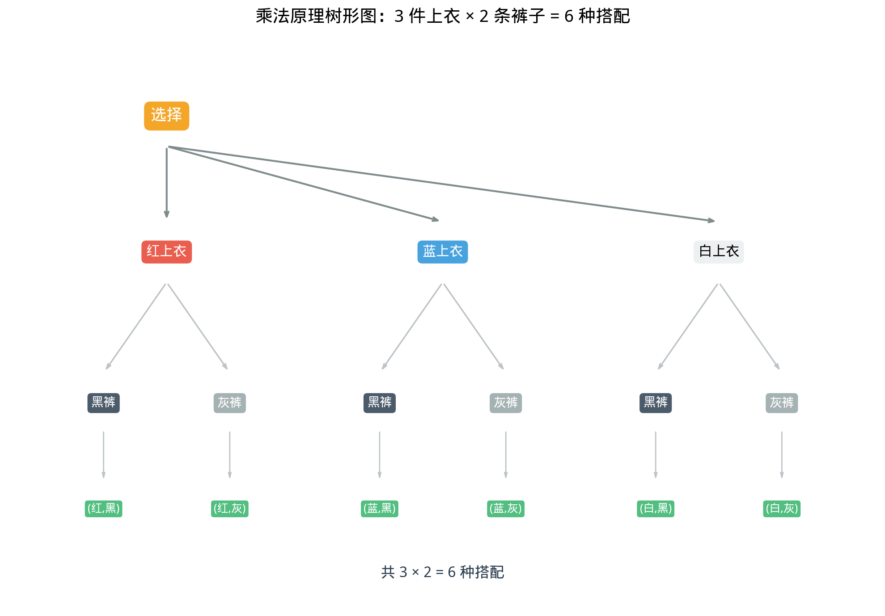

# §1 加法原理与乘法原理（Addition & Multiplication Principles）

**前置知识**：[Part 1 第 1 章 逻辑](../../part-01-foundations/ch01-logic/README.md)（命题逻辑、"或""且"的含义）、[Part 1 第 2 章 集合](../../part-01-foundations/ch02-sets/README.md)（集合的并集、交集、不相交集合）

**全景图**：加法原理和乘法原理是组合数学的两块基石——所有更高级的计数方法（排列、组合、容斥）都建立在这两个原理之上。本节首先从直觉出发引入这两个原理，然后通过树形图（tree diagram）让抽象的计数变得可视化，最后用一系列经典应用（车牌号、密码、搭配方案）巩固理解。

**预估学习时间**：约 3–4 小时

---

## 动机

想象你要从家去学校。有两种交通方式：**公交**或**地铁**。

- 公交有 $3$ 条线路可选；
- 地铁有 $2$ 条线路可选。

你总共有多少种出行方式？直觉告诉我们答案是 $3 + 2 = 5$——因为你选公交或地铁，两种方式**互不兼容**（你不能同时坐公交又坐地铁），所以把各自的方案数相加。

现在换一个场景：你要先从家到中转站（$3$ 条线路），再从中转站到学校（$2$ 条线路）。总共有多少种出行方案？答案是 $3 \times 2 = 6$——因为第一步的每种选择都可以与第二步的每种选择**独立搭配**。

这两个直觉就是**加法原理**和**乘法原理**——整个计数世界的出发点。

---

## 1. 加法原理（Addition Principle）

### 1.1 精确表述

> **定理 1**（加法原理 / 分类计数原理）
>
> 设完成某个任务有 $m$ 类方案，其中第 $i$ 类有 $n_i$ 种方式（$1 \leq i \leq m$），且各类方案**互不重叠**（即不同类之间没有相同的方式）。则完成该任务的总方式数为：
>
> $$N = n_1 + n_2 + \cdots + n_m = \sum_{i=1}^{m} n_i$$

**集合语言**：设 $A_1, A_2, \ldots, A_m$ 是两两不相交的有限集（$A_i \cap A_j = \emptyset$，$i \neq j$），则

$$|A_1 \cup A_2 \cup \cdots \cup A_m| = |A_1| + |A_2| + \cdots + |A_m|$$

### 1.2 关键条件：互斥

加法原理的核心条件是**互斥**（mutually exclusive）——各类方案之间没有重叠。如果方案之间有重叠，直接相加就会"多算"，这时需要容斥原理（本章 §2）来修正。

**类比**：在概率论中，互斥事件的概率满足 $P(A \cup B) = P(A) + P(B)$——这正是加法原理在概率中的对应物（Part 8）。

### 1.3 例题

> **例 1**（选课问题）
>
> 某学期开设 $4$ 门数学选修课和 $3$ 门物理选修课。小明要选**一门**选修课。有多少种选法？

**解**：选数学课有 $4$ 种方式，选物理课有 $3$ 种方式。这两类选择互斥（一门课不可能同时是数学课和物理课）。

由加法原理：$N = 4 + 3 = 7$ 种。$\blacksquare$

> **例 2**（整除问题）
>
> 在 $1, 2, 3, \ldots, 100$ 中，有多少个数能被 $5$ 整除或能被 $10$ 整除？

**分析**：能被 $10$ 整除的数一定能被 $5$ 整除，所以"被 $5$ 整除"和"被 $10$ 整除"不是互斥的。不能直接加！

**正确做法**：能被 $5$ 整除的数就包含了能被 $10$ 整除的数。所以答案就是 $1$ 到 $100$ 中 $5$ 的倍数个数 $= 100 / 5 = 20$。

**教训**：使用加法原理前，一定要检查互斥条件！

---

## 2. 乘法原理（Multiplication Principle）

### 2.1 精确表述

> **定理 2**（乘法原理 / 分步计数原理）
>
> 设完成某个任务需要**依次**完成 $k$ 个步骤，其中第 $i$ 步有 $n_i$ 种方式（$1 \leq i \leq k$），且每一步的选择与之前的选择**无关**（独立）。则完成该任务的总方式数为：
>
> $$N = n_1 \times n_2 \times \cdots \times n_k = \prod_{i=1}^{k} n_i$$

**集合语言**：设 $A_1, A_2, \ldots, A_k$ 是有限集，则**笛卡尔积**（Cartesian product）的大小为

$$|A_1 \times A_2 \times \cdots \times A_k| = |A_1| \cdot |A_2| \cdots |A_k|$$

### 2.2 关键条件：独立

乘法原理的核心条件是**独立**（independent）——每一步的可选方式数不受前面步骤的影响。如果后续步骤的选择取决于前面的选择（例如"不能重复选"），需要更仔细的分析。

### 2.3 例题

> **例 3**（车牌号码）
>
> 某地车牌号由 $3$ 个大写英文字母和 $4$ 个数字（$0$–$9$）组成，格式为"字母-字母-字母-数字-数字-数字-数字"。每个位置独立选取，可以重复。共有多少种不同的车牌号？

**解**：分 $7$ 步完成：
- 第 1–3 步：各选一个字母，每步 $26$ 种
- 第 4–7 步：各选一个数字，每步 $10$ 种

由乘法原理：

$$N = 26^3 \times 10^4 = 17{,}576 \times 10{,}000 = 175{,}760{,}000$$

共 $1.7576$ 亿种。$\blacksquare$

> **例 4**（密码设置）
>
> 密码由 $6$–$8$ 个字符组成，每个字符可以是大写字母（$26$ 种）、小写字母（$26$ 种）或数字（$10$ 种），共 $62$ 种。密码长度可以是 $6$、$7$ 或 $8$。共有多少种不同的密码？

**解**：这里需要**同时**使用加法原理和乘法原理。

按密码长度分类（互斥）：
- 长度 $6$：由乘法原理，$62^6$ 种
- 长度 $7$：$62^7$ 种
- 长度 $8$：$62^8$ 种

由加法原理：

$$N = 62^6 + 62^7 + 62^8 = 62^6(1 + 62 + 62^2) = 62^6 \times 3{,}907$$

$$62^6 = 56{,}800{,}235{,}584, \quad N = 56{,}800{,}235{,}584 \times 3{,}907 \approx 2.22 \times 10^{14}$$

超过 $200$ 万亿种。$\blacksquare$

---

## 3. 树形图（Tree Diagram）

### 3.1 什么是树形图

**树形图**（tree diagram）是将乘法原理可视化的工具。每个分支代表一步中的一种选择，从根节点到叶节点的每条路径对应一种完整方案。

### 3.2 示例

> **例 5**（搭配衣服）
>
> 小红有 $3$ 件上衣（红、蓝、白）和 $2$ 条裤子（黑、灰）。有多少种搭配方案？

树形图如下（参见图 `p07-ch01-multiplication-tree.png`）：

```
             ┌─ 黑裤 → (红,黑)
     红上衣 ─┤
             └─ 灰裤 → (红,灰)
             ┌─ 黑裤 → (蓝,黑)
     蓝上衣 ─┤
             └─ 灰裤 → (蓝,灰)
             ┌─ 黑裤 → (白,黑)
     白上衣 ─┤
             └─ 灰裤 → (白,灰)
```

共 $3 \times 2 = 6$ 种搭配。



### 3.3 树形图的优势与局限

**优势**：
- 直观展示所有可能，不会遗漏
- 适合步骤不独立的情况（不同分支可以有不同的子选项数）
- 帮助建立计数的直觉

**局限**：
- 当选项很多时，树形图会变得庞大
- 对于大规模计数问题，需要公式化的方法（排列、组合）

---

## 4. 加法原理与乘法原理的综合应用

### 4.1 何时用加法？何时用乘法？

| 关键词 | 原理 | 运算 |
|--------|------|------|
| "或"、"分类"、"几种情况" | 加法原理 | $+$ |
| "且"、"分步"、"依次" | 乘法原理 | $\times$ |

**判断标准**：
- 如果方案可以**按类型划分**，每种类型独立完成任务 → **加法原理**
- 如果方案需要**多步完成**，每步独立选择 → **乘法原理**

### 4.2 综合例题

> **例 6**（从 A 到 C）
>
> 从城市 A 到城市 C，可以直达（$2$ 条路线），也可以经过城市 B 中转（A 到 B 有 $3$ 条路线，B 到 C 有 $4$ 条路线）。从 A 到 C 共有多少种路线？

**解**：按是否中转分类（加法原理）：

- 直达：$2$ 种
- 经 B 中转：由乘法原理，$3 \times 4 = 12$ 种

总计：$N = 2 + 12 = 14$ 种。$\blacksquare$

> **例 7**（排数字）
>
> 用数字 $1, 2, 3, 4, 5$ 组成没有重复数字的三位数，其中至少有一个偶数。有多少个这样的三位数？

**解**（补集法）：先计算三位数的总数，再减去"全部由奇数组成"的三位数。

- 总数：第一步选百位（$5$ 种），第二步选十位（$4$ 种，不能和百位重复），第三步选个位（$3$ 种）。共 $5 \times 4 \times 3 = 60$ 个。

- 全部用奇数（$1, 3, 5$）：$3 \times 2 \times 1 = 6$ 个。

- 至少有一个偶数：$60 - 6 = 54$ 个。$\blacksquare$

**补集法的思想**：当"至少一个"的条件难以直接计数时，用"全部 $-$ 一个都没有"往往更简单。这个思想在概率论中也反复出现。

---

## 5. 更多应用场景

### 5.1 函数计数

> **例 8**（函数个数）
>
> 设 $A = \{1, 2, 3\}$，$B = \{a, b, c, d\}$。从 $A$ 到 $B$ 有多少个不同的函数？有多少个单射（一对一函数）？

**解**：

**函数个数**：函数 $f: A \to B$ 要为 $A$ 的每个元素指定一个 $B$ 中的像。$f(1)$ 有 $4$ 种选择，$f(2)$ 有 $4$ 种，$f(3)$ 有 $4$ 种（可以重复）。由乘法原理：$4^3 = 64$ 个。

**单射个数**：单射要求不同元素映到不同的像。$f(1)$ 有 $4$ 种，$f(2)$ 有 $3$ 种（不能等于 $f(1)$），$f(3)$ 有 $2$ 种。由乘法原理：$4 \times 3 \times 2 = 24$ 个。$\blacksquare$

一般地，从 $|A| = n$ 元集到 $|B| = m$ 元集的函数有 $m^n$ 个，单射有 $m(m-1)\cdots(m-n+1) = P(m,n)$ 个（这就是排列数，Ch02 的主题）。

### 5.2 子集计数

> **例 9**（子集个数）
>
> $n$ 元集合有多少个子集？

**解**：构造子集等价于对每个元素做一个二选一的决定："选入"或"不选"。$n$ 个元素，每个 $2$ 种选择，各元素的选择独立。

由乘法原理：$2^n$ 个子集。

例如 $\{a, b, c\}$ 有 $2^3 = 8$ 个子集：$\emptyset, \{a\}, \{b\}, \{c\}, \{a,b\}, \{a,c\}, \{b,c\}, \{a,b,c\}$。$\blacksquare$

### 5.3 整除与因子

> **例 10**（正因子个数）
>
> 正整数 $n = p_1^{a_1} p_2^{a_2} \cdots p_k^{a_k}$（标准分解）有多少个正因子？

**解**：$n$ 的正因子形如 $d = p_1^{b_1} p_2^{b_2} \cdots p_k^{b_k}$，其中 $0 \leq b_i \leq a_i$。选择因子等价于为每个 $p_i$ 选择指数 $b_i$。$b_i$ 有 $a_i + 1$ 种选择。

由乘法原理：

$$\tau(n) = (a_1 + 1)(a_2 + 1) \cdots (a_k + 1)$$

例如 $360 = 2^3 \times 3^2 \times 5^1$ 有 $(3+1)(2+1)(1+1) = 24$ 个正因子。$\blacksquare$

---

## 要点回顾

| 原理 | 场景 | 公式 | 关键条件 |
|------|------|------|----------|
| 加法原理 | 按类型分类，任选其一 | $N = n_1 + n_2 + \cdots + n_m$ | 各类互斥 |
| 乘法原理 | 分步完成，依次选择 | $N = n_1 \times n_2 \times \cdots \times n_k$ | 各步独立 |
| 树形图 | 可视化多步选择 | 叶节点数 = 总方案数 | 适合小规模 |
| 补集法 | "至少一个"类计数 | $N = N_{\text{全}} - N_{\text{反}}$ | 反面更易算 |

**最重要的思维方式**：面对计数问题时，先问"这是分类还是分步？"——分类用加法，分步用乘法。

---

## 进度检查点

在继续学习 §2（容斥原理）之前，请确保你能：

- [ ] 准确区分何时用加法原理、何时用乘法原理
- [ ] 画出简单问题的树形图
- [ ] 用乘法原理计算车牌号、密码等问题
- [ ] 使用补集法处理"至少"类问题
- [ ] 用乘法原理计算子集个数（$2^n$）和因子个数

---

## 自测题

**1.** 某餐厅提供 $5$ 种主菜和 $3$ 种甜点。如果你要选一种主菜和一种甜点，有多少种组合？如果你只选主菜或只选甜点（不能都选），有多少种选法？

<details>
<summary>答案</summary>

主菜 + 甜点（分步）：$5 \times 3 = 15$ 种。

只选一样（分类）：$5 + 3 = 8$ 种。
</details>

**2.** 用 $0, 1, 2, 3, 4$ 五个数字组成没有重复数字的四位数（千位不能为 $0$），共有多少个？

<details>
<summary>答案</summary>

千位：$4$ 种选择（$1, 2, 3, 4$，不能为 $0$）。
百位：$4$ 种（$5$ 个数字去掉千位已选的 $1$ 个，还有 $4$ 个可选，其中包含 $0$）。
十位：$3$ 种。个位：$2$ 种。

$N = 4 \times 4 \times 3 \times 2 = 96$ 个。
</details>

**3.** 从集合 $\{1, 2, 3, \ldots, 50\}$ 中选一个数，使其能被 $6$ 整除或能被 $8$ 整除。有多少种选法？（提示：需要考虑重叠！）

<details>
<summary>答案</summary>

能被 $6$ 整除：$\lfloor 50/6 \rfloor = 8$ 个。能被 $8$ 整除：$\lfloor 50/8 \rfloor = 6$ 个。能被 $\text{lcm}(6,8)=24$ 整除：$\lfloor 50/24 \rfloor = 2$ 个。

由容斥原理（§2）：$8 + 6 - 2 = 12$ 种。

（注意：这里不能直接用加法原理，因为"被 $6$ 整除"和"被 $8$ 整除"不互斥——$24, 48$ 同时满足两个条件。）
</details>

---

## 习题引用

本节的练习题见 [练习题](exercises/exercises.md) 的 §1 部分。
