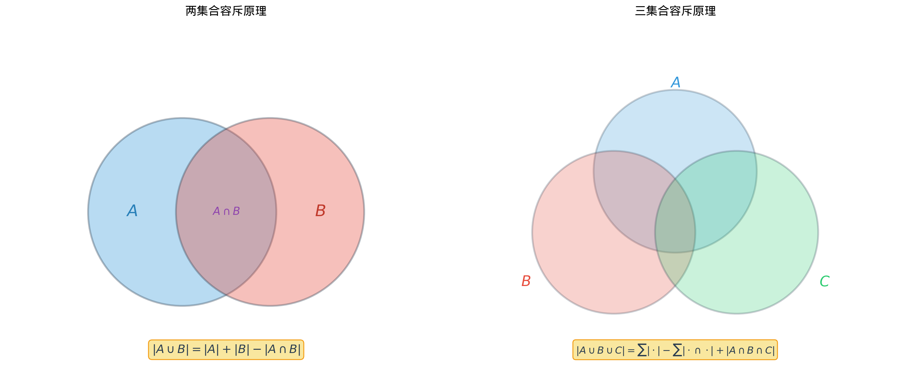

# §2 容斥原理（Inclusion-Exclusion Principle）

**前置知识**：[本章 §1 加法原理与乘法原理](01-addition-multiplication.md)、[Part 1 第 2 章 集合](../../part-01-foundations/ch02-sets/README.md)（集合的并、交、补）、[Part 1 第 3 章 证明方法](../../part-01-foundations/ch03-proofs/README.md)（数学归纳法）、[Part 2 第 3 章 数论基础](../../part-02-numbers/ch03-number-theory/README.md)（整除、素因子分解）

**全景图**：加法原理要求各类方案互斥——但现实中，"有重叠"才是常态。容斥原理（inclusion-exclusion principle）是处理重叠计数的通用工具：先"包含"（include）所有集合的大小，再"排斥"（exclude）两两交集，再加回三三交集……如此交替。本节从两集合的 Venn 图出发，逐步建立一般公式，然后展示两个经典应用——Euler 函数和错排问题。

**预估学习时间**：约 4–5 小时

---

## 动机

回到 §1 的自测题 3：在 $\{1, 2, \ldots, 50\}$ 中，有多少个数能被 $6$ 整除**或**被 $8$ 整除？

设 $A$ = 能被 $6$ 整除的数的集合，$B$ = 能被 $8$ 整除的数的集合。我们要求 $|A \cup B|$。

如果直接用加法 $|A| + |B| = 8 + 6 = 14$，就多算了——因为 $24$ 和 $48$ 同时属于 $A$ 和 $B$，被算了两次。

正确答案是：

$$|A \cup B| = |A| + |B| - |A \cap B| = 8 + 6 - 2 = 12$$

减去 $|A \cap B|$ 就是修正"多算"的部分。这就是容斥原理的最简单形式。

---

## 1. 两集合的容斥原理

### 1.1 公式与证明

> **定理 1**（两集合的容斥原理）
>
> 对于任意两个有限集 $A$ 和 $B$：
>
> $$|A \cup B| = |A| + |B| - |A \cap B|$$

**证明**：将 $A \cup B$ 分成三个两两不相交的部分：

$$A \cup B = (A \setminus B) \cup (A \cap B) \cup (B \setminus A)$$

由加法原理：

$$|A \cup B| = |A \setminus B| + |A \cap B| + |B \setminus A|$$

又因为 $|A| = |A \setminus B| + |A \cap B|$ 和 $|B| = |B \setminus A| + |A \cap B|$，所以

$$|A| + |B| = |A \setminus B| + 2|A \cap B| + |B \setminus A| = |A \cup B| + |A \cap B|$$

移项得 $|A \cup B| = |A| + |B| - |A \cap B|$。$\blacksquare$

### 1.2 补集形式

有时我们需要计算**不属于 $A$ 也不属于 $B$** 的元素个数。设全集为 $U$，则

$$|\overline{A \cup B}| = |U| - |A \cup B| = |U| - |A| - |B| + |A \cap B|$$

这里用到了 de Morgan 定律：$\overline{A \cup B} = \overline{A} \cap \overline{B}$。

### 1.3 例题

> **例 1**（语言调查）
>
> 某班 $40$ 名同学中，$25$ 人学英语，$18$ 人学法语，$7$ 人两门都学。问：(a) 至少学一门的有多少人？(b) 两门都不学的有多少人？

**解**：

(a) $|A \cup B| = 25 + 18 - 7 = 36$ 人。

(b) 两门都不学 $= 40 - 36 = 4$ 人。$\blacksquare$

> **例 2**（整除）
>
> $1$ 到 $1000$ 中，有多少个正整数既不能被 $3$ 整除也不能被 $5$ 整除？

**解**：设 $A$ = 被 $3$ 整除的集合，$B$ = 被 $5$ 整除的集合。

- $|A| = \lfloor 1000/3 \rfloor = 333$
- $|B| = \lfloor 1000/5 \rfloor = 200$
- $|A \cap B|$ = 被 $15$ 整除的 $= \lfloor 1000/15 \rfloor = 66$

$$|A \cup B| = 333 + 200 - 66 = 467$$

既不被 $3$ 整除也不被 $5$ 整除：$1000 - 467 = 533$。$\blacksquare$

---

## 2. 三集合的容斥原理

### 2.1 公式

> **定理 2**（三集合的容斥原理）
>
> 对于任意三个有限集 $A$、$B$、$C$：
>
> $$|A \cup B \cup C| = |A| + |B| + |C| - |A \cap B| - |A \cap C| - |B \cap C| + |A \cap B \cap C|$$

**直觉**：$|A| + |B| + |C|$ 把属于两个集合的元素算了两次，减去两两交集后，属于三个集合的元素被减多了（先加 $3$ 次，减 $3$ 次 $= 0$），需要加回 $1$ 次。

**证明**：验证 $A \cup B \cup C$ 中任意元素 $x$ 恰好被计算 $1$ 次。设 $x$ 属于 $k$ 个集合（$k = 1, 2, 3$）：

- $k = 1$：贡献 $1 - 0 + 0 = 1$。✓
- $k = 2$：贡献 $2 - 1 + 0 = 1$。✓
- $k = 3$：贡献 $3 - 3 + 1 = 1$。✓

每个元素恰好被计 $1$ 次。$\blacksquare$

### 2.2 例题

> **例 3**（选课统计）
>
> $100$ 名学生中：$50$ 人选物理（$P$），$45$ 人选化学（$C$），$40$ 人选生物（$B$）；$15$ 人选物理和化学，$12$ 人选物理和生物，$10$ 人选化学和生物；$5$ 人三门都选。至少选一门的有多少人？三门都不选的有多少人？

**解**：

$$|P \cup C \cup B| = 50 + 45 + 40 - 15 - 12 - 10 + 5 = 103$$

等等——$103 > 100$？这说明**题目给出的数据不自洽**。在实际问题中，如果全集有 $100$ 人，至少选一门的人数不可能超过 $100$。

让我们修正题意：假设全集的大小未知，则至少选一门的有 $103$ 人。如果全集有 $120$ 人，则三门都不选的有 $120 - 103 = 17$ 人。

**教训**：使用容斥原理时，要检查结果的合理性。$\blacksquare$

---

## 3. 一般容斥公式

### 3.1 公式

> **定理 3**（一般容斥原理）
>
> 设 $A_1, A_2, \ldots, A_n$ 是有限集。则
>
> $$\left|\bigcup_{i=1}^{n} A_i\right| = \sum_{i} |A_i| - \sum_{i<j} |A_i \cap A_j| + \sum_{i<j<k} |A_i \cap A_j \cap A_k| - \cdots + (-1)^{n-1} |A_1 \cap A_2 \cap \cdots \cap A_n|$$
>
> 简写为：
>
> $$\left|\bigcup_{i=1}^{n} A_i\right| = \sum_{k=1}^{n} (-1)^{k-1} \sum_{1 \leq i_1 < i_2 < \cdots < i_k \leq n} |A_{i_1} \cap A_{i_2} \cap \cdots \cap A_{i_k}|$$

### 3.2 证明思路（数学归纳法）

**归纳基础**：$n = 1$ 时显然成立。$n = 2$ 时就是定理 1。

**归纳步骤**：假设对 $n-1$ 个集合成立。对 $n$ 个集合，令 $B = A_1 \cup A_2 \cup \cdots \cup A_{n-1}$，则

$$\left|\bigcup_{i=1}^{n} A_i\right| = |B \cup A_n| = |B| + |A_n| - |B \cap A_n|$$

其中 $|B|$ 由归纳假设展开，$B \cap A_n = (A_1 \cap A_n) \cup (A_2 \cap A_n) \cup \cdots \cup (A_{n-1} \cap A_n)$ 也是 $n-1$ 个集合的并集，同样由归纳假设展开。合并后可以验证得到一般公式。$\blacksquare$

### 3.3 另一种理解：元素被计数的次数

设元素 $x$ 属于 $A_{i_1}, A_{i_2}, \ldots, A_{i_m}$（$m \geq 1$ 个集合）。在容斥公式右端，$x$ 的贡献为：

$$\binom{m}{1} - \binom{m}{2} + \binom{m}{3} - \cdots + (-1)^{m-1}\binom{m}{m}$$

由二项式定理（Ch03）：

$$\sum_{k=0}^{m} (-1)^k \binom{m}{k} = (1-1)^m = 0$$

即 $1 - \left[\binom{m}{1} - \binom{m}{2} + \cdots + (-1)^{m-1}\binom{m}{m}\right] = 0$，所以上式 $= 1$。

每个属于并集的元素恰好被计 $1$ 次——容斥原理成立！

---

## 4. 应用一：Euler 函数 $\phi(n)$

### 4.1 定义

> **定义 1**（Euler 函数）
>
> 对正整数 $n$，**Euler 函数** $\phi(n)$ 定义为 $1$ 到 $n$ 中与 $n$ 互素的正整数个数：
>
> $$\phi(n) = |\{k : 1 \leq k \leq n, \; \gcd(k, n) = 1\}|$$

例如：$\phi(1) = 1$，$\phi(6) = 2$（$1, 5$ 与 $6$ 互素），$\phi(12) = 4$（$1, 5, 7, 11$）。

### 4.2 用容斥原理计算 $\phi(n)$

设 $n = p_1^{a_1} p_2^{a_2} \cdots p_r^{a_r}$ 是 $n$ 的标准分解。$1$ 到 $n$ 中与 $n$ **不**互素的数一定能被某个 $p_i$ 整除。设

$$A_i = \{k : 1 \leq k \leq n, \; p_i \mid k\}$$

则 $|A_i| = n/p_i$，$|A_i \cap A_j| = n/(p_i p_j)$，以此类推。

$$\phi(n) = n - |A_1 \cup A_2 \cup \cdots \cup A_r|$$

由容斥原理：

$$|A_1 \cup \cdots \cup A_r| = \sum_{i} \frac{n}{p_i} - \sum_{i<j} \frac{n}{p_i p_j} + \cdots + (-1)^{r-1} \frac{n}{p_1 p_2 \cdots p_r}$$

因此

$$\phi(n) = n - \sum_{i} \frac{n}{p_i} + \sum_{i<j} \frac{n}{p_i p_j} - \cdots + (-1)^r \frac{n}{p_1 p_2 \cdots p_r}$$

提取公因子 $n$：

$$\phi(n) = n \prod_{i=1}^{r} \left(1 - \frac{1}{p_i}\right)$$

> **定理 4**（Euler 函数公式）
>
> 若 $n = p_1^{a_1} p_2^{a_2} \cdots p_r^{a_r}$，则
>
> $$\phi(n) = n \prod_{p \mid n} \left(1 - \frac{1}{p}\right) = n \cdot \frac{p_1 - 1}{p_1} \cdot \frac{p_2 - 1}{p_2} \cdots \frac{p_r - 1}{p_r}$$

### 4.3 例题

> **例 4**（计算 $\phi(60)$）
>
> $60 = 2^2 \times 3 \times 5$。

$$\phi(60) = 60 \times \left(1 - \frac{1}{2}\right)\left(1 - \frac{1}{3}\right)\left(1 - \frac{1}{5}\right) = 60 \times \frac{1}{2} \times \frac{2}{3} \times \frac{4}{5} = 60 \times \frac{8}{30} = 16$$

验证：$1$ 到 $60$ 中与 $60$ 互素的数有 $1, 7, 11, 13, 17, 19, 23, 29, 31, 37, 41, 43, 47, 49, 53, 59$，共 $16$ 个。✓ $\blacksquare$

> **例 5**（素数的 Euler 函数）
>
> 若 $p$ 是素数，则 $\phi(p) = p - 1$（$1$ 到 $p-1$ 都与 $p$ 互素）。
>
> 若 $p$ 是素数且 $a \geq 1$，则 $\phi(p^a) = p^a - p^{a-1} = p^{a-1}(p-1)$。

---

## 5. 应用二：错排问题（Derangements）

### 5.1 问题描述

> **错排问题**：$n$ 个人的帽子被随机打乱。有多少种方式使得**没有人拿回自己的帽子**？

换言之：对排列 $\sigma$ of $\{1, 2, \ldots, n\}$，有多少个排列满足 $\sigma(i) \neq i$ 对所有 $i$ 成立？这样的排列称为**错排**（derangement），其个数记为 $D_n$。

### 5.2 用容斥原理推导

设 $A_i$ = {排列 $\sigma$ 使得 $\sigma(i) = i$}，即第 $i$ 个元素不动的排列集合。

$D_n$ = 所有排列数 $-$ 至少有一个不动点的排列数 $= n! - |A_1 \cup A_2 \cup \cdots \cup A_n|$。

计算各交集的大小：

- $|A_i| = (n-1)!$（固定 $i$，其余 $n-1$ 个自由排列）
- $|A_i \cap A_j| = (n-2)!$（固定 $i, j$，其余 $n-2$ 个自由排列）
- 一般地，$|A_{i_1} \cap \cdots \cap A_{i_k}| = (n-k)!$

交集数量：从 $n$ 个集合中选 $k$ 个，共 $\binom{n}{k}$ 种。

由容斥原理：

$$|A_1 \cup \cdots \cup A_n| = \binom{n}{1}(n-1)! - \binom{n}{2}(n-2)! + \binom{n}{3}(n-3)! - \cdots$$

$$= \sum_{k=1}^{n} (-1)^{k-1} \binom{n}{k} (n-k)! = \sum_{k=1}^{n} (-1)^{k-1} \frac{n!}{k!}$$

因此

$$D_n = n! - \sum_{k=1}^{n} (-1)^{k-1} \frac{n!}{k!} = n! \sum_{k=0}^{n} \frac{(-1)^k}{k!}$$

> **定理 5**（错排公式）
>
> $$D_n = n! \sum_{k=0}^{n} \frac{(-1)^k}{k!} = n! \left(1 - 1 + \frac{1}{2!} - \frac{1}{3!} + \cdots + \frac{(-1)^n}{n!}\right)$$

### 5.3 前几个值

| $n$ | $D_n$ | $D_n/n!$ |
|-----|-------|-----------|
| $0$ | $1$ | $1$ |
| $1$ | $0$ | $0$ |
| $2$ | $1$ | $0.5$ |
| $3$ | $2$ | $0.333\ldots$ |
| $4$ | $9$ | $0.375$ |
| $5$ | $44$ | $0.3\overline{6}$ |

### 5.4 递推关系

错排还有一个优雅的递推关系：

$$D_n = (n-1)(D_{n-1} + D_{n-2}), \quad n \geq 2$$

初始值 $D_0 = 1$，$D_1 = 0$。

**证明**：考虑元素 $1$。设 $\sigma(1) = j$（$j \neq 1$，有 $n-1$ 种选择）。对 $\sigma(j)$ 分两种情况：

- **$\sigma(j) = 1$**：则 $1$ 和 $j$ 交换位置，其余 $n-2$ 个元素做错排，共 $D_{n-2}$ 种。
- **$\sigma(j) \neq 1$**：相当于在 $\{1, 2, \ldots, n\} \setminus \{1\}$ 上做错排（把"$j$ 不能回到位置 $1$"视为"$j$ 不能回到自己的位置"），共 $D_{n-1}$ 种。

总计 $(n-1)(D_{n-1} + D_{n-2})$。$\blacksquare$

### 5.5 与 $e$ 的联系

注意到 $e^{-1} = \sum_{k=0}^{\infty} \frac{(-1)^k}{k!}$（Part 6 Ch04）。因此

$$\frac{D_n}{n!} = \sum_{k=0}^{n} \frac{(-1)^k}{k!} \to e^{-1} \approx 0.3679$$

当 $n \geq 3$ 时，$D_n$ 是与 $n!/e$ 最接近的整数：$D_n = \lfloor n!/e + 1/2 \rfloor$。

这个结果令人惊叹：随机打乱 $n$ 个物品，没有一个回到原位的概率约为 $1/e \approx 36.8\%$，几乎与 $n$ 无关！

> **例 6**（信封问题）
>
> $5$ 封信随机装入 $5$ 个信封，恰好没有一封装对的方式有多少种？

$$D_5 = 5!\left(1 - 1 + \frac{1}{2} - \frac{1}{6} + \frac{1}{24} - \frac{1}{120}\right) = 120 \times \frac{11}{30} = 44$$

共 $44$ 种。$\blacksquare$

---

## 6. 容斥原理的计数视角

### 6.1 "至少"与"恰好"

容斥原理的典型用法是从"全集"中减去"坏集"：

$$|\text{好的}| = |\text{全集}| - |\text{至少违反一个条件}|$$

这种"正难则反"的思想在组合计数中反复出现。

### 6.2 筛法（Sieve Method）

容斥原理也被称为**筛法**（sieve）——它像筛子一样，先筛出被 $A_1$ "污染"的，再筛出被 $A_2$ 污染的……反复修正，最终精确留下"干净"的元素。著名的 Eratosthenes 筛法（Part 2 Ch03）就是容斥原理在素数计数中的体现。

---

## 要点回顾

| 概念 | 核心内容 | 公式/关键点 |
|------|----------|-------------|
| 两集合容斥 | 并集大小 | $\|A \cup B\| = \|A\| + \|B\| - \|A \cap B\|$ |
| 三集合容斥 | 并集大小 | 加单 $-$ 加双 $+$ 加三 |
| 一般容斥 | $n$ 个集合的并 | $\sum (-1)^{k-1} \cdot$ ($k$ 元交集之和) |
| Euler 函数 | $1$ 到 $n$ 中与 $n$ 互素的个数 | $\phi(n) = n\prod(1-1/p)$ |
| 错排 | 无不动点的排列 | $D_n = n!\sum (-1)^k/k!$ |

**容斥原理的精髓**：加加减减——反复修正过度计数，最终得到精确结果。

---

## 进度检查点

在继续学习第 2 章（排列组合）之前，请确保你能：

- [ ] 熟练运用两集合和三集合的容斥公式
- [ ] 理解一般容斥公式中的交替加减模式
- [ ] 用容斥原理推导 Euler 函数 $\phi(n)$ 的乘积公式
- [ ] 推导错排公式 $D_n$ 并计算小规模的值
- [ ] 理解 $D_n/n! \to 1/e$ 的直觉含义

---

## 自测题

**1.** 一个 $100$ 人的班级中，$60$ 人喜欢数学，$50$ 人喜欢物理，$30$ 人两门都喜欢。(a) 至少喜欢一门的有多少人？(b) 两门都不喜欢的有多少人？

答案

(a) $|M \cup P| = 60 + 50 - 30 = 80$ 人。

(b) $100 - 80 = 20$ 人。

**2.** 计算 $\phi(72)$。

答案

$72 = 2^3 \times 3^2$。

$\phi(72) = 72 \times (1 - 1/2)(1 - 1/3) = 72 \times 1/2 \times 2/3 = 24$。

**3.** $4$ 个人的帽子随机打乱，恰好没有人拿回自己帽子的方式有几种？概率是多少？

答案

$D_4 = 4!(1 - 1 + 1/2 - 1/6 + 1/24) = 24 \times (12 - 4 + 1)/24 = 9$ 种。

概率 $= 9/24 = 3/8 = 0.375$。

**4.** 在 $\{1, 2, \ldots, 120\}$ 中，有多少个正整数不能被 $2$、$3$、$5$ 中的任何一个整除？

答案

设 $A = 2$ 的倍数，$B = 3$ 的倍数，$C = 5$ 的倍数。

$|A| = 60$，$|B| = 40$，$|C| = 24$。
$|A \cap B| = 20$，$|A \cap C| = 12$，$|B \cap C| = 8$。
$|A \cap B \cap C| = 4$。

$|A \cup B \cup C| = 60 + 40 + 24 - 20 - 12 - 8 + 4 = 88$。

不能被 $2$、$3$、$5$ 中任何一个整除：$120 - 88 = 32$。

验证：$\phi(30) = 30 \times (1 - 1/2)(1 - 1/3)(1 - 1/5) = 8$。$120$ 中有 $120/30 = 4$ 个完整的"$30$ 周期"，每个周期 $8$ 个与 $30$ 互素的数，共 $4 \times 8 = 32$。✓

---

## 习题引用

本节的练习题见 [练习题](exercises/exercises.md) 的 §2 部分。
