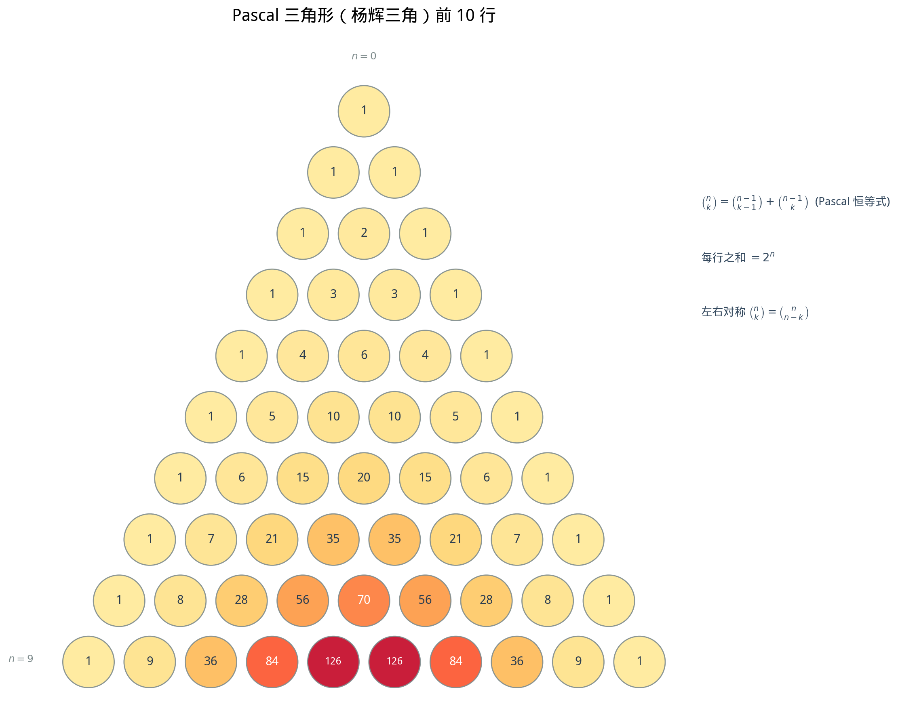
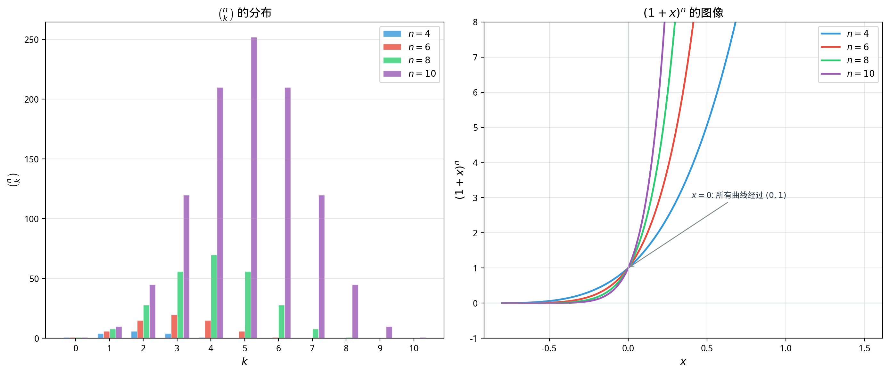

# §1 二项式定理（Binomial Theorem）

**前置知识**：[Ch02 §2 组合](../ch02-permutations-combinations/02-combinations.md)（组合数 $\binom{n}{k}$、Pascal 恒等式）、[Part 1 第 3 章 证明方法](../../part-01-foundations/ch03-proofs/README.md)（数学归纳法）、[Part 3 第 1 章 代数运算](../../part-03-algebra/ch01-operations/README.md)（多项式展开）

**全景图**：二项式定理是连接代数与组合数学的核心定理——它将 $(a+b)^n$ 的展开与组合数 $\binom{n}{k}$ 联系起来。本节先从低次的直接展开出发发现规律，然后用数学归纳法严格证明，最后展示一系列令人惊叹的应用：通过代入特殊值推导组合恒等式、提取特定系数、以及用 $(1+x)^n$ 进行近似计算。

**预估学习时间**：约 5–6 小时

---

## 动机

我们都知道：

$$(a+b)^2 = a^2 + 2ab + b^2$$

$$(a+b)^3 = a^3 + 3a^2 b + 3ab^2 + b^3$$

观察系数：$(a+b)^2$ 的系数是 $1, 2, 1$；$(a+b)^3$ 的系数是 $1, 3, 3, 1$。这不正是 Pascal 三角形的第 $2$ 行和第 $3$ 行吗？

如果这个模式继续下去，$(a+b)^{10}$ 的系数应该是 Pascal 三角形的第 $10$ 行——无需逐步展开就能写出结果。这就是**二项式定理**的力量。

---

## 1. 二项式定理的陈述

### 1.1 定理

> **定理 1**（二项式定理 / Binomial Theorem）
>
> 对任意实数 $a, b$ 和非负整数 $n$：
>
> $$(a+b)^n = \sum_{k=0}^{n} \binom{n}{k} a^{n-k} b^k$$
>
> 即
>
> $$(a+b)^n = \binom{n}{0}a^n + \binom{n}{1}a^{n-1}b + \binom{n}{2}a^{n-2}b^2 + \cdots + \binom{n}{n}b^n$$

展开式共 $n+1$ 项。第 $k$ 项（$k$ 从 $0$ 开始）的系数是 $\binom{n}{k}$，$a$ 的指数从 $n$ 递减到 $0$，$b$ 的指数从 $0$ 递增到 $n$，每项中两个指数之和始终为 $n$。

### 1.2 组合解释

$(a+b)^n = (a+b)(a+b)\cdots(a+b)$（$n$ 个因子的乘积）。

展开时，从每个因子中选 $a$ 或 $b$，$n$ 个选择的乘积构成一项。如果从 $k$ 个因子中选了 $b$，从其余 $n-k$ 个因子中选了 $a$，这一项就是 $a^{n-k}b^k$。

选择"哪 $k$ 个因子贡献 $b$"有 $\binom{n}{k}$ 种方式——所以 $a^{n-k}b^k$ 的系数就是 $\binom{n}{k}$。

---

## 2. 用数学归纳法证明

> **证明**：对 $n$ 用数学归纳法。
>
> **归纳基础**：$n = 0$ 时，$(a+b)^0 = 1 = \binom{0}{0} a^0 b^0$。✓
>
> **归纳假设**：设对 $n = m$ 成立：$(a+b)^m = \sum_{k=0}^{m}\binom{m}{k}a^{m-k}b^k$。
>
> **归纳步骤**：
>
> $$(a+b)^{m+1} = (a+b) \cdot (a+b)^m = (a+b)\sum_{k=0}^{m}\binom{m}{k}a^{m-k}b^k$$
>
> $$= a\sum_{k=0}^{m}\binom{m}{k}a^{m-k}b^k + b\sum_{k=0}^{m}\binom{m}{k}a^{m-k}b^k$$
>
> $$= \sum_{k=0}^{m}\binom{m}{k}a^{m+1-k}b^k + \sum_{k=0}^{m}\binom{m}{k}a^{m-k}b^{k+1}$$
>
> 在第二个和式中令 $j = k+1$（即 $k = j-1$），当 $k = 0$ 时 $j = 1$，当 $k = m$ 时 $j = m+1$：
>
> $$= \sum_{k=0}^{m}\binom{m}{k}a^{m+1-k}b^k + \sum_{j=1}^{m+1}\binom{m}{j-1}a^{m+1-j}b^{j}$$
>
> 分离首尾项并合并中间：
>
> $$= \binom{m}{0}a^{m+1} + \sum_{k=1}^{m}\left[\binom{m}{k} + \binom{m}{k-1}\right]a^{m+1-k}b^k + \binom{m}{m}b^{m+1}$$
>
> 由 Pascal 恒等式 $\binom{m}{k} + \binom{m}{k-1} = \binom{m+1}{k}$：
>
> $$= \binom{m+1}{0}a^{m+1} + \sum_{k=1}^{m}\binom{m+1}{k}a^{m+1-k}b^k + \binom{m+1}{m+1}b^{m+1}$$
>
> $$= \sum_{k=0}^{m+1}\binom{m+1}{k}a^{m+1-k}b^k$$
>
> 这就是 $n = m+1$ 时的二项式定理。$\blacksquare$

---

## 3. Pascal 三角形与二项式系数

### 3.1 Pascal 三角形

Pascal 三角形（也叫杨辉三角，中国数学家杨辉在 1261 年的著作中已经记载）排列了所有的二项式系数：

```
                    1                       n=0
                  1   1                     n=1
                1   2   1                   n=2
              1   3   3   1                 n=3
            1   4   6   4   1               n=4
          1   5  10  10   5   1             n=5
        1   6  15  20  15   6   1           n=6
      1   7  21  35  35  21   7   1         n=7
```



### 3.2 Pascal 三角形的性质

| 性质 | 数学表述 |
|------|----------|
| 边界值为 $1$ | $\binom{n}{0} = \binom{n}{n} = 1$ |
| 左右对称 | $\binom{n}{k} = \binom{n}{n-k}$ |
| 每个数 = 上方两数之和 | $\binom{n}{k} = \binom{n-1}{k-1} + \binom{n-1}{k}$ |
| 每行之和 = $2^n$ | $\sum_{k=0}^{n}\binom{n}{k} = 2^n$ |
| 交替求和 = $0$ | $\sum_{k=0}^{n}(-1)^k\binom{n}{k} = 0$ $(n \geq 1)$ |
| 对角线求和 = Fibonacci 数 | 浅对角线的和为 Fibonacci 数列 |



---

## 4. 低次展开验证

| $n$ | $(a+b)^n$ 展开 | 系数 |
|-----|----------------|------|
| $0$ | $1$ | $1$ |
| $1$ | $a + b$ | $1, 1$ |
| $2$ | $a^2 + 2ab + b^2$ | $1, 2, 1$ |
| $3$ | $a^3 + 3a^2 b + 3ab^2 + b^3$ | $1, 3, 3, 1$ |
| $4$ | $a^4 + 4a^3 b + 6a^2 b^2 + 4ab^3 + b^4$ | $1, 4, 6, 4, 1$ |

---

## 5. 特殊情况

### 5.1 $(1+x)^n$

令 $a = 1$，$b = x$：

$$(1+x)^n = \sum_{k=0}^{n} \binom{n}{k} x^k = 1 + nx + \binom{n}{2}x^2 + \cdots + x^n$$

这是二项式定理最常用的形式——$x^k$ 的系数就是 $\binom{n}{k}$。

### 5.2 $(1-x)^n$

令 $a = 1$，$b = -x$：

$$(1-x)^n = \sum_{k=0}^{n} \binom{n}{k} (-x)^k = \sum_{k=0}^{n} (-1)^k \binom{n}{k} x^k$$

$$= 1 - nx + \binom{n}{2}x^2 - \binom{n}{3}x^3 + \cdots + (-1)^n x^n$$

系数交替正负。

### 5.3 $2^n$

令 $a = b = 1$：

$$2^n = (1+1)^n = \sum_{k=0}^{n} \binom{n}{k}$$

这重新证明了 $n$ 元集合的子集总数为 $2^n$（Ch02 §3 恒等式 1）。

### 5.4 $0^n$

令 $a = 1$，$b = -1$（$n \geq 1$）：

$$0 = (1-1)^n = \sum_{k=0}^{n} (-1)^k \binom{n}{k}$$

偶数位的系数之和等于奇数位的系数之和。

---

## 6. 一般项与系数提取

### 6.1 一般项公式

$(a+b)^n$ 展开式的第 $k+1$ 项（从 $k=0$ 开始的第 $k$ 项）为：

$$T_{k+1} = \binom{n}{k} a^{n-k} b^k$$

### 6.2 例题

> **例 1**（求特定项的系数）
>
> 求 $(2x - 3)^8$ 展开式中 $x^5$ 的系数。

**解**：令 $a = 2x$，$b = -3$，$n = 8$。

$$T_{k+1} = \binom{8}{k}(2x)^{8-k}(-3)^k = \binom{8}{k} 2^{8-k}(-3)^k x^{8-k}$$

$x^5$ 对应 $8 - k = 5$，即 $k = 3$。

$$T_4 = \binom{8}{3} \cdot 2^5 \cdot (-3)^3 = 56 \times 32 \times (-27) = -48{,}384$$

$x^5$ 的系数为 $-48{,}384$。$\blacksquare$

> **例 2**（求常数项）
>
> 求 $\left(x + \dfrac{1}{x}\right)^6$ 展开式中的常数项。

**解**：$a = x$，$b = 1/x$，$n = 6$。

$$T_{k+1} = \binom{6}{k} x^{6-k} \left(\frac{1}{x}\right)^k = \binom{6}{k} x^{6-2k}$$

常数项对应 $6 - 2k = 0$，即 $k = 3$。

$$T_4 = \binom{6}{3} = 20$$

$\blacksquare$

> **例 3**（二项式系数最大值）
>
> $(a+b)^{10}$ 展开式中哪一项的二项式系数最大？

**解**：$\binom{10}{k}$ 在 $k = 5$（$n/2$ 为整数时取中间值）时最大：

$$\binom{10}{5} = 252$$

一般地，$\binom{n}{k}$ 在 $k = \lfloor n/2 \rfloor$ 时取得最大值。$\blacksquare$

---

## 7. 二项式定理的应用

### 7.1 近似计算

当 $|x|$ 很小时，$(1+x)^n \approx 1 + nx$（忽略高次项）。这是**线性近似**。

更精确地：

$$(1+x)^n \approx 1 + nx + \frac{n(n-1)}{2}x^2$$

> **例 4**（近似计算）
>
> 估算 $1.02^{10}$。

**解**：$1.02^{10} = (1 + 0.02)^{10}$，$x = 0.02$，$n = 10$。

线性近似：$\approx 1 + 10 \times 0.02 = 1.2$。

二阶近似：$\approx 1 + 0.2 + \frac{10 \times 9}{2}(0.02)^2 = 1 + 0.2 + 0.018 = 1.218$。

精确值：$1.02^{10} = 1.21899...$，二阶近似的误差不到 $0.001$。$\blacksquare$

### 7.2 整除性

> **例 5**（整除证明）
>
> 证明 $3^n - 1$ 能被 $2$ 整除。

**解**：$3^n = (1+2)^n = 1 + 2n + \binom{n}{2}4 + \cdots$。

$3^n - 1 = 2n + \binom{n}{2}4 + \cdots = 2\left[n + 2\binom{n}{2} + \cdots\right]$。

因此 $2 \mid (3^n - 1)$。$\blacksquare$

> **例 6**（更强的整除性）
>
> 证明 $11^{10} - 1$ 能被 $100$ 整除。

**解**：$11^{10} = (1+10)^{10} = 1 + \binom{10}{1}10 + \binom{10}{2}10^2 + \cdots$。

$11^{10} - 1 = 100 + \binom{10}{2} \cdot 100 + \cdots = 100(1 + 45 + \cdots)$。

因此 $100 \mid (11^{10} - 1)$。$\blacksquare$

### 7.3 组合恒等式的代数推导

二项式定理是证明组合恒等式的"代数机器"：只需在 $(1+x)^n$ 或 $(1+x)^m(1+x)^n$ 中代入特殊值或比较系数。

> **例 7**（推导组合恒等式）
>
> 证明 $\displaystyle\sum_{k=0}^{n} 2^k \binom{n}{k} = 3^n$。

**解**：$(1+x)^n = \sum \binom{n}{k}x^k$。令 $x = 2$：

$$3^n = (1+2)^n = \sum_{k=0}^{n}\binom{n}{k}2^k$$

$\blacksquare$

---

## 8. 二项式系数的性质进阶

### 8.1 吸收恒等式

$$k\binom{n}{k} = n\binom{n-1}{k-1}$$

**证明**：$k \cdot \frac{n!}{k!(n-k)!} = \frac{n!}{(k-1)!(n-k)!} = n \cdot \frac{(n-1)!}{(k-1)!(n-k)!} = n\binom{n-1}{k-1}$。$\blacksquare$

### 8.2 上指标反转

$$\binom{n}{k} = (-1)^k \binom{k-n-1}{k}$$

这个恒等式在推广二项式定理到负指数和实数指数时非常有用（Newton 的广义二项式定理，大学内容）。

---

## 要点回顾

| 概念 | 核心内容 | 公式/关键点 |
|------|----------|-------------|
| 二项式定理 | $(a+b)^n$ 展开 | $\sum \binom{n}{k}a^{n-k}b^k$ |
| 组合解释 | 从 $n$ 个因子中选 $k$ 个贡献 $b$ | 系数 $= \binom{n}{k}$ |
| $(1+x)^n$ | 最常用特例 | $\sum \binom{n}{k}x^k$ |
| $(1-x)^n$ | 交替符号 | $\sum (-1)^k\binom{n}{k}x^k$ |
| 特殊值 | $x=1$：$2^n$；$x=-1$：$0$ | 组合恒等式的来源 |
| 近似 | $\|x\|$ 小时 | $(1+x)^n \approx 1 + nx$ |
| 一般项 | 第 $k+1$ 项 | $T_{k+1} = \binom{n}{k}a^{n-k}b^k$ |

**核心思想**：二项式定理 = 组合选择的代数化身。展开 $(a+b)^n$ 就是枚举所有"从 $n$ 个因子中选若干个贡献 $b$"的方式。

---

## 进度检查点

在继续学习 §2（多项式定理）之前，请确保你能：

- [ ] 陈述和证明二项式定理
- [ ] 展开 $(a+b)^n$ 的任意项并提取系数
- [ ] 利用特殊值 $x = 1, -1, 2$ 等推导组合恒等式
- [ ] 用二项式定理做近似计算
- [ ] 用二项式定理证明整除性质

---

## 自测题

**1.** 展开 $(x + 2)^5$。

<details>
<summary>答案</summary>

$$\sum_{k=0}^{5}\binom{5}{k}x^{5-k}2^k = x^5 + 10x^4 + 40x^3 + 80x^2 + 80x + 32$$
</details>

**2.** 求 $(3x - 1)^7$ 中 $x^4$ 项的系数。

<details>
<summary>答案</summary>

$k = 3$（$b = -1$ 的指数），$T_4 = \binom{7}{3}(3x)^4(-1)^3 = 35 \times 81 \times (-1) = -2835$。

$x^4$ 的系数为 $-2835$。
</details>

**3.** 用二项式定理证明 $\sum_{k=0}^{n}\binom{n}{k}3^k = 4^n$。

<details>
<summary>答案</summary>

$(1+3)^n = \sum_{k=0}^{n}\binom{n}{k}3^k = 4^n$。$\blacksquare$
</details>

---

## 习题引用

本节的练习题见 [练习题](exercises/exercises.md) 的 §1 部分。
