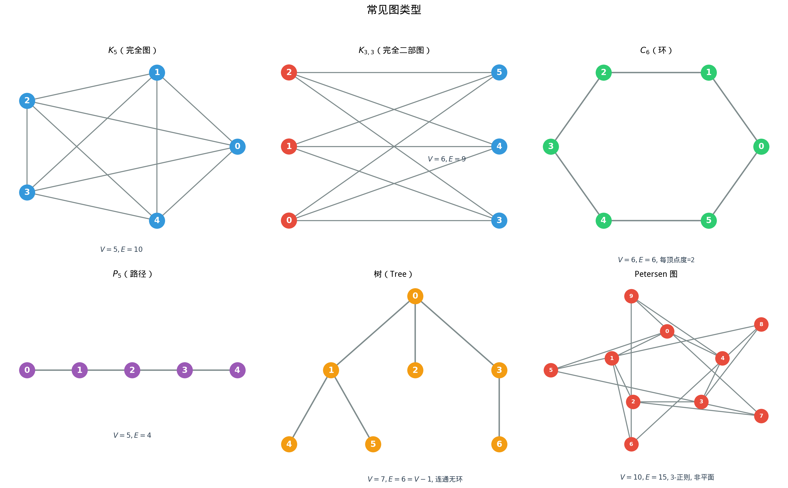

# §1 图的基本概念（Graph Basics）

**前置知识**：[Part 1 第 2 章 集合](../../part-01-foundations/ch02-sets/README.md)（集合运算）、[Ch01 §1 加法原理与乘法原理](../ch01-counting/01-addition-multiplication.md)（计数基础）

**全景图**：图（graph）是描述对象之间关系的数学模型——用"点"代表对象，用"线"代表关系。本节从图的形式化定义出发，建立顶点、边、度等基本概念，证明握手定理（所有顶点度数之和等于边数的两倍），介绍邻接矩阵表示法，然后系统认识几类重要的特殊图。

**预估学习时间**：约 4–5 小时

---

## 动机

考虑以下问题：

- 一个城市有若干路口（交叉点），路口之间有道路连接。如何用数学描述这个交通网络？
- 社交媒体上 $n$ 个用户之间的"关注"关系如何表示？
- 一组化学反应中，哪些物质可以互相转化？

这些问题的共同特点是：有一组**对象**，对象之间有**关系**。**图**就是描述这种结构的数学语言。

---

## 1. 图的定义

### 1.1 无向图

> **定义 1**（无向图）
>
> 一个**无向图**（undirected graph）$G = (V, E)$ 由以下两部分组成：
>
> - **顶点集** $V$（vertex set）：一个有限非空集合，元素称为**顶点**（vertex，复数 vertices）
> - **边集** $E$（edge set）：$V$ 中无序二元子集的集合，元素称为**边**（edge）
>
> 边 $\{u, v\}$（简写为 $uv$ 或 $vu$）表示顶点 $u$ 和 $v$ 之间有连接。

**例子**：$V = \{a, b, c, d\}$，$E = \{ab, ac, bc, cd\}$ 定义了一个有 $4$ 个顶点和 $4$ 条边的图。

### 1.2 有向图

> **定义 2**（有向图）
>
> 一个**有向图**（directed graph / digraph）$G = (V, E)$ 中，边集 $E$ 是**有序对**的集合。边 $(u, v)$ 表示从 $u$ 到 $v$ 的有向连接（$u$ 是起点，$v$ 是终点）。

有向图适用于非对称关系：如"关注"（A 关注 B 不意味着 B 关注 A）、"前置课程"等。

### 1.3 加权图

> **定义 3**（加权图）
>
> **加权图**（weighted graph）是在每条边上赋予一个数值（权重）的图。权重可以表示距离、费用、容量等。

### 1.4 简单图与多重图

- **简单图**（simple graph）：没有自环（连接顶点到自身的边）和多重边（两顶点间多条边）的图。
- **多重图**（multigraph）：允许多重边的图。
- **伪图**（pseudograph）：允许自环和多重边的图。

本章主要讨论**简单无向图**，除非特别说明。

---

## 2. 度（Degree）

### 2.1 定义

> **定义 4**（顶点的度）
>
> 在无向图中，顶点 $v$ 的**度**（degree），记为 $\deg(v)$，是与 $v$ 相连的边的数目。

等价地，$\deg(v)$ 是 $v$ 的**邻居**（neighbor）的个数（在简单图中）。

**特殊情况**：
- $\deg(v) = 0$：$v$ 是**孤立顶点**（isolated vertex）
- $\deg(v) = 1$：$v$ 是**悬挂顶点**（pendant vertex / leaf）

### 2.2 有向图的度

在有向图中，每个顶点有两种度：
- **入度**（in-degree）$\deg^-(v)$：指向 $v$ 的边数
- **出度**（out-degree）$\deg^+(v)$：从 $v$ 出发的边数

---

## 3. 握手定理（Handshaking Lemma）

### 3.1 定理

> **定理 1**（握手定理）
>
> 在任意无向图 $G = (V, E)$ 中：
>
> $$\sum_{v \in V} \deg(v) = 2|E|$$
>
> 即所有顶点的度数之和等于边数的两倍。

**证明**：每条边 $\{u, v\}$ 对 $\deg(u)$ 和 $\deg(v)$ 各贡献 $1$，因此对总度数贡献 $2$。$|E|$ 条边共贡献 $2|E|$。$\blacksquare$

### 3.2 推论

> **推论 1**：在任意图中，度数为奇数的顶点个数是偶数。

**证明**：$\sum \deg(v) = 2|E|$ 是偶数。偶度顶点的贡献是偶数，因此奇度顶点的贡献也必须是偶数——这要求奇度顶点的个数是偶数。$\blacksquare$

### 3.3 例题

> **例 1**（验证握手定理）
>
> 某图有 $5$ 个顶点，度数分别为 $2, 3, 3, 4, 2$。求边数。

**解**：$\sum \deg(v) = 2 + 3 + 3 + 4 + 2 = 14 = 2|E|$，$|E| = 7$。$\blacksquare$

> **例 2**（不可能的度序列）
>
> 是否存在一个有 $5$ 个顶点的简单图，度数分别为 $1, 2, 3, 4, 5$？

**解**：$\sum \deg = 15$ 是奇数，不等于 $2|E|$（偶数）。不存在。$\blacksquare$

> **例 3**（聚会问题）
>
> 一场聚会上，每个人与不同人握手若干次。证明不可能每个人的握手次数都不相同。

**解**：设有 $n$ 人，度数可能取值 $0, 1, \ldots, n-1$。但 $0$ 和 $n-1$ 不能同时出现（如果有人和所有人都握了手，就不可能有人和谁都没握手）。因此 $n$ 个度数最多取 $n-1$ 个不同值——由鸽巢原理，至少两人的握手次数相同。$\blacksquare$

---

## 4. 邻接矩阵（Adjacency Matrix）

### 4.1 定义

> **定义 5**（邻接矩阵）
>
> 设图 $G$ 有 $n$ 个顶点 $v_1, v_2, \ldots, v_n$。$G$ 的**邻接矩阵** $A$ 是 $n \times n$ 矩阵，其中
>
> $$A_{ij} = \begin{cases} 1 & \text{若 } v_i v_j \in E \\ 0 & \text{若 } v_i v_j \notin E \end{cases}$$

对无向图，$A$ 是对称矩阵（$A_{ij} = A_{ji}$）。对角线全为 $0$（简单图无自环）。

### 4.2 性质

- 第 $i$ 行（或第 $i$ 列）的元素之和等于 $\deg(v_i)$。
- $A^2$ 的 $(i,j)$ 元素等于从 $v_i$ 到 $v_j$ 的长度为 $2$ 的路径数。
- 一般地，$A^k$ 的 $(i,j)$ 元素等于从 $v_i$ 到 $v_j$ 的长度为 $k$ 的途径数。

### 4.3 例题

> **例 4**（写出邻接矩阵）
>
> 图 $G$：$V = \{1, 2, 3, 4\}$，$E = \{12, 13, 23, 34\}$。

$$A = \begin{pmatrix} 0 & 1 & 1 & 0 \\ 1 & 0 & 1 & 0 \\ 1 & 1 & 0 & 1 \\ 0 & 0 & 1 & 0 \end{pmatrix}$$

$\deg(1) = 2$，$\deg(2) = 2$，$\deg(3) = 3$，$\deg(4) = 1$。$\sum \deg = 8 = 2 \times 4$。✓ $\blacksquare$

---

## 5. 特殊图（Special Graphs）

### 5.1 完全图 $K_n$

$n$ 个顶点，每两个顶点之间都有一条边。边数 $= \binom{n}{2} = \frac{n(n-1)}{2}$。每个顶点度数为 $n-1$。

$K_1$（一个点），$K_2$（一条边），$K_3$（三角形），$K_4$（四面体的骨架），$K_5$（$10$ 条边）。

### 5.2 二部图（Bipartite Graph）

> **定义 6**（二部图）
>
> 如果图 $G$ 的顶点集可以分成两个不相交的集合 $X$ 和 $Y$，使得每条边都连接 $X$ 中的顶点和 $Y$ 中的顶点，则 $G$ 是**二部图**。

如果 $X$ 中每个顶点都与 $Y$ 中每个顶点相连，则称为**完全二部图** $K_{m,n}$（$|X| = m$，$|Y| = n$），边数 $= mn$。

> **定理 2**（二部图的判定）
>
> 图 $G$ 是二部图当且仅当 $G$ 不含奇环（长度为奇数的环）。

### 5.3 环 $C_n$ 和路径 $P_n$

- **环** $C_n$：$n$ 个顶点 $v_1, v_2, \ldots, v_n$ 首尾相连成一个圈。每个顶点度数为 $2$，边数 $= n$。
- **路径** $P_n$：$n$ 个顶点的路径，边数 $= n - 1$。两端顶点度数 $1$，中间顶点度数 $2$。

### 5.4 树（Tree）

> **定义 7**（树）
>
> **树**（tree）是连通的无环图。

树的基本性质：
- $n$ 个顶点的树恰好有 $n - 1$ 条边。
- 任意两个顶点之间恰好有一条路径。
- 删除任何一条边都会使图不连通。
- 添加任何一条边都会产生恰好一个环。

**Cayley 公式**（不证明）：$n$ 个有标号顶点的树的个数为 $n^{n-2}$。例如 $3$ 个顶点有 $3^1 = 3$ 棵不同的有标号树。

---

## 6. 连通性（Connectivity）

### 6.1 路径与连通

> **定义 8**
>
> - **路径**（path）：一系列不重复的顶点 $v_0, v_1, \ldots, v_k$，其中每对相邻顶点 $v_i v_{i+1}$ 都是边。路径长度为 $k$。
> - 图 $G$ 是**连通的**（connected）：如果任意两个顶点之间都存在路径。
> - **连通分量**（connected component）：极大的连通子图。

### 6.2 例题

> **例 5**（连通分量）
>
> 图 $G$ 有 $6$ 个顶点：$V = \{1, 2, 3, 4, 5, 6\}$，$E = \{12, 23, 45\}$。
>
> 连通分量为 $\{1, 2, 3\}$、$\{4, 5\}$、$\{6\}$，共 $3$ 个连通分量。

### 6.3 边数与连通性

> **命题**：$n$ 个顶点的连通图至少有 $n - 1$ 条边（树是"最稀疏"的连通图）。

---

## 7. 同构（Graph Isomorphism）

> **定义 9**
>
> 两个图 $G_1 = (V_1, E_1)$ 和 $G_2 = (V_2, E_2)$ 是**同构的**（isomorphic），如果存在双射 $f: V_1 \to V_2$ 使得 $uv \in E_1 \Leftrightarrow f(u)f(v) \in E_2$。

直觉上，同构的图"形状相同"，只是顶点的标签不同。

**判断非同构的常用不变量**：
- 顶点数和边数
- 度序列（所有顶点度数的排序列表）
- 连通分量数
- 是否含有某种子图（如三角形）

> **例 6**
>
> 两个图都有 $4$ 个顶点、$4$ 条边，度序列都是 $(2, 2, 2, 2)$。一个是 $C_4$（四环），另一个是"$K_4$ 减两条不相邻的边"。但 $C_4$ 没有三角形而后者有，所以它们不同构。

---

## 要点回顾

| 概念 | 核心内容 | 关键公式/判定 |
|------|----------|---------------|
| 图 | 顶点 + 边 | $G = (V, E)$ |
| 度 | 与顶点相连的边数 | $\deg(v)$ |
| 握手定理 | 度数之和 = $2 \times$ 边数 | $\sum \deg(v) = 2\|E\|$ |
| 邻接矩阵 | 矩阵表示图 | $A_{ij} = 1$ 当 $v_iv_j \in E$ |
| 完全图 $K_n$ | 两两相连 | $\|E\| = \binom{n}{2}$ |
| 二部图 | 无奇环 | 顶点分两组 |
| 树 | 连通无环 | $\|E\| = \|V\| - 1$ |

---

## 进度检查点

在继续学习 §2（Euler 路径与 Hamilton 路径）之前，请确保你能：

- [ ] 准确定义图及其基本术语
- [ ] 计算顶点的度并验证握手定理
- [ ] 写出简单图的邻接矩阵
- [ ] 识别完全图、二部图、环、路径和树
- [ ] 判断图的连通性和连通分量数

---

## 自测题

**1.** 一个图有 $7$ 个顶点，每个顶点的度数为 $4$。这个图有多少条边？

答案

$\sum \deg = 7 \times 4 = 28 = 2|E|$，$|E| = 14$。

**2.** $K_6$（$6$ 个顶点的完全图）有多少条边？每个顶点的度数是多少？

答案

$|E| = \binom{6}{2} = 15$。每个顶点度数 $= 5$。

**3.** 是否存在度序列为 $(1, 2, 2, 3, 3, 3)$ 的简单图？

答案

$\sum \deg = 1 + 2 + 2 + 3 + 3 + 3 = 14 = 2 \times 7$。度数之和为偶数，边数 $= 7$，$6$ 个顶点。最大度 $3 \leq 5 = n - 1$。✓ 存在性需要构造验证——确实可以构造这样的图。

---

## 习题引用

本节的练习题见 [练习题](exercises/exercises.md) 的 §1 部分。
