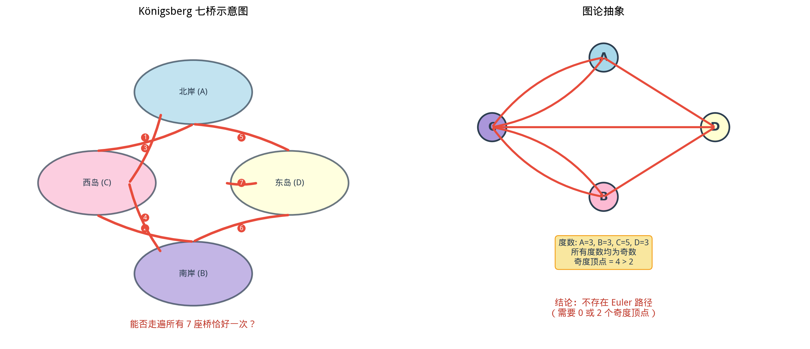

# §2 Euler 路径与 Hamilton 路径（Euler & Hamilton Paths）

**前置知识**：[本章 §1 图的基本概念](01-graph-basics.md)（图的定义、度、连通性、特殊图）、[Part 1 第 3 章 证明方法](../../part-01-foundations/ch03-proofs/README.md)（数学归纳法、反证法）

**全景图**：本节研究图论中两个最经典的问题——**Euler 路径**（能否不重复地走过每条边？）和 **Hamilton 路径**（能否不重复地走过每个顶点？）。这两个问题看似相似，难度却截然不同：Euler 路径有简洁的充要条件（Euler 定理），Hamilton 路径的判定却是 NP 完全问题。本节还将引入**平面图**（planar graph）和 Euler 的优美公式 $V - E + F = 2$。

**预估学习时间**：约 4–5 小时

---

## 动机

$1736$ 年，Euler 面对一个有趣的问题：普鲁士的 Königsberg 城有七座桥连接被 Pregel 河分隔的四块陆地。市民们问：是否能从某处出发，恰好经过每座桥一次后回到起点？

Euler 将这个实际问题抽象为图论问题：把四块陆地看作 $4$ 个顶点，七座桥看作 $7$ 条边。问题变成：这个图是否存在一条经过所有边恰好一次的回路？

Euler 证明答案是**不可能**——因为每个顶点的度数都是奇数。这个结论开创了图论这门学科。

---

## 1. Euler 路径与 Euler 回路

### 1.1 定义

> **定义 1**
>
> - **Euler 路径**（Euler path / Eulerian trail）：经过图中每条边恰好一次的路径。
> - **Euler 回路**（Euler circuit / Eulerian circuit）：经过图中每条边恰好一次并回到起点的闭合路径。
> - 具有 Euler 回路的图称为 **Euler 图**（Eulerian graph）。

### 1.2 Euler 定理

> **定理 1**（Euler 定理，连通无向图版本）
>
> 设 $G$ 是连通无向图。
>
> (a) $G$ 有 **Euler 回路** $\Leftrightarrow$ 每个顶点的度数为偶数。
>
> (b) $G$ 有 **Euler 路径**（但非回路） $\Leftrightarrow$ 恰好有 $2$ 个顶点的度数为奇数。（此时 Euler 路径必须以这两个奇度顶点为端点。）

### 1.3 必要性证明

**(a) Euler 回路 $\Rightarrow$ 所有度为偶数**：

在 Euler 回路中，每次经过某顶点时进入一次、离开一次，消耗该顶点的 $2$ 度。起始/终止顶点同样如此（出发消耗 $1$ 度，最后回来消耗 $1$ 度）。因此所有边被消耗后，每个顶点的度恰好被成对消耗，度为偶数。$\blacksquare$

**(b) Euler 路径（非回路）$\Rightarrow$ 恰有 $2$ 个奇度顶点**：

起点出发消耗 $1$ 度，之后每次经过消耗 $2$ 度，最后不返回——总消耗为奇数。终点同理。其他顶点每次经过消耗 $2$ 度，总消耗为偶数。$\blacksquare$

### 1.4 充分性证明（Euler 回路，构造法思路）

充分性的标准证明使用**构造法**（Hierholzer 算法，1873）：

1. 从任意顶点出发，沿边行走，每条边最多走一次，直到无法继续——因为所有度为偶数，你一定回到起点（形成一个环 $C_1$）。
2. 如果 $C_1$ 不包含所有边，则 $C_1$ 上必有某顶点 $v$ 与 $C_1$ 外的边相连（因为 $G$ 连通）。从 $v$ 出发在剩余边上重复上述过程，得到环 $C_2$。
3. 将 $C_2$ 嵌入 $C_1$（在 $v$ 处）。重复，直到覆盖所有边。

每步的关键：删除已走的边后，剩余图的每个顶点度数仍为偶数（因为每走一条边，两个端点各减少 $1$ 度，奇偶性同步变化）。

### 1.5 例题

> **例 1**（Königsberg 七桥）
>
> Königsberg 图有 $4$ 个顶点，度数分别为 $3, 3, 3, 5$——全部是奇数。
>
> 奇度顶点有 $4$ 个 $> 2$，因此既无 Euler 回路也无 Euler 路径。$\blacksquare$

> **例 2**（一笔画）
>
> 某图有 $5$ 个顶点，度数分别为 $2, 2, 2, 3, 3$。能否一笔画（即存在 Euler 路径）？
>
> 奇度顶点有 $2$ 个（度数为 $3$ 的两个），因此**存在 Euler 路径**（以这两个顶点为端点）。但不存在 Euler 回路。$\blacksquare$

> **例 3**（完全图的 Euler 回路）
>
> $K_n$ 何时有 Euler 回路？
>
> $K_n$ 连通，每个顶点度 $= n-1$。所有度为偶数 $\Leftrightarrow n - 1$ 为偶数 $\Leftrightarrow n$ 为奇数。
>
> $K_3, K_5, K_7, \ldots$ 有 Euler 回路；$K_2, K_4, K_6, \ldots$ 没有。$\blacksquare$

---

## 2. Hamilton 路径与 Hamilton 回路

### 2.1 定义

> **定义 2**
>
> - **Hamilton 路径**（Hamiltonian path）：经过图中每个顶点恰好一次的路径。
> - **Hamilton 回路**（Hamiltonian cycle）：经过每个顶点恰好一次并回到起点的回路。
> - 具有 Hamilton 回路的图称为 **Hamilton 图**（Hamiltonian graph）。

**Euler 路径 vs Hamilton 路径**：

| | Euler | Hamilton |
|---|---|---|
| 走过所有… | **边** | **顶点** |
| 判定难度 | 简单（多项式时间） | 困难（NP 完全） |
| 充要条件 | 有（Euler 定理） | 没有简单的充要条件 |

### 2.2 Dirac 定理

> **定理 2**（Dirac 定理，1952）
>
> 设 $G$ 是有 $n$ 个顶点（$n \geq 3$）的简单图。如果每个顶点的度 $\deg(v) \geq n/2$，则 $G$ 有 Hamilton 回路。

这是一个**充分条件**（但非必要条件）。度数条件不满足时，图仍可能有 Hamilton 回路。

**注意**：$K_n$（$n \geq 3$）的每个顶点度 $= n - 1 \geq n/2$，因此 $K_n$ 有 Hamilton 回路。

### 2.3 Ore 定理

> **定理 3**（Ore 定理，1960）
>
> 设 $G$ 是有 $n$ 个顶点（$n \geq 3$）的简单图。如果对每对不相邻的顶点 $u, v$ 都有 $\deg(u) + \deg(v) \geq n$，则 $G$ 有 Hamilton 回路。

Ore 定理比 Dirac 定理更强（Dirac 定理是 Ore 定理的推论）。

### 2.4 NP 完全性

Hamilton 回路问题是计算复杂性理论中的经典 **NP 完全问题**：

- 目前没有已知的多项式时间算法来判定一般图是否有 Hamilton 回路。
- 如果能找到这样的算法，就证明了 $P = NP$——这是计算机科学中最大的未解决问题之一。

### 2.5 例题

> **例 4**（应用 Dirac 定理）
>
> 某图有 $8$ 个顶点，每个顶点度数 $\geq 4$。是否一定有 Hamilton 回路？
>
> $n/2 = 4$，$\deg(v) \geq 4 = n/2$。由 Dirac 定理，一定有 Hamilton 回路。$\blacksquare$

> **例 5**（Petersen 图）
>
> Petersen 图是一个有 $10$ 个顶点、$15$ 条边的正则图（每个顶点度 $= 3$）。它**没有** Hamilton 回路（虽然证明并不简单），但**有** Hamilton 路径。这说明 Dirac 条件是充分但非必要的。

---

## 3. 平面图（Planar Graphs）

### 3.1 定义

> **定义 3**（平面图）
>
> 如果图 $G$ 可以画在平面上使得边不交叉（除在端点处），则 $G$ 是**平面图**（planar graph）。这样的画法称为 $G$ 的一个**平面嵌入**（planar embedding）。

直觉上，平面图就是可以"不交叉地画出来"的图。

### 3.2 面（Face）

在平面图的平面嵌入中，边将平面分成若干区域，每个区域称为一个**面**（face）。包括一个无界的**外部面**（outer face）。

### 3.3 Euler 公式

> **定理 4**（Euler 公式，1750）
>
> 对任意连通平面图，设 $V$ = 顶点数，$E$ = 边数，$F$ = 面数。则
>
> $$V - E + F = 2$$

这是一个深刻而优美的结果——无论平面图怎么画，$V - E + F$ 始终等于 $2$。

### 3.4 Euler 公式的证明

**证明**（对边数 $E$ 归纳）：

**归纳基础**：$E = 0$。连通图只有一个顶点（$V = 1$），没有边（$E = 0$），只有一个面——外部面（$F = 1$）。$V - E + F = 1 - 0 + 1 = 2$。✓

**归纳步骤**：设对 $E - 1$ 条边的连通平面图成立。考虑 $E$ 条边的连通平面图 $G$。

- **情况 1**：$G$ 有环边 $e$（不是割边且两侧面不同）。$e$ 的两侧是两个不同的面。删除 $e$，顶点数不变，边数减 $1$，两个面合并为一个，面数减 $1$。由归纳假设，$V - (E-1) + (F-1) = 2$，即 $V - E + F = 2$。✓

- **情况 2**：$G$ 是树（无环）。$E = V - 1$，$F = 1$（只有外部面）。$V - (V-1) + 1 = 2$。✓

对于一般情况：如果 $G$ 含环，则存在非桥边 $e$（删去后图仍连通）。删除 $e$：$V$ 不变，$E$ 减 $1$，$e$ 的两侧面合并（$F$ 减 $1$）。由归纳假设 $(V) - (E-1) + (F-1) = 2$，即 $V - E + F = 2$。如果 $G$ 无环（即 $G$ 是树），直接验证。$\blacksquare$

### 3.5 Euler 公式的推论

> **推论 2**：对 $V \geq 3$ 的简单连通平面图：$E \leq 3V - 6$。

**证明**：每个面至少被 $3$ 条边围住。每条边最多被 $2$ 个面共享。因此 $3F \leq 2E$，即 $F \leq 2E/3$。

代入 Euler 公式：$2 = V - E + F \leq V - E + 2E/3 = V - E/3$。

$E \leq 3V - 6$。$\blacksquare$

> **推论 3**：$K_5$ 不是平面图。

**证明**：$K_5$ 有 $V = 5$，$E = 10$。$3V - 6 = 9 < 10 = E$。违反推论 2。$\blacksquare$

> **推论 4**（二部图版本）：对简单连通二部平面图（$V \geq 3$）：$E \leq 2V - 4$。

**证明**：二部图无三角形，每个面至少 $4$ 条边，$4F \leq 2E$，$F \leq E/2$。$2 = V - E + F \leq V - E/2$，$E \leq 2V - 4$。$\blacksquare$

> **推论 5**：$K_{3,3}$ 不是平面图。

**证明**：$K_{3,3}$ 有 $V = 6$，$E = 9$。$2V - 4 = 8 < 9 = E$。违反推论 4。$\blacksquare$

### 3.6 例题

> **例 6**（验证 Euler 公式）
>
> 正方体的骨架图（$8$ 个顶点，$12$ 条边）画在平面上。面数？
>
> $V - E + F = 2$，$8 - 12 + F = 2$，$F = 6$。
>
> 正好对应正方体的 $6$ 个面。$\blacksquare$

> **例 7**（正多面体）
>
> 利用 Euler 公式证明正多面体只有 $5$ 种。

**解**（思路）：设正多面体每个面有 $p$ 条边，每个顶点连 $q$ 条边。$pF = 2E$（每条边被 $2$ 个面共享），$qV = 2E$（握手定理）。

代入 Euler 公式 $V - E + F = 2$：

$$\frac{2E}{q} - E + \frac{2E}{p} = 2$$

$$\frac{1}{q} + \frac{1}{p} = \frac{1}{2} + \frac{1}{E} > \frac{1}{2}$$

$p, q \geq 3$。满足 $\frac{1}{p} + \frac{1}{q} > \frac{1}{2}$ 的整数对 $(p, q)$：

$(3,3)$：四面体，$(3,4)$：八面体，$(4,3)$：立方体，$(3,5)$：二十面体，$(5,3)$：十二面体。

共 $5$ 种。$\blacksquare$

---

## 4. Kuratowski 定理

### 4.1 定理陈述

> **定理 5**（Kuratowski 定理，1930）
>
> 图 $G$ 是平面图当且仅当 $G$ 不含与 $K_5$ 或 $K_{3,3}$ **同胚**（homeomorphic）的子图。

两个图**同胚**意味着它们可以通过在边上添加/删除度为 $2$ 的顶点相互转化。

### 4.2 意义

Kuratowski 定理给出了平面图的**完全刻画**——$K_5$ 和 $K_{3,3}$ 是平面图的"最小障碍"。任何非平面图都"包含"这两种结构之一。

等价表述（Wagner 定理，1937）：图 $G$ 是平面图当且仅当 $G$ 不含 $K_5$ 或 $K_{3,3}$ 作为**子式**（minor）。

---

## 要点回顾

| 概念 | 核心内容 | 判定条件/公式 |
|------|----------|---------------|
| Euler 路径 | 每条边恰好经过一次 | 恰好 $0$ 或 $2$ 个奇度顶点 |
| Euler 回路 | Euler 路径 + 回到起点 | 所有顶点度为偶数 |
| Hamilton 路径 | 每个顶点恰好经过一次 | 无简单充要条件（NP 完全） |
| Dirac 定理 | Hamilton 回路的充分条件 | $\deg(v) \geq n/2$ |
| 平面图 | 可无交叉地画在平面上 | 不含 $K_5, K_{3,3}$ 的子式 |
| Euler 公式 | 平面图的拓扑不变量 | $V - E + F = 2$ |

**核心对比**：Euler 问题（每条边走一次）和 Hamilton 问题（每个顶点走一次）形似神异——前者有优雅的判定条件，后者在计算上本质困难。

---

## 进度检查点

在进入 Part 7 总结之前，请确保你能：

- [ ] 判定图是否有 Euler 路径或 Euler 回路
- [ ] 解释 Königsberg 七桥问题为何无解
- [ ] 区分 Euler 路径和 Hamilton 路径
- [ ] 运用 Dirac 定理判定 Hamilton 回路
- [ ] 陈述和应用 Euler 公式 $V - E + F = 2$
- [ ] 证明 $K_5$ 和 $K_{3,3}$ 不是平面图

---

## 自测题

**1.** 某图有 $6$ 个顶点，度数分别为 $2, 2, 4, 4, 4, 4$。是否存在 Euler 回路？

答案

所有度数为偶数。如果图是连通的，则存在 Euler 回路。（需要验证连通性。）

**2.** $K_4$（$4$ 个顶点的完全图）是否有 Euler 路径？Hamilton 回路？

答案

$K_4$：每个顶点度 $= 3$（奇数），奇度顶点 $4$ 个 $> 2$，无 Euler 路径，也无 Euler 回路。

$K_4$ 有 $4$ 个顶点，$\deg(v) = 3 \geq 4/2 = 2$。由 Dirac 定理，有 Hamilton 回路。（也可直接构造：$1 \to 2 \to 3 \to 4 \to 1$。）

**3.** 一个连通平面图有 $10$ 个顶点和 $15$ 条边。它有多少个面？

答案

$V - E + F = 2$，$10 - 15 + F = 2$，$F = 7$。

---

## 习题引用

本节的练习题见 [练习题](exercises/exercises.md) 的 §2 部分。
