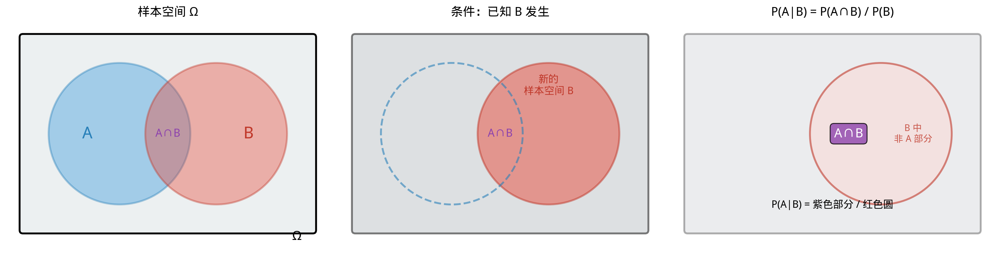

# §1 条件概率与乘法规则（Conditional Probability & Multiplication Rule）

**前置知识**：[Part 8 第 1 章 概率公理](../ch01-axioms/README.md)（样本空间、事件、概率公理、概率的性质）、[Part 1 第 2 章 集合](../../part-01-foundations/ch02-sets/README.md)（集合的交集、并集）

**全景图**：在很多实际问题中，我们已经掌握了**部分信息**，需要据此更新对事件概率的判断。条件概率正是处理"已知某些事情发生后"概率如何变化的工具。本节定义条件概率，推导乘法规则，并引入全概率公式——将复杂事件的概率通过"分类讨论"化简。这些工具是 Bayes 定理（§2）的直接基础。

**预估学习时间**：约 3–4 小时

---

## 动机

医生告诉你一个检测结果为阳性。你该担心多少？

这取决于**条件概率**——在检测为阳性的条件下，你真的患病的概率是多少？直觉往往在这类问题上出错——很多人会混淆"患病者检测阳性的概率"和"检测阳性者患病的概率"。

条件概率的数学定义帮助我们精确地回答这类问题，避免直觉的陷阱。

---

## 1. 条件概率的定义（Definition of Conditional Probability）

### 1.1 直觉

掷一个公平骰子。在没有任何信息的情况下，掷出 $6$ 的概率是 $1/6$。

现在告诉你"结果是偶数"。在这个信息下，掷出 $6$ 的概率是多少？

偶数只有 $\{2, 4, 6\}$ 三种可能，其中 $6$ 是一种。所以概率变成了 $1/3$。

这就是条件概率的直觉：**信息缩小了样本空间**。

### 1.2 精确定义

> **定义 1**（条件概率）
>
> 设 $A$ 和 $B$ 是两个事件，且 $P(B) > 0$。在事件 $B$ 发生的条件下，事件 $A$ 发生的**条件概率**（conditional probability）定义为
>
> $$P(A \mid B) = \frac{P(A \cap B)}{P(B)}$$

读作"在 $B$ 的条件下 $A$ 的概率"或"给定 $B$ 时 $A$ 的概率"。

### 1.3 直觉解释

条件概率的公式可以这样理解：

$$P(A \mid B) = \frac{P(A \cap B)}{P(B)} = \frac{\text{$A$ 和 $B$ 同时发生的概率}}{\text{$B$ 发生的概率}}$$

已知 $B$ 发生后，新的"样本空间"缩小为 $B$。在这个缩小的样本空间中，$A$ 发生的"比例"就是 $P(A \cap B) / P(B)$。

### 1.4 古典概型中的条件概率

在古典概型中，条件概率有特别简洁的形式：

$$P(A \mid B) = \frac{P(A \cap B)}{P(B)} = \frac{|A \cap B| / |\Omega|}{|B| / |\Omega|} = \frac{|A \cap B|}{|B|}$$

即"$B$ 中属于 $A$ 的样本点个数"除以"$B$ 的样本点个数"。

> **例 1**（掷骰子）
>
> 掷一个公平骰子。已知结果大于 $3$，求结果为偶数的概率。

**解**：$B = \{4, 5, 6\}$（大于 $3$），$A = \{2, 4, 6\}$（偶数），$A \cap B = \{4, 6\}$。

$$P(A \mid B) = \frac{|A \cap B|}{|B|} = \frac{2}{3} \quad \blacksquare$$

### 1.5 条件概率是一个概率

> **命题 1**：固定事件 $B$（$P(B) > 0$），则 $Q(A) = P(A \mid B)$ 满足 Kolmogorov 三条公理。

**验证**：

1. $Q(A) = P(A \cap B)/P(B) \geq 0$ ✓
2. $Q(\Omega) = P(\Omega \cap B)/P(B) = P(B)/P(B) = 1$ ✓
3. 若 $A_1, A_2, \ldots$ 两两互斥，则 $(A_i \cap B)$ 也两两互斥。$Q(\bigcup A_i) = P((\bigcup A_i) \cap B)/P(B) = \sum P(A_i \cap B)/P(B) = \sum Q(A_i)$ ✓

因此，条件概率本身也是一个"合法的"概率——Ch01 中推导的所有概率性质（补集、加法公式等）对条件概率同样成立。

---

## 2. 乘法规则（Multiplication Rule）

### 2.1 两个事件

将条件概率的定义移项，得到**乘法规则**：

> **定理 1**（乘法规则）
>
> $$P(A \cap B) = P(B) \cdot P(A \mid B)$$
>
> 等价地，$P(A \cap B) = P(A) \cdot P(B \mid A)$（当 $P(A) > 0$）。

这个公式的含义是："$A$ 和 $B$ 同时发生的概率 = $B$ 先发生的概率 × 在 $B$ 发生的条件下 $A$ 再发生的概率"。

> **例 2**（不放回抽球）
>
> 袋中有 $6$ 个红球和 $4$ 个蓝球。先后不放回地抽两个球，求两个都是红球的概率。

**解**：设 $A_1$ = "第一个红"，$A_2$ = "第二个红"。

$P(A_1) = 6/10 = 3/5$。

$P(A_2 \mid A_1) = 5/9$（第一个抽到红球后，剩 $5$ 红 $4$ 蓝，共 $9$ 个）。

$$P(A_1 \cap A_2) = P(A_1) \cdot P(A_2 \mid A_1) = \frac{3}{5} \times \frac{5}{9} = \frac{1}{3} \quad \blacksquare$$

### 2.2 链式法则（多个事件的乘法规则）

> **定理 2**（链式法则 / chain rule）
>
> 对事件 $A_1, A_2, \ldots, A_n$（$P(A_1 \cap \cdots \cap A_{n-1}) > 0$），
>
> $$P(A_1 \cap A_2 \cap \cdots \cap A_n) = P(A_1) \cdot P(A_2 \mid A_1) \cdot P(A_3 \mid A_1 \cap A_2) \cdots P(A_n \mid A_1 \cap \cdots \cap A_{n-1})$$

**证明**（$n = 3$ 的情况）：

$$P(A_1 \cap A_2 \cap A_3) = P(A_1 \cap A_2) \cdot P(A_3 \mid A_1 \cap A_2) = P(A_1) \cdot P(A_2 \mid A_1) \cdot P(A_3 \mid A_1 \cap A_2)$$

一般情况用归纳法类似处理。

> **例 3**（不放回抽球，三个）
>
> 袋中有 $5$ 个红球、$3$ 个蓝球、$2$ 个绿球。不放回地先后抽 $3$ 个球，求依次抽到红、蓝、绿的概率。

**解**：

$$P(\text{红→蓝→绿}) = \frac{5}{10} \times \frac{3}{9} \times \frac{2}{8} = \frac{30}{720} = \frac{1}{24} \quad \blacksquare$$

---

## 3. 全概率公式（Law of Total Probability）

### 3.1 划分

> **定义 2**（划分）
>
> 事件 $B_1, B_2, \ldots, B_n$ 构成样本空间 $\Omega$ 的一个**划分**（partition），若
> 1. $B_i \cap B_j = \emptyset$（$i \neq j$），两两互斥；
> 2. $B_1 \cup B_2 \cup \cdots \cup B_n = \Omega$，覆盖整个样本空间。

最简单的划分：$\{B, B^c\}$。

### 3.2 全概率公式

> **定理 3**（全概率公式 / law of total probability）
>
> 设 $B_1, B_2, \ldots, B_n$ 是 $\Omega$ 的一个划分，且每个 $P(B_i) > 0$。则对任意事件 $A$，
>
> $$P(A) = \sum_{i=1}^{n} P(A \mid B_i) \cdot P(B_i)$$

**证明**：$A = A \cap \Omega = A \cap (B_1 \cup \cdots \cup B_n) = (A \cap B_1) \cup \cdots \cup (A \cap B_n)$。

这些事件两两互斥（因为 $B_i$ 两两互斥）。由有限可加性：

$$P(A) = \sum_{i=1}^{n} P(A \cap B_i) = \sum_{i=1}^{n} P(A \mid B_i) \cdot P(B_i) \quad \blacksquare$$

### 3.3 全概率公式的意义

全概率公式的思想是**分类讨论**：不知道 $P(A)$ 怎么直接算？把所有可能的"背景"$B_i$ 列出来，在每种背景下算 $P(A \mid B_i)$，然后用 $P(B_i)$ 加权平均。

### 3.4 两分类的特殊情况

当划分为 $\{B, B^c\}$ 时：

$$P(A) = P(A \mid B) \cdot P(B) + P(A \mid B^c) \cdot P(B^c)$$

> **例 4**（产品质量）
>
> 工厂有两条生产线。第一条生产线生产了全部产品的 $60\%$，次品率 $3\%$；第二条生产线生产了 $40\%$，次品率 $5\%$。随机取一个产品，求它是次品的概率。

**解**：设 $B_1$ = "来自第一条线"，$B_2$ = "来自第二条线"，$A$ = "次品"。

$P(B_1) = 0.6$，$P(B_2) = 0.4$。

$P(A \mid B_1) = 0.03$，$P(A \mid B_2) = 0.05$。

$$P(A) = P(A \mid B_1)P(B_1) + P(A \mid B_2)P(B_2) = 0.03 \times 0.6 + 0.05 \times 0.4 = 0.018 + 0.020 = 0.038$$

次品率为 $3.8\%$。$\blacksquare$

---

## 例题

> **例题 1**
>
> 从一副 $52$ 张牌中不放回地抽两张。求第二张是 A（Ace）的概率。

**解**：用全概率公式。设 $B$ = "第一张是 A"，$A$ = "第二张是 A"。

$P(B) = 4/52 = 1/13$，$P(B^c) = 48/52 = 12/13$。

$P(A \mid B) = 3/51$（第一张是 A 后，剩 $3$ 张 A，$51$ 张牌）。

$P(A \mid B^c) = 4/51$（第一张不是 A，剩 $4$ 张 A，$51$ 张牌）。

$$P(A) = \frac{3}{51} \cdot \frac{1}{13} + \frac{4}{51} \cdot \frac{12}{13} = \frac{3 + 48}{51 \times 13} = \frac{51}{51 \times 13} = \frac{1}{13}$$

结果与第一张的概率相同！这不是巧合——在没有信息的情况下，每个位置的牌都是对称的。$\blacksquare$

> **例题 2**
>
> 一个班有 $60\%$ 男生和 $40\%$ 女生。男生中 $30\%$ 戴眼镜，女生中 $50\%$ 戴眼镜。随机选一个学生，(a) 求该学生戴眼镜的概率；(b) 已知该学生戴眼镜，求该学生是女生的概率。

**解**：设 $M$ = "男生"，$F$ = "女生"，$G$ = "戴眼镜"。

$P(M) = 0.6$，$P(F) = 0.4$，$P(G \mid M) = 0.3$，$P(G \mid F) = 0.5$。

(a) $P(G) = P(G \mid M)P(M) + P(G \mid F)P(F) = 0.3 \times 0.6 + 0.5 \times 0.4 = 0.18 + 0.20 = 0.38$。

(b) $P(F \mid G) = P(G \mid F)P(F) / P(G) = 0.20/0.38 = 10/19 \approx 0.526$。

虽然女生只占 $40\%$，但由于女生戴眼镜比例更高，在戴眼镜的学生中女生占了一半以上。$\blacksquare$

---

## 要点回顾

| 概念 | 公式 | 要点 |
|------|------|------|
| 条件概率 | $P(A \mid B) = P(A \cap B)/P(B)$ | 信息缩小样本空间 |
| 乘法规则 | $P(A \cap B) = P(B) \cdot P(A \mid B)$ | 联合概率 = 逐步条件化 |
| 链式法则 | $P(\bigcap A_i) = P(A_1) \prod P(A_{k} \mid \bigcap_{j<k} A_j)$ | 多步乘法 |
| 全概率公式 | $P(A) = \sum P(A \mid B_i)P(B_i)$ | 分类讨论后加权平均 |

---

## 进度检查点

完成本节后，你应该能够：

- [ ] 根据定义计算条件概率
- [ ] 在古典概型中用 $|A \cap B|/|B|$ 快速计算
- [ ] 运用乘法规则和链式法则
- [ ] 识别合适的划分并运用全概率公式

---

## 自测题

**题 1**：$P(A) = 0.5$，$P(B) = 0.4$，$P(A \cap B) = 0.2$。求 $P(A \mid B)$ 和 $P(B \mid A)$。

答案

$P(A \mid B) = P(A \cap B)/P(B) = 0.2/0.4 = 0.5$。

$P(B \mid A) = P(A \cap B)/P(A) = 0.2/0.5 = 0.4$。

注意 $P(A \mid B) \neq P(B \mid A)$（一般情况）。

**题 2**：袋中有 $3$ 红 $2$ 蓝。不放回抽两球，求两球都是蓝球的概率。

答案

$P = (2/5) \times (1/4) = 2/20 = 1/10$。

**题 3**：某病的发病率 $1\%$。检测的灵敏度（患者测阳）$99\%$，特异度（健康者测阴）$95\%$。随机一人检测阳性，求实际患病的概率。

答案

$P(D) = 0.01$，$P(+ \mid D) = 0.99$，$P(- \mid D^c) = 0.95$，$P(+ \mid D^c) = 0.05$。

$P(+) = 0.99 \times 0.01 + 0.05 \times 0.99 = 0.0099 + 0.0495 = 0.0594$。

$P(D \mid +) = 0.0099 / 0.0594 \approx 0.167$。

检测阳性者实际患病的概率只有约 $16.7\%$！（这将在 §2 Bayes 定理中详细讨论。）

---

## 习题引用

本节的练习见 [exercises/exercises.md](exercises/exercises.md)。
